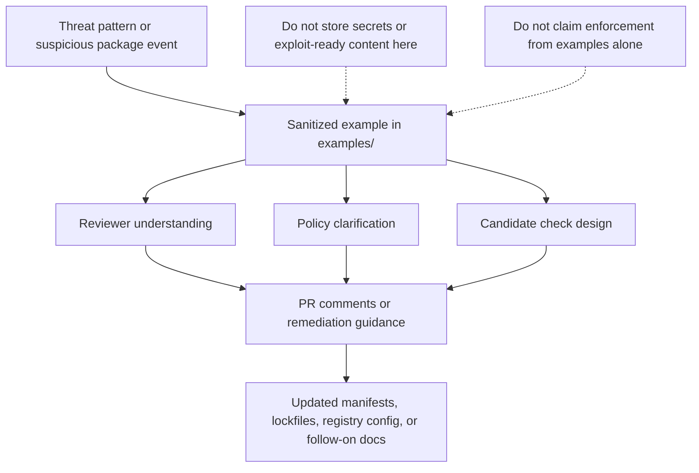

<!-- [KFM_META_BLOCK_V2]
doc_id: kfm://doc/NEEDS_VERIFICATION_UUID
title: KFM Dependency Confusion Examples
type: standard
version: v1
status: draft
owners: @bartytime4life (broad /docs/ CODEOWNERS coverage; sublane-specific owner NEEDS VERIFICATION)
created: NEEDS_VERIFICATION_DATE
updated: NEEDS_VERIFICATION_DATE
policy_label: NEEDS_VERIFICATION
related: [./lockfile-drift-attack.md, ./namespace-collision-basic.md, ../README.md, ../checks/README.md, ../policy/README.md, ../../README.md, ../../../README.md, ../../../../../README.md]
tags: [kfm, security, supply-chain, dependency-confusion, examples]
notes: [doc_id, created/updated dates, and policy label need verification; current public CODEOWNERS assigns broad /docs/ coverage to @bartytime4life, but sublane-specific ownership is not explicitly declared; current parent-lane subtree is synchronized at the visible example-file level, while higher-level security indexes still carry source-reported example drift.]
[/KFM_META_BLOCK_V2] -->

# KFM Dependency Confusion Examples

Reviewable, sanitized examples for package-origin ambiguity, namespace collision, and lockfile-drift scenarios under `docs/security/supply-chain/dependency-confusion/examples/`.

> [!IMPORTANT]
> **Status:** experimental  
> **Owners:** `@bartytime4life` (broad `/docs/` CODEOWNERS coverage; examples-lane owner `NEEDS VERIFICATION`)  
> **Repo fit:** `docs/security/supply-chain/dependency-confusion/examples/README.md` → upstream lane guide at [`../README.md`](../README.md), broader supply-chain and security context at [`../../README.md`](../../README.md) and [`../../../README.md`](../../../README.md), repo root at [`../../../../../README.md`](../../../../../README.md), adjacent reviewer and policy lanes at [`../checks/README.md`](../checks/README.md) and [`../policy/README.md`](../policy/README.md), downstream example files in this directory  
> 
> 
> 
>   
> **Quick jumps:** [Scope](#scope) · [Repo fit](#repo-fit) · [Accepted inputs](#accepted-inputs) · [Exclusions](#exclusions) · [Directory tree](#directory-tree) · [Quickstart](#quickstart) · [Usage](#usage) · [Diagram](#diagram) · [Tables](#tables) · [Task list](#task-list--quality-gates-and-definition-of-done) · [FAQ](#faq) · [Appendix](#appendix)

> [!NOTE]
> **Truth posture used here**
> - **CONFIRMED** — present in the current visible subtree or directly anchored in adjacent checked-in docs
> - **INFERRED** — conservative repo-aligned interpretation of how this subtree is meant to be used
> - **PROPOSED** — recommended documentation shape or maintenance move, not yet proven as mounted enforcement
> - **UNKNOWN / NEEDS VERIFICATION** — current reviewed evidence does not justify a harder claim

## Scope

This directory holds reviewer-facing examples that explain how dependency confusion can appear in KFM-adjacent package flows, lockfiles, namespaces, and registry selection.

Examples in this folder are for **inspection, education, review, and cross-linking**. They are **not** enforcement logic, policy bundles, CI gates, or proof that a control is mounted.

## Repo fit

| Fit | Path / link | Purpose |
| --- | --- | --- |
| Path | `docs/security/supply-chain/dependency-confusion/examples/README.md` | Directory guide for the examples sublane |
| Upstream | [`../README.md`](../README.md) · [`../../README.md`](../../README.md) · [`../../../README.md`](../../../README.md) · [`../../../../../README.md`](../../../../../README.md) | Dependency-confusion, supply-chain, security, and repo-root context |
| Downstream | [`./lockfile-drift-attack.md`](./lockfile-drift-attack.md) · [`./namespace-collision-basic.md`](./namespace-collision-basic.md) | Current example files in this directory |
| Adjacent | [`../checks/README.md`](../checks/README.md) · [`../policy/README.md`](../policy/README.md) | Where checks and policy guidance should live |

### Current alignment signals

| Signal | Status | Why it matters |
| --- | --- | --- |
| `examples/` currently exposes `README.md`, `lockfile-drift-attack.md`, and `namespace-collision-basic.md` | **CONFIRMED** | This README can link to real example files that are already present on public `main`. |
| The parent dependency-confusion README’s **confirmed current public-main subtree** now includes `examples/README.md`, `lockfile-drift-attack.md`, and `namespace-collision-basic.md` | **CONFIRMED** | The local example inventory and the parent lane’s current subtree are aligned at the visible file level. |
| Higher-level security indexes and source-reported appendix inventories still name `typosquat-examples.md` and deeper dependency-confusion files that are not visible in the current reviewed examples subtree | **CONFIRMED** + **NEEDS VERIFICATION** | Drift now lives above this lane. Keep queued files clearly marked as source-reported until they exist on the reviewed branch. |
| `CODEOWNERS` assigns broad `/docs/` coverage to `@bartytime4life`, but no narrower examples-lane owner is explicitly declared here | **CONFIRMED** + **NEEDS VERIFICATION** | A real owner signal exists, but sublane-specific ownership remains implicit. |

> [!WARNING]
> The live example inventory and the parent dependency-confusion lane are aligned on current public `main`. Remaining drift sits in higher-level security indexes and source-reported appendix-style inventories that still mention files such as `typosquat-examples.md` or deeper `checks/` and `policy/` pages not visible in the current reviewed subtree.

## Accepted inputs

- Sanitized dependency-confusion scenarios
- Namespace collision and package-origin ambiguity examples
- Lockfile drift examples
- Reviewable manifest or lockfile fragments with safe redaction
- Reviewer notes that explain **what should fail**, **what should be questioned**, or **what should be fixed**
- Cross-links to sibling `checks/` and `policy/` docs when those docs exist
- Small, non-runnable diff excerpts that help reviewers recognize package-source drift without revealing sensitive internals

## Exclusions

Do **not** put these here:

- Live credentials, tokens, registry secrets, or internal hostnames
- Exploit-ready payloads or unpublished incident evidence
- Actual enforcement code or policy bundles
- CI workflow logic
- Canonical incident response records
- Sensitive private package names unless they are already public and intentionally documented

Put those instead in the appropriate governed lane:

- enforcement or detection logic -> sibling `../checks/`
- rule language or exception handling -> sibling `../policy/`
- broader lane guidance -> parent `../README.md`
- runtime, release, or proof artifacts -> repo contracts, policy, tests, or runbook lanes, not this examples directory

## Directory tree

### CONFIRMED live subtree

```text
docs/security/supply-chain/dependency-confusion/examples/
├── README.md
├── lockfile-drift-attack.md
└── namespace-collision-basic.md
```

### Source-reported queue, but NEEDS VERIFICATION here

```text
docs/security/supply-chain/dependency-confusion/examples/
└── typosquat-examples.md
```

### Example registry

| Item | Status | Role | Notes |
| --- | --- | --- | --- |
| `README.md` | **CONFIRMED** | Directory contract | Explains what belongs here and what does not. |
| `lockfile-drift-attack.md` | **CONFIRMED** | Example scenario | Use for drift, provenance, and review conversations. |
| `namespace-collision-basic.md` | **CONFIRMED** | Example scenario | Use for namespace ambiguity and source-origin review. |
| `typosquat-examples.md` | **NEEDS VERIFICATION** | Source-reported queue item | Mentioned in higher-level security indexes and appendix-style inventories, but not present in the current live examples subtree. |

[Back to top](#kfm-dependency-confusion-examples)

## Quickstart

1. Start at [`../README.md`](../README.md) to understand the dependency-confusion lane.
2. Pick the closest existing example in this directory.
3. Confirm that the example filename, H1 title, and inbound links all agree.
4. Keep the content sanitized, reviewer-facing, and non-exploitative.
5. If the example implies a control, link to the sibling `checks/` or `policy` doc instead of embedding enforcement logic here.
6. If you add, rename, or retire an example, update the local registry, the parent lane tree, and any higher-level security indexes in the same change set.

### Reviewed-branch sanity pass

```bash
# 1) Recheck the current examples subtree
find docs/security/supply-chain/dependency-confusion/examples -maxdepth 1 -type f | sort

# 2) Recheck the lane, adjacent lanes, and higher-level indexes together
sed -n '1,260p' docs/security/README.md
sed -n '1,260p' docs/security/supply-chain/README.md
sed -n '1,260p' docs/security/supply-chain/dependency-confusion/README.md
sed -n '1,220p' docs/security/supply-chain/dependency-confusion/examples/README.md
sed -n '1,260p' docs/security/supply-chain/dependency-confusion/examples/lockfile-drift-attack.md
sed -n '1,220p' docs/security/supply-chain/dependency-confusion/examples/namespace-collision-basic.md

# 3) Find inventory drift before claiming a file is current
grep -RIn "namespace-collision-basic\|lockfile-drift-attack\|typosquat-examples" docs/security 2>/dev/null || true
```

## Usage

### Use these examples to

- explain attack shape during review
- illustrate what a suspicious package-resolution pattern looks like
- clarify why lockfiles, namespace boundaries, or registry precedence matter
- support future `checks/` and `policy/` docs without pretending those controls already exist
- give contributors a stable place to put sanitized, teachable scenarios

### Do not use these examples to

- prove that a detection rule runs in CI
- claim that policy enforcement is mounted
- substitute for fixture-backed validation
- store raw incident evidence that belongs in a governed review or operations lane

### Example chooser

| Start with this file | Use it when the review problem looks like | Common reviewer focus |
| --- | --- | --- |
| [`./namespace-collision-basic.md`](./namespace-collision-basic.md) | An internal-looking name is unscoped, scope binding is missing, or public/private namespace authority is ambiguous | Namespace ownership, registry binding, fallback-to-public risk |
| [`./lockfile-drift-attack.md`](./lockfile-drift-attack.md) | The manifest looks ordinary but the lockfile or resolved source changes materially | Resolved host, artifact identity, immutable install posture, provenance drift |
| `typosquat-examples.md` | Lookalike or spelling-adjacent package names become the issue | **SOURCE-REPORTED ONLY / NEEDS VERIFICATION** — add the file before treating it as a live example surface |

### Suggested reading path

| Goal | Start here | Then go to |
| --- | --- | --- |
| Understand the example lane | This README | [`../README.md`](../README.md) |
| Turn an example into review guidance | Example file | [`../policy/README.md`](../policy/README.md) |
| Turn an example into a detection or guardrail candidate | Example file | [`../checks/README.md`](../checks/README.md) |
| Reconcile filename or tree drift | This README | Parent and higher-level security READMEs in the same PR |

## Diagram



## Tables

### What belongs here vs elsewhere

| Content type | Belongs here? | Where it should go |
| --- | --- | --- |
| Sanitized attack narrative | Yes | `examples/` |
| Reviewer-facing manifest snippet | Yes, if redacted | `examples/` |
| Actual policy rule text | No | `../policy/` |
| Detection logic or hook design | No | `../checks/` |
| CI workflow YAML | No | repo workflow / test lanes |
| Incident evidence with sensitive detail | No | governed review / ops lane |
| Release proof or runtime trace | No | contracts, tests, runbooks, or audit lanes |

### Minimum quality bar for each example

| Criterion | Expectation |
| --- | --- |
| Scenario naming | Filename, H1, and parent links match |
| Safety | No secrets, no internal registry exposure unless intentionally public |
| Clarity | The attack shape is understandable without external context |
| Boundaries | The example does not masquerade as enforcement |
| Remediation | A plausible response or review action is included |
| Cross-linking | Related `checks/` or `policy/` docs are linked when available |
| Truthfulness | Implementation claims are labeled or avoided if not verified |

[Back to top](#kfm-dependency-confusion-examples)

## Task list — quality gates and definition of done

### Definition of done

- [ ] The example file is present in the live tree.
- [ ] The filename, title, and parent-directory references agree.
- [ ] The example is clearly sanitized and safe to publish.
- [ ] The example distinguishes **illustration** from **implemented control**.
- [ ] Any implied policy or detection follow-up is linked to the sibling lane, not duplicated here.
- [ ] The surrounding security docs are updated if filenames or tree shape changed.
- [ ] The parent dependency-confusion README, the higher-level security indexes, and the local example registry agree about live example files; any queued `typosquat-examples.md` reference is clearly marked as source-reported or removed.
- [ ] No new text quietly overclaims repo enforcement, CI coverage, or runtime behavior.

### Review checks

- [ ] Does the example describe **registry precedence**, **namespace ambiguity**, **package origin**, **lockfile drift**, or another real dependency-confusion shape?
- [ ] Does it explain why the condition is risky in supply-chain review?
- [ ] Does it avoid exploit-ready detail?
- [ ] Does it say what a reviewer should inspect next?
- [ ] Does it preserve KFM’s evidence-first and fail-closed posture?
- [ ] Does it stay synchronized with the parent dependency-confusion README, higher-level security indexes, and the local example registry?

## FAQ

### Are these examples supposed to be runnable?

No. This directory is for reviewer-facing and maintainer-facing examples. Runnable checks, fixtures, or CI behavior belong elsewhere.

### Can this folder contain real incident write-ups?

Only if they are deliberately sanitized and scoped for public or repo-safe documentation. Raw incident evidence should stay in the governed review or operations lane.

### Why keep examples separate from checks and policy?

Because examples explain *how the risk looks*; checks explain *how to detect or block it*; policy explains *how to decide and respond*. Collapsing all three makes the subtree harder to review and easier to overclaim.

### Why does this README still mention `typosquat-examples.md`?

Because higher-level security indexes and source-reported appendix inventories still name it. Treat it as queued or stale until the file is added on the reviewed branch or the indexes are cleaned up in the same change stream.

### Can a new example land before a matching check exists?

Yes — but the doc must not imply that enforcement already exists.

[Back to top](#kfm-dependency-confusion-examples)

## Appendix

<details>
<summary>Appendix — example authoring template</summary>

### Recommended example shape

```md
# <example title>

## Attack shape
What is happening?

## Why this matters
Why could this lead to dependency confusion or package-origin ambiguity?

## Observable signals
What should a reviewer notice in manifests, lockfiles, package names, registry settings, or build behavior?

## What should happen next
Which policy, check, or remediation path should be consulted?

## Safety note
What has been redacted, generalized, or intentionally left non-operational?
```

### Authoring checklist

- Prefer short, reviewable examples over long essays.
- Prefer synthetic or redacted package names unless a public example is necessary.
- Keep remediation language concrete.
- Avoid language that implies CI or policy is already wired unless that implementation is separately verified.
- When renaming files, update every inbound tree listing and quick link in the same PR.

</details>

[Back to top](#kfm-dependency-confusion-examples)
