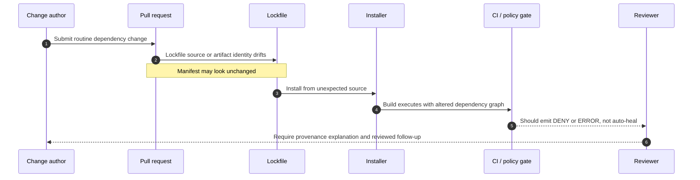

<!-- [KFM_META_BLOCK_V2]
doc_id: kfm://doc/NEEDS-VERIFICATION
title: Lockfile Drift Attack
type: standard
version: v1
status: draft
owners: @bartytime4life
created: 2025-11-30
updated: 2026-03-25
policy_label: NEEDS-VERIFICATION
related: [docs/security/README.md, docs/security/supply-chain/README.md, docs/security/supply-chain/dependency-confusion/README.md, docs/security/supply-chain/dependency-confusion/examples/README.md, docs/security/supply-chain/dependency-confusion/examples/namespace-collision-basic.md, docs/security/supply-chain/dependency-confusion/checks/README.md, docs/security/supply-chain/dependency-confusion/policy/README.md, .github/CODEOWNERS, contracts/README.md, policy/README.md, tests/README.md]
tags: [kfm, security, supply-chain, dependency-confusion, example]
notes: [doc_id and policy_label require verification before commit]
[/KFM_META_BLOCK_V2] -->

# Lockfile Drift Attack

Illustrative dependency-confusion example showing how a familiar dependency name can stay stable while the lockfile drifts to a different source of truth.

> [!IMPORTANT]
> **Status:** draft example  
> **Owners:** `@bartytime4life`  
>      
> **Quick jumps:** [Scope](#scope) · [Repo fit](#repo-fit) · [Accepted inputs](#accepted-inputs) · [Exclusions](#exclusions) · [Grounding summary](#grounding-summary) · [Attack shape](#attack-shape) · [Illustrative example diff](#illustrative-example-diff) · [Review cues](#review-cues) · [Expected fail-closed handling](#expected-fail-closed-handling) · [Task list](#task-list) · [FAQ](#faq) · [Appendix](#appendix)

## Scope

This example documents one narrow supply-chain failure mode:

A dependency still *looks* like the expected package during review, but the lockfile no longer points to the expected source, artifact, or registry boundary.

That matters in KFM because dependency identity is not just a package name. It is also provenance, artifact identity, review state, and whether the install path stays inside the governed build boundary.

This file is **illustrative**. It does **not** claim that the current KFM repository has already experienced this attack. It exists so maintainers can recognize the pattern, align future checks and policy notes, and keep documentation synchronized with any eventual enforcement.

## Repo fit

| Field | Value |
| --- | --- |
| Path | `docs/security/supply-chain/dependency-confusion/examples/lockfile-drift-attack.md` |
| Current public status | Present on public `main`; linked from [examples README](./README.md) |
| Upstream | [examples README](./README.md) · [dependency-confusion README](../README.md) · [supply-chain README](../../README.md) · [security README](../../../README.md) |
| Adjacent example | [namespace-collision-basic.md](./namespace-collision-basic.md) |
| Should move with | [`../checks/README.md`](../checks/README.md) · [`../policy/README.md`](../policy/README.md) · [`../../../../../contracts/README.md`](../../../../../contracts/README.md) · [`../../../../../policy/README.md`](../../../../../policy/README.md) · [`../../../../../tests/README.md`](../../../../../tests/README.md) |

## Accepted inputs

This example is the right place for:

- lockfile-only or lockfile-heavy diffs
- registry-host drift examples
- artifact-integrity drift examples
- reviewer cues for suspicious dependency provenance changes
- CI review notes for immutable or frozen install expectations
- companion examples that show how a harmless-looking PR can change the actual installed graph

## Exclusions

This file is **not** the right place for:

- a live incident report or confirmed KFM breach record
- authoritative policy bundles or machine-enforced reason-code registries
- package-manager installation tutorials
- registry bootstrap instructions
- secrets, real internal hostnames, or exact unpublished dependency names
- claims that a current merge gate, fixture set, or runtime control is already implemented unless re-verified in the repo

## Grounding summary

| Statement | Status | Why it matters here |
| --- | --- | --- |
| The parent dependency-confusion lane currently exposes separate `checks/`, `examples/`, and `policy/` subdirectories. | **CONFIRMED** | This example should stay aligned to the live subtree rather than inventing a new local structure. |
| `lockfile-drift-attack.md` is a current example file on public `main` and is linked from the examples sublane guide. | **CONFIRMED** | This page is a real checked-in trust surface, not just a hypothetical filename. |
| Broad `/docs/` coverage in current public `CODEOWNERS` points to `@bartytime4life`. | **CONFIRMED** | Supports the current owner marker without inventing narrower path ownership. |
| KFM docs are production-facing trust surfaces, not decorative prose. | **CONFIRMED** | The example should stay reviewer-facing, boundary-aware, and correction-friendly. |
| A concrete dependency-confusion merge gate is already live in the repo. | **NEEDS VERIFICATION** | Do not imply runnable enforcement that current public evidence does not prove. |
| Example-specific denial codes and fixture paths shown below are the current authoritative registry. | **PROPOSED** | Keep them clearly starter-only until sibling policy and test surfaces prove them. |

## Attack shape

A lockfile drift attack succeeds when review treats the **package name** as the trust anchor and ignores the **resolved source** and **artifact identity**.

Typical shape:

1. A pull request appears to make a normal dependency update, refactor, or routine maintenance change.
2. `package.json` looks unchanged or only lightly changed.
3. The lockfile quietly shifts the package to a different registry host, tarball, git source, mirror, or artifact hash.
4. The installer still succeeds.
5. Build and tests may still pass.
6. Unreviewed code enters the supply chain under a name reviewers think they already understand.

In KFM terms, that is not “just dependency churn.” It is a trust-boundary event inside the build path.



## Illustrative example diff

> [!NOTE]
> Package names, registry hosts, and hashes below are placeholders. The review pattern is the point; this block is not a claim about KFM’s current dependency graph.
>
> Field names shown here are **npm-style** for readability. Other package managers encode equivalent provenance differently.

```json
// package.json (appears unchanged)
{
  "dependencies": {
    "@kfm/geo-style": "1.4.2"
  }
}
```

```diff
# package-lock.json (illustrative)

 "node_modules/@kfm/geo-style": {
   "version": "1.4.2",
-  "resolved": "https://packages.kfm.example/@kfm/geo-style/-/geo-style-1.4.2.tgz",
-  "integrity": "sha512-AAAAAAAAAAAAAAAAAAAAAAAAAAAAAAAAAAAAAAAAAAA=",
+  "resolved": "https://registry.npmjs.org/@kfm/geo-style/-/geo-style-1.4.2.tgz",
+  "integrity": "sha512-BBBBBBBBBBBBBBBBBBBBBBBBBBBBBBBBBBBBBBBBBBB=",
   "license": "Apache-2.0"
 }
```

### Why this diff is dangerous

The semantic package name and version string appear stable, but the install provenance is not.

A reviewer who scans only `package.json` can miss that:

- the source host changed
- the downloaded artifact changed
- the trusted boundary for install resolution changed
- CI may now be building from a different upstream than the one previously reviewed

## Review cues

Use this table as the minimum reviewer lens.

| Reviewer cue | Why it matters | Minimum posture |
| --- | --- | --- |
| Manifest is unchanged but lockfile changed materially | Hidden re-resolution or source drift may have occurred | Treat as review-bearing, not cosmetic |
| Source host changed in lockfile | The dependency may now resolve from a different authority | Fail closed until provenance is explained |
| Integrity or checksum changed without a clear version explanation | The artifact identity changed even if the name stayed familiar | Fail closed until intentionality is clear |
| Registry config changed near the same PR | Lockfile drift may be the *result* of a larger trust-boundary change | Review lockfile and registry config together |
| CI would regenerate the lockfile during install | The pipeline can “heal” drift instead of exposing it | Treat as a control failure |
| Public package with an internal-looking name appears in the lockfile path | Namespace collision risk may be masquerading as ordinary churn | Escalate to dependency-confusion review |

> [!TIP]
> Review lockfile drift together with nearby config changes such as `.npmrc`, `.yarnrc.yml`, workspace registry settings, install scripts, and CI install flags. The dangerous change is often distributed across more than one file.

## Expected fail-closed handling

In KFM, the safe default is not “merge unless obviously broken.” The safe default is “block until provenance is explicit enough to review.”

| Condition | Minimum response | What should be surfaced |
| --- | --- | --- |
| Unexpected registry or tarball host | **Deny merge** | Diff excerpt, affected package list, reviewer note, explicit source explanation |
| Source provenance cannot be determined | **Error and stop** | Failing check output; do not rewrite the lockfile in CI |
| Intentional source migration | **Manual review required** | Explanation of why the source changed, approval note, synchronized updates to checks, policy, and examples |
| Lockfile drift found after release | **Correction path required** | Correction note, rollback or supersession path, visibility of affected builds and releases |

### PROPOSED starter reason strings

These are **starter** examples only. Do not treat them as the authoritative registry unless and until policy artifacts are verified.

- `LOCKFILE_PROVENANCE_DRIFT`
- `UNAPPROVED_REGISTRY_HOST`
- `NAMESPACE_COLLISION_RISK`
- `IMMUTABLE_INSTALL_BYPASS`

## What should change together

When this example becomes operationally important, these surfaces should usually move together:

| Surface | Why it should move together |
| --- | --- |
| `../checks/README.md` | Carries the concrete detection or reviewer checklist |
| `../policy/README.md` | Carries deny/exception language and approval expectations |
| `../../../../../contracts/README.md` | Explains where machine-checkable contract authority belongs |
| `../../../../../policy/README.md` | Connects the example to deny-by-default policy handling |
| `../../../../../tests/README.md` | Holds fixtures and expected deny/error examples once verified |
| CI install configuration | Prevents lockfile drift from being silently rewritten in automation |

## Task list

A strong version of this example is not just prose. It should eventually line up with neighboring trust objects.

- [ ] Keep this file explicitly illustrative unless a verified incident record is intentionally linked.
- [ ] Add or update a matching detection note under `../checks/`.
- [ ] Add or update matching deny / exception language under `../policy/`.
- [ ] Ensure the chosen package manager runs in immutable or frozen lockfile mode in CI.
- [ ] Add at least one negative fixture once the verified test surface is known.
- [ ] Keep terminology synchronized with KFM trust objects and fail-closed language.
- [ ] Avoid embedding real secrets, private registry URLs, or unreviewed internal package names.

## FAQ

### Is this the same thing as `namespace-collision-basic.md`?

No.

That companion example should explain the *name-collision* shape in its simplest form. This file focuses on the more review-hostile case where the **lockfile** becomes the attack carrier and the manifest may still look ordinary.

### Does a passing build clear the risk?

No.

A passing build only proves that the code executed. It does not prove that it came from the expected authority.

### Should CI ever “fix” the lockfile automatically here?

That is the wrong default for this example. Automatic lockfile rewrites make provenance drift harder to inspect and easier to normalize away.

### Why keep this as a separate example instead of folding it into policy?

Because reviewers often need a fast pattern library. The policy says what to do; the example shows what the dangerous diff looks like.

## Appendix

<details>
<summary>Appendix A — Reviewer prompts</summary>

Use these prompts in code review, incident triage, or after-action cleanup:

1. What changed in the lockfile that did **not** have a corresponding manifest explanation?
2. Did the source host, tarball URL, git reference, or artifact identity change?
3. Is the new source expected, approved, and documented?
4. Could this change be explained by a removed registry override or a workspace-level config drift?
5. Would the chosen CI install mode catch this change, or silently rewrite around it?
6. If this had already shipped, what correction, rollback, or supersession artifact would be needed?

</details>

<details>
<summary>Appendix B — Variant patterns worth documenting later</summary>

Future example files in this lane may also cover:

- lockfile drift triggered by workspace root config changes
- lockfile drift plus postinstall script execution
- public mirror fallback after private registry outage
- PRs that change both package-manager version and lockfile format
- “benign” dependency refreshes that actually re-resolve an internal package to a public source

</details>

[Back to top](#lockfile-drift-attack)
