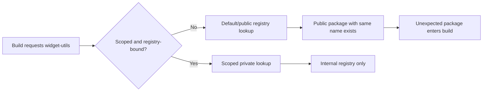

<!-- [KFM_META_BLOCK_V2]
doc_id: kfm://doc/<uuid-NEEDS-ASSIGNMENT>
title: Namespace Collision (Basic)
type: standard
version: v1
status: draft
owners: <owners-NEEDS-VERIFICATION>
created: <YYYY-MM-DD-NEEDS-SET>
updated: <YYYY-MM-DD-NEEDS-SET>
policy_label: <policy_label-NEEDS-VERIFICATION>
related: [<related-paths-NEEDS-VERIFICATION>]
tags: [kfm]
notes: [illustrative npm-focused dependency-confusion example; mounted repo tree, manifests, lockfiles, and CI workflows were not directly visible in this session]
[/KFM_META_BLOCK_V2] -->

# Namespace Collision (Basic)

Minimal, non-live example of a dependency-confusion path caused by an unscoped package name.

> [!IMPORTANT]
> This file is **illustrative**. The current-session workspace did **not** expose a mounted repo tree, `package.json`, lockfiles, `.npmrc`, or CI workflows. Package names, registries, hosts, and paths below are examples, not verified KFM implementation facts.

| Aspect | Status | Notes |
|---|---|---|
| Threat class | CONFIRMED | Namespace collision / dependency confusion is a recognized package-resolution risk. |
| Example ecosystem | PROPOSED | npm/Node.js is used here because scope and registry rules are explicit and relevant to the broader KFM web/tooling corpus. |
| KFM repo package manager | UNKNOWN | No mounted package manifests or lockfiles were directly inspected in this session. |
| Example names and registries | ILLUSTRATIVE | `widget-utils`, `@kfm/widget-utils`, and the registry hosts below are placeholders. |

## Threat in one sentence

A namespace collision happens when a build expects an internal package such as `widget-utils`, but the dependency is referenced in a way that allows the package manager to resolve a public package with the same name instead.

## Basic collision flow



## Vulnerable shape

### `package.json`

```json
{
  "name": "kfm-example-app",
  "private": true,
  "dependencies": {
    "widget-utils": "^1.4.2"
  }
}
```

### Ambiguous registry config

```ini
registry=https://registry.npmjs.org/
# No scope-to-registry mapping.
# No rule that forces internal packages into a private namespace.
```

### What goes wrong

1. The dependency name is unscoped.
2. The installer falls back to the default registry.
3. A public package with the same name can satisfy the request.
4. The build receives code from the wrong trust boundary.

> [!NOTE]
> The failure here is **resolution ambiguity**, not package functionality. This example deliberately omits any malicious payload mechanics.

## Tell-tale lockfile clue

If a reviewer believes `widget-utils` is internal-only, a lockfile entry like the following is already a failure signal:

```text
"node_modules/widget-utils": {
  "version": "1.4.2",
  "resolved": "https://registry.npmjs.org/widget-utils/-/widget-utils-1.4.2.tgz"
}
```

The exact lockfile format varies by tool and version, but the review question stays the same: **did the dependency resolve from the intended trust boundary?**

## Safer shape

### Scoped dependency

```json
{
  "name": "kfm-example-app",
  "private": true,
  "dependencies": {
    "@kfm/widget-utils": "1.4.2"
  }
}
```

### Scope-bound registry config

```ini
registry=https://registry.npmjs.org/
@kfm:registry=https://packages.example.internal/npm/
```

### Why this is materially better

- `@kfm/widget-utils` is namespaced.
- The `@kfm` scope is bound to one registry.
- Public and private trust zones are no longer competing for the same dependency name.
- Reviewers can reason about intended source more directly from the manifest and config.

## Minimal signals reviewers should look for

| Signal | Why it matters | Expected result |
|---|---|---|
| Unscoped internal-looking package names | Highest namespace-collision risk | Reject or rename into an owned scope |
| Missing scope-to-registry mapping | Resolution can drift to the default registry | Add explicit `@scope:registry=` rule |
| Lockfile resolves to a public host for an internal package | Trust boundary already crossed | Fail review and regenerate from the correct source |
| Mixed public/private package names without policy | Human review becomes guesswork | Add a package-source allowlist or equivalent registry policy |
| CI installs without registry assertions | Build may succeed for the wrong reason | Add merge-blocking verification |

## KFM-aligned control expectations

This example fits KFM only if the controls are treated as governed artifacts rather than informal team habits.

1. **Deny by default** for internal package namespaces.
2. **Merge-blocking checks** for manifest, lockfile, and registry-configuration drift.
3. **Visible proof** in CI that the resolved package source matched the intended trust boundary.
4. **Correction path** when a bad package source entered a build, including lockfile rotation and release supersession.

## Minimal review checklist

- [ ] Internal packages use an owned scope.
- [ ] Scope-to-registry mapping is explicit.
- [ ] Lockfile does not resolve internal packages from a public host.
- [ ] CI fails closed when registry/source expectations are violated.
- [ ] Release notes or a proof pack capture the dependency-source decision.

## What remains to verify in the mounted repo

<details>
<summary>Open verification items</summary>

Because the mounted workspace in this session was PDF-only, the following remain unverified:

- actual package manager in use (`npm`, `pnpm`, `yarn`, or other)
- presence or absence of `.npmrc` files
- current package naming conventions
- lockfile host patterns
- GitHub Actions or other CI checks for registry/source enforcement
- any existing supply-chain policy bundles, fixtures, or examples near this path

</details>

## Short takeaway

Use this example to document the **shape of the failure**: ambiguous names plus ambiguous registry routing. In KFM terms, the fix is not just “use scopes”; it is to make package-source intent reviewable, testable, and merge-blocking.
