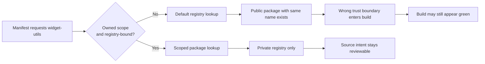
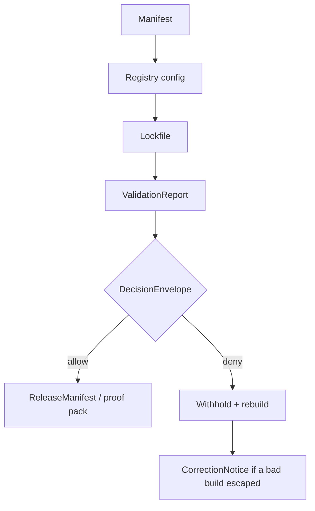

<!-- [KFM_META_BLOCK_V2]
doc_id: kfm://doc/<uuid-NEEDS-ASSIGNMENT>
title: Namespace Collision (Basic)
type: standard
version: v1
status: draft
owners: <owners-NEEDS-VERIFICATION>
created: <YYYY-MM-DD-NEEDS-SET>
updated: <YYYY-MM-DD-NEEDS-SET>
policy_label: <policy_label-NEEDS-VERIFICATION>
related: [<docs/security/supply-chain/dependency-confusion/examples/README.md-NEEDS-REPO-VERIFICATION>]
tags: [kfm]
notes: [illustrative npm-focused dependency-confusion example; direct repo manifests, lockfiles, .npmrc files, and CI workflow YAML were not directly inspected in this session; attached corpus supports KFM contract-and-proof posture but not current repo enforcement specifics]
[/KFM_META_BLOCK_V2] -->

# Namespace Collision (Basic)

Illustrative, non-live example of how ambiguous package naming and ambiguous registry routing can cross a software trust boundary.

> [!NOTE]
> This file documents the **shape of the failure**, not a verified live KFM incident.

> [!IMPORTANT]
> In this session, no mounted repo checkout, `package.json`, lockfiles, `.npmrc`, or CI workflow YAML were directly inspected. Package names, scopes, registry hosts, paths, and enforcement details below are therefore **illustrative unless later reverified**.

> [!TIP]
> Read this example as a review aid for **manifest + registry config + lockfile + validation output**, not as a claim about KFM’s current implementation state.


**Quick jump:** [Scope](#scope) · [Repo fit](#repo-fit) · [Failure shape](#failure-shape) · [Safer shape](#safer-shape) · [Governed posture](#kfm-aligned-governed-posture) · [Checklist](#review-checklist) · [Verification backlog](#what-still-needs-verification)

## Scope

This example is intentionally narrow. It shows one basic dependency-confusion pattern: an internal-looking package name is requested without an owned scope or explicit registry binding, so the build can resolve from the wrong trust boundary.

### Status at a glance

| Aspect | Status | Notes |
|---|---|---|
| Threat class | CONFIRMED | Namespace collision / dependency confusion is a real package-resolution risk. |
| KFM doctrinal fit | CONFIRMED | KFM doctrine favors explicit contracts, fail-closed gates, visible proof objects, and machine-readable decision outcomes before promotion. |
| Example ecosystem | PROPOSED | npm is used here because scope and registry behavior are easy to show compactly. |
| Current KFM package manager / registry posture | UNKNOWN | No manifests, lockfiles, or registry configuration were directly inspected in this session. |
| Example names and hosts | PROPOSED | `widget-utils`, `@kfm/widget-utils`, and the registry hosts below are placeholders. |

### What belongs here

- Small, illustrative examples of dependency-source ambiguity.
- Review cues drawn from package manifests, registry config, lockfiles, and validation output.
- Contract-oriented guidance that maps the failure to KFM proof objects.

### What does **not** belong here

- Verified incident writeups for a real KFM repository state.
- Claims about current CI enforcement, package manager choice, or registry hosts unless reverified from live repo evidence.
- Payload mechanics, exploitation walkthroughs, or other offensive detail beyond the review-relevant failure shape.

[Back to top](#namespace-collision-basic)

## Repo fit

| Field | Value |
|---|---|
| Intended doc role | Supply-chain example / review aid |
| Intended path | `<docs/security/supply-chain/dependency-confusion/examples/namespace-collision-basic.md-NEEDS-REPO-VERIFICATION>` |
| Likely upstream | `<docs/security/supply-chain/dependency-confusion/examples/README.md-NEEDS-REPO-VERIFICATION>` |
| Likely downstream | Validation rules, CI checks, release proof artifacts, and reviewer runbooks that consume or reference this example **NEEDS VERIFICATION** |

> [!WARNING]
> The repo path above is a **review placeholder**, not a confirmed mounted path.

## Failure shape

A namespace collision happens when a build intends to use an internal package such as `widget-utils`, but the dependency is referenced in a way that still allows the package manager to resolve a public package with the same name instead.

The core failure is **resolution ambiguity**. The example below deliberately avoids payload mechanics and focuses on the boundary mistake that lets the wrong package source enter a build.



### Vulnerable shape

#### Manifest

```json
{
  "name": "kfm-example-app",
  "private": true,
  "dependencies": {
    "widget-utils": "^1.4.2"
  }
}
```

#### Ambiguous registry config

```ini
registry=https://registry.npmjs.org/
# No scope-to-registry mapping.
# No rule that forces internal packages into an owned namespace.
```

#### Why this fails

1. The dependency name is unscoped.
2. The installer falls back to the default registry.
3. A public package with the same name can satisfy the request.
4. The build receives code from the wrong trust boundary.

### Where reviewers should look first

| Evidence surface | Review question | Failure signal |
|---|---|---|
| Manifest | Is the dependency name clearly internal and clearly namespaced? | Internal-looking package appears unscoped. |
| Registry config | Is the internal scope explicitly bound to one registry? | Default public registry remains the implicit fallback. |
| Lockfile | Where did the installer actually resolve from? | `resolved` points at a public host for an internal-only dependency. |
| Validation output | Did the pipeline fail closed? | Resolution issue is logged as a warning instead of a denial. |
| Release proof | Can the release prove which package source entered the build? | Package-source decision is absent from proof artifacts. |

## Tell-tale lockfile clue

If a reviewer believes `widget-utils` is internal-only, a lockfile entry like the following is already a failure signal:

```text
"node_modules/widget-utils": {
  "version": "1.4.2",
  "resolved": "https://registry.npmjs.org/widget-utils/-/widget-utils-1.4.2.tgz"
}
```

The exact lockfile format varies by tool and version, but the review question does not: **did the dependency resolve from the intended trust boundary?**

## Simulated detection output

> [!NOTE]
> The output below is illustrative. It shows the kind of failure a governed review path should emit. It is **not** a current-session KFM CI log.

```text
FAIL validation.schema_failed
detail: internal-looking dependency is unscoped

FAIL policy.denied
detail: resolved package source crossed the intended trust boundary
package: widget-utils
resolved: https://registry.npmjs.org/widget-utils/-/widget-utils-1.4.2.tgz
obligation: withhold
```

[Back to top](#namespace-collision-basic)

## Safer shape

### Scoped dependency

```json
{
  "name": "kfm-example-app",
  "private": true,
  "dependencies": {
    "@kfm/widget-utils": "1.4.2"
  }
}
```

### Scope-bound registry config

```ini
registry=https://registry.npmjs.org/
@kfm:registry=https://packages.example.internal/npm/
```

### Why this is materially better

- `@kfm/widget-utils` is namespaced.
- The `@kfm` scope is bound to one registry.
- Public and private trust zones are no longer competing for the same dependency name.
- Reviewers can reason about intended source directly from the manifest and config.

### Review flow after hardening



## Signals reviewers should look for

| Signal | Why it matters | Expected response |
|---|---|---|
| Unscoped internal-looking package names | Highest namespace-collision risk | Reject or rename into an owned scope |
| Missing scope-to-registry mapping | Resolution can drift to the default registry | Add explicit `@scope:registry=` rule |
| Lockfile resolves an internal-only dependency from a public host | Trust boundary has already been crossed | Fail review and regenerate from the intended source |
| Mixed public/private naming without a declared source policy | Human review becomes guesswork | Add an allowlist, registry policy, or equivalent contract surface |
| Installs succeed without source assertions | Build can pass for the wrong reason | Add merge-blocking verification |

## KFM-aligned governed posture

In KFM terms, this is not just a package-manager hygiene issue. It is a **publication-trust issue**: the build must prove where code came from before later surfaces can trust what they are serving.

### Governed artifact families touched by this failure mode

| Governed artifact family | What it should carry |
|---|---|
| SourceDescriptor or equivalent source contract | Owned namespace, approved registry family, access model, and validation intent for internal package sources |
| ValidationReport | Manifest, registry-config, and lockfile source checks with machine-readable failures |
| DecisionEnvelope | Allow/deny result plus reason and obligation codes when the wrong registry resolves |
| ReleaseManifest / proof pack | Exact resolved package sources that entered the release candidate |
| CorrectionNotice | Supersession path if a build or release consumed the wrong source and must be replaced |

### Minimal control expectations

1. Internal packages use an owned scope.
2. Scope-to-registry mapping is explicit.
3. Dependency-source checks are merge-blocking, not advisory.
4. Lockfiles are reviewed as trust-boundary evidence, not just install artifacts.
5. A bad resolution path has a correction path: lockfile rotation, rebuild, and visible supersession where needed.

### KFM corpus-aligned hardening cues

> [!IMPORTANT]
> The controls in this subsection are **PROPOSED hardening cues**, not confirmed mounted repo enforcement.

| Control | Status | Why it helps |
|---|---|---|
| Disable global registry fallbacks in CI/CD and production | PROPOSED | Removes the quiet path by which public resolution can substitute for intended internal sources. |
| Whitelist approved internal registries and mirrors | PROPOSED | Makes resolution intent machine-checkable rather than inferential. |
| Reject unscoped public modules in CI/CD for first-party lanes | PROPOSED | Converts an ambiguous naming pattern into a hard gate. |
| Require exact version pinning plus integrity/hash review | PROPOSED | Reduces drift and keeps lockfile review focused on trust-bearing changes. |
| Validate provenance, SBOM fragments, and build attestations where used | PROPOSED | Extends source review into release-proof and supply-chain evidence surfaces. |

[Back to top](#namespace-collision-basic)

## Reviewer guidance

- Never infer “internal” solely from a package’s name.
- Treat a public-host resolution for an internal-only dependency as a **hard failure**, not a warning.
- Keep source intent visible in the manifest, registry config, and lockfile together.
- Do not claim current KFM enforcement details until manifests, lockfiles, and workflow YAML are directly reverified.

## Review checklist

- [ ] Internal packages use an owned scope.
- [ ] Scope-to-registry mapping is explicit.
- [ ] Lockfile does not resolve internal packages from a public host.
- [ ] Validation fails closed when source-boundary expectations are violated.
- [ ] Release notes or proof artifacts capture the dependency-source decision when it matters.
- [ ] Example names and registry hosts are visibly marked as illustrative placeholders.
- [ ] No paragraph implies current KFM repo enforcement without direct verification.

## Definition of done for this example

- The example stays clearly labeled as **illustrative** and **non-live**.
- The failure path and safer path are both legible in under a minute.
- Reviewers can tell which artifacts to inspect first.
- KFM proof-object terminology stays intact.
- Every repo-specific claim that remains unverified is visibly marked.

## What still needs verification

<details>
<summary>Open verification backlog</summary>

The current session did not directly expose a mounted repo checkout, so the following remain unverified:

- actual package manager in use (`npm`, `pnpm`, `yarn`, or other)
- presence or absence of `.npmrc` files
- current internal package naming conventions
- lockfile host patterns
- whether any workflow YAML currently enforces dependency-source checks
- whether the intended path really is `docs/security/supply-chain/dependency-confusion/examples/namespace-collision-basic.md`
- whether broader supply-chain policy docs already define namespace, registry, and attestation requirements for this example lane

</details>

<details>
<summary>FAQ</summary>

### Why use npm in the example?

Because scope-to-registry behavior is compact to show in one file. This does **not** prove KFM currently uses npm.

### Does this example prove a live dependency-confusion incident happened in KFM?

No. It documents a failure shape and a review posture only.

### Why keep the hostnames generic?

Because the current session did not directly verify live registry hosts.

</details>

## Takeaway

Use this example to document the **shape of the failure**: ambiguous names plus ambiguous registry routing. In KFM terms, the fix is not only “use scopes.” The fix is to make package-source intent explicit, reviewable, testable, and fail-closed before promotion.

[Back to top](#namespace-collision-basic)
