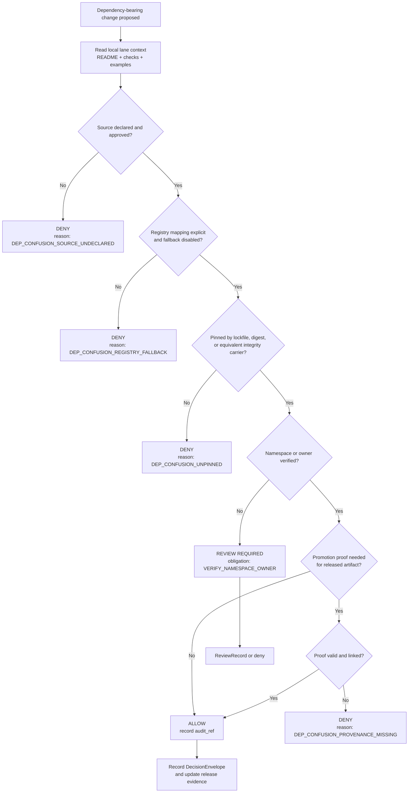

<!-- [KFM_META_BLOCK_V2]
doc_id: kfm://doc/NEEDS-VERIFICATION-UUID
title: Dependency Confusion Policy
type: standard
version: v1
status: draft
owners: NEEDS_VERIFICATION
created: YYYY-MM-DD
updated: YYYY-MM-DD
policy_label: NEEDS_VERIFICATION
related: [docs/security/README.md, docs/security/supply-chain/README.md, docs/security/supply-chain/dependency-confusion/README.md, policy/README.md, contracts/README.md, schemas/README.md, .github/workflows/README.md]
tags: [kfm, security, supply-chain, dependency-confusion, policy]
notes: [Current public-main evidence confirms this file and the wider dependency-confusion subtree exist; the policy subdirectory itself appears README-only on public main, so fixtures, exceptions, and executable enforcement paths below remain proposed until the checked-out branch is reverified.]
[/KFM_META_BLOCK_V2] -->

# Dependency Confusion Policy

Policy rules for preventing untrusted package or artifact resolution from outranking approved KFM sources.

> [!IMPORTANT]
> **Status:** experimental  
> **Owners:** NEEDS VERIFICATION  
>       
> **Repo fit:** `docs/security/supply-chain/dependency-confusion/policy/README.md`  
> **Quick jumps:** [Scope](#scope) · [Repo fit](#repo-fit) · [Current verified snapshot](#current-verified-snapshot) · [Accepted inputs](#accepted-inputs) · [Directory tree](#directory-tree) · [Quickstart](#quickstart) · [Core policy rules](#core-policy-rules) · [Definition of done](#definition-of-done) · [FAQ](#faq)

> [!NOTE]
> **Evidence posture for this file:** KFM's deny-by-default, contract-first, trust-membrane, proof-object, correction-visible, and finite-outcome doctrine is **CONFIRMED** in current project doctrine and adjacent repo docs. The dependency-confusion-specific rule set, obligation codes, fixture layout, and exception record shape below remain a mix of **CONFIRMED lane intent** and **PROPOSED executable specialization** until the checked-out branch confirms actual package-manager, registry, CI, and policy-bundle implementation details.

## Scope

This policy covers **dependency confusion** inside Kansas Frontier Matrix (KFM): any condition in which build, install, publish, or runtime resolution could prefer an unintended public, mirror, or wrong-scope package or artifact over the source KFM meant to trust.

In KFM, this is not a narrow package-manager nuisance. It is a trust-boundary failure. Source selection, namespace ownership, lockfile integrity, release evidence, and correction posture all affect whether a dependency change remains inspectable and governed.

This policy applies to every dependency-bearing surface that can change trust posture, including:

- package manifests and lockfiles
- registry and mirror configuration
- OCI artifact references used by build, release, or delivery lanes
- bootstrap and installer scripts
- vendored third-party code admitted into the repo
- automation that rewrites dependency coordinates, lock material, or provenance metadata

[Back to top](#dependency-confusion-policy)

## Repo fit

| Relation | Path | Role |
| --- | --- | --- |
| This file | `docs/security/supply-chain/dependency-confusion/policy/README.md` | Policy-specialization README for one supply-chain failure mode. |
| Immediate parent | [`../README.md`](../README.md) | Lane-level README for dependency confusion as a whole. |
| Adjacent sibling | [`../checks/README.md`](../checks/README.md) | Reviewer-facing check families and inspection cues. |
| Adjacent sibling | [`../examples/README.md`](../examples/README.md) | Sanitized scenarios and teaching cases. |
| Security upstream | [`../../../README.md`](../../../README.md) | Security and supply-chain doctrine entry point. |
| Supply-chain upstream | [`../../README.md`](../../README.md) | Build, artifact, and release trust subtree entry point. |
| Root policy upstream | [`../../../../../policy/README.md`](../../../../../policy/README.md) | Repo-wide deny-by-default policy posture. |
| Contract upstream | [`../../../../../contracts/README.md`](../../../../../contracts/README.md) | Machine-readable contract home. |
| Schema-adjacent upstream | [`../../../../../schemas/README.md`](../../../../../schemas/README.md) | Schema-surface caution and authority boundary notes. |
| Workflow upstream | [`../../../../../.github/workflows/README.md`](../../../../../.github/workflows/README.md) | CI and governed automation lane; README-only evidence on public main. |

## Current verified snapshot

This section is intentionally narrow. It records what the current public-main evidence supports without implying more branch-local implementation than was actually reverified.

| Surface | Current public-main signal | Why it matters here |
| --- | --- | --- |
| `docs/security/supply-chain/dependency-confusion/policy/README.md` | Present and substantive | This file should be revised in place, not replaced by a parallel doc. |
| `docs/security/supply-chain/dependency-confusion/README.md` | Present and substantive | The parent lane already frames dependency confusion as a trust-boundary problem. |
| `docs/security/supply-chain/dependency-confusion/checks/README.md` | Present and substantive | Check guidance belongs in `checks/`, not here. |
| `docs/security/supply-chain/dependency-confusion/examples/README.md` | Present and substantive | Scenarios and reviewer examples belong in `examples/`, not here. |
| `docs/security/supply-chain/dependency-confusion/examples/lockfile-drift-attack.md` | Present | Lockfile drift is already treated as a concrete scenario nearby. |
| `docs/security/supply-chain/dependency-confusion/examples/namespace-collision-basic.md` | Present | Namespace collision is already treated as a concrete scenario nearby. |
| `docs/security/supply-chain/dependency-confusion/policy/` inventory | `README.md` only | Deeper local fixtures, exception records, or executable bundles are not yet public-main facts here. |
| `policy/README.md` | Present and substantive | Repo-wide deny-by-default policy posture remains upstream of this lane. |
| `contracts/README.md` | Present and substantive | Contract families live upstream, but machine-readable files are not yet visible here. |
| `schemas/README.md` | Present and substantive | Avoid creating a parallel schema authority in this subtree. |
| `.github/workflows/README.md` | Present and substantive | Workflow intent is documented, but active checked-in YAML is not evidenced on current public main. |

## Accepted inputs

Accepted inputs for this directory and policy surface include:

| Input type | Belongs here | Typical examples |
| --- | --- | --- |
| Policy rules | Yes | deny/allow/review criteria for dependency source selection |
| Decision grammar | Yes | reason codes, obligation codes, exception semantics |
| Registry precedence rules | Yes | explicit source mapping, fallback disablement, scope rules |
| Namespace ownership requirements | Yes | private/internal name review, collision handling |
| Review criteria | Yes | when a dependency change requires human review |
| Proof requirements | Yes | lockfile/digest/provenance expectations before merge or promotion |
| Exception records | Yes | time-boxed waivers with owner, expiry, compensating controls, rollback path |
| Link-out guidance to adjacent lanes | Yes | references to `../checks/` and `../examples/` without duplicating them |

## Exclusions

This README does **not** replace the following:

| Out of scope here | Where it should live instead |
| --- | --- |
| Repository-wide policy posture | `policy/README.md` |
| Machine-readable contract schemas | `contracts/` |
| Parallel schema home or duplicate schema registry | `schemas/` should remain cautionary/adjacent unless authority is explicitly unified |
| Reviewer checklists and inspection mechanics | `../checks/README.md` |
| Sanitized scenarios and attack stories | `../examples/README.md` |
| CI implementation details and merge-gate wiring | `.github/workflows/README.md` and real workflow files when present |
| Secrets handling, IAM, host firewall, or runtime isolation | broader security/runtime docs |
| General vulnerability management and patch cadence | dedicated vulnerability / maintenance docs |

## Directory tree

### Current public-main inventory

```text
docs/security/supply-chain/dependency-confusion/policy/
└── README.md
```

### Proposed growth shape

The shape below is **PROPOSED**. It is a good local evolution pattern if this lane grows beyond one README, but it is not asserted as current fact.

```text
docs/security/supply-chain/dependency-confusion/policy/
├── README.md
├── fixtures/                 # PROPOSED
│   ├── valid/                # PROPOSED
│   └── invalid/              # PROPOSED
└── exceptions/               # PROPOSED time-boxed waiver records
```

[Back to top](#dependency-confusion-policy)

## Quickstart

Use this order when a pull request adds, removes, renames, or retargets a dependency:

1. Read the parent lane README and the adjacent `checks/` and `examples/` READMEs first.
2. Confirm the source is explicit, approved, and unambiguous.
3. Confirm resolution will not silently fall back to a public or wrong-scope registry.
4. Confirm the dependency is pinned by lockfile, digest, or equivalent integrity carrier.
5. Confirm namespace ownership or steward approval for any internal/private name.
6. Confirm required decision records, fixtures, and release proof expectations are updated before merge or promotion.

### Repo inspection snippet

```bash
sed -n '1,220p' docs/security/supply-chain/dependency-confusion/README.md
sed -n '1,220p' docs/security/supply-chain/dependency-confusion/checks/README.md
sed -n '1,220p' docs/security/supply-chain/dependency-confusion/examples/README.md
sed -n '1,260p' policy/README.md
sed -n '1,260p' contracts/README.md
sed -n '1,220p' .github/workflows/README.md
find docs/security/supply-chain/dependency-confusion/policy -maxdepth 2 -print | sort
```

A change that fails a required gate should not merge “for now” with an informal promise to fix it later.

## Usage

Use this policy when any of the following happens:

- a new dependency is introduced
- an existing dependency source changes
- a registry, mirror, or package index is added or modified
- a build or publish lane begins consuming OCI-hosted artifacts
- a private/internal package name is introduced or renamed
- a vendoring exception is requested
- a release lane changes how promoted artifacts are pinned, signed, or verified

### Reviewer workflow

1. Check whether the source path is explicit.
2. Check whether resolution is deterministic.
3. Check whether the dependency identity is pinned.
4. Check whether the package or artifact name could collide with an unintended external source.
5. Check whether the PR includes the required proof objects or fixture updates.
6. Record the result in machine-readable decision grammar where the repo supports it.

### Exception workflow

Exceptions should be rare, explicit, and time-boxed. A dependency-confusion exception should never be a silent merge. It should carry a clear owner, expiry, compensating controls, and rollback path.

> [!WARNING]
> Digest pinning, SBOMs, signatures, and attestations reduce unnoticed substitution **after** source selection, but they do not by themselves prevent dependency confusion. The first gate is still explicit source mapping, namespace ownership review, and visible resolver behavior.

## Diagram



## Tables

### Adjacent lane boundaries

| Lane | What belongs there | What should not be duplicated here |
| --- | --- | --- |
| `../checks/` | inspection cues, observable signals, reviewer-facing check families | policy authority, exception semantics, contract ownership |
| `../examples/` | sanitized scenarios, attack stories, reviewer drills | normative policy statements or enforcement claims |
| `../../../../../policy/` | repo-wide deny-by-default grammar, outcome semantics, broader policy seams | dependency-confusion-specific examples or sublane-only rules |
| `../../../../../contracts/` | `DecisionEnvelope`, `ReviewRecord`, `ReleaseManifest`, `EvidenceBundle`, `CorrectionNotice` shape authority | prose-only lane doctrine |
| `.github/workflows/` | automation wiring, merge checks, CI realization | policy meaning or contract semantics |

### Core policy rules

| Rule | Required posture | Expected proof object(s) | Status |
| --- | --- | --- | --- |
| Explicit source mapping | Every dependency-bearing lane must resolve through an explicit approved source mapping rather than ambiguous default discovery. | config record, manifest, or workflow evidence | **PROPOSED** |
| No silent public fallback | Internal or private names must not be allowed to fall through to unintended public registries or mirrors. | policy fixture + review evidence | **PROPOSED** |
| Pin before trust | Merge or promotion requires a lockfile, digest, or equivalent integrity carrier appropriate to the ecosystem. | lockfile, digest, or equivalent | **PROPOSED** |
| Namespace ownership review | New internal names, renamed internal packages, or reused third-party names require explicit review before adoption. | `ReviewRecord` or equivalent | **PROPOSED** |
| Decision grammar required | Denials, reviews, exceptions, and promotions should emit stable reason codes and obligation codes rather than prose-only notes. | `DecisionEnvelope` | **CONFIRMED doctrine / PROPOSED lane specialization** |
| Promotion by digest for OCI artifacts | Where OCI registries are used, mutable tags are not authoritative release identity. Promotion should bind to digests. | digest, attestation, release proof | **PROPOSED** |
| Fixture-backed enforcement | Policy should be testable with valid/invalid fixtures and merge-time checks. | `fixtures/valid`, `fixtures/invalid`, policy tests | **CONFIRMED repo direction / PROPOSED local realization** |
| Time-boxed exceptions only | Exceptions must have owner, reason, expiry, compensating controls, and rollback path. | exception record + review evidence | **PROPOSED** |

### Enforcement and gates

| Phase | Minimum check | Fail state | Outcome |
| --- | --- | --- | --- |
| PR review | source mapping and namespace check | ambiguous source or unowned internal name | deny or require review |
| Merge gate | fixture + policy validation | valid/invalid cases not updated or gate fails | block merge |
| Build | lockfile / digest materialization | unpinned dependency or mutable-only reference | fail closed |
| Promotion | proof verification for promoted artifacts | missing digest, attestation, or linked proof where required | block promotion |
| Correction | visible rollback / supersession path | bad package admitted or wrong source promoted | correction notice / rollback |

### Decision grammar

These starter codes are **PROPOSED lane-specialization content**. Final names should converge with repo-wide registries rather than drifting into parallel vocabularies.

| Type | Code | Use when |
| --- | --- | --- |
| Reason code | `DEP_CONFUSION_SOURCE_UNDECLARED` | source or registry mapping is absent or ambiguous |
| Reason code | `DEP_CONFUSION_REGISTRY_FALLBACK` | resolution can fall back to an unintended public or wrong-scope source |
| Reason code | `DEP_CONFUSION_NAMESPACE_UNVERIFIED` | package or artifact name ownership is unverified |
| Reason code | `DEP_CONFUSION_UNPINNED` | no lockfile, digest, or equivalent integrity carrier is present |
| Reason code | `DEP_CONFUSION_PROVENANCE_MISSING` | promoted artifact requires proof that is absent or unverifiable |
| Reason code | `DEP_CONFUSION_EXCEPTION_EXPIRED` | a time-boxed waiver has lapsed |
| Obligation code | `DISABLE_PUBLIC_FALLBACK` | configure deterministic source mapping before merge |
| Obligation code | `VERIFY_NAMESPACE_OWNER` | add steward approval or ownership evidence |
| Obligation code | `PIN_APPROVED_SOURCE` | add lockfile, digest, or equivalent |
| Obligation code | `ADD_POLICY_FIXTURES` | add or update valid/invalid fixtures |
| Obligation code | `RECORD_DIGEST_AND_PROOF` | record digest and linked proof in release evidence |
| Obligation code | `TIMEBOX_EXCEPTION` | add expiry and compensating controls for any waiver |

### Illustrative decision record

```json
{
  "object_type": "DecisionEnvelope",
  "schema_version": "NEEDS_VERIFICATION",
  "subject": {
    "kind": "dependency_change",
    "ecosystem": "NEEDS_VERIFICATION",
    "path": "NEEDS_VERIFICATION"
  },
  "action": "merge",
  "lane": "security/supply-chain/dependency-confusion",
  "result": "DENY",
  "reason_codes": [
    "DEP_CONFUSION_REGISTRY_FALLBACK",
    "DEP_CONFUSION_UNPINNED"
  ],
  "obligation_codes": [
    "DISABLE_PUBLIC_FALLBACK",
    "PIN_APPROVED_SOURCE",
    "ADD_POLICY_FIXTURES"
  ],
  "policy_basis": [
    "dependency-confusion-policy"
  ],
  "audit_ref": "NEEDS_VERIFICATION",
  "effective_window": {
    "start": "NEEDS_VERIFICATION",
    "end": null
  }
}
```

*Illustrative example only. Final field names and schema version should align with the repo’s actual contract home rather than becoming a parallel authority here.*

[Back to top](#dependency-confusion-policy)

## Task list

### Definition of done

- [ ] Source mapping is explicit for every affected ecosystem.
- [ ] No silent public fallback remains for internal or review-gated names.
- [ ] Lockfile, digest, or equivalent integrity carrier is committed or otherwise recorded.
- [ ] New namespace or owner claims have steward review where required.
- [ ] Valid and invalid policy fixtures exist for the new case.
- [ ] Merge-time policy checks fail closed.
- [ ] OCI promotions, where used, reference digests and retain linked provenance or SBOM evidence.
- [ ] Any exception record includes owner, expiry, compensating controls, and rollback path.
- [ ] Adjacent `checks/` and `examples/` docs remain aligned when this policy meaning changes.

### Review checks

- [ ] The PR description states why the dependency is needed.
- [ ] The source is specific enough that two resolvers cannot interpret it differently.
- [ ] The change does not smuggle package-manager behavior into UI config or ad hoc scripts.
- [ ] The proposed control remains compatible with KFM’s contract-first and proof-object posture.
- [ ] Any new lane-specific reason code or obligation code is reconciled against repo-wide vocabularies.
- [ ] This README, adjacent lane docs, and upstream contract/policy references do not contradict one another.

## FAQ

### Does this policy ban public packages?

No. It bans **ambiguous trust**. Public packages may be admitted when source, pinning, ownership review, and required proof are explicit.

### Is this only about Node package managers?

No. KFM is polyglot. The policy is written at the trust boundary so it can apply to JavaScript, Python, OCI-hosted artifacts, and other dependency-bearing lanes without changing the core decision grammar.

### Do digest pinning and attestations solve dependency confusion by themselves?

No. They are important compensating controls after source choice, especially for promoted OCI artifacts, but they do not replace explicit source mapping and namespace review.

### Can we approve an exception for one release?

Yes, but only as a visible, time-boxed exception with owner, expiry, compensating controls, and rollback posture.

### Why keep examples and checks outside this policy README?

Because the current subtree already separates **policy**, **checks**, and **examples**. Keeping those boundaries clear makes the lane easier to review and less likely to drift into duplicated authority.

## Appendix

<details>
<summary>Proposed starter fixture cases</summary>

### Valid

- internal package resolves only through approved internal source mapping
- public package pinned by lockfile and reviewed where required
- OCI artifact promoted by digest with linked provenance and SBOM proof

### Invalid

- internal package name also exists publicly and public fallback is still enabled
- dependency added without lockfile or digest update
- exception merged without expiry or owner
- promoted artifact references only a mutable tag

</details>

<details>
<summary>Working glossary</summary>

| Term | Working meaning in this file |
| --- | --- |
| Dependency confusion | unintended package or artifact source outranks the source KFM meant to trust |
| Explicit source mapping | resolver behavior is declared, scoped, and reviewable instead of guessed from defaults |
| Public fallback | resolver may silently fetch from an unintended public or wrong-scope source |
| Integrity carrier | lockfile, digest, checksum, or equivalent object used to bind a dependency to exact bytes or exact release identity |
| Time-boxed exception | waiver with owner, reason, expiry, and compensating controls |

</details>

<details>
<summary>Confirmed adjacent examples on current public main</summary>

- `../examples/lockfile-drift-attack.md`
- `../examples/namespace-collision-basic.md`

These are useful reviewer-side anchors for this lane, but they are not substitutes for this policy file’s normative statements.

</details>

[Back to top](#dependency-confusion-policy)
