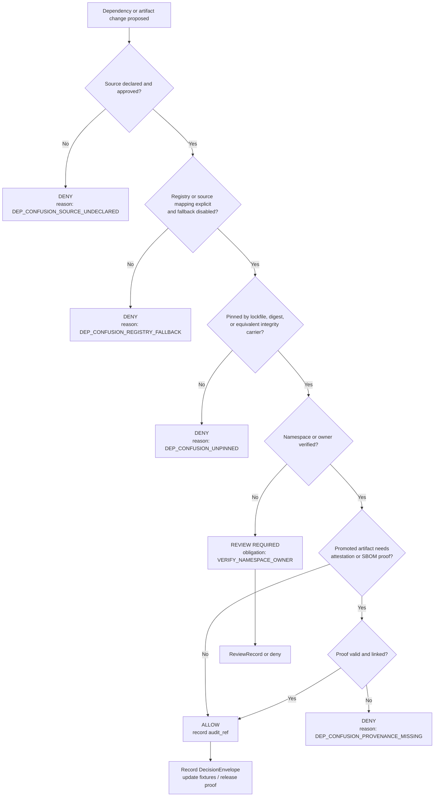

<!-- [KFM_META_BLOCK_V2]
doc_id: kfm://doc/NEEDS-VERIFICATION-UUID
title: Dependency Confusion Policy
type: standard
version: v1
status: draft
owners: NEEDS_VERIFICATION
created: YYYY-MM-DD
updated: YYYY-MM-DD
policy_label: NEEDS_VERIFICATION
related: [policy/README.md, contracts/README.md, schemas/README.md, .github/workflows/README.md]
tags: [kfm, security, supply-chain, dependency-confusion, policy]
notes: [Current session did not directly mount the repo tree; related paths come from repo-grounded sprint evidence and should be reverified before commit.]
[/KFM_META_BLOCK_V2] -->

# Dependency Confusion Policy
Policy rules for preventing untrusted package or artifact resolution from outranking approved KFM sources.

> [!IMPORTANT]
> **Status:** experimental  
> **Owners:** NEEDS VERIFICATION  
>       
> **Quick jump:** [Scope](#scope) · [Repo fit](#repo-fit) · [Quickstart](#quickstart) · [Policy rules](#core-policy-rules) · [Decision grammar](#decision-grammar-proposed) · [Definition of done](#definition-of-done) · [FAQ](#faq)

> [!NOTE]
> **Evidence posture for this file:** KFM's deny-by-default, contract-first, trust-membrane, package-boundary, and proof-object doctrine is **CONFIRMED**. The dependency-confusion-specific rule set, reason codes, obligation codes, fixture layout, and local directory shape below are **PROPOSED** starter policy content until the mounted repository confirms final package-manager, registry, and CI details.

## Scope

This README defines the policy layer for **dependency confusion** inside Kansas Frontier Matrix (KFM): any condition in which build, install, publish, or runtime resolution could prefer an unintended public, mirror, or wrong-scope package or artifact over the source KFM meant to trust.

In KFM, this is not a narrow package-manager concern. It is a trust concern. Package boundaries, policy bundles, release proofs, and merge gates are part of the evidence system, not separate hygiene work.

This policy applies to every dependency-bearing surface that can change trust posture, including:

- package manifests and lockfiles
- registry and mirror configuration
- OCI artifact references used by data or release pipelines
- build or publish workflows
- bootstrap and installer scripts
- vendored third-party code admitted into the repo

[Back to top](#dependency-confusion-policy)

## Repo fit

| Item | Detail |
| --- | --- |
| Path | `docs/security/supply-chain/dependency-confusion/policy/README.md` |
| Upstream | [`../../../../../policy/README.md`](../../../../../policy/README.md) *(repo-grounded evidence; reverify against current tree before commit)* |
| Downstream | [`../../../../../contracts/README.md`](../../../../../contracts/README.md), [`../../../../../schemas/README.md`](../../../../../schemas/README.md), [`../../../../../.github/workflows/README.md`](../../../../../.github/workflows/README.md) *(repo-grounded evidence; reverify against current tree before commit)* |
| Role in repo | Policy-specialization README for one supply-chain failure mode; it should stay narrower than the root policy layer and more stable than one-off incident notes. |

## Inputs

Accepted inputs for this directory and policy surface:

| Input type | Belongs here | Typical examples |
| --- | --- | --- |
| Policy rules | Yes | deny/allow/review criteria for dependency source selection |
| Decision grammar | Yes | reason codes, obligation codes, exception semantics |
| Review criteria | Yes | when a dependency change requires human review |
| Fixture expectations | Yes | valid/invalid policy examples for CI or conftest-style checks |
| Proof requirements | Yes | what must exist before merge or promotion |
| OCI compensating controls | Yes | digest pinning, attestation, SBOM expectations for promoted artifacts |

## Exclusions

This README does **not** replace the following:

| Out of scope here | Where it should live instead |
| --- | --- |
| General repository-wide policy posture | `policy/README.md` |
| Contract schemas and validation rules | `contracts/` and `schemas/` |
| Workflow implementation details | `.github/workflows/` |
| Secrets handling, IAM, or host firewall design | broader security architecture and runtime docs |
| Vulnerability triage and patch cadence | dedicated vulnerability / maintenance policy docs |
| License review and redistribution law | dedicated rights / licensing policy docs |

## Directory tree

Current mounted evidence did **not** directly expose this directory in the working tree. The shape below is therefore a **PROPOSED** local layout that keeps policy, fixtures, and exceptions near each other without pretending they already exist.

```text
docs/security/supply-chain/dependency-confusion/policy/
├── README.md                  # this document
├── fixtures/                  # PROPOSED
│   ├── valid/                 # PROPOSED
│   └── invalid/               # PROPOSED
└── exceptions/                # PROPOSED time-boxed waiver records
```

## Quickstart

When a pull request adds or changes a dependency, use this order:

1. Confirm the source is explicit, approved, and unambiguous.
2. Confirm resolution will not silently fall back to a public or wrong-scope registry.
3. Confirm the change is pinned by lockfile, digest, or equivalent integrity carrier.
4. Confirm namespace ownership or steward approval for any internal/private name.
5. Confirm required fixtures, decision records, and promotion proofs are present before merge or release.

A change that fails any required gate should not merge “for now” with an informal promise to fix later.

## Usage

Use this policy when any of the following happens:

- a new dependency is introduced
- an existing dependency source changes
- a registry, mirror, or package index is added or modified
- a build or publish lane begins consuming OCI-hosted artifacts
- a private/internal package name is introduced or renamed
- a vendoring exception is requested
- a release pipeline changes how promoted artifacts are pinned or verified

### Reviewer workflow

1. Check whether the source path is explicit.
2. Check whether resolution is deterministic.
3. Check whether the dependency identity is pinned.
4. Check whether the package or artifact name could collide with an unintended external source.
5. Check whether the PR includes the required proof objects or fixture updates.
6. Record the result in machine-readable decision grammar where the repo supports it.

### Exception workflow

Exceptions should be rare, explicit, and time-boxed. A dependency-confusion exception should never be a silent merge. It should carry a clear owner, expiry, compensating controls, and rollback path.

> [!WARNING]
> Digest pinning, SBOMs, and attestations reduce unnoticed substitution **after** source selection, but they do not by themselves prevent dependency confusion. The first gate is still explicit source mapping and namespace/owner review.

## Diagram



## Tables

### Core policy rules

| Rule | Required posture | Expected proof object(s) | Status |
| --- | --- | --- | --- |
| Explicit source mapping | Every dependency-bearing lane must resolve through an explicit approved source mapping rather than ambiguous default discovery. | config record, manifest, or workflow evidence | **PROPOSED** |
| No silent public fallback | Internal or private names must not be allowed to fall through to unintended public registries or mirrors. | policy fixture + review evidence | **PROPOSED** |
| Pin before trust | Merge or promotion requires a lockfile, digest, or equivalent integrity carrier appropriate to the ecosystem. | lockfile, digest, or equivalent | **PROPOSED** |
| Namespace ownership review | New internal names, renamed internal packages, or reused third-party names require explicit review before adoption. | `ReviewRecord` or equivalent | **PROPOSED** |
| Decision grammar required | Denials, reviews, exceptions, and promotions should emit stable reason codes and obligation codes rather than prose-only notes. | `DecisionEnvelope` | **CONFIRMED doctrine / PROPOSED specialization** |
| Promotion by digest for OCI artifacts | Where OCI registries are used, mutable tags are not authoritative release identity. Promotion should bind to digests. | digest, attestation, release proof | **PROPOSED** |
| Fixture-backed enforcement | Policy must be testable with valid/invalid fixtures and merge-time checks. | `fixtures/valid`, `fixtures/invalid`, policy tests | **CONFIRMED doctrine / PROPOSED local shape** |
| Time-boxed exceptions only | Exceptions must have owner, reason, expiry, compensating controls, and rollback path. | exception record + review evidence | **PROPOSED** |

### Enforcement and gates

| Phase | Minimum check | Fail state | Outcome |
| --- | --- | --- | --- |
| PR review | Source mapping and namespace check | ambiguous source or unowned internal name | deny or require review |
| Merge gate | fixture + policy validation | valid/invalid cases not updated or gate fails | block merge |
| Build | lockfile / digest materialization | unpinned dependency or mutable-only reference | fail closed |
| Promotion | proof verification for promoted artifacts | missing digest, attestation, or linked proof where required | block promotion |
| Correction | visible rollback / supersession path | bad package admitted or wrong source promoted | correction notice / rollback |

### Decision grammar (PROPOSED)

| Type | Code | Use when |
| --- | --- | --- |
| Reason code | `DEP_CONFUSION_SOURCE_UNDECLARED` | source or registry mapping is absent or ambiguous |
| Reason code | `DEP_CONFUSION_REGISTRY_FALLBACK` | resolution can fall back to an unintended public or wrong-scope source |
| Reason code | `DEP_CONFUSION_NAMESPACE_UNVERIFIED` | package/artifact name ownership is unverified |
| Reason code | `DEP_CONFUSION_UNPINNED` | no lockfile, digest, or equivalent integrity carrier is present |
| Reason code | `DEP_CONFUSION_PROVENANCE_MISSING` | promoted artifact requires proof that is absent or unverifiable |
| Reason code | `DEP_CONFUSION_EXCEPTION_EXPIRED` | a time-boxed waiver has lapsed |
| Obligation code | `DISABLE_PUBLIC_FALLBACK` | configure deterministic source mapping before merge |
| Obligation code | `VERIFY_NAMESPACE_OWNER` | add steward approval or ownership evidence |
| Obligation code | `PIN_APPROVED_SOURCE` | add lockfile, digest, or equivalent |
| Obligation code | `ADD_POLICY_FIXTURES` | add or update valid/invalid fixtures |
| Obligation code | `RECORD_DIGEST_AND_PROOF` | record digest and linked proof in release evidence |
| Obligation code | `TIMEBOX_EXCEPTION` | add expiry and compensating controls for any waiver |

### Illustrative decision record

```json
{
  "object_type": "DecisionEnvelope",
  "schema_version": "NEEDS_VERIFICATION",
  "subject": {
    "kind": "dependency_change",
    "ecosystem": "NEEDS_VERIFICATION",
    "path": "NEEDS_VERIFICATION"
  },
  "action": "merge",
  "lane": "supply-chain/dependency-confusion",
  "result": "DENY",
  "reason_codes": [
    "DEP_CONFUSION_REGISTRY_FALLBACK",
    "DEP_CONFUSION_UNPINNED"
  ],
  "obligation_codes": [
    "DISABLE_PUBLIC_FALLBACK",
    "PIN_APPROVED_SOURCE",
    "ADD_POLICY_FIXTURES"
  ],
  "policy_basis": [
    "dependency-confusion-policy"
  ],
  "audit_ref": "NEEDS_VERIFICATION",
  "effective_window": {
    "start": "NEEDS_VERIFICATION",
    "end": null
  }
}
```

*Illustrative example only. Final field names and schema version must match the mounted contract set.*

[Back to top](#dependency-confusion-policy)

## Task list

### Definition of done

- [ ] Source mapping is explicit for every affected ecosystem.
- [ ] No silent public fallback remains for internal or review-gated names.
- [ ] Lockfile, digest, or equivalent integrity carrier is committed or otherwise recorded.
- [ ] New namespace or owner claims have steward review where required.
- [ ] Valid and invalid policy fixtures exist for the new case.
- [ ] Merge-time policy checks fail closed.
- [ ] OCI promotions, where used, reference digests and retain linked provenance/SBOM evidence.
- [ ] Any exception record includes owner, expiry, compensating controls, and rollback path.

### Review checks

- [ ] The PR description states why the dependency is needed.
- [ ] The source is specific enough that two resolvers cannot interpret it differently.
- [ ] The change does not smuggle package-manager behavior into UI config or ad hoc scripts.
- [ ] The proposed control remains compatible with KFM's contract-first and proof-object posture.

## FAQ

### Does this policy ban public packages?

No. It bans **ambiguous trust**. Public packages may be admitted when source, pinning, ownership review, and required proof are explicit.

### Is this only about Node package managers?

No. KFM is polyglot. The policy is written at the trust boundary so it can apply to JavaScript, Python, OCI-hosted artifacts, and other dependency-bearing lanes without changing the core decision grammar.

### Do digest pinning and attestations solve dependency confusion by themselves?

No. They are important compensating controls after source choice, especially for promoted OCI artifacts, but they do not replace explicit source mapping and namespace review.

### Can we approve an exception for one release?

Yes, but only as a visible, time-boxed exception with owner, expiry, compensating controls, and rollback posture.

## Appendix

<details>
<summary>Proposed starter fixture cases</summary>

### Valid

- internal package resolves only through approved internal source mapping
- public package pinned by lockfile and reviewed where required
- OCI artifact promoted by digest with linked provenance and SBOM proof

### Invalid

- internal package name also exists publicly and public fallback is still enabled
- dependency added without lockfile or digest update
- exception merged without expiry or owner
- promoted artifact references only a mutable tag

</details>

<details>
<summary>Working glossary</summary>

| Term | Working meaning in this file |
| --- | --- |
| Dependency confusion | unintended package or artifact source outranks the source KFM meant to trust |
| Explicit source mapping | resolver behavior is declared, scoped, and reviewable instead of guessed from defaults |
| Public fallback | resolver may silently fetch from an unintended public or wrong-scope source |
| Integrity carrier | lockfile, digest, checksum, or equivalent object used to bind a dependency to exact bytes or exact release identity |
| Time-boxed exception | waiver with owner, reason, expiry, and compensating controls |

</details>

[Back to top](#dependency-confusion-policy)
