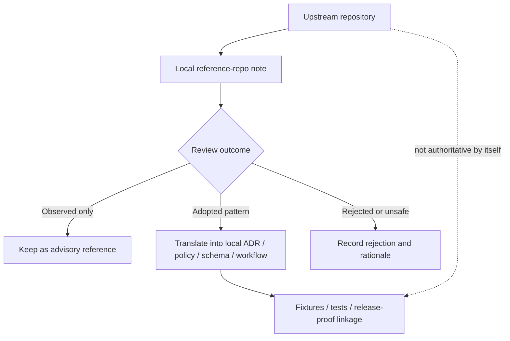

<!-- [KFM_META_BLOCK_V2]
doc_id: kfm://doc/<uuid-NEEDS-VERIFICATION>
title: Supply-Chain Reference Repos
type: standard
version: v1
status: draft
owners: <owners-NEEDS-VERIFICATION>
created: YYYY-MM-DD
updated: YYYY-MM-DD
policy_label: <NEEDS-VERIFICATION>
related: [../../, ../, ./]
tags: [kfm, security, supply-chain, reference-repos]
notes: [path confirmed from task request, owners/id/dates/policy label need repo verification, current directory inventory beyond this README is unknown in current-session evidence]
[/KFM_META_BLOCK_V2] -->

# Supply-Chain Reference Repos
Curated notes for external repositories that inform KFM supply-chain controls, evaluation, and local adoption decisions.

> **Status:** experimental *(repo maturity needs verification)*  
> **Owners:** `NEEDS VERIFICATION`  
>      
> **Quick jump:** [Scope](#scope) · [Repo fit](#repo-fit) · [Accepted inputs](#accepted-inputs) · [Exclusions](#exclusions) · [Directory tree](#directory-tree) · [Quickstart](#quickstart) · [Usage](#usage) · [Diagram](#diagram) · [Curation matrix](#curation-matrix) · [Task list](#task-list) · [FAQ](#faq) · [Appendix](#appendix)

---

> [!NOTE]
> **Current directory inventory:** `UNKNOWN` in current-session evidence beyond this target README.  
> This file is written as the **directory contract and curation guide** for `docs/security/supply-chain/reference-repos/`, not as an asserted catalog of already-present child entries.

## Scope

This directory is the **review membrane** between upstream repository patterns and KFM-local enforcement.

It exists to capture **why an external repository matters**, **which parts of it are useful**, **which parts are explicitly not adopted**, and **where any adopted idea lands locally** as a contract, policy bundle, workflow, runbook, test, or release-proof artifact.

Reference repos here are **advisory evidence**, not sovereign truth.  
A repository note may inform a decision, but it must not silently become the decision.

> [!IMPORTANT]
> Inclusion here is **not** approval for direct use in KFM.  
> The authoritative implementation lives in KFM-local contracts, policies, workflows, fixtures, proofs, and release-backed artifacts—not in upstream examples, stars, blog posts, or convenience forks.

## Repo fit

| Item | Value |
|---|---|
| Path | `docs/security/supply-chain/reference-repos/README.md` |
| Parent context | [parent supply-chain directory](../) |
| Broader context | [security docs directory](../../) |
| Upstream inputs | Public upstream repositories relevant to signing, provenance, SBOMs, policy enforcement, reproducible build patterns, release integrity, dependency review, or artifact verification |
| Downstream outputs | Local ADRs, policy bundles, schemas/profiles, CI or workflow gates, runbooks, tests, and release-proof artifacts |
| Adjacent README/docs | `NEEDS VERIFICATION` |
| Current child entry inventory | `UNKNOWN` |

## Accepted inputs

What belongs here:

| Input type | Belongs here | Minimum expectation |
|---|---:|---|
| Per-repo review notes | Yes | One note per upstream repo or tightly related repo family |
| Snapshot metadata | Yes | Upstream URL, owner or org, license, pinned ref or release, last reviewed date |
| Relevance notes | Yes | Why the repo matters to KFM supply-chain work |
| Adoption notes | Yes | What KFM adopts, adapts, or rejects |
| Downstream links | Yes | Link to the local artifact that became authoritative |
| Maintenance / trust notes | Yes | Governance, activity level, archival status, support caveats, sharp edges |
| Minimal example snippets | Yes, sparingly | Only when needed to explain a pattern; keep them short and localize them to the review note |
| Historical notes | Yes | Preserve when needed to explain earlier choices, migrations, or reversals |

Good entries usually answer these questions quickly:

1. What is this upstream repo?
2. Why is it in KFM’s orbit?
3. What do we actually use from it?
4. What do we explicitly refuse to copy?
5. Which local file, policy, or gate now carries the real decision?

## Exclusions

What does **not** belong here:

| Excluded content | Why it stays out | Put it where instead |
|---|---|---|
| Vendored source trees or full upstream mirrors | This is a documentation surface, not a code mirror | Dedicated vendoring or dependency-management locations *(needs verification in mounted repo)* |
| Generated SBOMs, attestations, signatures, scan reports | These are build or release artifacts, not reference notes | Build artifacts, release-proof packs, or governed evidence locations |
| Live policy bundles or enforcement code | Upstream review must not replace local enforcement | Authoritative policy, workflow, and config directories |
| Secrets, tokens, credentials, private registry data | Never commit secrets to docs | Secret manager, local environment, or deployment secret path |
| Uncurated link dumps | Noise makes review weaker, not stronger | Temporary research notes until promoted into a curated repo note |
| Long copied upstream documentation | It creates drift and ownership confusion | Link upstream; summarize locally; copy only the minimum needed for review context |

## Directory tree

### Confirmed current-session shape

```text
docs/security/supply-chain/reference-repos/
└── README.md   # target file confirmed by task request
```

<details>
<summary><strong>Proposed population shape</strong> (starter pattern, not asserted current repo state)</summary>

```text
docs/security/supply-chain/reference-repos/
├── README.md
├── _template.md                    # PROPOSED starter entry template
└── <repo-slug>/                    # PROPOSED per-repo review directory
    └── README.md                   # PROPOSED primary review note
```

</details>

## Quickstart

A minimal flow for adding a new reference-repo note.

```bash
# Inspect the directory contract
sed -n '1,220p' docs/security/supply-chain/reference-repos/README.md

# PROPOSED starter shape for a new entry
mkdir -p docs/security/supply-chain/reference-repos/<repo-slug>

# Create or update the per-repo note
${EDITOR:-vi} docs/security/supply-chain/reference-repos/<repo-slug>/README.md
```

> [!TIP]
> Treat the commands above as a **starter pattern**.  
> If the mounted repo already uses a different child-entry shape, keep that local convention and update this README rather than forcing the tree to mimic a placeholder.

## Usage

When reviewing an upstream repo, keep the sequence tight:

1. **Pin the upstream identity.** Record owner, repo, license, and the exact ref, tag, or release you reviewed.
2. **Name the KFM reason.** Say why this repo matters here: signing, provenance, dependency policy, SBOM handling, reproducible build patterns, CI hardening, release integrity, artifact verification, or similar.
3. **Split adopted from rejected.** A good note makes this obvious instead of mixing them together.
4. **Link the local authority.** If KFM adopts a pattern, point to the local artifact that now owns it.
5. **Record review state.** Candidate, observed, adopted, rejected, stale, or archived should be visible at a glance.
6. **Refresh deliberately.** If upstream changes meaningfully, update the note instead of silently letting the reference rot.

## Diagram



## Curation matrix

### Review state meanings

| State | Meaning here | Must include | Must **not** imply |
|---|---|---|---|
| Candidate | Worth reviewing, not yet stabilized | Why it was added; who should review it | Approval |
| Observed | Useful reference, currently advisory | Snapshot metadata and a short relevance note | Local adoption |
| Adopted | A local artifact now carries the decision | Link to the authoritative local artifact | That upstream remains authoritative |
| Rejected | Explicitly not for KFM | Clear rejection reason | That the repo is bad in all contexts |
| Stale / archived | Historical context kept intentionally | Why it is preserved and what replaced it | Ongoing recommendation |

### Minimum per-repo entry fields

| Field | Required | Notes |
|---|---:|---|
| Repo slug | Yes | Use a stable, readable directory name |
| Upstream repo URL | Yes | Record the canonical upstream |
| Owner / org | Yes | Helps with governance and trust review |
| License | Yes | Keep reuse and redistribution explicit |
| Reviewed ref / tag / release | Yes | Avoid floating references |
| Why it matters to KFM | Yes | Supply-chain relevance, not generic admiration |
| Adopted patterns | Yes | Only list what KFM actually uses or intends to use |
| Rejected / non-adopted patterns | Yes | Make boundaries visible |
| Local authoritative links | Yes, if adopted | ADR, schema, workflow, policy, runbook, or proof-pack |
| Last reviewed | Yes | Review notes go stale faster than people think |
| Reviewer | Yes | Lightweight accountability |
| Caveats / risks | Recommended | Maintenance gaps, licensing tension, security concerns, portability limits |

## Task list

**Definition of done for any new entry**

- [ ] Upstream identity is pinned to a reviewable ref, tag, or release.
- [ ] License and governance posture are recorded.
- [ ] KFM relevance is explicit and supply-chain-specific.
- [ ] Adopted and rejected patterns are separated.
- [ ] A local authoritative artifact is linked for every adopted pattern.
- [ ] Review state is visible in the first screenful of the entry.
- [ ] Last-reviewed date and reviewer are recorded.
- [ ] No secrets, generated artifacts, or copied source trees were added here.
- [ ] Any stale or archived upstream is marked rather than silently treated as current.

## FAQ

### Is a repo listed here automatically approved?

No. This directory is a review surface, not an allowlist.

### Can we copy an upstream workflow or policy file directly into KFM?

Not as the final move. Translate it into KFM-local artifacts, then test, review, and own it locally.

### Should child entries contain full tutorials?

No. Keep them crisp: identity, relevance, adopted patterns, rejected patterns, downstream links, and caveats.

### What if an upstream repo changes direction or disappears?

Do not silently delete the note. Mark it stale or archived, record what changed, and point to any replacement or local supersession.

## Appendix

<details>
<summary><strong>Starter per-repo entry template</strong></summary>

```markdown
# <repo-slug>
One-line reason this upstream is tracked in KFM.

> **Review state:** candidate|observed|adopted|rejected|stale  
> **Last reviewed:** YYYY-MM-DD  
> **Reviewer:** <name-or-team-NEEDS-VERIFICATION>

## Snapshot
| Field | Value |
|---|---|
| Upstream | `<url>` |
| Owner / org | `<owner>` |
| License | `<license>` |
| Reviewed ref / tag / release | `<ref>` |
| Repo status | `<active|archived|unknown>` |

## Why it matters to KFM
Short paragraph focused on supply-chain relevance.

## Adopted patterns
- Pattern
- Local authoritative destination

## Rejected / non-adopted patterns
- Pattern
- Why it is not used in KFM

## Local impact
- ADR / policy / workflow / schema / runbook / proof-pack link

## Caveats
- Maintenance, licensing, portability, trust, or security notes
```

</details>

<details>
<summary><strong>Maintainer review prompts</strong></summary>

1. Is this repo still the best reference for the pattern we care about?
2. Are we tracking the upstream at a stable reviewed ref?
3. Does the entry clearly distinguish **example** from **local law**?
4. If KFM adopted something here, where is the authoritative local artifact?
5. If the upstream went stale, did we preserve the historical reason for keeping the note?

</details>

[Back to top](#supply-chain-reference-repos)
