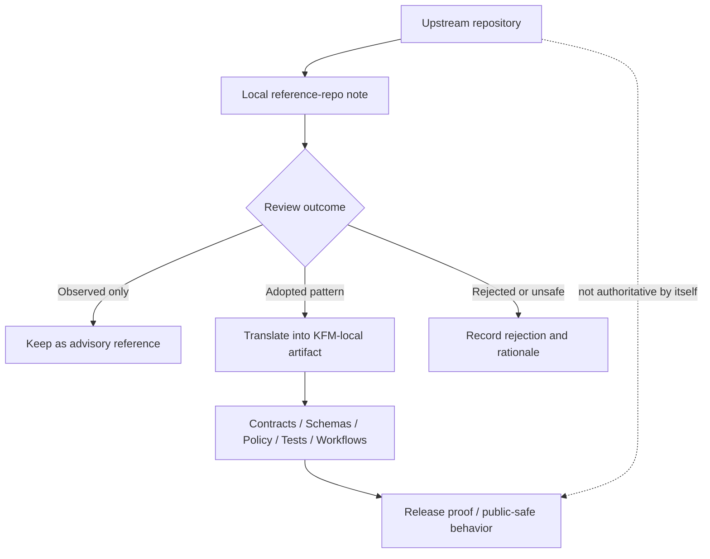

<!-- [KFM_META_BLOCK_V2]
doc_id: kfm://doc/<uuid-NEEDS-VERIFICATION>
title: Supply-Chain Reference Repos
type: standard
version: v1
status: draft
owners: @bartytime4life
created: <YYYY-MM-DD-NEEDS-VERIFICATION>
updated: <YYYY-MM-DD-NEEDS-VERIFICATION>
policy_label: <NEEDS-VERIFICATION>
related: [../README.md, ../../README.md, ../../../../contracts/README.md, ../../../../schemas/README.md, ../../../../policy/README.md, ../../../../tests/README.md, ../../../../.github/workflows/README.md]
tags: [kfm, security, supply-chain, reference-repos]
notes: [owner grounded from current public /docs/ CODEOWNERS; current public-main subtree appears README-only; uuid/dates/policy label still need branch-local verification]
[/KFM_META_BLOCK_V2] -->

# Supply-Chain Reference Repos

Curated review notes for upstream repositories that inform KFM supply-chain controls, evaluation, and local adoption decisions.

> **Status:** experimental  
> **Owners:** `@bartytime4life`  
>      
> **Quick jump:** [Scope](#scope) · [Repo fit](#repo-fit) · [Accepted inputs](#accepted-inputs) · [Exclusions](#exclusions) · [Directory tree](#directory-tree) · [Quickstart](#quickstart) · [Usage](#usage) · [Diagram](#diagram) · [Tables](#tables) · [Task list](#task-list) · [FAQ](#faq) · [Appendix](#appendix)

---

> [!NOTE]
> **Current verified public-main snapshot:** `docs/security/supply-chain/reference-repos/` is currently a `README.md`-only subtree on the inspected public branch. Treat this file as the directory contract and curation guide for this lane, not as proof that per-repo child dossiers are already checked in.

## Scope

This directory is the **review membrane** between upstream repository patterns and KFM-local enforcement.

Use it to answer four questions quickly:

1. Why does an upstream repository matter to KFM supply-chain work?
2. What is explicitly adopted, adapted, or rejected from it?
3. Which KFM-local artifact now carries the authoritative decision?
4. What should stay advisory, historical, or out of scope?

Reference repos here are **advisory evidence**, not sovereign truth. A repository note may inform a decision, but it must not silently become the decision.

> [!IMPORTANT]
> Inclusion here is **not** approval for direct use in KFM. The authoritative implementation lives in KFM-local contracts, schemas, policy bundles, tests, workflow wiring, runbooks, and release-proof artifacts—not in upstream examples, stars, blog posts, or convenience forks.

## Repo fit

| Item | Value |
|---|---|
| Path | `docs/security/supply-chain/reference-repos/README.md` |
| Parent lane | [../README.md](../README.md) |
| Broader security docs | [../../README.md](../../README.md) |
| Root repo posture | [../../../../README.md](../../../../README.md) |
| Upstream control surfaces | [../../../../contracts/README.md](../../../../contracts/README.md), [../../../../schemas/README.md](../../../../schemas/README.md), [../../../../policy/README.md](../../../../policy/README.md), [../../../../tests/README.md](../../../../tests/README.md), [../../../../.github/workflows/README.md](../../../../.github/workflows/README.md) |
| Adjacent supply-chain lanes | [../dependency-confusion/README.md](../dependency-confusion/README.md), [../sigstore-cosign-v3/README.md](../sigstore-cosign-v3/README.md), [../shai-hulud-2.0/README.md](../shai-hulud-2.0/README.md) |
| Upstream inputs | Public upstream repositories relevant to signing, provenance, SBOMs, policy enforcement, reproducible build patterns, release integrity, dependency review, artifact verification, or related release-trust patterns |
| Downstream outputs | Local ADRs, typed contracts, schema-home decisions, policy bundles, test fixtures, workflow wiring, runbooks, and release-proof artifacts |
| Current public-main posture | `README.md` only |

## Accepted inputs

What belongs here:

| Input type | Belongs here | Minimum expectation |
|---|---:|---|
| Per-repo review notes | Yes | One note per upstream repo or tightly related repo family |
| Snapshot metadata | Yes | Upstream URL, owner or org, license, pinned ref or release, last reviewed date |
| Relevance notes | Yes | Why the repo matters to KFM supply-chain work |
| Adoption notes | Yes | What KFM adopts, adapts, or rejects |
| Downstream links | Yes | Link to the local artifact that became authoritative |
| Maintenance / trust notes | Yes | Governance, activity level, archival status, support caveats, sharp edges |
| Minimal example snippets | Yes, sparingly | Only when needed to explain a pattern; keep them short and local to the review note |
| Historical notes | Yes | Preserve when needed to explain earlier choices, migrations, or reversals |

Good entries usually answer these questions quickly:

1. What is this upstream repo?
2. Why is it in KFM’s orbit?
3. What do we actually use from it?
4. What do we explicitly refuse to copy?
5. Which local file, policy, or gate now carries the real decision?

## Exclusions

What does **not** belong here:

| Excluded content | Why it stays out | Put it where instead |
|---|---|---|
| Vendored source trees or full upstream mirrors | This lane is a curation surface, not a code mirror | Dedicated vendoring or dependency-management locations on the active branch *(NEEDS VERIFICATION)* |
| Live contract, schema, or policy implementation | Review notes must not replace executable control surfaces | [../../../../contracts/README.md](../../../../contracts/README.md), [../../../../schemas/README.md](../../../../schemas/README.md), [../../../../policy/README.md](../../../../policy/README.md) |
| Generated SBOMs, signatures, attestations, or proof packs | These are release artifacts, not reference notes | Release-proof or artifact locations on the active branch *(NEEDS VERIFICATION)* |
| Runnable fixtures, validators, or verification harnesses | Keep documentation connected to proof, not mixed with it | [../../../../tests/README.md](../../../../tests/README.md) and [../../../../tools/README.md](../../../../tools/README.md) |
| Workflow implementation described as if already active | Public `main` still distinguishes workflow doctrine from checked-in YAML proof | [../../../../.github/workflows/README.md](../../../../.github/workflows/README.md) and verified workflow files when present |
| Secrets, tokens, credentials, or private registry data | Never commit secrets to docs | Secret manager, environment configuration, or deployment secret path |
| Uncurated link dumps or copied upstream manuals | Noise and drift weaken review quality | Temporary research notes until promoted into a curated entry |

## Directory tree

### Current verified public-main shape

```text
docs/security/supply-chain/reference-repos/
└── README.md
```

<details>
<summary><strong>Proposed scale-out shape</strong> (starter pattern, not asserted current repo state)</summary>

```text
docs/security/supply-chain/reference-repos/
├── README.md
├── _template.md                  # PROPOSED starter entry template
└── <repo-slug>/
    └── README.md                 # PROPOSED primary review note
```

</details>

## Quickstart

A minimal flow for adding or revising a reference-repo note.

```bash
# Inspect this lane and its parent context
sed -n '1,260p' docs/security/supply-chain/reference-repos/README.md
sed -n '1,320p' docs/security/supply-chain/README.md

# Review adjacent supply-chain lanes before adding a new note
ls docs/security/supply-chain

# PROPOSED starter shape for a new entry
mkdir -p docs/security/supply-chain/reference-repos/<repo-slug>
${EDITOR:-vi} docs/security/supply-chain/reference-repos/<repo-slug>/README.md
```

> [!TIP]
> If a sibling lane already owns the pattern, update that lane instead of duplicating it here. This directory should connect supply-chain evidence, not sprawl into a second contract or policy surface.

## Usage

When reviewing an upstream repo, keep the sequence tight:

1. **Pin the upstream identity.** Record owner, repo, license, and the exact ref, tag, or release you reviewed.
2. **Name the KFM reason.** State why the repo matters here: signing, provenance, SBOM handling, dependency review, reproducible builds, policy enforcement, artifact verification, or related release-trust work.
3. **Split adopted from rejected.** A good note makes boundaries obvious instead of blending them together.
4. **Link the local authority.** If KFM adopts a pattern, point to the local artifact that now owns it.
5. **Record review state.** Candidate, observed, adopted, rejected, or stale should be visible in the first screenful.
6. **Refresh deliberately.** If upstream changes materially, update the note instead of silently letting the reference rot.

### Fast routing rule

When a reference note graduates into local law, it should usually move outward into a more authoritative surface:

- **Contract or envelope shape** -> `contracts/` or `schemas/`
- **Executable release or trust rule** -> `policy/`
- **Runnable proof / fixture / negative-path check** -> `tests/` and `tools/`
- **Workflow choreography** -> `.github/workflows/`
- **Cross-cutting lane guidance** -> sibling supply-chain lane README when one already exists

## Diagram



## Tables

### Review state meanings

| State | Meaning here | Must include | Must **not** imply |
|---|---|---|---|
| Candidate | Worth reviewing, not yet stabilized | Why it was added; who should review it | Approval |
| Observed | Useful reference, currently advisory | Snapshot metadata and a short relevance note | Local adoption |
| Adopted | A local artifact now carries the decision | Link to the authoritative local artifact | That upstream remains authoritative |
| Rejected | Explicitly not for KFM | Clear rejection reason | That the repo is bad in all contexts |
| Stale / archived | Historical context kept intentionally | Why it is preserved and what replaced it | Ongoing recommendation |

### Minimum per-repo entry fields

| Field | Required | Notes |
|---|---:|---|
| Repo slug | Yes | Use a stable, readable directory name |
| Upstream repo URL | Yes | Record the canonical upstream |
| Owner / org | Yes | Helps with governance and trust review |
| License | Yes | Keep reuse and redistribution explicit |
| Reviewed ref / tag / release | Yes | Avoid floating references |
| Why it matters to KFM | Yes | Supply-chain relevance, not generic admiration |
| Adopted patterns | Yes | Only list what KFM actually uses or intends to use |
| Rejected / non-adopted patterns | Yes | Make boundaries visible |
| Local authoritative links | Yes, if adopted | ADR, schema, workflow, policy, runbook, or proof-pack |
| Last reviewed | Yes | Review notes go stale faster than people think |
| Reviewer | Yes | Lightweight accountability |
| Caveats / risks | Recommended | Maintenance gaps, licensing tension, security concerns, portability limits |

### Where adopted ideas usually land locally

| Local home | Typical adopted idea | Why it belongs there |
|---|---|---|
| [../dependency-confusion/README.md](../dependency-confusion/README.md) | Package-origin and namespace-trust comparisons | This sibling lane already owns dependency-confusion-specific reasoning |
| [../sigstore-cosign-v3/README.md](../sigstore-cosign-v3/README.md) | Signing, verification, and attestation references | This sibling lane is the natural home for Sigstore / Cosign adaptation notes |
| [../shai-hulud-2.0/README.md](../shai-hulud-2.0/README.md) | Cross-cutting or experimental supply-chain patterns | Use when a reference spans multiple integrity controls or exploratory builds |
| [../../../../contracts/README.md](../../../../contracts/README.md) + [../../../../schemas/README.md](../../../../schemas/README.md) | Typed envelopes, manifests, proof-object shapes, schema-home decisions | Machine-readable contract ownership should stay authoritative there |
| [../../../../policy/README.md](../../../../policy/README.md) | Deny-by-default rules, reason/obligation grammar, release gates | Executable trust logic belongs in the policy surface |
| [../../../../tests/README.md](../../../../tests/README.md) + [../../../../tools/README.md](../../../../tools/README.md) | Fixtures, validators, negative-path checks, verification harnesses | KFM should prove adopted patterns, not only describe them |
| [../../../../.github/workflows/README.md](../../../../.github/workflows/README.md) | CI or promotion choreography implied by a note | Workflow behavior should be documented there and only claimed as implemented when checked-in YAML is verified |

## Task list

**Definition of done for any new entry**

- [ ] Upstream identity is pinned to a reviewable ref, tag, or release.
- [ ] License and governance posture are recorded.
- [ ] KFM relevance is explicit and supply-chain-specific.
- [ ] Adopted and rejected patterns are separated.
- [ ] A local authoritative artifact is linked for every adopted pattern.
- [ ] Review state is visible in the first screenful of the entry.
- [ ] Last-reviewed date and reviewer are recorded.
- [ ] No secrets, generated artifacts, or copied source trees were added here.
- [ ] Any stale or archived upstream is marked rather than silently treated as current.
- [ ] The note does not redefine schema, policy, or workflow ownership that belongs in another surface.

## FAQ

### Is a repo listed here automatically approved?

No. This directory is a review surface, not an allowlist.

### Can we copy an upstream workflow or policy file directly into KFM?

Not as the final move. Translate it into KFM-local artifacts, then test, review, and own it locally.

### Should child entries contain full tutorials?

No. Keep them crisp: identity, relevance, adopted patterns, rejected patterns, downstream links, and caveats.

### What if an upstream repo changes direction or disappears?

Do not silently delete the note. Mark it stale or archived, record what changed, and point to any replacement or local supersession.

### Should this lane define canonical schemas or policy bundles?

No. It should explain, compare, and route. Canonical machine-facing artifacts belong in their owning contract, schema, policy, and test surfaces.

## Appendix

<details>
<summary><strong>Starter per-repo entry template</strong></summary>

```markdown
# <repo-slug>

One-line reason this upstream is tracked in KFM.

> **Review state:** candidate|observed|adopted|rejected|stale
> **Last reviewed:** YYYY-MM-DD
> **Reviewer:** <name-or-team-NEEDS-VERIFICATION>

## Snapshot

| Field | Value |
|---|---|
| Upstream | `<url>` |
| Owner / org | `<owner>` |
| License | `<license>` |
| Reviewed ref / tag / release | `<ref>` |
| Repo status | `<active|archived|unknown>` |

## Why it matters to KFM

Short paragraph focused on supply-chain relevance.

## Adopted patterns

- Pattern
- Local authoritative destination

## Rejected / non-adopted patterns

- Pattern
- Why it is not used in KFM

## Local impact

- ADR / policy / workflow / schema / runbook / proof-pack link

## Caveats

- Maintenance, licensing, portability, trust, or security notes
```

</details>

<details>
<summary><strong>Maintainer review prompts</strong></summary>

1. Is this repo still the best reference for the pattern we care about?
2. Are we tracking the upstream at a stable reviewed ref?
3. Does the entry clearly distinguish **example** from **local law**?
4. If KFM adopted something here, where is the authoritative local artifact?
5. If the upstream went stale, did we preserve the historical reason for keeping the note?

</details>

[Back to top](#supply-chain-reference-repos)
