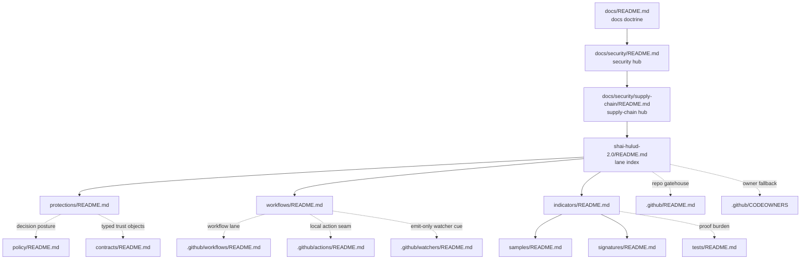

<!-- [KFM_META_BLOCK_V2]
doc_id: kfm://doc/TODO-UUID
title: Shai-Hulud 2.0
type: standard
version: v1
status: draft
owners: @bartytime4life
created: TODO-YYYY-MM-DD
updated: TODO-YYYY-MM-DD
policy_label: public
related: [docs/README.md, docs/security/README.md, docs/security/supply-chain/README.md, docs/security/supply-chain/shai-hulud-2.0/protections/README.md, docs/security/supply-chain/shai-hulud-2.0/workflows/README.md, docs/security/supply-chain/shai-hulud-2.0/indicators/README.md, docs/security/supply-chain/shai-hulud-2.0/indicators/samples/README.md, docs/security/supply-chain/shai-hulud-2.0/indicators/signatures/README.md, .github/README.md, .github/CODEOWNERS, .github/actions/README.md, .github/watchers/README.md, .github/workflows/README.md, policy/README.md, contracts/README.md, tests/README.md]
tags: [kfm, security, supply-chain, shai-hulud-2.0]
notes: [Owners are grounded from current public .github/CODEOWNERS fallback; doc_id and dates still need verification; public main confirms the lane subtree; .github/workflows remains README-only on public main; adjacent .github/workflows and .github/actions docs now expose historical and placeholder-heavy execution cues that should inform wording without being mistaken for live enforcement; deeper semantics for the lane name remain intentionally bounded]
[/KFM_META_BLOCK_V2] -->

# Shai-Hulud 2.0

Experimental KFM supply-chain lane for protection intent, workflow handoff, and measurable assurance routing under `docs/security/supply-chain/`.

> [!IMPORTANT]
> **Status:** experimental · **Doc maturity:** draft  
> **Owners:** `@bartytime4life` *(current public `.github/CODEOWNERS` fallback; no narrower lane rule is currently verified on public `main`)*  
> **Path:** `docs/security/supply-chain/shai-hulud-2.0/README.md`  
> **Repo fit:** child lane beneath [`../README.md`](../README.md); downstream into [`./protections/README.md`](./protections/README.md), [`./workflows/README.md`](./workflows/README.md), and [`./indicators/README.md`](./indicators/README.md)  
>          
> **Quick jumps:** [Scope](#scope) · [Repo fit](#repo-fit) · [Accepted inputs](#accepted-inputs) · [Exclusions](#exclusions) · [Current verified snapshot](#current-verified-snapshot) · [Directory tree](#directory-tree) · [Quickstart](#quickstart) · [Usage](#usage) · [Diagram](#diagram) · [Tables](#tables) · [Task list](#task-list--definition-of-done) · [FAQ](#faq) · [Appendix](#appendix)

> [!WARNING]
> This lane documents **control shape**, **workflow routing**, and **measurement routing** for a named supply-chain surface.  
> Current public `main` still exposes `.github/workflows/README.md` only, while adjacent gatehouse docs now also record two more execution cues: public Actions-page historical workflow names and a placeholder-heavy `.github/actions/` seam. Treat those as **context and reconstruction signal**, not as proof of checked-in YAML, emitted SBOMs, live signatures, live attestations, or merge-blocking enforcement.

## Scope

This directory is the README-level index for a named supply-chain documentation lane inside KFM security docs.

It exists to answer four narrow questions quickly:

1. What belongs in the lane root instead of one of its child READMEs?
2. Which adjacent repo surfaces should be re-checked before trust-bearing prose changes?
3. Which current public signals are **checked-in tree facts**, and which are only **historical**, **placeholder**, or **platform** cues?
4. Which claims here are safe as `CONFIRMED`, and which must stay bounded as `INFERRED`, `PROPOSED`, `UNKNOWN`, or `NEEDS VERIFICATION`?

At present, public `main` confirms this subtree shape:

- `protections/`
- `workflows/`
- `indicators/`
  - `samples/`
  - `signatures/`

That structure supports one disciplined interpretation:

- `protections/` explains which guardrails belong to the lane
- `workflows/` explains how those guardrails are exercised, checked, promoted, rolled back, or corrected
- `indicators/` explains what measurable assurance looks like, how it is interpreted, and where public-safe examples live

That interpretation is **INFERRED** from the live subtree and its surrounding security and supply-chain context. The deeper program meaning of the name **Shai-Hulud 2.0** remains **NEEDS VERIFICATION**.

### Truth posture used in this README

| Label | Meaning here |
| --- | --- |
| **CONFIRMED** | Visible in the current public repo tree or already established by adjacent repo docs |
| **INFERRED** | Strongly suggested by directory names and nearby repo doctrine, but not directly proven as checked-in executable behavior |
| **PROPOSED** | Recommended structure, wording, or documentation move for this lane |
| **UNKNOWN** | Not verified strongly enough to present as current branch, platform, or runtime reality |
| **NEEDS VERIFICATION** | Important, tempting to overclaim, or load-bearing enough that the checked-out branch should be re-checked before merge |

## Repo fit

This README sits beneath the supply-chain hub and above the lane’s child READMEs. It should stay specific enough to keep the lane maintainable, while avoiding duplication of sibling lanes, broader security doctrine, or adjacent executable surfaces.

| Direction | Link | Why it matters |
| --- | --- | --- |
| Upstream | [`../../../README.md`](../../../README.md) | `docs/` doctrine, structure, and documentation expectations |
| Upstream | [`../../README.md`](../../README.md) | security hub and cross-lane trust framing |
| Upstream | [`../README.md`](../README.md) | parent supply-chain hub and lane routing |
| Downstream | [`./protections/README.md`](./protections/README.md) | control and guardrail intent |
| Downstream | [`./workflows/README.md`](./workflows/README.md) | gate sequencing, promotion, rollback, and correction choreography |
| Downstream | [`./indicators/README.md`](./indicators/README.md) | measurable assurance and interpretation |
| Downstream | [`./indicators/samples/README.md`](./indicators/samples/README.md) | release-safe examples and fixtures |
| Downstream | [`./indicators/signatures/README.md`](./indicators/signatures/README.md) | signature- and attestation-oriented reading notes |
| Sibling | [`../dependency-confusion/README.md`](../dependency-confusion/README.md) | package-origin and namespace-trust risks belong there |
| Sibling | [`../sigstore-cosign-v3/README.md`](../sigstore-cosign-v3/README.md) | general Sigstore / Cosign doctrine belongs there |
| Sibling | [`../reference-repos/README.md`](../reference-repos/README.md) | external comparison material belongs there |
| Adjacent gatehouse | [`../../../../.github/README.md`](../../../../.github/README.md) | current repo-level control-plane inventory and trust-boundary wording |
| Adjacent ownership surface | [`../../../../.github/CODEOWNERS`](../../../../.github/CODEOWNERS) | current public owner fallback for this lane |
| Adjacent action seam | [`../../../../.github/actions/README.md`](../../../../.github/actions/README.md) | repo-local step-wrapper inventory and placeholder-heavy action cues |
| Adjacent watcher seam | [`../../../../.github/watchers/README.md`](../../../../.github/watchers/README.md) | emit-only watcher boundary guidance that should not be mistaken for workflow proof |
| Adjacent workflow surface | [`../../../../.github/workflows/README.md`](../../../../.github/workflows/README.md) | current public checked-in workflow inventory and historical-signal caveat |
| Adjacent policy surface | [`../../../../policy/README.md`](../../../../policy/README.md) | deny-by-default posture, reasons, obligations, and outcome grammar |
| Adjacent contract surface | [`../../../../contracts/README.md`](../../../../contracts/README.md) | typed trust-object home and adjacent machine-contract expectations |
| Adjacent verification surface | [`../../../../tests/README.md`](../../../../tests/README.md) | proof burden, negative-path checks, and correction drills |

## Accepted inputs

Content that belongs here includes:

- lane-level scope, routing, and boundary guidance for `shai-hulud-2.0`
- short explanations of how `protections/`, `workflows/`, and `indicators/` divide responsibility
- cross-links to owning workflow, policy, contract, test, fixture, runbook, or release-evidence surfaces
- bounded notes about how the checked-in tree, historical workflow signal, and placeholder action seams should be interpreted
- lane-level cautions about overclaiming enforcement
- public-safe notes about how to interpret redacted or synthetic signature, attestation, digest, or assurance examples
- drift notes when parent, child, or adjacent gatehouse docs no longer describe the same lane reality

## Exclusions

| This does **not** belong here | Put it here instead |
| --- | --- |
| Private keys, secrets, tokens, credentials, or mutable live signing material | Never commit them into docs; use the repo’s secure secret-handling path |
| Canonical generated proof artifacts, emitted SBOMs, live attestations, or release evidence bundles | Their governed artifact or release-evidence home |
| Workflow YAML or CI job logic as the source of truth | [`../../../../.github/workflows/README.md`](../../../../.github/workflows/README.md) and the owning workflow files |
| Step-wrapper implementation detail copied as narrative doctrine | [`../../../../.github/actions/README.md`](../../../../.github/actions/README.md) and the owning action surface |
| Emit-only watcher guidance restated as current workflow certainty | [`../../../../.github/watchers/README.md`](../../../../.github/watchers/README.md) and the owning watcher docs |
| Historical Actions-page workflow names presented as the current checked-in inventory | historical notes, commit-scoped verification, or [`../../../../.github/workflows/README.md`](../../../../.github/workflows/README.md) with explicit caveats |
| Executable policy bundles or policy tests as narrative-only copy | [`../../../../policy/README.md`](../../../../policy/README.md) and owning policy/test surfaces |
| Canonical machine-readable trust objects | [`../../../../contracts/README.md`](../../../../contracts/README.md) and the eventual authoritative schema home |
| General dependency-confusion doctrine | [`../dependency-confusion/README.md`](../dependency-confusion/README.md) |
| General Sigstore / Cosign doctrine | [`../sigstore-cosign-v3/README.md`](../sigstore-cosign-v3/README.md) |
| Broad repo-wide security doctrine | [`../../README.md`](../../README.md) |
| Claims that a control is enforced in code when the visible repo evidence does not prove it | Keep it `PROPOSED`, `UNKNOWN`, or `NEEDS VERIFICATION` until an executable surface proves it |

## Current verified snapshot

The strongest safe statements on the current public branch are slightly richer than a pure subtree reading: the lane exists, adjacent workflow docs still mark `.github/workflows/` as README-only on current `main`, and adjacent gatehouse docs now expose historical workflow signal plus a placeholder-heavy `.github/actions/` seam. That strengthens context without widening into enforcement claims.

| Surface | Current public status | Safe statement | Why it matters here |
| --- | --- | --- | --- |
| `docs/security/supply-chain/shai-hulud-2.0/` | **CONFIRMED** | Public `main` exposes `README.md`, `indicators/`, `protections/`, and `workflows/` | The lane structure is real, even if enforcement is not proven here |
| `docs/security/supply-chain/shai-hulud-2.0/indicators/` | **CONFIRMED** | Public `main` exposes `README.md`, `samples/`, and `signatures/` | The nested indicator surfaces exist and should be linked explicitly |
| `.github/CODEOWNERS` | **CONFIRMED** | Public CODEOWNERS uses a global fallback and assigns both `/docs/` and `/.github/` to `@bartytime4life` | The owner field here can be grounded without inventing a narrower rule |
| `.github/README.md` | **CONFIRMED** | The repo gatehouse currently documents `actions/`, `watchers/`, and `workflows/`, with `watchers/` and `workflows/` still README-only on public `main` | This lane should route into the gatehouse without collapsing ownership boundaries |
| `.github/workflows/README.md` | **CONFIRMED** | Current public `main` still exposes `.github/workflows/README.md` only, and that README explicitly treats public Actions-page workflow names as historical signal rather than current YAML inventory | This README must not imply checked-in workflow YAML from lane shape alone |
| `.github/actions/README.md` | **CONFIRMED** | Public `main` exposes a real but placeholder-heavy local-action seam with named directories such as `metadata-validate/`, `opa-gate/`, `provenance-guard/`, and `sbom-produce-and-sign/` | Lane prose can acknowledge adjacent action seams without overstating runnable enforcement |
| `.github/watchers/README.md` | **CONFIRMED** | Public `main` exposes a docs-only watcher lane under `.github/watchers/` | Emit-only watcher guidance is adjacent context, not proof of mounted jobs |
| `docs/security/supply-chain/README.md` | **CONFIRMED** | The parent supply-chain README already distinguishes current control-surface shape from proven executed automation and calls out `.github/actions/` as a visible but placeholder-heavy seam | The lane root should stay aligned with the parent subtree’s evidence boundary |
| `policy/README.md`, `contracts/README.md`, `tests/README.md` | **CONFIRMED** | Current public `main` exposes these as adjacent boundary docs | Lane prose can route meaning toward policy, typed objects, and verification without claiming those executable assets already exist |

## Directory tree

```text
docs/security/supply-chain/shai-hulud-2.0/
├── README.md                            # lane index, scope, and routing
├── protections/
│   └── README.md                        # guardrail and control intent
├── workflows/
│   └── README.md                        # gate, promotion, rollback, and correction choreography
└── indicators/
    ├── README.md                        # measurable assurance and interpretation
    ├── samples/
    │   └── README.md                    # public-safe examples and fixtures
    └── signatures/
        └── README.md                    # signature / attestation reading notes
```

> [!NOTE]
> This tree is intentionally limited to what is visible in the checked-in lane on the current public branch. If the checked-out branch or private repo state differs, update this section from mounted repo evidence before merge.

<details>
<summary>Adjacent gatehouse excerpt worth re-checking before trust-bearing edits</summary>

```text
.github/
├── README.md
├── actions/    # visible, placeholder-heavy step-wrapper seam on public main
├── watchers/   # README-only on public main
└── workflows/  # README-only on public main; public Actions history documented as historical signal
```

</details>

## Quickstart

1. Re-read the parent supply-chain README before changing this lane.
2. Decide whether the change belongs in the root lane or in one child README.
3. Re-check current public ownership, gatehouse, action, watcher, workflow, policy, contract, and test boundary docs before writing trust-bearing language.
4. Keep every newly added claim explicit as `CONFIRMED`, `INFERRED`, `PROPOSED`, `UNKNOWN`, or `NEEDS VERIFICATION`.
5. Never commit secrets or live signing material into this subtree.
6. Treat historical workflow names and placeholder action directories as cues for review, not as live enforcement proof.

```bash
# Read the lane root and child READMEs first
sed -n '1,260p' docs/security/supply-chain/shai-hulud-2.0/README.md
sed -n '1,240p' docs/security/supply-chain/shai-hulud-2.0/protections/README.md
sed -n '1,240p' docs/security/supply-chain/shai-hulud-2.0/workflows/README.md
sed -n '1,260p' docs/security/supply-chain/shai-hulud-2.0/indicators/README.md
sed -n '1,220p' docs/security/supply-chain/shai-hulud-2.0/indicators/samples/README.md
sed -n '1,220p' docs/security/supply-chain/shai-hulud-2.0/indicators/signatures/README.md

# Re-check adjacent current public boundary docs before changing trust-bearing prose
sed -n '1,260p' docs/security/supply-chain/README.md
sed -n '1,260p' docs/security/README.md
sed -n '1,260p' .github/README.md
sed -n '1,220p' .github/CODEOWNERS
sed -n '1,260p' .github/actions/README.md
sed -n '1,240p' .github/watchers/README.md
sed -n '1,260p' .github/workflows/README.md
sed -n '1,280p' policy/README.md
sed -n '1,280p' contracts/README.md
sed -n '1,260p' tests/README.md

# Search for lane-coupled trust objects, local action seams, and historically visible workflow names
git grep -nE 'Shai-Hulud|sbom|attest|signature|digest|DecisionEnvelope|EvidenceBundle|RuntimeResponseEnvelope|CorrectionNotice|ReleaseManifest|metadata-validate|opa-gate|provenance-guard|verify-docs|verify-runtime|release-evidence|promote-and-reconcile' -- \
  docs .github policy contracts tests 2>/dev/null || true
```

## Usage

Use this README when the work is about **lane scope**, **ownership of meaning**, or **which adjacent surfaces must move together**.

> [!TIP]
> A change is incomplete if it only edits prose. When trust-bearing meaning shifts, re-check workflows, actions, watchers, policy, contracts, tests, and release evidence in the same review window—or keep the change clearly marked as `PROPOSED`, `UNKNOWN`, or `NEEDS VERIFICATION`.

| You need to… | Start here | Then re-check |
| --- | --- | --- |
| adjust lane scope, ownership, or routing | this README | parent security and supply-chain READMEs, `.github/CODEOWNERS`, `.github/README.md` |
| define or tighten a guardrail | [`./protections/README.md`](./protections/README.md) | `policy/README.md`, `contracts/README.md`, `tests/README.md` |
| document a gate, promotion sequence, rollback path, or correction step | [`./workflows/README.md`](./workflows/README.md) | `.github/workflows/README.md`, `.github/actions/README.md`, `policy/README.md`, release/correction docs |
| define a measurable signal or interpretation rule | [`./indicators/README.md`](./indicators/README.md) | `tests/README.md`, samples, signatures, release-safe evidence |
| add a public-safe example or fixture | [`./indicators/samples/README.md`](./indicators/samples/README.md) | redaction, provenance, and public-safety checks |
| add signature or attestation reading notes | [`./indicators/signatures/README.md`](./indicators/signatures/README.md) | [`../sigstore-cosign-v3/README.md`](../sigstore-cosign-v3/README.md), contracts, policy |
| assess whether repeated step logic materially changes lane meaning | [`../../../../.github/actions/README.md`](../../../../.github/actions/README.md) | `.github/workflows/README.md`, policy/tests, release-proof surfaces |
| reason about historical workflow names without overstating current inventory | [`../../../../.github/workflows/README.md`](../../../../.github/workflows/README.md) | commit-scoped review notes, current checked-out branch, release/correction docs |
| align watcher-facing or emit-only monitoring cues | [`../../../../.github/watchers/README.md`](../../../../.github/watchers/README.md) | `.github/README.md`, workflow docs, policy/tests, release evidence |
| write general Sigstore / Cosign doctrine | [`../sigstore-cosign-v3/README.md`](../sigstore-cosign-v3/README.md) | workflow, policy, contract, and verification surfaces |
| write package-origin or namespace-trust doctrine | [`../dependency-confusion/README.md`](../dependency-confusion/README.md) | package-manager config, workflow, and review surfaces |
| capture upstream repository comparison material | [`../reference-repos/README.md`](../reference-repos/README.md) | local adoption decision docs, contracts, policy, tests |

## Diagram



The solid arrows show the lane’s current documented repo fit. The dotted arrows show adjacent surfaces that should be re-checked when meaning changes. They are coupling cues, not proof that the underlying enforcement is already checked in.

## Tables

### Lane registry

| Node | Public-tree status | Primary job | Keep out |
| --- | --- | --- | --- |
| `README.md` | confirmed file | lane scope, routing, signal boundary, and adjacent-surface cues | detailed control catalogs that belong in child docs |
| `protections/` | confirmed child dir + README | guardrail intent and control boundaries | step-by-step workflow choreography |
| `workflows/` | confirmed child dir + README | gate sequencing, promotion, rollback, correction flow, and handoff to executable surfaces | broad control taxonomy or tool-specific doctrine |
| `indicators/` | confirmed child dir + README | measurable assurance, interpretation, and signal classes | secrets, live proofs, or hidden enforcement claims |
| `indicators/samples/` | confirmed child dir + README | redacted or synthetic examples and fixture-like material | canonical generated proof objects |
| `indicators/signatures/` | confirmed child dir + README | public-safe signature and attestation reading notes | live signing material or general Sigstore doctrine |

### Adjacent execution cues

| Surface | What the current public tree proves | What it does **not** prove | Use it for |
| --- | --- | --- | --- |
| [`../../../../.github/README.md`](../../../../.github/README.md) | the gatehouse exists, and it documents `actions/`, `watchers/`, and `workflows/` as separate repo-control seams | platform-only settings, rulesets, or live runtime depth | repo-side control-boundary context |
| [`../../../../.github/workflows/README.md`](../../../../.github/workflows/README.md) | `.github/workflows/` is README-only on public `main`, and public Actions history is treated there as historical signal | current checked-in YAML inventory, required checks, environment approvals, or live merge gates | bound workflow prose and trace historical names safely |
| [`../../../../.github/actions/README.md`](../../../../.github/actions/README.md) | repo-local action seam exists, but its current inventory is placeholder-heavy on public `main` | runnable action-local contracts, live signing enforcement, or completed provenance/SBOM steps | know where repeated step logic would live if implemented |
| [`../../../../.github/watchers/README.md`](../../../../.github/watchers/README.md) | docs-only emit-only watcher lane exists on public `main` | mounted watcher jobs, workflow callers, or active monitoring pipelines in `.github/` | keep derived monitoring surfaces bounded |

### Coupled change surfaces

| If this changes… | Also re-check | Why |
| --- | --- | --- |
| owner, status, or path language | `.github/CODEOWNERS`, `.github/README.md`, parent security/supply-chain READMEs | keep ownership and maturity cues repo-grounded |
| guardrail meaning | `protections/`, `policy/README.md`, `contracts/README.md`, `tests/README.md` | guardrails should resolve into decision grammar, typed objects, and proof burden |
| workflow meaning | `workflows/`, `.github/workflows/README.md`, `.github/actions/README.md`, rollback/correction docs | this lane must not imply automation or gates the repo does not prove |
| workflow-history wording | `.github/workflows/README.md`, current checked-out branch, commit-scoped reconstruction notes | historical signal should not be flattened into current inventory |
| action-seam wording | `.github/actions/README.md`, workflow docs, policy/tests | placeholder step wrappers should not be rewritten as live enforcement |
| watcher or monitoring wording | `.github/watchers/README.md`, `.github/README.md`, workflow docs | emit-only monitoring surfaces need explicit boundary cues |
| indicator interpretation or sample language | `indicators/`, `samples/`, `signatures/`, `tests/README.md` | assurance language should stay measurable and reviewable |
| Sigstore / attestation wording | [`../sigstore-cosign-v3/README.md`](../sigstore-cosign-v3/README.md), policy, contracts, release-proof surfaces | keep tool-specific doctrine centralized and consistent |
| sibling-lane boundaries | [`../dependency-confusion/README.md`](../dependency-confusion/README.md), [`../reference-repos/README.md`](../reference-repos/README.md) | avoid topic bleed and duplicate doctrine |

## Task list / Definition of done

- [ ] The KFM Meta Block v2 is present and any unresolved values stay clearly reviewable.
- [ ] The owner field still matches current public `.github/CODEOWNERS` fallback or is updated from a narrower verified rule.
- [ ] Every current-tree claim stays limited to what the visible public branch actually proves.
- [ ] Workflow language distinguishes **checked-in inventory** from **historical Actions signal**.
- [ ] Local-action language distinguishes a **visible seam** from **runnable enforcement**.
- [ ] Child README links resolve to real files.
- [ ] The change reduces drift between lane docs and adjacent workflow, action, watcher, policy, contract, or test surfaces.
- [ ] No wording here implies checked-in workflow YAML, emitted SBOMs, or live signatures/attestations without executable proof elsewhere.
- [ ] Samples and examples remain public-safe, redacted, or synthetic.
- [ ] Superseded or stale guidance is corrected instead of silently abandoned.

## FAQ

### Is this the canonical home for all supply-chain security guidance?

No. This is one named lane under the broader supply-chain hub. Keep broad doctrine in parent docs and tool-specific doctrine in sibling lanes.

### Does the presence of `workflows/` or `signatures/` prove active enforcement?

No. The current public branch proves those documentation surfaces exist. It does not, by itself, prove checked-in workflow YAML, live signatures, emitted attestations, or merge-blocking gates.

### Why mention public Actions history if `.github/workflows/` is README-only?

Because the adjacent workflow README already treats that history as a useful reconstruction clue. It can help explain naming or prior intent, but it is still **historical signal**, not current checked-in workflow inventory.

### Do `.github/actions/` directories prove usable signing or attestation steps?

No. Current public docs describe that surface as real but placeholder-heavy. Treat it as the likely home for thin step wrappers, not proof that those wrappers are already complete or live.

### Can canonical generated SBOMs, attestations, or release proof bundles live here?

This lane may hold documentation and public-safe examples. Canonical generated artifacts should live in their governed artifact or release-evidence home, not as hand-maintained documentation files here.

### Why split protections, workflows, and indicators?

Because the split makes drift easier to spot:

- **protections** explain what guardrails belong here
- **workflows** explain how those guardrails are exercised
- **indicators** explain how assurance is measured and interpreted

### Why keep the lane name semantically bounded?

Because the public repo currently proves the lane’s shape and documentation role more strongly than it proves any deeper canonical meaning for the name itself. Until a stronger source defines that meaning, this README should treat it as a named local lane and avoid mythologizing it.

## Appendix

<details>
<summary>Suggested child README contracts and proof-aware editing notes</summary>

### `protections/` should usually answer

- what the control is called
- what failure it prevents or narrows
- what evidence would show the protection is working
- what this protection does **not** cover
- which workflow, policy, contract, and test surfaces must remain aligned

### `workflows/` should usually answer

- what triggers the workflow
- which typed inputs it expects
- which negative outcomes it can emit
- what rollback or correction hooks exist
- what proof a reviewer should expect to inspect
- which parts of the story are current checked-in fact versus historical or platform signal

### `indicators/` should usually answer

- what is being measured
- why that signal matters
- where the signal comes from
- how it should be interpreted
- where release-safe examples or fixture-like samples live
- what blind spots remain

### `samples/` should usually contain

- synthetic fixtures
- redacted excerpts
- negative-path examples
- reviewer aids that explain shape without pretending to be release-bearing proof

Avoid:

- mutable live proof objects
- secrets
- unverifiable copied blobs
- environment-specific credentials

### `signatures/` should usually contain

- signature and attestation reading notes
- redacted verification examples
- digest-binding interpretation notes
- narrow guidance on what a reviewer should learn from a public-safe example

Avoid:

- live signing operations
- private keys
- tool-general doctrine that belongs in the Sigstore/Cosign sibling lane
- claims that the sample equals enforcement

### Adjacent gatehouse reading notes

- `.github/workflows/README.md` is the current checked-in workflow-inventory note and the safest place to keep README-only versus historical-signal wording aligned.
- `.github/actions/README.md` is the current checked-in local-action seam note and the safest place to keep placeholder-heavy action language aligned.
- `.github/watchers/README.md` is the current checked-in emit-only watcher boundary note and the safest place to keep monitoring language bounded.

### Adjacent proof-aware check before merge

Before merging a trust-bearing edit here, re-check these questions:

1. Did the owner, status, or evidence boundary drift from current public repo evidence?
2. Did the edit change guardrail meaning without updating workflow, action, watcher, policy, contract, or test surfaces?
3. Did the edit blur documentation shape into enforcement certainty?
4. Did the edit collapse historical workflow signal into current inventory?
5. Did any example become more sensitive, less redacted, or harder to verify safely?

</details>

[Back to top](#shai-hulud-20)
