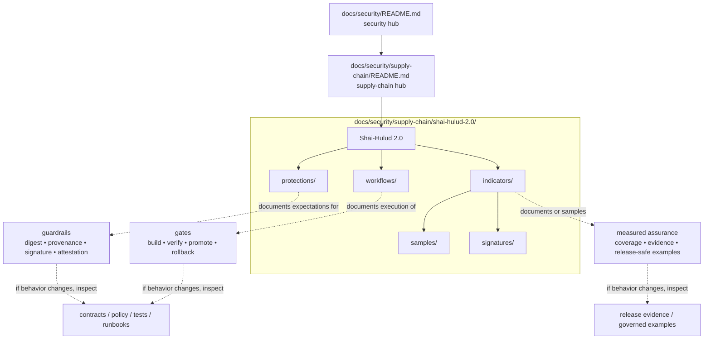

<!-- [KFM_META_BLOCK_V2]
doc_id: kfm://doc/TODO-UUID
title: Shai-Hulud 2.0
type: standard
version: v1
status: draft
owners: @bartytime4life
created: TODO-YYYY-MM-DD
updated: TODO-YYYY-MM-DD
policy_label: public
related: [docs/security/README.md, docs/security/supply-chain/README.md, docs/security/supply-chain/shai-hulud-2.0/protections/README.md, docs/security/supply-chain/shai-hulud-2.0/workflows/README.md, docs/security/supply-chain/shai-hulud-2.0/indicators/README.md, docs/security/supply-chain/shai-hulud-2.0/indicators/samples/README.md, docs/security/supply-chain/shai-hulud-2.0/indicators/signatures/README.md]
tags: [kfm, security, supply-chain, shai-hulud-2.0]
notes: [Owners are grounded from current /docs CODEOWNERS coverage; doc_id and dates still need verification; live subtree shape is confirmed on current public main; deeper semantics for the lane name remain intentionally bounded]
[/KFM_META_BLOCK_V2] -->

# Shai-Hulud 2.0

Named KFM supply-chain lane for documented protections, workflow expectations, and measurable assurance indicators.

> [!IMPORTANT]
> **Status:** experimental · **Doc maturity:** draft  
> **Owners:** @bartytime4life  
> **Path:** `docs/security/supply-chain/shai-hulud-2.0/README.md`  
>       
> **Quick jumps:** [Scope](#scope) · [Repo fit](#repo-fit) · [Accepted inputs](#accepted-inputs) · [Exclusions](#exclusions) · [Directory tree](#directory-tree) · [Quickstart](#quickstart) · [Usage](#usage) · [Diagram](#diagram) · [Tables](#tables) · [Task list](#task-list) · [FAQ](#faq) · [Appendix](#appendix)

> [!WARNING]
> The live public tree currently confirms this lane’s **shape**, not its **enforcement**. The presence of `protections/`, `workflows/`, `indicators/`, or `signatures/` does **not** by itself prove live signing, attestations, merge-blocking workflow gates, SBOM generation, or policy-bundle execution. Keep those claims linked to executable evidence elsewhere in the repo, or mark them `PROPOSED` / `NEEDS VERIFICATION`.

## Scope

This directory is the README-level index for a named supply-chain documentation lane inside KFM security docs.

At present, the public tree confirms three child areas:

- `protections/`
- `workflows/`
- `indicators/`  
  - `samples/`
  - `signatures/`

That structure is enough to support one disciplined interpretation:

- **`protections/`** should explain what guardrails belong to this lane.
- **`workflows/`** should explain how those guardrails are exercised, checked, promoted, or rolled back.
- **`indicators/`** should explain how assurance is measured, sampled, or demonstrated.

That interpretation is **INFERRED** from the live subtree and its surrounding supply-chain/security context. The deeper program meaning of the name **Shai-Hulud 2.0** remains **NEEDS VERIFICATION**.

### Truth posture used in this README

| Label | Meaning here |
|---|---|
| **CONFIRMED** | Visible in the current public repo tree or already established by adjacent repo docs |
| **INFERRED** | Strongly suggested by directory names and repo context, but not directly proven as mounted implementation |
| **PROPOSED** | Recommended structure, workflow, or documentation move for this lane |
| **NEEDS VERIFICATION** | Important but not directly established from the current visible repo state |

## Repo fit

This README sits beneath the supply-chain hub and above child lane docs. It should stay specific enough to make this lane maintainable, while avoiding duplication of sibling lanes or broader security doctrine.

| Relation | Link | Why it matters |
|---|---|---|
| Upstream | [`../../../README.md`](../../../README.md) | `docs/` doctrine, structure, and documentation expectations |
| Upstream | [`../../README.md`](../../README.md) | security hub and trust/supply-chain framing |
| Upstream | [`../README.md`](../README.md) | parent supply-chain lane |
| Downstream | [`./protections/README.md`](./protections/README.md) | control and guardrail intent |
| Downstream | [`./workflows/README.md`](./workflows/README.md) | process and gate sequencing |
| Downstream | [`./indicators/README.md`](./indicators/README.md) | measurable assurance and evidence signals |
| Downstream | [`./indicators/samples/README.md`](./indicators/samples/README.md) | release-safe examples and fixtures |
| Downstream | [`./indicators/signatures/README.md`](./indicators/signatures/README.md) | signature and attestation-oriented examples or reading notes |
| Sibling | [`../dependency-confusion/README.md`](../dependency-confusion/README.md) | dependency-source mix-up risks belong there |
| Sibling | [`../sigstore-cosign-v3/README.md`](../sigstore-cosign-v3/README.md) | Sigstore/Cosign-specific guidance belongs there |
| Sibling | [`../reference-repos/README.md`](../reference-repos/README.md) | external repo references and comparison material belong there |

## Accepted inputs

The following content belongs here:

- lane-specific guardrail documentation for supply-chain trust
- workflow notes for build, verify, promote, rollback, correction, or related review paths
- measurable indicators, examples, or sample evidence tied to this named lane
- cross-links to owning contracts, schemas, policy bundles, tests, fixtures, runbooks, or release-evidence docs
- redacted, synthetic, or otherwise public-safe signature / attestation / digest examples when they clarify how the lane should be interpreted

## Exclusions

The following content does **not** belong here:

- **private keys, secrets, tokens, credentials, or mutable live signing material**
- canonical generated proof artifacts that should instead live in their governed artifact or release-evidence home
- executable policy bundles, CI workflows, or test harnesses as source of truth when those belong in their owning directories
- general dependency-confusion, Sigstore/Cosign, or reference-repo doctrine that belongs in sibling supply-chain lanes
- broad repo-wide security doctrine that belongs higher in [`../../README.md`](../../README.md)
- claims that a control is enforced in code when the current repo evidence does not actually prove it

## Directory tree

```text
docs/security/supply-chain/shai-hulud-2.0/
├── README.md
├── protections/
│   └── README.md
├── workflows/
│   └── README.md
└── indicators/
    ├── README.md
    ├── samples/
    │   └── README.md
    └── signatures/
        └── README.md
```

> [!NOTE]
> This tree is intentionally limited to what is currently visible on the live public branch. If additional descendants are introduced later, update this section from mounted repo evidence first, not from memory or older planning docs.

## Quickstart

1. Confirm whether the change belongs in this lane or in a sibling supply-chain lane.
2. Edit the nearest child README first if the change is control-specific, workflow-specific, or indicator-specific.
3. Keep every trust-bearing claim explicit: `CONFIRMED`, `INFERRED`, `PROPOSED`, or `NEEDS VERIFICATION`.
4. If a change alters behavior, update the matching executable surfaces in the same review window.
5. Never commit secrets or live production signing material into this lane.

```bash
# Inspect the currently confirmed subtree
find docs/security/supply-chain/shai-hulud-2.0 -maxdepth 3 -type f | sort

# Compare this lane with adjacent supply-chain docs
find docs/security/supply-chain -maxdepth 2 -name README.md | sort

# Search for coupled trust surfaces before editing semantics
git grep -n "supply-chain\|signature\|attest\|sbom\|digest\|provenance" -- \
  docs contracts schemas policy tests .github 2>/dev/null || true
```

## Usage

This lane should behave like a coordination surface: it tells maintainers **what belongs here**, **what stays out**, and **what must change together** when the lane evolves.

> [!TIP]
> A change is incomplete if it only touches prose. When a documentation change alters trust-bearing meaning, also inspect the matching contracts, policy, tests, fixtures, runbooks, and release-evidence surfaces—or keep the change clearly marked as `PROPOSED` or `NEEDS VERIFICATION`.

| You need to... | Start here | Then inspect |
|---|---|---|
| define or tighten a control | [`./protections/README.md`](./protections/README.md) | matching policy, contracts, tests, and release evidence |
| document a gate or procedure | [`./workflows/README.md`](./workflows/README.md) | workflow ownership surfaces, runbooks, and rollback notes |
| define an assurance signal or threshold | [`./indicators/README.md`](./indicators/README.md) | fixtures, samples, release-safe evidence, and interpretation notes |
| add a sample artifact or example | [`./indicators/samples/README.md`](./indicators/samples/README.md) | redaction, provenance note, and public-safety check |
| add signature / attestation reading notes or examples | [`./indicators/signatures/README.md`](./indicators/signatures/README.md) | sibling Sigstore/Cosign guidance if tool-specific |
| write general Sigstore/Cosign material | [`../sigstore-cosign-v3/README.md`](../sigstore-cosign-v3/README.md) | avoid duplicating it here |
| write dependency-confusion guidance | [`../dependency-confusion/README.md`](../dependency-confusion/README.md) | keep lane boundaries clear |
| collect external repo references | [`../reference-repos/README.md`](../reference-repos/README.md) | keep comparisons centralized |

## Diagram



The right-hand side of this diagram is a **coupling model**, not a claim that those executable surfaces are already implemented specifically for this lane.

## Tables

### Lane registry

| Node | Current live status | What belongs here | What stays out |
|---|---|---|---|
| `README.md` | confirmed file | lane scope, repo fit, navigation, coupled-surface guidance | detailed control catalogs that belong in child docs |
| `protections/` | confirmed subdir + README | control intent, failure modes, required evidence, exclusions | step-by-step operational workflow detail |
| `workflows/` | confirmed subdir + README | trigger paths, gates, sequencing, rollback/correction hooks | broad control taxonomy or tool tutorial padding |
| `indicators/` | confirmed subdir + README | metrics, thresholds, interpretation, evidence classes | secrets or live production material |
| `indicators/samples/` | confirmed subdir + README | synthetic or release-safe examples | canonical emitted proof objects or mutable live receipts |
| `indicators/signatures/` | confirmed subdir + README | redacted signature/attestation examples, reading notes, format guidance | private keys, credentials, or active signing operations |

### Coupled change surfaces

| If this lane changes... | Also inspect |
|---|---|
| control meaning changes | policy bundles, contract shapes, schema examples, tests, fixtures |
| workflow meaning changes | CI/workflow ownership surfaces, runbooks, release notes, rollback docs |
| indicator threshold changes | samples, fixture expectations, release-safe evidence, interpretation notes |
| outward language changes | sibling supply-chain docs and higher-level security docs to prevent drift |
| trust-state expectations change | UI/state wording, release evidence, correction behavior, and surface caveats |

## Task list

**Definition of done for edits in this lane**

- [ ] This README still names the lane clearly and stays narrower than its parent hubs.
- [ ] Every newly introduced trust-bearing claim is either directly supported or visibly labeled.
- [ ] No secrets, private keys, raw credentials, or mutable live digests are committed here.
- [ ] Samples are synthetic, redacted, or otherwise safe for public source control.
- [ ] Child README links resolve to real files in the current tree.
- [ ] Sibling-lane overlap is reduced rather than increased.
- [ ] Behavior-significant changes are mirrored in owning executable or test surfaces, or explicitly deferred as `PROPOSED`.
- [ ] Superseded or stale guidance is corrected instead of silently abandoned.

## FAQ

### Is this the canonical home for all supply-chain guidance?

No. This is one named lane under the broader supply-chain hub. Keep broader doctrine in parent docs and tool-specific doctrine in sibling lanes.

### Does the existence of `signatures/` prove live signing or attestation enforcement?

No. It proves the directory exists. It does not prove working signing pipelines, key management, attestations, or merge gates.

### Can generated SBOMs, attestations, or proof bundles live here?

This lane may hold **documentation** and **release-safe examples**. Canonical generated artifacts should live in their governed artifact or release-evidence home, not as hand-maintained source files in this lane.

### Why split protections, workflows, and indicators?

Because KFM benefits when these stay distinct:
- **protections** explain guardrails,
- **workflows** explain execution paths,
- **indicators** explain measurable assurance.

Blending them makes drift harder to detect.

## Appendix

<details>
<summary>Suggested child README contracts and expansion notes</summary>

### Suggested contract for `protections/`

A strong child README in `protections/` should usually answer:

- what the control is called
- what failure it prevents or narrows
- what evidence would prove it is working
- what this control does **not** cover
- what related workflow and indicator pages must stay aligned

### Suggested contract for `workflows/`

A strong child README in `workflows/` should usually answer:

- what triggers the workflow
- what inputs it needs
- what outputs, artifacts, or states it emits
- what fail-closed behavior looks like
- what rollback or correction hooks exist
- what evidence a reviewer should expect to see

### Suggested contract for `indicators/`

A strong child README in `indicators/` should usually answer:

- what is being measured
- why that signal matters
- what source produces it
- what threshold or interpretation rule applies
- what blind spots remain
- where release-safe examples live

### Suggested contract for `indicators/samples/`

Use this child directory for:

- synthetic fixtures
- redacted excerpts
- release-safe examples
- explanatory before/after snippets

Avoid:

- mutable live proof objects
- secrets
- environment-specific credentials
- “temporary” artifacts with unclear provenance

### Suggested contract for `indicators/signatures/`

Use this child directory for:

- signature and attestation reading notes
- format examples
- redacted verification walkthroughs
- public-safe samples of what good evidence should look like

Avoid:

- private keys
- live signing material
- unverifiable copied blobs with no context
- tool-specific doctrine that properly belongs in `../sigstore-cosign-v3/README.md`

### Future expansion rule

If this lane grows beyond the current subtree, expand it from mounted repo evidence and keep the split legible:

- controls stay under `protections/`
- process stays under `workflows/`
- measured assurance stays under `indicators/`

If a new child directory cannot satisfy one of those three roles, it likely belongs elsewhere.

</details>

[Back to top](#shai-hulud-20)
