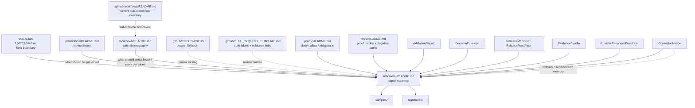

<!-- [KFM_META_BLOCK_V2]
doc_id: <REVIEW-REQUIRED: kfm://doc/uuid>
title: Shai-Hulud 2.0 Indicators
type: standard
version: v1
status: draft
owners: @bartytime4life
created: <REVIEW-REQUIRED: YYYY-MM-DD>
updated: <REVIEW-REQUIRED: YYYY-MM-DD>
policy_label: <REVIEW-REQUIRED: public|restricted|...>
related: [../README.md, ../protections/README.md, ../workflows/README.md, ./samples/README.md, ./signatures/README.md, ../../README.md, ../../sigstore-cosign-v3/README.md, ../../dependency-confusion/README.md, ../../reference-repos/README.md, ../../../../../.github/workflows/README.md, ../../../../../.github/CODEOWNERS, ../../../../../.github/PULL_REQUEST_TEMPLATE.md, ../../../../../policy/README.md, ../../../../../contracts/README.md, ../../../../../tests/README.md]
tags: [kfm, security, supply-chain, indicators, shai-hulud-2.0]
notes: [Target inferred from the uploaded draft and the current public-main file at this path; current public CODEOWNERS confirms @bartytime4life as the /docs/ fallback owner, while narrower lane ownership, doc dates, and policy label still need branch-local verification.]
[/KFM_META_BLOCK_V2] -->

# Shai-Hulud 2.0 Indicators

Interpret how lane-local assurance signals should be read without confusing documentation, proof objects, examples, and live enforcement.

> [!IMPORTANT]
> **Status:** experimental · **Doc maturity:** draft  
> **Owners:** `@bartytime4life` *(current public `/docs/` CODEOWNERS fallback; no narrower lane rule is visible on public `main`)*  
> **Path:** `docs/security/supply-chain/shai-hulud-2.0/indicators/README.md`  
>        
> **Quick jump:** [Scope](#scope) · [Repo fit](#repo-fit) · [Accepted inputs](#accepted-inputs) · [Exclusions](#exclusions) · [Current verified snapshot](#current-verified-snapshot) · [Directory tree](#directory-tree) · [Quickstart](#quickstart) · [Usage](#usage) · [Diagram](#diagram) · [Indicator model](#indicator-model) · [Task list](#task-list) · [FAQ](#faq) · [Appendix](#appendix)

> [!WARNING]
> This directory is an **interpretation and assurance surface**. It does **not** by itself prove live signing, attestation verification, SBOM emission, merge-blocking policy, or runtime enforcement. Treat executable protection claims as valid only when they are backed by workflow, policy, contract, test, release, or other directly inspectable evidence.

> [!NOTE]
> This revision is **doctrine-grounded** and **public-main-repo-grounded**. Current public `main` confirms the subtree, sibling READMEs, child READMEs, `/docs/` owner fallback, and the workflow-lane README-only caveat. It does **not** prove private settings, required checks, non-public workflow YAML, emitted proof packs, or runtime maturity.

---

## Scope

`indicators/` explains **what the lane measures**, **why the signal matters**, **where the signal comes from**, **how the signal should be interpreted**, and **where public-safe examples belong**.

Within the Shai-Hulud split:

- `protections/` explains intended guardrails and control surfaces.
- `workflows/` explains gate sequencing, automation meaning, promotion handoff, rollback choreography, and where workflow prose must hand off to executable repo surfaces.
- `indicators/` explains measurable assurance, interpretation, blind spots, and review cues.
- `samples/` and `signatures/` hold release-safe examples and redacted walkthrough material.

| Keep distinct | Why it matters here |
|---|---|
| **Control** | Tells a reviewer what guardrail should exist. |
| **Workflow** | Tells a reviewer how a guardrail is exercised, checked, promoted, rolled back, or corrected. |
| **Indicator** | Tells a reviewer how to read the evidence that a guardrail passed, failed, was withheld, was superseded, or still needs verification. |
| **Example** | Helps a reviewer inspect shape safely without mistaking sample material for live proof. |
| **Release claim** | Requires proof objects and review-bearing evidence outside this docs leaf. |

[Back to top](#shai-hulud-20-indicators)

## Repo fit

**Path:** `docs/security/supply-chain/shai-hulud-2.0/indicators/README.md`  
**Role in repo:** lane-local reference for indicator meaning, proof-object mapping, and interpretation rules under the named supply-chain lane.

### Upstream, downstream, and adjacent surfaces

| Relation | Link | Why it matters here | Current public-main posture |
|---|---|---|---|
| Parent lane | [`../README.md`](../README.md) | Defines the Shai-Hulud split and whole-lane boundary. | **CONFIRMED** |
| Sibling child lane | [`../protections/README.md`](../protections/README.md) | Guardrail intent belongs there, not here. | **CONFIRMED** |
| Sibling child lane | [`../workflows/README.md`](../workflows/README.md) | Gate sequence, workflow choreography, and promotion/rollback handoff belong there. | **CONFIRMED** |
| Child example lane | [`./samples/README.md`](./samples/README.md) | Release-safe examples, invalid examples, and review aids belong there. | **CONFIRMED** |
| Child signature lane | [`./signatures/README.md`](./signatures/README.md) | Signature- and attestation-oriented walkthrough material belongs there. | **CONFIRMED** |
| Parent supply-chain hub | [`../../README.md`](../../README.md) | Broader supply-chain framing and sibling-lane routing live there. | **CONFIRMED** |
| Tool doctrine sibling | [`../../sigstore-cosign-v3/README.md`](../../sigstore-cosign-v3/README.md) | Broader Sigstore/Cosign doctrine should migrate there when it stops being lane-local. | **CONFIRMED** |
| Package-origin sibling | [`../../dependency-confusion/README.md`](../../dependency-confusion/README.md) | Namespace and package-origin risk belongs there. | **CONFIRMED** |
| Comparison sibling | [`../../reference-repos/README.md`](../../reference-repos/README.md) | External repository comparison material belongs there. | **CONFIRMED** |
| Workflow inventory surface | [`../../../../../.github/workflows/README.md`](../../../../../.github/workflows/README.md) | Current public workflow inventory and README-only caveat live there. | **CONFIRMED** |
| Ownership surface | [`../../../../../.github/CODEOWNERS`](../../../../../.github/CODEOWNERS) | Confirms the current public `/docs/` owner fallback. | **CONFIRMED** fallback |
| Review template | [`../../../../../.github/PULL_REQUEST_TEMPLATE.md`](../../../../../.github/PULL_REQUEST_TEMPLATE.md) | Keeps truth labels and evidence links explicit in review. | **CONFIRMED** |
| Policy surface | [`../../../../../policy/README.md`](../../../../../policy/README.md) | Deny-by-default grammar, reasons, obligations, and policy-runtime routing live there. | **CONFIRMED** |
| Contract surface | [`../../../../../contracts/README.md`](../../../../../contracts/README.md) | Typed trust-object ownership should stay there, not in this README. | **CONFIRMED** adjacent path |
| Verification surface | [`../../../../../tests/README.md`](../../../../../tests/README.md) | Negative-path checks, proof burdens, and correction drills belong there. | **CONFIRMED** |

### Fit with KFM doctrine

This directory should stay downstream of the real contract, policy, workflow, review, and release-bearing layers.

A practical rule of thumb:

- use this README to define **signal meaning**
- use `workflows/` to define **gate choreography**
- use `policy/` and typed-object surfaces to define **machine-checkable decisions and payloads**
- use `tests/` to define **proof burden and negative-path coverage**
- use release / proof-pack surfaces to assert **outward truth**

[Back to top](#shai-hulud-20-indicators)

## Accepted inputs

This directory accepts material that makes assurance **inspectable** rather than merely asserted.

| Accepted input | What it should contain |
|---|---|
| Indicator definitions | A named signal, its purpose, and its measurement boundary. |
| Signal-to-proof mapping | Which proof objects or review artifacts the signal depends on. |
| Interpretation rules | Thresholds, bands, pass/fail semantics, or explicit `NEEDS VERIFICATION` status. |
| Blind spots | Known false positives, false negatives, scope gaps, or reading hazards. |
| Evidence-class notes | Whether a sample is synthetic, redacted, illustrative, or otherwise release-safe. |
| Release-safe examples | Annotated sample outputs or walk-through fragments that are safe to publish. |
| Cross-links | Pointers to sibling docs, child example docs, contracts, schemas, policy, review, or test surfaces. |
| Correction notes | Supersession, rollback, withdrawal, or narrowing guidance that changes how a signal should be read. |

## Exclusions

This directory is **not** the right place for every supply-chain concern.

| Keep out of `indicators/` | Put it here instead |
|---|---|
| Private keys, credentials, tokens, or live signing material | Never in repo docs; secure secret storage only. |
| Active workflow logic, CI jobs, gate implementation, orchestration details | [`../workflows/README.md`](../workflows/README.md) and the owning workflow files. |
| Control intent without a measurement frame | [`../protections/README.md`](../protections/README.md). |
| Canonical live proof objects from production or release pipelines | Their governed release / proof-pack / evidence home. |
| Generic Sigstore or Cosign tutorials | [`../../sigstore-cosign-v3/README.md`](../../sigstore-cosign-v3/README.md). |
| Dependency-origin / namespace / package-source risk analysis | [`../../dependency-confusion/README.md`](../../dependency-confusion/README.md). |
| Unverifiable copied blobs with no provenance or explanation | Do not commit them. |
| Repo-global schema doctrine duplicated in lane prose | `contracts/`, `schemas/`, and their owning docs. |
| Ad hoc policy grammar or reason-code vocabularies | `policy/` and the owning policy/test surfaces. |

## Current verified snapshot

The table below separates **current public-main facts** from **claims that still need separate proof**.

| Surface or claim | Current reading | Status |
|---|---|---|
| `docs/security/supply-chain/shai-hulud-2.0/indicators/README.md` exists on current public `main` | This file is a checked-in docs surface, not a hypothetical target. | **CONFIRMED** |
| `samples/README.md` and `signatures/README.md` are present beneath this subtree on current public `main` | Child example surfaces are real, not merely inferred. | **CONFIRMED** |
| The parent lane exposes `protections/`, `workflows/`, and `indicators/` beneath `shai-hulud-2.0` | The split is a real current-tree boundary. | **CONFIRMED** |
| `.github/workflows/README.md` says current public `main` contains `README.md` only in `.github/workflows/` | Workflow-lane prose can describe choreography, but it cannot by itself prove checked-in GitHub Actions YAML on current public `main`. | **CONFIRMED** current snapshot |
| Public workflow names visible in Actions history are historical or platform signal | They may be useful reconstruction clues, but they are not proof of current checked-in YAML inventory. | **CONFIRMED** historical signal |
| `.github/CODEOWNERS` assigns `/docs/` to `@bartytime4life` and does not call out this lane separately | The owner fallback is grounded; narrower lane ownership remains to be verified. | **CONFIRMED** fallback / **NEEDS VERIFICATION** narrower rule |
| `.github/PULL_REQUEST_TEMPLATE.md` requires explicit truth labels and evidence links | Review language in this README should stay aligned with that burden. | **CONFIRMED** |
| `policy/` and `tests/` are real top-level repo surfaces on current public `main` | Indicator prose can hand off to executable governance and proof surfaces without inventing them. | **CONFIRMED** |
| Active merge-blocking enforcement, emitted SBOMs, live signatures, live attestation verification, or release-proof emission for this lane | Not proven by the current public indicators subtree or the current public README-only workflow lane. | **NEEDS VERIFICATION** |
| Private GitHub rulesets, required checks, environment approvals, app permissions, and OIDC trust relationships | Not derivable from the current public tree alone. | **UNKNOWN** |

> [!CAUTION]
> A checked-in README, a subtree shape, or a historically visible workflow name is **not** the same thing as live enforcement.

[Back to top](#shai-hulud-20-indicators)

## Directory tree

### Current public leaf snapshot

```text
docs/security/supply-chain/shai-hulud-2.0/indicators/
├── README.md
├── samples/
│   └── README.md
└── signatures/
    └── README.md
```

### Current public lane context

```text
docs/security/supply-chain/shai-hulud-2.0/
├── README.md
├── protections/
│   └── README.md
├── workflows/
│   └── README.md
└── indicators/
    ├── README.md
    ├── samples/
    │   └── README.md
    └── signatures/
        └── README.md
```

## Quickstart

Use these checks when reviewing or extending this subtree.

```bash
# Inspect the lane and immediate children
find docs/security/supply-chain/shai-hulud-2.0 -maxdepth 3 -type f | sort

# Re-read the parent lane and sibling responsibilities
sed -n '1,260p' docs/security/supply-chain/README.md
sed -n '1,260p' docs/security/supply-chain/shai-hulud-2.0/README.md
sed -n '1,260p' docs/security/supply-chain/shai-hulud-2.0/protections/README.md
sed -n '1,260p' docs/security/supply-chain/shai-hulud-2.0/workflows/README.md
sed -n '1,320p' docs/security/supply-chain/shai-hulud-2.0/indicators/README.md

# Re-check adjacent review, workflow, policy, contract, and test surfaces
sed -n '1,260p' .github/workflows/README.md
sed -n '1,200p' .github/CODEOWNERS
sed -n '1,200p' .github/PULL_REQUEST_TEMPLATE.md
sed -n '1,260p' policy/README.md
sed -n '1,260p' contracts/README.md
sed -n '1,260p' tests/README.md

# Search for assurance and proof-object terms across the repo
git grep -n -E 'Shai-Hulud|SBOM|attest|cosign|signature|EvidenceBundle|DecisionEnvelope|RuntimeResponseEnvelope|CorrectionNotice|ReleaseManifest|ProofPack' \
  -- docs .github policy contracts schemas tests 2>/dev/null || true
```

### Review shortcut

1. Start at the parent lane README.
2. Decide whether the change belongs in **protections**, **workflows**, or **indicators**.
3. If it belongs here, define the signal and its interpretation before adding examples.
4. Put public-safe examples in `samples/` or `signatures/`.
5. If the change affects release claims, re-check workflow, policy, contract, test, and review surfaces before merge.

[Back to top](#shai-hulud-20-indicators)

## Usage

| You need to… | Start here | Then inspect |
|---|---|---|
| Define a new assurance signal | This README | `../workflows/README.md`, `./samples/README.md`, `./signatures/README.md` |
| Explain what a signal means when present, absent, stale, generalized, withdrawn, or superseded | This README | Policy, review, workflow, and contract surfaces that actually produce the state |
| Link an indicator to KFM proof objects | This README | Contracts / schemas / policy docs for `DecisionEnvelope`, `EvidenceBundle`, `ReleaseManifest`, `CorrectionNotice`, and related objects |
| Add a release-safe walkthrough | `./samples/README.md` or `./signatures/README.md` | This README for interpretation and cautions |
| Change gate semantics that alter signal meaning | `../workflows/README.md` | This README and adjacent policy / contract / schema surfaces |
| Change intended control wording that should later be measured | `../protections/README.md` | Then update this README if measurement meaning changes |
| Re-check owner fallback or review burden | `.github/CODEOWNERS`, `.github/PULL_REQUEST_TEMPLATE.md` | This README only for mirrored lane context |

## Diagram



> [!NOTE]
> The diagram shows **responsibility flow and interpretation dependencies**. It is not proof that every named object or gate is currently emitted on the checked-in public branch.

## Indicator model

Indicators in this lane should not be a loose checklist. They should tell a reviewer **which proof objects matter**, **what absence means**, **what negative outcomes must stay visible**, and **what should block an overconfident claim**.

### Reading statuses used here

| Status | Meaning in this README |
|---|---|
| **CONFIRMED** | Supported by current public repo evidence or attached KFM doctrine. |
| **INFERRED** | Strongly implied by the current tree and repeated KFM doctrine, but not directly proven as executable behavior. |
| **PROPOSED** | Recommended measurement pattern or interpretation contract. |
| **NEEDS VERIFICATION** | Useful, important, or tempting to overclaim, but not directly proven from the current public branch or an executable surface in hand. |
| **UNKNOWN** | Not supported strongly enough to present as current repo or runtime fact. |

### Indicator-to-proof-object alignment

| Indicator concern | KFM object families that usually matter | Why it belongs here |
|---|---|---|
| Source and intake trace | `SourceDescriptor`, `IngestReceipt`, `ValidationReport` | Shows that the subject entered a governed path and passed or failed intake checks. |
| Authoritative candidate / publishable subject set | `DatasetVersion` | Indicates what subject set or artifact scope is actually under review or release. |
| Outward metadata closure | `CatalogClosure` | Makes public scope, identifiers, and lineage linkage legible. |
| Policy outcome visibility | `DecisionEnvelope` | Prevents “it exists” from being mistaken for “it is allowed.” |
| Human approval / denial boundary | `ReviewRecord` | Keeps policy-significant transitions inspectable. |
| Release readiness / proof assembly | `ReleaseManifest`, `ReleaseProofPack` | Prevents release claims from outrunning actual proof assembly. |
| Derived build lineage | `ProjectionBuildReceipt` | Shows that a derived delivery surface came from a known release scope. |
| Runtime support package | `EvidenceBundle` | Makes evidence drill-through ordinary product behavior. |
| Runtime accountability | `RuntimeResponseEnvelope` | Makes answer / abstain / deny / error outcomes inspectable. |
| Correction and supersession memory | `CorrectionNotice` | Preserves rollback, replacement, narrowing, or withdrawal lineage. |

### Starter indicator classes

The table below is a **PROPOSED** lane-local starter taxonomy. It is documentation structure, not proof that every signal is already implemented in code or CI.

| Indicator class | What it measures | Typical upstream evidence | Interpretation rule | Default status |
|---|---|---|---|---|
| Coverage | Whether expected proof objects or checks are present at all | Workflow output, review packet, release manifest, proof pack | Absence should stay visible; never infer “pass” from directory presence alone. | **PROPOSED** |
| Integrity anchor | Whether immutable identity anchors are present | Digests, artifact identifiers, signature refs, attestation refs | Mutable tags and labels are convenience only; trust should attach to immutable identity when available. | **PROPOSED** |
| Verification outcome | Whether trust material was actually checked, not only generated | Validation reports, decision results, review records, verifier output | Generation without verification is insufficient. | **PROPOSED** |
| Policy visibility | Whether a lane decision is machine-readable and reviewable | `DecisionEnvelope`, obligation codes, review notes | “Allowed” and “produced” are different states and must not collapse. | **PROPOSED** |
| Runtime accountability | Whether answer surfaces expose scoped retrieval and negative outcomes | `EvidenceBundle`, `RuntimeResponseEnvelope` | If evidence cannot resolve or citations fail, the surface should abstain / deny / error rather than bluff. | **PROPOSED** |
| Correction memory | Whether supersession, rollback, narrowing, or withdrawal remains legible | `CorrectionNotice`, review records, release lineage | Do not silently overwrite prior trust state. | **PROPOSED** |
| Example safety | Whether examples are publication-safe | `samples/`, `signatures/`, redaction notes, preview limits | Unsafe examples stay out of docs entirely. | **CONFIRMED** README rule |

### What belongs where

| Surface | Put here | Keep out |
|---|---|---|
| `indicators/README.md` | Signal definitions, interpretation logic, proof-object mapping, blind spots, cross-links | Secrets, live workflow code, raw proof blobs, copied verifier output without context |
| `indicators/samples/` | Synthetic or redacted examples, annotated walkthroughs, release-safe screenshots/snippets | Canonical emitted proof artifacts from live releases |
| `indicators/signatures/` | Signature- or attestation-oriented examples, redacted verification walkthroughs, format notes | Private keys, credentials, live signing steps |
| `workflows/` | Job order, fail-closed sequencing, promotion logic, gate execution | Signal taxonomy duplicated from this README |
| `protections/` | Guardrail descriptions and intended control surfaces | Interpretive tables that belong with indicators |

[Back to top](#shai-hulud-20-indicators)

## Task list

### Definition of done for this README

- [ ] Every indicator answers what is being measured.
- [ ] Every indicator answers why the signal matters.
- [ ] The source surface or proof-object family is named.
- [ ] The interpretation rule is explicit, or marked `NEEDS VERIFICATION`.
- [ ] Blind spots are visible.
- [ ] `samples/` and `signatures/` links resolve in the checked-out branch.
- [ ] No secrets, private keys, or active signing material are committed.
- [ ] Changes affecting gate meaning also review `../workflows/README.md`.
- [ ] Changes affecting intended control wording also review `../protections/README.md`.
- [ ] Unknown implementation details remain visible instead of being smoothed away.

### Review gates worth asking before merge

- [ ] Did this change turn a measurement surface into a workflow tutorial?
- [ ] Did it imply live enforcement that is not directly proven?
- [ ] Did it blur the difference between example, proof, and policy?
- [ ] Did it remove a useful uncertainty label?
- [ ] Did it weaken correction visibility, release linkage, or proof-object drill-through?
- [ ] Did it introduce tool-specific doctrine that should live in a sibling lane instead?
- [ ] Did it drift from the current public workflow, ownership, or review surfaces without checking them explicitly?

## FAQ

### Does this README prove that Shai-Hulud 2.0 protections are live?

No. It defines and interprets assurance signals. Live protection claims need executable backing elsewhere.

### What is the difference between an indicator and a workflow?

A workflow does something. An indicator tells you how to read the evidence that the thing happened, failed, was withheld, was superseded, or still needs verification.

### Why split `samples/` from `signatures/`?

Because not every release-safe example is signature-specific. `samples/` is the broader example surface. `signatures/` is the narrower place for redacted signature / attestation material.

### Should canonical proof objects live here?

No. This directory can describe them, interpret them, or point to safe examples of them. It should not become canonical storage for live proof artifacts.

### What if a threshold or interpretation rule is still unstable?

Write the indicator, keep the uncertainty visible, and label the threshold `NEEDS VERIFICATION`.

### What should happen when evidence cannot resolve cleanly?

The lane should stay aligned with KFM’s fail-closed posture: do not upgrade the claim; preserve the negative state and route the reader toward review, denial, abstention, or correction instead.

### Is this file allowed to mention tool names such as Sigstore or Cosign?

Yes, when they are directly relevant to the lane. But tool doctrine that becomes broader than this lane should migrate to the appropriate sibling docs.

[Back to top](#shai-hulud-20-indicators)

## Appendix

<details>
<summary><strong>PROPOSED starter indicator card format</strong></summary>

Use a compact, reviewable structure when you add lane-local indicators.

```md
### <indicator-name>
- **Status:** CONFIRMED | INFERRED | PROPOSED | NEEDS VERIFICATION | UNKNOWN
- **Measures:** <what signal is being measured>
- **Why it matters:** <why this changes trust, release confidence, or review posture>
- **Reads from:** <workflow / policy / contract / proof object / example surface>
- **Interpretation rule:** <threshold, bands, pass/fail semantics, or explicit uncertainty>
- **Blind spots:** <known limitations, false positives, false negatives, scope gaps>
- **Public-safe examples:** <relative links to samples or signatures>
- **Coupled surfaces:** <workflows / protections / sibling lanes that must stay aligned>
```

</details>

<details>
<summary><strong>PROPOSED starter indicator candidates</strong></summary>

Useful starter candidates for this lane, only when backed by inspectable evidence, include:

- immutable artifact identity present
- signature reference present
- attestation reference present
- SBOM reference present
- verification result recorded
- policy result linked
- review record linked where required
- release manifest / proof-pack linkage visible
- correction / rollback linkage visible
- public-safe example available

Documenting a candidate here does **not** mean the repo already emits it.

</details>

<details>
<summary><strong>Interpretation style guide</strong></summary>

Prefer language like:

- **CONFIRMED:** current public repo evidence or attached doctrine supports the claim
- **INFERRED:** structure strongly suggests the behavior or path, but direct executable proof is missing
- **PROPOSED:** recommended contract, threshold, or documentation pattern
- **NEEDS VERIFICATION:** useful signal, but the real source or enforcement is not yet proven
- **UNKNOWN:** not supported strongly enough to make a current claim

Avoid language like:

- “guaranteed”
- “fully enforced”
- “production active”
- “merge-blocking”
- “signed”
- “verified”

…unless the executable evidence is directly in hand and reviewable.

</details>
