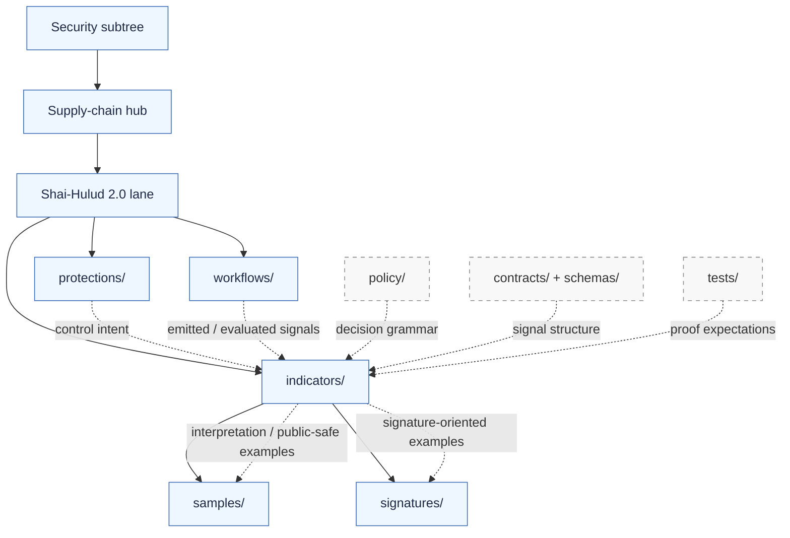

<!-- [KFM_META_BLOCK_V2]
doc_id: <REVIEW-REQUIRED: kfm://doc/uuid>
title: Shai-Hulud 2.0 Indicators
type: standard
version: v1
status: draft
owners: <REVIEW-REQUIRED: confirm @bartytime4life or narrower path owner>
created: <REVIEW-REQUIRED: YYYY-MM-DD>
updated: <REVIEW-REQUIRED: YYYY-MM-DD>
policy_label: <REVIEW-REQUIRED: public|restricted|...>
related: [../README.md, ../protections/README.md, ../workflows/README.md, ./samples/README.md, ./signatures/README.md, ../../sigstore-cosign-v3/README.md, ../../dependency-confusion/README.md, ../../reference-repos/README.md]
tags: [kfm, security, supply-chain, indicators, shai-hulud-2.0]
notes: [Replaces a scaffold README; metadata values that were not directly verifiable from current repo-visible evidence are intentionally left as review placeholders.]
[/KFM_META_BLOCK_V2] -->

# Shai-Hulud 2.0 Indicators

Measurable assurance surface for the named supply-chain lane under `docs/security/supply-chain/shai-hulud-2.0/indicators/`.

> [!IMPORTANT]
> **Status:** experimental  
> **Doc maturity:** draft  
> **Owners:** `@bartytime4life` *(verify before merge if this lane now has narrower ownership)*  
>
> 
> 
> 
> 
> 
> 
>
> **Quick jump:** [Scope](#scope) · [Repo fit](#repo-fit) · [Accepted inputs](#accepted-inputs) · [Exclusions](#exclusions) · [Current verified snapshot](#current-verified-snapshot) · [Directory tree](#directory-tree) · [Quickstart](#quickstart) · [Usage](#usage) · [Diagram](#diagram) · [Indicator classes](#indicator-classes) · [Task list](#task-list) · [FAQ](#faq) · [Appendix](#appendix)

> [!WARNING]
> This directory is a **measurement and interpretation** surface, not proof by itself that live signing, attestation, SBOM emission, or merge-blocking enforcement already exists in mounted implementation. Treat executable protection claims as valid only when they are backed by governed workflow, policy, contract, test, or release evidence.

---

## Scope

`indicators/` is where this lane explains **what is being measured**, **why the signal matters**, **where the signal comes from**, **how it should be interpreted**, and **where public-safe examples live**.

In the Shai-Hulud split:

- `protections/` explains **guardrails and intended controls**
- `workflows/` explains **gates, sequencing, and machine-executed behavior**
- `indicators/` explains **measurable assurance and interpretation**
- `samples/` and `signatures/` hold **release-safe supporting examples**

This README should stay narrow enough that the lane remains legible under review pressure.

[Back to top](#shai-hulud-20-indicators)

## Repo fit

**Path:** `docs/security/supply-chain/shai-hulud-2.0/indicators/`

### Upstream and adjacent surfaces

| Relation | Link | Why it matters here |
|---|---|---|
| Parent lane | [`../README.md`](../README.md) | Defines the Shai-Hulud 2.0 lane and its protections / workflows / indicators split. |
| Supply-chain hub | [`../../README.md`](../../README.md) | Connects this lane to broader release integrity and provenance doctrine. |
| Security hub | [`../../../README.md`](../../../README.md) | Establishes subtree-wide truth posture, fail-closed expectations, and documentation discipline. |
| Sibling surface | [`../protections/README.md`](../protections/README.md) | Put control intent and guardrails there, not indicator interpretation. |
| Sibling surface | [`../workflows/README.md`](../workflows/README.md) | Put gate choreography and execution behavior there, not here. |
| Sibling lane | [`../../sigstore-cosign-v3/README.md`](../../sigstore-cosign-v3/README.md) | Tool-specific signature / verification doctrine belongs there when it stops being lane-local. |
| Sibling lane | [`../../dependency-confusion/README.md`](../../dependency-confusion/README.md) | Dependency-source and package-origin risks belong there. |
| Sibling lane | [`../../reference-repos/README.md`](../../reference-repos/README.md) | External comparison repos and reference implementations belong there. |

### Downstream surfaces

| Child | Link | Intended role |
|---|---|---|
| Release-safe examples | [`./samples/README.md`](./samples/README.md) | Synthetic, redacted, or otherwise public-safe indicator examples. |
| Signature/attestation examples | [`./signatures/README.md`](./signatures/README.md) | Format notes, redacted verification walk-throughs, and safe signature-oriented examples. |

## Accepted inputs

This directory accepts materials that make assurance signals **inspectable** rather than merely asserted.

| Accepted input | What it should contain |
|---|---|
| Indicator definitions | A named signal, its purpose, and its measurement boundary. |
| Interpretation rules | Thresholds, bands, or explicit “present / missing / needs verification” logic. |
| Source-surface mapping | Where the signal comes from: workflow output, policy result, contract validation, release artifact, review record, or public-safe example. |
| Blind spots | Known false positives, false negatives, scope gaps, or interpretation limits. |
| Evidence class notes | Whether an example is synthetic, redacted, illustrative, or release-safe. |
| Cross-links | Pointers to `samples/`, `signatures/`, sibling workflow docs, or related supply-chain lanes. |
| Review notes | Lane-specific cautions that materially affect how a signal should be read. |

## Exclusions

This directory is **not** the place for everything related to supply-chain trust.

| Keep out of `indicators/` | Put it here instead |
|---|---|
| Private keys, credentials, tokens, or live signing material | Nowhere in docs; secure operational secret stores only |
| Active workflow logic, CI gate implementation, job orchestration | [`../workflows/README.md`](../workflows/README.md) |
| Control intent without a measurement frame | [`../protections/README.md`](../protections/README.md) |
| Canonical emitted proof objects from live releases | Release / proof-pack / evidence locations defined by executable system surfaces |
| Free-floating Sigstore/Cosign tutorials | [`../../sigstore-cosign-v3/README.md`](../../sigstore-cosign-v3/README.md) |
| Dependency-origin / namespace / package-source risk analysis | [`../../dependency-confusion/README.md`](../../dependency-confusion/README.md) |
| Unverifiable copied blobs with no provenance or explanation | Do not commit |
| General repo schema doctrine | `contracts/`, `schemas/`, and their owning docs |

## Current verified snapshot

The current lane shape that should remain stable unless the subtree is intentionally reorganized:

| Surface | Current role in review | Confidence |
|---|---|---|
| `README.md` | This directory’s contract and interpretation surface | **CONFIRMED** |
| `samples/` | Child area for release-safe examples | **CONFIRMED** |
| `signatures/` | Child area for redacted signature / attestation examples | **CONFIRMED** |
| Lane-specific live workflow YAML | Not proven here | **NEEDS VERIFICATION** |
| Live emitted proof artifacts for this lane | Not proven here | **NEEDS VERIFICATION** |
| Active signing / attestation enforcement | Not proven here | **NEEDS VERIFICATION** |

## Directory tree

```text
docs/security/supply-chain/shai-hulud-2.0/indicators/
├── README.md
├── samples/
│   └── README.md
└── signatures/
    └── README.md
```

## Quickstart

Use these checks when reviewing or extending this subtree.

```bash
# Inspect the lane and its immediate children
find docs/security/supply-chain/shai-hulud-2.0/indicators -maxdepth 3 -type f | sort

# Re-read the lane split before changing indicator semantics
sed -n '1,240p' docs/security/supply-chain/shai-hulud-2.0/README.md

# Inspect adjacent responsibilities
sed -n '1,240p' docs/security/supply-chain/shai-hulud-2.0/protections/README.md
sed -n '1,260p' docs/security/supply-chain/shai-hulud-2.0/workflows/README.md

# Search for assurance-related terms across policy / contracts / tests / workflows
git grep -n "sbom\|digest\|signature\|attest\|provenance\|proof\|rollback\|correction" \
  -- docs policy contracts schemas tests .github 2>/dev/null || true
```

### Review shortcut

1. Start at the parent lane README.
2. Confirm whether the signal belongs in **protections**, **workflows**, or **indicators**.
3. If it belongs here, add or revise the indicator definition first.
4. Put public-safe examples in `samples/` or `signatures/`.
5. When the signal affects gating or release claims, inspect sibling workflow and policy surfaces before merge.

[Back to top](#shai-hulud-20-indicators)

## Usage

| You need to… | Start here | Then inspect |
|---|---|---|
| Define a new assurance signal | This README | `./samples/README.md`, `./signatures/README.md`, `../workflows/README.md` |
| Explain what a signal means when present or absent | This README | Contracts, policy, tests, or workflow surfaces that actually emit or evaluate it |
| Add a release-safe indicator example | `./samples/README.md` | This README for interpretation and caveats |
| Add a redacted signature / attestation example | `./signatures/README.md` | `../../sigstore-cosign-v3/README.md` if the material becomes tool-specific doctrine |
| Change a gate that affects indicator meaning | `../workflows/README.md` | This README, plus policy/contracts/tests surfaces |
| Change guardrail intent that should later be measured | `../protections/README.md` | Then update this README if the measurement model changes |

## Diagram



> [!NOTE]
> Dotted links show **coupling and inspection paths**, not proof of mounted implementation.

## Indicator classes

The table below is a **starter interpretation model** for this directory. Treat it as documentation structure, not as proof that each signal is already emitted in code or CI.

| Indicator class | What it measures | Typical source surface | Interpretation rule | Posture |
|---|---|---|---|---|
| Coverage | Whether expected trust artifacts or checks are represented at all | Workflow output, release inventory, review notes, safe examples | Absence should remain visible; never infer “pass” from directory presence alone | PROPOSED |
| Integrity | Whether an immutable identity anchor is present | Digest references, manifest references, artifact identity notes | Mutable tags are convenience only; trust should attach to immutable identity when available | PROPOSED |
| Provenance | Whether origin and build context can be reconstructed | Attestation refs, provenance notes, release-safe verification examples | If provenance cannot be followed, treat trust gain as partial or blocked | PROPOSED |
| Verification | Whether trust material was **checked**, not merely generated | Gate results, verifier output, signed review notes, walkthroughs | Generation without verification is insufficient | PROPOSED |
| Safety | Whether examples are public-safe and reviewable | `samples/`, `signatures/`, redaction notes | Unsafe material stays out of docs entirely | CONFIRMED README rule |
| Correction memory | Whether supersession, withdrawal, rollback, or replacement stays legible | Release notes, correction notes, governed examples | Do not silently overwrite prior trust state | PROPOSED |

### What belongs where

| Surface | Put here | Keep out |
|---|---|---|
| `indicators/README.md` | Definitions, classes, thresholds, interpretation notes, blind spots, cross-links | Live proof objects, secrets, raw operational blobs |
| `indicators/samples/` | Synthetic or release-safe examples, annotated walkthrough inputs/outputs | Canonical emitted receipts from live releases |
| `indicators/signatures/` | Redacted signature / attestation examples, format reading notes, verification walkthroughs | Private keys, credentials, live signing steps |
| `workflows/` | Gate order, job intent, fail-closed sequencing, promotion logic | Metric taxonomies duplicated from this README |
| `protections/` | Guardrail descriptions and intended control surfaces | Gate choreography and indicator interpretation |

## Task list

### Definition of done for this README

- [ ] Every indicator described here answers **what is measured**
- [ ] Every indicator described here answers **why the signal matters**
- [ ] The source surface is named
- [ ] The interpretation rule is explicit, or marked `NEEDS VERIFICATION`
- [ ] Blind spots are visible
- [ ] `samples/` and `signatures/` links resolve
- [ ] No secrets, private keys, or active signing material are committed
- [ ] Changes that affect gating also review `../workflows/README.md`
- [ ] Changes that affect control intent also review `../protections/README.md`
- [ ] Unknown implementation details remain visible instead of being smoothed away

### Review gates worth asking before merge

- [ ] Did this change accidentally turn a measurement surface into a workflow tutorial?
- [ ] Did it imply live enforcement that is not directly proven?
- [ ] Did it blur the difference between **example**, **proof**, and **policy**?
- [ ] Did it hide a blind spot that a steward or reviewer will need later?

[Back to top](#shai-hulud-20-indicators)

## FAQ

### Does this README prove that Shai-Hulud 2.0 protections are live?

No. This README defines and interprets assurance signals. Live protection claims need executable backing elsewhere.

### What is the difference between an indicator and a workflow?

A workflow **does** something. An indicator **tells you how to read the evidence** that the thing happened, failed, was skipped, or still needs verification.

### Why split `samples/` from `signatures/`?

Because not every safe example is signature-specific. `samples/` is the broad release-safe example surface; `signatures/` is the narrower place for redacted signature / attestation-oriented material.

### Should canonical release proof objects live here?

No. This directory can describe them, point to them, or show safe examples of them. It should not become the canonical storage surface for live emitted proof.

### What if a threshold is not stable yet?

Write the indicator, mark the threshold `NEEDS VERIFICATION`, and keep the uncertainty visible.

### Where should tool-specific Sigstore or Cosign guidance go?

Use the sibling [`../../sigstore-cosign-v3/README.md`](../../sigstore-cosign-v3/README.md) when the material becomes tool doctrine rather than lane-local example handling.

## Appendix

<details>
<summary><strong>PROPOSED starter indicator card format</strong></summary>

Use a compact, reviewable structure when you add lane-local indicators.

```md
### <indicator-name>

- **Status:** CONFIRMED | INFERRED | PROPOSED | NEEDS VERIFICATION
- **Measures:** <what signal is being measured>
- **Why it matters:** <why this changes trust, release confidence, or review posture>
- **Source surface:** <workflow / policy / contract / test / example / review record>
- **Interpretation rule:** <threshold, bands, pass/fail semantics, or explicit uncertainty>
- **Blind spots:** <known limitations, false positives, false negatives, scope gaps>
- **Public-safe examples:** <relative links to samples or signatures>
- **Coupled surfaces:** <workflows / protections / sibling lanes that must stay aligned>
```

</details>

<details>
<summary><strong>PROPOSED starter indicator candidates</strong></summary>

These are reasonable starter classes for this lane **only when backed by executable evidence**:

- digest reference present
- artifact subject reference present
- attestation reference present
- SBOM reference present
- verification outcome recorded
- policy decision linked
- release-safe example available
- rollback / correction linkage visible

Documenting a candidate here does **not** mean the repo already emits it.

</details>

<details>
<summary><strong>Interpretation style guide</strong></summary>

Prefer language like:

- **CONFIRMED:** direct repo-visible or executable evidence supports the claim
- **INFERRED:** structure strongly suggests the behavior or ownership, but direct proof is missing
- **PROPOSED:** recommended contract, threshold, or documentation pattern
- **NEEDS VERIFICATION:** the signal is useful, but its real source or enforcement is not yet proven

Avoid language like:

- “guaranteed”
- “fully enforced”
- “production active”
- “merge-blocking”
- “signed”
- “verified”

…unless the executable evidence is directly in hand and reviewable.

</details>
