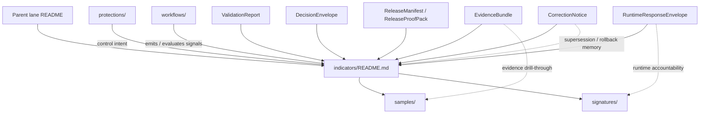

<!-- [KFM_META_BLOCK_V2]
doc_id: <REVIEW-REQUIRED: kfm://doc/uuid>
title: Shai-Hulud 2.0 Indicators
type: standard
version: v1
status: draft
owners: <REVIEW-REQUIRED: confirm @bartytime4life or narrower path owner>
created: <REVIEW-REQUIRED: YYYY-MM-DD>
updated: <REVIEW-REQUIRED: YYYY-MM-DD>
policy_label: <REVIEW-REQUIRED: public|restricted|...>
related: [../README.md, ../protections/README.md, ../workflows/README.md, ./samples/README.md, ./signatures/README.md, ../../sigstore-cosign-v3/README.md, ../../dependency-confusion/README.md, ../../reference-repos/README.md]
tags: [kfm, security, supply-chain, indicators, shai-hulud-2.0]
notes: [Replaces a scaffold README; metadata values that were not directly verifiable from current repo-visible evidence are intentionally left as review placeholders.]
[/KFM_META_BLOCK_V2] -->

# Shai-Hulud 2.0 Indicators

Measurable assurance and interpretation surface for the supply-chain lane under `docs/security/supply-chain/shai-hulud-2.0/indicators/`.

> [!IMPORTANT]
> **Status:** experimental  
> **Doc maturity:** draft  
> **Owners:** `<REVIEW-REQUIRED: confirm @bartytime4life or narrower path owner>`  
>
> 
> 
> 
> 
> 
> 
>
> **Quick jump:** [Scope](#scope) · [Repo fit](#repo-fit) · [Accepted inputs](#accepted-inputs) · [Exclusions](#exclusions) · [Current session verification posture](#current-session-verification-posture) · [Directory tree](#directory-tree) · [Quickstart](#quickstart) · [Usage](#usage) · [Diagram](#diagram) · [Indicator model](#indicator-model) · [Task list](#task-list) · [FAQ](#faq) · [Appendix](#appendix)

> [!WARNING]
> This directory is an **interpretation and assurance surface**. It does **not** by itself prove that live signing, attestation, SBOM generation, merge-blocking policy, or runtime enforcement already exists in the mounted implementation. Treat executable protection claims as valid only when they are backed by workflow, policy, contract, test, release, or other directly inspectable evidence.

> [!NOTE]
> Current-session doctrine is much stronger than current-session repo verification. This README is therefore written to be **repo-ready** while keeping path-level and implementation-level uncertainty visible where the mounted checkout was not directly inspected.

---

## Scope

`indicators/` explains **what the lane measures**, **why the signal matters**, **where the signal comes from**, **how the signal should be interpreted**, and **where public-safe examples belong**.

Within the Shai-Hulud split:

- `protections/` explains intended guardrails and control surfaces
- `workflows/` explains gate sequencing, automation, and machine-executed behavior
- `indicators/` explains measurable assurance, interpretation, and review cues
- `samples/` and `signatures/` hold release-safe examples and redacted walkthrough material

This README should stay narrow enough that the lane remains readable under review pressure, but strong enough that a reviewer can tell the difference between:

- a **control**
- a **measurement**
- a **proof object**
- an **example**
- a **release claim**

[Back to top](#shai-hulud-20-indicators)

## Repo fit

**Path:** `docs/security/supply-chain/shai-hulud-2.0/indicators/`

This file is the lane-local reference for indicator meaning. It should complement adjacent supply-chain docs rather than repeat them.

### Expected upstream and adjacent surfaces

| Relation | Link | Intended role here | Evidence status |
|---|---|---|---|
| Parent lane | [`../README.md`](../README.md) | Lane purpose, threat framing, and high-level split across protections / workflows / indicators | **INFERRED current path** |
| Sibling surface | [`../protections/README.md`](../protections/README.md) | Guardrail and intended-control descriptions belong there | **INFERRED current path** |
| Sibling surface | [`../workflows/README.md`](../workflows/README.md) | Gate choreography, execution order, and CI/runtime behavior belong there | **INFERRED current path** |
| Broader tool doctrine | [`../../sigstore-cosign-v3/README.md`](../../sigstore-cosign-v3/README.md) | Tool-specific signature or verification doctrine should move there when it stops being lane-local | **INFERRED current path** |
| Related supply-chain lane | [`../../dependency-confusion/README.md`](../../dependency-confusion/README.md) | Package-origin and namespace-risk material belongs there | **INFERRED current path** |
| External-comparison lane | [`../../reference-repos/README.md`](../../reference-repos/README.md) | Reference implementations and comparison repos belong there | **INFERRED current path** |

### Expected downstream surfaces

| Child | Link | Intended role |
|---|---|---|
| Release-safe examples | [`./samples/README.md`](./samples/README.md) | Synthetic, redacted, or otherwise public-safe indicator examples |
| Signature-oriented examples | [`./signatures/README.md`](./signatures/README.md) | Redacted signature / attestation examples and verification walk-throughs |

## Accepted inputs

This directory accepts materials that make assurance **inspectable** rather than merely asserted.

| Accepted input | What it should contain |
|---|---|
| Indicator definitions | A named signal, its purpose, and its measurement boundary |
| Signal-to-proof mapping | Which proof objects or review artifacts the signal depends on |
| Interpretation rules | Thresholds, bands, pass/fail semantics, or explicit `NEEDS VERIFICATION` status |
| Blind spots | Known false positives, false negatives, scope gaps, or reading hazards |
| Evidence-class notes | Whether a sample is synthetic, redacted, illustrative, or otherwise release-safe |
| Release-safe examples | Annotated sample outputs or walk-through fragments that are safe to publish |
| Cross-links | Pointers to sibling docs, child example docs, contracts, schemas, or policy surfaces |
| Correction notes | Supersession, rollback, withdrawal, or narrowing guidance that changes how a signal should be read |

## Exclusions

This directory is **not** the right place for every supply-chain concern.

| Keep out of `indicators/` | Put it here instead |
|---|---|
| Private keys, credentials, tokens, or live signing material | Never in repo docs; secure secret storage only |
| Active workflow logic, CI jobs, gate implementation, orchestration details | [`../workflows/README.md`](../workflows/README.md) |
| Control intent without a measurement frame | [`../protections/README.md`](../protections/README.md) |
| Canonical live proof objects from production or release pipelines | Release / proof-pack / evidence locations defined by governed system surfaces |
| Generic Sigstore or Cosign tutorials | [`../../sigstore-cosign-v3/README.md`](../../sigstore-cosign-v3/README.md) |
| Dependency-origin / namespace / package-source risk analysis | [`../../dependency-confusion/README.md`](../../dependency-confusion/README.md) |
| Unverifiable copied blobs with no provenance or explanation | Do not commit |
| Repo-global schema doctrine duplicated in lane prose | `contracts/`, `schemas/`, and their owning docs |

## Current session verification posture

The table below separates **current doctrinal certainty** from **current repo-visibility limits**.

| Surface or claim | Current reading | Status |
|---|---|---|
| KFM truth posture requires governed publication, fail-closed outcomes, visible correction, and authoritative-vs-derived separation | Strongly supported by current-session KFM manuals | **CONFIRMED** |
| Evidence Drawer / bounded Focus behavior are trust-critical shell concepts | Strongly supported by current-session KFM manuals | **CONFIRMED** |
| Indicators should map to typed proof objects and policy outcomes, not just prose | Strongly supported by current-session KFM manuals | **CONFIRMED** |
| A Shai-Hulud 2.0 parent-lane README existed in an earlier March 2026 documentation stream | Supported by historical lane material in the visible corpus | **CONFIRMED historical antecedent** |
| Exact current checkout presence of this subtree and all sibling/child README files | Not directly reverified from a mounted repo tree in this session | **NEEDS VERIFICATION** |
| Active merge-blocking enforcement, live signatures, attestation verification, or SBOM emission for this lane | Not directly reverified from mounted workflows/tests/manifests | **NEEDS VERIFICATION** |
| `samples/` and `signatures/` as child areas for this subtree | Strongly implied by the requested target paths and document role | **INFERRED** |

## Directory tree

The following tree is the **expected review target**, not a claim that the mounted checkout was directly reverified in this session.

```text
docs/security/supply-chain/shai-hulud-2.0/
└── indicators/
    ├── README.md
    ├── samples/
    │   └── README.md
    └── signatures/
        └── README.md
```

## Quickstart

Use these checks when reviewing or extending this subtree.

```bash
# Inspect the lane and immediate children
find docs/security/supply-chain/shai-hulud-2.0 -maxdepth 3 -type f | sort

# Re-read the parent lane before changing indicator meaning
sed -n '1,240p' docs/security/supply-chain/shai-hulud-2.0/README.md

# Inspect adjacent responsibilities
sed -n '1,240p' docs/security/supply-chain/shai-hulud-2.0/protections/README.md
sed -n '1,260p' docs/security/supply-chain/shai-hulud-2.0/workflows/README.md

# Search for assurance and proof-object terms across docs / contracts / schemas / tests / policy
git grep -n -E 'Shai-Hulud|SBOM|attest|cosign|signature|EvidenceBundle|DecisionEnvelope|RuntimeResponseEnvelope|CorrectionNotice|ReleaseManifest|ProofPack' \
  -- docs contracts schemas tests policy .github 2>/dev/null || true
```

### Review shortcut

1. Start at the parent lane README.
2. Decide whether the change belongs in **protections**, **workflows**, or **indicators**.
3. If it belongs here, define the signal and its interpretation before adding examples.
4. Put public-safe examples in `samples/` or `signatures/`.
5. If the change affects release claims, inspect policy, workflow, contract, and review surfaces before merge.

[Back to top](#shai-hulud-20-indicators)

## Usage

| You need to… | Start here | Then inspect |
|---|---|---|
| Define a new assurance signal | This README | `../workflows/README.md`, `./samples/README.md`, `./signatures/README.md` |
| Explain what a signal means when present, absent, stale, generalized, or withdrawn | This README | Policy, review, workflow, and contract surfaces that actually produce the state |
| Link an indicator to KFM proof objects | This README | Contracts / schemas / policy docs for `DecisionEnvelope`, `EvidenceBundle`, `ReleaseManifest`, `CorrectionNotice`, and related objects |
| Add a release-safe walkthrough | `./samples/README.md` or `./signatures/README.md` | This README for interpretation and cautions |
| Change gate semantics that alter signal meaning | `../workflows/README.md` | This README and policy / contract / schema surfaces |
| Change intended control wording that should later be measured | `../protections/README.md` | Then update this README if measurement meaning changes |

## Diagram



> [!NOTE]
> The diagram shows **responsibility flow and interpretation dependencies**. It is not proof that all named artifacts already exist as mounted implementation in the current checkout.

## Indicator model

Indicators in this lane should not be a loose checklist. They should tell a reviewer **which proof objects matter**, **what absence means**, and **what should block an overconfident claim**.

### Reading statuses used here

| Status | Meaning in this README |
|---|---|
| **CONFIRMED** | Supported by current-session doctrinal evidence |
| **INFERRED** | Strongly implied by the requested repo shape or repeated corpus patterns |
| **PROPOSED** | Recommended measurement pattern or interpretation contract |
| **NEEDS VERIFICATION** | Useful but not directly reverified from mounted implementation evidence |
| **UNKNOWN** | Not supported strongly enough to state even as likely current repo fact |

### Indicator-to-proof-object alignment

| Indicator concern | KFM object families that usually matter | Why it belongs here |
|---|---|---|
| Source and intake trace | `SourceDescriptor`, `IngestReceipt`, `ValidationReport` | Shows that the subject entered a governed path and passed or failed intake checks |
| Authoritative candidate / publishable subject set | `DatasetVersion` | Indicates what subject set or artifact scope is actually under review or release |
| Outward metadata closure | `CatalogClosure` | Makes public scope, identifiers, and lineage-linkage legible |
| Policy outcome visibility | `DecisionEnvelope` | Prevents “it exists” from being mistaken for “it is allowed” |
| Human approval / denial boundary | `ReviewRecord` | Keeps policy-significant transitions inspectable |
| Release readiness / proof assembly | `ReleaseManifest`, `ReleaseProofPack` | Prevents release claims from outrunning actual proof assembly |
| Derived build lineage | `ProjectionBuildReceipt` | Shows that a derived delivery surface came from a known release scope |
| Runtime support package | `EvidenceBundle` | Makes evidence drill-through ordinary product behavior |
| Runtime accountability | `RuntimeResponseEnvelope` | Makes answer / abstain / deny / error outcomes inspectable |
| Correction and supersession memory | `CorrectionNotice` | Preserves rollback, replacement, narrowing, or withdrawal lineage |

### Starter indicator classes

The table below is a **PROPOSED lane-local starter taxonomy**. It is documentation structure, not proof that every signal is already implemented in code or CI.

| Indicator class | What it measures | Typical upstream evidence | Interpretation rule | Default status |
|---|---|---|---|---|
| Coverage | Whether expected proof objects or checks are present at all | Workflow output, review packet, release manifest, proof pack | Absence should stay visible; never infer “pass” from directory presence alone | **PROPOSED** |
| Integrity anchor | Whether immutable identity anchors are present | Digests, artifact identifiers, signature refs, attestation refs | Mutable tags and labels are convenience only; trust should attach to immutable identity when available | **PROPOSED** |
| Verification outcome | Whether trust material was actually checked, not only generated | Validation reports, decision results, review records, verifier output | Generation without verification is insufficient | **PROPOSED** |
| Policy visibility | Whether a lane decision is machine-readable and reviewable | `DecisionEnvelope`, obligation codes, review notes | “Allowed” and “produced” are different states and must not collapse | **PROPOSED** |
| Runtime accountability | Whether answer surfaces expose scoped retrieval and negative outcomes | `EvidenceBundle`, `RuntimeResponseEnvelope` | If evidence cannot resolve or citations fail, the surface should abstain / deny / error rather than bluff | **PROPOSED** |
| Correction memory | Whether supersession, rollback, narrowing, or withdrawal remains legible | `CorrectionNotice`, review records, release lineage | Do not silently overwrite prior trust state | **PROPOSED** |
| Example safety | Whether examples are publication-safe | `samples/`, `signatures/`, redaction notes, preview limits | Unsafe examples stay out of docs entirely | **CONFIRMED README rule** |

### What belongs where

| Surface | Put here | Keep out |
|---|---|---|
| `indicators/README.md` | Signal definitions, interpretation logic, proof-object mapping, blind spots, cross-links | Secrets, live workflow code, raw proof blobs, copied verifier output without context |
| `indicators/samples/` | Synthetic or redacted examples, annotated walk-throughs, release-safe screenshots/snippets | Canonical emitted proof artifacts from live releases |
| `indicators/signatures/` | Signature- or attestation-oriented examples, redacted verification walk-throughs, format notes | Private keys, credentials, live signing steps |
| `workflows/` | Job order, fail-closed sequencing, promotion logic, gate execution | Signal taxonomy duplicated from this README |
| `protections/` | Guardrail descriptions and intended control surfaces | Interpretive tables that belong with indicators |

[Back to top](#shai-hulud-20-indicators)

## Task list

### Definition of done for this README

- [ ] Every indicator answers **what is being measured**
- [ ] Every indicator answers **why the signal matters**
- [ ] The source surface or proof object family is named
- [ ] The interpretation rule is explicit, or marked `NEEDS VERIFICATION`
- [ ] Blind spots are visible
- [ ] `samples/` and `signatures/` links resolve in the actual checkout
- [ ] No secrets, private keys, or active signing material are committed
- [ ] Changes affecting gate meaning also review `../workflows/README.md`
- [ ] Changes affecting intended control wording also review `../protections/README.md`
- [ ] Unknown implementation details remain visible instead of being smoothed away

### Review gates worth asking before merge

- [ ] Did this change turn a measurement surface into a workflow tutorial?
- [ ] Did it imply live enforcement that is not directly proven?
- [ ] Did it blur the difference between **example**, **proof**, and **policy**?
- [ ] Did it remove a useful uncertainty label?
- [ ] Did it weaken correction visibility, release linkage, or proof-object drill-through?
- [ ] Did it introduce tool-specific doctrine that should live in a sibling lane instead?

## FAQ

### Does this README prove that Shai-Hulud 2.0 protections are live?

No. It defines and interprets assurance signals. Live protection claims need executable backing elsewhere.

### What is the difference between an indicator and a workflow?

A workflow **does** something. An indicator **tells you how to read the evidence** that the thing happened, failed, was withheld, was superseded, or still needs verification.

### Why split `samples/` from `signatures/`?

Because not every release-safe example is signature-specific. `samples/` is the broader example surface. `signatures/` is the narrower place for redacted signature / attestation material.

### Should canonical proof objects live here?

No. This directory can describe them, interpret them, or point to safe examples of them. It should not become canonical storage for live proof artifacts.

### What if a threshold or interpretation rule is still unstable?

Write the indicator, keep the uncertainty visible, and label the threshold `NEEDS VERIFICATION`.

### What should happen when evidence cannot resolve cleanly?

The lane should stay aligned with KFM’s fail-closed posture: do not upgrade the claim; preserve the negative state and route the reader toward review, denial, abstention, or correction instead.

### Is this file allowed to mention tool names such as Sigstore or Cosign?

Yes, when they are directly relevant to the lane. But tool doctrine that becomes broader than this lane should migrate to the appropriate sibling docs.

[Back to top](#shai-hulud-20-indicators)

## Appendix

<details>
<summary><strong>PROPOSED starter indicator card format</strong></summary>

Use a compact, reviewable structure when you add lane-local indicators.

```md
### <indicator-name>

- **Status:** CONFIRMED | INFERRED | PROPOSED | NEEDS VERIFICATION | UNKNOWN
- **Measures:** <what signal is being measured>
- **Why it matters:** <why this changes trust, release confidence, or review posture>
- **Reads from:** <workflow / policy / contract / proof object / example surface>
- **Interpretation rule:** <threshold, bands, pass/fail semantics, or explicit uncertainty>
- **Blind spots:** <known limitations, false positives, false negatives, scope gaps>
- **Public-safe examples:** <relative links to samples or signatures>
- **Coupled surfaces:** <workflows / protections / sibling lanes that must stay aligned>
```

</details>

<details>
<summary><strong>PROPOSED starter indicator candidates</strong></summary>

Useful starter candidates for this lane, **only when backed by inspectable evidence**, include:

- immutable artifact identity present
- signature reference present
- attestation reference present
- SBOM reference present
- verification result recorded
- policy result linked
- review record linked where required
- release manifest / proof-pack linkage visible
- correction / rollback linkage visible
- public-safe example available

Documenting a candidate here does **not** mean the repo already emits it.

</details>

<details>
<summary><strong>Interpretation style guide</strong></summary>

Prefer language like:

- **CONFIRMED:** current-session evidence supports the claim
- **INFERRED:** structure strongly suggests the behavior or path, but direct proof is missing
- **PROPOSED:** recommended contract, threshold, or documentation pattern
- **NEEDS VERIFICATION:** useful signal, but real source or enforcement is not yet proven
- **UNKNOWN:** not supported strongly enough to make a current claim

Avoid language like:

- “guaranteed”
- “fully enforced”
- “production active”
- “merge-blocking”
- “signed”
- “verified”

…unless the executable evidence is directly in hand and reviewable.

</details>
