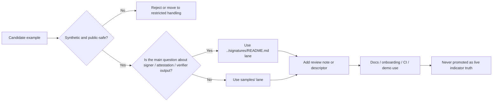

<!-- [KFM_META_BLOCK_V2]
doc_id: kfm://doc/TODO-verify-doc-uuid
title: Shai-Hulud 2.0 Indicator Samples
type: standard
version: v1
status: draft
owners: @bartytime4life
created: 2025-11-30
updated: 2026-03-30
policy_label: TODO(verify policy label)
related: [../README.md, ../signatures/README.md, ../../README.md, ../../../README.md, ../../../../../../.github/CODEOWNERS]
tags: [kfm, security, supply-chain, indicators, samples, shai-hulud-2.0]
notes: [Current public main confirms this path exists and currently exposes README.md only; internal doc_id and policy_label remain review placeholders until verified.]
[/KFM_META_BLOCK_V2] -->

# Shai-Hulud 2.0 Indicator Samples

Public-safe, sample-only guidance for synthetic and redacted indicator examples under `docs/security/supply-chain/shai-hulud-2.0/indicators/samples/`.

> [!IMPORTANT]
> **Status:** active · **Doc maturity:** draft  
> **Owners:** `@bartytime4life`  
>       
> **Quick jump:** [Scope](#scope) · [Repo fit](#repo-fit) · [Inputs](#inputs) · [Exclusions](#exclusions) · [Directory tree](#directory-tree) · [Quickstart](#quickstart) · [Usage](#usage) · [Diagram](#diagram) · [Tables](#tables) · [Task list](#task-list) · [FAQ](#faq) · [Appendix](#appendix)

> [!CAUTION]
> This directory is for **sample-only** material. Nothing here should be mistaken for a live indicator, a real detection, a release proof, or canonical incident evidence.

> [!NOTE]
> Current public `main` confirms this path and its `README.md`, but it does **not** currently expose an expanded sample fixture tree here. Treat sample families, extra child folders, and companion overlay lanes as guidance unless the tree itself grows.

## Scope

`indicators/samples/` is the release-safe example lane for the `shai-hulud-2.0` indicator subtree.

Use this README when the goal is to explain or review indicator shape without implying that the reviewed branch already contains live signing, emitted attestations, merge-blocking policy, or release-bearing proof artifacts. In KFM terms, this directory should help a reviewer tell the difference between a control, a measurement, a proof object, and a safe example.

### Reading rule

| Label | Meaning here |
| --- | --- |
| **CONFIRMED** | Directly visible in the current public repo tree, or explicitly supported by the attached Shai-Hulud source packet. |
| **INFERRED** | Strongly suggested by the visible tree and adjacent README doctrine, but not proven here as executable implementation. |
| **PROPOSED** | A repo-consistent sample pattern or growth shape that is not yet visible at this path on current public `main`. |
| **UNKNOWN** | Not verified strongly enough to present as current reality. |
| **NEEDS VERIFICATION** | A review placeholder that should not be treated as settled fact. |

### What belongs here

This lane is for:

- safe synthetic indicator examples
- redacted fixtures that exercise review, parsing, or catalog expectations
- small sample descriptors that make shape and purpose obvious
- public-safe demo inputs for documentation, onboarding, or review walkthroughs

### What this lane is not

This lane is **not** a quiet overflow area for:

- live indicators
- incident evidence
- release manifests or proof packs
- executable payloads
- uncited security conclusions

[Back to top](#shai-hulud-20-indicator-samples)

## Repo fit

| Item | Value |
| --- | --- |
| Path | `docs/security/supply-chain/shai-hulud-2.0/indicators/samples/README.md` |
| Local role | Leaf README for public-safe sample guidance inside the `indicators/` subtree |
| Parent lane | [`../README.md`](../README.md) — indicator meaning, interpretation boundaries, and child-lane routing |
| Confirmed sibling | [`../signatures/README.md`](../signatures/README.md) — signature- and attestation-oriented reading notes |
| Lane root | [`../../README.md`](../../README.md) — named `shai-hulud-2.0` subtree scope and current public lane split |
| Supply-chain hub | [`../../../README.md`](../../../README.md) — broader supply-chain doctrine and current public verification posture |
| Ownership surface | [`../../../../../../.github/CODEOWNERS`](../../../../../../.github/CODEOWNERS) — current public owner fallback |
| Workflow evidence surface | [`../../../../../../.github/workflows/README.md`](../../../../../../.github/workflows/README.md) — workflow inventory and public-main caveats |
| Policy / contract / schema / test surfaces | [`../../../../../../policy/README.md`](../../../../../../policy/README.md), [`../../../../../../contracts/README.md`](../../../../../../contracts/README.md), [`../../../../../../schemas/README.md`](../../../../../../schemas/README.md), [`../../../../../../tests/README.md`](../../../../../../tests/README.md) |

### Current public snapshot

| Surface | Current public-main state | How to read it |
| --- | --- | --- |
| `indicators/` | `README.md`, `samples/`, and `signatures/` are visible | The lane is present and intentionally narrow |
| `samples/` | `README.md` only | This README is the whole confirmed public lane at this path today |
| `signatures/` | `README.md` only | Signature-specific guidance exists, but no deeper public child tree is confirmed |
| Historical or source-packet companion paths | `metadata/`, `stac/`, `signatures/samples/`, and a local `provenance/` lane are **not** currently visible at these public paths | Treat them as historical/proposed references, not current-tree facts |

### Working interpretation inside KFM

Within the currently visible subtree:

- `protections/` explains intended guardrails
- `workflows/` explains gate sequencing and machine-executed behavior
- `indicators/` explains measurable assurance and interpretation
- `samples/` and `signatures/` carry release-safe examples and reviewer-facing reading notes

This README should stay narrow enough to remain useful in review, but concrete enough that a contributor can tell whether a proposed example belongs here, belongs in `../signatures/README.md`, or does not belong in the repo at all.

[Back to top](#shai-hulud-20-indicator-samples)

## Inputs

Accepted inputs here are review-safe, synthetic, and explicitly non-live.

| Input class | What belongs here | Minimum expectation |
| --- | --- | --- |
| **Sample descriptors** | Tiny sidecars that explain what the sample is, why it exists, and why it is safe | Clear purpose, explicit sample-only state, no ambiguity about live status |
| **Pattern or text fixtures** | Benign strings or redacted snippets used to test parsing, matching, or review behavior | Non-harmful content, narrow purpose, expected outcome explained |
| **Structural examples** | Mock manifests, dependency graphs, workflow drift fragments, or other shape-only examples | Clearly synthetic, linked to a review question |
| **Heuristic or composite examples** | Small bundles that illustrate scoring, grouping, or multi-signal reasoning | Expected pass/fail or interpretation note included |
| **Story / demo inputs** | Public-safe fragments used in docs, onboarding, or Focus/Story demonstrations | Must remain visibly marked as sample-only |
| **Cross-links** | Pointers to the owning contract, policy, schema, test, or sibling README surface | Should clarify ownership, not duplicate it |

### Minimum rule for every sample

A reviewer should be able to answer these questions immediately:

1. What family does this sample represent?
2. Is it fully synthetic or sufficiently redacted?
3. What workflow, schema, or review behavior is it proving?
4. What explanation or sidecar makes the sample legible?
5. Could anyone reasonably mistake it for live truth?

[Back to top](#shai-hulud-20-indicator-samples)

## Exclusions

This lane stays useful only if it remains boringly safe.

| Do **not** put this here | Why not | Put it instead |
| --- | --- | --- |
| Live indicators or active detections | Samples must not silently become operational truth | The governing live indicator or detection surface |
| Incident evidence or investigation material | Different sensitivity, proof, and correction burden | The verified report or restricted review lane |
| Signature / attestation walkthroughs that are really about subject binding or verifier output | Better owned by the sibling signature lane | [`../signatures/README.md`](../signatures/README.md) |
| Real secrets, credentials, partner data, or production identifiers | Unsafe for docs, CI, and long-lived git history | Secure secret-handling or restricted review surfaces |
| Executable payloads, droppers, loaders, or harmful binaries | Violates the public-safe posture outright | Do not commit them |
| Canonical STAC / DCAT / PROV records for real detections or releases | This README is not a shadow publication plane | The owning catalog or provenance surface |
| Unqualified claims that a protection is enforced in runtime | README prose is not enough evidence | The checked-in workflow, policy, contract, test, or release artifact that proves it |

### Hard stop

A file does **not** belong here if it can plausibly be mistaken for:

- a real indicator
- a real detection
- a real incident report
- a real release object
- a real provenance proof for production truth

[Back to top](#shai-hulud-20-indicator-samples)

## Directory tree

### Current confirmed tree

```text
samples/
└── README.md
```

<details>
<summary>Possible future growth shape (PROPOSED, not current public-main inventory)</summary>

```text
samples/
├── README.md
├── file-hash/     # benign hash-shaped fixtures
├── pattern/       # safe pattern and parsing examples
├── structural/    # mock manifests, DAG drift, dependency-shape examples
├── heuristic/     # scoring / threshold examples
├── composite/     # multi-signal bundles
├── metadata/      # sample descriptors or lightweight catalog overlays
├── stac/          # sample STAC Items or Collections
└── prov/          # redacted lineage notes
```

Use a deeper tree only when the repo actually adds those paths and the review burden justifies them.

</details>

[Back to top](#shai-hulud-20-indicator-samples)

## Quickstart

### 1) Pick the right lane before you make the file

Ask one question first:

- if the example is mainly about **signature, attestation, subject identity, digest binding, or verifier output**, start with [`../signatures/README.md`](../signatures/README.md)
- if it is mainly about **safe example shape, review cues, or public-safe onboarding**, start here

### 2) Make it synthetic first, polished second

Before you prettify anything, make sure the artifact is:

- non-executable
- generated or clearly redacted
- non-live
- safe for docs and CI
- impossible to confuse with a production object

### 3) Add a tiny descriptor

A small sidecar is usually enough to make the sample self-explaining.

```json
{
  "sample_id": "shai-hulud-2.0--pattern--example-001",
  "sample_family": "pattern",
  "synthetic": true,
  "live_indicator": false,
  "contains_executable_content": false,
  "safe_for_ci": true,
  "safe_for_docs": true,
  "review_purpose": "Demonstrate benign parsing and sample-only review posture",
  "owner_surface": "../README.md",
  "notes": [
    "illustrative only",
    "not a release-bearing artifact"
  ]
}
```

> [!NOTE]
> The descriptor above is **illustrative only**. It is a starter pattern, not a claimed checked-in schema.

### 4) Keep the PR obvious to review

A strong sample PR says:

- why the example exists
- what family it belongs to
- why it is safe
- which owning surface explains it
- why it does **not** belong in a live or release-bearing lane instead

### 5) Expand the tree only on purpose

Current public `main` confirms `samples/README.md`, not a deeper fixture taxonomy. Do not add folder sprawl just because a conceptual category exists. Add structure only when the repo change actually needs it.

[Back to top](#shai-hulud-20-indicator-samples)

## Usage

### Documentation and onboarding

Use this lane to teach naming, sample posture, and review expectations without exposing live incidents or operational artifacts.

### Review and CI preparation

Use safe examples here to exercise:

- schema-shape review
- PR reading discipline
- catalog or lineage expectations when lightweight sidecars exist
- negative-path reasoning about what is **not** proven by a sample

### Story Node and Focus Mode demos

Sample artifacts may appear in demo or training flows only when the UI keeps their state visibly **sample-only**.

That means:

- no live-threat framing
- no severity implication beyond the sample’s stated purpose
- no mixed presentation that makes a sample look canonical

### Relationship to the sibling signature lane

This directory and [`../signatures/README.md`](../signatures/README.md) should reinforce each other:

- use `samples/` for the safe example itself
- use `signatures/` when the reviewer needs help reading digest, subject, issuer, attestation, or verification context

[Back to top](#shai-hulud-20-indicator-samples)

## Diagram



[Back to top](#shai-hulud-20-indicator-samples)

## Tables

### Sample family orientation

These families come from the attached Shai-Hulud sample material and remain useful as a review vocabulary even though current public `samples/` does not yet expose a child folder for each one.

| Family | Typical review question | Best current fit | Current public path status |
| --- | --- | --- | --- |
| `file-hash` | Is the sample teaching benign identity shape or digest semantics? | `samples/` for benign fixtures; `../signatures/README.md` when digest binding is the point | Conceptual only at this path |
| `pattern` | Is the example about parsing or matching without harmful payloads? | `samples/` | Conceptual only at this path |
| `structural` | Is the example about manifest, DAG, or dependency-shape drift? | `samples/` | Conceptual only at this path |
| `heuristic` | Is the example about pass/fail or threshold interpretation? | `samples/` | Conceptual only at this path |
| `composite` | Is the example about multi-signal grouping? | `samples/` | Conceptual only at this path |
| `signature-oriented` | Is the example about signatures, attestations, issuers, bundles, or verifier output? | [`../signatures/README.md`](../signatures/README.md) | Confirmed sibling README only |

### Recommended sidecar fields

Use these when a sample needs just enough context to be reviewable without inventing a full publication plane.

| Field family | Examples | Why it matters |
| --- | --- | --- |
| Core identity | `id`, `title`, `sample_family`, `review_purpose` | Prevents ambiguous sample blobs |
| Safety | `synthetic`, `live_indicator`, `contains_executable_content` | Makes the sample-only posture explicit |
| Temporal | `created_at`, `observation_window`, `last_updated` | Helps reviewers read the sample in time |
| Ownership | `owner_surface`, `related_surfaces` | Points back to the governing README or contract |
| Lineage note | `derived_from`, `redaction_note`, `explanation` | Preserves KFM’s lineage habits without overbuilding |
| Demo cues | `safe_for_ci`, `safe_for_docs`, `sample:true` | Keeps UI and training reuse honest |

### Safety gates

| Gate | Pass condition | Why it exists |
| --- | --- | --- |
| Non-executable | No runnable or harmful content | Keeps the lane safe |
| Non-live | Explicit sample-only wording | Prevents authority confusion |
| Non-sensitive | No real secrets, PII, or unsafe identifiers | Supports public reuse |
| Reviewable | Purpose and expected outcome are obvious in one read | Reduces PR ambiguity |
| Lane-correct | The example is in `samples/` rather than the sibling signature lane only when that is actually the right fit | Prevents subtree drift |

[Back to top](#shai-hulud-20-indicator-samples)

## Task list

Definition of done for a new example:

- [ ] The example is clearly synthetic or clearly redacted.
- [ ] The example contains zero executable or harmful content.
- [ ] The example cannot be mistaken for a live indicator or release proof.
- [ ] The PR states the review purpose and owning surface.
- [ ] Any descriptor or sidecar keeps the sample-only state obvious.
- [ ] Signature-specific reading material is routed to `../signatures/README.md` when appropriate.

Definition of done for future tree expansion:

- [ ] A real checked-in need exists for more than `README.md` at this path.
- [ ] New folders are added because the repo changed, not because a conceptual taxonomy sounded neat.
- [ ] Ownership, policy, and validation surfaces are linked before new sample categories are treated as settled.
- [ ] Broken or historical path assumptions are removed when the tree evolves.

[Back to top](#shai-hulud-20-indicator-samples)

## FAQ

### Why keep samples separate from live indicators?

Because this lane exists to teach and review safely. Live indicators carry a different burden of provenance, interpretation, and operational consequence.

### Why not keep the older companion links to `metadata/`, `stac/`, or `provenance/` here?

Because current public `main` does not currently expose those paths at this location. This README should link the tree that exists, not the tree we remember.

### When should a contributor use the sibling `signatures/` lane instead?

Whenever the example is mostly about digest binding, signer identity, attestation subject, bundle structure, or verifier output rather than about a generic safe sample.

### Can Focus Mode surface these examples?

Yes for safe demo or training flows, but not as real threat indicators. The sample-only state must remain visible.

### Should this lane ever hold real release artifacts?

No. Link to release-bearing proof elsewhere; do not park canonical outputs here.

[Back to top](#shai-hulud-20-indicator-samples)

## Appendix

<details>
<summary>Illustrative naming guidance</summary>

Prefer names that reveal family and purpose instead of mimicking production identifiers.

Good patterns:

- `pattern--sample-only--benign-match-shape--v01.json`
- `structural--workflow-drift--sample--v01.json`
- `heuristic--threshold-demo--sample--v01.json`

Avoid:

- `prod`
- `latest`
- `final`
- names that look like incident IDs
- names that imply the sample is canonical truth

</details>

<details>
<summary>Suggested review prompts</summary>

Ask these before merging a new example:

1. Is the example obviously synthetic?
2. Is the lane choice right, or is this really signature material?
3. Could a non-expert misread it as live intelligence?
4. Does the sidecar explain what the sample proves?
5. Does the change add review value without inventing runtime enforcement?

</details>

<details>
<summary>Open verification items</summary>

This README still needs direct verification for:

- the internal KFM document UUID
- the authoritative `policy_label`
- whether narrower path ownership will eventually replace the current `/docs/` fallback
- whether future public branches add child folders under `samples/`
- whether any new sample catalog or provenance lanes appear and should be linked here

</details>

[Back to top](#shai-hulud-20-indicator-samples)
