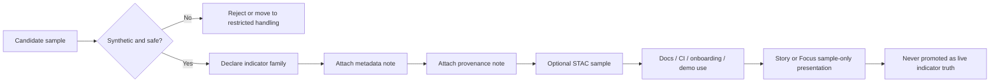

<!-- [KFM_META_BLOCK_V2]
doc_id: kfm://doc/TODO-verify-doc-uuid
title: Shai-Hulud 2.0 Indicator Samples
type: standard
version: v1
status: draft
owners: TODO(verify owners)
created: TODO(verify from repo history)
updated: TODO(verify from repo history)
policy_label: TODO(verify policy label)
related: [../metadata/README.md, ../stac/README.md, ../signatures/samples/README.md, ../../provenance/README.md, ../README.md]
tags: [kfm, security, supply-chain, indicators, samples, shai-hulud-2.0]
notes: [This draft is strengthened from attached Shai-Hulud 2.0 sample-registry and companion registry source material; mounted repo inventory, owners, dates, and exact sibling file presence remain reviewable until verified.]
[/KFM_META_BLOCK_V2] -->

# Shai-Hulud 2.0 Indicator Samples

Controlled, safe, synthetic sample indicators and companion fixtures for documenting, testing, onboarding, and demoing `shai-hulud-2.0` without treating samples as live intelligence.

> [!IMPORTANT]
> **Status:** active *(source baseline; mounted repo confirmation pending)*  
> **Owners:** TODO(verify owners)  
> **Review cadence:** Quarterly · Security Guild · FAIR+CARE Council Oversight *(source baseline)*  
>      
> **Quick jump:** [Scope](#scope) · [Repo fit](#repo-fit) · [Inputs](#inputs) · [Exclusions](#exclusions) · [Directory tree](#directory-tree) · [Quickstart](#quickstart) · [Usage](#usage) · [Diagram](#diagram) · [Tables](#tables) · [Task list](#task-list) · [FAQ](#faq) · [Appendix](#appendix)

> [!CAUTION]
> Treat everything in this directory as **sample-only**. Nothing here should be mistaken for a live indicator, a release-bearing artifact, an incident record, or a canonical source of truth.

## Scope

This directory is the **sample-only** side of the Shai-Hulud 2.0 indicator system.

Its job is to make indicator families inspectable, testable, and discussable in a way that is safe for documentation, CI, onboarding, and review. The point is not to simulate production authority. The point is to preserve structure, lineage habits, and governance cues while removing operational risk.

### Reading rule

| Label | Meaning in this README |
| --- | --- |
| **CONFIRMED** | The attached Shai-Hulud source packet treats this path as an indicator sample registry and its companion docs require standards-aware metadata, provenance linkage, and safe synthetic handling. |
| **INFERRED** | This directory should sit downstream of indicator doctrine and companion registries, and upstream of docs, CI, onboarding, demos, and review workflows. |
| **PROPOSED** | The exact local subdirectory inventory, naming patterns, and example sidecars below are starter patterns until the mounted repo is directly verified. |
| **UNKNOWN** | Mounted repo ownership, git history dates, actual file count, exact sibling inventory, and current validator commands were not directly inspectable in this session. |

### What belongs here

This README is for:

- safe synthetic indicator examples
- redacted or generated fixtures that exercise ingestion and review behavior
- metadata and catalog examples that teach the expected shape of indicator artifacts
- provenance-linked sample bundles used in CI, onboarding, or demonstration flows

### What this directory is not

This is **not** a quiet overflow area for:

- live indicators
- real incident evidence
- release manifests
- proof packs
- runtime detections
- uncited security conclusions

[Back to top](#shai-hulud-20-indicator-samples)

## Repo fit

| Item | Value |
| --- | --- |
| Path | `docs/security/supply-chain/shai-hulud-2.0/indicators/samples/README.md` |
| Local role | Registry README for safe, synthetic indicator examples and fixture-like sample artifacts |
| Confirmed companion | [`../metadata/README.md`](../metadata/README.md) — metadata rules for indicator families *(source-confirmed path; repo verification pending)* |
| Confirmed companion | [`../stac/README.md`](../stac/README.md) — STAC representation of indicators *(source-confirmed path; repo verification pending)* |
| Confirmed nearby safe-sample lane | [`../signatures/samples/README.md`](../signatures/samples/README.md) — safe signature-sample artifacts *(source-confirmed path; repo verification pending)* |
| Confirmed broader provenance lane | [`../../provenance/README.md`](../../provenance/README.md) — lineage / attestation controls *(source-confirmed path; repo verification pending)* |
| Likely parent | [`../README.md`](../README.md) — indicators root *(NEEDS VERIFICATION)* |
| Likely downstream uses | CI fixtures, onboarding packs, documentation examples, Story/Focus demonstrations, and review exercises *(actual mounted inventory UNKNOWN)* |

### Design fit inside KFM

This directory should remain **downstream** of live indicator definition and **upstream** of safe explanation and testing.

A good rule of thumb:

- use canonical registries to define **what an indicator is**
- use this directory to show **how an indicator family looks in safe form**
- use governed release and runtime surfaces to determine **what is true now**

[Back to top](#shai-hulud-20-indicator-samples)

## Inputs

Accepted inputs here are review-safe, synthetic, and explicitly non-live.

| Input class | What belongs here | Minimum expectation |
| --- | --- | --- |
| **File-hash samples** | Benign artifacts or descriptors that mimic hash-based indicator structure | Clearly synthetic origin, no executable behavior, companion metadata/provenance note |
| **Pattern / regex samples** | Safe trigger examples used to test parsing, classification, or rule wiring | Non-harmful content, narrow purpose, expected match behavior |
| **YARA-like samples** | Redacted or generated text fixtures that exercise rule plumbing without carrying harmful payloads | Safe fixture language, explicit non-operational status |
| **Structural samples** | Mock dependency graphs, workflow drift examples, manifest anomalies, or DAG-shape examples | Review note explaining what structural property is being exercised |
| **Heuristic samples** | Small example bundles for thresholding, scoring, or rule combinations | Expected outcome and rationale declared |
| **Composite samples** | Bundles that combine multiple safe indicator signals | Explicit composition note and safe lineage |
| **Metadata overlays** | DCAT / STAC / JSON-LD / PROV-O examples tied to a sample artifact | Link back to the sample or say plainly that the payload is illustrative |
| **Story / Focus demo inputs** | Sample-only evidence trails used to demonstrate narrative behavior safely | Must remain visibly marked as sample-only |

### Minimum rule for every sample

A reviewer should be able to answer these questions immediately:

1. What indicator family does this sample represent?
2. Is it fully synthetic or sufficiently redacted?
3. What workflow, schema, or review behavior is it proving?
4. What companion metadata or provenance explains it?
5. Could anyone mistake it for a live detection?

[Back to top](#shai-hulud-20-indicator-samples)

## Exclusions

This directory stays useful only if it remains boringly safe.

| Do **not** put this here | Why not | Put it instead |
| --- | --- | --- |
| Live indicators or active detection artifacts | Samples must not silently become operational truth | Canonical indicator registries / governed detection surfaces |
| Incident evidence or root-cause investigation material | Those have a different burden of proof, lineage, and sensitivity handling | [`../../reports/README.md`](../../reports/README.md) *(source-confirmed path; repo verification pending)* |
| Real secrets, credentials, tokens, or production identifiers | Unsafe for docs, CI, and long-lived history | Secret-management / restricted handling paths |
| Executable payloads, droppers, loaders, or harmful binaries | Violates the safe-sample posture | Do not commit here |
| Canonical STAC/DCAT/PROV records for real detections | This path should not become a shadow publication plane | Companion registries and governed publication lanes |
| Release manifests, proof packs, or attestation bundles for real releases | Those are release-plane objects, not sample fixtures | Governed release / provenance lanes |
| Unredacted user, vendor, or partner data | Breaks the public-safe, FAIR+CARE posture | Restricted internal review surfaces |

### Hard stop

A file does **not** belong here if it can plausibly be mistaken for:

- a real indicator
- a real detection
- a real incident report
- a real release object
- a real provenance proof for production truth

[Back to top](#shai-hulud-20-indicator-samples)

## Directory tree

The tree below is a **PROPOSED working shape** until the mounted repo is directly checked.

```text
samples/
├── README.md              # purpose, guardrails, review rules
├── file-hash/             # PROPOSED: benign hash-shaped fixtures
├── pattern/               # PROPOSED: regex / text-pattern samples
├── yara/                  # PROPOSED: safe rule-shape examples
├── structural/            # PROPOSED: dependency / workflow / manifest anomalies
├── heuristic/             # PROPOSED: scoring / threshold examples
├── composite/             # PROPOSED: multi-signal sample bundles
├── metadata/              # PROPOSED: DCAT / JSON-LD / descriptor overlays
├── stac/                  # PROPOSED: sample STAC Items / Collections
├── prov/                  # PROPOSED: redacted lineage bundles
└── misc/                  # PROPOSED: CI helpers, tiny fixtures, review notes
```

A leaner mounted structure may also be valid. For example:

- this directory may hold only `README.md` plus a few pointers to `../signatures/samples/`
- some family-specific fixtures may already live deeper under `signatures/`
- sample metadata and STAC payloads may be centralized in companion registries instead of duplicated here

[Back to top](#shai-hulud-20-indicator-samples)

## Quickstart

### 1) Pick the sample family before you create the file

Do not start with the filename. Start with the review purpose.

Common starting questions:

- Is this teaching **identity** (`file-hash`)?
- Is this teaching **matching behavior** (`pattern` / `yara`)?
- Is this teaching **shape** (`structural`)?
- Is this teaching **decision behavior** (`heuristic` / `composite`)?

### 2) Make it synthetic first, pretty second

Before you polish a sample, make sure it is:

- non-executable
- redacted or generated
- non-live
- safe for CI and docs
- impossible to confuse with a real production artifact

### 3) Add a tiny descriptor

Use a small sidecar or front matter block so the sample explains itself.

```json
{
  "sample_id": "shai-hulud-2.0--pattern--example-001",
  "indicator_type": "pattern",
  "sample_family": "indicator",
  "synthetic": true,
  "live_indicator": false,
  "contains_executable_code": false,
  "safe_for_ci": true,
  "safe_for_docs": true,
  "metadata_ref": "./metadata/pattern-example-001.json",
  "provenance_ref": "./prov/pattern-example-001.jsonld",
  "stac_ref": "./stac/pattern-example-001.json",
  "notes": [
    "illustrative only",
    "not a release-bearing artifact"
  ]
}
```

> [!NOTE]
> The descriptor above is **illustrative only**. It is a starter pattern, not a claimed mounted schema.

### 4) Keep companion overlays close

A strong sample is usually easier to review when it carries or references:

- a small metadata overlay
- a small provenance note
- an optional STAC Item or collection stub
- a short explanation of the expected review outcome

### 5) Make the PR obvious to review

A good sample PR should tell reviewers:

- why the sample exists
- what family it belongs to
- why it is safe
- how it helps docs, CI, onboarding, or demos
- why it does **not** belong in a live registry instead

[Back to top](#shai-hulud-20-indicator-samples)

## Usage

### Documentation and onboarding

Use this directory to teach shape, naming, review posture, and companion metadata without exposing real incidents or operational artifacts.

### CI and validation

Use samples here to exercise:

- schema validation
- catalog ingestion
- provenance-link expectations
- Story / Focus demo behavior
- fail-closed handling of sample-only material

### Story Node and Focus Mode demos

When samples are surfaced in narrative or demo contexts, they should remain visibly marked as **sample-only**.

That means:

- no “live threat” presentation
- no operational severity implication beyond the sample’s stated purpose
- no ambiguous UI state
- no mixed rendering with real detections unless the surface makes the difference obvious

### Relationship to companion registries

This directory should complement—not replace—the adjacent registries that govern:

- metadata rules
- STAC publication shape
- provenance / attestation controls

Samples can help reviewers understand those registries. Samples should not become a parallel authority system.

[Back to top](#shai-hulud-20-indicator-samples)

## Diagram



[Back to top](#shai-hulud-20-indicator-samples)

## Tables

### Sample family matrix

| Family | What it usually proves | Typical companions | Safety note |
| --- | --- | --- | --- |
| `file-hash` | Deterministic identity shape | metadata + provenance + optional STAC | Never ship real malicious or live production hashes unless that is the governed canonical lane |
| `pattern` | Match behavior and parsing | descriptor + test note | Keep strings benign and narrow |
| `yara` | Rule-shape and field expectations | descriptor + optional redacted provenance | Safe structure only; no harmful payloads |
| `structural` | Dependency or workflow anomaly shape | graph note / manifest note / provenance | Prefer mock manifests, mock DAGs, mock package trees |
| `heuristic` | Scoring or threshold logic | rationale + expected result | Make expected pass/fail behavior explicit |
| `composite` | Multi-signal relationships | metadata + provenance + optional STAC | Say which sub-signals are combined and why |

### Minimum companion fields

These fields are the strongest source-grounded minimums to keep in mind when building sample overlays. Exact local serialization can vary after repo verification.

| Field family | Examples to preserve | Why it matters |
| --- | --- | --- |
| Core identity | `id`, `title`, `description`, `indicator_type`, `ecosystem` | Prevents ambiguous sample blobs |
| Temporal | `first_seen`, `last_seen`, `last_updated`, `observation_window` | Keeps even synthetic examples time-aware |
| Governance | `status`, `review_cycle`, `immutability_status`, `governance_ref` | Makes review posture visible |
| STAC | `stac_version`, `type`, `properties.datetime`, provenance/metadata assets | Keeps sample publication shape inspectable |
| DCAT | title/description/license/keywords-style fields | Supports catalog realism without implying live truth |
| PROV-O | used/generated/attributed/derived links | Preserves lineage habits even for toy examples |

### Sample safety gates

| Gate | Pass condition | Why it exists |
| --- | --- | --- |
| Non-executable | No runnable payloads or harmful code | Keeps the sample lane safe |
| Non-live | Explicitly marked as sample-only | Prevents authority confusion |
| Non-sensitive | No real secrets, PII, or unsafe identifiers | Supports public-safe reuse |
| Provenance-aware | Lineage note or reference is present | Maintains KFM evidence habits |
| Companion-ready | Metadata / STAC / PROV references are present when relevant | Makes the sample useful beyond eyeballing |
| Reviewable | Purpose and expected behavior are obvious in one read | Reduces PR ambiguity |

[Back to top](#shai-hulud-20-indicator-samples)

## Task list

Definition of done for a new sample:

- [ ] The indicator family is declared clearly.
- [ ] The artifact is synthetic, redacted, or generated specifically for safe use.
- [ ] The sample contains zero executable code.
- [ ] The sample cannot be mistaken for a live indicator.
- [ ] The PR explains what the sample proves.
- [ ] Companion metadata and/or provenance references are added when relevant.
- [ ] Any Story / Focus demo use keeps the sample visibly sample-only.
- [ ] The file adds review value that a schema alone would not provide.

Definition of done for this README after mounted repo verification:

- [ ] Owners verified from repo governance surfaces
- [ ] Meta block dates and policy label updated
- [ ] Actual directory inventory confirmed
- [ ] Companion links checked in-tree
- [ ] Repo-local validator commands added only after direct verification
- [ ] Any overlap with `signatures/samples/` clarified to avoid duplication

[Back to top](#shai-hulud-20-indicator-samples)

## FAQ

### Why keep indicator samples separate from live indicators?

Because the sample lane exists to teach and test safely. Live indicators carry a different burden of authority, provenance, and operational consequence.

### Can a sample begin from a real artifact?

Only after it is minimized, redacted, and clearly relabeled as synthetic or illustrative. A direct copy of a live artifact does not belong here.

### Do all samples need STAC, DCAT, and PROV companions?

Not always as separate files, but samples are more useful when they preserve the habit of catalog and lineage linkage. Tiny overlays are often enough.

### Can Focus Mode surface these samples?

Yes for safe demo or training flows, but not as real threat indicators. The sample-only state must remain visible.

### Should this directory contain incident investigation material?

No. Investigation material belongs in report or provenance lanes with stronger review and sensitivity handling.

[Back to top](#shai-hulud-20-indicator-samples)

## Appendix

<details>
<summary>Illustrative naming guidance</summary>

Prefer names that reveal family and purpose instead of mimicking production identifiers.

Good patterns:

- `file-hash--benign-fixture--sample--v01.json`
- `pattern--match-shape--sample--v01.txt`
- `structural--workflow-drift--sample--v01.json`
- `composite--multi-signal-demo--sample--v01.json`

Avoid:

- `prod`
- `latest`
- `final`
- names that look like incident IDs
- names that imply the sample is a real detection

</details>

<details>
<summary>Suggested review prompts</summary>

Ask these before merging a new sample:

1. Is the family obvious?
2. Is the sample clearly synthetic?
3. Could a non-expert misread it as live intelligence?
4. Does it teach something a schema alone would not?
5. Are metadata and provenance habits visible enough for reuse?
6. Should this live here, or under a more specific family path such as `signatures/samples/`?

</details>

<details>
<summary>Open verification items</summary>

This README still needs direct repo verification for:

- actual owners
- actual git dates
- actual policy label
- whether `samples/` currently exists exactly at this path
- whether the live tree uses all sample-family folders listed above
- whether some sample families are intentionally centralized under `signatures/samples/`
- whether local lint, schema, or Conftest commands already exist for this path

</details>

[Back to top](#shai-hulud-20-indicator-samples)
