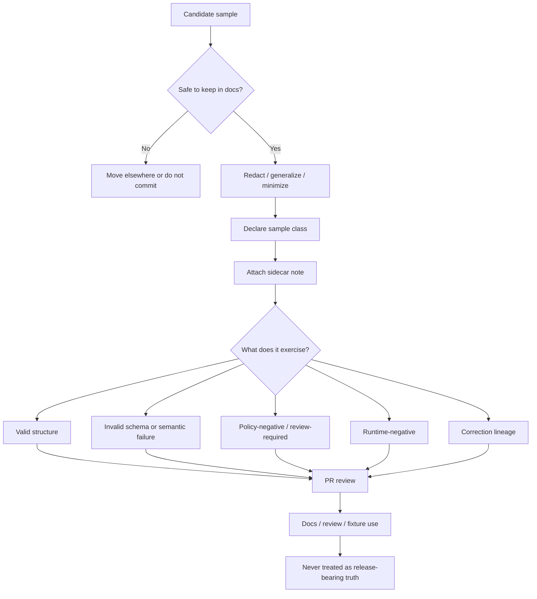

<!-- [KFM_META_BLOCK_V2]
doc_id: kfm://doc/TODO-verify-doc-uuid
title: Shai-Hulud 2.0 Indicator Samples
type: standard
version: v1
status: draft
owners: TODO(verify owners)
created: TODO(verify)
updated: TODO(verify)
policy_label: TODO(verify policy label)
related: [../README.md, ../../README.md, ../../../README.md]
tags: [kfm, security, supply-chain, indicators, samples]
notes: [Repo tree was not directly mounted in this session; sibling links, owners, policy label, and local file inventory are reviewable placeholders until verified.]
[/KFM_META_BLOCK_V2] -->

# Shai-Hulud 2.0 Indicator Samples

Sanitized, reviewable sample indicators and fixture-like examples for documenting, testing, and discussing `shai-hulud-2.0` without treating samples as release-bearing truth.

> [!IMPORTANT]
> **Status:** experimental  
> **Owners:** TODO(verify owners)  
>      
> **Quick jump:** [Scope](#scope) · [Repo fit](#repo-fit) · [Inputs](#inputs) · [Quickstart](#quickstart) · [Diagram](#diagram) · [Tables](#tables) · [Task list](#task-list) · [FAQ](#faq) · [Appendix](#appendix)

## Scope

This directory is for **sample material** only: redacted examples, negative-path examples, review aids, and lightweight notes that help maintainers inspect how `shai-hulud-2.0` indicators should look, fail, and be discussed.

It is **not** the place where authoritative releases, live proofs, or uncited runtime outputs should quietly accumulate.

### Reading rule

| Label | Meaning in this README |
| --- | --- |
| **CONFIRMED** | KFM doctrine requires typed artifacts, evidence linkage, release-aware behavior, visible negative outcomes, and correction lineage. |
| **INFERRED** | This path is best treated as a docs/review/sample pack for indicator examples and fixture-like illustrations. |
| **PROPOSED** | The local working structure, sample classes, and naming guidance below are starter patterns until repo-local conventions are verified. |
| **UNKNOWN** | The mounted repo tree, existing sibling files, owners, dates, and current sample inventory were not directly inspectable in this session. |

### What this README does

It defines:

- what belongs in `samples/`
- what must stay somewhere else
- how to label samples so they cannot be mistaken for promoted truth
- how to keep positive and negative examples equally reviewable

### What this README does not do

It does **not** define the full `shai-hulud-2.0` indicator model, schema registry, CI commands, or release mechanics. Those belong to verified contract, policy, test, and runtime surfaces once the repo-local paths are confirmed.

[Back to top](#shai-hulud-20-indicator-samples)

## Repo fit

| Item | Value |
| --- | --- |
| Path | `docs/security/supply-chain/shai-hulud-2.0/indicators/samples/README.md` |
| Local role | Human-readable guidance for sample artifacts under the `shai-hulud-2.0` indicators area |
| Likely upstream | [`../README.md`](../README.md) — indicators-level README (**NEEDS VERIFICATION**) |
| Likely parent | [`../../README.md`](../../README.md) — `shai-hulud-2.0` root README (**NEEDS VERIFICATION**) |
| Broader area | [`../../../README.md`](../../../README.md) — supply-chain security docs root (**NEEDS VERIFICATION**) |
| Likely downstream | Redacted sample payloads, invalid examples, runtime-envelope examples, correction examples, and review notes in this directory (**UNKNOWN current inventory**) |

### Fit with KFM doctrine

This directory should stay **downstream** of the real contract, policy, release, and runtime layers. Samples may explain those layers; they must not replace them.

A practical rule of thumb:

- use this directory to show **shape**
- use verified contract/policy/test locations to enforce **behavior**
- use release-bearing surfaces to assert **truth**

[Back to top](#shai-hulud-20-indicator-samples)

## Inputs

Accepted inputs here should be safe to read in a documentation, review, or example context.

| Input class | What belongs here | Must include |
| --- | --- | --- |
| **Redacted positive samples** | Sanitized example indicators that show a structurally valid shape | Sample class, redaction note, intended contract/route coverage |
| **Invalid samples** | Deliberately broken examples for schema, semantic, or review-path discussion | Expected failure reason, what gate should stop it |
| **Policy-negative samples** | Examples meant to hold, deny, generalize, or require review | Expected decision/result, reason code or review trigger |
| **Runtime-negative samples** | Examples that exercise `ABSTAIN`, `DENY`, `ERROR`, `STALE-VISIBLE`, or similar visible outcomes | Expected envelope result, audit-facing note, citation behavior note |
| **Correction examples** | Samples that show supersession, withdrawal, replacement, or correction-pending behavior | Prior state, corrected state, lineage note |
| **Review notes** | Small markdown notes that explain what a sample is proving | Clear “illustrative only” language |

### Minimum rule for every sample

Every sample should answer these questions in one hop:

1. What class of sample is this?
2. What does it exercise?
3. What would make it invalid or unsafe?
4. Why is it safe to keep in docs?

[Back to top](#shai-hulud-20-indicator-samples)

## Exclusions

This directory should stay tight. The fastest way to make it confusing is to let it drift from “sample pack” into “shadow release area.”

| Do **not** put this here | Why not | Put it instead |
| --- | --- | --- |
| Live or publishable release artifacts | They can be mistaken for authoritative truth | Verified release / proof-pack locations (**NEEDS VERIFICATION**) |
| Secrets, tokens, credentials, internal endpoints | Unsafe in docs and sample history | Secret management / environment configuration surfaces |
| Unredacted supplier, steward, or reviewer details | Samples must remain public-safe or clearly role-bounded | Role-appropriate internal locations |
| Canonical schemas and policy registries | This README may reference them, but should not become a second source of truth | `contracts/`, `policy/`, and related verified locations (**NEEDS VERIFICATION**) |
| Generated transient output | Noise, drift, and low review value | Test output / local scratch / CI artifacts |
| Detached screenshots with no explanation | Easy to misread, hard to review | Pair screenshots with a small note and a declared sample class |

### Hard stop

A file does **not** belong here if a reviewer could reasonably mistake it for:

- a real release artifact
- a live policy decision
- an uncited runtime result
- a canonical schema
- a trusted source record

[Back to top](#shai-hulud-20-indicator-samples)

## Directory tree

The tree below is a **PROPOSED working shape**, not a claim that these paths already exist.

```text
samples/
├── README.md               # purpose, rules, coverage map
├── redacted/               # PROPOSED: safe positive examples
├── invalid/                # PROPOSED: schema / semantic failures
├── policy/                 # PROPOSED: deny / hold / generalize examples
├── runtime/                # PROPOSED: response-envelope and negative-path examples
├── correction/             # PROPOSED: superseded / withdrawn / replaced examples
└── notes/                  # PROPOSED: redaction and reviewer notes
```

Two review-safe alternatives are also reasonable once the mounted tree is verified:

- keep only `README.md` here and point to shared fixture directories elsewhere
- keep only small rendered snapshots here and store executable fixtures under `fixtures/` or `tests/`

[Back to top](#shai-hulud-20-indicator-samples)

## Quickstart

### 1) Choose the sample class first

Before adding any file, decide whether it is:

- `valid`
- `invalid`
- `policy-negative`
- `runtime-negative`
- `correction`

Do not start from filename convenience. Start from review purpose.

### 2) Redact before you polish

Remove or generalize anything that could expose:

- real secrets
- exact protected details
- internal-only routing or environment assumptions
- live operational identifiers that are not needed for the lesson

### 3) Attach a tiny sidecar note

Use a small note or front matter so the sample cannot be misread.

```yaml
# illustrative sidecar template — pseudocode, not a claimed repo format
sample_id: shai-hulud-2_0_example_001
sample_class: valid
illustrative_only: true

covers:
  contract_family: RuntimeResponseEnvelope
  route_family: Focus / governed assistance
  expected_outcome: ABSTAIN
  reason_codes: [validation.schema_failed]

safety:
  secrets_present: false
  real_identity_retained: false
  precision_reduced: true

notes:
  - Not release-bearing
  - Not canonical truth
  - Meant for docs/review/testing discussion only
```

### 4) Record what the sample exercises

A good sample usually covers at least one of these:

- a contract family
- a route family
- a reason code
- a runtime outcome
- a correction behavior
- a redaction rule

### 5) Keep the sample reviewable in a PR

A reviewer should be able to tell, quickly:

- whether the sample is safe
- whether it is structurally useful
- whether it duplicates an existing example
- whether it belongs in docs, fixtures, or tests instead

[Back to top](#shai-hulud-20-indicator-samples)

## Usage

### Use samples to explain shape, not to imply truth

KFM’s trust posture is strongest when examples make structure inspectable without pretending to be a release. Samples here should therefore explain:

- what an indicator-like artifact looks like
- what fields or state matter
- how a negative path stays visible
- how correction lineage should be shown

### Prefer decomposable examples

Where an example reflects a derived or synthetic indicator, keep the example decomposable enough that a reviewer can still see:

- support or grain
- time basis
- source or provenance hint
- why the example should pass, fail, abstain, or be withheld

### Make negative paths first-class

This directory is more valuable when it includes failures, holds, and denials rather than only “happy path” examples.

Good sample packs show:

- one structurally valid example
- one invalid example
- one review-required example
- one runtime-negative example
- one correction or supersession example

### Keep provenance visible even in toy examples

Even a tiny example should preserve the habit of answering:

- where did this come from?
- what is it derived from?
- what scope is it for?
- what should happen if its basis is missing or stale?

[Back to top](#shai-hulud-20-indicator-samples)

## Diagram



[Back to top](#shai-hulud-20-indicator-samples)

## Tables

### Coverage matrix

| Sample class | Usually exercises | Good when it shows | Stop and rethink when it becomes |
| --- | --- | --- | --- |
| `valid` | Structural shape and field meaning | A minimal, readable, sanitized example | A hidden copy of a real artifact |
| `invalid` | Schema or semantic gate behavior | Exactly why validation should fail | A vague “bad example” with no expected outcome |
| `policy-negative` | Review, hold, deny, generalize, or restrict flows | Why a public-safe surface must not proceed | An implicit policy claim with no rationale |
| `runtime-negative` | `ABSTAIN`, `DENY`, `ERROR`, `STALE-VISIBLE`, similar outcomes | Visible finite behavior instead of bluffing | Fluent prose with no declared result |
| `correction` | Supersession, withdrawal, replacement, correction-pending | Lineage under change | Silent overwrite |

### Sample-to-KFM object map

| Sample focus | Most relevant KFM object families to reference | Why it helps |
| --- | --- | --- |
| Intake-like example | `SourceDescriptor`, `IngestReceipt`, `ValidationReport` | Shows where meaning and admissibility start |
| Release-like example | `DatasetVersion`, `CatalogClosure`, `DecisionEnvelope`, `ReviewRecord`, `ReleaseManifest` | Shows that publication is gated, not implied |
| Evidence example | `EvidenceBundle` | Keeps drill-through and reconstruction visible |
| Runtime example | `RuntimeResponseEnvelope` | Makes finite outcomes explicit |
| Change example | `CorrectionNotice` | Preserves lineage under error or replacement |

### Minimum sidecar fields

| Field | Why it matters | Status |
| --- | --- | --- |
| `sample_id` | Stable reviewer handle | PROPOSED |
| `sample_class` | Prevents ambiguity | PROPOSED |
| `illustrative_only` | Makes non-authoritative status explicit | PROPOSED |
| `covers.contract_family` | Connects sample to doctrine | PROPOSED |
| `covers.route_family` | Connects sample to surface/API behavior | PROPOSED |
| `covers.expected_outcome` | Makes negative paths reviewable | PROPOSED |
| `covers.reason_codes` | Prevents hand-wavy denial/hold examples | PROPOSED |
| `safety.*` | Makes redaction and public-safe posture explicit | PROPOSED |

[Back to top](#shai-hulud-20-indicator-samples)

## Task list

Definition of done for a new sample:

- [ ] The sample class is declared up front.
- [ ] The file is clearly marked as illustrative and non-release-bearing.
- [ ] Secrets, internal-only values, and unsafe detail are removed or generalized.
- [ ] The example names the contract family, route family, or runtime behavior it exercises.
- [ ] Negative-path expectations are explicit when the sample is meant to fail, hold, deny, abstain, or show stale state.
- [ ] The sample does not duplicate a stronger nearby example without reason.
- [ ] The sample is easier to review than the real artifact it is abstracting from.
- [ ] A reviewer can tell where this sample should live if it outgrows `samples/`.

Definition of done for this README after repo verification:

- [ ] Owners verified from live repo governance surfaces
- [ ] Meta block IDs and dates updated
- [ ] Sibling links confirmed
- [ ] Illustrative tree replaced with actual local inventory, or reduced to a pointer-only README
- [ ] Any repo-local validation/test commands added only after direct verification

[Back to top](#shai-hulud-20-indicator-samples)

## FAQ

### Why keep samples here instead of only schemas?

Schemas explain allowed structure. Samples explain how maintainers should read, review, redact, and discuss real-looking artifacts without confusing them for releases.

### Can a sample begin from a real indicator?

Yes, but only after it is minimized, redacted, and explicitly relabeled as illustrative. A real artifact copied without that work is the wrong input for this directory.

### Does a “valid” sample mean the indicator is publishable?

No. “Valid” here should mean structurally or review-wise useful, not automatically publishable. Publication still depends on the real gates outside this directory.

### Are screenshots enough?

Only when paired with a short note explaining what the screenshot is proving. Detached screenshots age badly and are easy to misread.

### Should negative examples really live next to positive ones?

Usually yes. This directory is more useful when it teaches maintainers how the system fails safely, not just how it succeeds.

[Back to top](#shai-hulud-20-indicator-samples)

## Appendix

<details>
<summary>Suggested review prompts</summary>

When reviewing a new sample, ask:

1. Could this be mistaken for a live artifact?
2. Is the redaction obvious enough for future readers?
3. Does the sample teach one clear thing?
4. Is the expected result visible without extra context?
5. Should this move to `contracts/`, `policy/`, `fixtures/`, `tests/`, or a runbook once the live repo shape is verified?

</details>

<details>
<summary>Naming guidance (PROPOSED, until repo convention is verified)</summary>

Prefer names that encode class and intent over names that imitate production identifiers.

Good pattern:

- `<topic>--<sample-class>--v01.<ext>`

Examples:

- `indicator-shape--valid--v01.json`
- `indicator-shape--invalid-schema--v01.json`
- `runtime-envelope--abstain--v01.json`
- `correction-lineage--superseded--v01.md`

Avoid:

- names that look like real release IDs
- ambiguous `sample1`, `final`, `latest`, `prod`
- filenames that hide whether the file is positive or negative

</details>

<details>
<summary>Open verification items</summary>

This README still needs a live repo check for:

- actual sibling README files
- actual owners
- policy label
- whether local sample subdirectories already exist
- whether executable fixtures live elsewhere and should be linked instead
- whether `shai-hulud-2.0` has a stricter naming or redaction convention

</details>

[Back to top](#shai-hulud-20-indicator-samples)
