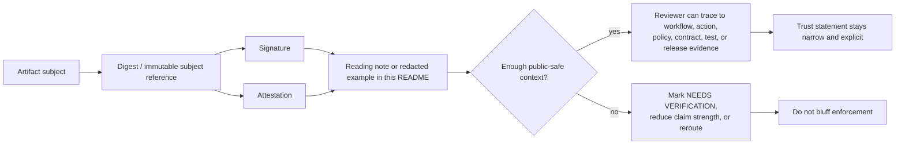

<!-- [KFM_META_BLOCK_V2]
doc_id: kfm://doc/NEEDS_VERIFICATION
title: Shai-Hulud 2.0 Signature Indicators
type: standard
version: v1
status: draft
owners: @bartytime4life
created: YYYY-MM-DD
updated: YYYY-MM-DD
policy_label: public
related: [docs/security/supply-chain/README.md, docs/security/supply-chain/shai-hulud-2.0/README.md, docs/security/supply-chain/shai-hulud-2.0/protections/README.md, docs/security/supply-chain/shai-hulud-2.0/workflows/README.md, docs/security/supply-chain/shai-hulud-2.0/indicators/README.md, docs/security/supply-chain/shai-hulud-2.0/indicators/samples/README.md, docs/security/supply-chain/sigstore-cosign-v3/README.md, .github/actions/README.md, .github/workflows/README.md, policy/README.md, contracts/README.md, schemas/README.md, tests/README.md]
tags: [kfm, security, supply-chain, signatures, attestations, provenance, indicators]
notes: [doc_id and created/updated dates NEEDS VERIFICATION from current public repo evidence; owner reflects current CODEOWNERS fallback; this file is a public-safe documentation surface and must not be treated as proof of live signing enforcement]
[/KFM_META_BLOCK_V2] -->

# Shai-Hulud 2.0 Signature Indicators

Public-safe reading notes, redacted examples, and interpretation rules for signature- and attestation-oriented assurance signals in this experimental supply-chain lane.

> [!IMPORTANT]
> **Status:** experimental · **Doc maturity:** draft  
> **Owners:** `@bartytime4life` *(current public `.github/CODEOWNERS` fallback; no narrower signature-lane owner is directly verified on public `main`)*  
> **Path:** `docs/security/supply-chain/shai-hulud-2.0/indicators/signatures/README.md`  
> **Repo fit:** leaf beneath [`../README.md`](../README.md) · lane siblings [`../../workflows/README.md`](../../workflows/README.md), [`../../protections/README.md`](../../protections/README.md), [`../samples/README.md`](../samples/README.md) · coupled surfaces [`../../../sigstore-cosign-v3/README.md`](../../../sigstore-cosign-v3/README.md), [`../../../../../../.github/actions/README.md`](../../../../../../.github/actions/README.md), [`../../../../../../.github/workflows/README.md`](../../../../../../.github/workflows/README.md), [`../../../../../../policy/README.md`](../../../../../../policy/README.md), [`../../../../../../contracts/README.md`](../../../../../../contracts/README.md), [`../../../../../../schemas/README.md`](../../../../../../schemas/README.md), [`../../../../../../tests/README.md`](../../../../../../tests/README.md)  
>        
> **Quick jumps:** [Scope](#scope) · [Repo fit](#repo-fit) · [Inputs](#inputs) · [Exclusions](#exclusions) · [Current verified snapshot](#current-verified-snapshot) · [Directory tree](#directory-tree) · [Quickstart](#quickstart) · [Usage](#usage) · [Diagram](#diagram) · [Tables](#tables) · [Task list](#task-list--definition-of-done) · [FAQ](#faq) · [Appendix](#appendix)  
> **Accepted here:** signature reading notes, redacted attestation interpretation notes, public-safe digest-binding examples, and reviewer routing language  
> **Not here:** live secrets, executable policy, canonical schemas/contracts, or claims of enforced signing without branch-local proof

> [!WARNING]
> This README explains **how to read, review, and sample** signature-oriented evidence.  
> It does **not** by itself prove that the reviewed branch already has live signing, published attestations, merge-blocking verification gates, or emitted release-proof artifacts.

## Scope

This directory is the leaf README for signature-oriented indicators inside the named `shai-hulud-2.0` supply-chain lane.

Use this file when the work is about:

- understanding what a signature or attestation example is meant to show
- documenting how a reviewer should interpret a public-safe verification sample
- recording narrow reading notes about digest binding, subject identity, verifier output, or release linkage
- keeping signature-oriented examples coupled to policy, contracts, tests, workflows, and release evidence without pretending this README is the enforcement surface

### Truth posture used here

| Label | Meaning in this file |
| --- | --- |
| `CONFIRMED` | Visible in the reviewed repo structure or explicitly established by adjacent KFM docs |
| `INFERRED` | Strongly suggested by repo structure and doctrine, but not proven here as executable implementation |
| `PROPOSED` | Recommended documentation shape, review aid, or growth path |
| `NEEDS VERIFICATION` | Important but not proven from current public branch evidence |

[Back to top](#shai-hulud-20-signature-indicators)

## Repo fit

**Path:** `docs/security/supply-chain/shai-hulud-2.0/indicators/signatures/README.md`

**Role:** leaf documentation surface for signature- and attestation-oriented indicator material under `shai-hulud-2.0`.

### Upstream links

| Surface | Link | Why it matters |
| --- | --- | --- |
| Indicators lane | [`../README.md`](../README.md) | Parent indicator surface for the `shai-hulud-2.0` subtree |
| Shai-Hulud 2.0 root | [`../../README.md`](../../README.md) | Named lane scope, path routing, and local boundaries |
| Supply-chain root | [`../../../README.md`](../../../README.md) | Broader supply-chain doctrine, current-branch caution, and subtree map |
| Security root | [`../../../../README.md`](../../../../README.md) | Security and supply-chain governance frame |
| Docs root | [`../../../../../README.md`](../../../../../README.md) | `docs/` role, exclusions, and repo-wide documentation posture |

### Sideways / coupled links

| Surface | Link | Why it matters |
| --- | --- | --- |
| Lane-local workflow route | [`../../workflows/README.md`](../../workflows/README.md) | Keeps lane-level workflow claims bounded before anything is upgraded to execution reality |
| Lane-local protections route | [`../../protections/README.md`](../../protections/README.md) | Helps keep indicator prose separate from proof that protections are live |
| Samples lane | [`../samples/README.md`](../samples/README.md) | Adjacent sample-only surface when the material is explanatory rather than signature-specific |
| Sigstore / Cosign lane | [`../../../sigstore-cosign-v3/README.md`](../../../sigstore-cosign-v3/README.md) | Tool-specific signing and attestation doctrine belongs there |
| Repo-local action inventory | [`../../../../../../.github/actions/README.md`](../../../../../../.github/actions/README.md) | Current public action names are useful review clues, but not proof of live implementation |
| Workflow inventory | [`../../../../../../.github/workflows/README.md`](../../../../../../.github/workflows/README.md) | Branch-grounded workflow evidence and caution against assuming active YAML |
| Policy surface | [`../../../../../../policy/README.md`](../../../../../../policy/README.md) | Executable policy belongs there, not here |
| Contract surface | [`../../../../../../contracts/README.md`](../../../../../../contracts/README.md) | Contract families and machine-readable backbone |
| Schema surface | [`../../../../../../schemas/README.md`](../../../../../../schemas/README.md) | Schema inventory and structure |
| Tests surface | [`../../../../../../tests/README.md`](../../../../../../tests/README.md) | Runnable verification belongs there |
| Ownership map | [`../../../../../../.github/CODEOWNERS`](../../../../../../.github/CODEOWNERS) | Review ownership and repo routing |

### Downstream links

No downstream children are **currently confirmed** inside this leaf directory. Treat this README as the maintained entrypoint until a narrower, justified child surface exists.

[Back to top](#shai-hulud-20-signature-indicators)

## Inputs

This directory accepts material such as:

| Accepted input | What belongs here |
| --- | --- |
| Signature reading notes | Human-readable explanations of what a signature sample proves and what it does **not** prove |
| Attestation reading notes | Public-safe notes about provenance, SBOM, predicate type, issuer identity, or subject binding |
| Redacted verification walkthroughs | Narrow examples showing how a reviewer should inspect a digest-bound artifact safely |
| Indicator wording | Reviewer-facing language for “present,” “missing,” “bound,” “verifiable,” “orphaned,” or “needs escalation” |
| Cross-links | References to the contract, policy, workflow, test, runbook, and release surfaces that actually enforce behavior |
| Release-safe examples | Synthetic or redacted samples that show the expected shape of trustworthy evidence without exposing secrets |

## Exclusions

This directory does **not** accept the following:

| Exclusion | Put it somewhere else |
| --- | --- |
| Private keys, signing credentials, tokens, or live secret material | Never in repo docs |
| Full tool doctrine for Sigstore / Cosign / Fulcio / Rekor / ORAS | [`../../../sigstore-cosign-v3/README.md`](../../../sigstore-cosign-v3/README.md) |
| Executable policy bundles, rule engines, or machine-enforced reason grammars | [`../../../../../../policy/README.md`](../../../../../../policy/README.md) |
| Canonical contract/schema definitions | [`../../../../../../contracts/README.md`](../../../../../../contracts/README.md), [`../../../../../../schemas/README.md`](../../../../../../schemas/README.md) |
| Runnable tests or CI validation harnesses | [`../../../../../../tests/README.md`](../../../../../../tests/README.md), [`../../../../../../.github/workflows/README.md`](../../../../../../.github/workflows/README.md) |
| Lane-local workflow claims stated as already live | [`../../workflows/README.md`](../../workflows/README.md) plus branch-local workflow evidence |
| Protection claims stated as already enforced | [`../../protections/README.md`](../../protections/README.md) plus executable proof surfaces |
| Generated release artifacts presented as sovereign proof | Link to release-bearing evidence instead of parking canonical outputs here |
| Unproven claims that “signing is active,” “attestations are emitted,” or “verification gates are enforced” | Keep such statements `NEEDS VERIFICATION` until executable branch evidence exists |

> [!NOTE]
> A copied signature blob with no subject, no digest, no verification context, and no release linkage is not a useful indicator. It is noise with security-themed typography.

[Back to top](#shai-hulud-20-signature-indicators)

## Current verified snapshot

> [!NOTE]
> Current public `main` gives enough evidence to describe this leaf directory and its nearby control surfaces conservatively. It does **not** justify upgrading this README into proof of live signing, attestation emission, or merge-blocking verification.

| Surface | Current public-main signal | Posture | Why it matters here |
| --- | --- | --- | --- |
| Local leaf directory | GitHub directory listing shows `README.md` only | `CONFIRMED` | This leaf is documentation-only on public `main`; no checked-in child examples or walkthrough files are visible here |
| Lane-local workflow doc | [`../../workflows/README.md`](../../workflows/README.md) exists and documents a README-only workflow lane | `CONFIRMED` | Read lane-local workflow claims before upgrading indicator prose into automation claims |
| Sibling sample lane | [`../samples/README.md`](../samples/README.md) exists and is explicitly sample-only | `CONFIRMED` | Public-safe explanatory material already has a nearby home, so this leaf can stay narrow and interpretive |
| Repo-wide workflow lane | [`../../../../../../.github/workflows/README.md`](../../../../../../.github/workflows/README.md) says current public `main` contains `README.md` only | `CONFIRMED` | Do not treat this README as a substitute for live YAML inventory or workflow proof |
| Repo-local action seam | [`../../../../../../.github/actions/README.md`](../../../../../../.github/actions/README.md) lists placeholder-heavy action surfaces such as `opa-gate`, `provenance-guard`, and `sbom-produce-and-sign` | `CONFIRMED` current tree / `INFERRED` future seam | Visible action names are useful review clues, but they do not prove implemented callers or enforced gates |

[Back to top](#shai-hulud-20-signature-indicators)

## Directory tree

### Current confirmed tree

```text
docs/security/supply-chain/shai-hulud-2.0/indicators/signatures/
└── README.md
```

### Proposed growth shape

Use this only when the lane proves it needs more than a single maintained README and the sibling sample lane is no longer enough.

```text
docs/security/supply-chain/shai-hulud-2.0/indicators/signatures/
├── README.md
├── examples/                  # PROPOSED — redacted or synthetic samples only
│   └── README.md              # PROPOSED
└── verification-walkthroughs.md  # PROPOSED — if examples outgrow this file
```

[Back to top](#shai-hulud-20-signature-indicators)

## Quickstart

Start with the narrowest possible review pass before writing any confidence-bearing prose.

```bash
# 1) Read the lane boundaries first
sed -n '1,240p' docs/security/supply-chain/shai-hulud-2.0/README.md
sed -n '1,240p' docs/security/supply-chain/shai-hulud-2.0/workflows/README.md
sed -n '1,240p' docs/security/supply-chain/shai-hulud-2.0/protections/README.md
sed -n '1,240p' docs/security/supply-chain/sigstore-cosign-v3/README.md
sed -n '1,240p' docs/security/supply-chain/README.md

# 2) Re-check current workflow and local-action evidence before claiming live enforcement
git ls-files '.github/workflows/*'
sed -n '1,240p' .github/workflows/README.md
sed -n '1,240p' .github/actions/README.md

# 3) Inspect coupled machine-readable surfaces
sed -n '1,220p' policy/README.md
sed -n '1,220p' contracts/README.md
sed -n '1,220p' schemas/README.md
sed -n '1,220p' tests/README.md

# 4) Inspect the adjacent sample-only lane before adding public-safe examples
sed -n '1,240p' docs/security/supply-chain/shai-hulud-2.0/indicators/samples/README.md

# 5) Search for branch-local evidence before adding a claim
git grep -nE 'signature|signing|attest|attestation|cosign|sigstore|sbom|provenance|digest|rekor|fulcio|opa-gate|provenance-guard|sbom-produce-and-sign' -- \
  docs .github policy contracts schemas tests
```

### Review order

1. Reconfirm the lane boundary in `../../README.md`.
2. Read the lane-local workflow and protections docs before you tighten any trust-bearing prose.
3. Check whether the reviewed branch exposes real workflow, action, test, or emitted release evidence.
4. Only then write the reading note, example card, or interpretation rule.
5. If the material becomes tool-specific, move it sideways to the Sigstore/Cosign lane.
6. If the material changes behavior-significant meaning, inspect policy/contracts/tests/workflows before calling the doc finished.

[Back to top](#shai-hulud-20-signature-indicators)

## Usage

### Task routing

| Need | Put it here? | Better home when not here |
| --- | --- | --- |
| Explain what a signature sample proves | Yes | — |
| Add a redacted attestation interpretation note | Yes | — |
| Show a public-safe digest-binding example | Yes | — |
| Explain why a visible action name is not proof of enforcement | Yes, briefly | Recheck [`../../../../../../.github/actions/README.md`](../../../../../../.github/actions/README.md) and [`../../../../../../.github/workflows/README.md`](../../../../../../.github/workflows/README.md) first |
| Introduce or change lane-local workflow behavior | No | [`../../workflows/README.md`](../../workflows/README.md) plus executable workflow evidence |
| Introduce or change protection claims | No | [`../../protections/README.md`](../../protections/README.md) plus coupled proof surfaces |
| Document full Sigstore / Cosign CLI doctrine | No | [`../../../sigstore-cosign-v3/README.md`](../../../sigstore-cosign-v3/README.md) |
| Introduce or change machine-enforced policy | No | [`../../../../../../policy/README.md`](../../../../../../policy/README.md) |
| Add canonical JSON Schema for signature evidence objects | No | [`../../../../../../contracts/README.md`](../../../../../../contracts/README.md), [`../../../../../../schemas/README.md`](../../../../../../schemas/README.md) |
| Add fixture-backed verification tests | No | [`../../../../../../tests/README.md`](../../../../../../tests/README.md) |
| Claim a branch now emits signed release artifacts | Only if proven | Recheck workflows, actions, emitted artifacts, and release evidence first |

### Writing rule for this leaf

Keep every entry in this README answerable to three questions:

1. **What does the sample or note show?**
2. **What does it still fail to prove?**
3. **Which coupled surface would a reviewer inspect next?**

If a note cannot answer all three, it is not ready.

[Back to top](#shai-hulud-20-signature-indicators)

## Diagram



> [!TIP]
> The diagram is a **coupling model**, not a proof of live automation. It explains what should connect, not what a branch has already implemented.

[Back to top](#shai-hulud-20-signature-indicators)

## Tables

### Signature-indicator classes

| Indicator class | What to read for | A good public-safe example should show | Not enough by itself | Typical coupled surface |
| --- | --- | --- | --- | --- |
| Subject binding | Whether the signature or attestation is bound to the exact subject | Immutable digest or equivalent subject identifier | Tag-only, filename-only, or screenshot-only evidence | Release manifest, proof pack, artifact index |
| Verification result | Whether a verifier outcome is stated clearly | Pass/fail state, tool context, and subject reference | “Looks signed” prose | Workflow run note, test evidence, reviewer note |
| Issuer / identity binding | Who signed or attested, and under what expected identity scope | Issuer hint, identity hint, or builder scope in public-safe form | Anonymous blob or uncited JSON fragment | Workflow inventory, policy rule, release review |
| Predicate clarity | What kind of attestation is being discussed | Predicate type and plain-language meaning | Generic “attestation” with no context | Contracts, schemas, policy |
| Release linkage | Whether the signal is tied to a reviewable release event | Linkage to manifest/proof/correction context | Orphan sample | Release docs, correction docs |
| Action-path visibility | Whether the review can at least point to an adjacent implementation seam | Clear note that a local action or workflow name is visible, plus what remains unproven | Placeholder directory name presented as enforcement proof | `.github/actions/README.md`, `.github/workflows/README.md`, branch-local callers |
| Redaction quality | Whether the sample is safe to publish | No secrets, no private keys, no unsafe live values | Full copied outputs with sensitive fields intact | Security docs, runbooks |
| Interpretive honesty | Whether the note keeps unknowns visible | Explicit limits and escalation path | Confidence inflation | This README plus sibling doctrinal docs |

### Interpretation guardrails

| Do say | Do not silently upgrade it to |
| --- | --- |
| “A signature sample is present.” | “The branch enforces signing everywhere.” |
| “This attestation appears digest-bound.” | “The release is approved and public-safe.” |
| “The verifier output shown here passed.” | “The workflow gate is merge-blocking.” |
| “A relevant local action seam is visible.” | “The branch invokes that action in a release-bearing path.” |
| “This sample links to provenance material.” | “The artifact is trustworthy in every operational sense.” |
| “This note is public-safe and redacted.” | “It is the canonical storage location for proof artifacts.” |

### Coupled review surfaces

| If you are checking… | You usually also need to inspect… |
| --- | --- |
| subject digest binding | workflow inventory, release evidence, artifact naming conventions |
| signer / issuer identity | workflow inventory, action callers, policy expectations, reviewer notes |
| attestation meaning | contracts, schemas, policy vocabulary |
| repo-local action seams | `.github/actions/README.md`, current branch action contents, and workflow callers |
| lane-local workflow phrasing | `../../workflows/README.md`, `.github/workflows/README.md`, and emitted release evidence |
| public-safe publication of the sample | security README, supply-chain README, runbooks |
| whether a claim can be upgraded from `INFERRED` to `CONFIRMED` | branch-local executable evidence in workflows/tests/artifacts |

[Back to top](#shai-hulud-20-signature-indicators)

## Task list — definition of done

A change to this README is done when:

- the text keeps **current branch fact** separate from `INFERRED` or `PROPOSED` pattern language
- every example is **public-safe**, **redacted or synthetic**, and clear about what it proves
- no private keys, secret-bearing values, live credentials, or unsafe copied blobs were added
- tool-specific doctrine that belongs in the sibling Sigstore/Cosign lane was not duplicated here
- lane-local workflow or protection language was not silently upgraded into implementation proof
- placeholder action names or historical workflow clues were not mistaken for enforced controls
- behavior-significant changes were either mirrored in the appropriate coupled surfaces or explicitly left as `NEEDS VERIFICATION`
- quickstart commands and links still point to the right adjacent files
- the file remains a **leaf guide**, not a second supply-chain root README wearing a narrower title
- at least one section helps a reviewer distinguish **signal present** from **control enforced**

## FAQ

### Does this README prove that KFM signs artifacts on the reviewed branch?

No. This file is a documentation and interpretation surface. It should help a reviewer read evidence correctly, but it must not be used as a substitute for workflow, action, policy, contract, test, or emitted release evidence.

### Are signatures enough on their own?

No. A useful trust statement usually needs more than “something was signed.” Digest binding, issuer identity, predicate type, release linkage, review state, and correction posture all matter.

### Why is `.github/actions/README.md` linked here if the current public action inventory is placeholder-heavy?

Because a visible action seam is still a useful review clue. It helps a reviewer find adjacent naming, expected responsibilities, and future implementation seams without pretending those placeholders already prove enforced behavior.

### Should full Sigstore / Cosign command tutorials live here?

Usually no. Put broad or tool-specific doctrine in [`../../../sigstore-cosign-v3/README.md`](../../../sigstore-cosign-v3/README.md). Keep this file focused on indicator interpretation and public-safe examples.

### Can generated attestations or proof artifacts be checked in here?

Only in redacted, synthetic, or explicitly public-safe form, and only when the purpose is explanatory. Canonical generated artifacts, when they exist, should stay tied to the surfaces that own release evidence and validation.

### What if a sample is interesting but too context-thin to trust?

Mark it `NEEDS VERIFICATION`, state the missing context, and point the reviewer to the next coupled surface to inspect.

[Back to top](#shai-hulud-20-signature-indicators)

## Appendix

<details>
<summary><strong>Reviewer sample card template</strong></summary>

Use this when adding a public-safe signature or attestation note.

```yaml
sample_id: NEEDS_VERIFICATION
sample_status: synthetic | redacted | branch-local evidence
subject:
  display_name: artifact-name
  immutable_ref: sha256:NEEDS_VERIFICATION
evidence_class:
  - signature
  - attestation
predicate_type: NEEDS_VERIFICATION
issuer_hint: NEEDS_VERIFICATION
identity_hint: NEEDS_VERIFICATION
verification:
  outcome: pass | fail | unknown
  method_note: short human-readable explanation
proves:
  - narrow statement only
does_not_prove:
  - release approval
  - public-safe publication
  - complete branch-wide enforcement
next_surfaces_to_check:
  - ../../workflows/README.md
  - ../../protections/README.md
  - ../../../../../../.github/actions/README.md
  - ../../../../../../.github/workflows/README.md
  - ../../../../../../policy/README.md
  - ../../../../../../contracts/README.md
  - ../../../../../../tests/README.md
redaction_notes: explain what was removed and why
```

</details>

<details>
<summary><strong>Compact interpretation checklist</strong></summary>

Before merging a new example or reading note, ask:

1. Is the subject immutable, or is the evidence still tag-like and drift-prone?
2. Does the note distinguish *sample present* from *control enforced*?
3. Can a reviewer tell what the attestation is about?
4. Is the example safe to publish in a public docs tree?
5. If an action or workflow name is mentioned, is the text honest about what remains unproven?
6. Does the note point to the next verification surface instead of pretending to be the last one?

</details>

[Back to top](#shai-hulud-20-signature-indicators)
