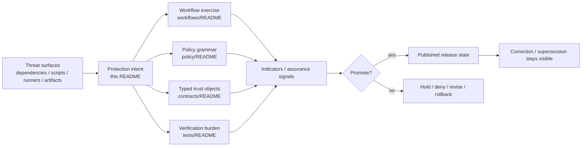

<!-- [KFM_META_BLOCK_V2]
doc_id: <REVIEW-REQUIRED>
title: Shai-Hulud 2.0 Protections
type: standard
version: v1
status: draft
owners: @bartytime4life
created: <REVIEW-REQUIRED>
updated: <REVIEW-REQUIRED>
policy_label: <REVIEW-REQUIRED>
related: [docs/security/supply-chain/README.md, docs/security/supply-chain/shai-hulud-2.0/README.md, docs/security/supply-chain/shai-hulud-2.0/workflows/README.md, docs/security/supply-chain/shai-hulud-2.0/indicators/README.md, docs/security/supply-chain/shai-hulud-2.0/indicators/samples/README.md, docs/security/supply-chain/shai-hulud-2.0/indicators/signatures/README.md, .github/CODEOWNERS, .github/workflows/README.md, policy/README.md, contracts/README.md, tests/README.md]
tags: [kfm, security, supply-chain, shai-hulud-2.0, protections]
notes: [doc_id/created/updated/policy_label still need repo-history or policy verification; current public main confirms this subtree, nested indicator subdirs, and /docs/ CODEOWNERS fallback]
[/KFM_META_BLOCK_V2] -->

# Shai-Hulud 2.0 Protections

Guardrail and control-intent register for the `shai-hulud-2.0` supply-chain lane.

> [!IMPORTANT]
> Status: experimental · Doc maturity: draft  
> Owners: `@bartytime4life` (current public `/docs/` fallback in `.github/CODEOWNERS`)  
> Path: `docs/security/supply-chain/shai-hulud-2.0/protections/README.md`  
>       
> Quick jumps: [Scope](#scope) · [Repo fit](#repo-fit) · [Current verified snapshot](#current-verified-snapshot) · [Accepted inputs](#accepted-inputs) · [Exclusions](#exclusions) · [Directory tree](#directory-tree) · [Quickstart](#quickstart) · [Usage](#usage) · [Diagram](#diagram) · [Tables](#tables) · [Task list](#task-list) · [FAQ](#faq) · [Appendix](#appendix)

> [!WARNING]
> This README documents **protections that should exist or be evidenced**, not proof that the current branch already enforces them. Keep **documented intent**, **current repo evidence**, and **proposed hardening** separate. Do not claim live signing, attestations, merge-blocking workflow gates, SBOM generation, or policy-bundle execution here unless another checked-in or emitted surface proves them.

> [!NOTE]
> Historical and attached design material frames **Shai-Hulud 2.0** as a cross-ecosystem supply-chain threat touching **npm**, **Maven**, **PyPI**, **GitHub Actions**, **lifecycle scripts**, **poisoned artifacts**, and **compromised runners**. Current public `main` confirms the lane split and adjacent boundary docs, but not the full enforcement depth. Keep that distinction visible.

## Scope

`protections/` is the child lane that explains **what guardrails belong to `shai-hulud-2.0`** and how those guardrails should be described without drifting into workflow ownership, proof storage, or broader sibling doctrine.

Within KFM, supply-chain trust is part of governed publication, not just package hygiene. A release unit that cannot explain its dependency inputs, builder identity, digest posture, approval posture, correction path, or rollback path weakens the same trust system KFM expects from maps, dossiers, APIs, exports, and runtime answers.

This README is a documentation seam, **not** a second truth surface.

### Truth posture used in this README

| Label | Meaning here |
| --- | --- |
| `CONFIRMED` | Directly supported by the current public repo tree, checked-in public Markdown, attached doctrine, or explicit path intent |
| `INFERRED` | Conservative interpretation connecting direct repo evidence to surrounding KFM doctrine |
| `PROPOSED` | Recommended structure, wording, or control shape not yet proven as current checked-in behavior |
| `UNKNOWN` | Not verified strongly enough to present as current branch or platform reality |
| `NEEDS VERIFICATION` | Load-bearing point that should be re-checked against the checked-out branch, platform settings, or emitted proof before hardening |

## Repo fit

**Repo fit:** path `docs/security/supply-chain/shai-hulud-2.0/protections/README.md` under the Shai-Hulud 2.0 lane.

This README should stay specific to **protection intent** while handing off procedure, measurement, proof interpretation, and typed trust objects to the owning sibling or control-plane surface.

| Relation | Link | Why it matters |
| --- | --- | --- |
| Upstream parent lane | [`../README.md`](../README.md) | Lane doctrine, split logic, and current routing rules |
| Upstream supply-chain surface | [`../../README.md`](../../README.md) | Broader supply-chain posture and writing discipline |
| Sibling child lane | [`../workflows/README.md`](../workflows/README.md) | Gate sequencing, promotion, rollback, and correction choreography |
| Sibling child lane | [`../indicators/README.md`](../indicators/README.md) | Assurance signals, interpretation, and measurable proof posture |
| Adjacent example surface | [`../indicators/samples/README.md`](../indicators/samples/README.md) | Public-safe, redacted, or synthetic examples belong there |
| Adjacent signature-reading surface | [`../indicators/signatures/README.md`](../indicators/signatures/README.md) | Signature and attestation reading notes belong there, not here |
| Review ownership surface | [`../../../../../.github/CODEOWNERS`](../../../../../.github/CODEOWNERS) | Grounds current owner fallback and review boundary |
| Adjacent executable inventory | [`../../../../../.github/workflows/README.md`](../../../../../.github/workflows/README.md) | Documents workflow inventory and warns against treating history as current checked-in YAML |
| Adjacent policy surface | [`../../../../../policy/README.md`](../../../../../policy/README.md) | Deny-by-default grammar, fixtures, tests, and policy-lane boundaries |
| Adjacent contract surface | [`../../../../../contracts/README.md`](../../../../../contracts/README.md) | `DecisionEnvelope`, `EvidenceBundle`, `RuntimeResponseEnvelope`, `ReleaseManifest`, and `CorrectionNotice` expectations |
| Adjacent verification surface | [`../../../../../tests/README.md`](../../../../../tests/README.md) | Proof burden, negative paths, release assembly, correction drills, and runtime outcome verification |

## Current verified snapshot

| Surface | Current public status | Safe statement | Why it matters here |
| --- | --- | --- | --- |
| `docs/security/supply-chain/shai-hulud-2.0/protections/README.md` | `CONFIRMED` | This file already exists on public `main` | A revision should strengthen the current role, not invent a new one |
| `docs/security/supply-chain/shai-hulud-2.0/` | `CONFIRMED` | Public `main` exposes the lane root plus `indicators/`, `protections/`, and `workflows/` | The split across meaning, procedure, and assurance is real |
| `docs/security/supply-chain/shai-hulud-2.0/indicators/` | `CONFIRMED` | Public `main` also exposes `samples/` and `signatures/` beneath `indicators/` | Protection prose can hand off example and signature-reading material instead of absorbing it |
| `.github/CODEOWNERS` | `CONFIRMED` | Public `main` assigns both `/.github/` and `/docs/` to `@bartytime4life` | The owner field here can be grounded without inventing a narrower lane rule |
| `.github/workflows/README.md` | `CONFIRMED` | Public `main` documents `.github/workflows/` as `README.md` only | This README must not imply current checked-in workflow YAML or merge-blocking automation from prose alone |
| `policy/README.md` | `CONFIRMED` | Public `main` exposes `policy/` plus `bundles/`, `fixtures/`, `policy-runtime/`, and `tests/` child lanes | Guardrail language can route to policy families instead of inventing a second policy home |
| `contracts/README.md` | `CONFIRMED` | Public contract docs explicitly center `DecisionEnvelope`, `EvidenceBundle`, `RuntimeResponseEnvelope`, `CorrectionNotice`, and `ReleaseManifest` | Those are the right typed anchors for protection language |
| `tests/README.md` | `CONFIRMED` | Public `tests/` is a real top-level verification surface with visible child families, but merge-blocking automation still needs separate proof | Protection expectations should resolve into proof burden without overstating current automation depth |

## Accepted inputs

The following content belongs here:

- lane-specific guardrail documentation for supply-chain trust
- control descriptions for dependency origin, build input immutability, artifact integrity, builder / runner identity, release memory, and correction visibility
- review guidance that helps distinguish **documented intent** from **proven enforcement**
- cross-links to owning workflow, policy, contract, test, fixture, or release-evidence surfaces
- public-safe examples of what a protection *expects to see*, when those examples are clearly synthetic, redacted, or non-authoritative
- threat-surface-to-control mappings that clarify **what must be defended** without claiming the defense is already implemented
- short notes explaining where verification burden should land when a protection statement becomes testable

## Exclusions

| This does **not** belong here | Put it here instead |
| --- | --- |
| Workflow YAML, job steps, or CI implementation logic as the source of truth | [`../../../../../.github/workflows/README.md`](../../../../../.github/workflows/README.md) and the owning workflow files |
| Executable policy bundles, policy tests, or review automation described as mere prose | [`../../../../../policy/README.md`](../../../../../policy/README.md) and the owning policy/test surfaces |
| Canonical generated proof artifacts, emitted SBOMs, live attestations, or release evidence bundles | The governed artifact or release-evidence home |
| Signature walkthroughs, verifier snippets, or public-safe attestation reading notes | [`../indicators/signatures/README.md`](../indicators/signatures/README.md) |
| Synthetic or redacted indicator examples | [`../indicators/samples/README.md`](../indicators/samples/README.md) |
| Private keys, tokens, credentials, or live signing material | Never commit them into docs; use the repo’s secure secret-handling path |
| Claims that a protection is enforced in code when visible evidence does not prove it | Keep it `INFERRED`, `PROPOSED`, `UNKNOWN`, or `NEEDS VERIFICATION` until an executable or emitted surface proves it |
| Broad repo-wide security doctrine | [`../../README.md`](../../README.md) or higher-order security doctrine once directly verified |
| Runtime incident response procedures, pager playbooks, or postmortem process | The owning runbook / operations surface, not this control-intent register |

## Directory tree

> [!NOTE]
> Current public `main` confirms the lane root, this child lane, and the two nested indicator leaf surfaces below. If the checked-out branch differs, update this tree from branch-local evidence before merge.

```text
docs/security/supply-chain/shai-hulud-2.0/
├── README.md
├── protections/
│   └── README.md
├── workflows/
│   └── README.md
└── indicators/
    ├── README.md
    ├── samples/
    │   └── README.md
    └── signatures/
        └── README.md
```

### Role of this directory

```text
docs/security/supply-chain/shai-hulud-2.0/protections/
└── README.md   # guardrail intent, control boundaries, and routing guidance
```

## Quickstart

1. Confirm whether your checked-out branch still matches the current public tree for this lane.
2. Re-read the lane root before changing protection language.
3. Check whether the change is really about **guardrails** rather than workflow steps, indicator interpretation, or signature-reading notes.
4. Reinspect adjacent executable, policy, contract, and verification surfaces before claiming enforcement.
5. Keep negative outcomes first-class: a good protection doc makes deny, hold, quarantine, rollback, supersession, and correction visible.

```bash
# 1) Inspect the lane subtree that exists in the checked-out branch
find docs/security/supply-chain/shai-hulud-2.0 -maxdepth 3 -type f 2>/dev/null | sort

# 2) Read the lane root and adjacent child READMEs first
sed -n '1,260p' docs/security/supply-chain/shai-hulud-2.0/README.md 2>/dev/null || true
sed -n '1,260p' docs/security/supply-chain/shai-hulud-2.0/workflows/README.md 2>/dev/null || true
sed -n '1,260p' docs/security/supply-chain/shai-hulud-2.0/indicators/README.md 2>/dev/null || true
sed -n '1,220p' docs/security/supply-chain/shai-hulud-2.0/indicators/samples/README.md 2>/dev/null || true
sed -n '1,220p' docs/security/supply-chain/shai-hulud-2.0/indicators/signatures/README.md 2>/dev/null || true

# 3) Re-check adjacent current boundary docs before changing trust-bearing prose
sed -n '1,220p' .github/CODEOWNERS 2>/dev/null || true
sed -n '1,260p' .github/workflows/README.md 2>/dev/null || true
sed -n '1,280p' policy/README.md 2>/dev/null || true
sed -n '1,320p' contracts/README.md 2>/dev/null || true
sed -n '1,280p' tests/README.md 2>/dev/null || true

# 4) Search for lane-coupled trust objects and supply-chain terms
git grep -nE 'Shai-Hulud|sbom|attest|signature|digest|provenance|DecisionEnvelope|EvidenceBundle|RuntimeResponseEnvelope|CorrectionNotice|ReleaseManifest|reason_codes|obligation_codes' -- \
  docs .github policy contracts tests 2>/dev/null || true
```

## Usage

Use this README when you need to answer **“what should be protected here?”** rather than **“how is the gate executed?”**, **“what signal proves it?”**, or **“how should a signature be read?”**

| You need to… | Start here | Then re-check |
| --- | --- | --- |
| Define or tighten a guardrail | This README | [`../workflows/README.md`](../workflows/README.md), [`../../../../../policy/README.md`](../../../../../policy/README.md), [`../../../../../contracts/README.md`](../../../../../contracts/README.md), [`../../../../../tests/README.md`](../../../../../tests/README.md) |
| Document a gate, promotion sequence, rollback path, or correction step | [`../workflows/README.md`](../workflows/README.md) | `.github/workflows/`, policy, tests, and release / correction surfaces |
| Define measurable assurance or interpretation logic | [`../indicators/README.md`](../indicators/README.md) | policy, contracts, tests, and release-safe evidence |
| Add a public-safe example or redacted walkthrough | [`../indicators/samples/README.md`](../indicators/samples/README.md) | provenance, redaction, and publication-safety checks |
| Add signature or attestation reading notes | [`../indicators/signatures/README.md`](../indicators/signatures/README.md) | policy, contracts, and release-proof surfaces |
| Reconcile owner, status, or path language | This README + [`../../../../../.github/CODEOWNERS`](../../../../../.github/CODEOWNERS) | current checked-out branch if it differs from public `main` |
| Explain how deny / hold / rollback / correction posture should behave | This README | `DecisionEnvelope`, `ReleaseManifest`, `CorrectionNotice`, review surfaces, and proof-bearing test families |

## Diagram



## Tables

### Threat-surface register for this lane

> [!NOTE]
> This register is a control-intent aid. It helps keep the protections lane concrete without implying that all of these defenses already exist in mounted code, platform rules, or emitted release proof.

| Threat surface | Why protection belongs here | Minimum visible expectation | Route deeper detail to |
| --- | --- | --- | --- |
| Dependency ecosystems (`npm`, `Maven`, `PyPI`) | Supply-chain trust starts before build execution | Registry/source assumptions are explicit; ambiguous dependency origin is treated as a hold condition, not a footnote | Workflows, policy, contracts |
| Workflow / CI entrypoints (`GitHub Actions`) | A workflow can become an attack path even when package versions look clean | Workflow trust is not asserted from prose alone; approvals, pinning, and gate claims must route to executable or emitted surfaces | [`../../../../../.github/workflows/README.md`](../../../../../.github/workflows/README.md) |
| Lifecycle scripts and build hooks | Side effects can bypass dependency review if script behavior is hand-waved | The doc names the risk and routes execution claims to workflow / policy owners | Workflows + policy |
| Artifact provenance | “We built it” is not enough unless the artifact can be linked to a governed release | Signature, attestation, SBOM, or equivalent proof expectations are described as linkages, not as assumed facts | Contracts + indicators |
| Builder / runner trust | Compromised runners undermine downstream proofs | Approved execution surface is explicit; magic builder trust is rejected | Workflows + policy |
| Review / proof drift | A guardrail can look solid in prose while staying unproven in tests or release evidence | Proof burden is routed visibly instead of implied | Tests + release-evidence surfaces |
| Promotion and correction path | A protection story that only covers happy-path release is incomplete | Deny, hold, rollback, correction, and visible supersession remain first-class outcomes | Policy + contracts + tests |

### Protection seams this lane should describe

| Protection seam | Why it belongs here | Minimum visible expectation | Route deeper detail to |
| --- | --- | --- | --- |
| Dependency origin and namespace trust | Supply-chain trust starts before build execution | Registry/source assumptions are explicit; unexpected origin or unreviewed substitution is treated as risk | Workflows + policy |
| Build input immutability | Mutable inputs weaken reproducibility and later proof | Version, digest, lockfile, or equivalent pinning expectation is stated clearly | [`../workflows/README.md`](../workflows/README.md) |
| Builder / runner identity | Trust in an artifact depends on who or what built it | The execution surface is explicit; “hidden builder trust” is rejected | [`../../../../../.github/workflows/README.md`](../../../../../.github/workflows/README.md) |
| Artifact integrity and proof linkage | Claims about SBOMs, signatures, or attestations need a governed trail | Protection prose explains *what should be linked*, not that the link already exists | [`../indicators/README.md`](../indicators/README.md), [`../../../../../contracts/README.md`](../../../../../contracts/README.md) |
| Decision grammar and obligations | Protections only become governable when denials and conditions are machine-readable | Reason codes, obligation codes, and review-bearing outcomes are named as first-class expectations | [`../../../../../policy/README.md`](../../../../../policy/README.md), [`../../../../../contracts/README.md`](../../../../../contracts/README.md) |
| Release memory and correction lineage | Security meaning changes over time and must stay inspectable | Protections point to release / correction objects instead of silent replacement | [`../../../../../contracts/README.md`](../../../../../contracts/README.md) |
| Verification burden and negative-path proof | Guardrail language is only trustworthy if failure paths can be exercised somewhere | Protection prose routes proof burden into visible verification families without claiming case depth that has not been checked | [`../../../../../tests/README.md`](../../../../../tests/README.md) |
| Evidence / claim discipline | A protection lane that blurs doc intent and repo proof becomes trust theater | Claims stay linked to executable evidence or remain `INFERRED`, `PROPOSED`, `UNKNOWN`, or `NEEDS VERIFICATION` | This README + owning surfaces |
| Public-safe documentation discipline | This subtree is documentation, not secret storage or proof storage | No live material, no hidden approvals, no overclaiming | This README + parent lane README |

### Control-to-surface handoff matrix

| Surface | Owns what | This README should do |
| --- | --- | --- |
| [`../README.md`](../README.md) | Lane-level shape, threat framing, truth posture, and split logic | Stay consistent with parent intent and child-lane separation |
| [`../workflows/README.md`](../workflows/README.md) | Procedure, sequencing, promotion, rollback, and operational exercise | Hand off execution detail there |
| [`../indicators/README.md`](../indicators/README.md) | Assurance signals and measurement posture | Hand off measurable proof there |
| [`../indicators/samples/README.md`](../indicators/samples/README.md) | Public-safe examples and fixtures | Route examples there instead of embedding them as authority here |
| [`../indicators/signatures/README.md`](../indicators/signatures/README.md) | Signature / attestation reading notes | Route format-specific walkthroughs there |
| [`../../../../../policy/README.md`](../../../../../policy/README.md) | Reasons, obligations, deny-by-default posture, fixtures, and policy-lane boundaries | Reuse policy vocabulary; do not invent a parallel grammar |
| [`../../../../../contracts/README.md`](../../../../../contracts/README.md) | Typed trust objects and fail-closed object boundaries | Anchor protection claims in those objects where relevant |
| [`../../../../../tests/README.md`](../../../../../tests/README.md) | Verification families, negative-path proof burden, release assembly, and correction drills | Route proof expectations there without overstating current suite depth |
| [`../../../../../.github/CODEOWNERS`](../../../../../.github/CODEOWNERS) | Current public owner fallback and review boundary | Ground ownership and review cues here instead of inventing narrower rules |
| [`../../../../../.github/workflows/README.md`](../../../../../.github/workflows/README.md) | Workflow inventory and CI/CD control surfaces | Do not pretend this README is the workflow source of truth |

## Task list

### Definition of done for a solid protection update

- [ ] Every new protection statement is marked proportionally by truth posture where ambiguity matters: `CONFIRMED`, `INFERRED`, `PROPOSED`, `UNKNOWN`, or `NEEDS VERIFICATION`.
- [ ] Every repo-tree statement matches either the checked-out branch or the explicitly called-out current public branch.
- [ ] No sentence implies live signing, attestation, SBOM generation, merge-blocking workflow gates, or policy-bundle execution unless another checked-in or emitted surface proves it.
- [ ] Every control that depends on typed runtime or release behavior cross-links to the relevant contract family.
- [ ] Every control that depends on review or deny logic aligns with the policy reasons / obligations model.
- [ ] Every example is public-safe, redacted, synthetic, or clearly non-authoritative.
- [ ] No secrets, keys, tokens, credentials, or live proof artifacts are introduced.
- [ ] If the change affects procedure, the matching workflow doc is updated in the same review window.
- [ ] If the change affects measurable assurance, the matching indicator doc is updated in the same review window.
- [ ] If the change strengthens proof expectations, the relevant verification surface is re-checked in the same review window.
- [ ] Rollback, withdrawal, supersession, or correction implications are visible when relevant.

## FAQ

### Does this README prove that KFM already enforces these protections?

No. This file describes the protection lane and the guardrails it should preserve. Enforcement must be proven by adjacent executable or measurable surfaces.

### Does current public `main` prove merge-blocking automation for this lane?

No. Current public `main` proves the documentation lane and adjacent boundary READMEs. It does **not** by itself prove checked-in workflow YAML, required checks, platform rules, OIDC wiring, or branch-protection settings.

### Is this README the right place to explain how a CI gate is implemented?

No. This lane explains **guardrail intent**. Procedure and job logic belong to workflow-owning surfaces.

### Where should emitted SBOMs, signatures, or attestations live?

Not here. This README may describe their protection role, but canonical emitted artifacts belong in their governed artifact or release-evidence home.

### Why does this file keep talking about deny, hold, rollback, and correction?

Because a fail-open protection story is not a KFM protection story. Negative outcomes are part of the trust model, not embarrassing edge cases.

### Is the name “Shai-Hulud 2.0” tied to one specific public incident or external toolchain?

`NEEDS VERIFICATION`. Treat it as a local named lane unless a stronger repo-local source proves more.

## Appendix

<details>
<summary>Protection review checklist</summary>

### Questions to ask before merging a change here

1. Does the new text describe a **guardrail**, or is it secretly a workflow, indicator, signature-reading note, or tool tutorial?
2. Does the text claim enforcement that the current repo or emitted proof surfaces cannot prove?
3. If a reader followed the links, would they land in the owning workflow, policy, contract, indicator, or verification surface?
4. Does the change preserve fail-closed behavior and visible correction lineage?
5. Are any examples safe to publish as plain documentation?
6. Does the text confuse historical design material, current public `main`, and the checked-out branch?
7. Is any sibling lane being duplicated instead of referenced?

</details>

<details>
<summary>Open verification gaps that should stay visible</summary>

- Exact checked-out branch subtree shape if it differs from current public `main`
- Whether the checked-out branch contains checked-in workflow YAML beyond the public README-only workflow lane
- Whether active required checks or platform-level rules block merges for this lane
- Whether executable policy bundles, fixtures, or runnable tests exist on the checked-out branch
- Which governed home will own emitted supply-chain proof artifacts
- Whether the parent-lane draft / experimental posture should remain unchanged after branch-local review
- What the deeper repo-local meaning of `Shai-Hulud 2.0` is meant to be inside KFM

</details>

[Back to top](#shai-hulud-20-protections)
