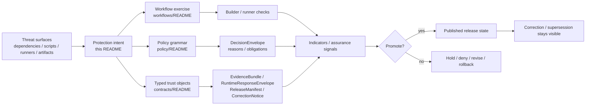

<!-- [KFM_META_BLOCK_V2]
doc_id: <REVIEW-REQUIRED>
title: Shai-Hulud 2.0 Protections
type: standard
version: v1
status: draft
owners: @bartytime4life
created: <REVIEW-REQUIRED>
updated: <REVIEW-REQUIRED>
policy_label: <REVIEW-REQUIRED>
related: [docs/security/supply-chain/README.md, docs/security/supply-chain/shai-hulud-2.0/README.md, docs/security/supply-chain/shai-hulud-2.0/workflows/README.md, docs/security/supply-chain/shai-hulud-2.0/indicators/README.md, .github/workflows/README.md, policy/README.md, contracts/README.md]
tags: [kfm, security, supply-chain, shai-hulud-2.0, protections]
notes: [doc_id/created/updated/policy_label need mounted-repo verification]
[/KFM_META_BLOCK_V2] -->

# Shai-Hulud 2.0 Protections

Guardrail and control-intent register for the `shai-hulud-2.0` supply-chain lane.

> [!IMPORTANT]
> Status: experimental · Doc maturity: draft  
> Owners: `@bartytime4life`  
> Path: `docs/security/supply-chain/shai-hulud-2.0/protections/README.md`  
>      
> Quick jumps: [Scope](#scope) · [Repo fit](#repo-fit) · [Accepted inputs](#accepted-inputs) · [Exclusions](#exclusions) · [Directory tree](#directory-tree) · [Quickstart](#quickstart) · [Usage](#usage) · [Diagram](#diagram) · [Tables](#tables) · [Task list](#task-list) · [FAQ](#faq) · [Appendix](#appendix)

> [!WARNING]
> This README documents **protections that should exist or be evidenced**, not proof that the current branch already enforces them. Keep **documented intent**, **current repo evidence**, and **proposed hardening** separate. Do not claim live signing, attestations, merge-blocking workflow gates, SBOM generation, or policy-bundle execution here unless another checked-in surface proves them.

> [!NOTE]
> Attached design material frames **Shai-Hulud 2.0** as a cross-ecosystem supply-chain threat touching **npm**, **Maven**, **PyPI**, **GitHub Actions**, **lifecycle scripts**, **poisoned artifacts**, and **compromised runners**. This child-lane README stays **draft / experimental** until the mounted repo confirms how much of that parent-lane posture is actually adopted here.

## Scope

`protections/` is the child lane that explains **what guardrails belong to `shai-hulud-2.0`** and how those guardrails should be described without drifting into workflow ownership, proof storage, or broader sibling doctrine.

Within KFM, supply-chain trust is part of governed publication, not just package hygiene. A release unit that cannot explain its dependency inputs, builder identity, digest posture, approval posture, correction path, or rollback path weakens the same trust system KFM expects from maps, dossiers, APIs, exports, and runtime answers.

This README is a documentation seam, **not** a second truth surface.

### Truth posture used in this README

| Label | Meaning here |
| --- | --- |
| `CONFIRMED` | Directly supported by attached doctrine, the attached repo-grounded summary, or explicit task-provided path intent |
| `INFERRED` | Strongly suggested by surrounding KFM doctrine or attached design material, but not directly proven as mounted implementation |
| `PROPOSED` | Recommended structure, wording, or control shape for this lane |
| `UNKNOWN` | Not verified in the current session strongly enough to present as current repo fact |
| `NEEDS VERIFICATION` | Important, tempting to overclaim, or load-bearing enough that the repo should be checked directly before treating it as settled |

## Repo fit

**Repo fit:** path `docs/security/supply-chain/shai-hulud-2.0/protections/README.md` under the Shai-Hulud 2.0 lane. Upstream and adjacent links below are limited to paths explicitly provided in the task or reinforced by the attached corpus.

This README should stay specific to **protection intent** while handing off procedure, measurement, and executable proof to the owning sibling or control-plane surface.

| Relation | Link | Why it matters |
| --- | --- | --- |
| Upstream parent lane | [`../README.md`](../README.md) | Parent lane doctrine, threat framing, and subtree boundary |
| Upstream supply-chain surface | [`../../README.md`](../../README.md) | Broader supply-chain posture and writing discipline |
| Sibling child lane | [`../workflows/README.md`](../workflows/README.md) | Procedure, sequencing, approval flow, rollback exercise, and operational gate choreography |
| Sibling child lane | [`../indicators/README.md`](../indicators/README.md) | Assurance signals, evidence examples, and measurement posture |
| Adjacent executable surface | [`../../../../../.github/workflows/README.md`](../../../../../.github/workflows/README.md) | Workflow inventory and current in-tree workflow posture |
| Adjacent policy surface | [`../../../../../policy/README.md`](../../../../../policy/README.md) | Deny-by-default policy grammar, reasons, obligations, and review-bearing exceptions |
| Adjacent contract surface | [`../../../../../contracts/README.md`](../../../../../contracts/README.md) | `DecisionEnvelope`, `EvidenceBundle`, `RuntimeResponseEnvelope`, `ReleaseManifest`, and `CorrectionNotice` expectations |

### Evidence-bounded posture during this revision

| Surface | What can be said safely | Why it matters here |
| --- | --- | --- |
| Task target | This README is being authored for `docs/security/supply-chain/shai-hulud-2.0/protections/README.md` | The file role and path are explicit for this revision |
| Repo-grounded doc surfaces | Attached repo-grounded research says `.github/workflows/README.md`, `policy/README.md`, and `contracts/README.md` exist as documentation surfaces | This README can safely hand off to those control-plane docs |
| Workflow surface | The same repo-grounded summary says `.github/workflows/README.md` describes scaffolding and does **not** prove active in-tree merge-blocking workflow YAML | This README must not imply live CI gates from prose alone |
| Policy surface | The same summary says `policy/README.md` describes **deny-by-default** posture plus **reasons / obligations** | Protection language should reuse that grammar rather than inventing a parallel one |
| Contract surface | Attached doctrine defines first-wave trust objects such as `DecisionEnvelope`, `ReleaseManifest`, `EvidenceBundle`, `RuntimeResponseEnvelope`, and `CorrectionNotice` | Protection statements should anchor to those objects instead of free-floating prose |
| Parent threat framing | Attached design material describes Shai-Hulud 2.0 as a cross-ecosystem supply-chain threat; mounted repo adoption of that exact framing remains `NEEDS VERIFICATION` | The threat model can inform guardrail intent without being overstated as live repo fact |

## Accepted inputs

The following content belongs here:

- lane-specific guardrail documentation for supply-chain trust
- control descriptions for dependency origin, build input immutability, artifact integrity, builder / runner identity, release memory, and correction visibility
- redacted reviewer checklists that help distinguish **documented intent** from **proven enforcement**
- cross-links to owning workflow, policy, contract, test, fixture, or release-evidence surfaces
- public-safe examples of what a protection *expects to see*, when those examples are clearly synthetic, redacted, or non-authoritative
- threat-surface-to-control mappings that clarify **what must be defended** without claiming the defense is already implemented

## Exclusions

| This does **not** belong here | Put it here instead |
| --- | --- |
| Workflow YAML, job steps, or CI implementation logic as the source of truth | [`../../../../../.github/workflows/README.md`](../../../../../.github/workflows/README.md) and the owning workflow files |
| Executable policy bundles, policy tests, or review automation described as mere prose | [`../../../../../policy/README.md`](../../../../../policy/README.md) and the owning policy/test surfaces |
| Canonical generated proof artifacts, emitted SBOMs, live attestations, or release evidence bundles | The governed artifact or release-evidence home |
| Private keys, tokens, credentials, or live signing material | Never commit them into docs; use the repo’s secure secret-handling path |
| Claims that a protection is enforced in code when visible evidence does not prove it | Keep it `INFERRED`, `PROPOSED`, `UNKNOWN`, or `NEEDS VERIFICATION` until an executable surface proves it |
| Broad repo-wide security doctrine | [`../../README.md`](../../README.md) or higher-order security doctrine once directly verified |
| Runtime incident response procedures, pager playbooks, or postmortem process | The owning runbook / operations surface, not this control-intent register |

## Directory tree

> [!NOTE]
> Working path map used by this README. It reflects the task target and adjacent paths named in the current request. Exact mounted-repo verification is still pending.

```text
docs/security/supply-chain/shai-hulud-2.0/
├── README.md
├── protections/
│   └── README.md
├── workflows/
│   └── README.md
└── indicators/
    └── README.md
```

### Role of this directory

```text
docs/security/supply-chain/shai-hulud-2.0/protections/
└── README.md   # control intent, guardrails, and routing guidance
```

## Quickstart

1. Verify that the subtree exists in the mounted repo before editing.
2. Re-read the parent lane before changing protection language.
3. Check whether the change is really about **guardrails** rather than workflow steps or assurance signals.
4. Reinspect adjacent executable surfaces before claiming enforcement.
5. Keep negative outcomes first-class: a good protection doc makes deny, hold, quarantine, rollback, supersession, and correction visible.

```bash
# Verify the target subtree first
find docs/security/supply-chain -maxdepth 4 -type f 2>/dev/null | grep 'shai-hulud-2.0' || true

# Read the parent lane and adjacent child lanes
sed -n '1,260p' docs/security/supply-chain/shai-hulud-2.0/README.md 2>/dev/null || true
sed -n '1,260p' docs/security/supply-chain/shai-hulud-2.0/workflows/README.md 2>/dev/null || true
sed -n '1,260p' docs/security/supply-chain/shai-hulud-2.0/indicators/README.md 2>/dev/null || true

# Re-check the broader control-plane surfaces this file depends on
sed -n '1,260p' .github/workflows/README.md 2>/dev/null || true
sed -n '1,260p' policy/README.md 2>/dev/null || true
sed -n '1,320p' contracts/README.md 2>/dev/null || true

# Search trust-bearing terms before adding new protection prose
git grep -nE 'Shai-Hulud|SBOM|attest|signature|digest|provenance|DecisionEnvelope|EvidenceBundle|RuntimeResponseEnvelope|CorrectionNotice|ReleaseManifest|reason_codes|obligation_codes' -- docs .github policy contracts tests 2>/dev/null || true
```

## Usage

Use this README when you need to answer **“what should be protected here?”** rather than **“how is the gate executed?”** or **“what signal proves it?”**

| You need to… | Start here | Then verify against |
| --- | --- | --- |
| Define or tighten a guardrail | This README | [`../workflows/README.md`](../workflows/README.md), [`../../../../../policy/README.md`](../../../../../policy/README.md), [`../../../../../contracts/README.md`](../../../../../contracts/README.md) |
| Describe how the guardrail is exercised or promoted | [`../workflows/README.md`](../workflows/README.md) | `.github/workflows/`, policy, tests, and release evidence |
| Define what measurable assurance looks like | [`../indicators/README.md`](../indicators/README.md) | policy, contracts, fixtures, and release evidence |
| Explain how a deny / hold / rollback / correction path should behave | This README | `DecisionEnvelope`, `ReleaseManifest`, `CorrectionNotice`, review surfaces, and runbooks |
| Reconcile protection language with repo reality | This README | Attached repo-grounded evidence plus the mounted repo tree once available |

## Diagram



## Tables

### Threat-surface register for this lane

> [!NOTE]
> This register is a control-intent aid. It helps keep the protections lane concrete without implying that all of these defenses already exist in mounted code or CI.

| Threat surface | Why protection belongs here | Minimum visible expectation | Route deeper detail to |
| --- | --- | --- | --- |
| Dependency ecosystems (`npm`, `Maven`, `PyPI`) | Supply-chain trust starts before build execution | Registry/source assumptions are explicit; ambiguous dependency origin is treated as a hold condition, not a footnote | Workflows, policy, contracts |
| Workflow / CI entrypoints (`GitHub Actions`) | A workflow can become an attack path even when package versions look clean | Workflow trust is not asserted from prose alone; approvals, pinning, and gate claims must route to executable surfaces | [`../../../../../.github/workflows/README.md`](../../../../../.github/workflows/README.md) |
| Lifecycle scripts and build hooks | Side effects can bypass dependency review if script behavior is hand-waved | The doc names the risk and routes execution claims to workflow / policy owners | Workflows + policy |
| Artifact provenance | “We built it” is not enough unless the artifact can be linked to a governed release | Signature, attestation, SBOM, or equivalent proof expectations are described as linkages, not as assumed facts | Contracts + indicators |
| Builder / runner trust | Compromised runners undermine downstream proofs | Approved execution surface is explicit; magic builder trust is rejected | Workflows + policy |
| Promotion and correction path | A protection story that only covers happy-path release is incomplete | Deny, hold, rollback, correction, and visible supersession remain first-class outcomes | Policy + contracts |

### Protection seams this lane should describe

| Protection seam | Why it belongs here | Minimum visible expectation | Route deeper detail to |
| --- | --- | --- | --- |
| Dependency origin and namespace trust | Supply-chain trust starts before build execution | Registry/source assumptions are explicit; unexpected origin or unreviewed substitution is treated as risk | Workflows + policy |
| Build input immutability | Mutable inputs weaken reproducibility and later proof | Version, digest, lockfile, or equivalent pinning expectation is stated clearly | [`../workflows/README.md`](../workflows/README.md) |
| Builder / runner identity | Trust in an artifact depends on who or what built it | The execution surface is explicit; “hidden builder trust” is rejected | [`../../../../../.github/workflows/README.md`](../../../../../.github/workflows/README.md) |
| Artifact integrity and proof linkage | Claims about SBOMs, signatures, or attestations need a governed trail | Protection prose explains *what should be linked*, not that the link already exists | [`../indicators/README.md`](../indicators/README.md), [`../../../../../contracts/README.md`](../../../../../contracts/README.md) |
| Decision grammar and obligations | Protections only become governable when denials and conditions are machine-readable | Reason codes, obligation codes, and review-bearing outcomes are named as first-class expectations | [`../../../../../policy/README.md`](../../../../../policy/README.md), [`../../../../../contracts/README.md`](../../../../../contracts/README.md) |
| Release memory and correction lineage | Security meaning changes over time and must stay inspectable | Protections point to release / correction objects instead of silent replacement | [`../../../../../contracts/README.md`](../../../../../contracts/README.md) |
| Evidence / claim discipline | A protection lane that blurs doc intent and repo proof becomes trust theater | Claims stay linked to executable evidence or remain `INFERRED`, `PROPOSED`, `UNKNOWN`, or `NEEDS VERIFICATION` | This README + owning surfaces |
| Public-safe documentation discipline | This subtree is documentation, not secret storage or proof storage | No live material, no hidden approvals, no overclaiming | This README + parent lane README |

### Control-to-surface handoff matrix

| Surface | Owns what | This README should do |
| --- | --- | --- |
| [`../README.md`](../README.md) | Lane-level shape, threat framing, and truth posture | Stay consistent with parent intent and child-lane separation |
| [`../workflows/README.md`](../workflows/README.md) | Procedure, sequencing, promotion, rollback, and operational exercise | Hand off execution detail there |
| [`../indicators/README.md`](../indicators/README.md) | Assurance signals and measurement posture | Hand off measurable proof there |
| [`../../../../../policy/README.md`](../../../../../policy/README.md) | Reasons, obligations, deny-by-default, and review-bearing exceptions | Reuse policy vocabulary; do not invent a parallel grammar |
| [`../../../../../contracts/README.md`](../../../../../contracts/README.md) | Typed trust objects and fail-closed object boundaries | Anchor protection claims in those objects where relevant |
| [`../../../../../.github/workflows/README.md`](../../../../../.github/workflows/README.md) | Workflow inventory and CI/CD control surfaces | Do not pretend this README is the workflow source of truth |

## Task list

### Definition of done for a solid protection update

- [ ] Every new protection statement is marked proportionally by truth posture where ambiguity matters: `CONFIRMED`, `INFERRED`, `PROPOSED`, `UNKNOWN`, or `NEEDS VERIFICATION`.
- [ ] No sentence implies live signing, attestation, SBOM generation, merge-blocking workflow gates, or policy-bundle execution unless another checked-in surface proves it.
- [ ] Every control that depends on typed runtime or release behavior cross-links to the relevant contract family.
- [ ] Every control that depends on review or deny logic aligns with the policy reasons / obligations model.
- [ ] Every example is public-safe, redacted, synthetic, or clearly non-authoritative.
- [ ] No secrets, keys, tokens, credentials, or live proof artifacts are introduced.
- [ ] If the change affects procedure, the matching workflow doc is updated in the same review window.
- [ ] If the change affects measurable assurance, the matching indicator doc is updated in the same review window.
- [ ] Rollback, withdrawal, supersession, or correction implications are visible when relevant.

## FAQ

### Does this README prove that KFM already enforces these protections?

No. This file describes the protection lane and the guardrails it should preserve. Enforcement must be proven by adjacent executable or measurable surfaces.

### Is this README the right place to explain how a CI gate is implemented?

No. This lane explains **guardrail intent**. Procedure and job logic belong to workflow-owning surfaces.

### Where should emitted SBOMs, signatures, or attestations live?

Not here. This README may describe their protection role, but canonical emitted artifacts belong in their governed artifact or release-evidence home.

### Why does this file keep talking about deny, hold, rollback, and correction?

Because a fail-open protection story is not a KFM protection story. Negative outcomes are part of the trust model, not embarrassing edge cases.

### Is the name “Shai-Hulud 2.0” tied to one specific public incident or external toolchain?

`NEEDS VERIFICATION`. Treat it as a local named lane unless a stronger repo-local source proves more.

## Appendix

<details>
<summary>Protection review checklist</summary>

### Questions to ask before merging a change here

1. Does the new text describe a **guardrail**, or is it secretly a workflow, indicator, or tool tutorial?
2. Does the text claim enforcement that the current repo cannot prove?
3. If a reader followed the links, would they land in the owning workflow / policy / contract surface?
4. Does the change preserve fail-closed behavior and visible correction lineage?
5. Are any examples safe to publish as plain documentation?
6. Does the text confuse attached design material with mounted repo reality?
7. Is any sibling lane being duplicated instead of referenced?

</details>

<details>
<summary>Open verification gaps that should stay visible</summary>

- Exact mounted subtree shape under `docs/security/supply-chain/shai-hulud-2.0/`
- Whether active merge-blocking workflow YAML for this lane exists in-tree today
- Whether executable policy bundles and tests are mounted for the deny-by-default grammar described elsewhere
- Which governed home will own emitted supply-chain proof artifacts
- Whether the parent-lane “stable / enforced” posture from attached design material still matches mounted repo reality
- What the deeper repo-local meaning of `Shai-Hulud 2.0` is meant to be inside KFM

</details>

[Back to top](#shai-hulud-20-protections)
