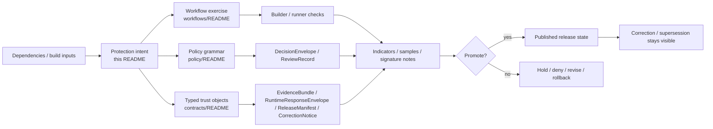

<!-- [KFM_META_BLOCK_V2]
doc_id: <REVIEW-REQUIRED>
title: Shai-Hulud 2.0 Protections
type: standard
version: v1
status: draft
owners: @bartytime4life
created: <REVIEW-REQUIRED>
updated: <REVIEW-REQUIRED>
policy_label: <REVIEW-REQUIRED>
related: [docs/security/supply-chain/README.md, docs/security/supply-chain/shai-hulud-2.0/README.md, docs/security/supply-chain/shai-hulud-2.0/workflows/README.md, docs/security/supply-chain/shai-hulud-2.0/indicators/README.md, .github/workflows/README.md, policy/README.md, contracts/README.md]
tags: [kfm, security, supply-chain, shai-hulud-2.0, protections]
notes: [doc_id/created/updated/policy_label need mounted-repo verification]
[/KFM_META_BLOCK_V2] -->

# Shai-Hulud 2.0 Protections

Guardrail and control-intent register for the `shai-hulud-2.0` supply-chain lane.

> [!IMPORTANT]
> Status: experimental · Doc maturity: draft  
> Owners: `@bartytime4life`  
> Path: `docs/security/supply-chain/shai-hulud-2.0/protections/README.md`  
>      
> Quick jumps: [Scope](#scope) · [Repo fit](#repo-fit) · [Accepted inputs](#accepted-inputs) · [Exclusions](#exclusions) · [Directory tree](#directory-tree) · [Quickstart](#quickstart) · [Usage](#usage) · [Diagram](#diagram) · [Tables](#tables) · [Task list](#task-list) · [FAQ](#faq) · [Appendix](#appendix)

> [!WARNING]
> This README documents **protections that should exist or be evidenced**, not proof that the current branch already enforces them. Keep **documented intent**, **current repo evidence**, and **proposed hardening** separate. Do not claim live signing, attestations, merge-blocking workflow gates, SBOM generation, or policy-bundle execution here unless another checked-in surface proves them.

## Scope

`protections/` is the child lane that explains **what guardrails belong to `shai-hulud-2.0`** and how those guardrails should be described without drifting into workflow ownership, proof storage, or broader sibling doctrine.

Within KFM, supply-chain trust is part of governed publication, not just package hygiene. A release unit that cannot explain its dependency inputs, builder identity, digest posture, approval posture, or rollback path weakens the same trust system KFM expects from maps, dossiers, APIs, exports, and runtime answers.

This README is a documentation seam, **not** a second truth surface.

> [!NOTE]
> The deeper program meaning of the name **Shai-Hulud 2.0** remains `NEEDS VERIFICATION`. This file treats the lane name as a **named local documentation surface** and stays grounded in the surrounding repo structure.

### Truth posture used in this README

| Label | Meaning here |
| --- | --- |
| `CONFIRMED` | Visible in the currently retrievable repo tree or already established by adjacent repo docs |
| `INFERRED` | Strongly suggested by directory shape and nearby documentation, but not directly proven as mounted enforcement |
| `PROPOSED` | Recommended structure, wording, or control shape for this lane |
| `NEEDS VERIFICATION` | Important, load-bearing, or tempting to overclaim, but not directly established in the visible repo state |

## Repo fit

This README sits below [`../README.md`](../README.md) and should stay specific to **protections** while handing off procedure and measurement to sibling child lanes.

| Relation | Link | Why it matters |
| --- | --- | --- |
| Upstream | [`../../../README.md`](../../../README.md) | Security subtree doctrine and documentation posture |
| Upstream | [`../../README.md`](../../README.md) | Supply-chain subtree rules, evidence boundary, and writing discipline |
| Upstream | [`../README.md`](../README.md) | Parent lane intent for `protections/`, `workflows/`, and `indicators/` |
| Sibling child lane | [`../workflows/README.md`](../workflows/README.md) | Procedure, gate sequencing, promotion, rollback, and operational exercise |
| Sibling child lane | [`../indicators/README.md`](../indicators/README.md) | Assurance signals, evidence examples, and measurement posture |
| Sibling child lane | [`../indicators/samples/README.md`](../indicators/samples/README.md) | Public-safe examples and synthetic fixtures |
| Sibling child lane | [`../indicators/signatures/README.md`](../indicators/signatures/README.md) | Signature / attestation-oriented examples and reading notes |
| Supply-chain sibling | [`../../dependency-confusion/README.md`](../../dependency-confusion/README.md) | Package-origin and namespace-trust risks belong there |
| Supply-chain sibling | [`../../sigstore-cosign-v3/README.md`](../../sigstore-cosign-v3/README.md) | Sigstore / Cosign-specific guidance belongs there |
| Supply-chain sibling | [`../../reference-repos/README.md`](../../reference-repos/README.md) | External comparison material belongs there |
| Adjacent executable surface | [`../../../../../.github/workflows/README.md`](../../../../../.github/workflows/README.md) | Workflow inventory and future gate patterns |
| Adjacent policy surface | [`../../../../../policy/README.md`](../../../../../policy/README.md) | Deny-by-default policy grammar, reasons, obligations, and review-bearing exceptions |
| Adjacent contract surface | [`../../../../../contracts/README.md`](../../../../../contracts/README.md) | `DecisionEnvelope`, `EvidenceBundle`, `RuntimeResponseEnvelope`, `CorrectionNotice`, and `ReleaseManifest` expectations |

### Current verified snapshot during this revision

| Surface | What can be stated safely | Why it matters here |
| --- | --- | --- |
| Parent lane | `protections/`, `workflows/`, and `indicators/` are visible child areas | This file should stay in its assigned lane and not absorb the others |
| Workflow surface | Public workflow docs are visible, but checked-in workflow YAML was **not** visible in the public workflow subtree during drafting | Do not claim an active merge gate from this README alone |
| Policy surface | Policy docs describe deny-by-default, explicit reasons/obligations, and no silent override | Protection prose should align with those finite, review-bearing outcomes |
| Contract surface | Contracts docs describe a small first-wave trust seam around runtime, evidence, release, and correction | Protection statements should link to those typed objects instead of free-floating prose |
| Lane meaning | The local subtree gives a disciplined interpretation of the child areas | The deeper meaning of the lane name still needs verification |

## Accepted inputs

The following content belongs here:

- lane-specific guardrail documentation for supply-chain trust
- control descriptions for dependency origin, build input immutability, artifact integrity, signer / builder identity, release memory, and correction visibility
- redacted reviewer checklists that help distinguish **documented intent** from **proven enforcement**
- cross-links to owning workflow, policy, contract, test, fixture, or release-evidence surfaces
- public-safe examples of what a protection *expects to see*, when those examples are clearly synthetic or redacted

## Exclusions

| This does **not** belong here | Put it here instead |
| --- | --- |
| Private keys, secrets, tokens, credentials, live signing material | Never commit them into docs; use the repo’s secure secret-handling path |
| Canonical generated proof artifacts, emitted SBOMs, live attestations, or release evidence bundles | Their governed artifact or release-evidence home |
| Workflow YAML or CI job logic as the source of truth | [`../../../../../.github/workflows/README.md`](../../../../../.github/workflows/README.md) and the owning workflow files |
| Executable policy bundles or policy tests as narrative-only copy | [`../../../../../policy/README.md`](../../../../../policy/README.md) and owning policy/test surfaces |
| General dependency-confusion doctrine | [`../../dependency-confusion/README.md`](../../dependency-confusion/README.md) |
| General Sigstore / Cosign doctrine | [`../../sigstore-cosign-v3/README.md`](../../sigstore-cosign-v3/README.md) |
| Broad repo-wide security doctrine | [`../../../README.md`](../../../README.md) |
| Claims that a protection is enforced in code when the visible repo evidence does not prove it | Keep it `PROPOSED` or `NEEDS VERIFICATION` until an executable surface proves it |

## Directory tree

### Current verified snapshot

```text
docs/security/supply-chain/shai-hulud-2.0/
├── README.md
├── protections/
│   └── README.md
├── workflows/
│   └── README.md
└── indicators/
    ├── README.md
    ├── samples/
    │   └── README.md
    └── signatures/
        └── README.md
```

### Role of this directory

```text
docs/security/supply-chain/shai-hulud-2.0/protections/
└── README.md   # control intent, guardrails, and routing guidance
```

## Quickstart

1. Re-read the parent lane before changing protection language.
2. Check whether the change is really about **guardrails** rather than workflow steps or assurance signals.
3. Reinspect adjacent executable surfaces before claiming enforcement.
4. Keep negative outcomes first-class: a good protection doc makes deny, hold, rollback, supersession, and correction visible.
5. Keep examples public-safe and synthetic unless the owning release-evidence surface says otherwise.

```bash
# Read the parent lane and adjacent child lanes first
sed -n '1,240p' docs/security/supply-chain/shai-hulud-2.0/README.md
sed -n '1,240p' docs/security/supply-chain/shai-hulud-2.0/workflows/README.md
sed -n '1,260p' docs/security/supply-chain/shai-hulud-2.0/indicators/README.md

# Re-check the broader supply-chain and workflow surfaces
sed -n '1,260p' docs/security/supply-chain/README.md
sed -n '1,260p' .github/workflows/README.md

# Re-check the policy and contract seams this file depends on
sed -n '1,260p' policy/README.md
sed -n '1,320p' contracts/README.md

# Search for trust-bearing terms before adding new protection prose
git grep -nE 'sbom|attest|signature|digest|provenance|DecisionEnvelope|EvidenceBundle|RuntimeResponseEnvelope|CorrectionNotice|ReleaseManifest' -- docs .github policy contracts tests 2>/dev/null || true
```

## Usage

Use this README when you need to answer **“what should be protected here?”** rather than **“how is the gate executed?”** or **“what signal proves it?”**

| You need to… | Start here | Then verify against |
| --- | --- | --- |
| Define or tighten a guardrail | This README | [`../workflows/README.md`](../workflows/README.md), [`../../../../../policy/README.md`](../../../../../policy/README.md), [`../../../../../contracts/README.md`](../../../../../contracts/README.md) |
| Describe how the guardrail is exercised or promoted | [`../workflows/README.md`](../workflows/README.md) | `.github/workflows/`, policy, tests, release evidence |
| Define what measurable assurance looks like | [`../indicators/README.md`](../indicators/README.md) | samples, signatures, release evidence |
| Add tool-specific signing or attestation guidance | [`../../sigstore-cosign-v3/README.md`](../../sigstore-cosign-v3/README.md) | workflows, indicators, release evidence |
| Document package-origin or registry-trust risks | [`../../dependency-confusion/README.md`](../../dependency-confusion/README.md) | package manager config, workflows, review checklists |
| Explain a release-memory or correction implication | This README | `CorrectionNotice`, `ReleaseManifest`, review and export surfaces |

## Diagram



## Tables

### Protection seams this lane should describe

| Protection seam | Why it belongs here | Minimum visible expectation | Route deeper detail to |
| --- | --- | --- | --- |
| Dependency origin and namespace trust | Supply-chain trust starts before build execution | Registry/source assumptions are explicit; ambiguous origin is treated as a risk, not a footnote | [`../../dependency-confusion/README.md`](../../dependency-confusion/README.md) |
| Build input immutability | Mutable inputs weaken reproducibility and later proof | Version, digest, lockfile, or equivalent pinning expectation is stated clearly | [`../workflows/README.md`](../workflows/README.md) |
| Builder / runner identity | Trust in an artifact depends on who or what built it | Approved execution surface is explicit; “magic builder trust” is rejected | [`../../../../../.github/workflows/README.md`](../../../../../.github/workflows/README.md) |
| Artifact integrity and proof linkage | Claims about SBOMs, signatures, or attestations need a governed trail | Protection prose explains *what should be linked*, not that the link already exists | [`../indicators/README.md`](../indicators/README.md), [`../../sigstore-cosign-v3/README.md`](../../sigstore-cosign-v3/README.md) |
| Fail-closed policy outcomes | A protection lane that only explains success paths is incomplete | Deny, hold, review, generalize, withdraw, rollback, or correction implications are visible | [`../../../../../policy/README.md`](../../../../../policy/README.md) |
| Release memory and correction lineage | Security meaning changes over time and must stay inspectable | Protections point to release / correction objects instead of silent replacement | [`../../../../../contracts/README.md`](../../../../../contracts/README.md) |
| Evidence / claim discipline | A protection lane that blurs doc intent and repo proof becomes trust theater | Claims stay linked to executable evidence or remain `PROPOSED` / `NEEDS VERIFICATION` | This README + adjacent owner surfaces |
| Public-safe documentation discipline | This subtree is documentation, not secret storage or proof storage | No live material, no hidden approvals, no overclaiming | This README + parent lane README |

### Control-to-surface handoff matrix

| Surface | Owns what | This README should do |
| --- | --- | --- |
| [`../README.md`](../README.md) | Lane-level shape and truth posture | Stay consistent with child-lane interpretation |
| [`../workflows/README.md`](../workflows/README.md) | Procedure, gates, sequencing, promotion, rollback | Hand off execution detail there |
| [`../indicators/README.md`](../indicators/README.md) | Assurance signals and public-safe examples | Hand off measurement there |
| [`../../../../../policy/README.md`](../../../../../policy/README.md) | Reasons, obligations, deny-by-default, review-bearing exceptions | Reuse policy vocabulary; do not invent a parallel grammar |
| [`../../../../../contracts/README.md`](../../../../../contracts/README.md) | Typed trust objects and fail-closed object boundaries | Anchor protection claims in those objects where relevant |
| [`../../../../../.github/workflows/README.md`](../../../../../.github/workflows/README.md) | Workflow inventory and future CI/CD control surfaces | Do not pretend this README is the workflow source of truth |

## Task list

### Definition of done for a solid protection update

- [ ] Every new protection statement is marked implicitly by evidence posture: `CONFIRMED`, `INFERRED`, `PROPOSED`, or `NEEDS VERIFICATION` where ambiguity matters.
- [ ] No sentence implies live signing, attestation, SBOM generation, merge-blocking workflow gates, or policy-bundle execution unless another checked-in surface proves it.
- [ ] Every control that depends on typed runtime or release behavior cross-links to the relevant contract family.
- [ ] Every control that depends on review or deny logic aligns with the policy reasons/obligations model.
- [ ] Every example is public-safe, redacted, synthetic, or clearly non-authoritative.
- [ ] No secrets, keys, tokens, credentials, or live proof artifacts are introduced.
- [ ] If the change affects procedure, the matching workflow doc is updated in the same review window.
- [ ] If the change affects measurable assurance, the matching indicator doc is updated in the same review window.
- [ ] Rollback, withdrawal, supersession, or correction implications are visible when relevant.

## FAQ

### Does this README prove that KFM already enforces these protections?

No. This file describes the protection lane and the guardrails it should preserve. Enforcement must be proven by adjacent executable or measurable surfaces.

### Where should emitted SBOMs, signatures, or attestations live?

Not here. This README may describe their protection role, but canonical emitted artifacts belong in their governed artifact or release-evidence home.

### Why does this file keep talking about negative outcomes?

Because a fail-open protection story is not a KFM protection story. Deny, hold, rollback, correction, and visible supersession are part of the trust model.

### Why not put workflow YAML, policy bundles, or tests in this directory?

Because that would collapse **intent**, **execution**, and **evidence** into one prose surface and make drift harder to detect.

### Is the name “Shai-Hulud 2.0” tied to one specific public incident or external toolchain?

`NEEDS VERIFICATION`. Treat it as a local named lane unless a stronger repo-local source proves more.

## Appendix

<details>
<summary>Protection review checklist</summary>

### Questions to ask before merging a change here

1. Does the new text describe a **guardrail**, or is it secretly a workflow, indicator, or tool tutorial?
2. Does the text claim enforcement that the current repo cannot prove?
3. If a reader followed the links, would they land in the owning workflow / policy / contract surface?
4. Does the change preserve fail-closed behavior and visible correction lineage?
5. Are any examples safe to publish as plain documentation?
6. Is any sibling lane being duplicated instead of referenced?

</details>

<details>
<summary>Open verification gaps that should stay visible</summary>

- Whether public `main` will later expose merge-blocking workflow YAML for signing, SBOM generation, or attestation
- Whether executable policy bundles and tests are mounted for the deny-by-default grammar already described elsewhere
- Which release-evidence home will own emitted supply-chain proof artifacts
- What the deeper program meaning of `Shai-Hulud 2.0` is meant to be inside KFM
- Which protections will eventually be measured in `indicators/signatures/` versus generic indicators

</details>

[Back to top](#shai-hulud-20-protections)
