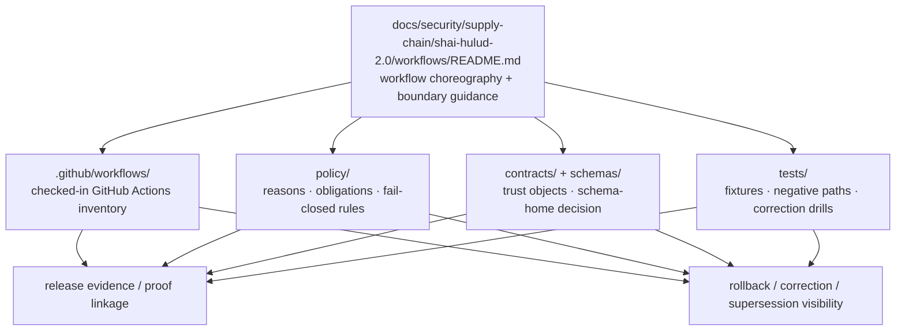

<!-- [KFM_META_BLOCK_V2]
doc_id: kfm://doc/<NEEDS-UUID>
title: Shai-Hulud 2.0 Workflows
type: standard
version: v1
status: draft
owners: @bartytime4life
created: <NEEDS VERIFICATION>
updated: <NEEDS VERIFICATION>
policy_label: <NEEDS VERIFICATION>
related: [../README.md, ../protections/README.md, ../indicators/README.md, ../../../../../.github/workflows/README.md, ../../../../../.github/CODEOWNERS, ../../../../../.github/PULL_REQUEST_TEMPLATE.md, ../../../../../contracts/README.md, ../../../../../schemas/README.md, ../../../../../policy/README.md, ../../../../../tests/README.md]
tags: [kfm, security, supply-chain, workflows, shai-hulud-2.0]
notes: [Owner is grounded from current public CODEOWNERS fallback for /docs/; current public inventory for this leaf is README-only; doc_id, created, updated, and policy_label still need repo-local verification.]
[/KFM_META_BLOCK_V2] -->

# Shai-Hulud 2.0 Workflows

Governed workflow-choreography surface for the `shai-hulud-2.0` supply-chain lane.

> [!IMPORTANT]
> **Status:** experimental · **Doc maturity:** draft  
> **Owners:** `@bartytime4life` *(current public `.github/CODEOWNERS` fallback for `/docs/`; verify if the checked-out branch narrows ownership)*  
> **Path:** `docs/security/supply-chain/shai-hulud-2.0/workflows/README.md`  
> 
> 
> 
> 
> 
>   
> **Quick jumps:** [Scope](#scope) · [Repo fit](#repo-fit) · [Inputs](#inputs) · [Exclusions](#exclusions) · [Current verified snapshot](#current-verified-snapshot) · [Directory tree](#directory-tree) · [Quickstart](#quickstart) · [Usage](#usage) · [Diagram](#diagram) · [Tables](#tables) · [Task list](#task-list--definition-of-done) · [FAQ](#faq) · [Appendix](#appendix)

> [!WARNING]
> Current public `main` confirms this leaf directory exists and currently contains `README.md` only. This file documents workflow meaning, handoff boundaries, and review expectations; it does **not** by itself prove checked-in GitHub Actions YAML, emitted SBOMs, live attestations, or merge-blocking enforcement.

## Scope

`workflows/` is the leaf README for **gate sequence**, **proof linkage**, **promotion handoff**, **rollback / correction choreography**, and **where workflow claims must hand off to executable repo surfaces**.

Use this file to answer three questions quickly:

1. What workflow-bearing meaning belongs in this leaf README instead of in sibling `protections/` or `indicators/` docs?
2. Which adjacent executable surfaces must be re-checked before workflow prose changes?
3. Which statements are safe to present as **CONFIRMED** on the current public tree, and which must stay **INFERRED**, **PROPOSED**, or **NEEDS VERIFICATION**?

In the local Shai-Hulud split:

- `protections/` explains **guardrails and intended controls**
- `workflows/` explains **how those controls are exercised, checked, promoted, rolled back, or corrected**
- `indicators/` explains **what measurable assurance looks like and how to interpret it**

### Truth posture used in this README

| Label | Meaning here |
|---|---|
| **CONFIRMED** | Visible in the current public repo tree or explicitly established by adjacent repo docs |
| **INFERRED** | Strongly suggested by the lane structure and nearby repo context, but not directly proven as checked-in executable behavior |
| **PROPOSED** | Recommended documentation shape, handoff, or growth path |
| **NEEDS VERIFICATION** | Load-bearing detail that should be checked against the real checked-out branch before merge |

## Repo fit

This README sits **below** the lane root and **beside** its sibling child docs. It should stay specific to workflow choreography while refusing to become a second home for YAML, policy logic, schemas, fixtures, or release artifacts.

| Relation | Link | Why it matters here |
|---|---|---|
| Upstream | [`../README.md`](../README.md) | Defines the Shai-Hulud 2.0 lane and the protections / workflows / indicators split. |
| Upstream | [`../../README.md`](../../README.md) | Broader supply-chain framing belongs there. |
| Upstream | [`../../../README.md`](../../../README.md) | Security subtree doctrine and documentation posture. |
| Upstream | [`../../../../README.md`](../../../../README.md) | `docs/` root role, exclusions, and documentation expectations. |
| Sibling | [`../protections/README.md`](../protections/README.md) | Put guardrail intent and control shape there, not here. |
| Sibling | [`../indicators/README.md`](../indicators/README.md) | Put measurable assurance and interpretation there, not here. |
| Adjacent executable surface | [`../../../../../.github/workflows/README.md`](../../../../../.github/workflows/README.md) | Current checked-in GitHub Actions inventory and workflow-lane caveats live there. |
| Adjacent review surface | [`../../../../../.github/PULL_REQUEST_TEMPLATE.md`](../../../../../.github/PULL_REQUEST_TEMPLATE.md) | PR guardrails define the review burden for trust-bearing changes. |
| Adjacent ownership surface | [`../../../../../.github/CODEOWNERS`](../../../../../.github/CODEOWNERS) | Owner fallback and review routing come from here. |
| Adjacent typed-object surface | [`../../../../../contracts/README.md`](../../../../../contracts/README.md) | Trust objects, release/correction objects, and runtime envelopes belong there. |
| Adjacent schema boundary | [`../../../../../schemas/README.md`](../../../../../schemas/README.md) | Documentary schema boundary and schema-home caution live there. |
| Adjacent policy surface | [`../../../../../policy/README.md`](../../../../../policy/README.md) | Deny-by-default rules, reasons, obligations, and policy fixtures belong there. |
| Adjacent verification surface | [`../../../../../tests/README.md`](../../../../../tests/README.md) | Fixtures, negative-path checks, correction drills, and verification families belong there. |

## Inputs

### Accepted inputs

Content that belongs here includes:

- workflow-choreography notes for **verify**, **gate**, **promote**, **reconcile**, **rollback**, and **correction**
- cross-links to the checked-in GitHub Actions inventory under `.github/workflows/`
- public-safe notes about digests, SBOMs, signatures, attestations, receipts, or proof linkage
- narrow documentation for how workflow claims interact with contracts, policy, tests, and release evidence
- lane-local cautions against overclaiming enforcement
- minimal examples that help a reviewer understand **what a workflow is supposed to prove**

### Input posture

A strong change in this leaf should make three things clearer, not blurrier:

1. **What is being proven**
2. **What can block progression**
3. **Which artifact or record carries the decision forward**

## Exclusions

| This does **not** belong here | Put it here instead |
|---|---|
| Checked-in GitHub Actions YAML as the canonical workflow inventory | [`../../../../../.github/workflows/README.md`](../../../../../.github/workflows/README.md) and the owning workflow files |
| Executable policy bundles, rule fixtures, reason/obligation vocabularies, or policy tests | [`../../../../../policy/README.md`](../../../../../policy/README.md) and owning policy/test surfaces |
| Canonical machine-readable trust objects or schema definitions | [`../../../../../contracts/README.md`](../../../../../contracts/README.md) and [`../../../../../schemas/README.md`](../../../../../schemas/README.md) |
| Runnable verification suites, invalid fixtures, correction drills, or regression harnesses | [`../../../../../tests/README.md`](../../../../../tests/README.md) |
| Emitted SBOMs, signatures, attestations, receipts, release manifests, or proof packs as ad hoc storage | Their governed artifact, release-evidence, or proof surface |
| Broad supply-chain doctrine | Parent lane and upstream security / supply-chain docs |
| Claims that enforcement is live when the visible repo state does not prove it | Keep the statement **PROPOSED** or **NEEDS VERIFICATION** until an executable surface proves it |

## Current verified snapshot

The current public `main` branch safely supports the following statements without widening them into stronger implementation claims.

| Surface | Status | Safe statement | Why it matters here |
|---|---|---|---|
| `docs/security/supply-chain/shai-hulud-2.0/workflows/` | **CONFIRMED** | Public `main` exposes `README.md` only in this leaf directory. | This leaf is currently documentation-only in the visible tree. |
| `docs/security/supply-chain/shai-hulud-2.0/` | **CONFIRMED** | The lane root exposes `protections/`, `workflows/`, and `indicators/`, with `samples/` and `signatures/` beneath `indicators/`. | This README should stay scoped to choreography rather than whole-lane doctrine. |
| `.github/workflows/README.md` | **CONFIRMED** | The current public workflow directory is also README-only and explicitly separates current inventory from historically observed workflow names. | Do not imply active checked-in GitHub Actions YAML without separate proof. |
| `contracts/README.md` + `schemas/README.md` | **CONFIRMED** / **NEEDS VERIFICATION** | Both current public lanes are README-only; schema-home authority is still unresolved. | Workflow prose must route to typed-object surfaces without inventing a second registry. |
| `policy/README.md` | **CONFIRMED** | Policy is framed as deny-by-default and execution-oriented, but mounted `.rego` bundles and runnable policy tests are not proven by current public tree evidence alone. | Keep executable enforcement claims bounded. |
| `tests/README.md` | **CONFIRMED** | The public test taxonomy includes contract, policy, e2e, reproducibility, and correction families. | Negative-path proof belongs there when it lands. |
| `.github/PULL_REQUEST_TEMPLATE.md` | **CONFIRMED** | PR guardrails explicitly require truth-path preservation, trust-membrane preservation, cite-or-abstain where relevant, fail-closed behavior where relevant, and same-change-set doc/test/runbook updates when behavior changes. | This README should stay aligned with actual review expectations. |
| `.github/CODEOWNERS` | **CONFIRMED** | Current public `CODEOWNERS` uses a global fallback and assigns `/docs/` to `@bartytime4life`. | The owner field here can be grounded without inventing a narrower lane rule. |

## Directory tree

### Current public leaf snapshot

```text
docs/security/supply-chain/shai-hulud-2.0/workflows/
└── README.md
```

### Current public lane context

```text
docs/security/supply-chain/shai-hulud-2.0/
├── README.md
├── protections/
│   └── README.md
├── workflows/
│   └── README.md
└── indicators/
    ├── README.md
    ├── samples/
    │   └── README.md
    └── signatures/
        └── README.md
```

> [!NOTE]
> The tree above is intentionally limited to what is visible on the current public branch. If the checked-out branch or a private remote differs, reconcile this section against the mounted repo before merge.

[Back to top](#shai-hulud-20-workflows)

## Quickstart

1. Re-read the parent lane before changing this leaf.
2. Re-check the current public workflow, ownership, contract, schema, policy, test, and PR-guardrail surfaces.
3. Search for lane-coupled trust objects and supply-chain terms before introducing new prose.
4. Keep every newly added statement explicit as **CONFIRMED**, **INFERRED**, **PROPOSED**, or **NEEDS VERIFICATION**.
5. Do not move executable logic, emitted artifacts, or secret material into this docs leaf.

```bash
# 1) Inspect the lane and its immediate parent
ls -la docs/security/supply-chain/shai-hulud-2.0
ls -la docs/security/supply-chain/shai-hulud-2.0/workflows

# 2) Read the local lane docs first
sed -n '1,240p' docs/security/supply-chain/shai-hulud-2.0/README.md
sed -n '1,240p' docs/security/supply-chain/shai-hulud-2.0/protections/README.md
sed -n '1,240p' docs/security/supply-chain/shai-hulud-2.0/workflows/README.md
sed -n '1,260p' docs/security/supply-chain/shai-hulud-2.0/indicators/README.md

# 3) Re-check adjacent executable and review surfaces
sed -n '1,240p' .github/workflows/README.md
sed -n '1,200p' .github/CODEOWNERS
sed -n '1,200p' .github/PULL_REQUEST_TEMPLATE.md
sed -n '1,260p' contracts/README.md
sed -n '1,220p' schemas/README.md
sed -n '1,280p' policy/README.md
sed -n '1,260p' tests/README.md

# 4) Inventory actual GitHub Actions files, if any exist on the checked-out branch
find .github/workflows -maxdepth 1 -type f \( -name '*.yml' -o -name '*.yaml' \) | sort

# 5) Search for lane-coupled trust objects and supply-chain terms
git grep -nE 'Shai-Hulud|sbom|attest|signature|cosign|digest|DecisionEnvelope|EvidenceBundle|RuntimeResponseEnvelope|CorrectionNotice|ReleaseManifest' -- docs .github policy contracts schemas tests 2>/dev/null || true
```

## Usage

Use this README when the work is about **workflow meaning**, **gate sequencing**, **proof linkage**, or **which adjacent surfaces must move together**.

> [!TIP]
> A workflow documentation change is incomplete if it silently shifts trust-bearing meaning without re-checking `.github/workflows`, `policy/`, `contracts/`, `schemas/`, `tests/`, and PR guardrails in the same review window.

| You need to… | Start here | Then re-check |
|---|---|---|
| document a gate sequence or workflow handoff | this README | `.github/workflows/README.md`, `policy/README.md`, `contracts/README.md`, `tests/README.md` |
| describe a fail-closed decision or obligation vocabulary | `policy/README.md` | this README only for choreography and linkage |
| define a trust object or payload shape | `contracts/README.md` and `schemas/README.md` | this README only for where the object is used in workflow prose |
| define fixtures, correction drills, or regression burden | `tests/README.md` | this README only for why the check matters in the lane |
| store emitted evidence or proof artifacts | governed release/proof surfaces | this README only for links and interpretation |
| change owner or review-routing expectations | `.github/CODEOWNERS` and `.github/PULL_REQUEST_TEMPLATE.md` | this README only for mirrored routing context |

### Workflow documentation rule of thumb

1. Name the **object under test**.
2. Name the **gate that can block progression**.
3. Name the **typed object or report that carries the decision**.
4. Route executable workflow files to `.github/workflows/`.
5. Route rule bodies to `policy/`, typed objects to `contracts/` / `schemas/`, and proof burden to `tests/`.
6. Keep rollback, correction, and supersession visible instead of burying them under “success” language.

<details>
<summary><strong>Historically observed public workflow names from <code>.github/workflows/README.md</code></strong></summary>

These names are history-derived, **not** current checked-in inventory on public `main`:

- `verify-contracts-and-policy.yml`
- `verify-docs.yml`
- `verify-runtime.yml`
- `verify-tests-and-reproducibility.yml`
- `release-evidence.yml`
- `promote-and-reconcile.yml`

Use them as reconstruction clues or naming context only after checking the real branch and workflow history.

</details>

## Diagram



[Back to top](#shai-hulud-20-workflows)

## Tables

### Workflow documentation handoff matrix

| Concern | Canonical home | What this leaf README should do | Main overclaim risk |
|---|---|---|---|
| Checked-in GitHub Actions YAML | `.github/workflows/` | Explain what a workflow is meant to prove and which adjacent surfaces it must honor | Pretending YAML exists under `docs/security/.../workflows/` |
| Allow / deny / obligation grammar | `policy/` | Describe where workflow prose must link to policy results | Free-text policy drift |
| Typed trust objects | `contracts/` + `schemas/` | Reference the objects that workflow stages should emit or consume | Growing a second contract registry in docs |
| Fixtures and drills | `tests/` | State the proof burden and negative-path expectations | Implying mounted tests exist when only doctrine is visible |
| Emitted proof artifacts | release-evidence / proof surfaces | Describe linkage and review meaning | Turning docs into ad hoc artifact storage |
| Owner and review routing | `.github/CODEOWNERS` + PR template | Mirror review touchpoints without inventing narrower rules | Unverified owner drift |

### Trust-object touchpoints

| Object | Why workflow docs mention it | Working home |
|---|---|---|
| `DecisionEnvelope` | Capture allow / deny / obligation results machine-readably | `contracts/` + `policy/` |
| `EvidenceBundle` | Explain what support a workflow-bearing claim should resolve to | `contracts/` / runtime evidence surfaces |
| `RuntimeResponseEnvelope` | Keep finite outcomes visible if workflow prose affects runtime trust behavior | `contracts/` / runtime surfaces |
| `ReleaseManifest` / `ReleaseProofPack` | Link workflow outcomes into promotion, rollback, and outward proof | release / proof surfaces |
| `CorrectionNotice` | Preserve rollback, supersession, withdrawal, or narrowing lineage | correction / review / release surfaces |

## Task list / definition of done

This leaf README is not done because it looks polished. It is done when the repo-facing meaning is accurate, bounded, and coupled to the right surfaces.

- [ ] Owner, `doc_id`, `created`, `updated`, and `policy_label` fields are resolved from repo-local evidence.
- [ ] The checked-out branch has been reconciled against the current public snapshot in this README.
- [ ] No section implies checked-in workflow YAML under this docs leaf.
- [ ] Any workflow names mentioned are either **current checked-in inventory**, **history-derived**, or **PROPOSED** — and labeled accordingly.
- [ ] Claims about allow / deny / obligation behavior route to `policy/` without duplicating rule bodies.
- [ ] Claims about trust objects route to `contracts/` / `schemas/` without duplicating schemas.
- [ ] Claims about fixtures, negative paths, and correction drills route to `tests/`.
- [ ] Any added example is clearly public-safe, non-authoritative, and not mistaken for emitted release evidence.
- [ ] Merge, promotion, rollback, and correction language matches the adjacent workflow, policy, contract, test, and PR-guardrail surfaces.

## FAQ

### Does this directory contain executable workflow YAML?

Not on the current public `main` branch. This leaf currently exposes `README.md` only.

### Where do checked-in GitHub Actions files belong?

In `.github/workflows/`, not in this docs leaf.

### Does this README prove merge-blocking enforcement?

No. It is a documentation surface. Enforcement must be proven by checked-in workflow files, policy bundles, tests, receipts, or release evidence.

### Can this lane store SBOMs, signatures, or attestations?

It can document **how to read** or **how to link to** public-safe examples, but it should not become the canonical storage location for emitted proof artifacts.

### Is `shai-hulud-2.0` a verified incident taxonomy or just a local lane name?

In this repo-ready draft, it is only verified as a named local documentation lane. Any deeper program or incident meaning still needs explicit verification.

### Why keep so many bounded labels?

Because the visible public tree currently proves more about **documentation boundaries** than about **mounted executable enforcement**. The labels prevent prose from outrunning evidence.

[Back to top](#shai-hulud-20-workflows)

## Appendix

<details>
<summary><strong>Review questions before merge</strong></summary>

Use these questions during review:

1. Does any new sentence imply executable workflow inventory that the checked-out branch does not actually contain?
2. Does any new sentence copy policy, schema, or test content instead of linking to the owning surface?
3. Does the change name what object is being proven, what blocks progression, and what carries the decision?
4. Does the change preserve rollback, correction, or supersession visibility?
5. Does any example risk being mistaken for live release evidence or secret-bearing material?

</details>

<details>
<summary><strong>Illustrative gate chain only — not current checked-in inventory</strong></summary>

```yaml
# Pseudocode only.
# Current public `main` does not prove this file exists.
name: shai-hulud-workflow-gate

on:
  pull_request:

jobs:
  trust-gate:
    runs-on: ubuntu-latest
    steps:
      - name: Validate contracts / fixtures
        run: <validator-entrypoint>
      - name: Verify digest / attestation subject
        run: <verification-entrypoint>
      - name: Evaluate deny-by-default policy
        run: <policy-entrypoint>
      - name: Retain proof linkage for review
        run: <proof-linkage-entrypoint>
      - name: Surface rollback / correction references
        run: <correction-entrypoint>
```

This snippet is here only to keep the choreography legible during review. Actual workflow files belong under `.github/workflows/`.

</details>
