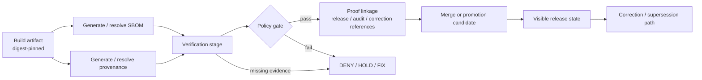

<!-- [KFM_META_BLOCK_V2]
doc_id: kfm://doc/<NEEDS-UUID>
title: Shai-Hulud 2.0 Workflows
type: standard
version: v1
status: draft
owners: <NEEDS VERIFICATION>
created: <NEEDS VERIFICATION>
updated: <NEEDS VERIFICATION>
policy_label: <NEEDS VERIFICATION>
related: [../../../../../.github/workflows/README.md, ../../../../../contracts/README.md, ../../../../../schemas/README.md, ../../../../../policy/README.md, ../../../../../tests/README.md]
tags: [kfm, security, supply-chain, workflows]
notes: [Path-level directory contents, owners, and live workflow filenames were not directly verified in the current session.]
[/KFM_META_BLOCK_V2] -->

# Shai-Hulud 2.0 Workflows

Governed supply-chain workflow guidance for artifact verification, attestation, and fail-closed merge behavior in KFM.

| Field | Value |
|---|---|
| Status | **Experimental** |
| Owners | **NEEDS VERIFICATION** |
| Badges |     |
| Quick jumps | [Scope](#scope) · [Repo fit](#repo-fit) · [Quickstart](#quickstart) · [Diagram](#diagram) · [Tables](#tables) · [Task list](#task-list) · [FAQ](#faq) |

> [!WARNING]
> **Current-session evidence limit:** this README was drafted from KFM doctrine and repo-grounded audit material, not from a mounted checkout of this exact directory. Exact workflow filenames, owners, and intra-directory structure that are not already visible elsewhere in the repo are marked **NEEDS VERIFICATION**.

> [!IMPORTANT]
> **Notation used in this file:** **CONFIRMED** = supported by current-session project evidence; **INFERRED** = conservative structural completion; **PROPOSED** = recommended design direction; **NEEDS VERIFICATION** = path-, owner-, or implementation-specific detail not directly confirmed.

## Scope

This directory documents the workflow layer for the `docs/security/supply-chain/shai-hulud-2.0/workflows/` surface.

In KFM terms, this is not “just CI.” It is the documentation surface for **fail-closed**, **machine-checkable**, **artifact-linked** workflow behavior: build evidence, attach or verify supply-chain proofs, evaluate policy, and block merges or promotion when trust requirements are not met.

**CONFIRMED doctrinal role**

- Workflows should reinforce the trust membrane rather than bypass it.
- Negative outcomes are first-class: deny, abstain, hold, quarantine, stale-visible, and correction-linked paths are valid system behavior.
- Contract-first progress outranks shell polish or implementation theater.
- Generated supply-chain evidence should remain linked forward into release, audit, and correction surfaces instead of becoming an isolated CI side channel.

## Repo fit

**Path:** `docs/security/supply-chain/shai-hulud-2.0/workflows/README.md`

| Direction | Surface | Role |
|---|---|---|
| Upstream | [`../../../../../contracts/README.md`](../../../../../contracts/README.md) | Contract and schema intent surface. |
| Upstream | [`../../../../../schemas/README.md`](../../../../../schemas/README.md) | Schema/contract documentation surface; avoid duplicate schema definitions here. |
| Upstream | [`../../../../../policy/README.md`](../../../../../policy/README.md) | Deny-by-default policy intent and decision-language context. |
| Upstream | [`../../../../../tests/README.md`](../../../../../tests/README.md) | Fixture and negative-path test expectations. |
| Upstream | [`../../../../../tools/README.md`](../../../../../tools/README.md) | Validator/tooling surface. |
| Upstream | [`../../../../../scripts/README.md`](../../../../../scripts/README.md) | Script entrypoints and supporting automation notes. |
| Adjacent / consuming | [`../../../../../.github/workflows/README.md`](../../../../../.github/workflows/README.md) | GitHub Actions workflow surface and status notes. |
| Adjacent / consuming | [`../../../../../.github/PULL_REQUEST_TEMPLATE.md`](../../../../../.github/PULL_REQUEST_TEMPLATE.md) | Review-facing trust checklist and proof expectations. |
| Downstream | `<workflow-yaml entrypoints in this directory>` | **NEEDS VERIFICATION** — live filenames were not directly inspected. |
| Downstream | `<release proof-pack / attestation / audit surfaces>` | **NEEDS VERIFICATION** — final storage and handoff points were not directly inspected. |

### Repo-fit note

This README is intended to sit between the **canonical contract/policy surfaces** and the **operational workflow surface**. It should explain how workflow stages consume shared contracts and vocabularies, and how they emit reviewable proof instead of best-effort success claims.

## Inputs

### Accepted inputs

This directory should accept or reference workflow-facing material such as:

- **CONFIRMED / INFERRED:** artifact digests, SBOM references, provenance or attestation references, policy decision outputs, proof-pack references, and audit linkage identifiers.
- **PROPOSED:** validator entrypoints, workflow-stage notes, reusable workflow conventions, merge-gate expectations, and failure-mode documentation.
- **NEEDS VERIFICATION:** exact local workflow YAML names, reusable workflow structure, and any path-local helper assets.

### Input posture

A workflow in this directory should be able to answer three questions quickly:

1. What artifact is under test?
2. What proof must exist before trust is granted?
3. What artifact survives as evidence of the decision?

## Exclusions

This directory is **not** the source of truth for:

- Canonical JSON Schemas or contract families — keep those in the contract/schema surface, not here.
- Policy vocabularies as free-floating copies — shared reason / obligation / reviewer-role vocabularies should live in one canonical surface (**exact path NEEDS VERIFICATION**).
- Generated SBOMs, attestations, signatures, or other build outputs — reference them; do not archive them here as authoritative artifacts.
- Secrets, signing keys, tokens, or environment-specific credentials.
- Runtime API behavior documentation — this directory describes workflow control, not the full governed runtime surface.
- Release manifests or correction notices as their canonical storage location unless the repo explicitly chooses this docs tree as a mirrored reference (**NEEDS VERIFICATION**).

## Directory tree

**Expected shape only — NEEDS VERIFICATION**

```text
docs/security/supply-chain/shai-hulud-2.0/workflows/
├── README.md
├── *.yml / *.yaml                 # workflow entrypoints (NEEDS VERIFICATION)
├── reusable/                      # shared workflow logic (NEEDS VERIFICATION)
├── examples/ or fixtures/ links   # local references only; canonical fixtures may live elsewhere
└── notes/ or runbooks/            # optional support docs (NEEDS VERIFICATION)
```

> [!NOTE]
> Until the mounted repo tree is inspected, treat the tree above as a **PROPOSED documentation scaffold**, not an asserted inventory.

## Quickstart

1. Verify the live contents of this directory and update placeholders in this README.
2. Confirm the canonical contract surface and policy-vocabulary surface before wiring any workflow.
3. Ensure the workflow fails closed on invalid artifacts, missing citations, invalid fixtures, or unresolved policy decisions.
4. Prove one real path end to end before broadening the workflow pack: build → verify → policy gate → proof linkage → merge/promotion outcome.
5. Record every workflow outcome in a way that can be tied back to a release or correction trail.

### Illustrative local checks

```bash
# Illustrative only — align to mounted repo scripts and versions before commit
IMAGE="${IMAGE:?set IMAGE to a pinned digest or image ref}"

# SBOM
syft "$IMAGE" -o cyclonedx-json > sbom.cdx.json

# Signature / provenance verification
cosign verify "$IMAGE"
cosign verify-attestation \
  --type https://slsa.dev/provenance \
  --output-file slsa.att.json \
  "$IMAGE"

# Policy gate
conftest test --policy <policy-dir-needs-verification> slsa.att.json sbom.cdx.json
```

### Illustrative workflow shape

```yaml
# Illustrative only — verify file names, triggers, and tool setup against the mounted repo
name: supply-chain-gate

on:
  pull_request:

jobs:
  gate:
    runs-on: ubuntu-latest
    steps:
      - uses: actions/checkout@v4
      - name: Validate contracts and fixtures
        run: <validator-entrypoint-needs-verification>
      - name: Verify attestations
        run: <attestation-verification-needs-verification>
      - name: Run policy gate
        run: <policy-gate-needs-verification>
```

[Back to top](#shai-hulud-20-workflows)

## Usage

Use this directory to document how workflow stages behave, not to silently redefine the canonical security model.

### 1. Build and pin

Document how an artifact becomes addressable by **digest**, not just by mutable tag.

### 2. Attach or resolve proof material

Document how SBOM, provenance, attestation, or equivalent proof material is attached or retrieved for evaluation.

### 3. Verify before trust

Document the verification step explicitly. “Built” is not the same as “trusted.”

### 4. Evaluate policy

Document the rule set that can block progression. This is where deny-by-default becomes operational.

### 5. Emit proof linkage

Document how the workflow links forward into a release proof-pack, correction lineage, audit trail, or review artifact.

### 6. Fail closed

Document what happens on missing proof, failed verification, failed fixture, missing citations, or unresolved policy vocabulary.

> [!TIP]
> A workflow doc in KFM is stronger when it explains **what object is being proven**, **what failure blocks progression**, and **what artifact proves the decision**.

## Diagram



[Back to top](#shai-hulud-20-workflows)

## Tables

### Workflow matrix

| Workflow concern | Minimum expectation | Typical proof object or linkage | Status in current evidence |
|---|---|---|---|
| Artifact identity | Digest-pinned build input or output | Digest / manifest reference | **PROPOSED** |
| SBOM handling | SBOM generated or resolved before trust | SBOM reference / attached artifact | **PROPOSED** |
| Provenance / attestation | Attestation verified before merge or promotion | Provenance predicate / attestation reference | **PROPOSED** |
| Policy gate | Fail-closed decision based on shared grammar | Decision artifact / machine-readable validator report | **PROPOSED** |
| Contract / fixture validation | Valid + invalid examples enforced | Validator report / CI check | **CONFIRMED as doctrinal need; live workflow NEEDS VERIFICATION** |
| Runtime trust alignment | Workflow outputs do not contradict finite runtime outcomes | Runtime-facing contract alignment | **CONFIRMED as doctrinal need** |
| Release linkage | Workflow result feeds proof-pack / release evidence | Release manifest / proof-pack reference | **PROPOSED** |
| Correction linkage | Supersession or withdrawal stays visible | Correction notice / replacement linkage | **PROPOSED** |

### Contract and artifact touchpoints

| Touchpoint | Why workflows care | Canonical home |
|---|---|---|
| `DecisionEnvelope` | Machine-readable allow / deny / obligation result | `contracts/` + policy surface |
| `EvidenceBundle` | Inspectability anchor for evidence-linked review and drill-through | `contracts/` / runtime contract surface |
| `RuntimeResponseEnvelope` | Finite outcomes and cite-or-abstain semantics | `contracts/` / runtime contract surface |
| `ReleaseManifest` / `ReleaseProofPack` | Promotion, rollback, and release evidence linkage | release/control-plane surface |
| `CorrectionNotice` | Visible supersession, withdrawal, narrowing, or reissue lineage | correction/control-plane surface |
| Reason / obligation / reviewer-role vocabularies | Prevent free-text policy drift | **NEEDS VERIFICATION** — shared canonical vocab home must be confirmed |
| Valid / invalid fixtures | Prove accept + reject behavior | `tests/` surface; exact local mirror **NEEDS VERIFICATION** |

## Task list

A workflow pack in this directory is not “done” because YAML exists. It is done when the following are all true:

- [ ] Exact workflow filenames in this directory have been verified against the mounted repo.
- [ ] Canonical schema home and canonical policy-vocabulary home are linked without duplication.
- [ ] A merge-blocking or promotion-blocking path exists and fails closed.
- [ ] Valid and invalid fixtures are wired into the workflow or a linked validator.
- [ ] Artifact verification is explicit, not implied.
- [ ] Policy results use stable shared vocabularies, not free-text drift.
- [ ] One proof object or proof linkage is retained for review.
- [ ] Documentation matches live workflow behavior.
- [ ] Negative-path behavior is documented: missing proof, failed proof, denied policy, stale artifact, and correction handoff.
- [ ] Owners, dates, and policy label placeholders in this README are resolved.

## FAQ

### Is this directory the canonical home for contract schemas?

No. This README assumes the canonical contract surface lives elsewhere in the repo and should be referenced here rather than copied.

### Are these workflows confirmed to be live right now?

No. Current-session repo-grounded evidence supports the existence of workflow-related documentation surfaces, but it does **not** prove active merge-gate YAML files in this exact directory.

### Why is this README so explicit about fail-closed behavior?

Because KFM treats workflow enforcement as part of the trust model, not as optional CI convenience.

### Why are there so many `NEEDS VERIFICATION` markers?

Because the mounted evidence for this task was doctrine-heavy and repo-path-light. Path-level precision that is not directly visible should stay visibly unresolved until the repo is inspected.

### Is `shai-hulud-2.0` a verified product meaning or just a path label?

In this session, it is only verified as the requested documentation path. Any expanded semantic meaning is **NEEDS VERIFICATION**.

[Back to top](#shai-hulud-20-workflows)

## Appendix

<details>
<summary><strong>Starter artifact expectations for this workflow surface</strong></summary>

This README is strongest when the live directory eventually documents, or links to, a small but real workflow chain:

1. contract/fixture validator
2. artifact proof generation or resolution
3. attestation verification
4. policy gate
5. proof-pack / release linkage
6. correction-aware handoff

A minimal workflow note set usually needs to answer:

- What is the artifact under test?
- What digest or immutable identifier anchors it?
- What proof material must exist?
- What validator fails the build?
- What policy decision blocks progression?
- What proof object survives after success?
- What visible lineage exists after correction or supersession?

</details>

<details>
<summary><strong>Review checklist for the next edit pass</strong></summary>

- Replace placeholder owners, dates, and policy label.
- Replace the directory tree with the mounted file inventory.
- Confirm whether shared vocabularies live under `policy/`, `contracts/`, or another canonical surface.
- Confirm whether this directory contains entrypoint workflows, reusable workflows, or both.
- Link to the actual validator command, not an illustrative placeholder.
- Add any repo-native examples already present in mounted scripts or workflow YAML.
- Remove any section that becomes redundant once the live workflow inventory is visible.

</details>
