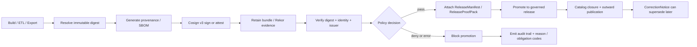

<!-- [KFM_META_BLOCK_V2]
doc_id: kfm://doc/<REVIEW-REQUIRED-UUID>
title: Sigstore / Cosign v3
type: standard
version: v1
status: draft
owners: @bartytime4life
created: <REVIEW-REQUIRED-YYYY-MM-DD>
updated: 2026-03-30
policy_label: <REVIEW-REQUIRED-POLICY-LABEL>
related: [../../README.md, ../README.md, ../reference-repos/README.md, ../../../../.github/workflows/README.md, ../../../../policy/README.md, ../../../../contracts/README.md, ../../../../schemas/README.md, ../../../../tests/README.md]
tags: [kfm, security, supply-chain, sigstore, cosign, attestations]
notes: [prior file content was scaffold-only, workflow YAML presence still needs verification, examples below are intentionally labeled by truth posture, version-sensitive Sigstore examples were rechecked against official docs]
[/KFM_META_BLOCK_V2] -->

# Sigstore / Cosign v3

Digest-first signing, verification, and attestation guidance for KFM release-bearing artifacts.

> **Status:** experimental  
> **Owners:** @bartytime4life  
> **Path:** `docs/security/supply-chain/sigstore-cosign-v3/README.md`  
> **Repo fit:** intended child lane of [`../README.md`](../README.md) and [`../../README.md`](../../README.md); adjacent to [`../reference-repos/README.md`](../reference-repos/README.md); operationally coupled to [`../../../../.github/workflows/README.md`](../../../../.github/workflows/README.md), [`../../../../policy/README.md`](../../../../policy/README.md), [`../../../../contracts/README.md`](../../../../contracts/README.md), [`../../../../schemas/README.md`](../../../../schemas/README.md), and [`../../../../tests/README.md`](../../../../tests/README.md).  
>      
> **Quick jumps:** [Scope](#scope) · [Repo fit](#repo-fit) · [Accepted inputs](#accepted-inputs) · [Exclusions](#exclusions) · [Directory tree](#directory-tree) · [Quickstart](#quickstart) · [Usage](#usage) · [Diagram](#diagram) · [Control matrix](#control-matrix) · [Task list](#task-list--definition-of-done) · [FAQ](#faq) · [Appendix](#appendix)

> [!IMPORTANT]
> This lane is **doctrine-led** and **verification-aware**.
>
> - **CONFIRMED:** KFM doctrine requires a trust membrane, authoritative-versus-derived separation, fail-closed behavior, promotion as a governed state change, and visible correction lineage.
> - **CONFIRMED:** repo-grounded summaries report `contracts/`, `schemas/`, `policy/`, and `tests` as documentation surfaces, with CODEOWNERS and PR scaffolding present.
> - **UNKNOWN:** this session did **not** expose a mounted repo checkout, live workflow YAML, checked-in Rego bundle, fixture-backed Sigstore verification suite, or a published `ReleaseProofPack` example for this lane.
> - **PROPOSED:** the commands, YAML, and artifact matrices below are starter patterns until the mounted repo proves a stronger implementation reality.

## Scope

This README defines the KFM lane for **Sigstore / Cosign v3** as a release-integrity control surface, not as a detached tooling note.

In KFM terms, this lane exists to keep release-bearing artifacts tied to:

- immutable identity
- inspectable provenance
- fail-closed verification
- auditable promotion
- visible correction lineage

This file is the right place for guidance on:

- digest-first artifact references
- keyless signing and verification patterns
- provenance, SBOM, and related attestation expectations
- CI or promotion-gate verification rules
- bundle retention and proof-pack linkage
- KFM-specific negative-path behavior for missing, stale, or unverifiable supply-chain evidence

## Repo fit

| Item | Value |
| --- | --- |
| Path | `docs/security/supply-chain/sigstore-cosign-v3/README.md` |
| Role | Narrow KFM lane doc for signing, verification, attestations, bundles, and release-integrity evidence |
| Upstream | [`../../README.md`](../../README.md), [`../README.md`](../README.md) |
| Adjacent | [`../reference-repos/README.md`](../reference-repos/README.md) |
| Operational neighbors | [`../../../../.github/workflows/README.md`](../../../../.github/workflows/README.md), [`../../../../policy/README.md`](../../../../policy/README.md), [`../../../../contracts/README.md`](../../../../contracts/README.md), [`../../../../schemas/README.md`](../../../../schemas/README.md), [`../../../../tests/README.md`](../../../../tests/README.md) |
| Expected downstream changes when this lane becomes executable | workflow YAML, policy registries, fixtures, tests, release evidence, and runbooks |

### Current posture snapshot

| Area | Posture | Notes |
| --- | --- | --- |
| KFM trust membrane / fail-closed doctrine | **CONFIRMED** | Strongly established in the March 2026 corpus. |
| Release proof objects such as `EvidenceBundle`, `RuntimeResponseEnvelope`, `CorrectionNotice`, and `ReleaseProofPack` | **CONFIRMED** | Defined as contract families in the canonical KFM architecture docs. |
| `contracts/`, `schemas/`, `policy/`, and `tests` README-like surfaces | **CONFIRMED** | Reported by repo-grounded review artifacts. |
| CODEOWNERS and PR scaffolding | **CONFIRMED** | Reported by repo-grounded review artifacts. |
| Live Sigstore / Cosign workflow YAML | **UNKNOWN** | Repo-grounded summaries explicitly keep workflow enforcement unproven. |
| Checked-in Rego bundles, fixture-backed signing tests, and published proof packs | **UNKNOWN** | Not directly reverified in a mounted checkout during this revision. |
| Exact adjacency and current contents of this lane’s parent README files | **NEEDS VERIFICATION** | The target paths are known from task context, but the mounted repo tree was not available here. |

## Accepted inputs

Content that belongs here:

- Sigstore / Cosign v3 usage patterns for **release-bearing artifacts**
- digest-first naming and verification guidance
- identity / issuer pinning rules for keyless verification
- provenance, SBOM, and bundle retention expectations
- CI gate patterns that are explicitly fail-closed
- release-proof and audit-link expectations for signed artifacts
- KFM-specific mappings from supply-chain failures into reason codes, obligation codes, and review paths

## Exclusions

Content that does **not** belong here:

- **Generic security doctrine** — keep that in [`../../README.md`](../../README.md).
- **Broad supply-chain indexing across multiple tools/vendors** — keep that in [`../README.md`](../README.md) and [`../reference-repos/README.md`](../reference-repos/README.md).
- **Machine-checkable policy grammar** — keep canonical policy surfaces in [`../../../../policy/README.md`](../../../../policy/README.md).
- **Canonical schema definitions** — keep them in [`../../../../contracts/README.md`](../../../../contracts/README.md) and [`../../../../schemas/README.md`](../../../../schemas/README.md).
- **Verification fixtures and runnable tests** — keep them in [`../../../../tests/README.md`](../../../../tests/README.md).
- **Repository-wide GitHub automation inventory** — keep that in [`../../../../.github/workflows/README.md`](../../../../.github/workflows/README.md).
- **Long-lived private key material, registry credentials, or secret values** — these belong in managed secret surfaces and runbooks, not in docs or example YAML.

## Directory tree

> [!NOTE]
> The tree below shows the **intended placement and adjacent paths** from the task context. Exact mounted path presence remains **NEEDS VERIFICATION** in this session.

```text
docs/
└── security/
    ├── README.md
    └── supply-chain/
        ├── README.md
        ├── reference-repos/
        │   └── README.md
        └── sigstore-cosign-v3/
            └── README.md

.github/
└── workflows/
    └── README.md

policy/
└── README.md

contracts/
└── README.md

schemas/
└── README.md

tests/
└── README.md
```

## Quickstart

### 1) Re-check the lane before making claims

All commands below are inspection-first.

```bash
sed -n '1,220p' docs/security/README.md
sed -n '1,220p' docs/security/supply-chain/README.md
sed -n '1,260p' docs/security/supply-chain/sigstore-cosign-v3/README.md
sed -n '1,220p' .github/workflows/README.md
sed -n '1,220p' policy/README.md
sed -n '1,220p' contracts/README.md
sed -n '1,220p' schemas/README.md
sed -n '1,220p' tests/README.md
```

### 2) Re-check executable surfaces

```bash
git ls-files '.github/workflows/*'
git grep -nE 'sigstore|cosign|rekor|fulcio|attest|attestation|sbom|provenance'
git grep -nE 'decision_envelope|reason_codes|obligation_codes|release_manifest|evidence_bundle'
git grep -nE 'sigstore/cosign-installer@|cosign sign-blob|cosign verify-blob'
```

### 3) Touch the full stream, not just the prose

If this README moves from documentation toward enforcement, review these surfaces in the same change stream:

```bash
git diff -- docs/security/ .github/workflows/ policy/ contracts/ schemas/ tests/
```

> [!WARNING]
> In KFM, a polished README without policy, fixtures, tests, and release evidence is not a completed control. It is documentation debt with better typography.

[Back to top](#sigstore--cosign-v3)

## Usage

### Core working rules

1. **Prefer immutable digests over mutable tags or filenames.**  
   Tags and filenames are convenience handles. Digests are trust anchors.

2. **Verification is the gate, not signing alone.**  
   KFM gets value when a governed surface verifies identity, issuer, digest, and evidence completeness before merge, promotion, or publish.

3. **Prefer keyless OIDC flows where the platform supports them.**  
   Exceptions may exist, but they should be explicit, review-bearing, and documented with blast radius and rotation posture.

4. **Treat bundles and attestations as release evidence, not side trivia.**  
   Signatures, bundles, provenance, SBOMs, and related refs should travel with a `ReleaseManifest` / `ReleaseProofPack` rather than living only in transient CI logs.

5. **Do not sign everything indiscriminately.**  
   This lane is for **release-bearing artifacts** and the proof objects that make those artifacts governable.

6. **Keep negative paths visible.**  
   Missing signature, wrong identity, wrong issuer, missing digest, missing bundle, stale evidence, or unverifiable provenance should fail closed and leave an audit trail.

### Digest-first operating model

| Property | KFM reading | Practical consequence |
| --- | --- | --- |
| **Authenticity** | Who produced this artifact? | Pin certificate identity and OIDC issuer during verification. |
| **Integrity** | Are these the exact bits that were reviewed or promoted? | Sign and verify by digest or by blob bundle, never by mutable handle alone. |
| **Auditability** | Can later review reconstruct the trust story? | Retain bundles, attestations, decision refs, and release-link evidence. |
| **Correctability** | Can KFM replace or withdraw an artifact without erasing history? | Carry digest refs into `CorrectionNotice` and release lineage objects. |

### Release-bearing artifact classes

The matrix below is a **PROPOSED default**, not a claim of mounted enforcement.

| Artifact class | Preferred trust surface | Sign / attest | Verify before | Keep with release |
| --- | --- | --- | --- | --- |
| OCI image | Digest-addressed image ref | Sign + attest | merge gate, promotion gate, deploy gate | provenance, SBOM, bundle evidence |
| ORAS/OCI-hosted dataset package | Digest-addressed registry ref | Sign + attest | promotion, publish, catalog closure | provenance, SBOM, bundle evidence |
| Blob artifact (`.pmtiles`, `.mbtiles`, `.tif`, `.parquet`, `.zip`, proof pack) | `sign-blob` bundle or OCI wrapper | Sign blob and retain bundle | promotion, publish, catalog closure | bundle, checksum manifest, provenance refs |
| STAC / DCAT / PROV closure | Hashed metadata object or release-proof attachment | Sign directly or reference signed release proof | publication assembly | digest refs, release linkage |
| `ReleaseManifest` / `ReleaseProofPack` | Canonical proof object | Sign or embed signed refs | promotion and rollback drills | decision refs, bundle refs, correction posture |

### KFM object hooks for this lane

| KFM object family | Supply-chain hook | Why it matters |
| --- | --- | --- |
| `DatasetVersion` | stable version identity + artifact digests | Prevents hand-wavy “latest file” reasoning. |
| `CatalogClosure` | STAC / DCAT / PROV refs linked to signed outputs | Keeps outward discovery tied to real release state. |
| `DecisionEnvelope` | reason codes / obligation codes for pass, deny, or escalate | Makes trust decisions machine-readable. |
| `EvidenceBundle` | bundle refs, provenance summary, rights/sensitivity state | Lets downstream surfaces explain why an artifact is trusted. |
| `ReleaseManifest` / `ReleaseProofPack` | signatures, attestations, SBOM refs, bundle evidence, rollback posture | Turns promotion into a governed state transition. |
| `CorrectionNotice` | replaced digest refs and affected surface classes | Preserves visible lineage after supersession or withdrawal. |

### Sigstore / Cosign v3 versus adjacent GitHub-native attestations

| Surface | Best use here | KFM reading |
| --- | --- | --- |
| **Sigstore / Cosign v3** | primary signing / verification surface for OCI-style artifacts and explicit blob-signing workflows | Primary topic of this README |
| **GitHub Artifact Attestations** | GitHub-native provenance / build attestation within Actions-centered workflows | Acceptable when the verification path is explicit and bound into release evidence |
| **Both together** | possible, but one path must remain authoritative in promotion logic | Avoid duplicate trust surfaces that drift |

## Diagram



[Back to top](#sigstore--cosign-v3)

## Control matrix

| KFM concern | Supply-chain consequence |
| --- | --- |
| Trust membrane | Artifact trust is decided in governed CI / promotion / release surfaces, not by ad hoc client belief. |
| Cite-or-abstain / fail-closed | If signing or attestation evidence is missing, promotion blocks or the release remains visibly incomplete. |
| Authoritative vs derived | Signed artifacts and their proof objects outrank screenshots, dashboards, or prose summaries. |
| Promotion as governed state change | Release is assembled with proof objects, not merely copied into a new directory or registry tag. |
| Correction lineage | A corrected build emits new evidence and lineage; it does not silently overwrite the trust record. |
| Auditability | Verification outcomes should join cleanly to decision traces, release refs, and correction notices. |

### Failure classes worth keeping explicit

| Failure class | Expected KFM outcome |
| --- | --- |
| Digest missing or tag-only reference | **DENY** or quarantine until the exact subject is named immutably |
| Signature present but identity / issuer mismatch | **DENY** with explicit reason code |
| Attestation missing for a required artifact class | **DENY** or keep the release visibly incomplete |
| Bundle / offline-verification material missing | **ERROR** or block promotion where offline proof is part of release requirements |
| Release docs / proof-pack linkage incomplete | `release.docs_gate_failed` or equivalent review-bearing failure |
| Artifact replaced after publication | emit `CorrectionNotice` / supersession lineage rather than silent mutation |

## Task list & definition of done

### Task list

- [ ] This file no longer reads like a scaffold.
- [ ] Every workflow example is labeled **CONFIRMED**, **PROPOSED**, **UNKNOWN**, or **NEEDS VERIFICATION** where appropriate.
- [ ] Examples use **digest-first** references rather than tag-only or filename-only references.
- [ ] Any `cosign-installer` example uses a release line compatible with **Cosign v3**.
- [ ] Verification examples pin both **certificate identity** and **OIDC issuer**.
- [ ] Blob-signing examples retain a **bundle** for later verification.
- [ ] Adjacent surfaces are reviewed when changed: workflows, policy, contracts, schemas, tests, and release evidence.
- [ ] No sentence claims live enforcement unless checked-in YAML and verification artifacts prove it.
- [ ] Rollback / correction consequences remain visible.

### Definition of done

This lane is in a healthy state when:

1. the README is specific enough to guide review,
2. version-sensitive examples are current enough not to mislead,
3. policy and test surfaces can execute the lane’s claims,
4. release evidence can reconstruct what was signed, attested, verified, and promoted,
5. the negative path is as explicit as the happy path.

## FAQ

### Why digest-first instead of tag-first or filename-first?

Tags and filenames can move. Digests identify the exact artifact that was built and verified.

### Why not stop at checksums?

A checksum proves integrity of bytes. It does **not** prove who produced them, how they were produced, or whether the build identity is allowed.

### When should KFM use blob signing versus OCI-hosted signing?

Use whichever surface matches the artifact’s actual release path. OCI-hosted artifacts are naturally verified by digest in-registry. Standalone files should either be wrapped in OCI or signed as blobs with retained verification bundles.

### Are GitHub Artifact Attestations enough by themselves?

They can be strong evidence in GitHub-centered workflows, but KFM still needs an explicit verification path, release evidence linkage, and fail-closed policy behavior.

### Does signing prove an artifact is safe?

No. It proves something about identity and provenance. Policy, review, SBOM analysis, vulnerability response, release discipline, and correction lineage still matter.

### What about offline verification?

Treat bundle material as part of release evidence. If the review context is disconnected, the `ReleaseProofPack` should still retain enough material to verify later without assuming permanent live network access.

## Appendix

<details>
<summary><strong>Illustrative snippets (PROPOSED / NEEDS VERIFICATION)</strong></summary>

These snippets are **starter patterns**, not confirmed repo implementation.

### A. Keyless Cosign v3 shape for OCI-style artifacts

```bash
ARTIFACT="ghcr.io/OWNER/REPO@sha256:<digest>"

cosign sign "$ARTIFACT"

cosign verify "$ARTIFACT" \
  --certificate-identity="<AUTHORIZED-WORKFLOW-IDENTITY>" \
  --certificate-oidc-issuer="https://token.actions.githubusercontent.com"
```

Replace `<AUTHORIZED-WORKFLOW-IDENTITY>` with the exact workflow identity you actually authorize.

### B. Keyless blob-signing shape for standalone artifacts

```bash
FILE="dist/release-proof-pack.tar.zst"

cosign sign-blob "$FILE" \
  --bundle "$FILE.sigstore.json"

cosign verify-blob "$FILE" \
  --bundle "$FILE.sigstore.json" \
  --certificate-identity="<AUTHORIZED-WORKFLOW-IDENTITY>" \
  --certificate-oidc-issuer="https://token.actions.githubusercontent.com"
```

Keep the bundle with the release-bearing file or with the `ReleaseProofPack`.

### C. Minimal GitHub Actions shape for Cosign v3

```yaml
name: build-sign-verify

on:
  push:
    branches: [main]

permissions:
  contents: read
  id-token: write
  packages: write

jobs:
  artifact:
    runs-on: ubuntu-latest
    steps:
      - uses: actions/checkout@v4

      - uses: sigstore/cosign-installer@v4

      - uses: docker/setup-buildx-action@v3

      - uses: docker/build-push-action@v6
        id: push
        with:
          push: true
          tags: ghcr.io/${{ github.repository }}:${{ github.sha }}

      - name: Sign by digest
        env:
          IMAGE: ghcr.io/${{ github.repository }}@${{ steps.push.outputs.digest }}
        run: cosign sign "$IMAGE"

      - name: Verify by digest
        env:
          IMAGE: ghcr.io/${{ github.repository }}@${{ steps.push.outputs.digest }}
        run: |
          cosign verify "$IMAGE" \
            --certificate-identity="<AUTHORIZED-WORKFLOW-IDENTITY>" \
            --certificate-oidc-issuer="https://token.actions.githubusercontent.com"
```

### D. Review worksheet

```text
[ ] Which artifact is authoritative for this release?
[ ] Is the subject named by digest?
[ ] What identity is allowed to sign or attest it?
[ ] What issuer is allowed?
[ ] Where is verification enforced?
[ ] Which reason / obligation code is emitted on failure?
[ ] Which release object carries bundle / provenance / SBOM refs?
[ ] What is the correction / rollback story if the artifact must be replaced?
```

</details>

[Back to top](#sigstore--cosign-v3)
