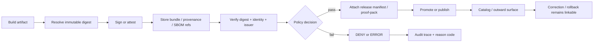

<!-- [KFM_META_BLOCK_V2]
doc_id: kfm://doc/<REVIEW-REQUIRED-UUID>
title: Sigstore / Cosign v3
type: standard
version: v1
status: draft
owners: @bartytime4life
created: <REVIEW-REQUIRED-YYYY-MM-DD>
updated: 2026-03-25
policy_label: <REVIEW-REQUIRED-POLICY-LABEL>
related: [../../README.md, ../README.md, ../reference-repos/README.md, ../../../../.github/workflows/README.md, ../../../../policy/README.md, ../../../../contracts/README.md, ../../../../schemas/README.md, ../../../../tests/README.md]
tags: [kfm, security, supply-chain, sigstore, cosign, attestations]
notes: [prior file content was scaffold-only, workflow YAML presence still needs verification, examples below are intentionally labeled by truth posture]
[/KFM_META_BLOCK_V2] -->

# Sigstore / Cosign v3

Digest-first signing, verification, and attestation guidance for KFM release-bearing artifacts.

**Status:** experimental  
**Owners:** @bartytime4life  
**Path:** `docs/security/supply-chain/sigstore-cosign-v3/README.md`  
**Repo fit:** child lane of [`../README.md`](../README.md) and [`../../README.md`](../../README.md); adjacent to [`../reference-repos/README.md`](../reference-repos/README.md); operationally coupled to [`../../../../.github/workflows/README.md`](../../../../.github/workflows/README.md), [`../../../../policy/README.md`](../../../../policy/README.md), [`../../../../contracts/README.md`](../../../../contracts/README.md), [`../../../../schemas/README.md`](../../../../schemas/README.md), and [`../../../../tests/README.md`](../../../../tests/README.md).


**Quick jumps:** [Scope](#scope) · [Repo fit](#repo-fit) · [Accepted inputs](#accepted-inputs) · [Exclusions](#exclusions) · [Directory tree](#directory-tree) · [Quickstart](#quickstart) · [Usage](#usage) · [Control matrix](#control-matrix) · [Diagram](#diagram) · [Task list](#task-list--definition-of-done) · [FAQ](#faq) · [Appendix](#appendix)

> [!WARNING]
> **CONFIRMED:** this path exists, the broader security docs point here for signing / attestation / digest / provenance guidance, and the prior file content was scaffold-only.  
> **UNKNOWN:** a checked-in Sigstore / Cosign enforcement workflow, live policy bundle, fixture-backed verification suite, and exact release-proof wiring were **not** proven by the public tree used for this revision.  
> **PROPOSED:** all YAML, command, and gate patterns below are starter patterns unless and until the mounted repo confirms otherwise.

## Scope

This README defines the KFM lane for **Sigstore / Cosign v3** as a supply-chain control surface, not as a detached tooling note.

In KFM terms, this lane exists to keep release-bearing artifacts tied to:

- immutable identity
- inspectable provenance
- fail-closed verification
- auditable promotion
- visible correction lineage

This file is the right place for guidance on:

- digest-first artifact references
- keyless signing and verification patterns
- provenance, SBOM, and related attestation expectations
- CI or promotion-gate verification rules
- bundle retention and proof-pack linkage
- KFM-specific negative-path behavior for missing, stale, or unverifiable supply-chain evidence

## Repo fit

| Item | Value |
| --- | --- |
| Path | `docs/security/supply-chain/sigstore-cosign-v3/README.md` |
| Role | Narrow KFM lane doc for signing, verification, attestations, and release-integrity evidence |
| Upstream | [`../../README.md`](../../README.md), [`../README.md`](../README.md) |
| Adjacent | [`../reference-repos/README.md`](../reference-repos/README.md) |
| Operational neighbors | [`../../../../.github/workflows/README.md`](../../../../.github/workflows/README.md), [`../../../../policy/README.md`](../../../../policy/README.md), [`../../../../contracts/README.md`](../../../../contracts/README.md), [`../../../../schemas/README.md`](../../../../schemas/README.md), [`../../../../tests/README.md`](../../../../tests/README.md) |
| Expected downstream changes when this lane becomes executable | workflow YAML, policy vocab, fixtures, tests, release evidence, and runbooks |

### Current posture snapshot

| Area | Posture | Notes |
| --- | --- | --- |
| This README path exists | **CONFIRMED** | The file exists in the public repo and was scaffold-only before this revision. |
| Parent `supply-chain` lane exists | **CONFIRMED** | The parent README exists but was also scaffold-level in the public tree used here. |
| Security root delegates this topic here | **CONFIRMED** | The higher-level security README already routes signing / attestation guidance to this path. |
| `/docs/` ownership is assigned | **CONFIRMED** | `CODEOWNERS` assigns `/docs/` to `@bartytime4life`. |
| Checked-in attestation workflow YAML | **UNKNOWN** | Public-tree inspection did not prove live Sigstore / Cosign workflow YAML for this lane. |
| Executable policy / fixture / test bundle for this lane | **UNKNOWN** | Document surfaces exist; executable proof was not established here. |

## Accepted inputs

Content that belongs here:

- Sigstore / Cosign v3 usage patterns for **release-bearing artifacts**
- digest-first naming and verification guidance
- identity / issuer pinning rules for keyless verification
- provenance, SBOM, and bundle retention expectations
- CI gate patterns that are explicitly fail-closed
- release-proof and audit-link expectations for signed artifacts
- KFM-specific mappings from supply-chain failures into reason codes, obligation codes, and review paths

## Exclusions

Content that does **not** belong here:

- **Generic security doctrine** — keep that in [`../../README.md`](../../README.md).
- **Broad supply-chain indexing across multiple tools/vendors** — keep that in [`../README.md`](../README.md) and [`../reference-repos/README.md`](../reference-repos/README.md).
- **Machine-checkable policy grammar** — keep canonical policy surfaces in [`../../../../policy/README.md`](../../../../policy/README.md).
- **Canonical schema definitions** — keep them in [`../../../../contracts/README.md`](../../../../contracts/README.md) and [`../../../../schemas/README.md`](../../../../schemas/README.md).
- **Verification fixtures and runnable tests** — keep them in [`../../../../tests/README.md`](../../../../tests/README.md).
- **Repository-wide GitHub automation inventory** — keep that in [`../../../../.github/workflows/README.md`](../../../../.github/workflows/README.md).
- **Long-lived private key material, registry credentials, or secret values** — these belong in managed secret surfaces and runbooks, not in docs or example YAML.

## Directory tree

```text
docs/
└── security/
    ├── README.md                               # CONFIRMED — security root / this lane is linked here
    └── supply-chain/
        ├── README.md                           # CONFIRMED — parent lane, currently scaffold-level
        ├── reference-repos/
        │   └── README.md                       # CONFIRMED — sibling path
        └── sigstore-cosign-v3/
            └── README.md                       # CONFIRMED — this file; formerly scaffold-only

.github/
└── workflows/
    └── README.md                               # CONFIRMED — workflow inventory doc; YAML coverage still needs recheck

policy/
└── README.md                                   # CONFIRMED — deny-by-default policy surface

contracts/
└── README.md                                   # CONFIRMED — contract surface

schemas/
└── README.md                                   # CONFIRMED — schema surface

tests/
└── README.md                                   # CONFIRMED — verification surface
```

## Quickstart

### 1) Re-check the lane before making claims

All commands below are inspection-only.

```bash
sed -n '1,220p' docs/security/README.md
sed -n '1,220p' docs/security/supply-chain/README.md
sed -n '1,260p' docs/security/supply-chain/sigstore-cosign-v3/README.md
sed -n '1,220p' .github/workflows/README.md
sed -n '1,220p' policy/README.md
```

### 2) Re-check executable surfaces

```bash
git ls-files '.github/workflows/*'
git grep -nE 'cosign|sigstore|attest|attestation|sbom|provenance'
git grep -nE 'decision_envelope|reason_codes|obligation_codes|runtime_response_envelope'
```

### 3) Touch the full stream, not just the prose

If this README moves from documentation toward enforcement, review these surfaces in the same change stream:

```bash
git diff -- docs/security/ .github/workflows/ policy/ contracts/ schemas/ tests/
```

> [!IMPORTANT]
> In KFM, a polished README without policy, fixtures, tests, or release evidence is not a completed control. It is documentation debt with better typography.

[Back to top](#sigstore--cosign-v3)

## Usage

### When to use this README

| Need | Use this file for | Also inspect |
| --- | --- | --- |
| Add or revise signing guidance | digest-first identity, keyless flow, verification rules | [`../../../../.github/workflows/README.md`](../../../../.github/workflows/README.md) |
| Add attestation guidance | provenance / SBOM expectations and proof-pack linkage | [`../../../../policy/README.md`](../../../../policy/README.md), [`../../../../tests/README.md`](../../../../tests/README.md) |
| Review a PR that mentions Cosign or Sigstore | determine whether claims are **CONFIRMED** or merely **PROPOSED** | the actual workflow YAML and fixture surfaces |
| Compare Cosign with GitHub Artifact Attestations | decide which surface is authoritative in KFM | this doc plus policy / release evidence surfaces |
| Write a runbook or release note | keep signed-artifact evidence tied to release and correction lineage | contracts, schemas, tests, release evidence |

### KFM working rules for this lane

1. **Prefer immutable digests over mutable tags.**  
   Tags are convenience handles; digests are trust anchors.

2. **Prefer keyless OIDC flows over long-lived key handling when the platform supports them.**  
   If an exception is necessary, document the blast radius, issuer boundary, and rotation story.

3. **Verification is the control point.**  
   Signing alone is not the gate. KFM gets value when a governed surface verifies identity, issuer, digest, and evidence completeness before promotion or deployment.

4. **Keep attestations attached to release evidence.**  
   Bundles, provenance, SBOM attestations, and related refs should travel with release manifests / proof-packs instead of living as isolated CI trivia.

5. **Do not sign everything indiscriminately.**  
   KFM should prioritize release-bearing artifacts and the evidence that proves how they were built, promoted, and corrected.

6. **Keep negative paths visible.**  
   Missing signature, wrong identity, wrong issuer, missing digest, stale evidence, or unverifiable provenance should fail closed and leave an audit trail.

### Sigstore / Cosign v3 versus adjacent GitHub-native attestations

| Surface | Best use here | KFM reading |
| --- | --- | --- |
| **Sigstore / Cosign v3** | primary signing / verification surface for OCI-style release-bearing artifacts and related evidence flows | Primary topic of this README |
| **GitHub Artifact Attestations** | GitHub-native provenance and SBOM attestation for Actions-built artifacts | Adjacent and acceptable when verification path is explicit |
| **Both together** | possible, but only if one release-evidence path is clearly authoritative | Avoid duplicate truth surfaces that drift |

## Control matrix

### KFM doctrine to supply-chain consequence

| KFM concern | Supply-chain consequence |
| --- | --- |
| Trust membrane | Artifact trust is decided in governed CI / promotion / release surfaces, not by ad hoc client belief. |
| Cite-or-abstain / fail-closed | If signing or attestation evidence is missing, promotion blocks or the release remains visibly incomplete. |
| Authoritative vs derived | Signed artifacts and their evidence outrank screenshots, dashboards, or prose summaries. |
| Correction lineage | A corrected build emits new evidence and lineage; it does not silently overwrite the trust record. |
| Auditability | Verification outcomes should join to decision traces, release refs, and correction notices. |

### Recommended artifact-class defaults

The table below is a **PROPOSED default matrix**, not a claim of mounted implementation.

| Artifact class | Digest-addressed by default | Sign / attest | Verify before | KFM note |
| --- | --- | --- | --- | --- |
| OCI image | Yes | Sign and verify | merge gate, promotion gate, deploy gate | Strongest direct fit for Cosign |
| Wheel / sdist / packaged binary | Yes | Sign or attach attestations | release assembly | Do not rely on filename alone |
| PMTiles / MBTiles / zipped release package | Yes | Attest provenance and record digest | promotion to `PUBLISHED` | Especially important for public-safe thin slices |
| SBOM | Yes, via subject digest | Attest | release gate | Evidence object, not marketing artifact |
| Provenance attestation | Bound to subject digest | Store and verify | merge / release gate | Keep identity + issuer expectations explicit |
| Release manifest / proof-pack | Reference digest, signature, attestation, and bundle | N/A | promotion / rollback / audit | KFM trust object, not an afterthought |

### Reason and obligation hooks worth keeping aligned

| KFM code | Why it matters in this lane |
| --- | --- |
| `policy.denied` | verification failed, identity not allowed, or artifact trust boundary not satisfied |
| `release.docs_gate_failed` | supporting documentation / evidence references are incomplete |
| `runtime.evidence_missing` | outward trust claim cannot reconstruct its evidence path |
| `cite` | attach inspectable signature / provenance evidence or fail closed |
| `log_audit` | emit traceable sign / verify / promote decision linkage |
| `correction_notice` | keep replacement or rollback visible if released artifact lineage changes |

## Diagram



[Back to top](#sigstore--cosign-v3)

## Task list & definition of done

### Task list

- [ ] This file no longer reads like a scaffold.
- [ ] Every workflow example is labeled **CONFIRMED**, **PROPOSED**, **UNKNOWN**, or **NEEDS VERIFICATION** where appropriate.
- [ ] Examples use **digest-first** references rather than tag-only references.
- [ ] Any `cosign-installer` example uses a release line compatible with **Cosign v3**.
- [ ] Verification examples pin both **certificate identity** and **OIDC issuer**.
- [ ] Adjacent surfaces are reviewed when changed: workflows, policy, contracts, schemas, tests, and release evidence.
- [ ] No sentence claims live enforcement unless checked-in YAML and verification artifacts prove it.
- [ ] Rollback / correction consequences remain visible.

### Definition of done

This lane is in a healthy state when:

1. the README is specific enough to guide review,
2. workflow examples are current enough not to mislead,
3. policy and test surfaces can execute the lane’s claims,
4. release evidence can reconstruct what was signed, attested, verified, and promoted,
5. the negative path is as explicit as the happy path.

## FAQ

### Why digest-first instead of tag-first?

Tags can move. Digests identify the exact artifact that was built and verified.

### Why prefer keyless signing?

Keyless flows reduce long-lived key handling and shift trust toward workload identity, issuer, and transparency-log evidence. If KFM must use another pattern, the exception should be documented as such.

### Are GitHub Artifact Attestations enough by themselves?

They can be strong evidence in GitHub-centered workflows, but KFM still needs an explicit verification path, release evidence linkage, and fail-closed policy behavior.

### Should every Markdown or source file be signed individually?

Usually no. Prioritize **release-bearing artifacts** and the evidence that proves how they were built, attested, and promoted. Source and docs still matter, but they are better tied through commits, review, workflow identity, and release evidence than through indiscriminate per-file signing.

### Does signing prove an artifact is safe?

No. It proves something about identity and provenance. Policy, review, SBOM analysis, vulnerability response, release discipline, and correction lineage still matter.

### What about offline verification?

Treat the bundle / attestation material as part of release evidence. If the review context is disconnected, retain the material needed for later verification rather than assuming permanent live network access.

## Appendix

<details>
<summary><strong>Illustrative snippets (PROPOSED)</strong></summary>

These snippets are **starter patterns**, not confirmed repo implementation.

### A. Keyless Cosign v3 shape

```bash
IMAGE="ghcr.io/OWNER/REPO@sha256:<digest>"

cosign sign "$IMAGE"

cosign verify "$IMAGE" \
  --certificate-identity="<AUTHORIZED-WORKFLOW-IDENTITY>" \
  --certificate-oidc-issuer="https://token.actions.githubusercontent.com"
```

Replace `<AUTHORIZED-WORKFLOW-IDENTITY>` with the exact workflow identity you actually authorize.

### B. Minimal GitHub Actions shape for Cosign v3

```yaml
name: build-sign-verify

on:
  push:
    branches: [main]

permissions:
  contents: read
  id-token: write
  packages: write

jobs:
  image:
    runs-on: ubuntu-latest
    steps:
      - uses: actions/checkout@v4

      - uses: docker/setup-buildx-action@v3

      - uses: docker/build-push-action@v6
        id: push
        with:
          push: true
          tags: ghcr.io/${{ github.repository }}:${{ github.sha }}

      - uses: sigstore/cosign-installer@v4

      - name: Sign by digest
        env:
          IMAGE: ghcr.io/${{ github.repository }}@${{ steps.push.outputs.digest }}
        run: cosign sign "$IMAGE"

      - name: Verify by digest
        env:
          IMAGE: ghcr.io/${{ github.repository }}@${{ steps.push.outputs.digest }}
        run: |
          cosign verify "$IMAGE" \
            --certificate-identity="<AUTHORIZED-WORKFLOW-IDENTITY>" \
            --certificate-oidc-issuer="https://token.actions.githubusercontent.com"
```

### C. Adjacent GitHub Artifact Attestation shape

```yaml
permissions:
  contents: read
  id-token: write
  attestations: write
  packages: write

steps:
  - uses: actions/attest@v4
    with:
      subject-name: ghcr.io/${{ github.repository }}
      subject-digest: ${{ steps.push.outputs.digest }}
      push-to-registry: true
```

`subject-name` should name the image **without** a mutable tag. The digest carries the exact artifact identity.

### D. Review worksheet

```text
[ ] Which artifact is authoritative for this release?
[ ] Is the artifact named by digest?
[ ] What identity is allowed to sign or attest it?
[ ] What issuer is allowed?
[ ] Where is verification enforced?
[ ] Which policy code is emitted on failure?
[ ] Which audit / proof-pack refs capture the evidence?
[ ] What is the correction / rollback story if the artifact must be replaced?
```

</details>

[Back to top](#sigstore--cosign-v3)
