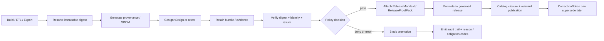

<!-- [KFM_META_BLOCK_V2]
doc_id: kfm://doc/<REVIEW-REQUIRED-UUID>
title: Sigstore / Cosign v3
type: standard
version: v1
status: draft
owners: @bartytime4life
created: <REVIEW-REQUIRED-YYYY-MM-DD>
updated: 2026-04-05
policy_label: <REVIEW-REQUIRED-POLICY-LABEL>
related: [../../README.md, ../README.md, ../reference-repos/README.md, ../../../../.github/README.md, ../../../../.github/actions/README.md, ../../../../.github/workflows/README.md, ../../../../policy/README.md, ../../../../contracts/README.md, ../../../../schemas/README.md, ../../../../tests/README.md]
tags: [kfm, security, supply-chain, sigstore, cosign, attestations]
notes: [baseline draft revised against current public-main repo evidence, lane remains README-only on public main, workflow YAML and runtime enforcement depth remain unproven, version-sensitive Sigstore and GitHub attestation examples were rechecked against official docs]
[/KFM_META_BLOCK_V2] -->

# Sigstore / Cosign v3

Digest-first signing, verification, and attestation guidance for KFM release-bearing artifacts.

> **Status:** experimental  
> **Owners:** `@bartytime4life`  
> **Path:** `docs/security/supply-chain/sigstore-cosign-v3/README.md`  
> **Repo fit:** signing and attestation lane under [`../README.md`](../README.md), aligned with [`../../README.md`](../../README.md), adjacent to [`../reference-repos/README.md`](../reference-repos/README.md), and operationally coupled to [`../../../../.github/README.md`](../../../../.github/README.md), [`../../../../.github/actions/README.md`](../../../../.github/actions/README.md), [`../../../../.github/workflows/README.md`](../../../../.github/workflows/README.md), [`../../../../policy/README.md`](../../../../policy/README.md), [`../../../../contracts/README.md`](../../../../contracts/README.md), [`../../../../schemas/README.md`](../../../../schemas/README.md), and [`../../../../tests/README.md`](../../../../tests/README.md).  
>      
> **Quick jumps:** [Scope](#scope) · [Repo fit](#repo-fit) · [Accepted inputs](#accepted-inputs) · [Exclusions](#exclusions) · [Directory tree](#directory-tree) · [Quickstart](#quickstart) · [Usage](#usage) · [Diagram](#diagram) · [Control matrix](#control-matrix) · [Adjacent enforcement signals](#adjacent-enforcement-signals) · [Task list](#task-list--definition-of-done) · [FAQ](#faq) · [Appendix](#appendix)

> [!IMPORTANT]
> This lane is **doctrine-led**, **public-main-grounded**, and **runtime-bounded**.
>
> - **CONFIRMED:** KFM doctrine expects a trust membrane, authoritative-versus-derived separation, fail-closed behavior, promotion as a governed state transition, and visible correction lineage.
> - **CONFIRMED:** the path `docs/security/supply-chain/sigstore-cosign-v3/README.md` exists on current public `main`.
> - **CONFIRMED:** the current public subtree shape for this lane is **README-only**.
> - **CONFIRMED:** `.github/workflows/` is also **README-only** on current public `main`.
> - **CONFIRMED:** `.github/actions/` exposes placeholder local-action seams such as `opa-gate/`, `provenance-guard/`, and `sbom-produce-and-sign/`.
> - **UNKNOWN:** checked-in Sigstore workflow YAML for this lane, populated Rego bundles, fixture-backed signing tests, emitted `ReleaseProofPack` examples, GitHub rulesets, OIDC trust relationships, environment approvals, and non-public runtime depth.
> - **PROPOSED:** the command snippets and workflow shapes below are starter patterns until branch-visible policy, tests, and release evidence prove stronger implementation reality.

## Scope

This README defines the KFM lane for **Sigstore / Cosign v3** as a release-integrity control surface, not as a detached tooling note.

In KFM terms, this lane exists to keep release-bearing artifacts tied to:

- immutable identity
- inspectable provenance
- fail-closed verification
- auditable promotion
- visible correction lineage

This file is the right place for guidance on:

- digest-first artifact references
- keyless signing and verification patterns
- provenance, SBOM, and related attestation expectations
- bundle retention and offline-verification posture
- CI or promotion-gate verification rules
- release-proof and audit-link expectations for signed artifacts
- KFM-specific negative-path behavior for missing, stale, or unverifiable supply-chain evidence

## Repo fit

| Item | Value |
| --- | --- |
| Path | `docs/security/supply-chain/sigstore-cosign-v3/README.md` |
| Role | Narrow KFM lane doc for signing, verification, attestations, bundles, and release-integrity evidence |
| Upstream | [`../README.md`](../README.md), [`../../README.md`](../../README.md) |
| Adjacent | [`../reference-repos/README.md`](../reference-repos/README.md) |
| Gatehouse seams | [`../../../../.github/README.md`](../../../../.github/README.md), [`../../../../.github/actions/README.md`](../../../../.github/actions/README.md), [`../../../../.github/workflows/README.md`](../../../../.github/workflows/README.md) |
| Machine-governed neighbors | [`../../../../policy/README.md`](../../../../policy/README.md), [`../../../../contracts/README.md`](../../../../contracts/README.md), [`../../../../schemas/README.md`](../../../../schemas/README.md), [`../../../../tests/README.md`](../../../../tests/README.md) |
| Expected downstream changes when this lane becomes executable | workflow YAML, action wrappers, policy bundles, fixtures, tests, release evidence, and runbooks |

### Current public-main snapshot

| Surface | Current public `main` | Why it matters here |
| --- | --- | --- |
| `docs/security/supply-chain/sigstore-cosign-v3/README.md` | Present | This lane is real on the branch, not a hypothetical path. |
| `docs/security/supply-chain/sigstore-cosign-v3/*` child files | No additional files visible beyond `README.md` | Public `main` proves the lane exists, but not lane-local fixtures, workflows, or examples as checked-in implementation. |
| Parent `docs/security/supply-chain/README.md` | Present and routes this lane as the signing / attestation lane | This README should stay narrow and not duplicate parent-lane doctrine. |
| `.github/workflows/README.md` | Present; workflow lane is README-only | Do not claim current checked-in Sigstore workflow YAML here. |
| `.github/actions/README.md` | Present; placeholder directories `metadata-validate/`, `metadata-validate-v2/`, `opa-gate/`, `provenance-guard/`, and `sbom-produce-and-sign/` are visible | There is a public seam for future local wrappers around policy, provenance, and SBOM/signing work, but not proof of live automation. |
| `policy/`, `contracts/`, `schemas/`, `tests/` | Present as real top-level lanes | Supply-chain guidance must keep routing machine-enforced behavior to those surfaces. |
| GitHub rulesets, required checks, OIDC trust relationships, environment approvals, emitted proof packs | **UNKNOWN** | Platform-only or non-public state still requires separate verification. |

### Current posture snapshot

| Area | Posture | Notes |
| --- | --- | --- |
| KFM trust membrane / fail-closed doctrine | **CONFIRMED** | Strongly established in the March–April 2026 KFM corpus. |
| `ReleaseManifest`, `ReleaseProofPack`, `EvidenceBundle`, `RuntimeResponseEnvelope`, `CorrectionNotice` | **CONFIRMED** | These are named contract families in current KFM doctrine and repo-adjacent contract docs. |
| `policy/`, `contracts/`, `schemas/`, `tests/` as adjacent control surfaces | **CONFIRMED** | These lanes exist on current public `main` and are the correct homes for machine-enforced semantics. |
| `.github/actions/` as a supply-chain-adjacent seam | **CONFIRMED** | Public tree exposes placeholder seams relevant to policy, provenance, and SBOM/signing work. |
| Checked-in Sigstore / Cosign workflow YAML | **UNKNOWN** | Current public workflow lane is README-only. |
| Populated Rego bundles, fixture-backed signing tests, emitted proof packs | **UNKNOWN** | Public docs describe the seams; current public `main` does not yet prove filled implementation depth here. |

## Accepted inputs

Content that belongs here:

- Sigstore / Cosign v3 usage patterns for **release-bearing artifacts**
- digest-first naming and verification guidance
- identity / issuer pinning rules for keyless verification
- provenance, SBOM, and bundle retention expectations
- CI gate patterns that are explicitly fail-closed
- release-proof and audit-link expectations for signed artifacts
- KFM-specific mappings from supply-chain failures into reason codes, obligation codes, and review paths
- documentation that explains how this lane should interact with `.github/actions/`, `.github/workflows/`, `policy/`, `contracts/`, `schemas/`, and `tests/` without overclaiming current enforcement

## Exclusions

Content that does **not** belong here:

- **Generic security doctrine** — keep that in [`../../README.md`](../../README.md).
- **Broad supply-chain indexing across multiple tools or vendors** — keep that in [`../README.md`](../README.md) and [`../reference-repos/README.md`](../reference-repos/README.md).
- **Machine-checkable policy grammar** — keep canonical policy surfaces in [`../../../../policy/README.md`](../../../../policy/README.md).
- **Canonical schema definitions** — keep them in [`../../../../contracts/README.md`](../../../../contracts/README.md) and [`../../../../schemas/README.md`](../../../../schemas/README.md).
- **Verification fixtures and runnable tests** — keep them in [`../../../../tests/README.md`](../../../../tests/README.md).
- **Repository-wide GitHub workflow inventory** — keep that in [`../../../../.github/workflows/README.md`](../../../../.github/workflows/README.md).
- **Secrets, long-lived private key material, registry credentials, or token values** — keep those in managed secret surfaces and runbooks, not in docs or starter YAML.

## Directory tree

> [!NOTE]
> The tree below is a **current public-main snapshot** of the visible subtree and adjacent seams. README-only or placeholder directories are evidence of lane shape, not proof of populated implementation.

```text
docs/
└── security/
    ├── README.md
    └── supply-chain/
        ├── README.md
        ├── dependency-confusion/
        │   ├── README.md
        │   ├── checks/
        │   ├── examples/
        │   └── policy/
        ├── reference-repos/
        │   └── README.md
        ├── shai-hulud-2.0/
        │   ├── README.md
        │   ├── indicators/
        │   ├── protections/
        │   └── workflows/
        └── sigstore-cosign-v3/
            └── README.md

.github/
├── README.md
├── actions/
│   ├── README.md
│   ├── metadata-validate/
│   ├── metadata-validate-v2/
│   ├── opa-gate/
│   ├── provenance-guard/
│   └── sbom-produce-and-sign/
└── workflows/
    └── README.md

policy/
└── README.md

contracts/
└── README.md

schemas/
└── README.md

tests/
└── README.md
```

## Quickstart

### 1) Re-open the lane before making claims

All commands below are inspection-first.

```bash
sed -n '1,220p' docs/security/README.md
sed -n '1,260p' docs/security/supply-chain/README.md
sed -n '1,260p' docs/security/supply-chain/sigstore-cosign-v3/README.md
sed -n '1,220p' .github/README.md
sed -n '1,240p' .github/actions/README.md
sed -n '1,240p' .github/workflows/README.md
sed -n '1,220p' policy/README.md
sed -n '1,220p' contracts/README.md
sed -n '1,220p' schemas/README.md
sed -n '1,220p' tests/README.md
```

### 2) Re-check visible executable seams

```bash
git ls-files 'docs/security/supply-chain/*'
git ls-files '.github/actions/*' '.github/workflows/*'
git grep -nE 'sigstore|cosign|rekor|fulcio|attest|attestation|sbom|provenance'
git grep -nE 'decision_envelope|reason_codes|obligation_codes|release_manifest|releaseproofpack|evidence_bundle'
git grep -nE 'sigstore/cosign-installer@|cosign sign-blob|cosign verify-blob|gh attestation verify'
```

### 3) Touch the full stream, not just the prose

If this README moves from documentation toward enforcement, review these surfaces in the same change stream:

```bash
git diff -- \
  docs/security/ \
  .github/actions/ \
  .github/workflows/ \
  policy/ \
  contracts/ \
  schemas/ \
  tests/
```

> [!WARNING]
> In KFM, a polished README without policy, fixtures, tests, and release evidence is not a completed control. It is documentation debt with better typography.

[Back to top](#sigstore--cosign-v3)

## Usage

### Core working rules

1. **Prefer immutable digests over mutable tags or filenames.**  
   Tags and filenames are convenience handles. Digests are trust anchors.

2. **Verification is the gate, not signing alone.**  
   KFM gets value when a governed surface verifies identity, issuer, digest, and evidence completeness before merge, promotion, or publish.

3. **Prefer keyless OIDC flows where the platform supports them.**  
   Exceptions may exist, but they should be explicit, review-bearing, and documented with blast radius and rotation posture.

4. **Treat bundles and attestations as release evidence, not side trivia.**  
   Signatures, bundles, provenance, SBOMs, and related refs should travel with a `ReleaseManifest` / `ReleaseProofPack` rather than living only in transient CI logs.

5. **Do not sign everything indiscriminately.**  
   This lane is for **release-bearing artifacts** and the proof objects that make those artifacts governable.

6. **Keep negative paths visible.**  
   Missing signature, wrong identity, wrong issuer, missing digest, missing bundle, stale evidence, or unverifiable provenance should fail closed and leave an audit trail.

### Current public-main interpretation rules

| Signal | What it means | What it does **not** mean |
| --- | --- | --- |
| README-only lane under `docs/security/supply-chain/sigstore-cosign-v3/` | The signing / attestation lane exists and can be reviewed | That fixtures, policies, or workflows are already checked in here |
| Placeholder local-action directories under `.github/actions/` | The repo now exposes seams where policy, provenance, and SBOM/signing helpers can land | That those helpers are already implemented or called by live public-main workflows |
| `.github/workflows/README.md` only | Workflow documentation exists, and public historical signals are documented there | That public `main` currently proves checked-in Sigstore workflow YAML |
| Policy / tests / contracts / schemas docs | The adjacent control surfaces are real and named | That this README may replace their machine-enforced responsibilities |

### Bundle posture in Cosign v3

Cosign v3 treats bundles as a first-class verification material, not a disposable side file.

In KFM terms, that means bundle material belongs with the release-bearing artifact, the `ReleaseManifest`, or the `ReleaseProofPack`—not only in CI scratch space or transient build logs. If later review happens offline or after a certificate expires, bundle retention is part of the trust story, not a convenience extra.

### Digest-first operating model

| Property | KFM reading | Practical consequence |
| --- | --- | --- |
| **Authenticity** | Who produced this artifact? | Pin certificate identity and OIDC issuer during verification. |
| **Integrity** | Are these the exact bits that were reviewed or promoted? | Sign and verify by digest or by blob bundle, never by mutable handle alone. |
| **Auditability** | Can later review reconstruct the trust story? | Retain bundles, attestations, decision refs, and release-link evidence. |
| **Correctability** | Can KFM replace or withdraw an artifact without erasing history? | Carry digest refs into `CorrectionNotice` and release lineage objects. |

### Release-bearing artifact classes

The matrix below is a **PROPOSED default**, not a claim of current checked-in enforcement.

| Artifact class | Preferred trust surface | Sign / attest | Verify before | Keep with release |
| --- | --- | --- | --- | --- |
| OCI image | Digest-addressed image ref | Sign + attest | merge gate, promotion gate, deploy gate | provenance, SBOM, bundle evidence |
| ORAS / OCI-hosted dataset package | Digest-addressed registry ref | Sign + attest | promotion, publish, catalog closure | provenance, SBOM, bundle evidence |
| Blob artifact (`.pmtiles`, `.mbtiles`, `.tif`, `.parquet`, `.zip`, proof pack) | `sign-blob` bundle or OCI wrapper | Sign blob and retain bundle | promotion, publish, catalog closure | bundle, checksum manifest, provenance refs |
| STAC / DCAT / PROV closure | Hashed metadata object or release-proof attachment | Sign directly or reference signed release proof | publication assembly | digest refs, release linkage |
| `ReleaseManifest` / `ReleaseProofPack` | Canonical proof object | Sign or embed signed refs | promotion and rollback drills | decision refs, bundle refs, correction posture |

### KFM object hooks for this lane

| KFM object family | Supply-chain hook | Why it matters |
| --- | --- | --- |
| `DatasetVersion` | stable version identity + artifact digests | Prevents hand-wavy “latest file” reasoning. |
| `CatalogClosure` | STAC / DCAT / PROV refs linked to signed outputs | Keeps outward discovery tied to real release state. |
| `DecisionEnvelope` | reason codes / obligation codes for pass, deny, or escalate | Makes trust decisions machine-readable. |
| `EvidenceBundle` | bundle refs, provenance summary, rights / sensitivity state | Lets downstream surfaces explain why an artifact is trusted. |
| `ReleaseManifest` / `ReleaseProofPack` | signatures, attestations, SBOM refs, bundle evidence, rollback posture | Turns promotion into a governed state transition. |
| `CorrectionNotice` | replaced digest refs and affected surface classes | Preserves visible lineage after supersession or withdrawal. |

### Sigstore / Cosign v3 versus adjacent GitHub-native attestations

| Surface | Best use here | KFM reading |
| --- | --- | --- |
| **Sigstore / Cosign v3** | primary signing / verification surface for OCI-style artifacts and explicit blob-signing workflows | Primary topic of this README |
| **GitHub Artifact Attestations** | GitHub-native provenance / build attestation within Actions-centered workflows | Useful when the verification path is explicit, reviewable, and bound into release evidence |
| **Both together** | complementary provenance + signature coverage | Allowed only if promotion logic states which path is authoritative and how each result enters release memory |

## Diagram



[Back to top](#sigstore--cosign-v3)

## Control matrix

| KFM concern | Supply-chain consequence |
| --- | --- |
| Trust membrane | Artifact trust is decided in governed CI / promotion / release surfaces, not by ad hoc client belief. |
| Cite-or-abstain / fail-closed | If signing or attestation evidence is missing, promotion blocks or the release remains visibly incomplete. |
| Authoritative vs derived | Signed artifacts and their proof objects outrank screenshots, dashboards, or prose summaries. |
| Promotion as governed state change | Release is assembled with proof objects, not merely copied into a new directory or registry tag. |
| Correction lineage | A corrected build emits new evidence and lineage; it does not silently overwrite the trust record. |
| Auditability | Verification outcomes should join cleanly to decision traces, release refs, and correction notices. |

### Failure classes worth keeping explicit

| Failure class | Expected KFM outcome |
| --- | --- |
| Digest missing or tag-only reference | **DENY** or quarantine until the exact subject is named immutably |
| Signature present but identity / issuer mismatch | **DENY** with explicit reason code |
| Attestation missing for a required artifact class | **DENY** or keep the release visibly incomplete |
| Bundle / offline-verification material missing | **ERROR** or block promotion where offline proof is part of release requirements |
| Release docs / proof-pack linkage incomplete | `release.docs_gate_failed` or equivalent review-bearing failure |
| Artifact replaced after publication | emit `CorrectionNotice` / supersession lineage rather than silent mutation |

## Adjacent enforcement signals

| Surface | Current public signal | How to read it safely |
| --- | --- | --- |
| `.github/actions/opa-gate/` | Placeholder local-action directory is visible | A policy-check seam exists publicly, but the current branch does not yet prove its implementation depth here. |
| `.github/actions/provenance-guard/` | Placeholder local-action directory is visible | A provenance guard seam exists publicly, but this README must not assume emitted proof objects from it. |
| `.github/actions/sbom-produce-and-sign/` | Placeholder local-action directory is visible | The repo has named a likely SBOM/sign seam, but public `main` still needs actual action content and callers. |
| `.github/workflows/README.md` | Workflow lane is present and documents current inventory boundaries | Use it as the current public source of workflow truth, not as proof of unlisted YAML. |
| Historical workflow names documented in `.github/workflows/README.md` | Names such as `verify-docs.yml`, `verify-contracts-and-policy.yml`, `release-evidence.yml`, and `promote-and-reconcile.yml` are recorded there as public historical signals | Useful reconstruction clue only; do not treat it as proof that equivalent YAML is still checked in on public `main`. |
| `policy/README.md` and `tests/README.md` | Both surfaces explicitly route semantics away from prose-only claims | Promotion logic, deny grammar, fixtures, and negative-path proofs should graduate there, not remain trapped in this README. |
| `contracts/README.md` and `schemas/README.md` | Both surfaces keep proof-object and schema-home responsibilities visible | Signing docs should reference these families without silently taking over canonical contract ownership. |

## Task list & definition of done

### Task list

- [ ] This file no longer reads like a scaffold.
- [ ] The current public-main snapshot tells the truth about this lane’s README-only shape.
- [ ] Every workflow or command example is labeled **CONFIRMED**, **PROPOSED**, **UNKNOWN**, or **NEEDS VERIFICATION** where appropriate.
- [ ] Examples use **digest-first** references rather than tag-only or filename-only references.
- [ ] Any `cosign-installer` example uses a release line compatible with **Cosign v3**.
- [ ] Verification examples pin both **certificate identity** and **OIDC issuer**.
- [ ] Blob-signing examples retain a **bundle** for later verification.
- [ ] `.github/actions/` is reviewed alongside `.github/workflows/` when this lane shifts toward enforcement.
- [ ] Adjacent surfaces are reviewed when changed: workflows, actions, policy, contracts, schemas, tests, and release evidence.
- [ ] No sentence claims live enforcement unless checked-in YAML, action content, policies, tests, and emitted proof artifacts prove it.
- [ ] Rollback / correction consequences remain visible.

### Definition of done

This lane is in a healthy state when:

1. the README is specific enough to guide review,
2. current public branch truth and target-state doctrine are clearly separated,
3. version-sensitive examples are current enough not to mislead,
4. policy and test surfaces can execute the lane’s claims,
5. release evidence can reconstruct what was signed, attested, verified, and promoted,
6. the negative path is as explicit as the happy path.

## FAQ

### Why digest-first instead of tag-first or filename-first?

Tags and filenames can move. Digests identify the exact artifact that was built and verified.

### Why not stop at checksums?

A checksum proves integrity of bytes. It does **not** prove who produced them, how they were produced, or whether the build identity is allowed.

### When should KFM use blob signing versus OCI-hosted signing?

Use whichever surface matches the artifact’s actual release path. OCI-hosted artifacts are naturally verified by digest in-registry. Standalone files should either be wrapped in OCI or signed as blobs with retained verification bundles.

### Are GitHub Artifact Attestations enough by themselves?

They can be strong evidence in GitHub-centered workflows, but KFM still needs an explicit verification path, release evidence linkage, and fail-closed policy behavior.

### Why mention `.github/actions/` if this lane is still README-only on public `main`?

Because the public tree now exposes named local-action seams for policy, provenance, and SBOM/signing work. Those seams are architecturally relevant, even though their current placeholder state is not proof of live automation.

### Does signing prove an artifact is safe?

No. It proves something about identity and provenance. Policy, review, SBOM analysis, vulnerability response, release discipline, and correction lineage still matter.

### What about offline verification?

Treat bundle material as part of release evidence. If the review context is disconnected, the `ReleaseProofPack` should still retain enough material to verify later without assuming permanent live network access.

## Appendix

<details>
<summary><strong>Illustrative snippets (PROPOSED / NEEDS VERIFICATION)</strong></summary>

These snippets are **starter patterns**, not confirmed repo implementation.

### A. Keyless Cosign v3 shape for OCI-style artifacts

```bash
ARTIFACT="ghcr.io/OWNER/REPO@sha256:<digest>"

cosign sign --yes "$ARTIFACT"

cosign verify "$ARTIFACT" \
  --certificate-identity="https://github.com/OWNER/REPO/.github/workflows/WORKFLOW.yml@refs/heads/main" \
  --certificate-oidc-issuer="https://token.actions.githubusercontent.com"
```

Replace the workflow identity with the exact branch or tag scope you actually authorize.

### B. Keyless blob-signing shape for standalone artifacts

```bash
FILE="dist/release-proof-pack.tar.zst"

cosign sign-blob "$FILE" \
  --bundle "$FILE.sigstore.json" \
  --yes

cosign verify-blob "$FILE" \
  --bundle "$FILE.sigstore.json" \
  --certificate-identity="https://github.com/OWNER/REPO/.github/workflows/WORKFLOW.yml@refs/heads/main" \
  --certificate-oidc-issuer="https://token.actions.githubusercontent.com"
```

Keep the bundle with the release-bearing file or with the `ReleaseProofPack`.

### C. Minimal GitHub Actions shape for Cosign v3

```yaml
name: build-sign-verify

on:
  push:
    branches: [main]

permissions:
  contents: read
  packages: write
  id-token: write

jobs:
  artifact:
    runs-on: ubuntu-latest
    steps:
      - uses: actions/checkout@v5
        with:
          persist-credentials: false

      - name: Install Cosign
        uses: sigstore/cosign-installer@v4.0.0

      - name: Log in to GHCR
        uses: docker/login-action@v3
        with:
          registry: ghcr.io
          username: ${{ github.actor }}
          password: ${{ secrets.GITHUB_TOKEN }}

      - name: Build and push image
        id: push
        uses: docker/build-push-action@v6
        with:
          push: true
          tags: ghcr.io/${{ github.repository }}:${{ github.sha }}

      - name: Sign and verify by digest
        env:
          IMAGE: ghcr.io/${{ github.repository }}@${{ steps.push.outputs.digest }}
        run: |
          cosign sign --yes "$IMAGE"
          cosign verify "$IMAGE" \
            --certificate-identity="https://github.com/OWNER/REPO/.github/workflows/WORKFLOW.yml@refs/heads/main" \
            --certificate-oidc-issuer="https://token.actions.githubusercontent.com"
```

### D. GitHub Artifact Attestation verification shapes

```bash
# Binary or file artifact
gh attestation verify PATH/TO/YOUR/BUILD/ARTIFACT-BINARY -R OWNER/REPO

# OCI image
gh attestation verify oci://ghcr.io/OWNER/IMAGE:TAG -R OWNER/REPO

# SPDX SBOM predicate
gh attestation verify PATH/TO/YOUR/BUILD/ARTIFACT-BINARY \
  -R OWNER/REPO \
  --predicate-type https://spdx.dev/Document/v2.3

# Download bundle material for offline review
gh attestation download PATH/TO/YOUR/BUILD/ARTIFACT-BINARY -R OWNER/REPO

# Download trusted roots for offline verification
gh attestation trusted-root > trusted_root.jsonl
```

### E. Review worksheet

```text
[ ] Which artifact is authoritative for this release?
[ ] Is the subject named by digest?
[ ] What identity is allowed to sign or attest it?
[ ] What issuer is allowed?
[ ] Where is verification enforced?
[ ] Which reason / obligation code is emitted on failure?
[ ] Which release object carries bundle / provenance / SBOM refs?
[ ] What is the correction / rollback story if the artifact must be replaced?
```

</details>

[Back to top](#sigstore--cosign-v3)
