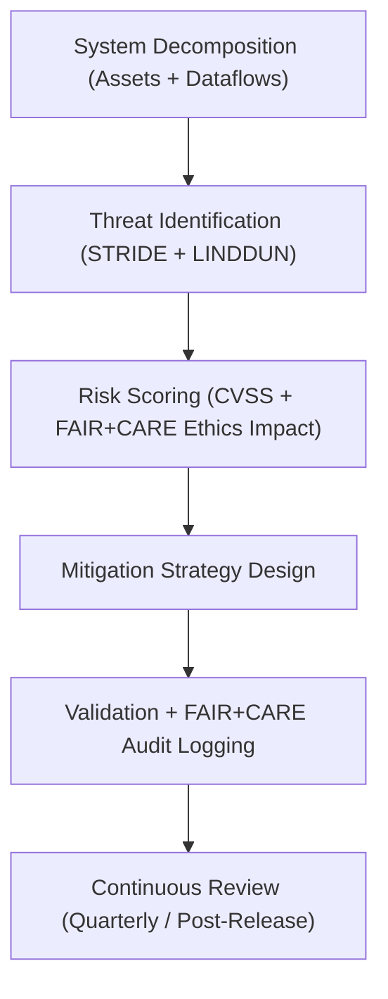

<div align="center">

# 🛡️ **Kansas Frontier Matrix — Threat Modeling & Risk Mitigation Framework**
`docs/security/threat-model.md`

**Purpose:**  
Define and maintain the **STRIDE–LINDDUN-based threat modeling framework** for the Kansas Frontier Matrix (KFM).  
This document provides a structured approach to identifying, classifying, and mitigating risks across all KFM systems, aligning with **FAIR+CARE ethics**, **ISO 27005**, and **OWASP SAMM** methodologies.

[](../README.md)
[](../../LICENSE)
[](../standards/faircare.md)
[](../../releases/)
</div>

---

## 📘 Overview

The **Threat Modeling & Risk Mitigation Framework** ensures that all KFM components — from data pipelines to AI models and web interfaces — are analyzed through ethical and technical lenses.  
This framework integrates the **STRIDE** and **LINDDUN** methodologies to ensure complete coverage of security and privacy threats under the FAIR+CARE governance model.

---

## 🗂️ Directory Context

```plaintext
docs/security/
├── README.md
├── threat-model.md                  # This document
├── secrets-policy.md
├── supply-chain.md
├── vulnerability-management.md
└── incident-response.md
```

---

## 🧩 Threat Modeling Process Overview



---

## ⚙️ Methodology Integration

| Framework | Purpose | Applied To | Standard |
|------------|----------|-------------|-----------|
| **STRIDE** | Identifies security risks (Spoofing, Tampering, Repudiation, Information Disclosure, Denial of Service, Elevation of Privilege) | Application / Infrastructure | OWASP / NIST SP 800-154 |
| **LINDDUN** | Identifies privacy threats (Linkability, Identifiability, Non-repudiation, Detectability, Disclosure, Unawareness, Non-compliance) | AI / Data Privacy Pipelines | ISO 27701 / GDPR |
| **FAIR+CARE** | Evaluates ethical, social, and sustainability risks | All domains | MCP-DL v6.3 / FAIR+CARE v3 |

---

## 🧠 Threat Scenarios by STRIDE Category

| Threat Category | Example | Mitigation |
|------------------|----------|-------------|
| **Spoofing** | Unauthorized API key usage to impersonate services | Use JWT-based mutual auth + signed requests |
| **Tampering** | Alteration of telemetry or datasets during CI/CD | Enforce checksum and signed artifact verification |
| **Repudiation** | Absence of audit logs for governance workflows | Enable signed ledger entries with immutable proofs |
| **Information Disclosure** | Accidental leakage of AI model weights or datasets | Enforce access controls, encryption, and data masking |
| **Denial of Service (DoS)** | Flooding MapLibre services with heavy queries | Implement rate limiting and caching layers |
| **Elevation of Privilege** | Escalation via misconfigured permissions | Adopt least-privilege IAM roles + just-in-time access |

---

## 🔒 LINDDUN Privacy Threat Scenarios

| Privacy Threat | Example | FAIR+CARE Mitigation |
|----------------|----------|----------------------|
| **Linkability** | Re-identification of anonymized historical data | Use differential privacy and temporal aggregation |
| **Identifiability** | Exposed personal records in census datasets | Apply K-anonymity and field-level masking |
| **Detectability** | Unauthorized inference of data existence | Use consistent query obfuscation and dummy responses |
| **Disclosure** | Sensitive location data in cultural sites | Geospatial generalization (≥5 km) under FAIR+CARE |
| **Unawareness** | Lack of data use transparency | Public FAIR+CARE disclosures and open documentation |
| **Non-compliance** | Misalignment with governance charter | Continuous FAIR+CARE validation cycles |

---

## 📊 FAIR+CARE + STRIDE Risk Scoring Matrix

| Risk Level | CVSS Range | FAIR+CARE Ethical Risk | Mitigation Priority |
|-------------|-------------|-----------------------|---------------------|
| **Critical** | 9.0–10.0 | Direct human or cultural data exposure | Immediate (≤24h) |
| **High** | 7.0–8.9 | Systemic privacy or governance breach | 48h |
| **Medium** | 4.0–6.9 | Limited or local system risk | ≤1 week |
| **Low** | 0.1–3.9 | Minimal operational or reputational impact | ≤30 days |

---

## 🧮 FAIR+CARE Threat Audit Record Example

```json
{
  "audit_id": "threat-model-audit-2025-11-09-0224",
  "frameworks": ["STRIDE", "LINDDUN", "FAIR+CARE"],
  "threats_assessed": 26,
  "mitigations_applied": 24,
  "cvss_distribution": {
    "critical": 2,
    "high": 5,
    "medium": 13,
    "low": 6
  },
  "energy_joules": 14.3,
  "carbon_gCO2e": 0.0057,
  "audit_status": "Pass",
  "auditor": "FAIR+CARE Security Council",
  "timestamp": "2025-11-09T18:55:00Z"
}
```

---

## 🧾 Governance Ledger Record Example

```json
{
  "ledger_id": "threat-model-ledger-2025-11-09-0225",
  "component": "Threat Modeling Framework",
  "frameworks": ["STRIDE", "LINDDUN", "FAIR+CARE"],
  "energy_joules": 14.3,
  "carbon_gCO2e": 0.0057,
  "faircare_status": "Pass",
  "auditor": "FAIR+CARE Council",
  "timestamp": "2025-11-09T18:56:00Z"
}
```

---

## ⚖️ FAIR+CARE & ISO Security Matrix

| Principle | Implementation | Verification Source |
|------------|----------------|--------------------|
| **Findable** | Threat models versioned in Governance Ledger | `telemetry_ref` |
| **Accessible** | Documentation published under CC-BY license | FAIR+CARE Ledger |
| **Interoperable** | JSON-LD and STRIDE-LINDDUN schemas | `telemetry_schema` |
| **Reusable** | Risk models archived for reproducibility | `manifest_ref` |
| **Responsibility** | ISO 27005 telemetry metrics per model | `telemetry_ref` |
| **Ethics** | CARE principles embedded in privacy threat analysis | FAIR+CARE Ethics Audit |

---

## 🧠 Sustainability Metrics

| Metric | Description | Value | Target | Unit |
|---------|-------------|--------|---------|------|
| **Energy (J)** | Energy used per full threat modeling cycle | 14.3 | ≤ 15 | Joules |
| **Carbon (gCO₂e)** | Emissions equivalent for analysis workflow | 0.0057 | ≤ 0.006 | gCO₂e |
| **Telemetry Coverage (%)** | FAIR+CARE trace completeness | 100 | ≥ 95 | % |
| **Validation Success (%)** | FAIR+CARE audit compliance | 100 | 100 | % |

---

## 🕰️ Version History

| Version | Date | Author | Summary |
|----------|------|--------|----------|
| v10.2.3 | 2025-11-09 | FAIR+CARE Security Council | Published STRIDE–LINDDUN threat modeling guide with FAIR+CARE integration and telemetry schema. |
| v10.2.2 | 2025-11-09 | KFM Security Engineering Team | Added FAIR+CARE risk alignment and sustainability metrics. |
| v10.2.0 | 2025-11-08 | KFM DevSecOps Group | Created baseline threat modeling document aligned with ISO 27005 and OWASP SAMM. |

---

<div align="center">

© 2025 Kansas Frontier Matrix Project  
Master Coder Protocol v6.3 · FAIR+CARE Certified · Diamond⁹ Ω / Crown∞Ω Ultimate Certified  

[Back to Security Overview](./README.md) · [Governance Charter](../standards/governance/ROOT-GOVERNANCE.md)

</div>

