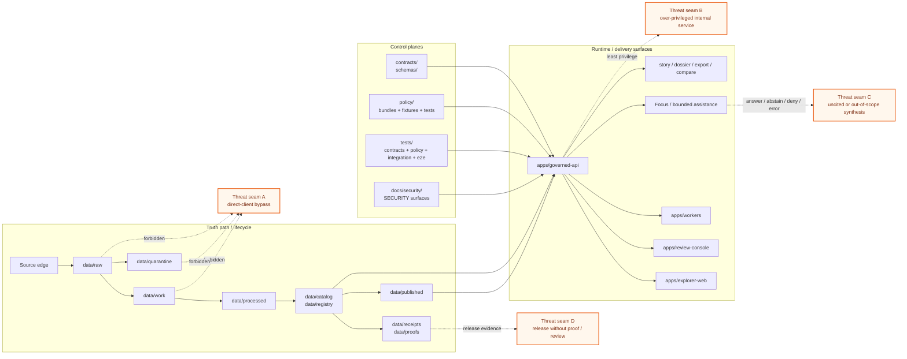

<!-- [KFM_META_BLOCK_V2]
doc_id: kfm://doc/<REVIEW-REQUIRED-UUID>
title: KFM Threat Model
type: standard
version: v1
status: draft
owners: @bartytime4life
created: <REVIEW-REQUIRED-YYYY-MM-DD>
updated: <REVIEW-REQUIRED-YYYY-MM-DD>
policy_label: <REVIEW-REQUIRED-POLICY-LABEL>
related: [docs/security/README.md, docs/security/vulnerability-management.md, docs/security/prompt-injection-defense.md, SECURITY.md, .github/SECURITY.md, apps/governed-api/README.md, policy/README.md, contracts/README.md, tests/README.md, data/README.md]
tags: [kfm, security, threat-model]
notes: [doc_id, created, updated, and policy_label require live repo metadata verification]
[/KFM_META_BLOCK_V2] -->

# KFM Threat Model

Trust-boundary, failure-mode, and verification model for KFM’s governed truth path, API membrane, publication controls, and trust-visible product surfaces.

| Field | Value |
| --- | --- |
| Status | `experimental` surface · document state `draft` |
| Owners | `@bartytime4life` |
| Path | `docs/security/threat-model.md` |
| Repo fit | Upstream: [`./README.md`](./README.md), [`../../SECURITY.md`](../../SECURITY.md), [`../../.github/SECURITY.md`](../../.github/SECURITY.md), [`../../CONTRIBUTING.md`](../../CONTRIBUTING.md). Downstream: [`./vulnerability-management.md`](./vulnerability-management.md), [`./prompt-injection-defense.md`](./prompt-injection-defense.md), [`../../policy/README.md`](../../policy/README.md), [`../../contracts/README.md`](../../contracts/README.md), [`../../tests/README.md`](../../tests/README.md). |
| Badges |      |
| Quick jumps | [Scope](#scope) · [Repo fit](#repo-fit) · [Accepted inputs](#accepted-inputs) · [Threat posture](#threat-posture) · [System context](#system-context--trust-boundaries) · [Threat register](#threat-register) · [Controls & gaps](#current-repo-visible-controls--proof-gaps) · [Verification gates](#verification-gates--definition-of-done) · [Open items](#open-verification-items) |

> [!IMPORTANT]
> This file models how KFM can fail as a governed evidence system. It is not proof that every listed control already exists in deployed runtime form. This document mixes **CONFIRMED doctrine**, **CONFIRMED public-repo structure**, and explicitly marked **UNKNOWN / NEEDS VERIFICATION** implementation details.

> [!WARNING]
> Do not place secrets, internal hostnames, exploit playbooks, credential material, or operator-only incident commands in this file. Keep this document reviewable, public-safe, and cross-linkable.

In KFM, security is the governing trust system for the whole path: source admission, lifecycle stores, policy, API mediation, public surfaces, release proof, rollback, and correction. Threat modeling therefore starts from the path and the membrane, not from a firewall diagram alone.

## Scope

In KFM, a security issue is anything that can weaken governed truth while still looking normal to a user, reviewer, or downstream consumer.

This threat model covers the security-significant failure modes that would weaken KFM’s governed publication posture, including:

- direct or indirect bypass of the governed API membrane
- unauthorized reach into `raw`, `work`, `quarantine`, unpublished, or restricted scope
- evidence-resolution or citation failure that makes a claim look more trustworthy than it is
- unsafe Focus / bounded-assistance behavior, including prompt-injection-style boundary failures
- release, promotion, rollback, or correction failures that break auditability or public trust cues
- rights, sensitivity, exact-location, and review-boundary failures
- supply-chain, workflow, dependency, and automation risks that can alter trusted artifacts
- secret, token, and runtime-containment failures that turn internal lanes into public exposure

This file is cross-cutting. It complements narrower documents such as [`./vulnerability-management.md`](./vulnerability-management.md) and [`./prompt-injection-defense.md`](./prompt-injection-defense.md); it does not replace them.

## Repo fit

Path: `docs/security/threat-model.md`

Role in repo: security architecture note for the trust boundaries that span `data/`, `apps/`, `policy/`, `contracts/`, `tests/`, `configs/`, `.github/`, and public-facing KFM surfaces.

### Upstream context

- [`./README.md`](./README.md) — security subtree orientation and lane map
- [`../../SECURITY.md`](../../SECURITY.md) — repository-wide security expectations
- [`../../.github/SECURITY.md`](../../.github/SECURITY.md) — GitHub-facing disclosure path
- [`../../CONTRIBUTING.md`](../../CONTRIBUTING.md) — contribution rules that preserve the truth path and trust membrane
- [`../../apps/governed-api/README.md`](../../apps/governed-api/README.md) — public/runtime membrane description

### Downstream effect

Changes here should usually trigger review of one or more adjacent surfaces:

- [`./vulnerability-management.md`](./vulnerability-management.md)
- [`./prompt-injection-defense.md`](./prompt-injection-defense.md)
- [`../../policy/README.md`](../../policy/README.md)
- [`../../contracts/README.md`](../../contracts/README.md)
- [`../../tests/README.md`](../../tests/README.md)
- [`../../data/README.md`](../../data/README.md)
- [`../../apps/README.md`](../../apps/README.md)
- [`../../configs/README.md`](../../configs/README.md)

## Accepted inputs

Use this file for content such as:

- trust-boundary diagrams and threat paths
- asset/boundary inventories tied to real repo lanes
- failure modes that threaten evidence integrity, reviewability, release safety, or trust-visible UI behavior
- explicit control status marked as `CONFIRMED`, `INFERRED`, `PROPOSED`, `UNKNOWN`, or `NEEDS VERIFICATION`
- minimum proof obligations for merge, promotion, release, rollback, or correction
- verification expectations that should be reflected in policy, contracts, fixtures, tests, and runbooks

## Exclusions

Keep the following out of this file:

- live secrets, keys, tokens, private URLs, and credential examples
- exploit recipes, private incident notes, or researcher intake details better handled by security policy or internal runbooks
- canonical policy rule bodies, schema payloads, or contract definitions that belong under `policy/`, `schemas/`, or `contracts/`
- claims about deployed auth providers, secret stores, ingress, service-account scopes, or required workflow checks unless they are directly re-verified in the live repo/runtime
- generic security boilerplate that is not mapped to KFM’s truth path, evidence contract, or governed release model

## Quickstart for reviewers

When a change touches a route, worker, config surface, dependency, publication step, or AI-assisted flow, review it through this sequence:

1. Identify the boundary it crosses: source admission, storage zone, governed API, public surface, steward surface, workflow, or runtime adapter.
2. Ask what unpublished, restricted, or policy-significant material could become reachable if the change fails open.
3. Ask what trust cue would become misleading: evidence, freshness, review state, correction state, rights posture, or release integrity.
4. Update the relevant threat row, then update linked policy/tests/contracts/docs in the same change set or explain the gap explicitly.
5. Leave any unverified runtime detail marked as `UNKNOWN` or `NEEDS VERIFICATION`.

## Threat posture

KFM threat modeling starts from the path, not from a perimeter sketch. The baseline question is:

> **What failure would let a surface bypass evidence, policy, review, or release state while still looking authoritative?**

### Truth labels used in this file

| Label | Meaning in this file |
| --- | --- |
| `CONFIRMED` | Directly supported by current public-repo inspection or by stable KFM doctrine already reflected in repo docs. |
| `INFERRED` | Strongly implied by repeated repo/doctrinal patterns, but not proven as a live implementation detail. |
| `PROPOSED` | Recommended control, artifact, or proof object that fits KFM doctrine but is not yet directly verified. |
| `UNKNOWN` | Not directly verified strongly enough to claim as current repo/runtime fact. |
| `NEEDS VERIFICATION` | Merge-time, checkout-time, or runtime check required before stating the detail as settled. |

### Security laws this document preserves

| Law | Operational meaning |
| --- | --- |
| Truth path stays explicit | `Source edge -> RAW -> WORK / QUARANTINE -> PROCESSED -> CATALOG / TRIPLET -> PUBLISHED` remains visible and governable. |
| Trust membrane is executable | Public/UI clients do not bypass governed APIs, policy checks, or evidence resolution. |
| Evidence remains operational | Consequential claims resolve through policy-safe evidence, not dead references or prose-only reassurance. |
| Derived layers stay subordinate | Search, cache, export, vector, summary, graph, and AI outputs do not quietly become sovereign truth. |
| Fail closed is valid | `deny`, `abstain`, `withhold`, `generalize`, `withdraw`, `stale-visible`, and `correction-pending` are legitimate safe outcomes. |
| Docs are production surface | Security-significant behavior changes should update docs, tests, contracts, and policy together. |

## System context & trust boundaries

```mermaid
flowchart LR
    subgraph Data["Truth path / lifecycle"]
        SRC["Source edge"]
        RAW["data/raw"]
        WORK["data/work"]
        QUAR["data/quarantine"]
        PROC["data/processed"]
        CAT["data/catalog<br/>data/registry"]
        RECEIPTS["data/receipts<br/>data/proofs"]
        PUB["data/published"]
        SRC --> RAW
        RAW --> WORK
        RAW --> QUAR
        WORK --> PROC
        PROC --> CAT
        CAT --> RECEIPTS
        CAT --> PUB
    end

    subgraph Control["Control planes"]
        CONTRACTS["contracts/<br/>schemas/"]
        POLICY["policy/<br/>bundles + fixtures + tests"]
        TESTS["tests/<br/>contracts + policy + integration + e2e"]
        DOCS["docs/security/<br/>SECURITY surfaces"]
    end

    subgraph Runtime["Runtime / delivery surfaces"]
        API["apps/governed-api"]
        WEB["apps/explorer-web"]
        REVIEW["apps/review-console"]
        WORKERS["apps/workers"]
        FOCUS["Focus / bounded assistance"]
        EXPORT["story / dossier / export / compare"]
    end

    CAT --> API
    PUB --> API
    API --> WEB
    API --> REVIEW
    API --> WORKERS
    API --> FOCUS
    API --> EXPORT

    CONTRACTS --> API
    POLICY --> API
    TESTS --> API
    DOCS --> API

    TB1["Threat seam A<br/>direct-client bypass"]:::threat
    TB2["Threat seam B<br/>over-privileged internal service"]:::threat
    TB3["Threat seam C<br/>uncited or out-of-scope synthesis"]:::threat
    TB4["Threat seam D<br/>release without proof / review"]:::threat

    RAW -. forbidden .-> TB1
    WORK -. forbidden .-> TB1
    QUAR -. forbidden .-> TB1
    API -. least privilege .-> TB2
    FOCUS -. answer / abstain / deny / error .-> TB3
    RECEIPTS -. release evidence .-> TB4

    classDef threat fill:#fff7ed,stroke:#ea580c,stroke-width:2px,color:#7c2d12;
```

### Boundary inventory

| Boundary | Repo-visible surface(s) | What must stay true | Primary failure shape | Current posture |
| --- | --- | --- | --- | --- |
| Source admission | `data/raw`, `data/quarantine`, `packages/ingest`, `contracts/`, `policy/` | source identity, rights, cadence, validation, and quarantine decisions stay explicit | poisoned source intake, schema drift, rights bypass, hidden normalization | repo lanes `CONFIRMED`; executable validators `NEEDS VERIFICATION` |
| Truth-path lifecycle stores | `data/raw`, `data/work`, `data/quarantine`, `data/processed`, `data/catalog`, `data/published`, `data/receipts`, `data/proofs`, `data/registry` | no out-of-path publish, no silent overwrite, lineage stays reconstructable | direct store access, bypassed promotion, orphaned proof chain | structure `CONFIRMED`; runtime enforcement `UNKNOWN` |
| Governed API membrane | `apps/governed-api/` | clients receive only policy-safe released scope; evidence drill-through stays available | direct client bypass, over-broad routes, silent fallback to derived data | boundary doc `CONFIRMED`; route inventory `NEEDS VERIFICATION` |
| Public and steward surfaces | `apps/explorer-web`, `apps/review-console`, story/export/focus lanes described in repo docs | freshness, review state, evidence, and correction cues remain visible | privilege bleed, stale-without-warning, misleading authority cues | paths `CONFIRMED`; exact UX/state behavior `UNKNOWN` |
| Internal packages, workers, and indexers | `apps/workers`, `packages/catalog`, `packages/evidence`, `packages/indexers`, `packages/policy`, `packages/domain` | internal components remain least-privilege and derived layers stay rebuildable | background bypass, hidden authority promotion, unauthorized writes | directories `CONFIRMED`; scopes and write paths `UNKNOWN` |
| Policy, contract, and test plane | `policy/`, `contracts/`, `schemas/`, `tests/` | denial logic, schema guarantees, and negative paths stay executable rather than rhetorical | prose-only controls, untested deny paths, drift between docs and runtime | top-level surfaces `CONFIRMED`; actual gate depth `NEEDS VERIFICATION` |
| Supply chain and automation | `.github/dependabot.yml`, `.github/workflows/`, `infra/`, `scripts/`, `tools/` | dependency updates, workflow permissions, and release artifacts stay reviewable and integrity-bearing | dependency confusion, malicious workflow logic, unsigned/unreviewed output | Dependabot `CONFIRMED`; workflow gate set `NEEDS VERIFICATION` |
| Config, secrets, and ingress | `configs/`, `.github/`, `infra/` | repo-visible config remains non-secret; secrets and exposed surfaces stay controlled elsewhere | secret leakage, exposed local model runtime, overly broad network surface | non-secret config lane `CONFIRMED`; secret store/auth/inbound topology `UNKNOWN` |

## Threat register

The register below prioritizes failures that could make KFM look trustworthy while bypassing the rules that earn that trust.

| ID | Threat | Why it matters in KFM | Baseline status | Minimum proof / mitigation burden |
| --- | --- | --- | --- | --- |
| `TM-001` | Direct client or UI bypass of the governed API into `raw`, `work`, `quarantine`, canonical, unpublished, or restricted scope | Breaks the trust membrane and can make policy-free data look authoritative | doctrine `CONFIRMED`; live non-bypass enforcement `NEEDS VERIFICATION` | prove no browser/public token path reaches those stores; test negative paths and network/route boundaries |
| `TM-002` | Over-privileged internal service, worker, export lane, or review tool | An internal component with broad read/write scope can undo the membrane from the inside | doctrine `CONFIRMED`; service-account scope `UNKNOWN` | enumerate minimal roles/tokens, verify least privilege, and simulate compromised-background-job impact |
| `TM-003` | Evidence-resolution failure or broken citation path | Claims, exports, stories, or Focus outputs can appear more trustworthy than support allows | doctrine `CONFIRMED`; live resolver contract/sample payloads `NEEDS VERIFICATION` | surface EvidenceRef → EvidenceBundle contract and run citation-negative / broken-link tests |
| `TM-004` | Focus or bounded-assistance output escapes scope, leaks restricted material, or follows prompt-injection-style instructions | KFM treats uncited or policy-bypassing synthesis as a trust and security failure | doctrine `CONFIRMED`; runtime harness depth `NEEDS VERIFICATION` | test `answer`, `abstain`, `deny`, and `error`; verify retrieval scope, stale-scope handling, and hostile-context behavior |
| `TM-005` | Rights, sensitivity, or exact-location leakage | Unsafe publication can be a security failure even without code exploitation | doctrine `CONFIRMED`; public/generalized/withheld class flow `UNKNOWN` | verify redaction/generalization behavior, steward review requirement, and default-deny on unresolved cases |
| `TM-006` | Promotion or release occurs without review, proof objects, or rollback/correction linkage | Publication in KFM is a governed state transition, not a file copy | doctrine `CONFIRMED`; live proof-pack implementation `UNKNOWN` | verify receipts, proofs, review state, release linkage, and rollback/correction references |
| `TM-007` | Derived layer masquerades as authority, or stale/superseded/corrected output appears current | Search, cache, export, vector, and AI layers are useful but not sovereign truth | doctrine `CONFIRMED`; current user-visible trust cues `UNKNOWN` | prove visible freshness, review state, supersession, and correction behavior on consequential surfaces |
| `TM-008` | Secret, token, or runtime-containment failure | Credential exposure or public exposure of internal runtimes can turn doctrine into direct compromise | doctrine `CONFIRMED`; secret store, rotation, auth provider, and ingress details `UNKNOWN` | inspect secret handling, token scope/TTL, localhost-only assumptions, and exposed service boundaries |
| `TM-009` | Supply-chain, dependency, or workflow compromise | Build/release automation is part of the governed trust path, not a side concern | repo automation surface `CONFIRMED`; required checks/signature/attestation posture `NEEDS VERIFICATION` | verify workflow permissions, review gates, artifact integrity, dependency update handling, and release provenance |
| `TM-010` | Audit join-key drift or irreconstructable incident | If request, decision, release, and correction references do not join, disputed behavior cannot be explained or repaired safely | doctrine `CONFIRMED`; live join-key contracts `UNKNOWN` | run one end-to-end reconstruction drill from request to decision to release/correction artifacts |
| `TM-011` | Availability or performance collapse blocks safe review, correction, export, or explainability | KFM must not bluff when layers, exports, or Focus lanes are overloaded | risk direction `CONFIRMED`; concrete benchmark/SLO posture `NEEDS VERIFICATION` | benchmark large-layer, export, and correction paths; fail visibly rather than silently degrade truth cues |

[Back to top](#kfm-threat-model)

## Boundary-specific fail-closed rules

| Boundary | Safe state when something breaks | Not acceptable |
| --- | --- | --- |
| Source admission | quarantine, reject, or hold for steward review | silent ingest or silent normalization that erases source uncertainty |
| Promotion / publication | withhold, metadata-only, generalize, or mark `correction-pending` | publish-first and fix-later when rights, sensitivity, or proof state are unresolved |
| Governed API | `deny`, `abstain`, or `error` with traceable reason | fallback to uncited or out-of-scope data because the “happy path” failed |
| Focus / bounded assistance | `answer` only with in-scope evidence; otherwise `abstain`, `deny`, or `error` | smooth narrative that cannot reconstruct its evidence path |
| Review / stewardship | block, queue, or require additional review | self-approval of policy-significant release or silent override of failed controls |
| Supply chain / automation | fail build, hold release, or require human review | unsigned/unreviewed artifact progressing because automation “usually works” |
| Correction / rollback | preserve lineage, supersession, and visible withdrawal or narrowing | delete-and-forget remediation that destroys audit history |

## Current repo-visible controls & proof gaps

The public repo already proves useful boundaries. It does not yet prove the whole runtime.

### Public-repo evidence currently visible

| Observation | Status | Why it matters here |
| --- | --- | --- |
| `docs/security/` exists and contains a real subtree plus a stub `threat-model.md` target | `CONFIRMED` | this file belongs to an active security lane, not a new ad hoc location |
| `data/` exposes `raw`, `work`, `quarantine`, `processed`, `catalog`, `published`, `registry`, `receipts`, and `proofs` | `CONFIRMED` | the truth-path lifecycle is reflected in current repo structure |
| `apps/` exposes `cli`, `explorer-web`, `governed-api`, `review-console`, and `workers` | `CONFIRMED` | threat boundaries can be tied to real runtime-facing lanes |
| `policy/` exposes `bundles`, `fixtures`, `policy-runtime`, and `tests` | `CONFIRMED` | KFM treats policy as executable surface, not prose-only guidance |
| `tests/` exposes `accessibility`, `contracts`, `e2e`, `integration`, `policy`, `reproducibility`, and `unit`; `tests/e2e/` includes `correction/`, `release_assembly/`, and `runtime_proof/` | `CONFIRMED` | this aligns threat modeling with negative-path and release-proof verification lanes |
| `.github/CODEOWNERS` assigns `/docs/` to `@bartytime4life` | `CONFIRMED` | ownership is broad but explicit enough to ground this doc’s owner field |
| `.github/dependabot.yml` manages GitHub Actions, Docker, npm, pip, and cargo dependency updates | `CONFIRMED` | supply-chain maintenance is visible as a real repo control surface |
| `.github/workflows/` on public `main` currently shows `README.md` only | `CONFIRMED` | we should not invent required checks, workflow names, or branch-gate behavior |

### What this document still does **not** prove

| Gap | Current state |
| --- | --- |
| Exact workflow YAML inventory, required checks, merge protection, and rulesets | `UNKNOWN / NEEDS VERIFICATION` |
| Actual auth providers, service-account scopes, token TTLs, and secret storage/rotation | `UNKNOWN` |
| Ingress/network topology and whether any local/private-first runtime is exposed | `UNKNOWN` |
| Concrete governed API route inventory and live evidence-resolver payload shapes | `NEEDS VERIFICATION` |
| Release proof-pack examples, signatures/attestations, SBOM flow, and rollback evidence | `UNKNOWN / NEEDS VERIFICATION` |
| Incident playbooks and audit-join contracts used in real runtime or operations | `UNKNOWN` |
| Exact maturity of child app/package directories beyond visible README/tree structure | `NEEDS VERIFICATION` |

## Verification gates & definition of done

A threat-model update is not finished when the prose sounds good. It is finished when the affected control surface becomes more inspectable.

### Minimum verification matrix

| Gate | Minimum proof before merge or release |
| --- | --- |
| Membrane non-bypass | a test, route review, or runtime proof showing public clients cannot reach raw/work/quarantine/canonical/restricted paths directly |
| Evidence resolution | at least one negative-path check for broken, stale, partial, or non-resolvable evidence |
| Focus / bounded assistance | explicit test or reviewed example for `answer`, `abstain`, `deny`, and `error` behavior on security-relevant cases |
| Rights / sensitivity | test or reviewed example showing unresolved exact-location or rights burden does not silently publish precise data |
| Release / correction | receipt/proof linkage plus rollback/correction visibility for a changed publish path |
| Supply chain / automation | dependency/workflow review appropriate to the changed surface; no silent privilege expansion |
| Incident reconstruction | enough identifiers or proof objects to follow a disputed action from request to decision to release/correction state |

### Review checklist

- [ ] The changed boundary is named explicitly.
- [ ] The affected threat row(s) were updated, added, or deliberately left unchanged with a reason.
- [ ] Public, steward, and internal paths are separated clearly.
- [ ] The safe negative state is explicit (`deny`, `abstain`, `error`, `withhold`, `generalize`, `correction-pending`, or `rollback`).
- [ ] Any related changes to `policy/`, `contracts/`, `schemas/`, `tests/`, `apps/`, or `configs/` are linked here or updated in the same change set.
- [ ] No placeholder or inferred runtime detail was silently promoted to fact.
- [ ] Documentation and verification burden moved together.
- [ ] Release, rollback, or correction impact was considered.

## Open verification items

The following remain the highest-value direct checks before this threat model should be treated as implementation-grade rather than doctrine-grade:

1. Inspect the live `.github/workflows/` checkout and branch protection/rulesets to replace current workflow placeholders with grounded gate names.
2. Inspect auth, secret, and ingress surfaces to confirm how local/private-first runtime assumptions are enforced in practice.
3. Surface concrete governed API route families, evidence-resolver payload examples, and any runtime response envelopes.
4. Surface at least one real release-proof or rollback/correction artifact chain.
5. Run one bypass-resistance test and one incident reconstruction drill.
6. Verify whether narrower sibling docs under `docs/security/` should become the canonical home for supply-chain, secrets, or runtime-boundary specifics not yet visible on public `main`.

[Back to top](#kfm-threat-model)

## Appendix

<strong>Threat-to-sibling-doc map</strong>

| If the change primarily touches… | Also review / update |
| --- | --- |
| public vulnerability reporting, disclosure windows, or intake lanes | [`../../SECURITY.md`](../../SECURITY.md), [`../../.github/SECURITY.md`](../../.github/SECURITY.md) |
| prompt injection, retrieval scoping, model/runtime containment, or hostile instruction handling | [`./prompt-injection-defense.md`](./prompt-injection-defense.md) |
| triage cadence, remediation workflow, bulletin/advisory handling, or fix validation | [`./vulnerability-management.md`](./vulnerability-management.md) |
| reason codes, obligations, reviewer roles, or publish/deny logic | [`../../policy/README.md`](../../policy/README.md) |
| evidence bundle shapes, decision envelopes, runtime response envelopes, release manifests, or correction objects | [`../../contracts/README.md`](../../contracts/README.md), [`../../schemas/README.md`](../../schemas/README.md) |
| release proof, runtime proof, correction drills, or regression coverage | [`../../tests/README.md`](../../tests/README.md) |
| truth-path storage semantics or publication lanes | [`../../data/README.md`](../../data/README.md) |
| runtime boundary, public shell, review console, workers, or app-adjacent exposure | [`../../apps/README.md`](../../apps/README.md), [`../../apps/governed-api/README.md`](../../apps/governed-api/README.md) |
| repo-visible, non-secret runtime wiring or operational defaults | [`../../configs/README.md`](../../configs/README.md) |

