<div align="center">

# 🛡️ **Kansas Frontier Matrix — Threat Modeling & Risk Mitigation Framework**  
`docs/security/threat-model.md`

**Purpose:**  
Define and maintain the **STRIDE–LINDDUN-based threat modeling framework** for the Kansas Frontier Matrix (KFM).  
Provide a structured approach to identifying, classifying, and mitigating risks across all KFM systems, aligning with **FAIR+CARE ethics**, **ISO 27005**, **OWASP SAMM**, and the **MCP-DL v6.3** documentation-first approach.

[](../README.md)
[](../../LICENSE)
[](../standards/faircare.md)
[](../../releases/)
</div>

---

## 📘 Overview

The **Threat Modeling & Risk Mitigation Framework** ensures that all KFM components — from ingestion pipelines and AI models to web interfaces and governance services — are analyzed through both **technical** and **ethical** lenses.

This framework:

- Uses **STRIDE** for security threat coverage.  
- Uses **LINDDUN** for privacy threat coverage.  
- Integrates **FAIR+CARE** and **Indigenous data sovereignty** to evaluate **community impact**, not just system risk.  
- Feeds telemetry into `focus-telemetry.json` for governance and sustainability analysis.  
- Is updated **quarterly** and after major architectural changes or security incidents.

---

## 🗂️ Directory Context

```plaintext
docs/security/
├── README.md
├── threat-model.md                  # This document
├── secrets-policy.md
├── supply-chain.md
├── vulnerability-management.md
└── incident-response.md
```

---

## 🧩 Threat Modeling Process Overview

```mermaid
flowchart TD
  A["System Decomposition (Assets · Trust Boundaries · Dataflows)"] --> B["Threat Identification (STRIDE + LINDDUN)"]
  B --> C["Risk Scoring (CVSS 3.1 + FAIR+CARE Impact)"]
  C --> D["Mitigation Strategy Design (Controls · Compensating Measures)"]
  D --> E["Validation + Telemetry + FAIR+CARE Audit Logging"]
  E --> F["Continuous Review (Quarterly / Post-Release / Post-Incident)"]
```



---

## ⚙️ Methodology Integration

| Framework | Purpose | Applied To | Standard |
|---|---|---|---|
| **STRIDE** | Identify classical security threats (Spoofing, Tampering, Repudiation, Information Disclosure, DoS, Elevation of Privilege). | Application, API, infrastructure, CI/CD. | Microsoft STRIDE, NIST SP 800-154 |
| **LINDDUN** | Identify privacy threats (Linkability, Identifiability, Non-repudiation, Detectability, Disclosure, Unawareness, Non-compliance). | Data flows, analytics, AI, logs. | LINDDUN, ISO 27701, GDPR guidance |
| **FAIR+CARE** | Assess ethical, cultural, and sustainability risks. | All domains (data, AI, infra, UI). | FAIR+CARE v3, MCP-DL v6.3 |
| **ISO 27005** | Provide risk management structure and context. | Overall risk program. | ISO 27005 |
| **OWASP SAMM** | Guide secure development and process maturity. | SDLC across repos. | OWASP SAMM 2.0 |

---

## 🧠 Threat Scenarios by STRIDE Category

| Category | Example Threat in KFM | Mitigation Strategy |
|---|---|---|
| **Spoofing** | Attacker reuses leaked token to query Focus Mode APIs with elevated scope. | Use OIDC-based auth, short-lived tokens, strict scopes, and mTLS for internal flows. |
| **Tampering** | Malicious actor alters STAC catalogs or telemetry outputs to hide changes. | Enforce signed artifacts (Cosign), immutability of ledgers, checksums on catalogs. |
| **Repudiation** | Contributor denies having approved a high-risk dataset. | Require signed commits, signed PR reviews, and ledger entries with cryptographic proofs. |
| **Information Disclosure** | Misconfigured S3 bucket exposes internal models or sensitive-layer tilesets. | Default-deny network posture, private buckets, IAM boundaries, periodic misconfig scans. |
| **Denial of Service (DoS)** | Flooding MapLibre/graph APIs with large bounding box queries. | Rate limiting, quotas, caching, WAF integration, protective timeouts. |
| **Elevation of Privilege** | Misconfigured CI role allows writing to production buckets. | Least-privilege IAM, separate roles per environment, policy-as-code checks. |

---

## 🔒 LINDDUN Privacy Threat Scenarios

| Threat | Example in KFM | FAIR+CARE Mitigation |
|---|---|---|
| **Linkability** | Combining generalized archaeology layers with external open data to infer actual sacred sites. | Stronger spatial generalization, suppression for high-risk sites, CARE gating. |
| **Identifiability** | Fine-grained historical census layers enable singling out families or individuals. | K-anonymity, spatial/temporal aggregation, suppression of sensitive attributes. |
| **Non-repudiation** | Immutable logs inadvertently reveal personal contributions. | Pseudonymous identifiers, minimal PII, pseudonym review. |
| **Detectability** | Attackers infer presence of a sensitive dataset from different responses. | Uniform error messages, dummy responses, differential privacy where appropriate. |
| **Disclosure** | Internal logs contain precise coordinates for restricted cultural sites. | Log redaction, “no raw coordinates in logs” policy, secure archive. |
| **Unawareness** | Communities unaware of how their data feeds models. | CARE Impact Assessments, public docs, and transparent dashboards. |
| **Non-compliance** | Violation of MOUs, treaties, or governance agreements. | Sovereign notices override; governance checks in CI; Council review gates. |

---

## 📊 FAIR+CARE + STRIDE Risk Scoring Matrix

| Risk Level | CVSS Range | FAIR+CARE Ethical Risk | Mitigation Priority |
|---|---|---|---|
| **Critical** | 9.0–10.0 | Direct harm to communities or exposure of sensitive data. | Immediate (≤ 24h); may trigger incident response. |
| **High** | 7.0–8.9 | Systemic privacy or governance impact; CARE breach possible. | High priority (≤ 48h). |
| **Medium** | 4.0–6.9 | Localized or mitigable impact; manageable with controls. | Address within ≤ 1 week. |
| **Low** | 0.1–3.9 | Minimal operational or ethical impact. | Address within ≤ 30 days. |

---

## 🧮 FAIR+CARE Threat Audit Record Example

```json
{
  "audit_id": "threat-model-audit-2025-11-12-0424",
  "frameworks": ["STRIDE", "LINDDUN", "FAIR+CARE"],
  "threats_assessed": 31,
  "mitigations_applied": 28,
  "cvss_distribution": {
    "critical": 2,
    "high": 6,
    "medium": 14,
    "low": 9
  },
  "energy_wh": 4.1,
  "carbon_gco2e": 0.0016,
  "audit_status": "pass",
  "auditor": "FAIR+CARE Security Council",
  "timestamp": "2025-11-12T05:40:00Z"
}
```

---

## 🧾 Governance Ledger Record Example

```json
{
  "ledger_id": "threat-model-ledger-2025-11-12-0425",
  "component": "Threat Modeling Framework",
  "frameworks": ["STRIDE", "LINDDUN", "FAIR+CARE"],
  "energy_wh": 4.1,
  "carbon_gco2e": 0.0016,
  "faircare_status": "pass",
  "auditor": "FAIR+CARE Security Council",
  "timestamp": "2025-11-12T05:41:00Z"
}
```

---

## 🧭 Threat Modeling Cadence & Triggers

Threat modeling is:

- **Re-run quarterly** as part of governance cycles.  
- **Required for major changes**, including:  
  - New external integrations (APIs, data sources).  
  - New AI models or major retraining runs.  
  - Infrastructure topology changes (clusters, VPCs, network boundaries).  
- **Mandatory post-incident**, feeding updated mitigations into this document and `incident-response.md`.

Outputs must be referenced in:

- `reports/audit/threat-model-ledger.json`  
- `releases/v10.2.0/manifest.zip` (summary)  

---

## ⚖️ FAIR+CARE & ISO Security Matrix

| Principle | Implementation | Verification Source |
|---|---|---|
| **Findable** | Threat models, mitigations, and decisions are indexed with stable IDs and stored in ledgers. | Governance ledger, manifest |
| **Accessible** | Public, CC-BY documentation of threat framework and mitigations. | This doc, `README.md` |
| **Interoperable** | JSON-based risk records, STRIDE/LINDDUN tagging, and CVSS scoring. | `telemetry_ref`, schemas |
| **Reusable** | Historical threat models maintained for regression and new deployments. | Archives in `reports/audit/` |
| **Responsibility** | Security & FAIR+CARE Councils jointly sign off on threat changes. | Signed ledger entries |
| **Ethics (CARE)** | Community risk included in every high/critical threat decision. | CARE notes in audits |

---

## 🌱 Sustainability Metrics

| Metric | Description | Value | Target | Unit |
|---|---|---|---|---|
| **Energy (Wh)** | Energy used per full threat modeling cycle. | 4.1 | ≤ 5.0 | Wh |
| **Carbon (gCO₂e)** | Emissions for the analysis workflow. | 0.0016 | ≤ 0.003 | gCO₂e |
| **Telemetry Coverage (%)** | Threat-related events captured in telemetry. | 100 | ≥ 95 | % |
| **Validation Success (%)** | FAIR+CARE threat model audit pass rate. | 100 | 100 | % |

Telemetry logged at:

```
releases/v10.2.0/focus-telemetry.json
```

---

## 🕰️ Version History

| Version | Date | Author | Summary |
|---|---|---|---|
| v10.2.4 | 2025-11-12 | FAIR+CARE Security Council | Aligned threat model with v10.2 telemetry, expanded STRIDE/LINDDUN examples, and tightened sustainability metrics. |
| v10.2.3 | 2025-11-09 | FAIR+CARE Security Council | Published STRIDE–LINDDUN threat modeling guide with FAIR+CARE integration and telemetry schema. |
| v10.2.2 | 2025-11-09 | KFM Security Engineering Team | Added FAIR+CARE risk alignment and sustainability metrics. |
| v10.2.0 | 2025-11-08 | KFM DevSecOps Group | Created baseline threat modeling document aligned with ISO 27005 and OWASP SAMM. |

---

<div align="center">

© 2025 Kansas Frontier Matrix Project — CC-BY 4.0  
Master Coder Protocol v6.3 · FAIR+CARE Certified · Diamond⁹ Ω / Crown∞Ω Ultimate Certified  

[Back to Security Overview](README.md) · [Governance Charter](../standards/governance/ROOT-GOVERNANCE.md)

</div>
