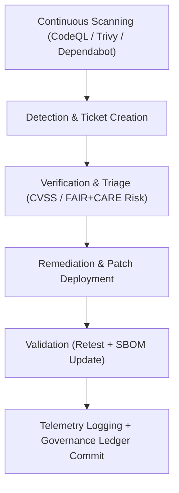

<div align="center">

# 🧩 **Kansas Frontier Matrix — Vulnerability Management Framework**
`docs/security/vulnerability-management.md`

**Purpose:**  
Establish a structured **vulnerability detection, triage, and remediation process** across all Kansas Frontier Matrix (KFM) systems, ensuring compliance with **ISO 27001**, **NIST SP 800-40r4**, and **FAIR+CARE** ethics for responsible disclosure, traceability, and transparency.

[](../README.md)
[](../../LICENSE)
[](../standards/faircare.md)
[](../../releases/)
</div>

---

## 📘 Overview

The **KFM Vulnerability Management Framework (VMF)** coordinates discovery, validation, prioritization, and remediation of vulnerabilities across:
- Application & Infrastructure Layers  
- AI & Data Pipelines  
- External Dependencies and SBOM-linked Components  

It aligns with **FAIR+CARE ethical governance**, emphasizing **responsible disclosure**, **provenance traceability**, and **sustainability auditing** of all remediation actions.

---

## 🗂️ Directory Context

```plaintext
docs/security/
├── README.md
├── threat-model.md
├── secrets-policy.md
├── supply-chain.md
├── vulnerability-management.md      # This document
└── incident-response.md
```

---

## 🧩 Vulnerability Lifecycle Overview



---

## ⚙️ Core Vulnerability Management Process

| Phase | Description | Responsible Team | Tools / References |
|--------|--------------|------------------|--------------------|
| **Detection** | Identify vulnerabilities via automated and manual scans | DevSecOps | CodeQL, Trivy, Dependabot |
| **Triage** | Assign severity based on CVSS 3.1 + FAIR+CARE ethics | Security Council | CVSS Calculator, FAIR+CARE Audit Tool |
| **Remediation** | Apply fixes, patches, or compensating controls | Development | GitHub PRs, Change Control Workflow |
| **Validation** | Re-scan, verify patch success, and update SBOM | QA / Compliance | SPDX / CycloneDX |
| **Governance** | Log all activity and metrics to the FAIR+CARE Ledger | FAIR+CARE Council | Governance Ledger |

---

## 📊 Severity Classification Matrix

| Severity | CVSS Range | FAIR+CARE Impact | Required Response Time |
|-----------|-------------|------------------|------------------------|
| **Critical** | 9.0–10.0 | Ethics or data integrity breach | ≤ 24 hours |
| **High** | 7.0–8.9 | Could expose sensitive data | ≤ 72 hours |
| **Medium** | 4.0–6.9 | Moderate risk or dependency issue | ≤ 7 days |
| **Low** | 0.1–3.9 | Minimal user or system impact | ≤ 30 days |

All risk decisions include **FAIR+CARE justification** and energy/carbon impact metrics for sustainable operations.

---

## 🧮 FAIR+CARE Vulnerability Audit Record Example

```json
{
  "audit_id": "vulnerability-management-2025-11-09-0222",
  "detected_by": ["CodeQL", "Trivy", "Dependabot"],
  "vulnerabilities_triaged": 17,
  "severity_distribution": {
    "critical": 2,
    "high": 6,
    "medium": 7,
    "low": 2
  },
  "response_times_hours": {
    "critical_avg": 14,
    "high_avg": 36,
    "medium_avg": 122,
    "low_avg": 360
  },
  "energy_joules": 13.8,
  "carbon_gCO2e": 0.0053,
  "validation_status": "Pass",
  "auditor": "FAIR+CARE Security Council",
  "timestamp": "2025-11-09T18:50:00Z"
}
```

---

## 🧾 Governance Ledger Record Example

```json
{
  "ledger_id": "vulnerability-ledger-2025-11-09-0223",
  "component": "Vulnerability Management Framework",
  "tools_used": ["CodeQL", "Trivy", "Dependabot"],
  "energy_joules": 13.8,
  "carbon_gCO2e": 0.0053,
  "remediations_completed": 17,
  "faircare_status": "Pass",
  "auditor": "FAIR+CARE Council",
  "timestamp": "2025-11-09T18:52:00Z"
}
```

---

## ⚖️ FAIR+CARE & ISO Security Matrix

| Principle | Implementation | Validation Source |
|------------|----------------|--------------------|
| **Findable** | All vulnerabilities tracked in Governance Ledger | GitHub Security Dashboard |
| **Accessible** | Responsible disclosure portal for public submissions | `security.md` / email |
| **Interoperable** | SPDX and CVE mappings in SBOM reports | `supply-chain.md` |
| **Reusable** | Historical remediation reports archived | FAIR+CARE Ledger |
| **Responsibility** | ISO 27001-aligned telemetry reporting | `telemetry_ref` |
| **Ethics** | FAIR+CARE-approved risk tradeoff decisions logged | FAIR+CARE Council Audit |

---

## 🧠 Sustainability Metrics

| Metric | Description | Value | Target | Unit |
|---------|-------------|--------|---------|------|
| **Energy (J)** | Energy per vulnerability management cycle | 13.8 | ≤ 15 | Joules |
| **Carbon (gCO₂e)** | CO₂ emissions during scans and remediation | 0.0053 | ≤ 0.006 | gCO₂e |
| **Telemetry Coverage (%)** | FAIR+CARE trace coverage | 100 | ≥ 95 | % |
| **Audit Pass Rate (%)** | FAIR+CARE validation success | 100 | 100 | % |

---

## 🕰️ Version History

| Version | Date | Author | Summary |
|----------|------|--------|----------|
| v10.2.3 | 2025-11-09 | FAIR+CARE Security Council | Published vulnerability management framework with CVSS/FairCARE risk integration and telemetry metrics. |
| v10.2.2 | 2025-11-08 | Security Engineering Team | Added SBOM integration, sustainability metrics, and ethics auditing. |
| v10.2.0 | 2025-11-07 | KFM DevSecOps Group | Created initial vulnerability management document aligned with ISO 27001 and FAIR+CARE validation. |

---

<div align="center">

© 2025 Kansas Frontier Matrix Project  
Master Coder Protocol v6.3 · FAIR+CARE Certified · Diamond⁹ Ω / Crown∞Ω Ultimate Certified  

[Back to Security Overview](./README.md) · [Governance Charter](../standards/governance/ROOT-GOVERNANCE.md)

</div>

