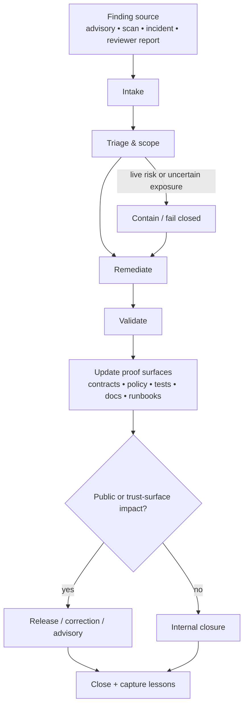

<!-- [KFM_META_BLOCK_V2]
doc_id: <NEEDS_VERIFICATION>
title: Vulnerability Management
type: standard
version: v1
status: draft
owners: <REVIEW-REQUIRED>
created: <NEEDS_VERIFICATION>
updated: <NEEDS_VERIFICATION>
policy_label: <NEEDS_VERIFICATION>
related: [docs/security/README.md, docs/security/threat-model.md, docs/security/vulns/README.md, policy/README.md, contracts/README.md, tests/README.md, .github/workflows/README.md, SECURITY.md]
tags: [kfm, security, vulnerability-management, remediation, advisories, correction]
notes: [doc_id owners created updated and policy_label need repo-backed values before merge, this file replaces a scaffold while keeping implementation claims bounded, workflow schema and policy inventories still need direct verification]
[/KFM_META_BLOCK_V2] -->

# Vulnerability Management

Governed intake, triage, remediation, validation, disclosure, and correction guidance for KFM security findings.

> [!IMPORTANT]
> **Status:** draft  
> **Owners:** `<REVIEW-REQUIRED>`  
>       
> **Quick jumps:** [Repo fit](#repo-fit) · [Current repo posture](#current-repo-posture) · [Quickstart](#quickstart) · [Vulnerability lifecycle](#vulnerability-lifecycle) · [Artifacts](#required-artifacts-and-proof-objects) · [Emergency lane](#emergency-hardening-lane) · [Definition of done](#gates-and-definition-of-done) · [Open verification](#open-verification-items)

## Status legend used in this file

| Label | Meaning here |
|---|---|
| **CONFIRMED** | Grounded in visible repo Markdown or adjacent repo structure. |
| **INFERRED** | A conservative completion aligned to KFM doctrine and neighboring docs, but not directly proven as mounted implementation. |
| **PROPOSED** | Repo-ready operating guidance that fits KFM’s doctrine and current documentation posture. |
| **UNKNOWN** | Not verified strongly enough to present as active repo, workflow, runtime, or deployment reality. |
| **NEEDS VERIFICATION** | A merge-time placeholder or repo-specific detail that should be replaced once the mounted checkout or runtime proof is inspected. |

## Repo fit

| Item | Value |
|---|---|
| **Path** | `docs/security/vulnerability-management.md` |
| **Role in repo** | Cross-cutting vulnerability handling and remediation lifecycle for the `docs/security/` subtree |
| **Upstream** | [`./README.md`](./README.md), [`../../SECURITY.md`](../../SECURITY.md) |
| **Adjacent / downstream** | [`./threat-model.md`](./threat-model.md), [`./vulns/README.md`](./vulns/README.md), [`./prompt-injection-defense.md`](./prompt-injection-defense.md), [`./ai-supply-chain/README.md`](./ai-supply-chain/README.md), [`./supply-chain/dependency-confusion/README.md`](./supply-chain/dependency-confusion/README.md), [`../../policy/README.md`](../../policy/README.md), [`../../contracts/README.md`](../../contracts/README.md), [`../../tests/README.md`](../../tests/README.md), [`../../.github/workflows/README.md`](../../.github/workflows/README.md) |
| **What this file should do** | Define how KFM records, scopes, contains, fixes, validates, discloses, and closes security findings without weakening the trust membrane or hiding correction state |
| **What this file must not do** | Duplicate canonical architecture manuals, replace executable policy or tests, store secrets, or imply that automation already exists when the repo has not verified it |

## Scope

This file owns the **lifecycle** of vulnerability handling in KFM.

That means it should answer questions like these:

- What counts as a vulnerability in a governed spatial-evidence system?
- What must happen first when a finding touches a public or steward-facing trust surface?
- Which artifacts must change together when remediation changes trust state?
- When is rollback enough, and when is a visible correction or advisory also required?
- How do docs, contracts, policy, tests, runbooks, and release evidence stay synchronized?

This file is intentionally **cross-cutting**. It should stay above issue-specific CVE notes, package advisories, or one-off incident timelines. Those deeper issue records belong in narrower lanes.

## What this file treats as a vulnerability

In KFM, a vulnerability is broader than a package CVE.

Anything that weakens governed publication, bypasses policy or evidence resolution, exposes unreleased or overly precise material, erases correction state, or lets a trust surface look healthier than it really is should be treated as vulnerability-management work.

| Vulnerability class | Typical examples | Why it matters in KFM |
|---|---|---|
| **Trust-membrane breach** | Direct client access to canonical stores, unpublished artifacts, model runtimes, or steward-only paths | Breaks the rule that normal/public clients stay downstream of governed APIs and promoted scope |
| **Evidence / provenance failure** | Missing drill-through, unresolved evidence references, uncited runtime answers, silent claim drift | KFM’s trust promise depends on inspectable evidence, not fluent output |
| **Rights / sensitivity exposure** | Exact-location leakage, overly precise release, unreviewed archival or community-contributed exposure | Publish safety is part of security, not a separate afterthought |
| **Policy / control gap** | Missing deny-by-default rule, review bypass, silent exception path, UI-only “policy” with no backend enforcement | Control needs executable and reviewable enforcement, not presentation-only cues |
| **Release / correction gap** | Silent hotfix, withdrawn state not visible, rollback with no correction lineage, stale projection still presented as current | Public trust depends on visible correction and release state |
| **Supply-chain / provenance concern** | Dependency confusion, unsigned or untraceable artifact path, vulnerable package upgrade with no review trail | KFM treats release integrity and provenance as security-bearing |
| **Runtime / AI / trust-surface issue** | Answer path that does not abstain or deny honestly, evidence resolution failure hidden behind smooth prose, model bypass | Bounded synthesis is subordinate to evidence, policy, and visible negative outcomes |

## Accepted inputs

| Input class | What belongs here | Usually pair with |
|---|---|---|
| **Package or component findings** | CVEs, advisories, dependency drift, provenance anomalies, integrity concerns | [`./vulns/README.md`](./vulns/README.md), [`./supply-chain/dependency-confusion/README.md`](./supply-chain/dependency-confusion/README.md) |
| **Trust-boundary findings** | API bypass risk, unauthorized surface exposure, hidden review path, canonical-store reachability | [`./threat-model.md`](./threat-model.md) |
| **Runtime trust failures** | Uncited answer path, incorrect deny/abstain/error handling, correction not visible, stale-visible bug | [`../../policy/README.md`](../../policy/README.md), [`../../contracts/README.md`](../../contracts/README.md), [`../../tests/README.md`](../../tests/README.md) |
| **Prompt-injection / secure AI findings** | Retrieval poisoning, unsafe instruction-following, model-runtime exposure, evidence-bypass behaviors | [`./prompt-injection-defense.md`](./prompt-injection-defense.md), [`./ai-supply-chain/README.md`](./ai-supply-chain/README.md) |
| **Operational reviewer findings** | Promotion-gate failures, rollback gaps, missing runbook coverage, evidence reconstruction failures | [`../../.github/workflows/README.md`](../../.github/workflows/README.md), [`../../tests/README.md`](../../tests/README.md) |
| **Emergency hardening findings** | Actively exploited issue, live exposure, rapidly widening blast radius, unsafe public surface state | This file first, then the narrower owning lane |

## Exclusions

| Keep out of this file | Put it instead | Why |
|---|---|---|
| **Secrets, keys, tokens, live credentials** | Secret manager, host/deployment environment, or other controlled runtime secret boundary | Docs must never become a secret surface |
| **Executable policy written as prose only** | [`../../policy/README.md`](../../policy/README.md) plus verified policy bundles, fixtures, and tests | Reviewer guidance belongs here; enforcement does not |
| **Canonical JSON Schema / OpenAPI bodies** | [`../../contracts/README.md`](../../contracts/README.md) and the verified contract home | Shared object shape should not fork here |
| **Issue-specific advisory text** | [`./vulns/README.md`](./vulns/README.md) and specific advisory files | This file owns the lifecycle, not the full incident archive |
| **Restricted evidence or sensitive raw artifacts** | Governed evidence stores and steward-only review lanes | Vulnerability management must not leak the material it is trying to protect |
| **Broad architecture duplicated verbatim** | [`./README.md`](./README.md), [`../../SECURITY.md`](../../SECURITY.md), and canonical KFM manuals | Keep this file operational and scoped |
| **Repo or runtime claims not directly evidenced** | Mark as **UNKNOWN** / **NEEDS VERIFICATION** until the mounted repo or runtime proves them | KFM requires visible uncertainty, not polished guesswork |

## Current repo posture

> [!NOTE]
> The current public tree confirms that this file exists, but it was scaffold-only at review time. The security subtree README explicitly routes **remediation policy and lifecycle** to this file. The guidance below is therefore written as the repo-ready expansion of that delegated role while keeping unverified automation and runtime claims visible.

| Signal | Posture | Meaning now |
|---|---|---|
| `./vulnerability-management.md` exists | **CONFIRMED** | This file is the right home, but it previously had placeholder content only |
| `./README.md` routes remediation lifecycle here | **CONFIRMED** | This file should own cross-cutting vulnerability handling for the subtree |
| `./vulns/` advisory lane exists | **CONFIRMED** | Use it for issue-specific records and bulletin-style detail |
| `../../contracts/README.md` exists | **CONFIRMED** | Contract vocabulary is documented and should be updated alongside behavior-significant remediation |
| `../../schemas/README.md` exists and guards against parallel schema authority | **CONFIRMED** | Avoid silently creating a second schema home here |
| `../../policy/README.md` exists and is framed around deny-by-default, reasons/obligations, and finite outcomes | **CONFIRMED** | Policy semantics should shape remediation and release behavior |
| `../../tests/README.md` exists and treats verification as governed proof burden | **CONFIRMED** | “Tests pass” alone is not enough for closure |
| `../../.github/workflows/README.md` exists | **CONFIRMED** | Workflow intent is documented in repo |
| Checked-in workflow YAML merge gates | **UNKNOWN / NEEDS VERIFICATION** | Public tree evidence should be inspected before this doc claims active merge-blocking automation |
| Checked-in `.schema.json` inventory | **UNKNOWN / NEEDS VERIFICATION** | Verify the actual machine-contract inventory before writing tool-specific runbooks |
| Checked-in policy bundles / rule files / policy tests | **UNKNOWN / NEEDS VERIFICATION** | Confirm the actual executable policy surface before naming engines or bundle paths as settled fact |
| Runtime emitters for `DecisionEnvelope`, `RuntimeResponseEnvelope`, or `CorrectionNotice` | **UNKNOWN / NEEDS VERIFICATION** | Treat doctrinal object families as required vocabulary, not proven runtime emissions |

## Quickstart

Start here when a new finding arrives and you need the smallest credible KFM response.

1. **Open the finding record immediately.** Name the source, first-seen time, affected path or surface, and whether the issue is public-facing, steward-facing, or internal only.
2. **Classify the trust consequence before polishing the fix.** Ask whether the issue weakens the trust membrane, evidence drill-through, rights/sensitivity handling, release integrity, or visible correction state.
3. **Contain first when trust is at risk.** Restrict, withdraw, generalize, deny, pause promotion, or roll back before you optimize convenience.
4. **Remediate with the owning lane.** Patch, rotate, rebuild, or narrow exposure in the relevant package, contract, policy, runtime, or surface.
5. **Update the proof surfaces together.** Docs, contracts, policy, tests, runbooks, and release evidence should move as one change set when behavior changes materially.
6. **Choose the right close path.** Internal closure is not the same as release, and release is not the same as correction or disclosure.

## Usage

| When you need to… | Start here | Then go deeper |
|---|---|---|
| Define KFM’s remediation lifecycle | This file | [`./README.md`](./README.md) for subtree orientation |
| Add or update a specific advisory / CVE note | This file for lifecycle expectations | [`./vulns/README.md`](./vulns/README.md) and the specific advisory file |
| Describe trust-boundary or bypass risk | This file for response handling | [`./threat-model.md`](./threat-model.md) |
| Capture secure AI or prompt-injection remediation | This file for lifecycle and disclosure posture | [`./prompt-injection-defense.md`](./prompt-injection-defense.md), [`./ai-supply-chain/README.md`](./ai-supply-chain/README.md) |
| Wire policy, contracts, tests, and gates to the remediation | This file for cross-cutting expectations | [`../../policy/README.md`](../../policy/README.md), [`../../contracts/README.md`](../../contracts/README.md), [`../../tests/README.md`](../../tests/README.md), [`../../.github/workflows/README.md`](../../.github/workflows/README.md) |
| Decide whether rollback or visible correction is required | This file | Narrower advisory, review, and release evidence lanes as verified in the mounted repo |

## Vulnerability lifecycle

A KFM vulnerability is not closed when code has changed. It is closed when the **trust consequence** has been contained, the **fix** has been validated, and the **visible state** is honest again.

| Phase | Primary goal | Minimum outputs | Fail-closed rule |
|---|---|---|---|
| **1. Intake and record** | Create an accountable starting point | Finding record, first-seen time, source, affected surface list, initial owner | If scope is unclear but risk is real, keep exposure narrow while triage continues |
| **2. Triage and scope** | Classify impact and choose the lane | Vulnerability class, affected actors, release window, severity rationale, owning docs/packages | Do not let “needs more info” become permission to stay publicly permissive |
| **3. Contain** | Stop unsafe trust behavior from spreading | Restrict, withdraw, generalize, pause promotion, deny, or rollback as appropriate | Prefer a visible safe state over a polished unsafe state |
| **4. Remediate** | Remove the flaw or weaken its blast radius materially | Patch, config change, key rotation, dependency replacement, review change, rebuild plan | No secret hotfixes for public-surface issues that change trust state |
| **5. Validate** | Prove the fix and the negative paths | Updated tests, negative fixtures, contract/policy checks, runtime behavior review, docs/runbook delta | Passing one happy-path check does not close the finding |
| **6. Release, correction, and disclose** | Re-enter safe release state honestly | Release note, proof-pack delta, correction note, advisory or bulletin if required | Do not silently replace a previously exposed or unsafe state without lineage |
| **7. Close and learn** | Convert the fix into durable operational memory | Closure note, owner sign-off, backlog item for structural gaps, runbook improvements | If systemic gaps remain, closure must say so explicitly |

### Working rule

A vulnerability fix should move **behavior**, **proof**, and **communication** together.

That means:

- fix the technical issue
- update the trust-bearing artifacts
- preserve rollback/correction visibility
- leave a narrower doc trail than the incident itself, but not an emptier one

## Diagram


```mermaid
flowchart TD
    A[Finding source<br/>advisory • scan • incident • reviewer report] --> B[Intake]
    B --> C[Triage & scope]
    C -->|live risk or uncertain exposure| D[Contain / fail closed]
    C --> E[Remediate]
    D --> E
    E --> F[Validate]
    F --> G[Update proof surfaces<br/>contracts • policy • tests • docs • runbooks]
    G --> H{Public or trust-surface impact?}
    H -->|yes| I[Release / correction / advisory]
    H -->|no| J[Internal closure]
    I --> K[Close + capture lessons]
    J --> K
```

Above: the lifecycle is intentionally **not** “scan → patch → done.” In KFM, the middle of the flow is where containment, proof, and visible correction keep security from becoming trust theater.

## Tables

### Required artifacts and proof objects

> [!IMPORTANT]
> The object names below are aligned to KFM doctrine. Their exact checked-in schema files, emitters, and runtime inventory remain **NEEDS VERIFICATION** in the current public tree. Use them as the governing vocabulary for review and implementation planning, not as a claim that the repo already emits every object today.

| Artifact / proof object | When it matters for vulnerability work | Minimum expectation |
|---|---|---|
| **DecisionEnvelope** | A finding changes what is allowed, denied, restricted, generalized, or routed to review | Reasonable machine-readable decision basis, reasons, obligations, and audit linkage |
| **ReviewRecord** | Human approval, denial, escalation, or exception handling is required | No silent override path for policy-significant exceptions |
| **ReleaseManifest / ReleaseProofPack** | Remediation changes shipped behavior, release safety, or rollback posture | Fix should be tied to release state, not only to a merge |
| **ProjectionBuildReceipt** | Maps, tiles, exports, search indexes, graph projections, or other derived layers were rebuilt | Derived surfaces should show they were rebuilt from known release scope |
| **EvidenceBundle** | A visible claim, story, export, or trust-bearing answer changed | The support path for the change remains reconstructable |
| **RuntimeResponseEnvelope** | Runtime ask/answer behavior, denial, abstention, or error handling changed | The outward result stays finite, inspectable, and accountable |
| **CorrectionNotice** | A previously released surface must be narrowed, withdrawn, superseded, or explicitly corrected | Correction remains visible instead of being erased |
| **Advisory / bulletin note** | The issue needs issue-specific reference material, user guidance, or public/steward communication | Advisory detail belongs in the advisory lane, not hidden in a generic fix note |
| **Fixtures / regression checks** | The vulnerability depends on boundary behavior, negative outcomes, or policy semantics | At least one negative path should stay locked after the fix |
| **Runbook delta** | Operators or reviewers would need to respond differently next time | Convert improvised response into repeatable practice |

### Default containment triggers

| Condition | Default response bias |
|---|---|
| **Trust membrane bypass or unauthorized direct access risk** | Contain immediately; pause broader rollout or publication until boundary safety is re-established |
| **Rights / sensitivity / exact-location exposure** | Withdraw, restrict, or generalize first; do not wait for a perfect long-term fix before narrowing exposure |
| **Runtime can still produce confident unsupported output** | Prefer explicit `ABSTAIN`, `DENY`, or `ERROR` behavior over graceful-looking guesswork |
| **Policy / contract drift with no proof surface** | Block promotion until the shared meaning is explicit and testable |
| **Package advisory with no proven public exploit path** | Patch on the normal lane, but still record affected versions, verification burden, and disclosure decision |
| **Post-release issue already visible on a public or steward surface** | Treat visible correction as first-class work; no quiet hotfixes that erase history |

### Where follow-up changes belong

| Change class | Primary lane | Common companion lanes |
|---|---|---|
| **Cross-cutting remediation lifecycle** | `docs/security/vulnerability-management.md` | `docs/security/README.md`, `SECURITY.md` |
| **Issue-specific advisory / CVE note** | `docs/security/vulns/` | release evidence, tests, advisory references |
| **Trust-boundary or bypass detail** | `docs/security/threat-model.md` | policy, contracts, tests |
| **Prompt-injection / secure AI remediation** | `docs/security/prompt-injection-defense.md` | `docs/security/ai-supply-chain/README.md`, policy, tests |
| **Dependency confusion / provenance issue** | `docs/security/supply-chain/dependency-confusion/README.md` | contracts, workflow gates, advisories |
| **Executable policy semantics** | `policy/` and the verified runtime policy seam | contracts, tests, workflow gates |
| **Shared object shape / runtime envelopes** | `contracts/` | policy, tests, governed API/runtime lanes |
| **Verification harnesses / fixtures** | `tests/` | contracts, policy, workflow gates |
| **CI or promotion automation** | `.github/workflows/` | docs, contracts, tests, release evidence |
| **Runbook and rollback handling** | verified runbook path under `docs/` | release evidence, correction note, operator review |

## Emergency hardening lane

> [!WARNING]
> When a finding can affect public or steward trust surfaces, default to containment that preserves the trust membrane. A visible safe limitation is better than a polished unsafe continuation.

Use this lane when exploitability is live, blast radius is widening, or the finding can invalidate public-safe release posture.

1. **Name the affected releases and surfaces first.** Do not harden blindly.
2. **Choose the safest immediate state.** Restrict, deny, withdraw, generalize, pause promotion, or roll back.
3. **Preserve evidence while acting quickly.** Save timestamps, scope notes, impacted paths, and temporary decisions.
4. **Patch or replace the risky component.** This may be code, config, runtime boundary, key material, review policy, or derived artifact build logic.
5. **Validate the negative paths.** Emergency fixes must prove that unsafe behavior no longer sneaks through.
6. **Publish correction or advisory material when trust state changed visibly.** No quiet erasure of previously exposed states.
7. **Convert heroics into runbooks.** If responders had to improvise, the repo should not be satisfied with that as the final state.

## Gates and definition of done

A vulnerability item is ready to close only when the relevant trust surfaces are honestly back inside governed bounds.

- [ ] The finding source, first-seen time, affected surface class, and affected actor scope are recorded.
- [ ] Containment is complete, or a reviewer explicitly documented why containment was not needed.
- [ ] The technical remediation is applied: patch, rollback, rebuild, rotate, replace, or restrict.
- [ ] Any behavior-significant change updated the right companion surfaces: docs, contracts, policy, tests, runbooks, and release evidence.
- [ ] Negative-path behavior is checked where the finding touched policy, runtime outcomes, trust surfaces, or correction visibility.
- [ ] Any public or steward-facing change that altered trust state has an explicit correction, withdrawal, narrowing, or advisory path.
- [ ] No secrets, raw restricted evidence, or overly precise sensitive details were added to docs.
- [ ] Remaining uncertainty is labeled **UNKNOWN** / **NEEDS VERIFICATION**, not polished away.
- [ ] Follow-up owner and next verification step are captured when the finding closes with residual risk or structural backlog.
- [ ] The close note explains why the system is safer now, not only what file changed.

## Open verification items

| Item | Why it is still open | What to verify before merge |
|---|---|---|
| **Metadata block values** | `doc_id`, owners, created, updated, and policy label are not repo-backed in current evidence | Replace placeholders with repo-backed values |
| **Checked-in workflow YAML inventory** | Public tree review showed workflow README guidance, not proven active YAML gates | Inspect `.github/workflows/` directly in the mounted checkout |
| **Authoritative machine-contract inventory** | Contract doctrine exists, but exact `.schema.json` home and inventory remain unsettled in current evidence | Inspect `contracts/` and `schemas/` before naming exact validator flows |
| **Executable policy bundle inventory** | Policy guidance exists, but actual mounted rule files/tests were not proven in current public evidence | Confirm the real policy engine, file types, fixtures, and runtime seam |
| **Runtime trust-object emitters** | `DecisionEnvelope`, `ReviewRecord`, `RuntimeResponseEnvelope`, and `CorrectionNotice` are doctrinally important but not yet proven as mounted emitters here | Verify schemas, runtime code paths, and sample outputs |
| **Additional downstream security docs referenced by subtree index** | Some paths are named in `docs/security/README.md` but were not visible in the current public `docs/security/` tree snapshot | Reconcile links like `secrets-policy.md` or `supply-chain.md` against the mounted checkout |
| **Threat-model companion depth** | `./threat-model.md` exists, but was scaffold-only at review time | Decide whether deeper trust-boundary detail lands there in the same PR or a follow-up |
| **Advisory naming / bulletin convention** | `./vulns/` exists with examples, but closure naming rules are not fully standardized here | Verify current repo convention before adding issue-specific files |

## FAQ

### Does this file prove that KFM already has executable vulnerability automation?

No.

This file defines the lifecycle and the required proof posture. It does **not** prove that checked-in workflow YAML, schema inventories, executable policy bundles, or runtime emitters are already mounted.

### Is every KFM vulnerability a CVE?

No.

A CVE is only one input source. In KFM, trust-membrane bypasses, evidence-resolution failures, exact-location exposure, silent correction loss, or uncited runtime behavior can also be vulnerability-management work.

### When is rollback enough?

Rollback can be enough only when it restores a safe and honest state **and** the trust consequence does not require a visible correction or advisory path. If a public or steward-facing state changed materially, visibility usually matters as much as the rollback itself.

### When is a visible correction or advisory required?

Use a visible correction or advisory when a released surface must be narrowed, withdrawn, superseded, or explained to maintain trust. Quiet replacement is not the default answer for published trust-bearing behavior.

### Where do issue-specific advisories belong?

Use this file for lifecycle and response policy, then put issue-specific detail in [`./vulns/README.md`](./vulns/README.md) and the owning advisory file.

## Appendix

<details>
<summary><strong>Illustrative starter finding record (PROPOSED)</strong></summary>

This is a starter shape for review and discussion only. It is not a claim that the mounted repo already uses this exact record.

```yaml
finding_id: <NEEDS_VERIFICATION>
reported_from: advisory | scan | incident | user-report | review
reported_at: <timestamp>
reported_by: <actor or team>
classification:
  class: trust-membrane | evidence | rights-sensitivity | supply-chain | runtime-ai | release-correction | availability
  severity: <local scale needs verification>
affected_scope:
  paths: []
  packages: []
  surfaces: []
  actors: [public, steward, analyst, educator]
  release_refs: []
current_state:
  containment: none | restrict | generalize | withdraw | deny | rollback | paused-promotion
  public_exposure: true | false | unknown
  steward_exposure: true | false | unknown
required_follow_up:
  docs: true
  contracts: false
  policy: false
  tests: true
  runbooks: true
  release_evidence: true
communication:
  advisory_required: false
  correction_required: false
  bulletin_required: false
verification:
  negative_paths_checked: []
  unresolved_items: []
owners:
  remediation: <REVIEW-REQUIRED>
  review: <REVIEW-REQUIRED>
notes: >
  Keep unknowns explicit. Do not store secrets or restricted raw evidence here.
```

</details>

<details>
<summary><strong>Illustrative closure note checklist (PROPOSED)</strong></summary>

- What exactly was vulnerable?
- Which surfaces, actor classes, and release refs were affected?
- What containment state was used first?
- What fixed it: patch, rollback, rebuild, rotate, restrict, or withdraw?
- Which proof surfaces changed: docs, contracts, policy, tests, runbooks, release evidence?
- Was a correction or advisory required?
- What remains open?
- What must become repeatable next time?

</details>

[Back to top](#vulnerability-management)
