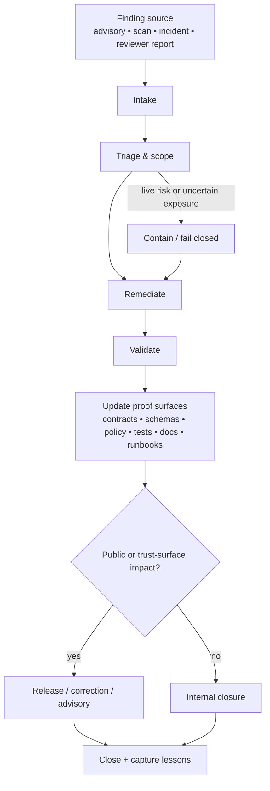

<!-- [KFM_META_BLOCK_V2]
doc_id: <NEEDS_VERIFICATION>
title: Vulnerability Management
type: standard
version: v1
status: draft
owners: @bartytime4life
created: 2025-11-09
updated: 2026-03-30
policy_label: <NEEDS_VERIFICATION>
related: [docs/security/README.md, docs/security/threat-model.md, docs/security/vulns/README.md, docs/security/bulletins/README.md, docs/security/supply-chain/README.md, docs/security/ai-supply-chain/README.md, docs/security/ai-receipts/README.md, docs/security/prompt-injection/README.md, docs/security/prompt-injection-defense.md, policy/README.md, contracts/README.md, schemas/README.md, tests/README.md, .github/actions/README.md, .github/workflows/README.md, SECURITY.md, .github/SECURITY.md]
tags: [kfm, security, vulnerability-management, remediation, disclosure, correction]
notes: [doc_id and policy_label still need repo-backed canonical values, owners are grounded to current public CODEOWNERS coverage for /docs/, created and updated reflect current public git history for this file, current public main now shows placeholder-heavy contract and control-plane surfaces that this doc should reference without overstating execution depth]
[/KFM_META_BLOCK_V2] -->

# Vulnerability Management

Governed intake, triage, containment, remediation, validation, disclosure, and correction guidance for KFM security findings.

> [!IMPORTANT]
> **Status:** draft  
> **Owners:** `@bartytime4life`  
>       
> **Quick jumps:** [Repo fit](#repo-fit) · [Current public signals](#current-public-signals) · [Quickstart](#quickstart) · [Vulnerability lifecycle](#vulnerability-lifecycle) · [Artifacts](#required-artifacts-and-proof-objects) · [Companion lanes](#where-follow-up-changes-belong) · [Definition of done](#gates-and-definition-of-done) · [Open verification](#open-verification-items)

> [!NOTE]
> This revision is **current-public-main grounded** and **doctrine-bounded**.
>
> It does **not** claim direct verification of private GitHub rulesets, required checks, OIDC wiring, deployment overlays, live runtime emitters, or non-public proof packs. Keep those claims labeled as **UNKNOWN** or **NEEDS VERIFICATION** until the active branch or runtime proves them.

## Status legend used in this file

| Label | Meaning here |
|---|---|
| **CONFIRMED** | Grounded in current visible repo evidence, current public GitHub structure, or attached doctrinal documents reviewed for this revision. |
| **INFERRED** | A conservative completion aligned to KFM doctrine and current repo signals, but not directly proven as mounted implementation reality. |
| **PROPOSED** | Repo-ready operating guidance that fits KFM doctrine and the current documentation posture. |
| **UNKNOWN** | Not verified strongly enough in this session to present as active repo, workflow, runtime, or deployment reality. |
| **NEEDS VERIFICATION** | A merge-time placeholder or repo-specific detail that should be replaced once the mounted checkout or runtime proof is inspected. |

## Repo fit

| Item | Value |
|---|---|
| **Path** | `docs/security/vulnerability-management.md` |
| **Role in repo** | Cross-cutting vulnerability-handling and remediation-lifecycle guide for the `docs/security/` subtree |
| **Upstream** | [`./README.md`](./README.md), [`../../SECURITY.md`](../../SECURITY.md), [`../../.github/SECURITY.md`](../../.github/SECURITY.md) |
| **Adjacent / downstream** | [`./threat-model.md`](./threat-model.md), [`./vulns/README.md`](./vulns/README.md), [`./bulletins/README.md`](./bulletins/README.md), [`./supply-chain/README.md`](./supply-chain/README.md), [`./supply-chain/dependency-confusion/README.md`](./supply-chain/dependency-confusion/README.md), [`./supply-chain/sigstore-cosign-v3/README.md`](./supply-chain/sigstore-cosign-v3/README.md), [`./prompt-injection/README.md`](./prompt-injection/README.md), [`./prompt-injection-defense.md`](./prompt-injection-defense.md), [`./ai-supply-chain/README.md`](./ai-supply-chain/README.md), [`./ai-receipts/README.md`](./ai-receipts/README.md), [`../../policy/README.md`](../../policy/README.md), [`../../contracts/README.md`](../../contracts/README.md), [`../../schemas/README.md`](../../schemas/README.md), [`../../tests/README.md`](../../tests/README.md), [`../../.github/actions/README.md`](../../.github/actions/README.md), [`../../.github/workflows/README.md`](../../.github/workflows/README.md) |
| **Accepted inputs** | Package advisories, trust-boundary findings, evidence-resolution failures, runtime trust failures, rights/sensitivity exposures, grouped upstream bulletins, AI-assisted remediation or receipt gaps, release/correction gaps, and supply-chain/provenance concerns |
| **Exclusions** | Secrets, canonical schema bodies, executable policy bundles, live credentials, and issue-specific bulletin or advisory detail that belongs in narrower lanes |
| **What this file should do** | Define how KFM records, scopes, contains, fixes, validates, discloses, and closes security findings without weakening the trust membrane or hiding correction state |
| **What this file must not do** | Replace executable policy or tests, duplicate canonical architecture manuals, store sensitive evidence, or imply automation/runtime behavior that current repo evidence does not prove |

## Scope

This file owns the **lifecycle** of vulnerability handling in KFM.

That means it should answer questions like these:

- What counts as a vulnerability in a governed spatial-evidence system?
- What must happen first when a finding touches a public or steward-facing trust surface?
- Which artifacts must change together when remediation changes trust state?
- When is rollback enough, and when is a visible correction or advisory also required?
- How do docs, contracts, policy, tests, runbooks, and release evidence stay synchronized?

This file is intentionally **cross-cutting**. It should stay above issue-specific CVE notes, package advisories, or one-off incident timelines. Those deeper issue records belong in narrower lanes.

## What this file treats as a vulnerability

In KFM, a vulnerability is broader than a package CVE.

Anything that weakens governed publication, bypasses policy or evidence resolution, exposes unreleased or overly precise material, erases correction state, or lets a trust surface look healthier than it really is should be treated as vulnerability-management work.

| Vulnerability class | Typical examples | Why it matters in KFM |
|---|---|---|
| **Trust-membrane breach** | Direct client access to canonical stores, unpublished artifacts, model runtimes, or steward-only paths | Breaks the rule that normal/public clients stay downstream of governed APIs and promoted scope |
| **Evidence / provenance failure** | Missing drill-through, unresolved evidence references, uncited runtime answers, silent claim drift | KFM’s trust promise depends on inspectable evidence, not fluent output |
| **Rights / sensitivity exposure** | Exact-location leakage, overly precise release, unreviewed archival or community-contributed exposure | Publish safety is part of security, not a separate afterthought |
| **Policy / control gap** | Missing deny-by-default rule, review bypass, silent exception path, UI-only “policy” with no backend enforcement | Control needs executable and reviewable enforcement, not presentation-only cues |
| **Release / correction gap** | Silent hotfix, withdrawn state not visible, rollback with no correction lineage, stale projection still presented as current | Public trust depends on visible correction and release state |
| **Supply-chain / provenance concern** | Dependency confusion, unsigned or untraceable artifact path, vulnerable package upgrade with no review trail | KFM treats release integrity and provenance as security-bearing |
| **Runtime / AI / trust-surface issue** | Answer path that does not abstain or deny honestly, evidence resolution failure hidden behind smooth prose, model bypass | Bounded synthesis is subordinate to evidence, policy, and visible negative outcomes |

## Accepted inputs

| Input class | What belongs here | Usually pair with |
|---|---|---|
| **Package or component findings** | CVEs, advisories, dependency drift, provenance anomalies, integrity concerns | [`./vulns/README.md`](./vulns/README.md), [`./supply-chain/dependency-confusion/README.md`](./supply-chain/dependency-confusion/README.md) |
| **Trust-boundary findings** | API bypass risk, unauthorized surface exposure, hidden review path, canonical-store reachability | [`./threat-model.md`](./threat-model.md) |
| **Runtime trust failures** | Uncited answer path, incorrect deny/abstain/error handling, correction not visible, stale-visible behavior | [`../../policy/README.md`](../../policy/README.md), [`../../contracts/README.md`](../../contracts/README.md), [`../../tests/README.md`](../../tests/README.md) |
| **Prompt-injection / secure AI findings** | Retrieval poisoning, unsafe instruction-following, model-runtime exposure, evidence-bypass behavior | [`./prompt-injection/README.md`](./prompt-injection/README.md), [`./prompt-injection-defense.md`](./prompt-injection-defense.md), [`./ai-supply-chain/README.md`](./ai-supply-chain/README.md) |
| **AI-assisted remediation / review evidence** | AI-generated diff review, evaluator artifacts, receipt or attestation gaps, model/runtime provenance questions | [`./ai-receipts/README.md`](./ai-receipts/README.md), [`./ai-supply-chain/README.md`](./ai-supply-chain/README.md) |
| **Grouped vendor / platform bulletins** | Upstream bulletin families that need KFM routing, triage, or follow-on issue splitting | [`./bulletins/README.md`](./bulletins/README.md), [`./vulns/README.md`](./vulns/README.md) |
| **Operational reviewer findings** | Promotion-gate failures, rollback gaps, missing runbook coverage, evidence reconstruction failures | [`../../.github/actions/README.md`](../../.github/actions/README.md), [`../../.github/workflows/README.md`](../../.github/workflows/README.md), [`../../tests/README.md`](../../tests/README.md) |
| **Emergency hardening findings** | Actively exploited issue, live exposure, rapidly widening blast radius, unsafe public surface state | This file first, then the narrower owning lane |

## Exclusions

| Keep out of this file | Put it instead | Why |
|---|---|---|
| **Secrets, keys, tokens, live credentials** | Secret manager, deployment environment, or other controlled runtime secret boundary | Docs must never become a secret surface |
| **Executable policy written as prose only** | [`../../policy/README.md`](../../policy/README.md) plus verified policy bundles, fixtures, and tests | Reviewer guidance belongs here; enforcement does not |
| **Canonical JSON Schema / OpenAPI bodies** | [`../../contracts/README.md`](../../contracts/README.md), [`../../schemas/README.md`](../../schemas/README.md), and the active authoritative contract home | Shared object shape should not fork here |
| **Issue-specific advisory text** | [`./vulns/README.md`](./vulns/README.md) and specific advisory files | This file owns the lifecycle, not the full incident archive |
| **Grouped bulletin detail treated as local exposure proof** | [`./bulletins/README.md`](./bulletins/README.md) plus the owning advisory or review lane | A bulletin is not automatic proof of local impact |
| **Restricted evidence or sensitive raw artifacts** | Governed evidence stores and steward-only review lanes | Vulnerability management must not leak the material it is trying to protect |
| **Broad architecture duplicated verbatim** | [`./README.md`](./README.md), [`../../SECURITY.md`](../../SECURITY.md), and canonical KFM manuals | Keep this file operational and scoped |
| **Repo or runtime claims not directly evidenced** | Mark as **UNKNOWN** / **NEEDS VERIFICATION** until the mounted checkout or runtime proves them | KFM requires visible uncertainty, not polished guesswork |

## Current public signals

| Signal | Posture | Meaning now |
|---|---|---|
| `./vulnerability-management.md` exists and is already a substantive draft | **CONFIRMED** | This remains the correct home for remediation lifecycle guidance on current public `main` |
| `./README.md` routes remediation lifecycle here | **CONFIRMED** | The subtree index still delegates cross-cutting remediation handling to this file |
| `./threat-model.md`, `./vulns/README.md`, and `./bulletins/README.md` are visible sibling lanes | **CONFIRMED** | Threat detail, issue-specific advisories, and grouped bulletin routing now have separate homes |
| `./prompt-injection/README.md`, `./prompt-injection-defense.md`, `./ai-supply-chain/README.md`, and `./ai-receipts/README.md` are visible adjacent AI/security surfaces | **CONFIRMED** | AI-bearing findings should route into narrower companion lanes instead of inflating this file |
| `./supply-chain/README.md`, `./supply-chain/dependency-confusion/README.md`, and `./supply-chain/sigstore-cosign-v3/README.md` are visible | **CONFIRMED** | Dependency and release-integrity follow-up can stay narrower than this lifecycle doc |
| `../../schemas/contracts/v1/` is a real public subtree with eight family lanes and checked-in `*.schema.json` filenames | **CONFIRMED** | Public `main` now proves contract-family names such as `SourceDescriptor`, `DatasetVersion`, `EvidenceBundle`, `DecisionEnvelope`, `ReleaseManifest`, `RuntimeResponseEnvelope`, and `CorrectionNotice` |
| The current public `v1` contract README says those eight schema bodies are still `{}` | **CONFIRMED** | Use the family names; do not pretend field-level contract maturity |
| `../../policy/` has child lanes, but public `main` still shows them as README-led; `../../tests/policy/` has a visible `genealogy/README.md` lane | **CONFIRMED** | Some policy and proof shape exists, but executable bundle depth still needs direct verification |
| `../../.github/actions/` exposes `opa-gate/`, `provenance-guard/`, and `sbom-produce-and-sign/` placeholder directories while `../../.github/workflows/` remains README-only | **CONFIRMED** | Control-plane intent is visible, but live callers and merge-blocking automation are not proven |
| Private GitHub rulesets, active required checks, populated `.rego` bundles, runtime emitters, and release-proof examples | **UNKNOWN / NEEDS VERIFICATION** | Do not overclaim end-to-end enforcement |

> [!WARNING]
> Current public `main` now gives this file more routing context than a pure scaffold-era read.
>
> It still does **not** prove live merge-blocking workflow YAML, populated policy bundles, or runtime emitters. Keep those claims labeled instead of flattening them into “already enforced.”

[Back to top](#vulnerability-management)

## Quickstart

Start here when a new finding arrives and you need the smallest credible KFM response.

1. **Open the finding record immediately.** Name the source, first-seen time, affected path or surface, and whether the issue is public-facing, steward-facing, or internal only.
2. **Classify the trust consequence before polishing the fix.** Ask whether the issue weakens the trust membrane, evidence drill-through, rights/sensitivity handling, release integrity, or visible correction state.
3. **Check the narrow lane before you duplicate it.** Decide whether the finding belongs mainly in threat modeling, advisories, bulletins, supply chain, prompt injection, AI receipts, or this cross-cutting lifecycle file.
4. **Contain first when trust is at risk.** Restrict, withdraw, generalize, deny, pause promotion, or roll back before you optimize convenience.
5. **Remediate with the owning lane.** Patch, rotate, rebuild, narrow exposure, or harden the relevant package, contract, policy, runtime, action, workflow, or surface.
6. **Update the proof surfaces together.** Docs, contracts, schemas, policy, tests, runbooks, and release evidence should move as one change set when behavior changes materially.
7. **Choose the right close path.** Internal closure is not the same as release, and release is not the same as correction or disclosure.

## Usage

| When you need to… | Start here | Then go deeper |
|---|---|---|
| Define KFM’s remediation lifecycle | This file | [`./README.md`](./README.md) for subtree orientation |
| Add or update a specific advisory / CVE note | This file for lifecycle expectations | [`./vulns/README.md`](./vulns/README.md) and the specific advisory file |
| Route a grouped upstream platform or vendor bulletin | This file for lifecycle bias | [`./bulletins/README.md`](./bulletins/README.md) and the family bulletin leaf |
| Describe trust-boundary or bypass risk | This file for response handling | [`./threat-model.md`](./threat-model.md) |
| Capture prompt-injection or hostile-input remediation | This file for lifecycle and disclosure posture | [`./prompt-injection/README.md`](./prompt-injection/README.md), [`./prompt-injection-defense.md`](./prompt-injection-defense.md) |
| Capture AI-runtime, model-provenance, or AI-receipt follow-up | This file for closure expectations | [`./ai-supply-chain/README.md`](./ai-supply-chain/README.md), [`./ai-receipts/README.md`](./ai-receipts/README.md) |
| Wire policy, contracts, tests, or control-plane glue to the remediation | This file for cross-cutting expectations | [`../../policy/README.md`](../../policy/README.md), [`../../contracts/README.md`](../../contracts/README.md), [`../../schemas/README.md`](../../schemas/README.md), [`../../tests/README.md`](../../tests/README.md), [`../../.github/actions/README.md`](../../.github/actions/README.md), [`../../.github/workflows/README.md`](../../.github/workflows/README.md) |
| Decide whether rollback or visible correction is required | This file | Narrower advisory, review, and release-evidence lanes as verified in the mounted repo |

## Vulnerability lifecycle

A KFM vulnerability is not closed when code has changed.

It is closed when the **trust consequence** has been contained, the **fix** has been validated, and the **visible state** is honest again.

| Phase | Primary goal | Minimum outputs | Fail-closed rule |
|---|---|---|---|
| **1. Intake and record** | Create an accountable starting point | Finding record, first-seen time, source, affected surface list, initial owner | If scope is unclear but risk is real, keep exposure narrow while triage continues |
| **2. Triage and scope** | Classify impact and choose the lane | Vulnerability class, affected actors, release window, severity rationale, owning docs/packages | Do not let “needs more info” become permission to stay publicly permissive |
| **3. Contain** | Stop unsafe trust behavior from spreading | Restrict, withdraw, generalize, pause promotion, deny, or rollback as appropriate | Prefer a visible safe state over a polished unsafe state |
| **4. Remediate** | Remove the flaw or weaken its blast radius materially | Patch, config change, key rotation, dependency replacement, review change, rebuild plan | No secret hotfixes for public-surface issues that change trust state |
| **5. Validate** | Prove the fix and the negative paths | Updated tests, negative fixtures, contract/policy checks, runtime behavior review, docs/runbook delta | Passing one happy-path check does not close the finding |
| **6. Release, correction, and disclose** | Re-enter safe release state honestly | Release note, proof-pack delta, correction note, advisory or bulletin if required | Do not silently replace a previously exposed or unsafe state without lineage |
| **7. Close and learn** | Convert the fix into durable operational memory | Closure note, owner sign-off, backlog item for structural gaps, runbook improvements | If systemic gaps remain, closure must say so explicitly |

### Working rule

A vulnerability fix should move **behavior**, **proof**, and **communication** together.

That means:

- fix the technical issue
- update the trust-bearing artifacts
- preserve rollback/correction visibility
- leave a narrower doc trail than the incident itself, but not an emptier one

## Diagram

```mermaid
flowchart TD
    A[Finding source<br/>advisory • scan • incident • reviewer report] --> B[Intake]
    B --> C[Triage & scope]
    C -->|live risk or uncertain exposure| D[Contain / fail closed]
    C --> E[Remediate]
    D --> E
    E --> F[Validate]
    F --> G[Update proof surfaces<br/>contracts • schemas • policy • tests • docs • runbooks]
    G --> H{Public or trust-surface impact?}
    H -->|yes| I[Release / correction / advisory]
    H -->|no| J[Internal closure]
    I --> K[Close + capture lessons]
    J --> K
```

Above: the lifecycle is intentionally **not** “scan → patch → done.” In KFM, the middle of the flow is where containment, proof, and visible correction keep security from becoming trust theater.

## Tables

### Required artifacts and proof objects

> [!IMPORTANT]
> The object names below are aligned to KFM doctrine and current repo vocabulary. Their exact checked-in schema bodies, emitters, and runtime inventory remain mixed:
>
> - some family names are now **public-tree visible**
> - some are still **doctrine-first or PROPOSED**
> - none should be treated as fully enforced unless the active branch proves them

| Artifact / proof object | When it matters for vulnerability work | Minimum expectation |
|---|---|---|
| **SourceDescriptor** | A finding depends on what a source, feed, registry, or external bulletin was allowed to mean | Source identity, access mode, and rights/security context remain reconstructable |
| **DatasetVersion** | A remediation changes a release-bearing dataset or derived dataset state | The change ties to a stable version, not a silent overwrite |
| **DecisionEnvelope** | A finding changes what is allowed, denied, restricted, generalized, or routed to review | Reasonable machine-readable decision basis, reasons, obligations, and audit linkage |
| **ReviewRecord** | Human approval, denial, escalation, or exception handling is required | No silent override path for policy-significant exceptions |
| **ReleaseManifest / ReleaseProofPack** | Remediation changes shipped behavior, release safety, or rollback posture | Fix should be tied to release state, not only to a merge |
| **ProjectionBuildReceipt** | Maps, tiles, exports, search indexes, graph projections, or other derived layers were rebuilt | Derived surfaces should show they were rebuilt from known release scope |
| **EvidenceBundle** | A visible claim, story, export, or trust-bearing answer changed | The support path for the change remains reconstructable |
| **RuntimeResponseEnvelope** | Runtime ask/answer behavior, denial, abstention, or error handling changed | The outward result stays finite, inspectable, and accountable |
| **CorrectionNotice** | A previously released surface must be narrowed, withdrawn, superseded, or explicitly corrected | Correction remains visible instead of being erased |
| **AIReceipt / run receipt** | AI-assisted remediation, evaluator output, or review-bearing AI notes were involved | Keep model/runtime identity, evidence refs, and decision linkage reviewable (**PROPOSED** family; mounted implementation still needs verification) |
| **Advisory / bulletin note** | The issue needs issue-specific reference material, grouped upstream routing, or public/steward communication | Detail belongs in the narrower advisory or bulletin lane, not hidden in a generic fix note |
| **Fixtures / regression checks** | The vulnerability depends on boundary behavior, negative outcomes, or policy semantics | At least one negative path should stay locked after the fix |
| **Runbook delta** | Operators or reviewers would need to respond differently next time | Convert improvised response into repeatable practice |

> [!NOTE]
> Current public `main` now exposes machine-file family names under [`../../schemas/contracts/v1/`](../../schemas/contracts/v1/README.md) for `SourceDescriptor`, `DatasetVersion`, `EvidenceBundle`, `DecisionEnvelope`, `ReleaseManifest`, `RuntimeResponseEnvelope`, and `CorrectionNotice`.
>
> The same public `v1` README reports those current schema bodies as `{}`. Use the names confidently; keep field-level requirements reviewable until the active branch proves real schemas.

### Default containment triggers

| Condition | Default response bias |
|---|---|
| **Trust membrane bypass or unauthorized direct access risk** | Contain immediately; pause broader rollout or publication until boundary safety is re-established |
| **Rights / sensitivity / exact-location exposure** | Withdraw, restrict, or generalize first; do not wait for a perfect long-term fix before narrowing exposure |
| **Runtime can still produce confident unsupported output** | Prefer explicit `ABSTAIN`, `DENY`, or `ERROR` behavior over graceful-looking guesswork |
| **Policy / contract drift with no proof surface** | Block promotion until the shared meaning is explicit and testable |
| **Signing, attestation, or release-proof linkage missing after a security-significant rebuild** | Hold publish or promotion until provenance and correction memory are reconstructable |
| **Package advisory with no proven public exploit path** | Patch on the normal lane, but still record affected versions, verification burden, and disclosure decision |
| **Post-release issue already visible on a public or steward surface** | Treat visible correction as first-class work; no quiet hotfixes that erase history |

### Where follow-up changes belong

| Change class | Primary lane | Common companion lanes |
|---|---|---|
| **Cross-cutting remediation lifecycle** | `docs/security/vulnerability-management.md` | `docs/security/README.md`, `SECURITY.md`, `.github/SECURITY.md` |
| **Issue-specific advisory / CVE note** | `docs/security/vulns/` | release evidence, tests, advisory references |
| **Grouped vendor / platform bulletin** | `docs/security/bulletins/` | `docs/security/vulns/`, release notes, review records |
| **Trust-boundary or bypass detail** | `docs/security/threat-model.md` | policy, contracts, schemas, tests |
| **Prompt-injection or hostile-input handling** | `docs/security/prompt-injection/README.md` or `docs/security/prompt-injection-defense.md` | `docs/security/ai-supply-chain/README.md`, policy, tests |
| **AI-runtime provenance or AI-receipt follow-up** | `docs/security/ai-supply-chain/README.md`, `docs/security/ai-receipts/README.md` | contracts, policy, tests, actions/workflows |
| **Dependency-origin or release-provenance issue** | `docs/security/supply-chain/README.md` | `dependency-confusion/`, `sigstore-cosign-v3/`, contracts, policy, workflow gates |
| **Executable policy semantics** | `policy/` and the verified runtime policy seam | contracts, tests, actions/workflows |
| **Machine contract or schema-body change** | `contracts/` plus `schemas/` | `schemas/contracts/v1/`, `tests/contracts/`, policy |
| **Local action / control-plane glue** | `.github/actions/README.md` | `.github/workflows/README.md`, policy, tests |
| **CI or promotion automation** | `.github/workflows/` | docs, contracts, policy, tests, release evidence |
| **Runbook and rollback handling** | verified runbook path under `docs/` | release evidence, correction note, operator review |

[Back to top](#vulnerability-management)

## Emergency hardening lane

> [!WARNING]
> When a finding can affect public or steward trust surfaces, default to containment that preserves the trust membrane.
>
> A visible safe limitation is better than a polished unsafe continuation.

Use this lane when exploitability is live, blast radius is widening, or the finding can invalidate public-safe release posture.

1. **Name the affected releases and surfaces first.** Do not harden blindly.
2. **Choose the safest immediate state.** Restrict, deny, withdraw, generalize, pause promotion, or roll back.
3. **Preserve evidence while acting quickly.** Save timestamps, scope notes, impacted paths, and temporary decisions.
4. **Patch or replace the risky component.** This may be code, config, key material, review policy, schema body, local action, workflow gate, or derived artifact build logic.
5. **Validate the negative paths.** Emergency fixes must prove that unsafe behavior no longer sneaks through.
6. **Publish correction or advisory material when trust state changed visibly.** No quiet erasure of previously exposed states.
7. **Convert heroics into runbooks.** If responders had to improvise, the repo should not be satisfied with that as the final state.

## Gates and definition of done

A vulnerability item is ready to close only when the relevant trust surfaces are honestly back inside governed bounds.

- [ ] The finding source, first-seen time, affected surface class, and affected actor scope are recorded.
- [ ] Containment is complete, or a reviewer explicitly documented why containment was not needed.
- [ ] The technical remediation is applied: patch, rollback, rebuild, rotate, replace, or restrict.
- [ ] Any behavior-significant change updated the right companion surfaces: docs, contracts, schemas, policy, tests, runbooks, actions/workflows, and release evidence.
- [ ] Negative-path behavior is checked where the finding touched policy, runtime outcomes, trust surfaces, or correction visibility.
- [ ] Any public or steward-facing change that altered trust state has an explicit correction, withdrawal, narrowing, bulletin, or advisory path.
- [ ] If contract or decision vocabulary meaning changed, the change is reconciled with the active `contracts/` / `schemas/` authority path rather than split across both.
- [ ] If AI-assisted or supply-chain-significant artifacts were involved, receipts, attestations, or their verified absence are documented in the owning lane.
- [ ] Temporary hardening in `.github/actions/` or `.github/workflows/` is either landed reviewably or captured as explicit follow-up, not left implicit.
- [ ] No secrets, raw restricted evidence, or overly precise sensitive details were added to docs.
- [ ] Remaining uncertainty is labeled **UNKNOWN** / **NEEDS VERIFICATION**, not polished away.
- [ ] Follow-up owner and next verification step are captured when the finding closes with residual risk or structural backlog.
- [ ] The close note explains why the system is safer now, not only what file changed.

[Back to top](#vulnerability-management)

## Open verification items

| Item | Why it is still open | What to verify before merge |
|---|---|---|
| **`doc_id` and `policy_label` in the KFM meta block** | Current visible evidence grounded owner and dates, but not a canonical document id or policy label | Replace placeholders with repo-backed canonical values |
| **Checked-in workflow YAML inventory and active required checks** | Current public `main` exposes `.github/workflows/README.md`; active merge-blocking YAMLs and rulesets were not directly evidenced in this review | Inspect `.github/workflows/`, branch protection, required checks, and recent run evidence in the mounted checkout |
| **Field-level contract bodies for vulnerability-relevant objects** | Public `schemas/contracts/v1/` now proves family names and file presence, but the public `v1` README reports the current schema bodies as `{}` | Inspect the active branch’s `*.schema.json` bodies and confirm which lane is authoritative |
| **Executable policy bundle inventory** | `policy/` guidance and child lanes are visible, but current public evidence still does not prove populated `.rego` bundles/tests | Confirm rule files, fixtures, decision registries, and evaluation entrypoints |
| **Live local-action callers and proof use** | `.github/actions/` now shows relevant placeholder directories, but caller inventory remains unproven because public `main` does not expose checked-in workflow YAMLs | Verify real callers, permissions, and whether those actions actually gate trust-bearing changes |
| **Runtime trust-object emitters** | Doctrinal objects are important, but this review did not surface emitted envelopes, AI receipts, or proof packs | Verify schemas, runtime code paths, and sample outputs |
| **Security subtree cross-link drift** | `docs/security/README.md` still references missing siblings such as `./supply-chain.md` and `./secrets-policy.md` while the live tree uses `./supply-chain/` | Reconcile stale links, add missing files, or narrow the subtree index |
| **Advisory / bulletin naming and closure conventions** | `./vulns/` and `./bulletins/` are real, but naming and closure conventions are only partly standardized from visible evidence | Verify current convention before adding new issue-specific or bulletin leaves |

## FAQ

### Does this file prove that KFM already has executable vulnerability automation?

No.

This file defines lifecycle expectations and the proof burden around them. It does **not** prove active merge-blocking workflow YAML, executable `.rego` policy bundles, finished schema bodies, or runtime emitters on the current visible repo snapshot.

### Is every KFM vulnerability a CVE?

No. A CVE is only one input source.

In KFM, trust-membrane bypasses, evidence-resolution failures, exact-location exposure, silent correction loss, or uncited runtime behavior can also be vulnerability-management work.

### Why does this file name contract objects that are only partly materialized?

Because current public `main` now exposes those family names in the repo, even where field-level schema maturity is still placeholder-heavy.

Use the names as routing and review vocabulary. Do not treat empty public schema bodies as finished law.

### When is rollback enough?

Rollback can be enough only when it restores a safe and honest state **and** the trust consequence does not require a visible correction or advisory path.

If a public or steward-facing state changed materially, visibility usually matters as much as the rollback itself.

### When is a visible correction, bulletin, or advisory required?

Use a visible correction or narrower note when a released surface must be narrowed, withdrawn, superseded, or explained to maintain trust.

Quiet replacement is not the default answer for published trust-bearing behavior.

### Where do issue-specific advisories and grouped bulletins belong?

Use this file for lifecycle and response policy.

Then put issue-specific detail in [`./vulns/README.md`](./vulns/README.md) and grouped upstream routing in [`./bulletins/README.md`](./bulletins/README.md), with the owning advisory or bulletin leaf carrying the narrower facts.

[Back to top](#vulnerability-management)
