<div align="center">

# 🧩 **Kansas Frontier Matrix — Vulnerability Management Framework**  
`docs/security/vulnerability-management.md`

**Purpose:**  
Establish a structured **vulnerability detection, triage, and remediation process** across all Kansas Frontier Matrix (KFM) systems, ensuring compliance with **ISO 27001**, **NIST SP 800-40r4**, **NIST SP 800-218 (SSDF)**, **SLSA 1.0**, and **FAIR+CARE** ethics for responsible disclosure, traceability, and transparency.

[](../README.md)
[](../../LICENSE)
[](../standards/faircare.md)
[](../../releases/)
</div>

---

## 📘 Overview

The **KFM Vulnerability Management Framework (VMF)** coordinates discovery, validation, prioritization, and remediation of vulnerabilities across:

- Application & infrastructure layers  
- AI & data pipelines  
- External dependencies and SBOM-linked components  

It aligns with **FAIR+CARE ethical governance**, emphasizing:

- **Responsible vulnerability disclosure**  
- **Provenance traceability** (SBOM + SLSA)  
- **Sustainability auditing** of remediation actions  
- **Transparent governance logging** and telemetry

All activities are surfaced via:

- GitHub Security Dashboard  
- `releases/v10.2.0/focus-telemetry.json`  
- `reports/audit/vulnerability-ledger.json`  
- `reports/audit/incident-response/`  

---

## 🗂️ Directory Context

```plaintext
docs/security/
├── README.md
├── threat-model.md
├── secrets-policy.md
├── supply-chain.md
├── vulnerability-management.md      # This document
└── incident-response.md
```

---

## 🧩 Vulnerability Lifecycle Overview

```mermaid
flowchart TD
  A["Continuous Scanning (CodeQL · Trivy · Dependabot · osv-scanner)"] --> B["Detection & Ticket Creation"]
  B --> C["Verification & Triage (CVSS 3.1 + FAIR+CARE Risk)"]
  C --> D["Remediation & Patch Deployment"]
  D --> E["Validation (Re-scan + SBOM & SLSA Update)"]
  E --> F["Telemetry Logging + Governance Ledger Commit"]
```



---

## ⚙️ Core Vulnerability Management Process

| Phase | Description | Responsible Team | Tools / References |
|---|---|---|---|
| **Detection** | Identify vulnerabilities via automated and manual scans. | DevSecOps | CodeQL, Trivy, Dependabot, osv-scanner |
| **Triage** | Assign severity based on CVSS 3.1 + FAIR+CARE impact analysis. | Security Council | NVD, CVSS Calculator, FAIR+CARE Audit Tool |
| **Remediation** | Apply fixes, patches, or compensating controls with change control. | Engineering / Data / AI Teams | GitHub PRs, change management SOPs |
| **Validation** | Re-scan, verify that vulnerabilities are resolved, update SBOM & SLSA. | QA / Compliance | SPDX, CycloneDX, SLSA attestations |
| **Governance** | Log activity, decisions, and sustainability metrics to the Ledger. | FAIR+CARE Security Council | Governance Ledger, telemetry exports |

---

## 📊 Severity Classification Matrix

| Severity | CVSS Range | FAIR+CARE Impact | Required Response Time (Detection → Fix) |
|---|---|---|---|
| **Critical** | 9.0–10.0 | Severe risk to confidentiality, integrity, or sensitive data. | ≤ 24 hours |
| **High** | 7.0–8.9 | Could expose sensitive or CARE-governed datasets. | ≤ 72 hours |
| **Medium** | 4.0–6.9 | Moderate risk; low likelihood of direct CARE impact. | ≤ 7 days |
| **Low** | 0.1–3.9 | Minimal operational or ethical impact. | ≤ 30 days |

Every triage decision must include:

- Technical rationale  
- FAIR+CARE ethical rationale  
- Expected sustainability cost of remediation (energy/CO₂e if significant)

---

## 🔁 Triage & Decision Workflow

1. **Aggregate Findings** from scanners (CodeQL, Trivy, osv-scanner, Dependabot).  
2. **De-duplicate & Normalize** CVEs by package, version, and environment.  
3. **Assess Context**: Is this reachable code? Does it touch CARE-governed data?  
4. **Apply FAIR+CARE Lens**:  
   - Could this vulnerability enable misuse of cultural or ecological data?  
   - Would exploitation harm communities or violate sovereignty agreements?  
5. **Assign Severity** using CVSS baseline + FAIR+CARE modifiers.  
6. **Select Remediation Path**: direct patch, configuration hardening, or mitigation.  

---

## 🧮 FAIR+CARE Vulnerability Audit Record Example

```json
{
  "audit_id": "vulnerability-management-2025-11-09-0222",
  "detected_by": ["CodeQL", "Trivy", "Dependabot"],
  "vulnerabilities_triaged": 17,
  "severity_distribution": {
    "critical": 2,
    "high": 6,
    "medium": 7,
    "low": 2
  },
  "response_times_hours": {
    "critical_avg": 14,
    "high_avg": 36,
    "medium_avg": 122,
    "low_avg": 360
  },
  "energy_wh": 3.8,
  "carbon_gCO2e": 0.0015,
  "validation_status": "pass",
  "auditor": "FAIR+CARE Security Council",
  "timestamp": "2025-11-09T18:50:00Z"
}
```

---

## 🧾 Governance Ledger Record Example

```json
{
  "ledger_id": "vulnerability-ledger-2025-11-09-0223",
  "component": "Vulnerability Management Framework",
  "tools_used": ["CodeQL", "Trivy", "Dependabot"],
  "remediations_completed": 17,
  "energy_wh": 3.8,
  "carbon_gCO2e": 0.0015,
  "faircare_status": "pass",
  "auditor": "FAIR+CARE Security Council",
  "timestamp": "2025-11-09T18:52:00Z"
}
```

---

## ⚖️ FAIR+CARE & ISO Security Matrix

| Principle | Implementation | Validation Source |
|---|---|---|
| **Findable** | All vulnerabilities tracked with IDs and linked to SBOMs and manifests. | GitHub Security Dashboard, SBOM reports |
| **Accessible** | Responsible disclosure channel documented and monitored. | `SECURITY.md`, incident-response procedures |
| **Interoperable** | CVEs and SBOMs use standard formats (SPDX, CycloneDX, CVE). | `supply-chain.md`, SBOM artifacts |
| **Reusable** | Historical remediation reports archived for audits and lessons-learned. | Vulnerability ledger and postmortems |
| **Responsibility** | ISO 27001-aligned telemetry and audit processes. | `telemetry_ref`, governance ledger |
| **Ethics (CARE)** | Risk decisions consider community harm, not just system risk. | FAIR+CARE Council audit notes |

---

## 🧩 Integration with Incident Response & Supply Chain

- **Critical vulnerabilities with active exploitation** trigger **Incident Response** workflows described in `incident-response.md`.  
- Vulnerabilities in third-party dependencies prompt **Supply Chain** actions:  
  - SBOM regeneration  
  - SLSA attestation updates  
  - Security policy notifications  
- High/critical findings affecting CARE datasets may trigger:  
  - Temporary data access restrictions  
  - Additional CARE review  
  - Sovereign notice or revocation flow

---

## 🌱 Sustainability Metrics (VMF)

| Metric | Description | Value | Target | Unit |
|---|---|---|---|---|
| **Energy (Wh)** | Energy per full vulnerability management cycle | 3.8 | ≤ 5.0 | Wh |
| **Carbon (gCO₂e)** | Estimated emissions per cycle | 0.0015 | ≤ 0.003 | gCO₂e |
| **Telemetry Coverage (%)** | Vulnerability-related events captured | 100 | ≥ 95 | % |
| **Audit Pass Rate (%)** | FAIR+CARE validation success | 100 | 100 | % |

All metrics are appended to:

```
releases/v10.2.0/focus-telemetry.json
```

---

## 🕰️ Version History

| Version | Date | Author | Summary |
|---|---|---|---|
| v10.2.4 | 2025-11-12 | FAIR+CARE Security Council | Aligned to v10.2 telemetry framework, clarified CVSS+FAIR+CARE triage, and updated sustainability metrics. |
| v10.2.3 | 2025-11-09 | FAIR+CARE Security Council | Published vulnerability management framework with CVSS/FAIR+CARE risk integration and telemetry metrics. |
| v10.2.2 | 2025-11-08 | Security Engineering Team | Added SBOM integration, sustainability metrics, and ethics auditing. |
| v10.2.0 | 2025-11-07 | KFM DevSecOps Group | Created initial vulnerability management document aligned with ISO 27001 and FAIR+CARE validation. |

---

<div align="center">

© 2025 Kansas Frontier Matrix Project — CC-BY 4.0  
Master Coder Protocol v6.3 · FAIR+CARE Certified · Diamond⁹ Ω / Crown∞Ω Ultimate Certified  

[Back to Security Overview](README.md) · [Governance Charter](../standards/governance/ROOT-GOVERNANCE.md)

</div>
