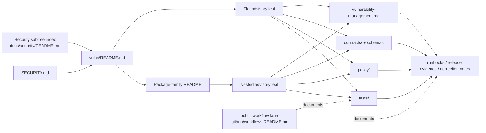

<!-- [KFM_META_BLOCK_V2]
doc_id: kfm://doc/<REVIEW_REQUIRED_UUID>
title: vulns
type: standard
version: v1
status: draft
owners: @bartytime4life
created: <REVIEW_REQUIRED_YYYY-MM-DD>
updated: 2026-03-25
policy_label: <REVIEW_REQUIRED_POLICY_LABEL>
related: [../README.md, ../vulnerability-management.md, ../../../SECURITY.md, ../../../contracts/README.md, ../../../policy/README.md, ../../../tests/README.md, ../../../.github/workflows/README.md]
tags: [kfm, security, vulns, advisories]
notes: [Owner and updated date are confirmed from current public main; created date remains review-required because public file history shows create/delete/recreate path events. doc_id and policy_label still need direct document-record verification.]
[/KFM_META_BLOCK_V2] -->

# vulns

_Governed index for KFM vulnerability notes, advisory leaves, and remediation-linked security writeups under `docs/security/vulns/`._

> **Status:** experimental  
> **Owners:** `@bartytime4life`  
>         
> **Quick jumps:** [Scope](#scope) · [Repo fit](#repo-fit) · [Accepted inputs](#accepted-inputs) · [Exclusions](#exclusions) · [Current verified snapshot](#current-verified-snapshot) · [Directory tree](#directory-tree) · [Quickstart](#quickstart) · [Usage](#usage) · [Diagram](#diagram) · [Tables](#tables) · [Task list](#task-list--gates--definition-of-done) · [FAQ](#faq) · [Appendix](#appendix)  
> **Repo fit:** `docs/security/vulns/README.md` · upstream [`../README.md`](../README.md) · upstream [`../../README.md`](../../README.md) · root disclosure [`../../../SECURITY.md`](../../../SECURITY.md) · sibling lifecycle lane [`../vulnerability-management.md`](../vulnerability-management.md)
>
> [!IMPORTANT]
> This README should make the vulnerability lane useful **without overstating implementation maturity**. The lane exists on public `main`, but workflow execution, merge-blocking automation, and remediation depth beyond directly opened files still need verification.

| At a glance | Working rule |
|---|---|
| Lane purpose | Turn vulnerability signal into KFM-relevant, evidence-bearing notes |
| Security posture | Fail closed, preserve correction lineage, keep evidence drill-through possible |
| Content posture | Advisory index, not a raw scanner dump or passive feed mirror |
| Change coupling | Security-significant doc changes should move with contracts, policy, tests, runbooks, and release evidence where behavior changes |
| Truth posture | Keep `CONFIRMED`, `INFERRED`, `PROPOSED`, `NEEDS VERIFICATION`, and `UNKNOWN` explicit |

## Scope

`docs/security/vulns/` is the narrower security lane for **vulnerability notes, package/advisory family indexes, CVE-linked writeups, and related correction-aware references** that matter to Kansas Frontier Matrix.

This lane exists to answer practical questions fast:

1. Which advisory note already exists for the component or identifier I care about?
2. Is this issue documented as a one-off note or as part of a package-family subtree?
3. What must be linked alongside the advisory so the note remains useful to reviewers, operators, and later maintainers?
4. Which parts of the advisory are directly evidenced, and which still need verification?

This directory should stay focused. It is not the whole vulnerability program, and it is not the place to smuggle in unverified runtime claims.

### Truth posture used in this README

| Label | Meaning here |
|---|---|
| **CONFIRMED** | Directly supported by files opened on current public `main` or by adjacent KFM README surfaces already present in the repo |
| **INFERRED** | Strongly suggested by the observed lane shape or surrounding security docs, but not directly proven as the only live convention |
| **PROPOSED** | A repo-ready pattern that fits KFM doctrine and current repo structure but is not proven as current automation or branch-wide enforcement |
| **NEEDS VERIFICATION** | A likely repo or runtime fact that should be checked against a mounted checkout, workflow history, or release evidence before being treated as settled |
| **UNKNOWN** | Not evidenced strongly enough in the current review to state as current reality |

[Back to top](#vulns)

## Repo fit

**Path:** `docs/security/vulns/README.md`  
**Role:** directory README for vulnerability notes and advisory routing inside the wider `docs/security/` subtree.

| Direction | Path | Status | Why it matters |
|---|---|---|---|
| Upstream | [`../README.md`](../README.md) | **CONFIRMED** | Security subtree index and cross-cutting security posture |
| Upstream | [`../../README.md`](../../README.md) | **CONFIRMED** | Wider docs index and docs-as-production posture |
| Upstream disclosure | [`../../../SECURITY.md`](../../../SECURITY.md) | **CONFIRMED** | Root vulnerability reporting and disclosure policy |
| Adjacent control | [`../../../.github/CODEOWNERS`](../../../.github/CODEOWNERS) | **CONFIRMED** | Current public ownership inherits from `/docs/` and resolves to `@bartytime4life` |
| Adjacent control | [`../../../.github/workflows/README.md`](../../../.github/workflows/README.md) | **CONFIRMED** | Public workflow-lane surface; checked-in YAML merge gates still need verification |
| Sibling | [`../vulnerability-management.md`](../vulnerability-management.md) | **CONFIRMED** | Lifecycle, remediation, and process-facing vulnerability handling |
| Adjacent governed surface | [`../../../contracts/README.md`](../../../contracts/README.md) | **CONFIRMED** | Machine-readable trust objects and release/runtime envelopes |
| Adjacent governed surface | [`../../../policy/README.md`](../../../policy/README.md) | **CONFIRMED** | Deny-by-default policy posture and executable enforcement lane |
| Adjacent governed surface | [`../../../tests/README.md`](../../../tests/README.md) | **CONFIRMED** | Verification families, fixtures, negative paths, and release proof burdens |
| Downstream | [`./apache-tika-cve-2025-66516.md`](./apache-tika-cve-2025-66516.md) | **CONFIRMED** | Example flat advisory leaf already present in this lane |
| Downstream | [`./node-forge/README.md`](./node-forge/README.md) | **CONFIRMED** | Example package-family subdirectory already present in this lane |
| Downstream | [`./node-forge/CVE-2025-12816.md`](./node-forge/CVE-2025-12816.md) | **CONFIRMED** | Example nested advisory leaf already present in this lane |

### Why this directory matters

KFM’s security docs already separate **subtree orientation**, **lifecycle/remediation**, **supply-chain controls**, **root disclosure policy**, and **advisory leaves**. This README should preserve that split instead of flattening everything into one long security note.

[Back to top](#vulns)

## Accepted inputs

Content that belongs here:

| Accepted input | Why it belongs here |
|---|---|
| Advisory index entries and vulnerability-lane navigation | Helps readers find the right note before creating a duplicate |
| CVE- or advisory-specific notes tied to KFM-relevant components or surfaces | Keeps vulnerability signal close to the affected lane |
| Package-family subdirectory READMEs | Lets one dependency or product family gather multiple related notes cleanly |
| Evidence-bearing summaries of affected versions, boundaries, and mitigations | Makes advisories usable for review and follow-up work |
| Correction, supersession, or withdrawal notes for previously published advisory docs | Preserves lineage instead of silently overwriting history |
| Cross-links to lifecycle, policy, contracts, tests, runbooks, or release evidence | Keeps security docs connected to executable and review-bearing surfaces |
| Bulletin-style references when they route readers to narrower notes | Useful when the bulletin matters, but the deeper note should own the details |

### What a good advisory leaf should usually capture

A narrow note under this lane should normally make room for:

- identifier or advisory title
- affected component or family
- affected version or scope statement
- exploit or trigger conditions, when known
- KFM relevance
- current mitigation / containment posture
- test / verification impact
- correction / supersession linkage
- related docs and evidence links

## Exclusions

This lane should stay small and sharp.

| Keep out of `docs/security/vulns/` | Where it goes instead |
|---|---|
| Secrets, tokens, keys, or live credentials | Secret manager, deployment environment, or other controlled runtime boundary |
| Executable policy encoded only as prose | [`../../../policy/README.md`](../../../policy/README.md) and the executable policy surface it routes to |
| Contracts, schemas, or machine-readable response envelopes | [`../../../contracts/README.md`](../../../contracts/README.md) and the authoritative schema home once finalized |
| Raw incident artifacts or restricted evidence blobs | Governed evidence/artifact stores and steward-only review lanes |
| Broad threat-boundary analysis | [`../threat-model.md`](../threat-model.md) |
| Vulnerability lifecycle policy, prioritization, or remediation workflow | [`../vulnerability-management.md`](../vulnerability-management.md) |
| Supply-chain signing, provenance, SBOM, or dependency-confusion doctrine | `../supply-chain/` and sibling supply-chain docs |
| Unqualified runtime claims not directly evidenced | Keep them marked `NEEDS VERIFICATION` or `UNKNOWN` until direct proof exists |

> [!NOTE]
> A useful rule of thumb: if the content is mainly about **one vulnerability note or advisory family**, it belongs here. If it mainly defines **policy, enforcement, or lifecycle process**, route it elsewhere.

[Back to top](#vulns)

## Current verified snapshot

This table records the current public-branch evidence used to revise this README. It is intentionally narrow.

| Surface | Current public `main` state used for this revision | Status |
|---|---|---|
| [`README.md`](./README.md) | Present; substantive lane index on public `main`, enhanced on 2026-03-25 | **CONFIRMED** |
| [`apache-tika-cve-2025-66516.md`](./apache-tika-cve-2025-66516.md) | Present; flat advisory leaf | **CONFIRMED** |
| [`node-forge/README.md`](./node-forge/README.md) | Present; family subdirectory index | **CONFIRMED** |
| [`node-forge/CVE-2025-12816.md`](./node-forge/CVE-2025-12816.md) | Present; nested advisory leaf | **CONFIRMED** |
| [`../../../SECURITY.md`](../../../SECURITY.md) | Present; root security reporting and disclosure surface | **CONFIRMED** |
| [`../../../.github/CODEOWNERS`](../../../.github/CODEOWNERS) | Present; `/docs/` ownership resolves to `@bartytime4life` on current public `main` | **CONFIRMED** |
| [`../../../.github/workflows/README.md`](../../../.github/workflows/README.md) | Present; workflow lane is documented, but checked-in YAML merge gates are not evidenced here | **CONFIRMED / NEEDS VERIFICATION** |
| [`../../../.github/dependabot.yml`](../../../.github/dependabot.yml) | Present; ecosystem update coverage exists for GitHub Actions, Docker, npm, pip, and cargo | **CONFIRMED** |
| Additional top-level advisory leaves or family directories | Current public `vulns/` directory listing shows no top-level entries beyond `README.md`, `apache-tika-cve-2025-66516.md`, and `node-forge/` | **CONFIRMED** |
| Merge-blocking workflow automation for this lane | Public workflow documentation is visible; checked-in YAML merge gates for this lane remain unverified | **NEEDS VERIFICATION** |

## Directory tree

> [!CAUTION]
> This tree reflects the current public `main` directory listing plus the child paths directly opened for this revision. It is not a claim about unmerged branches, private forks, or runtime-generated security artifacts.

```text
docs/security/vulns/
├── README.md
├── apache-tika-cve-2025-66516.md
└── node-forge/
    ├── README.md
    └── CVE-2025-12816.md
```

## Quickstart

### Add or update an advisory note

1. Read [`../README.md`](../README.md) first to confirm that `vulns/` is the right security lane.
2. Decide whether the work is:
   - a **flat one-off note** in this directory, or
   - a **package-family subtree** with its own `README.md`.
3. Add or expand the narrower file that owns the advisory.
4. Update this index when the lane inventory changes.
5. If the advisory changes trust, release, runtime, or mitigation behavior, update the matching governed surfaces in the same change stream:
   - policy
   - contracts / schemas
   - tests / fixtures
   - runbooks
   - release or correction evidence
6. Keep implementation claims explicitly labeled if repo or runtime proof is absent.

### Minimal authoring skeleton for a new advisory leaf

```md
# <identifier or advisory title>

_One-line purpose._

## Summary
## Affected surface
## Evidence
## KFM relevance
## Mitigation / containment
## Verification / test impact
## Correction / supersession
## Related docs
```

### Optional starter commands

```bash
# example: start a new package-family subtree
mkdir -p docs/security/vulns/<package-family>
touch docs/security/vulns/<package-family>/README.md

# example: add a one-off advisory note
touch docs/security/vulns/<identifier-or-slug>.md
```

> [!TIP]
> The current observed lane shape already supports both patterns: a flat advisory leaf and a package-family subtree. Expand the existing pattern in place instead of creating parallel authority.

[Back to top](#vulns)

## Usage

### Start here when you need to…

| Task | Start here | Then go deeper |
|---|---|---|
| Find whether an advisory note already exists | This README | The matching leaf under `./` |
| Add or update a one-off advisory note | This README | A flat note like [`./apache-tika-cve-2025-66516.md`](./apache-tika-cve-2025-66516.md) |
| Add or grow a package-family advisory area | This README | [`./node-forge/README.md`](./node-forge/README.md) and its child notes |
| Explain remediation lifecycle or triage posture | This README | [`../vulnerability-management.md`](../vulnerability-management.md) |
| Connect an advisory to executable enforcement | This README | [`../../../policy/README.md`](../../../policy/README.md) and [`../../../contracts/README.md`](../../../contracts/README.md) |
| Connect an advisory to proof burden or negative tests | This README | [`../../../tests/README.md`](../../../tests/README.md) |
| Report or understand disclosure policy | This README | [`../../../SECURITY.md`](../../../SECURITY.md) |
| Check inherited ownership / review boundary | This README | [`../../../.github/CODEOWNERS`](../../../.github/CODEOWNERS) |
| Check the public workflow lane before making CI claims | This README | [`../../../.github/workflows/README.md`](../../../.github/workflows/README.md) |
| Route a runtime-boundary or bypass issue | This README | [`../threat-model.md`](../threat-model.md) |
| Route signing / provenance / dependency-confusion detail | This README | `../supply-chain/` and related supply-chain docs |

### Observed lane patterns

| Pattern | Use when | Current visible example |
|---|---|---|
| Flat advisory leaf | One issue is easiest to document as a single file | `apache-tika-cve-2025-66516.md` |
| Package-family subtree | One dependency or product family may accumulate several related notes | `node-forge/README.md` + `node-forge/CVE-2025-12816.md` |

## Diagram



## Tables

### Minimum advisory record

| Field | Why it matters |
|---|---|
| Identifier / title | Gives the note a stable reference point |
| Affected component | Prevents vague “something in the stack” language |
| Version / scope statement | Keeps the note actionable and reviewable |
| Conditions / exploit boundary | Clarifies whether the issue is always reachable or context-dependent |
| KFM relevance | Explains why the note belongs in this repo |
| Mitigation / containment | Keeps the note tied to practical action |
| Verification / test impact | Connects the note to proof, not only prose |
| Correction / supersession state | Preserves lineage when the advisory changes |
| Related docs | Keeps routing visible across lifecycle, policy, contracts, tests, and release evidence |

### What must change together

| If the advisory changes… | Update alongside this lane |
|---|---|
| Runtime or public-surface behavior | Threat model, policy, contracts, tests, and release evidence |
| Mitigation workflow or lifecycle language | `../vulnerability-management.md` |
| Supply-chain provenance, signatures, or package-origin controls | Relevant `../supply-chain/` docs |
| Correction or withdrawal posture | Runbooks and correction-linked notes |
| Trust-visible states or denial/abstention behavior | Tests and any runtime-envelope examples that own those states |

### Adjacent current public-main control signals

| Surface | Current public-main signal | Why it matters |
|---|---|---|
| [`../../../.github/CODEOWNERS`](../../../.github/CODEOWNERS) | `/docs/`, `/contracts/`, `/policy/`, and `/tests/` are owned by `@bartytime4life` | Confirms inherited review ownership for this lane on current public `main` |
| [`../../../.github/workflows/README.md`](../../../.github/workflows/README.md) | Workflow lane is visible, but current public tree still needs checked-in YAML verification | Keeps CI and merge-gate claims bounded |
| [`../../../.github/dependabot.yml`](../../../.github/dependabot.yml) | GitHub Actions, Docker, npm, pip, and cargo update coverage are configured | Useful package-risk intake signal without turning this README into an automation claim |

### Lane writing rules

| Rule | Why it exists |
|---|---|
| Prefer evidence-bearing summaries over pasted feed text | Keeps the lane useful to KFM reviewers and maintainers |
| Keep implementation uncertainty explicit | Prevents security docs from becoming trust theater |
| Route executable enforcement out to policy/contracts/tests | Preserves docs-as-production without pretending prose enforces behavior |
| Preserve correction lineage | Avoids silent overwrite when the advisory picture changes |

[Back to top](#vulns)

## Task list — gates & definition of done

A vulnerability doc change is not done when the prose looks tidy. It is done when the note is still useful under review pressure.

### Definition of done

- [ ] The advisory clearly states the affected component or surface.
- [ ] The note distinguishes what is **CONFIRMED** from what still needs verification.
- [ ] Related lifecycle, policy, contract, test, runbook, or release-evidence links are updated when behavior changes.
- [ ] The change does not silently harden an unverified runtime or repo claim into fact.
- [ ] Correction, supersession, or “not affected” outcomes remain visible where relevant.
- [ ] Cross-links from this README still land on the narrower doc that owns the topic.
- [ ] The lane index is updated if a new advisory leaf or package-family subtree is introduced.

### Release-sensitive gates this README assumes or routes to

| Gate family | Why it matters here |
|---|---|
| Documentation gate | Advisory docs should move with behavior-significant changes |
| Contract / schema gate | Security notes should not drift away from machine-readable trust objects |
| Policy gate | Missing evidence, broken provenance, unresolved rights, or unsafe exposure should fail closed |
| Test / fixture gate | Negative paths and mitigation claims should be pressure-tested where relevant |
| Release / correction gate | Visibility changes should preserve rollback and correction lineage |

## FAQ

### Is this README proof that the fix or mitigation is already implemented?

No. This README is an orientation and routing surface for the vulnerability lane. It should help readers find the right note and understand what must change together, but it is not a substitute for mounted policy bundles, contracts, tests, or release evidence.

### Why keep `vulns/` separate from `vulnerability-management.md`?

Because the two jobs are different. `vulns/` owns the **advisory leaves and package-family indexes**. `vulnerability-management.md` should own the **lifecycle, triage, remediation, and policy-facing process language**.

### When should I create a package-family subdirectory instead of a flat file?

Use a package-family subtree when one dependency, library, runtime, or product family is likely to gather multiple related notes, shared context, or recurring mitigations. Use a flat file when the note is truly one-off.

### Does the existence of a package-family lane prove that the dependency is in the current build?

No. A package-family lane is documentation and triage structure, not dependency proof. Current package presence still needs manifests, lockfiles, SBOM output, image inventory, or comparable repo/runtime evidence.

### Can I paste an upstream advisory here verbatim?

Avoid turning this lane into a passive mirror. Summarize the issue in KFM terms, preserve the evidence route, and link outward where appropriate. The goal is governed, reviewable context — not an unmanaged copy of external feed text.

### What if the repo later proves a different lane shape?

Keep the doctrinal intent, revise the routing, and preserve lineage. KFM docs should adapt to directly verified repo reality instead of forcing the repo to mimic placeholder prose.

[Back to top](#vulns)

## Appendix

<details>
<summary><strong>Known verification items</strong></summary>

- Exact canonical `doc_id` and `policy_label` values for the meta block
- Project-preferred `created` date convention for this path, because current public history shows create / delete / recreate events across 2025-12-02, 2026-01-01, and 2026-03-22
- Whether checked-in workflow YAML now exists for security-doc, policy, contract, or release gates beyond the public `.github/workflows/README.md` lane
- Whether any future advisory leaves under this lane should be grouped into package-family subtrees before flat-file sprawl appears
- Whether remediation-linked runbooks, SBOM evidence, or release proof packs are ready to be linked directly from advisory leaves
- Whether a narrower `docs/security/` or `docs/security/vulns/` ownership rule should be introduced beneath the current `/docs/` owner on public `main`

</details>

<details>
<summary><strong>Recommended advisory leaf checklist</strong></summary>

```text
Use this lane to keep these rules visible:
- State the affected component clearly.
- Keep evidence and verification routes visible.
- Do not imply implementation proof you do not have.
- Route lifecycle/process questions to vulnerability-management.
- Route executable enforcement to policy, contracts, and tests.
- Preserve correction, withdrawal, or supersession lineage.
- Update this index when the lane inventory changes.
```

</details>

<details>
<summary><strong>Related repo surfaces worth checking before merge</strong></summary>

- `docs/security/README.md`
- `docs/security/vulnerability-management.md`
- `SECURITY.md`
- `.github/CODEOWNERS`
- `.github/workflows/README.md`
- `.github/dependabot.yml`
- `contracts/README.md`
- `policy/README.md`
- `tests/README.md`

</details>

[Back to top](#vulns)
