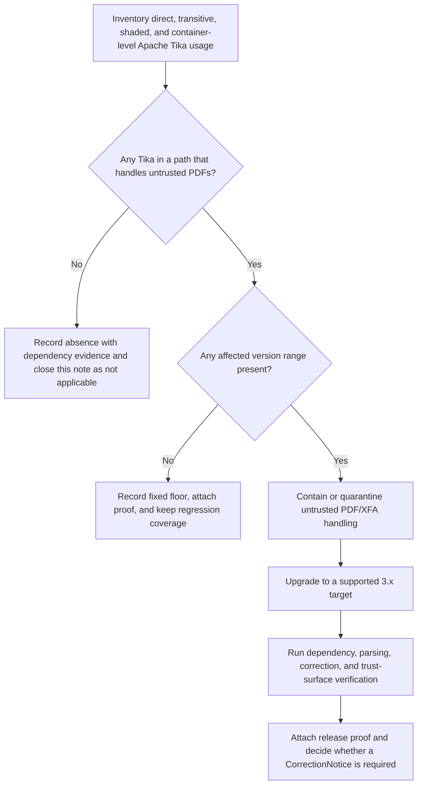

<!-- [KFM_META_BLOCK_V2]
doc_id: kfm://doc/<UUID-NEEDS-ASSIGNMENT>
title: Apache Tika CVE-2025-66516
type: standard
version: v1
status: draft
owners: @bartytime4life
created: <CREATED-DATE-NEEDS-VERIFICATION>
updated: <UPDATED-DATE-SET-ON-COMMIT>
policy_label: <POLICY_LABEL-NEEDS-VERIFICATION>
related: [docs/security/vulns/README.md, docs/security/README.md, docs/security/vulnerability-management.md, SECURITY.md, .github/SECURITY.md, .github/CODEOWNERS, .github/workflows/README.md, contracts/README.md, policy/README.md, tests/README.md]
tags: [kfm, security, vulnerability, apache-tika, cve-2025-66516]
notes: [current public-main lane path, root security handoff, /docs ownership, and workflow-lane README-only status are confirmed; dependency and runtime exposure remain unknown; doc_id, created, updated, and policy_label still require repo-side verification]
[/KFM_META_BLOCK_V2] -->

# Apache Tika CVE-2025-66516

Repo-facing vulnerability record for triage, containment, remediation, and KFM verification of Apache Tika PDF/XFA XXE exposure.

> Quick jumps: [Repo fit](#repo-fit) · [Current public repo signals](#current-public-repo-signals) · [Status snapshot](#status-snapshot) · [What is confirmed upstream](#what-is-confirmed-upstream) · [KFM-specific interpretation](#kfm-specific-interpretation) · [Immediate containment](#immediate-containment) · [Verification checklist](#verification-checklist) · [Known unknowns](#known-unknowns)

| Field | Value |
| --- | --- |
| Target path | `docs/security/vulns/apache-tika-cve-2025-66516.md` |
| Status | `draft` |
| Document role | Standard vulnerability note |
| Upstream fact posture | `CONFIRMED` |
| Current KFM repo impact in this revision | `UNKNOWN` |
| Owners | `@bartytime4life` |
| Advisory IDs | `CVE-2025-66516` · related earlier record `CVE-2025-54988` |
| Primary evidence | Official Apache / CVE / NVD sources first; current public-main repo docs second; KFM doctrine third |
| Review rule | Do not close from upstream advisory data alone |

> [!IMPORTANT]
> This note keeps three evidence planes separate: upstream vulnerability facts, current public-main repo documentation, and still-unverified KFM dependency/runtime exposure. The existence of this advisory leaf does **not** prove that KFM currently ships Apache Tika.

> [!WARNING]
> Treat repo impact as **UNKNOWN** until a mounted checkout, lockfiles, manifests, image inventory, or SBOM output proves otherwise.

> [!NOTE]
> Labels in this note follow current KFM usage: **CONFIRMED**, **INFERRED**, **PROPOSED**, **NEEDS VERIFICATION**, and **UNKNOWN**.

## Repo fit

Path: `docs/security/vulns/apache-tika-cve-2025-66516.md`

Upstream: [lane index](./README.md) · [security hub](../README.md) · [vulnerability management](../vulnerability-management.md) · [root disclosure](../../../SECURITY.md) · [canonical disclosure](../../../.github/SECURITY.md)

Adjacent governed surfaces: [contracts](../../../contracts/README.md) · [policy](../../../policy/README.md) · [tests](../../../tests/README.md) · [ownership](../../../.github/CODEOWNERS) · [workflow lane](../../../.github/workflows/README.md)

This file should stay a concrete advisory leaf: specific enough to drive triage and review, but not a substitute for dependency proof, runtime proof, or release proof.

## Current public repo signals

| Signal | Status | Why it matters |
| --- | --- | --- |
| This file already exists on public `main` | **CONFIRMED** | The advisory lane is real, not merely proposed |
| `docs/security/vulns/README.md` recognizes this file as the flat Apache Tika advisory leaf | **CONFIRMED** | The lane already routes readers here |
| `/.github/CODEOWNERS` maps `/docs/` to `@bartytime4life` | **CONFIRMED** | Current visible ownership is not ambiguous |
| `/SECURITY.md` delegates canonical disclosure to `/.github/SECURITY.md` | **CONFIRMED** | Readers need a clear private reporting handoff |
| `.github/workflows/` is README-only on current public `main`; checked-in YAML inventory remains unproven here | **CONFIRMED / NEEDS VERIFICATION** | The automation lane exists, but live merge gates cannot be inferred from documentation alone |
| `docs/security/vulnerability-management.md` keeps issue-specific advisory text in `docs/security/vulns/` and requires unproven repo/runtime claims to stay `UNKNOWN` or `NEEDS VERIFICATION` | **CONFIRMED** | The advisory’s uncertainty posture matches the current repo security doctrine |

## Status snapshot

| Question | Status | Current position in this revision |
| --- | --- | --- |
| Upstream vulnerability exists | **CONFIRMED** | `CVE-2025-66516` is published and described by official sources |
| Affected modules / version ranges are known | **CONFIRMED** | See the affected-components matrix below |
| KFM directly depends on Apache Tika | **UNKNOWN** | No manifest, lockfile, dependency tree, or SBOM evidence was directly reviewed here |
| KFM transitively or container-level depends on Apache Tika | **UNKNOWN** | Requires dependency-tree, image, shaded-jar, or SBOM inspection |
| Minimum non-vulnerable 3.x floor is known | **CONFIRMED** | Official ranges imply `>= 3.2.2` escapes the disclosed window |
| Stronger 3.x floor for server-like or `woodstox`-on-classpath paths is known | **CONFIRMED** | `3.2.3` adds an XFA fix relevant when `woodstox` is on the classpath as in `tika-server` |
| Preferred forward target is known | **INFERRED / PROPOSED** | Prefer the current 3.x release line visible on the official download page rather than stopping at the bare minimum floor |
| 2.x is an acceptable long-term remediation landing | **CONFIRMED: NO** | Apache marks `2.9.4` as the final 2.x release and the 2.x branch as end-of-life |
| 1.x is an acceptable remediation landing | **CONFIRMED: NO** | Apache marks 1.x as end-of-life; the affected disclosure also explicitly covers `tika-parsers` through `1.28.5` |

## What is confirmed upstream

### Affected components

| Component | Affected versions | Status | Why it matters |
| --- | --- | --- | --- |
| `org.apache.tika:tika-core` | `1.13` through `3.2.1` | **CONFIRMED** | Core fix location; upgrading only parser-side entrypoints is not enough |
| `org.apache.tika:tika-pdf-module` | `2.0.0` through `3.2.1` | **CONFIRMED** | PDF / XFA entrypoint in newer lines |
| `org.apache.tika:tika-parsers` | `1.13` through `1.28.5` | **CONFIRMED** | Relevant 1.x module where `PDFParser` lived |
| Trigger surface | Crafted XFA file inside a PDF | **CONFIRMED** | Treat untrusted PDF ingestion as the first exposure boundary |
| Vulnerability class | XXE | **CONFIRMED** | File, network, and parser-boundary hardening matter |
| Scope note | Same underlying issue as `CVE-2025-54988`, but wider package scope | **CONFIRMED** | Avoid partial remediation logic copied from the earlier record only |

### Severity note

| Source | Score | Severity | Vector | Handling rule in this note |
| --- | --- | --- | --- | --- |
| NVD | `9.8` | Critical | `AV:N/AC:L/PR:N/UI:N/S:U/C:H/I:H/A:H` | Keep visible |
| Apache Software Foundation (CNA) | `8.4` | High | `AV:L/AC:L/PR:N/UI:N/S:U/C:H/I:H/A:H` | Keep visible |
| KFM interpretation | n/a | n/a | n/a | Do **not** flatten the scoring disagreement into one invented “official” score |

## KFM-specific interpretation

**CONFIRMED doctrine.** KFM treats parsing, extraction, OCR, retrieval, and bounded synthesis as useful but subordinate to evidence, policy, release state, and correction discipline. A document-processing library issue is therefore not just dependency hygiene; it is a trust-path issue if the library sits on any intake, evidence-resolution, export, story, or Focus route.

**UNKNOWN implementation.** Current public-main repo evidence is enough to confirm the security lane, the advisory leaf, and ownership posture. It is **not** enough to prove whether Apache Tika is present, reachable, or already remediated in the active dependency graph or runtime.

### KFM artifact touchpoints

These are KFM contract or proof-object families named in the March 2026 doctrine corpus. They are relevant here because this issue can force intake, runtime, release, and correction behavior to become explicit.

| KFM object / seam | Why this CVE matters here |
| --- | --- |
| `SourceDescriptor` / `IngestReceipt` | Intake contracts should make it visible whether untrusted PDFs are admitted, where they land, and what parser boundary they cross |
| `ValidationReport` | Negative-path parsing tests should record whether crafted PDF / XFA samples are blocked, quarantined, or safely handled |
| `EvidenceBundle` | Unsafe or partial extraction must not masquerade as ordinary support for outward claims, previews, or Focus responses |
| `ReleaseManifest` / `ReleaseProofPack` | Dependency inventory, validation output, and rollback posture should become part of releasable evidence |
| `RuntimeResponseEnvelope` | Runtime surfaces must fail closed when extraction is unsafe, partial, stale, or unverified |
| `CorrectionNotice` | If promoted or outward-facing artifacts were materially affected, supersession, narrowing, withdrawal, or replacement should preserve lineage |
| `ReviewRecord` | Reopening a quarantined PDF path or accepting a compensating control should be a review-bearing action, not a silent deploy |

## Decision flow



## Immediate containment

1. **Inventory first.** Identify direct, transitive, shaded, vendored, and container-bundled Apache Tika artifacts before changing deployment posture.

2. **Quarantine uncertain PDF / XFA routes.** If any service accepts untrusted PDFs and current version state cannot be proven quickly, prefer temporary quarantine, deny, or narrowed acceptance over optimistic continuation.

3. **Do not patch only the obvious parser module.** If `tika-pdf-module` is present in an affected range, verify `tika-core` at the same time.

4. **Treat server-style deployments as higher risk until proven otherwise.** If any KFM-adjacent service resembles `tika-server`, keep it isolated, low-privilege, and off broad filesystem or network reach while remediation is in progress.

5. **Preserve release lineage.** If user-visible behavior changes during mitigation, update release evidence and correction state instead of relying on an implicit hotfix story.

## Remediation path

| Current line | Status | Guidance |
| --- | --- | --- |
| `3.0.0` to `3.2.1` | **CONFIRMED vulnerable** | Upgrade immediately |
| `>= 3.2.2` | **CONFIRMED outside disclosed affected range** | Acceptable minimum floor implied by the official affected range |
| `3.2.3` | **CONFIRMED additional XFA / `woodstox` / server-related fix** | Stronger operational floor where XFA-heavy or server-like paths matter |
| `3.3.0` | **CONFIRMED current official download-page release at this revision** | **INFERRED / PROPOSED preferred target** for a fresh remediation move |
| `2.x` (ending at `2.9.4`) | **CONFIRMED end-of-life** | Do not rely on a long-term 2.x security path; migrate forward |
| `1.x` (`1.13` through `1.28.5` in affected disclosure) | **CONFIRMED end-of-life and explicitly within the disclosed range** | Retire rather than patch in place |

### Runtime and packaging watchpoints

- **CONFIRMED:** Apache Tika 3.x requires Java 11.
- **CONFIRMED:** Apache Tika `3.2.3` includes an additional XFA fix relevant when `woodstox` is on the classpath as in `tika-server`.
- **INFERRED / PROPOSED:** if a KFM lane resembles `tika-server`, or otherwise keeps `woodstox` on the classpath for PDF/XFA handling, prefer `3.2.3+` over a bare `3.2.2` landing.
- **INFERRED / PROPOSED:** if this issue triggers real remediation work, move to the current 3.x release line unless a verified compatibility blocker forces a narrower landing.

## Verification checklist

- [ ] Direct dependency scan proves whether Apache Tika is present.
- [ ] Transitive dependency scan proves whether Apache Tika is present indirectly.
- [ ] Image / container / SBOM scan proves whether Apache Tika is bundled outside build files.
- [ ] Any untrusted PDF intake route is either fixed, quarantined, or explicitly denied.
- [ ] Crafted PDF / XFA negative-path tests are added or updated.
- [ ] Release proof includes dependency evidence, validation output, and rollback posture.
- [ ] If outward-facing meaning changed, correction / supersession / withdrawal handling is explicitly reviewed.
- [ ] Runtime surfaces fail closed instead of silently producing confident output from incomplete or unsafe parsing.

## Definition of done

Do not close this note until all of the following are true:

1. A dependency inventory names every direct or indirect Apache Tika location, or proves absence.
2. Every affected runtime path has either been upgraded, removed, or quarantined.
3. The chosen remediation target is supported, documented, and reflected in release evidence.
4. Regression coverage includes at least one crafted-PDF / XFA check or an equivalent proven guard.
5. Release evidence is updated.
6. Any needed correction state is made visible rather than implied away.

## Known unknowns

| Unknown | Why it matters | Required verification |
| --- | --- | --- |
| Whether KFM currently ships Apache Tika at all | Determines whether this note is active remediation or preparedness only | Inspect the actual repo tree, manifests, lockfiles, images, and SBOMs |
| Whether Apache Tika is direct, transitive, shaded, or sidecar-bundled | Changes remediation method and search scope | Inspect dependency trees, jars, images, and build outputs |
| Whether any KFM lane accepts untrusted PDFs | Determines exploitability and containment priority | Inspect ingest, parsing, export, and review routes |
| Whether any deployment resembles `tika-server` | Changes hardening and version-floor preference | Inspect runtime topology, service list, classpath, and sidecars |
| Whether any published outputs may already rely on affected parsing | Determines whether a correction workflow is needed | Inspect release history and evidence paths |
| Exact `doc_id`, `created`, `updated`, and `policy_label` values | Needed before commit | Resolve from the live repo process rather than guessing from public-main docs alone |

## Illustrative investigation commands

<details>
<summary>Illustrative commands — adjust to actual repo reality before use</summary>

```bash
# Maven
mvn -q dependency:tree | rg -i 'org\.apache\.tika|tika-core|tika-pdf-module|tika-parsers'

# Gradle
./gradlew dependencies | rg -i 'org\.apache\.tika|tika-core|tika-pdf-module|tika-parsers'

# Generic repo scan
rg -n 'org\.apache\.tika|tika-core|tika-pdf-module|tika-parsers' .

# Search built artifacts
find . -type f \( -name '*.jar' -o -name '*.war' -o -name '*.ear' \) -print

# SBOM / filesystem scan
syft . -o table | rg -i 'tika'

# Image scan
syft <image-ref> -o table | rg -i 'tika'
```

</details>

## Source basis for this note

This note is built from three evidence layers:

1. **Official upstream security and release sources** for the vulnerability, affected-version ranges, release-line status, and Apache Tika remediation posture.
2. **Current public-main repo documentation** for lane placement, ownership, disclosure routing, and the current advisory-leaf context.
3. **KFM doctrine sources** for truth posture, contract families, correction visibility, runtime negative outcomes, and review-bearing remediation.

[Back to top](#apache-tika-cve-2025-66516)
