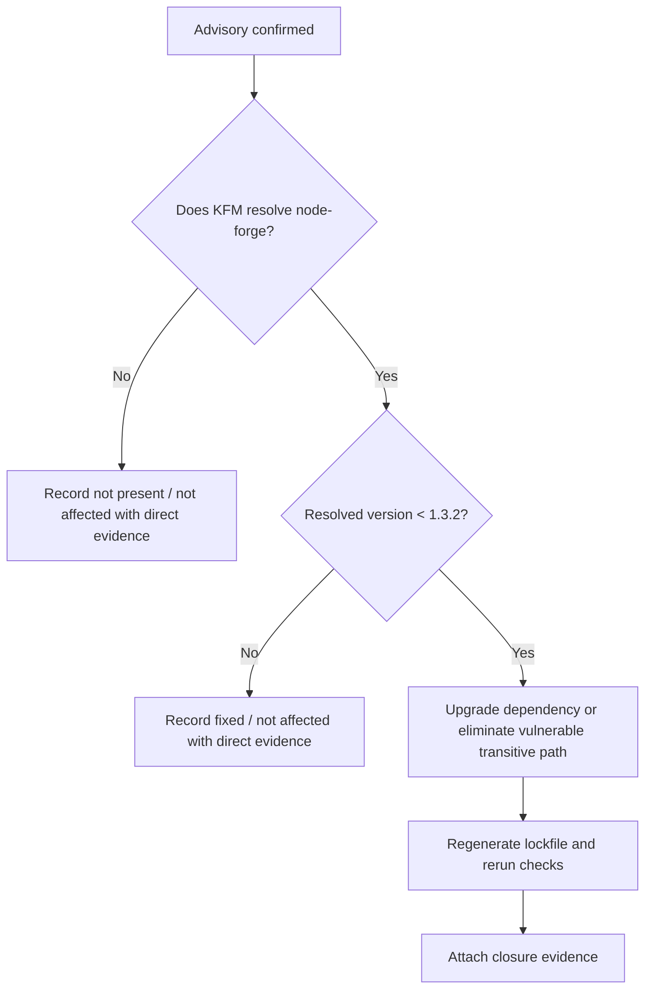

<!-- [KFM_META_BLOCK_V2]
doc_id: kfm://doc/<REVIEW_REQUIRED_UUID>
title: CVE-2025-12816 — node-forge ASN.1 Validator Desynchronization
type: standard
version: v1
status: draft
owners: <REVIEW_REQUIRED_OWNER>
created: <REVIEW_REQUIRED_YYYY-MM-DD>
updated: <REVIEW_REQUIRED_YYYY-MM-DD>
policy_label: <REVIEW_REQUIRED_POLICY_LABEL>
related: [<REVIEW_REQUIRED_RELATED_PATHS_OR_IDS>]
tags: [kfm, security, vuln, node-forge, cve]
notes: [Placeholders remain because current-session evidence did not include a mounted repo checkout, adjacent metadata templates, or verified ownership metadata.]
[/KFM_META_BLOCK_V2] -->

# CVE-2025-12816 — node-forge ASN.1 Validator Desynchronization

Project-facing vulnerability record for tracking advisory facts, repo impact, remediation, and closure evidence for `node-forge`.

**Status:** draft  
**Package:** `node-forge`  
**Advisory IDs:** `CVE-2025-12816` · `GHSA-5gfm-wpxj-wjgq` · `VU#521113`  
**Repo impact:** `UNKNOWN`  
**Minimum fixed version:** `1.3.2`

[Summary](#summary) · [Affected Versions and Components](#affected-versions-and-components) · [Repo Impact Status](#repo-impact-status) · [Required Response](#required-response) · [Closure Criteria](#closure-criteria) · [Open Verification Items](#open-verification-items)

> [!IMPORTANT]
> Do not mark this record resolved from advisory data alone. Advisory existence and the minimum fixed version are externally confirmed; actual KFM repo exposure remains `UNKNOWN` until manifests, lockfiles, SBOM output, or dependency-tree evidence are attached.

## Summary

`node-forge` versions earlier than `1.3.2` are affected by an ASN.1 validator desynchronization issue in `asn1.validate`. The flaw can let specially crafted ASN.1 input desynchronize optional-boundary handling and create downstream interpretation conflicts. The minimum patched floor is `1.3.2`.

| Field | Value | Status |
|---|---|---|
| Package | `node-forge` | CONFIRMED |
| Vulnerability | `CVE-2025-12816` | CONFIRMED |
| GitHub advisory | `GHSA-5gfm-wpxj-wjgq` | CONFIRMED |
| CERT note | `VU#521113` | CONFIRMED |
| Weakness class | Interpretation conflict / validator desynchronization (`CWE-436`) | CONFIRMED |
| Severity | High; exact numeric score varies by source | CONFIRMED |
| Affected versions | `< 1.3.2` | CONFIRMED |
| Fixed version | `>= 1.3.2` | CONFIRMED |
| Current KFM repo exposure | Not proven from mounted repo evidence in this session | UNKNOWN |

## What this issue is

This is not a generic “dependency is old” finding. It is a parsing-consistency problem in ASN.1 validation.

A crafted ASN.1 object can push validation logic out of sync at optional boundaries, which can then cause later logic to interpret input differently than intended. That matters most when `node-forge` is used on trust boundaries such as:

- certificate parsing or validation
- PKCS#7 or PKCS#12 handling
- RSA or password-based encryption helper paths
- any server, worker, or tool path that accepts untrusted ASN.1-bearing input

## Affected versions and components

| Topic | Detail |
|---|---|
| Affected package range | `node-forge` `< 1.3.2` |
| Minimum patched floor | `1.3.2` |
| Root component | `forge/lib/asn1.js` via `asn1.validate` |
| Known impacted downstream modules | `lib/x509.js`, `lib/pkcs12.js`, `lib/pkcs7.js`, `lib/rsa.js`, `lib/pbe.js`, `lib/ed25519.js` |

<details>
<summary><strong>Why the component list matters</strong></summary>

If KFM uses `node-forge` only indirectly, the reachable risk may not appear at a direct call site to `asn1.validate`. It may instead sit inside higher-level certificate, PKCS, RSA, PBE, or Ed25519 helper paths that rely on the same ASN.1 parsing behavior.

</details>

## Repo impact status

The vulnerability record is externally grounded, but repo impact is still bounded by current-session evidence.

| Question | Current answer | Status | Required proof |
|---|---|---|---|
| Does the advisory exist? | Yes | CONFIRMED | External advisory sources |
| Is there a fixed version? | Yes, `1.3.2` | CONFIRMED | External advisory sources |
| Does the mounted repo currently resolve `node-forge`? | Not proven in this session | UNKNOWN | Manifest, lockfile, SBOM, or dependency tree |
| Is usage direct or transitive? | Not proven in this session | UNKNOWN | Dependency inventory |
| Is any reachable KFM path exposed to ASN.1-bearing untrusted input? | Not proven in this session | UNKNOWN | Code-path review plus dependency evidence |
| Has remediation already landed in the repo? | Not proven in this session | UNKNOWN | PR / commit / lockfile diff / release note |

> [!NOTE]
> This file intentionally separates advisory facts from repo facts. The advisory is `CONFIRMED`. KFM exposure, reachability, and closure state are still `UNKNOWN` until direct repo evidence is attached.

## Required response

### 1. Inventory

Determine whether KFM resolves `node-forge` at all, and whether the dependency is direct or transitive.

### 2. Upgrade

If any resolved version is earlier than `1.3.2`, upgrade to `1.3.2` or later, regenerate the lockfile, and ensure the vulnerable version is no longer reachable in the shipped dependency graph.

### 3. Validate

Re-run dependency, build, and security checks. Any parsing, certificate, or package-handling tests that exercise `node-forge`-backed code paths should be re-executed after the upgrade.

### 4. Record closure evidence

Do not close this record with prose alone. Attach concrete evidence such as a lockfile diff, dependency tree, SBOM excerpt, CI run link, or remediation PR reference.

## Verification workflow

The commands below are illustrative only. They are not assertions about the mounted package manager or repo tooling.

```bash
# inventory manifests and lockfiles
rg -n "node-forge" package.json package-lock.json npm-shrinkwrap.json yarn.lock pnpm-lock.yaml
```

```bash
# npm
npm ls node-forge
```

```bash
# pnpm
pnpm why node-forge
```

```bash
# yarn
yarn why node-forge
```

Use the package manager actually present in the repo. If the project maintains SBOMs or dependency snapshots, attach the relevant before/after evidence here or in a linked review artifact.

## Decision flow



## Closure criteria

A closure claim is ready only when all relevant items below are complete.

- [ ] Dependency inventory is attached.
- [ ] Any resolved `node-forge` version earlier than `1.3.2` is removed from shipped paths.
- [ ] Lockfile or dependency-graph evidence is attached.
- [ ] CI or targeted validation evidence is attached.
- [ ] This record’s `Repo impact` and `Status` fields are updated from evidence, not assumption.
- [ ] If the conclusion is `not affected`, the proof explicitly shows either no dependency resolution or no reachable vulnerable path.

## Correction and supersession

If later repo inspection shows one of the following, update this file rather than silently overwriting the conclusion:

- `node-forge` was never present
- the dependency was present only in a non-shipping or non-reachable path
- remediation landed earlier than first documented here
- later evidence shows additional affected paths, exceptions, or rollback needs

Keep prior status lineage visible when changing the document from `UNKNOWN` to `not affected`, `affected`, or `fixed`.

## Open verification items

- direct dependency inventory from the mounted repo
- direct/transitive distinction for any `node-forge` usage
- reachable KFM code paths that process ASN.1-bearing or certificate-bearing input
- remediation PR / commit / release evidence
- post-upgrade validation evidence
- whether sibling `node-forge` advisories from the same disclosure wave should be tracked in adjacent records
