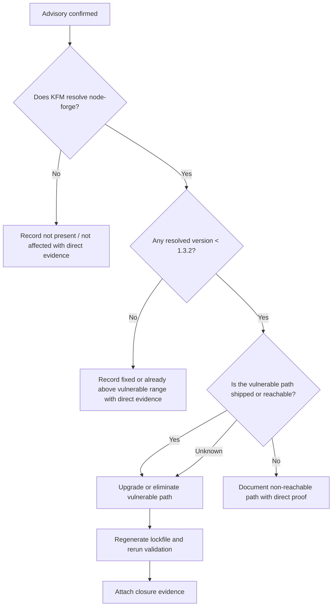

<!-- [KFM_META_BLOCK_V2]
doc_id: kfm://doc/<REVIEW_REQUIRED_UUID>
title: CVE-2025-12816 — node-forge ASN.1 Validator Desynchronization
type: standard
version: v1
status: draft
owners: <REVIEW_REQUIRED_OWNER>
created: <REVIEW_REQUIRED_YYYY-MM-DD>
updated: <REVIEW_REQUIRED_YYYY-MM-DD>
policy_label: <REVIEW_REQUIRED_POLICY_LABEL>
related: [<REVIEW_REQUIRED_RELATED_PATHS_OR_IDS>]
tags: [kfm, security, vuln, node-forge, cve]
notes: [Placeholders remain because current-session evidence did not include a mounted repo checkout, adjacent metadata templates, or verified ownership metadata.]
[/KFM_META_BLOCK_V2] -->

# CVE-2025-12816 — node-forge ASN.1 Validator Desynchronization

Project-facing vulnerability record for tracking advisory facts, KFM repo exposure, remediation, and closure evidence for `node-forge`.

| Field | Value |
|---|---|
| Status | `draft` |
| Advisory fact posture | `CONFIRMED` |
| Current KFM repo impact | `UNKNOWN` |
| Package | `node-forge` |
| Advisory IDs | `CVE-2025-12816` · `GHSA-5gfm-wpxj-wjgq` · `VU#521113` |
| Security fix floor | `>= 1.3.2` |
| Preferred remediation target | Later compatible stable release above the vulnerable range |
| Review rule | Do not close from advisory data alone |

[Summary](#summary) · [Advisory Baseline](#advisory-baseline) · [Affected Versions and Reachable Surface](#affected-versions-and-reachable-surface) · [Repo Impact Status](#repo-impact-status) · [Required Response](#required-response) · [Closure Criteria](#closure-criteria) · [Evidence Required to Change Status](#evidence-required-to-change-status) · [Open Verification Items](#open-verification-items)

> [!IMPORTANT]
> This record intentionally separates externally confirmed advisory facts from KFM repo facts.
> Advisory existence, affected range, and the minimum fixed floor are established.
> KFM exposure, reachability, and closure remain `UNKNOWN` until dependency and code-path evidence are attached.

## Summary

`node-forge` contains an ASN.1 validator desynchronization issue in `asn1.validate`. A specially crafted ASN.1 object can desynchronize optional-boundary handling and create downstream interpretation conflicts. For this record, the advisory baseline is `CONFIRMED`, but current KFM repo exposure is still `UNKNOWN`.

## Advisory Baseline

| Field | Value | Status |
|---|---|---|
| Package | `node-forge` | `CONFIRMED` |
| Vulnerability | `CVE-2025-12816` | `CONFIRMED` |
| GitHub advisory | `GHSA-5gfm-wpxj-wjgq` | `CONFIRMED` |
| CERT note | `VU#521113` | `CONFIRMED` |
| Weakness class | Interpretation conflict / validator desynchronization (`CWE-436`) | `CONFIRMED` |
| Severity | `High` | `CONFIRMED` |
| Affected versions | `< 1.3.2` | `CONFIRMED` |
| Minimum security fix floor | `>= 1.3.2` | `CONFIRMED` |
| Current KFM repo exposure | Not proven from current-session mounted repo evidence | `UNKNOWN` |

## Why This Matters

This is not just a generic “dependency is old” finding. It is a parsing-consistency flaw in a trust-boundary library.

Risk is highest anywhere `node-forge` may process untrusted ASN.1-bearing input, including:

- certificate parsing or validation
- PKCS#7 / CMS handling
- PKCS#12 / PFX handling
- RSA or password-based encryption helper flows
- any server, worker, tool, or import path that accepts externally supplied crypto material

> [!NOTE]
> Reachability can be indirect. Even if KFM never calls `asn1.validate` directly, a higher-level helper path may still invoke the vulnerable logic through certificate or PKCS handling.

## Affected Versions and Reachable Surface

| Topic | Detail | Status |
|---|---|---|
| Affected package range | `node-forge` `< 1.3.2` | `CONFIRMED` |
| Minimum patched floor | `1.3.2` | `CONFIRMED` |
| Root vulnerable component | `forge/lib/asn1.js` via `asn1.validate` | `CONFIRMED` |
| Known downstream component surface | `lib/x509.js`, `lib/pkcs12.js`, `lib/pkcs7.js`, `lib/rsa.js`, `lib/pbe.js`, `lib/ed25519.js` | `CONFIRMED` |
| Preferred remediation direction | Upgrade beyond the minimum floor when compatibility allows, rather than pinning permanently to the bare minimum security fix | `PROPOSED` |

<details>
<summary><strong>Why the component list matters</strong></summary>

A repo can be affected without any obvious direct import of `asn1.validate`. Reachable exposure may sit behind higher-level certificate, PKCS, RSA, or PBE helper paths that internally rely on the same ASN.1 validation behavior.

</details>

## Repo Impact Status

Current-session project evidence remains bounded.

| Question | Current answer | Status | Required proof |
|---|---|---|---|
| Does the advisory exist? | Yes | `CONFIRMED` | External advisory sources |
| Is there a fixed version floor? | Yes, `1.3.2` | `CONFIRMED` | External advisory sources |
| Does the mounted repo currently resolve `node-forge`? | Not proven in this session | `UNKNOWN` | Manifest, lockfile, SBOM, or dependency tree |
| Is usage direct or transitive? | Not proven in this session | `UNKNOWN` | Dependency inventory |
| Is any shipped or executed KFM path reachable from untrusted ASN.1-bearing input? | Not proven in this session | `UNKNOWN` | Code-path review plus dependency evidence |
| Has remediation already landed? | Not proven in this session | `UNKNOWN` | PR / commit / lockfile diff / release note |
| Is closure evidence attached? | No direct closure evidence was mounted in this session | `UNKNOWN` | Proof pack or equivalent review artifact |

> [!WARNING]
> Do not flip this record to `not affected` or `fixed` based on advisory data, guessed dependency shape, or a prose-only claim. This record changes state only when direct repo evidence is attached.

## Required Response

### 1. Inventory

Determine whether KFM resolves `node-forge` at all, and whether that resolution is direct or transitive.

Evidence that can satisfy this step includes one or more of:

- package manifests
- lockfiles
- SBOM output
- package-manager dependency trees
- vendored bundle inspection, if applicable

### 2. Remediate

If any resolved version is earlier than `1.3.2`, remove or upgrade the vulnerable resolution.

Preferred order:

1. eliminate the vulnerable path entirely if unused
2. otherwise upgrade to `1.3.2` or later
3. when feasible, target a later compatible stable release rather than pinning permanently to the bare minimum security floor

### 3. Validate

After remediation:

- regenerate the lockfile if the package manager uses one
- confirm the vulnerable resolution is absent from shipped or executed scope
- rerun dependency, build, and security checks
- rerun any tests touching certificate, PKCS, crypto import/export, or trust-boundary parsing behavior

### 4. Record closure evidence

Do not close this record with prose alone. Attach concrete evidence such as:

- lockfile diff
- dependency tree
- SBOM excerpt
- CI run reference
- remediation PR reference
- targeted validation notes for any affected trust-boundary paths

## Verification Workflow

The commands below are illustrative only. They are not assertions about the mounted package manager or repo tooling.

```bash
# inventory manifests and lockfiles
rg -n "node-forge" package.json package-lock.json npm-shrinkwrap.json yarn.lock pnpm-lock.yaml
```

```bash
# npm
npm ls node-forge
```

```bash
# pnpm
pnpm why node-forge
```

```bash
# yarn
yarn why node-forge
```

```bash
# optional SBOM-oriented inventory, if the repo already maintains one
rg -n "node-forge|GHSA-5gfm-wpxj-wjgq|CVE-2025-12816" sbom* **/*.spdx.json **/*.cyclonedx.json
```

Use the package manager and artifact inventory actually present in the repo. If the repo produces review artifacts or proof packs for release/security work, link them from this record rather than duplicating long evidence inline.

## Decision Flow



## Closure Criteria

A closure claim is ready only when all relevant items below are complete.

- [ ] Dependency inventory is attached.
- [ ] Any resolved `node-forge` version earlier than `1.3.2` is removed from shipped or executed scope.
- [ ] Lockfile, dependency-graph, or SBOM evidence is attached.
- [ ] CI or targeted validation evidence is attached.
- [ ] This record’s `Repo impact` and `Status` fields are updated from evidence, not assumption.
- [ ] If the conclusion is `not affected`, the proof explicitly shows either no dependency resolution or no reachable vulnerable path.
- [ ] If the conclusion is `fixed`, the proof shows both dependency remediation and post-remediation validation.

## Evidence Required to Change Status

| Target status | Minimum evidence |
|---|---|
| `UNKNOWN` | Default while repo evidence is missing or incomplete |
| `not present` | Direct proof that `node-forge` is not resolved in the current dependency graph |
| `not affected` | Proof that the package is absent, or present only in a non-shipping / non-reachable path, with explanation and supporting evidence |
| `affected` | Proof that a vulnerable resolution exists in shipped or executed scope |
| `fixed` | Proof that the vulnerable resolution was removed or upgraded, plus post-remediation validation evidence |

## Correction and Supersession

If later repo inspection shows one of the following, update this file rather than silently overwriting the conclusion:

- `node-forge` was never present
- the dependency was present only in a non-shipping or non-reachable path
- remediation landed earlier than first documented here
- later evidence shows additional affected paths, sibling advisories, exceptions, or rollback needs

Keep prior status lineage visible when changing the document from `UNKNOWN` to `not present`, `not affected`, `affected`, or `fixed`.

## Open Verification Items

- direct dependency inventory from the mounted repo
- direct/transitive distinction for any `node-forge` resolution
- reachable KFM code paths that process ASN.1-bearing or certificate-bearing input
- remediation PR / commit / release evidence
- post-remediation validation evidence
- ownership, dates, policy label, and related-document metadata for the meta block
- whether sibling `node-forge` advisories from the same disclosure wave should be tracked in adjacent records
