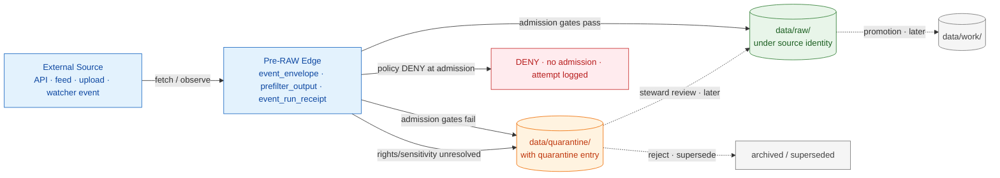
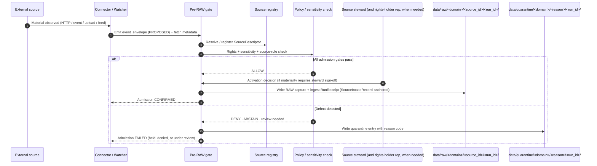
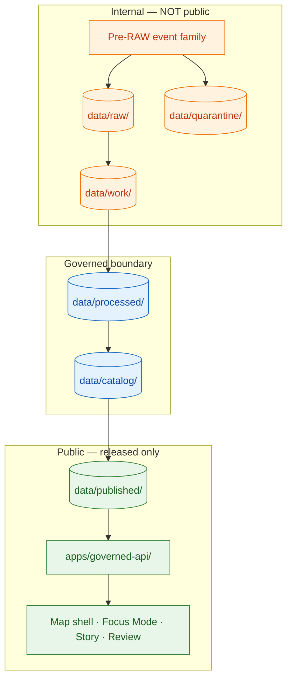
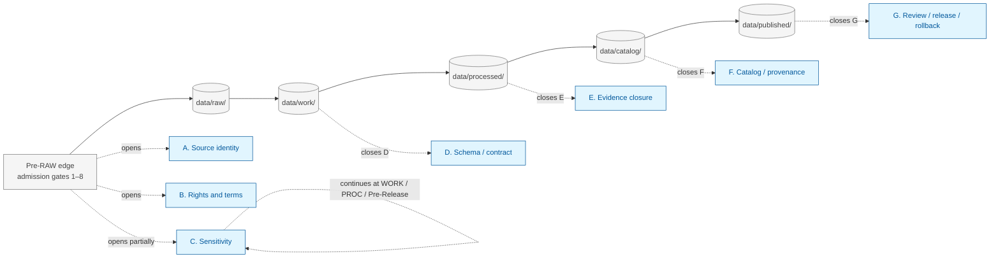

<!-- [KFM_META_BLOCK_V2]
doc_id: kfm://doc/sources/admission-process
title: KFM Source Admission Process
type: standard
version: v1.1
status: draft
owners: Source steward (lead) + Docs steward; Rights-holder representative when applicable
created: 2026-05-13
updated: 2026-05-23
policy_label: public
related:
  - docs/sources/SOURCE_DESCRIPTOR_STANDARD.md
  - docs/doctrine/lifecycle-law.md
  - docs/doctrine/trust-membrane.md
  - docs/doctrine/directory-rules.md
  - docs/architecture/contract-schema-policy-split.md
  - docs/governance/README.md
  - docs/registers/DRIFT_REGISTER.md
  - docs/adr/ADR-0001-schema-home.md
  - docs/adr/ADR-0003-policy-singular-is-canonical.md
  - control_plane/source_authority_register.yaml
  - contracts/source/
  - schemas/contracts/v1/source/
  - schemas/contracts/v1/events/
  - schemas/contracts/v1/receipts/
  - policy/sensitivity/
  - policy/sources/
  - data/raw/
  - data/quarantine/
  - data/receipts/ingest/
  - data/registry/sources/
  - connectors/
tags: [kfm, sources, admission, governance, lifecycle, pre-raw, source-descriptor, source-intake-record, source-activation-decision]
notes:
  - Defines the membrane between an external source and KFM's governed lifecycle.
  - Companion to SOURCE_DESCRIPTOR_STANDARD.md (field-level standard).
  - Specific paths and schema homes are PROPOSED per Directory Rules unless verified.
  - v1.1 adds the Promotion-Gates-A–G crosswalk, canonical-object-name reconciliation (SourceIntakeRecord), and verification-backlog updates.
[/KFM_META_BLOCK_V2] -->

# KFM Source Admission Process

> The membrane between an external source and KFM's governed lifecycle. Admission decides
> **whether** material may enter under what identity, role, rights, sensitivity, and cadence — before
> it touches `data/raw/`. Promotion (later) decides whether admitted material may move further.

[](#authority-and-scope)
[](#authority-and-scope)
[](#admission-and-the-lifecycle-invariant)
[](#failure-modes-and-quarantine-conditions)
[](#trust-membrane-at-admission)
[](#document-lineage)
[](#document-lineage)

| Status | Owners | Last reviewed | Authority |
|---|---|---|---|
| `draft` · `PROPOSED` paths | Source steward (lead) · Docs steward · Rights-holder rep (when applicable) | `2026-05-23` | Standard doc; subordinate to Directory Rules and Lifecycle Law |

---

## Quick links

- [What admission is](#what-admission-is)
- [What admission is not](#what-admission-is-not)
- [Authority and scope](#authority-and-scope)
- [Admission and the lifecycle invariant](#admission-and-the-lifecycle-invariant)
- [The admission flow at a glance](#the-admission-flow-at-a-glance)
- [Inputs accepted at admission](#inputs-accepted-at-admission)
- [The pre-RAW event family](#the-pre-raw-event-family)
- [The admission gate sequence](#the-admission-gate-sequence)
- [Crosswalk to Promotion Gates A–G](#crosswalk-to-promotion-gates-ag)
- [Source identity at admission — SourceDescriptor](#source-identity-at-admission--sourcedescriptor)
- [Source role is fixed at admission](#source-role-is-fixed-at-admission)
- [Outputs emitted at admission](#outputs-emitted-at-admission)
- [Object-name reconciliation (canonical vs proposed)](#object-name-reconciliation-canonical-vs-proposed)
- [Trust membrane at admission](#trust-membrane-at-admission)
- [Failure modes and quarantine conditions](#failure-modes-and-quarantine-conditions)
- [Separation of duties at admission](#separation-of-duties-at-admission)
- [Stale state, re-admission, and supersession](#stale-state-re-admission-and-supersession)
- [Determinism and integrity at admission](#determinism-and-integrity-at-admission)
- [Anti-patterns](#anti-patterns)
- [Repo placement of admission artifacts](#repo-placement-of-admission-artifacts)
- [Validators, schemas, policy](#validators-schemas-policy)
- [Open questions and verification backlog](#open-questions-and-verification-backlog)
- [Related docs](#related-docs)
- [Appendix A — Illustrative SourceDescriptor field surface](#appendix-a--illustrative-sourcedescriptor-field-surface)
- [Appendix B — Pre-RAW event family object map](#appendix-b--pre-raw-event-family-object-map)
- [Appendix C — Admission ↔ Promotion gate mapping](#appendix-c--admission--promotion-gate-mapping)
- [Document lineage](#document-lineage)

---

## What admission is

**CONFIRMED doctrine.** Source admission is the governed decision to accept material from an external
source into KFM under a known identity, role, rights posture, sensitivity tier, cadence, and steward.
Admission is the moment KFM takes responsibility for a piece of external evidence. Everything
downstream — normalization, validation, evidence resolution, policy decision, catalog closure,
release, correction, rollback — depends on admission having been made honestly.

Admission produces three durable governance artifacts:

1. A **`SourceDescriptor`** that records who/what/when/under-what-terms (CONFIRMED canonical object family).
2. A **`SourceActivationDecision`** that records whether the source may be used and how (CONFIRMED doctrine, v2.1 addition per `connected-dots-architecture-brief.md`).
3. A **`SourceIntakeRecord`** — and, on ADMIT, the captured RAW payload pinned by an ingest `RunReceipt` — that records the material actually placed in `data/raw/`. When admission fails closed, the artifact is a quarantine entry in `data/quarantine/` carrying a structured reason code and steward routing.

> [!IMPORTANT]
> **Admission ≠ Promotion.** Admission gates entry into the lifecycle. Promotion (later) moves admitted
> material through RAW → WORK/QUARANTINE → PROCESSED → CATALOG/TRIPLET → PUBLISHED.
> Both are governed state transitions. A file move is neither. The same vocabulary applies at both
> phases — `PolicyDecision`, `EvidenceRef`, `RunReceipt`, `ValidationReport` — but the **questions
> asked** are different. Admission asks *may this material enter*; promotion asks *may this material
> advance*.

## What admission is not

| Admission **IS** | Admission **IS NOT** |
|---|---|
| A governed entry decision tied to a `SourceDescriptor` | A file copy operation into `data/raw/` |
| The point where source role, rights, and sensitivity are fixed | A place to defer rights/sensitivity for "later" |
| A fail-closed gate for unresolved provenance | An optimistic admit-then-clean-up step |
| A producer of receipts and decisions | A producer of public-facing artifacts |
| Eligible to route material to `data/quarantine/` | Eligible to publish, render, or feed AI surfaces |
| Distinct from promotion | A substitute for validators, policy gates, or release |
| The first place `spec_hash` (JCS+SHA-256) is bound to source bytes | The last place integrity is checked |

[Back to top ↑](#kfm-source-admission-process)

---

## Authority and scope

**CONFIRMED authority order** (lower entries may operationalize higher ones but never override them
silently):

1. **KFM core invariants and lifecycle law.** RAW is not public. Promotion is a governed state
   transition. Cite-or-abstain. Source role is fixed at admission. Deny-by-default for unclear
   rights or sensitivity.
2. **Accepted ADRs that amend admission rules.** Notably any ADR that touches schema homes
   (`ADR-0001`), policy root (`ADR-0003`), source-role vocabulary (`ADR-S-04`, PROPOSED), sensitivity tiers (`ADR-S-05`, PROPOSED), or connector cadence and quarantine recovery (`ADR-S-12`, PROPOSED).
3. **Directory Rules** (`docs/doctrine/directory-rules.md`) for where admission artifacts live.
4. **This document.**
5. **Per-root READMEs** (`connectors/README.md`, `data/raw/README.md`, `data/quarantine/README.md`,
   `data/receipts/ingest/README.md`).
6. **Convention from the current mounted repo state.** **UNKNOWN in this session.** Drift between
   doctrine and repo, if any, becomes a `docs/registers/DRIFT_REGISTER.md` entry rather than new
   authority.

**Out of scope.** This document does not define:

- Field-level shape of the `SourceDescriptor` → see [`SOURCE_DESCRIPTOR_STANDARD.md`](./SOURCE_DESCRIPTOR_STANDARD.md) **(PROPOSED companion doc)**.
- Promotion gates A–G between RAW and PUBLISHED in full → see `docs/doctrine/lifecycle-law.md`. A **gate crosswalk** sits in [Crosswalk to Promotion Gates A–G](#crosswalk-to-promotion-gates-ag) below.
- Validation rules for PROCESSED / CATALOG / PUBLISHED objects → see `tools/validators/`.
- Release manifests, correction notices, rollback cards → see `release/` and `docs/governance/`.

> [!NOTE]
> Specific repo paths in this document are **PROPOSED** under Directory Rules unless the path has
> been verified against a mounted-repo checkout. No mounted repo was inspected in this session;
> implementation maturity is **UNKNOWN**. Where corpus documents disagree on a path (e.g., singular
> `schemas/contracts/v1/source/` vs plural `schemas/contracts/v1/sources/`), this document records
> the divergence in [Open questions and verification backlog](#open-questions-and-verification-backlog)
> rather than pre-deciding it.

[Back to top ↑](#kfm-source-admission-process)

---

## Admission and the lifecycle invariant

**CONFIRMED doctrine.** KFM's canonical data lifecycle is:

```text
RAW → WORK / QUARANTINE → PROCESSED → CATALOG / TRIPLET → PUBLISHED
```

Promotion through this chain is a **governed state transition, not a file move**. Admission sits at
the pre-RAW edge of this chain and decides whether material crosses into RAW at all. The pre-RAW
edge is **its own auditable phase**, not a hand-wave: every observed event has an envelope, every
admission attempt has a receipt, every failure has a reason code.



> [!NOTE]
> **PROPOSED:** The pre-RAW event family (`event_envelope`, `prefilter_output`, `event_run_receipt`)
> records attempted intake before data is admitted into RAW. Its presence is doctrine (see Atlas
> Pass 32 `KFM-P21-PROG-0025`; `KFM-P1-PROG-0008`); its specific schema home
> (`schemas/contracts/v1/events/` is the proposed default) is **NEEDS VERIFICATION**.

[Back to top ↑](#kfm-source-admission-process)

---

## The admission flow at a glance



| Step | Actor | Decision artifact | Default failure |
|---|---|---|---|
| Observe / fetch | Connector or watcher | `event_envelope` (PROPOSED) | ERROR / retry under bound |
| Identify | Pre-RAW gate + Source registry | `SourceDescriptor` (resolved or registered) | DENY if source identity unresolvable |
| Check role / rights / sensitivity | Policy + Source steward | `SourceActivationDecision` | DENY / QUARANTINE / hold for review |
| Capture | Pre-RAW gate | Ingest `RunReceipt` + `SourceIntakeRecord` *(or a quarantine entry)* | ERROR / QUARANTINE on hash mismatch |
| Log | Pre-RAW gate | `event_run_receipt` (PROPOSED) | ERROR (admission is auditable or it did not happen) |

[Back to top ↑](#kfm-source-admission-process)

---

## Inputs accepted at admission

**CONFIRMED doctrine; PROPOSED connector inventory.** Admission accepts material from sources for
which a `SourceDescriptor` exists (or can be created by an authorized steward) and whose rights,
role, sensitivity, and cadence are resolvable. The ingest patterns below mirror the layered
approach recurring across the corpus: HTTP validators first, manifest checksums second, push-based
object-store events third, change-data-capture fourth, with debounce-and-coalesce on top so
materialization runs only when `spec_hash` changes.

| Input class | Typical connector family | SourceDescriptor required | Notes |
|---|---|---|---|
| HTTP-validator polling (ETag / Last-Modified) | `connectors/<authority>/http_*` | Yes | Conditional GETs (`If-None-Match`, `If-Modified-Since`); `304` is a no-op admission with heartbeat receipt. |
| Object-store events (S3 / GCS) | `connectors/<authority>/event_*` | Yes | Idempotency key on (etag, key, generation). |
| STAC item watcher | `connectors/<authority>/stac_*` | Yes | Item identity bound to `SourceDescriptor`. |
| Database CDC (Debezium / Kafka Connect) | `connectors/<authority>/cdc_*` | Yes | Cursor pinned in run receipt. |
| Live feed / sensor stream | `connectors/<authority>/feed_*` | Yes | Debounce/coalesce per source class. |
| Manual upload | `connectors/local_upload/` | Yes | Uploader identity recorded; steward sign-off required for material classes. |
| User-controlled exports (consent-bound, e.g., DTC genomics) | `connectors/<authority>/consent_*` | Yes | Consent scope and revocation status are part of admission. |
| Authority-catalog crosswalk feeds (LCNAF, VIAF, Wikidata, Chronicling America, BLM GLO, GNIS) | `connectors/<authority>/auth_*` | Yes | Crosswalk admission anchors downstream entity reconciliation. |

> [!CAUTION]
> **No source, no admission.** Material without a resolvable `SourceDescriptor` does **not** enter
> `data/raw/`. It is either staged in `data/quarantine/` with reason `RIGHTS_UNKNOWN` or
> `ROLE_UNKNOWN`, or denied at the pre-RAW edge.

[Back to top ↑](#kfm-source-admission-process)

---

## The pre-RAW event family

**PROPOSED schema family** (Atlas Pass 32 `KFM-P21-PROG-0025`, `KFM-P1-PROG-0008`; **NEEDS
VERIFICATION** in repo). The pre-RAW event family makes attempted admission auditable even when
admission fails. It governs what happens **before** material is accepted into RAW.

| Object | Purpose | Proposed schema home |
|---|---|---|
| `event_envelope` | Records the observed change (URL, HTTP validators, content-length, watcher identity, fetch time). | `schemas/contracts/v1/events/event_envelope.schema.json` |
| `prefilter_output` | Records whether the observed event meets material-property allowlists before further work runs (e.g., bbox, license SPDX, source-role plausibility). | `schemas/contracts/v1/events/prefilter_output.schema.json` |
| `event_run_receipt` | Tamper-evident record of the pre-RAW evaluation: inputs, outputs, hashes, tool versions, decision, actor. | `schemas/contracts/v1/events/event_run_receipt.schema.json` |

> [!NOTE]
> The pre-RAW edge is especially load-bearing where **automated watchers, GitOps PR emission,
> live feeds, source refreshes, or model-assisted candidate generation** could otherwise blur the
> boundary between *observed input* and *accepted source material*.

**Watcher rule (CONFIRMED doctrine; Atlas Pass 32 `KFM-P1-PROG-0008`).** A watcher detects material
change and **opens a PR or proposal** rather than committing directly or publishing directly.
Silent watcher commits to `main` are an admission anti-pattern and a DENY-merge condition. This
is the **watcher-as-non-publisher** invariant.

[Back to top ↑](#kfm-source-admission-process)

---

## The admission gate sequence

**CONFIRMED doctrine, PROPOSED implementation.** Admission applies a small, ordered set of
fail-closed gates. The gates here are scoped to **admission** (entry into RAW); the broader
promotion gates A–G (between RAW and PUBLISHED) are documented in
`docs/doctrine/lifecycle-law.md` and mapped in [Crosswalk to Promotion Gates A–G](#crosswalk-to-promotion-gates-ag).

| # | Gate | Must answer | Default failure |
|---|---|---|---|
| 1 | **Structure / shape** | Does the fetched payload and its envelope match expected schema and required version? | `ERROR` → retry; persistent failure → `QUARANTINE` |
| 2 | **Identity** | Is the source resolvable to a registered `SourceDescriptor` (or a new descriptor authored by an authorized steward)? | `DENY` if source identity unresolvable |
| 3 | **Rights / license posture** | Are rights, license SPDX, attribution, redistribution terms known and admissible against the SPDX allowlist? | `DENY` if rights `unknown`; `QUARANTINE` for unresolved |
| 4 | **Source role** | Is the source role one of `observed`, `regulatory`, `modeled`, `aggregate`, `administrative`, `candidate`, `synthetic` — and is it consistent with the descriptor? | `DENY` on inconsistency; `QUARANTINE` on unknown |
| 5 | **Sensitivity tier** | Has sensitivity been evaluated for living-person data, DNA/genomics, rare-species, archaeology, infrastructure, sacred/cultural places? | `DENY` until evaluated; `QUARANTINE` for unresolved |
| 6 | **Cadence / freshness** | Is the declared cadence current; is this fetch within tolerance; is the source not retired? | `QUARANTINE` (stale) or `ERROR` on retired source |
| 7 | **Integrity** | Do checksums and HTTP validators agree; is the `spec_hash` reproducible from the canonicalized descriptor (RFC 8785 JCS + SHA-256)? | `QUARANTINE` on hash mismatch |
| 8 | **Activation** | Is a `SourceActivationDecision` (`allow` / `restrict` / `quarantine` / `deny` / `hold`) on file, and does steward sign-off apply? | `DENY` until decision recorded |

> [!IMPORTANT]
> **All admission gates are fail-closed.** A missing rights field, an unknown source role, an
> unresolved sensitivity flag, a hash mismatch, or absence of an activation decision routes
> material to `data/quarantine/` or denies admission entirely. Admission never silently downgrades
> a gate to a warning. This mirrors the default-deny promotion posture from Pass 10 C5-02 — the
> *absence of evidence is itself the failure*.

[Back to top ↑](#kfm-source-admission-process)

---

## Crosswalk to Promotion Gates A–G

**CONFIRMED doctrine; PROPOSED gate-letter labels.** The seven-gate matrix A–G (per Atlas / Pass 10
C5-01 / Unified Doctrine Synthesis §8) covers the full RAW → PUBLISHED chain. Admission does
**not** clear all seven gates — only those whose evidence can be established at the pre-RAW edge.
The remaining gates fire later, during normalization, validation, catalog closure, and release.

| Promotion Gate (A–G) | Cleared at admission? | Admission-time evidence available | Deferred to | Citation |
|---|---|---|---|---|
| **A — Source identity** | **Yes** (initial) | `SourceDescriptor` validation report; admission gates 1–2. | Re-checked at every downstream gate. | Atlas v1.1 §24.6; Pass 10 C5-01. |
| **B — Rights and terms** | **Yes** (initial) | `SourceActivationDecision` with SPDX, attribution, redistribution; admission gate 3. | Re-checked when rights status changes. | Atlas v1.1 §24.6. |
| **C — Sensitivity** | **Partial** | Sensitivity tier assigned (T0–T4) and recorded; admission gate 5. | `RedactionReceipt`, `AggregationReceipt`, `PolicyDecision` at WORK/PROCESSED/Pre-Release. | Atlas v1.1 §24.5; doctrine synthesis §15. |
| **D — Schema / contract** | **No** | Admission validates envelope shape only (gate 1). | Full `SchemaValidationReport` at PROCESSED. | Atlas v1.1 §24.6. |
| **E — Evidence closure** | **No** | Source identity is the *target* of later `EvidenceRef`s, not yet closed. | `EvidenceBundle` + `CitationValidationReport` at CATALOG / Release. | Atlas v1.1 §24.6; doctrine synthesis §8. |
| **F — Catalog / provenance** | **No** | None yet. | STAC/DCAT/PROV + `CatalogMatrix` at CATALOG. | Atlas v1.1 §24.6. |
| **G — Review / release / rollback** | **No** | None yet. | `PromotionReceipt` + `ReleaseManifest` + `RollbackCard` at PUBLISHED. | Atlas v1.1 §24.6. |

> [!TIP]
> Read this table as: **admission opens Gates A and B and partially opens Gate C**, recording
> enough to anchor every downstream gate. Failure at admission denies entry to RAW; failure at any
> later gate holds promotion at the prior stage. The chain is brittle by design — every gate that
> "didn't run" is treated as a gate that *failed*.

[Back to top ↑](#kfm-source-admission-process)

---

## Source identity at admission — SourceDescriptor

**CONFIRMED doctrine.** Every admitted source is anchored by a `SourceDescriptor` recording
source identity, source role, rights, sensitivity, cadence, access, steward, and release posture.
The `SourceDescriptor` anchors every downstream receipt: an ingest `RunReceipt`, a
`TransformReceipt`, a `ValidationReport`, an `EvidenceBundle`, or a `ReleaseManifest` traces back to
its admitting descriptor.

**PROPOSED schema home.** `schemas/contracts/v1/source/source_descriptor.schema.json` per
`ADR-0001` (schema home), unless an ADR relocates it. **NEEDS VERIFICATION** of actual file
presence and field names. **OPEN: singular `source/` vs plural `sources/`.** Atlas v1.1 §24.1.3
uses singular; `KFM_Unified_Implementation_Architecture_Build_Manual.md` §11 uses plural;
`data/registry/sources/` (plural) is the registry-side convention. Tracked in
[Open questions and verification backlog](#open-questions-and-verification-backlog).

Field-level shape is the responsibility of the companion document
[`SOURCE_DESCRIPTOR_STANDARD.md`](./SOURCE_DESCRIPTOR_STANDARD.md) (PROPOSED). A truncated,
illustrative summary appears in [Appendix A](#appendix-a--illustrative-sourcedescriptor-field-surface).

> [!NOTE]
> The `SourceDescriptor` is **not strictly a receipt**, but it is listed alongside the receipt family
> in Atlas v1.1 §24.2 because it anchors every downstream receipt. If the descriptor is missing,
> weak, or unsigned, downstream receipts cannot be trusted.

[Back to top ↑](#kfm-source-admission-process)

---

## Source role is fixed at admission

**CONFIRMED operating-law invariant** (Atlas v1.1 §24.1; `KFM-P1-PROG-0007`). A source's
`source_role` is **set at admission and never upgraded by promotion**. Promotion that "upgrades"
a role (e.g., `modeled → observed`) is a governance violation. Corrections that need to change a
role must:

1. Mark the prior `SourceDescriptor` `superseded` (retain it for audit).
2. Author a new `SourceDescriptor` with the correct role.
3. Emit a `CorrectionNotice` listing affected derivatives.
4. Invalidate dependent claims and run a rollback card if any are PUBLISHED.

| Role | Meaning | Example | Required descriptor fields beyond core |
|---|---|---|---|
| `observed` | Direct measurement or observation. | Stream gauge reading; species occurrence record. | — |
| `regulatory` | Issued by a governing authority. | FEMA NFHL flood zones; KDHE permit boundary. | `role_authority` |
| `modeled` | Output of a documented model run. | Floodplain hazard model; habitat suitability. | `role_authority`, `role_model_run_ref` |
| `aggregate` | Roll-up over a geometry / time scope. | County-year mean; decadal HUC total. | `role_authority`, `role_aggregation_unit` |
| `administrative` | Compilation by an administrative process. | Settlement timeline; road inventory record. | — |
| `candidate` | Provisional; not yet merged. | Watcher proposal pending steward review. | `role_candidate_disposition` |
| `synthetic` | Reconstructed or simulated. | 3D scene reconstruction; AI-assisted candidate. | `role_synthetic_basis`, `reality_boundary_note_ref` |

> [!WARNING]
> Treating an aggregate as a per-place observation, or a regulatory layer as an observed event, is a
> **source-role collapse**. KFM denies these joins at the validator and the AI surface (cross-lane
> joins are governed by `ADR-S-14`, PROPOSED). Source-role integrity is a publication precondition.

[Back to top ↑](#kfm-source-admission-process)

---

## Outputs emitted at admission

**CONFIRMED doctrine; PROPOSED paths.** A successful admission emits artifacts into specific
lifecycle homes. Paths below follow Directory Rules §9.1 (lifecycle invariant) but remain
PROPOSED until verified against a mounted repo.

| Artifact | Path (PROPOSED) | Always emitted? | Notes |
|---|---|---|---|
| `event_envelope` | `data/events/<source_id>/<run_id>/event_envelope.json` | On every observed event | Transient; DENY for public access. |
| `prefilter_output` | `data/events/<source_id>/<run_id>/prefilter_output.json` | On every observed event | Records pre-RAW decision. |
| `event_run_receipt` | `data/events/<source_id>/<run_id>/event_run_receipt.json` | On every observed event | Tamper-evident pre-RAW log. |
| `SourceDescriptor` (or supersession) | `data/registry/sources/<domain>/<source_id>.yaml` | When a descriptor is created or updated | Versioned; old descriptor retained on supersession. |
| `SourceActivationDecision` | `data/receipts/ingest/<domain>/<source_id>/<run_id>/activation.json` | When admission requires explicit activation | Records `allow` / `restrict` / `quarantine` / `deny` / `hold`. |
| RAW payload | `data/raw/<domain>/<source_id>/<run_id>/` | On ADMIT outcome | Source-native bytes preserved; checksum captured. |
| Ingest `RunReceipt` + `SourceIntakeRecord` | `data/receipts/ingest/<domain>/<source_id>/<run_id>/run_receipt.json` (PROPOSED) | On ADMIT outcome | Pairs with the RAW payload it captured; carries `spec_hash`, HTTP validators, source URL, fetch time. |
| Quarantine entry (reason-coded) | `data/quarantine/<domain>/<reason>/<run_id>/` | On QUARANTINE outcome | Reason code + steward routing; **PROPOSED naming**: see [Object-name reconciliation](#object-name-reconciliation-canonical-vs-proposed). |

> [!CAUTION]
> **Connectors emit only to `data/raw/` or `data/quarantine/`.** Per Directory Rules §7.3,
> connectors MUST NOT publish, MUST NOT mutate canonical truth, and MUST NOT write under
> `data/processed/`, `data/catalog/`, or `data/published/`. A connector that writes outside its
> lane is a trust-membrane violation.

[Back to top ↑](#kfm-source-admission-process)

---

## Object-name reconciliation (canonical vs proposed)

**NEEDS VERIFICATION.** Earlier drafts of this document used `RawCaptureReceipt` and
`QuarantineRecord` as object families. These names do **not** appear in the consolidated KFM
corpus (Atlas v1.1, Unified Doctrine Synthesis, Build Manual, Pass 10 dossier). The corpus uses
the families below; this revision maps the two vocabularies and flags the divergence for ADR
resolution.

| Earlier draft name (PROPOSED) | Doctrine-anchored equivalent (CONFIRMED in corpus) | Resolution |
|---|---|---|
| `RawCaptureReceipt` | Ingest `RunReceipt` *(generic)* + `SourceIntakeRecord` *(admission-decision envelope; Atlas `KFM-P4-PROG-0001`)* | **OPEN — ADR.** Either (a) keep `RawCaptureReceipt` as a specialized receipt under `schemas/contracts/v1/receipts/`, or (b) compose the two existing object families. This document treats `SourceIntakeRecord` as canonical and `RawCaptureReceipt` as a PROPOSED alias. |
| `QuarantineRecord` | Quarantine entry composed of: reason code, `PolicyDecision` (with `hold` / `deny`), steward review note (per `kfm_unified_doctrine_synthesis.md` §6). | **OPEN — ADR.** No canonical `QuarantineRecord` object family exists yet. This document uses the neutral phrase *quarantine entry* and treats `QuarantineRecord` as a PROPOSED object name. |
| `SourceActivationDecision` | Same name; **CONFIRMED v2.1 doctrine** (`connected-dots-architecture-brief.md`; doctrine synthesis §6). | No reconciliation needed. |
| `SourceIntakeRecord` | Same name; **CONFIRMED canonical doctrine** (`KFM-P4-PROG-0001`; doctrine synthesis §6). | No reconciliation needed. |

> [!NOTE]
> Once `ADR-S-04` (source-role vocabulary) and a companion ADR on admission-receipt naming land,
> this table collapses to a single canonical naming and the PROPOSED aliases are retired through
> the supersession workflow. Until then, both names may appear in dependent docs; cross-references
> SHOULD use the doctrine-anchored equivalents.

[Back to top ↑](#kfm-source-admission-process)

---

## Trust membrane at admission

**CONFIRMED invariant.** Admission sits inside the trust membrane. Public clients, the map shell,
Focus Mode, story surfaces, and AI surfaces consume **only** released, governed artifacts — never
RAW, WORK, QUARANTINE, or pre-RAW event objects.



> [!WARNING]
> A public client that reads from `data/raw/`, `data/work/`, `data/quarantine/`, or the pre-RAW event
> family **bypasses the trust membrane**. This is a top-severity anti-pattern. The DENY surface is
> the governed API and the layer-manifest resolver.

[Back to top ↑](#kfm-source-admission-process)

---

## Failure modes and quarantine conditions

**CONFIRMED doctrine.** Admission is fail-closed. The default outcome of any unresolved
admission-time defect is **QUARANTINE** with a reason code; outright **DENY** applies where
admission must be refused entirely. Reason codes below align with the master error-class
register (Atlas v1.1 §24.9 / doctrine synthesis §11) and are PROPOSED in their canonical form
until validators ratify them.

| Condition | Reason code (PROPOSED) | Outcome |
|---|---|---|
| Missing or unknown rights / license | `RIGHTS_UNKNOWN` | `QUARANTINE` |
| Source role unknown or inconsistent | `ROLE_UNKNOWN`, `ROLE_COLLAPSE_DETECTED` | `QUARANTINE` / `DENY` |
| Sensitivity unevaluated | `SENSITIVITY_UNRESOLVED` | `QUARANTINE` |
| Living-person, DNA/genomics, rare-species, archaeology, infrastructure data without rights basis | `SENSITIVITY_DENY` | `DENY` |
| Hash mismatch between fetched bytes and canonicalized descriptor | `HASH_MISMATCH` | `QUARANTINE` |
| Missing required `SourceDescriptor` field | `DESCRIPTOR_INCOMPLETE` | `QUARANTINE` |
| Missing or invalid attestation / signature (for signed sources) | `SIGNATURE_INVALID` | `QUARANTINE` |
| Source retired, cadence expired, or terms changed | `SOURCE_RETIRED`, `CADENCE_EXPIRED`, `TERMS_CHANGED` | `QUARANTINE` |
| Web connector encountered missing element, broken link, server failure, or unexpected page state | `INTAKE_DEFECT` | `QUARANTINE` (PROPOSED — fail-closed source intake; prevents silent evidence loss) |
| AI-generated candidate without steward approval | `UNAPPROVED_CANDIDATE` | `QUARANTINE` |
| SPDX license not on admission allowlist | `LICENSE_NOT_ADMISSIBLE` | `DENY` |

> [!IMPORTANT]
> **Quarantine is not a staging area for publication.** Material in `data/quarantine/` is not a
> publishable surface and cannot be promoted out of quarantine without explicit steward review,
> rights/sensitivity resolution, and (where applicable) a rights-holder representative sign-off.

[Back to top ↑](#kfm-source-admission-process)

---

## Separation of duties at admission

**CONFIRMED doctrine** (Atlas v1.1 §24.7.2), **maturity-dependent enforcement**. Directory Rules
and operating law treat separation of duties as maturity-dependent. The matrix below records the
doctrinal expectation; the supplement does not assert that tooling enforces it yet.

| Admission action | Author = approver? | Required separation |
|---|---|---|
| Routine admission (well-known, low-sensitivity source) | Yes | Source steward authors and approves. |
| Source has unresolved rights or sovereignty | **No** | Source steward + rights-holder representative. |
| Sensitive lane (archaeology · rare species · living-person · DNA · infrastructure · sacred/cultural) | **No** | Source steward + sensitivity reviewer + rights-holder representative where applicable. |
| Source-role change (supersession with new role) | **No** | Source steward + domain steward; correction reviewer if a PUBLISHED claim depends on it. |
| Watcher-emitted candidate at material-property allowlist edge | **No** | Source steward review of first 30 days of watcher behavior (PROPOSED). |

> [!TIP]
> Separation of duties scales with the **public trust surface**, not with the file size. A small but
> sensitive admission still requires the right reviewers. As enforcement matures, the rules here
> migrate from custom into tooling per `ADR-S-09` (PROPOSED).

[Back to top ↑](#kfm-source-admission-process)

---

## Stale state, re-admission, and supersession

**CONFIRMED doctrine** (Atlas v1.1 §24.8). Admission decisions age. KFM separates *stale* from
*wrong*: a stale admission is one whose evidence, source freshness, dependent terms, or context
has aged past its declared tolerance; a wrong admission is one whose substance is incorrect.

| Marker | Triggered by | Required action |
|---|---|---|
| Source freshness expired | Cadence in `SourceDescriptor` passed without a new admission. | Re-admit or supersede; otherwise mark dependent claims stale. |
| Rights status changed | Rights change in `SourceDescriptor` or rights-holder communication. | Re-evaluate sensitivity tier; potentially downgrade; emit `CorrectionNotice` if necessary. |
| Schema version drift | Descriptor schema upgraded past the admitted descriptor's version. | Migrate, re-validate, re-admit; or mark stale. |
| Source retired | Authority retired the source or terms expired. | Mark dependent claims stale; no further admission. |
| Geography version drift | `GeographyVersion` replaced; admitted material still bound to prior version. | Rebind to current `GeographyVersion`; re-admit; or mark stale. |
| Policy version changed | Sensitivity / rights policy referenced by activation decision was superseded. | Re-run activation; potentially supersede admission. |

**Supersession rule.** A re-admitted source produces a **new `SourceDescriptor`** with a
`superseded_by` link in the prior descriptor. Old descriptors are **retained**; admission lineage
remains queryable.

[Back to top ↑](#kfm-source-admission-process)

---

## Determinism and integrity at admission

**CONFIRMED doctrine** (Pass 10 C1-01, C1-02; doctrine synthesis §28). Admission is where KFM
binds source bytes to a tamper-evident identity for the first time. Three integrity primitives
apply:

| Primitive | What it does at admission | Failure mode |
|---|---|---|
| **`spec_hash` (`jcs:sha256:<hex>`)** | The `SourceDescriptor` is canonicalized per RFC 8785 (JCS) and hashed with SHA-256; the hash is recorded in the ingest `RunReceipt` and reproducible from canonicalized bytes. | Mismatch on recomputation → `HASH_MISMATCH` → `QUARANTINE`. |
| **HTTP validators (ETag, Last-Modified, content-length)** | Persisted per `SourceRef` (Atlas Pass 32 `KFM-P18-PROG-0009`); no-change and changed-source paths are explicit. `304 Not Modified` is a no-op admission with a heartbeat receipt. | Validator drift without content change → false-positive fetch; integrity gate still binds bytes. |
| **Attestation (cosign / DSSE; where applicable)** | For signed sources, the attestation bundle digest is recorded against the receipt's `bundle_digest`. | Invalid signature → `SIGNATURE_INVALID` → `QUARANTINE`. |

> [!IMPORTANT]
> Determinism at admission is what later makes promotion auditable. Every receipt that later cites
> the admitting `SourceDescriptor` inherits this binding. **PROPOSED:** the receipt schema home is
> `schemas/contracts/v1/receipts/` per `ADR-S-03` (open); the canonical receipt schema is
> `run_receipt.v1` per Pass 10 C1-01 (PROPOSED naming).

[Back to top ↑](#kfm-source-admission-process)

---

## Anti-patterns

| Anti-pattern | What goes wrong | Counter-rule |
|---|---|---|
| Admission "by file move" | Bytes appear in `data/raw/` without a `SourceDescriptor` or ingest receipt. | Admission emits artifacts; if no receipt, no admission. |
| Silent watcher commit to `main` | Watcher writes directly to canonical stores. | Watcher opens a PR/proposal in WORK; never publishes directly (`KFM-P1-PROG-0008`). |
| Optimistic admit-then-clean-up | Material with `RIGHTS_UNKNOWN` enters RAW "for later evaluation". | Unresolved rights → `QUARANTINE` at admission, not RAW. |
| Source-role upgrade by promotion | A modeled record is later reclassified `observed` to ease publication. | Source role is fixed at admission; corrections require supersession + `CorrectionNotice`. |
| Connector writes to PROCESSED / CATALOG / PUBLISHED | Trust membrane bypassed. | Connectors output only to `data/raw/` or `data/quarantine/` (Directory Rules §7.3). |
| Documenting admission instead of validating it | A `docs/` page asserts admission rules; no validator enforces them. | Docs are part of the working system but never substitute for validators, fixtures, or schema. |
| AI-generated candidate admitted as truth | Synthetic content carried into RAW without steward review. | AI is advisory; `EvidenceBundle` outranks model text; `candidate` role pending merge. |
| Admission of a source without sensitivity evaluation in sensitive lanes | Living-person, DNA, rare-species, archaeology, or infrastructure data slips through. | Deny-by-default register; `SENSITIVITY_DENY` at admission. |
| Aggregate source admitted with per-place implication | Source role is captured as `observed` instead of `aggregate`. | `role_aggregation_unit` MUST be present for `aggregate`. |
| `spec_hash` recomputed only at publication | Promotion can no longer verify the bytes that were originally admitted. | `spec_hash` is computed at admission and re-verifiable at every downstream gate. |

[Back to top ↑](#kfm-source-admission-process)

---

## Repo placement of admission artifacts

**PROPOSED placement per Directory Rules; NEEDS VERIFICATION against mounted repo.** Admission
artifacts span several responsibility roots; the table below names each artifact's owning root and
the Directory Rules basis.

| Artifact / file | Owning root | Directory Rules basis |
|---|---|---|
| Connector source code | `connectors/<authority>/` | §7.3 — source-specific fetch and admission |
| Pipeline spec for ingest | `pipeline_specs/<domain>/` | §7.4 — declarative pipeline configuration |
| Executable pipeline for ingest | `pipelines/ingest/` | §7.4 — executable pipeline logic |
| Pre-RAW event schemas | `schemas/contracts/v1/events/` | §7.4 / §6.4 — schemas (machine shape) |
| `SourceDescriptor` schema | `schemas/contracts/v1/source/source_descriptor.schema.json` (PROPOSED; singular/plural OPEN) | §7.4 / `ADR-0001` — schema home |
| `SourceDescriptor` contract (object meaning) | `contracts/source/` | §6.3 — object meaning |
| Source registry entries | `data/registry/sources/<domain>/` | §9.1 — lifecycle registry |
| RAW payload | `data/raw/<domain>/<source_id>/<run_id>/` | §9.1 / §7.3 |
| Quarantine payload + record | `data/quarantine/<domain>/<reason>/<run_id>/` | §9.1 |
| Ingest receipts (including `SourceIntakeRecord`-anchored `RunReceipt`) | `data/receipts/ingest/<domain>/<source_id>/<run_id>/` | §9.1 — receipt class |
| Admission policy bundles | `policy/sensitivity/`, `policy/sources/` (PROPOSED) | §6.1 — single canonical `policy/` home (`ADR-0003`) |
| Admission validators | `tools/validators/connector_gate/`, `tools/validators/source_descriptor/` | §7.5 |
| CODEOWNERS for admission | Repo root `CODEOWNERS` | Governance |

> [!NOTE]
> **Compatibility-root reminder.** If a repository mirror under `policies/` or `jsonschema/` is
> observed, it MUST declare its compatibility class (`mirror`, `legacy`, etc.). Canonical homes are
> `policy/` (per `ADR-0003`) and `schemas/`. See Directory Rules §8.

[Back to top ↑](#kfm-source-admission-process)

---

## Validators, schemas, policy

**PROPOSED-to-create; NEEDS VERIFICATION.** Admission must be enforceable by validators, schemas,
and policy bundles — not by prose alone. The default-deny posture from Pass 10 C5-02 applies:
*the absence of evidence blocks admission*.

| Layer | Object | Expected home |
|---|---|---|
| Schema | `event_envelope`, `prefilter_output`, `event_run_receipt` | `schemas/contracts/v1/events/` |
| Schema | `source_descriptor`, `source_activation_decision`, ingest `run_receipt`, quarantine entry | `schemas/contracts/v1/source/` and `schemas/contracts/v1/receipts/` (OPEN per `ADR-S-03`) |
| Contract | Object meaning for each of the above | `contracts/source/`, `contracts/receipts/` |
| Policy | Admission rights / SPDX allowlist (CC0-1.0, CC-BY-4.0 baseline; ODC-By, PDDL, US-PD candidates per Pass 10 C5-02 OQ) | `policy/sources/license.rego` (PROPOSED) |
| Policy | Sensitivity gates (living-person, DNA, rare-species, archaeology, infrastructure) | `policy/sensitivity/` |
| Validator | Connector output conformance (raw or quarantine only) | `tools/validators/connector_gate/` |
| Validator | `SourceDescriptor` structural / role / rights checks | `tools/validators/source_descriptor/` |
| Validator | Pre-RAW event-family checks (envelope shape, prefilter result, receipt presence) | `tools/validators/connector_gate/` (PROPOSED) |
| Fixture | Valid and negative admission cases (rights unknown, sensitive geometry exact, source-role collapse) | `tests/fixtures/admission/` (PROPOSED) |
| Test | Negative-path enforcement | `tests/policy_negative/` and `tests/admission/` |

> [!IMPORTANT]
> Negative fixtures are mandatory. The admission system is only enforceable if `RIGHTS_UNKNOWN`,
> `SENSITIVITY_UNRESOLVED`, `ROLE_COLLAPSE_DETECTED`, `HASH_MISMATCH`, and
> `SIGNATURE_INVALID` all produce the expected `DENY` or `QUARANTINE` outcome in tests. Policy
> parity (Pass 10 C5-03) requires the same OPA bundle to evaluate at CI time and at runtime; the
> admission policy bundle is no exception.

[Back to top ↑](#kfm-source-admission-process)

---

## Open questions and verification backlog

| # | Item | Status |
|---|---|---|
| 1 | Pre-RAW event family schema home — confirm `schemas/contracts/v1/events/` or amend by ADR. | `NEEDS VERIFICATION` |
| 2 | SPDX allowlist for admission — CC0-1.0 + CC-BY-4.0 baseline; ODC-By, PDDL, US-PD posture (Pass 10 C5-02 OQ). | `OPEN ADR — ADR-S-XX (PROPOSED)` |
| 3 | Source-role enum stability and evolution rule. | `OPEN ADR — ADR-S-04 (PROPOSED)` |
| 4 | Sensitivity tier scheme (T0–T4) — adopt as canonical at admission. | `OPEN ADR — ADR-S-05 (PROPOSED)` |
| 5 | Pre-RAW transient staging location — `data/events/` proposed; verify or relocate. | `NEEDS VERIFICATION` |
| 6 | Watcher material-property allowlists — steward review of first 30 days of false-trigger behavior. | `NEEDS VERIFICATION` |
| 7 | Rights-change detection across third-party sources — currently not automated. | `RESIDUAL RISK` |
| 8 | CODEOWNERS coverage for admission paths. | `NEEDS VERIFICATION` |
| 9 | DSSE / cosign legal constraints for regulated sources at admission time. | `NEEDS VERIFICATION` |
| 10 | Current mounted repo topology and admission implementation maturity. | `UNKNOWN` |
| 11 | **Singular `schemas/contracts/v1/source/` vs plural `schemas/contracts/v1/sources/`.** Atlas v1.1 §24.1.3 uses singular; `KFM_Unified_Implementation_Architecture_Build_Manual.md` §11 uses plural; `data/registry/sources/` uses plural. | `OPEN ADR — schema-home affirmation under ADR-0001` |
| 12 | **`RawCaptureReceipt` and `QuarantineRecord` naming.** Neither appears in the consolidated corpus; doctrine-anchored equivalents are `SourceIntakeRecord` + ingest `RunReceipt`, and a composed quarantine entry (`PolicyDecision` with `hold`/`deny` + reason code). | `OPEN ADR — admission-receipt naming` |
| 13 | **Connector cadence + quarantine recovery policy** (per the connectors README skeleton). | `OPEN ADR — ADR-S-12 (PROPOSED)` |
| 14 | Receipt class home — `schemas/contracts/v1/receipts/` vs `schemas/contracts/v1/<domain>/receipts/`. | `OPEN ADR — ADR-S-03 (PROPOSED)` |
| 15 | HTTP-validator persistence (ETag, Last-Modified) per `SourceRef` — canonical sidecar / checkpoint table (per `KFM-P18-PROG-0009`). | `NEEDS VERIFICATION` |
| 16 | Canonical `run_receipt.v1` schema — Pass 10 C1-01 names it; ADR-class commit pending. | `OPEN ADR — run_receipt.v1 home` |

[Back to top ↑](#kfm-source-admission-process)

---

## Related docs

- [`docs/sources/SOURCE_DESCRIPTOR_STANDARD.md`](./SOURCE_DESCRIPTOR_STANDARD.md) — field-level standard for the descriptor object. **PROPOSED companion doc.**
- [`docs/doctrine/lifecycle-law.md`](../doctrine/lifecycle-law.md) — promotion gates A–G between RAW and PUBLISHED. **PROPOSED placement.**
- [`docs/doctrine/trust-membrane.md`](../doctrine/trust-membrane.md) — what counts as public; how the membrane is enforced. **PROPOSED placement.**
- [`docs/doctrine/directory-rules.md`](../doctrine/directory-rules.md) — where admission artifacts live. **CONFIRMED doctrine reference.**
- [`docs/architecture/contract-schema-policy-split.md`](../architecture/contract-schema-policy-split.md) — how meaning / shape / admissibility are separated. **PROPOSED placement.**
- [`docs/governance/README.md`](../governance/README.md) — separation-of-duties matrix and reviewer roles. **PROPOSED placement.**
- [`docs/registers/DRIFT_REGISTER.md`](../registers/DRIFT_REGISTER.md) — where mounted-repo conflicts with this doc are recorded. **PROPOSED placement.**
- [`docs/runbooks/source-admission.md`](../runbooks/source-admission.md) — step-by-step operational runbook (companion runbook). **TODO — create.**
- [`docs/adr/ADR-0001-schema-home.md`](../adr/ADR-0001-schema-home.md) — schema-home convention. **CONFIRMED reference.**
- [`docs/adr/ADR-0003-policy-singular-is-canonical.md`](../adr/ADR-0003-policy-singular-is-canonical.md) — `policy/` canonical. **CONFIRMED reference.**
- [`connectors/README.md`](../../connectors/README.md) — per-connector source descriptor reference and lane rules. **NEEDS VERIFICATION** of presence.
- [`data/raw/README.md`](../../data/raw/README.md), [`data/quarantine/README.md`](../../data/quarantine/README.md), [`data/receipts/ingest/README.md`](../../data/receipts/ingest/README.md) — per-root READMEs in the lifecycle home. **NEEDS VERIFICATION** of presence.

[Back to top ↑](#kfm-source-admission-process)

---

## Appendix A — Illustrative SourceDescriptor field surface

> [!NOTE]
> **PROPOSED, illustrative, not authoritative.** Authoritative field surface lives in
> `SOURCE_DESCRIPTOR_STANDARD.md` and `schemas/contracts/v1/source/source_descriptor.schema.json`
> (PROPOSED). Reproduced here only to anchor the admission discussion. **NEEDS VERIFICATION.**

<details>
<summary><strong>Click to expand: illustrative descriptor surface</strong></summary>

| Field | Type / vocabulary | Required? | Notes |
|---|---|---|---|
| `source_id` | string (stable identifier) | MUST | Set at admission; never reused on supersession. |
| `source_role` | enum: `observed` \| `regulatory` \| `modeled` \| `aggregate` \| `administrative` \| `candidate` \| `synthetic` | MUST | Fixed at admission. |
| `authority` | string (issuing body) | MUST | Disambiguates the authoring authority. |
| `rights` | structured: `{ spdx, attribution, redistribution, terms_url }` | MUST | Admission-blocking if absent or unknown. |
| `sensitivity` | tier token (e.g., `T0` … `T4`) | MUST | Admission-blocking for unresolved sensitive lanes. |
| `cadence` | structured: `{ expected_interval, freshness_tolerance }` | MUST | Drives stale-state markers. |
| `access` | structured: `{ method, endpoint, auth_class }` | MUST | Drives connector binding. |
| `steward` | string / role reference | MUST | Source steward; rights-holder rep when applicable. |
| `ingest_hash` / `spec_hash` | `jcs:sha256:<hex>` over canonicalized descriptor | MUST | Reproducible from canonicalized bytes (RFC 8785 JCS + SHA-256). |
| `http_validators` | structured: `{ etag, last_modified, content_length }` | MUST when access method is HTTP | Persisted per `SourceRef`; basis for conditional GETs. |
| `time` | ISO 8601 admission timestamp | MUST | Distinct from observed / valid / retrieval / release / correction times. |
| `citation` | structured citation block | MUST | Travels with downstream `EvidenceBundle`s. |
| `role_authority` | string | MUST when role ∈ `{regulatory, modeled, aggregate}` | — |
| `role_aggregation_unit` | geometry-scope token (county, HUC, tract, year, decade, …) | MUST when `source_role = aggregate` | Prevents geometry-scope drift on join. |
| `role_model_run_ref` | `EvidenceRef → ModelRunReceipt` | MUST when `source_role = modeled` | — |
| `role_synthetic_basis` | structured: `{ method, inputs, reality_boundary_note_ref }` | MUST when `source_role = synthetic` | — |
| `role_candidate_disposition` | enum: `pending` \| `merged` \| `rejected` \| `quarantined` | MUST when `source_role = candidate` | PUBLISHED edge forbidden until `merged`. |
| `superseded_by` | descriptor id | OPTIONAL | Set when a newer descriptor replaces this one. |
| `release_posture` | enum: `public` \| `restricted` \| `internal` \| `deny_by_default` | MUST | Drives downstream `PolicyDecision`. |

</details>

[Back to top ↑](#kfm-source-admission-process)

---

## Appendix B — Pre-RAW event family object map

> [!NOTE]
> **PROPOSED, illustrative.** Authoritative shape will live in `schemas/contracts/v1/events/`
> (PROPOSED). **NEEDS VERIFICATION.**

<details>
<summary><strong>Click to expand: pre-RAW event family</strong></summary>

```text
event_envelope
├── event_id            (uuid)
├── source_id           (FK → SourceDescriptor)
├── observed_at         (ISO 8601)
├── watcher             { name, version, run_id }
├── source_head         { etag, last_modified, content_length, content_type }
├── source_url          (string)
├── payload_digest      (jcs:sha256:<hex> or content hash)
└── prefilter_input_ref (path to local capture or URI)

prefilter_output
├── event_id            (FK → event_envelope)
├── allowlist_checks    [ { name, result } ]
├── role_plausibility   (enum)
├── license_signal      (SPDX or "unknown")
├── sensitivity_signal  (tier or "unresolved")
├── decision            (allow | quarantine | deny | hold)
└── decision_reason     (string)

event_run_receipt
├── decision_id         (uuid)
├── policy_id           (e.g., "gate.preraw.admission")
├── spec_hash           (jcs:sha256:<hex> over canonicalized inputs)
├── inputs              { event_envelope_ref, prefilter_output_ref }
├── tool_versions       { connector, prefilter, validator }
├── timestamps          { started, ended }
├── outcome             (admit | quarantine | deny | error)
├── outcome_reason      (string)
├── attestation         { type: "cosign", bundle_digest: "sha256:..." }   # when materiality requires
└── actor               (steward identity or automated runner id)
```

</details>

[Back to top ↑](#kfm-source-admission-process)

---

## Appendix C — Admission ↔ Promotion gate mapping

> [!NOTE]
> Companion to [Crosswalk to Promotion Gates A–G](#crosswalk-to-promotion-gates-ag). The
> diagram below shows where each promotion gate is *first opened* (initial evidence) and where
> it is *closed* (final evidence). Admission opens Gates A and B fully and Gate C partially;
> later phases close Gates C–G.

<details>
<summary><strong>Click to expand: gate-opening map</strong></summary>



</details>

[Back to top ↑](#kfm-source-admission-process)

---

## Document lineage

| Field | Value |
|---|---|
| Document version | `v1.1` (draft) |
| Created | `2026-05-13` |
| Last reviewed | `2026-05-23` |
| Supersedes | `v1` (2026-05-13) |
| Replaces | — |
| Lineage note | v1.1 adds the **Crosswalk to Promotion Gates A–G** section, an **Object-name reconciliation** section aligning the doc with canonical KFM object families (`SourceIntakeRecord`), a **Determinism and integrity at admission** section anchoring `spec_hash` / HTTP-validator / attestation evidence, and an expanded **verification backlog** including the singular/plural schema-home divergence and `ADR-S-03` / `ADR-S-04` / `ADR-S-05` / `ADR-S-12` open items. No anchor in v1 is dropped; new anchors are additive. |
| Drift policy | Conflicts between this document and the mounted repo are recorded in `docs/registers/DRIFT_REGISTER.md` rather than treated as authority. |

---

**Last updated:** `2026-05-23` · **Owners:** Source steward (lead) · Docs steward · Rights-holder rep (when applicable) · [Back to top ↑](#kfm-source-admission-process)
