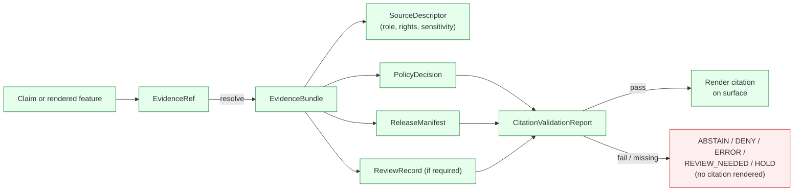
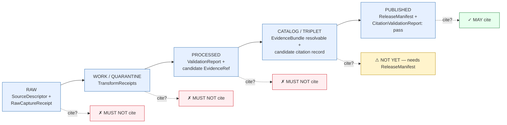
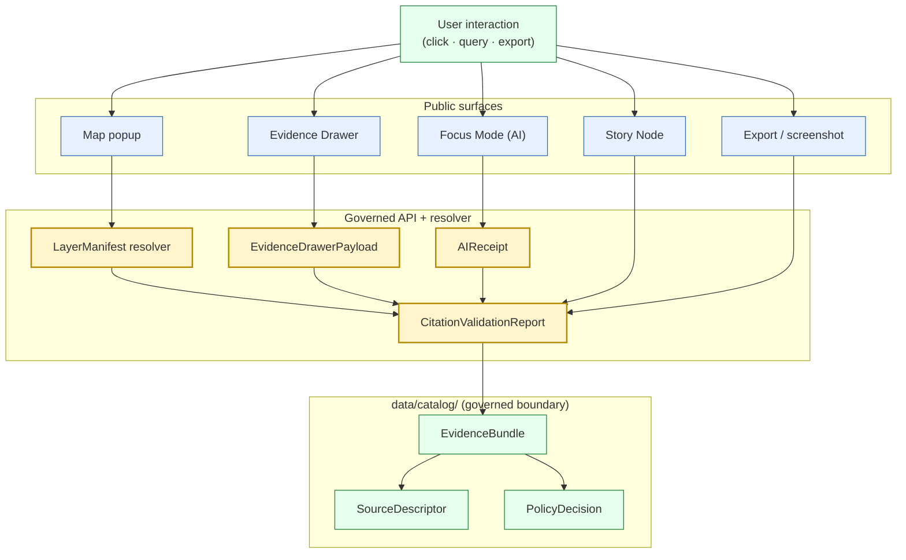
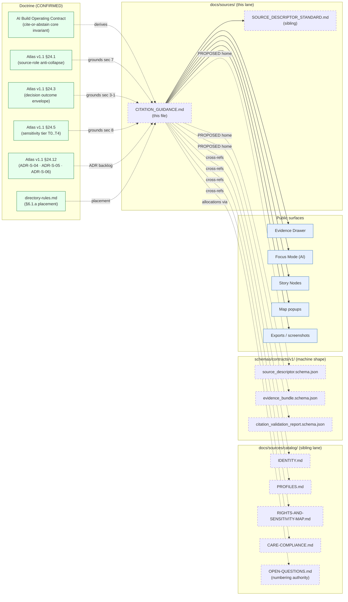

<!-- [KFM_META_BLOCK_V2]
doc_id: kfm://doc/sources-citation-guidance
title: Citation Guidance
type: standard
version: v0.3
status: draft
owners: Docs steward; Source steward (PROPOSED co-owner); Governed-AI steward (PROPOSED reviewer for §3, §6, §8.3, §9)
created: 2026-05-13
updated: 2026-05-23
supersedes: v0.2 (2026-05-23)
policy_label: public
related:
  - docs/sources/SOURCE_DESCRIPTOR_STANDARD.md
  - docs/sources/catalog/README.md
  - docs/sources/catalog/IDENTITY.md
  - docs/sources/catalog/PROFILES.md
  - docs/sources/catalog/RIGHTS-AND-SENSITIVITY-MAP.md
  - docs/sources/catalog/CARE-COMPLIANCE.md
  - docs/sources/catalog/GLOSSARY.md
  - docs/sources/catalog/OPEN-QUESTIONS.md
  - docs/doctrine/directory-rules.md
  - docs/doctrine/truth-posture.md
  - docs/doctrine/trust-membrane.md
  - docs/doctrine/lifecycle-law.md
  - contracts/OBJECT_MAP.md
  - schemas/contracts/v1/source/source_descriptor.schema.json
  - schemas/contracts/v1/focus/citation_validation_report.schema.json
  - schemas/contracts/v1/evidence/evidence_bundle.schema.json
tags: [kfm, citation, evidence, sources, doctrine, cite-or-abstain, source-role, sensitivity-tier]
notes:
  - "v0.3 changes (polish + missing items): moved 6-badge row to top-of-file; added At-a-glance quick reference; added REVIEW_NEEDED to §3.1 outcomes table to match §3 prose (consistency fix); added Six time-kinds inset in §4 (CONFIRMED — Atlas per-domain dossiers §E); added §5 lifecycle Mermaid showing progressive binding; added §6 surface-flow Mermaid; added 12 cross-cutting deny lanes summary inset in §8.2 from RIGHTS-AND-SENSITIVITY-MAP.md v0.2; added §11 status symbols (✅ CONFIRMED / 🔶 PROPOSED) plus Atlas-source column; added §12.6 synthetic content + Reality Boundary Note + §12.7 export/screenshot worked examples; converted §13 from prose to clean table format with status column; added Status vocabulary subsection §13.0; cross-referenced Pass-32 KFM-P3-IDEA-0004 catalog extensions (kfm:trust_class, kfm:source_role) in §4 + §6; added §16 Where this standard sits Mermaid; added §17 Glossary of cited objects appendix; polished footer."
  - "v0.2 changes (preserved): strengthened evidence anchors with explicit Atlas v1.1 §24.1 and §24.5 citations; added §2.4 placement note (KFM-coined topical per directory-rules.md §6.1.a); strengthened §7 with [DOM-XXX] short-name citations from Atlas §24.1.1; strengthened §11 anti-patterns with explicit Atlas §24.1.2 corpus quotes; added §14 maintenance rules; cross-referenced sibling docs in docs/sources/catalog/ v0.2 set; flagged ADR-S-04 (Source-role vocabulary v1) and ADR-S-05 (Sensitivity tier scheme T0..T4) as the doctrine-synthesis ADR backlog correspondents."
  - "File path is PROPOSED per Directory Rules §6.1.a (KFM-coined topical UPPERCASE_WITH_UNDERSCORES) and §7."
  - "All schema, route, and validator paths quoted in this doc are PROPOSED until verified against a mounted repository; no mounted repo in this session."
  - "OPEN-DSC-* numbering authority for the catalog lane lives in docs/sources/catalog/OPEN-QUESTIONS.md (established in its v0.2). This doc's open items use OPEN-CITE-NN locally; cross-cutting items reference the catalog-lane register."
[/KFM_META_BLOCK_V2] -->

# Citation Guidance

> **A citation is the visible end of an evidence chain. If the chain does not resolve, the surface does not speak — it abstains.**


**Status:** draft · **Edition:** v0.3 · **Type:** standard (doctrine) · **Last reviewed:** 2026-05-23

> [!IMPORTANT]
> **The whole doctrine in one paragraph.** A citation **must** resolve to an `EvidenceBundle` before the surface speaks. The **seven source roles** (`observed`, `regulatory`, `modeled`, `aggregate`, `administrative`, `candidate`, `synthetic`) are set at admission and **never collapsed**. The **five sensitivity tiers** (`T0..T4`) ride with the citation: upgrades require a transform receipt **and** a review record; downgrades require only a `CorrectionNotice`. **AI text is never evidence. Candidates never publish. Tiles are never proof.** If any of these fail, the surface returns one of six finite outcomes (`ANSWER`, `ABSTAIN`, `DENY`, `ERROR`, `HOLD`, `REVIEW_NEEDED`) — never fluent prose.

---

## 0. Status & Authority

| Field | Value |
|---|---|
| **Document type** | Standard — operational doctrine for citations across KFM surfaces |
| **Authority of this guidance** | **CONFIRMED** — derives from the **cite-or-abstain** core invariant *(AI Build Operating Contract §4; Atlas v1.1 §1.1)* |
| **Authority of any specific path quoted here** | PROPOSED until verified against mounted-repo evidence |
| **Proposed canonical home** | `docs/sources/CITATION_GUIDANCE.md` *(per `directory-rules.md` §6.1.a — KFM-coined topical UPPERCASE_WITH_UNDERSCORES; see §2.4)* |
| **Owner** | Docs steward (PROPOSED: co-owned with Source steward and Governed-AI steward) |
| **Reviewers required for change** | Docs steward + Source steward; an ADR is required for changes that alter required citation fields, change `CitationValidationReport` outcomes, or relax the cite-or-abstain default *(ADR-class per `directory-rules.md` §2.4)* |
| **Supersedes** | v0.2 (2026-05-23). |
| **Related doctrine** | [`SOURCE_DESCRIPTOR_STANDARD.md`](./SOURCE_DESCRIPTOR_STANDARD.md), [`directory-rules.md`](../doctrine/directory-rules.md), `docs/doctrine/truth-posture.md`, `docs/doctrine/trust-membrane.md`, `docs/architecture/governed-ai/FOCUS_FLOW.md`, [`docs/sources/catalog/RIGHTS-AND-SENSITIVITY-MAP.md`](./catalog/RIGHTS-AND-SENSITIVITY-MAP.md), [`docs/sources/catalog/CARE-COMPLIANCE.md`](./catalog/CARE-COMPLIANCE.md) |
| **Schema homes referenced** | `schemas/contracts/v1/source/source_descriptor.schema.json`, `schemas/contracts/v1/evidence/evidence_bundle.schema.json`, `schemas/contracts/v1/focus/citation_validation_report.schema.json` *(all PROPOSED; verify against ADR-0001 — schema home — and mounted-repo evidence)* |
| **Lifecycle reach** | Citation requirements bind **every surface downstream of the catalog**: governed APIs, Evidence Drawer, Focus Mode, Story Nodes, exports, screenshots, popups. |
| **Doctrine-synthesis ADR backlog correspondents** | **ADR-S-04** *(Source-role vocabulary v1)* for §4 / §7; **ADR-S-05** *(Sensitivity tier scheme T0..T4)* for §8 / §4 `sensitivity_tier`; **ADR-S-06 / ADR-S-09** *(Governed-AI adapter contract)* for §8.3 |

---

## Quick jump

- [§1 Purpose](#1-purpose)
- [§2 Authority, conformance, placement, and related doctrine](#2-authority-conformance-placement-and-related-doctrine)
- [§3 The cite-or-abstain rule](#3-the-cite-or-abstain-rule)
- [§4 What a citation MUST carry](#4-what-a-citation-must-carry)
- [§5 Citation lifecycle (RAW → PUBLISHED)](#5-citation-lifecycle-raw--published)
- [§6 Surface-specific citation behavior](#6-surface-specific-citation-behavior)
- [§7 Source role → citation form (no role collapse)](#7-source-role--citation-form-no-role-collapse)
- [§8 Rights, sensitivity, and CARE-bound citations](#8-rights-sensitivity-and-care-bound-citations)
- [§9 Validation — `CitationValidationReport`](#9-validation--citationvalidationreport)
- [§10 Doctrine cross-reference short names](#10-doctrine-cross-reference-short-names)
- [§11 Anti-patterns](#11-anti-patterns)
- [§12 Worked examples](#12-worked-examples)
- [§13 Open questions and verification backlog](#13-open-questions-and-verification-backlog)
- [§14 Maintenance rules](#14-maintenance-rules)
- [§15 Related docs](#15-related-docs)
- [§16 Where this standard sits *(new in v0.3)*](#16-where-this-standard-sits-new-in-v03)
- [§17 Glossary of cited objects *(new in v0.3)*](#17-glossary-of-cited-objects-new-in-v03)

---

## 1. Purpose

Citation Guidance defines **how citations are constructed, resolved, validated, and rendered** across KFM. It binds three things that are easy to confuse and dangerous to merge:

1. **Source identity** — recorded in `SourceDescriptor`.
2. **Evidence support** — assembled in `EvidenceBundle`, referenced via `EvidenceRef`.
3. **Surface display** — what a popup, drawer, Focus Mode answer, Story Node, or export *shows* to a reader.

A citation is not the bibliography line at the bottom of a page. In KFM, a citation is the **visible projection of a resolved EvidenceBundle** under a sensitivity-, rights-, and release-aware policy decision. The phrase the user sees is the *last* step in a chain that has already passed admission, validation, policy, review, and release gates.

This document does not invent new objects. It says how the existing object families (`SourceDescriptor`, `EvidenceRef`, `EvidenceBundle`, `CitationValidationReport`, `PolicyDecision`, `AIReceipt`, `ReleaseManifest`) work together when a surface needs to **speak with attribution**. See [§17 Glossary](#17-glossary-of-cited-objects-new-in-v03) for the full set referenced here.

### 1.1 What this standard IS / IS NOT

| This standard IS | This standard IS NOT |
|---|---|
| Operational doctrine binding every public-facing surface that emits an attributed claim. | A schema. *(That lives in `schemas/contracts/v1/...` per ADR-0001.)* |
| The rule-set for what a citation MUST carry and how it MUST be validated. | An admission policy. *(That lives in `policy/sources/`.)* |
| The cross-surface contract between Evidence Drawer / Focus Mode / Story / popup / export. | A per-domain runbook. *(Those live in `docs/runbooks/<domain>/`.)* |
| The doctrinal anchor for the seven source roles and the five sensitivity tiers. | An ADR. *(ADR-S-04 + ADR-S-05 are the backlog correspondents — see §0.)* |

> [!NOTE]
> Repository preflight: no repository was mounted when this file was written or revised. Every path, route name, validator name, and schema location quoted below is **PROPOSED** until checked against the mounted repo. The **doctrine** is CONFIRMED (Atlas v1.1 §24.1 source-role anti-collapse; §24.5 sensitivity tier scheme; Pass-10 idea index C-cards); the **implementation** is not.

[Back to top ↑](#citation-guidance)

---

## 2. Authority, conformance, placement, and related doctrine

### 2.1 Authority order

When sources disagree about how a citation should be formed, validated, or displayed, resolve in this order:

1. **KFM core invariants.** Cite-or-abstain, trust membrane, lifecycle law (`RAW → WORK / QUARANTINE → PROCESSED → CATALOG / TRIPLET → PUBLISHED`), governed-AI doctrine. *(AI Build Operating Contract §4–§6; Atlas v1.1 §1.1 Operating Law.)*
2. **Accepted ADRs that explicitly amend citation behavior** (e.g., changes to required citation fields, surface-specific exceptions).
3. **This document.**
4. **`SOURCE_DESCRIPTOR_STANDARD.md`** for the source-identity half of the chain.
5. **Per-surface READMEs** (Evidence Drawer, Focus Mode, Story, Exports).
6. **Mounted-repo convention.** When repo conflicts with this guidance, raise a `docs/registers/DRIFT_REGISTER.md` entry — not a new authority.

### 2.2 Conformance language

This document uses RFC 2119-style terms (per Directory Rules §2.2):

- **MUST / MUST NOT** — non-negotiable. PRs that violate MUST do not merge absent an accepted ADR.
- **SHOULD / SHOULD NOT** — strong default. Deviation requires brief justification.
- **MAY** — permitted; stay consistent within the surface.

### 2.3 Out of scope

Citation Guidance does **not** decide:

- Whether a source may be admitted. → `SOURCE_DESCRIPTOR_STANDARD.md`, `policy/sources/`.
- Whether content is releasable. → `policy/`, `release/`, sensitivity reviewers.
- What goes in an `EvidenceBundle`. → encyclopedia doctrine and per-domain contracts.
- How `EvidenceRef` IDs are computed. → identity / spec_hash doctrine *(Pass-10 C1-02 CONFIRMED `jcs:sha256:<hex>`)*; see [`docs/sources/catalog/IDENTITY.md`](./catalog/IDENTITY.md).

It decides how the **citation** that crosses the trust membrane is built from those upstream decisions.

### 2.4 Placement note

This document lives at `docs/sources/CITATION_GUIDANCE.md`. The placement rationale:

- `docs/standards/` is the canonical home for **external** standards profiles per `directory-rules.md` §6.1.a. Citation Guidance is **KFM-coined topical doctrine**, not an external standards profile — it does not belong there.
- `docs/sources/` is enumerated in `directory-rules.md` §6.1 as *"source-descriptor standards, source families."* Citation Guidance is downstream of source-descriptor identity (it cites what `SourceDescriptor` admits), so it sits as a sibling to `SOURCE_DESCRIPTOR_STANDARD.md` in this lane.
- Filename casing follows `directory-rules.md` §6.1.a permission for KFM-coined topical: UPPERCASE_WITH_UNDERSCORES *(matches `SOURCE_DESCRIPTOR_STANDARD.md`; alternative UPPERCASE-WITH-HYPHENS reserved for external standards' short names)*.

> [!NOTE]
> The catalog lane (`docs/sources/catalog/`) holds source-family-specific narrative and the sibling registers (`IDENTITY.md`, `PROFILES.md`, `RIGHTS-AND-SENSITIVITY-MAP.md`, etc.). This doc is **lane-parallel** at `docs/sources/`, not lane-internal at `docs/sources/catalog/`. Per-family pages cross-reference this guidance but do not own it. See [§16 Where this standard sits](#16-where-this-standard-sits-new-in-v03) for the relationship diagram.

[Back to top ↑](#citation-guidance)

---

## 3. The cite-or-abstain rule

**CONFIRMED core invariant.** *(AI Build Operating Contract §4; Atlas v1.1 §1.1; Pass-10 idea index throughout.)* A statement that depends on evidence either cites support or abstains. There is no third option for public or semi-public surfaces.

Operationally:

- An `EvidenceRef` **MUST** resolve to an `EvidenceBundle` *before* a consequential claim is presented as supported.
- Missing, denied, conflicted, stale, or policy-blocked support produces one of: `ABSTAIN`, `DENY`, `ERROR`, `REVIEW_NEEDED`, `HOLD`, quarantine, or a visible limitation — **never** fluent prose.
- Tile carriers (PMTiles, COG, MVT), rendered features, popups, screenshots, graph projections, and AI-generated language are **never** evidence on their own. They are *carriers* and *projections*; the evidence behind them is the bundle.

### 3.1 Finite outcomes

Every governed surface that emits a claim returns one of a small, well-known set of outcomes. Citations are required for `ANSWER` and forbidden in all other outcomes.

| Outcome | When | Citation required? | Surface effect | Status |
|---|---|---|---|---|
| `ANSWER` | Evidence resolves, policy permits, release state allows, citations validate. | **MUST** include resolved citations + `CitationValidationReport: pass`. | Substantive answer with Evidence Drawer link. | ✅ CONFIRMED |
| `ABSTAIN` | Evidence insufficient / unresolved / stale; or no released alternative. | **MUST NOT** invent. | Non-substantive note with reason; no claim emitted. | ✅ CONFIRMED |
| `DENY` | Policy, rights, sensitivity, or release state forbids. | **MUST NOT** leak content via citation. | Denial reason; offer non-restricted surface if any. | ✅ CONFIRMED |
| `ERROR` | Schema / contract / infrastructure failure. | n/a | Finite error envelope; never falls through to another lane. | ✅ CONFIRMED |
| `HOLD` | Promotion / correction paused for steward / rights-holder review. | n/a | Surface remains in prior state; no silent replacement. | ✅ CONFIRMED |
| `REVIEW_NEEDED` *(added in v0.3)* | Evidence resolves but the surface requires a reviewer in the loop (e.g., sensitive-lane release readiness). | n/a | Routed to reviewer queue; no public surface change. | ✅ CONFIRMED *(Atlas §24.3 Decision Outcome Envelope)* |

### 3.2 Diagram — citation resolution path



> [!IMPORTANT]
> The fail edge is the doctrine. A failed citation **never** silently degrades into a vague phrase or a tile-only display. It produces a finite non-answer with a recorded reason.

### 3.3 Fail-closed semantic

**CONFIRMED doctrine.** *(Atlas v1.1 §24.6 Pipeline Gate Reference; Directory Rules §3.)* Every gate in the path from `EvidenceRef` → rendered citation fails **closed**, never open. A missing reference does not become a generic phrase. A policy block does not become a sanitized summary. An infrastructure error does not become a "best-effort" rendering. The cost of mistakenly speaking exceeds the cost of mistakenly going quiet — by doctrine.

[Back to top ↑](#citation-guidance)

---

## 4. What a citation MUST carry

A KFM citation is a **structured object**, not a free-text string. The surface may *render* a short attribution line, but the underlying record must be reconstructable from the bundle. Required fields (PROPOSED shape; final field names live in the schema; see [Atlas v1.1 §24.1.3](#10-doctrine-cross-reference-short-names) `[ENCY]` for the PROPOSED descriptor surface that this table extends):

| Field | Type / source | Required? | Status | Notes |
|---|---|---|---|---|
| `source_id` | stable string, from `SourceDescriptor` | **MUST** | 🔶 PROPOSED schema-field name | Never invented at render time. |
| `source_role` | enum: `observed`, `regulatory`, `modeled`, `aggregate`, `administrative`, `candidate`, `synthetic` | **MUST** | ✅ CONFIRMED enum *(Atlas §24.1.1)* | Set at admission. Never edited in-place; corrections produce a new descriptor + `CorrectionNotice`. See §7 for role-collapse anti-patterns. |
| `role_authority` | issuing body / model identity / steward | **MUST** when role ∈ {`regulatory`, `modeled`, `aggregate`} | ✅ CONFIRMED requirement *(Atlas §24.1.3)* | Disambiguates who authored the claim being cited. |
| `title` | human-readable name of the source / dataset / record | **MUST** | 🔶 PROPOSED schema-field name | What the reader recognizes. |
| `dataset_version` | from `DatasetVersion` | **MUST** when a versioned dataset is cited | 🔶 PROPOSED | Avoids silent version drift. |
| `valid_time` | observed / valid time window | **SHOULD** | ✅ CONFIRMED time-kind *(Atlas per-domain §E)* | Required when the claim is time-bearing. One of six time-kinds — see [§4.1](#41-six-time-kinds-confirmed-doctrine). |
| `source_time` | when the source asserted it | **SHOULD** | ✅ CONFIRMED time-kind | Distinct from `valid_time` for regulatory and administrative roles. |
| `release_time` | when KFM published it | **MUST** | ✅ CONFIRMED time-kind | Anchors rollback. |
| `retrieval_time` | when KFM fetched it | **SHOULD** | ✅ CONFIRMED time-kind | Important for stale-source diagnosis. |
| `rights_spdx` | SPDX identifier or `NOASSERTION` | **MUST** | ✅ CONFIRMED *(Pass-10 C1-01 `rights_spdx`)* | Unknown rights fail closed (§8). |
| `access_uri` | DOI, permalink, or governed-API URI | **SHOULD** | 🔶 PROPOSED schema-field name | Must not leak RAW / WORK / QUARANTINE paths. |
| `aggregation_unit` | geometry-scope token (county, HUC, tract, year, decade, …) | **MUST** when `source_role = aggregate` | ✅ CONFIRMED requirement *(Atlas §24.1.3 `role_aggregation_unit`)* | Prevents geometry-scope drift on join. |
| `model_run_ref` | `EvidenceRef → ModelRunReceipt` | **MUST** when `source_role = modeled` | ✅ CONFIRMED requirement *(Atlas §24.1.3 `role_model_run_ref`)* | Pins inputs, parameters, version. |
| `reality_boundary_note_ref` | reference to a Reality Boundary Note | **MUST** when `source_role = synthetic` | ✅ CONFIRMED requirement *(Atlas §24.1.3 `role_synthetic_basis`)* | Names what is and is not real in the carrier. |
| `candidate_disposition` | enum: `pending`, `merged`, `rejected`, `quarantined` | **MUST** when `source_role = candidate` | ✅ CONFIRMED requirement *(Atlas §24.1.3 `role_candidate_disposition`)* | Promotion state; PUBLISHED edge forbidden until merged. |
| `sensitivity_tier` | `T0`..`T4` per sensitivity doctrine | **MUST** | ✅ CONFIRMED tier scheme *(Atlas §24.5.1)* | Drives §8 transforms. |
| `redaction_receipt_ref` | `EvidenceRef → RedactionReceipt` | **MUST** when any public-safe transform applied | 🔶 PROPOSED schema-field name | Records what was changed and why. |
| `evidence_bundle_ref` | `EvidenceRef` | **MUST** | 🔶 PROPOSED schema-field name | The chain's anchor; the Evidence Drawer follows this. |
| `kfm:trust_class` *(catalog projection)* | enum: `receipt` · `proof` · `catalog` · `publication` | **MUST** when projecting from STAC item | ✅ CONFIRMED *(Pass-32 §8.7.62 KFM-P3-IDEA-0004)* | Surfaces the maturity tag from the source STAC item. |
| `kfm:source_role` *(catalog projection)* | enum as `source_role` above | **MUST** when projecting from STAC item | ✅ CONFIRMED *(Pass-32 §8.7.62)* | Mirror of the SourceDescriptor enum, surfaced at catalog item level. |

> [!TIP]
> Treat the rendered attribution line as a *projection* of these fields, not a substitute. A redesign of the popup, drawer, or export style **never** licenses dropping fields from the underlying citation record.

### 4.1 Six time-kinds *(CONFIRMED doctrine)*

**CONFIRMED across every per-domain dossier §E.** The six time-kinds *must stay distinct where material* and **must not be silently collapsed** into a single `datetime`.

| # | Time-kind | What it pins | Example |
|---|---|---|---|
| 1 | **`source` time** | When the source publisher recorded the data | NWIS gage reading filed at 13:18 UTC |
| 2 | **`observed` time** | When the underlying real-world event occurred / was sensed | Stage measurement taken at 13:00–13:15 UTC |
| 3 | **`valid` time** | The interval during which the asserted fact holds | A regulatory zone effective 2020-01-01 to 2025-12-31 |
| 4 | **`retrieval` time** | When KFM fetched the source artifact | `fetch_time` in the run receipt |
| 5 | **`release` time** | When KFM published the derived artifact | `release_time` in the `ReleaseManifest` |
| 6 | **`correction` time** | When a correction notice was issued | `CorrectionNotice.time` |

> [!CAUTION]
> Collapsing any pair *(e.g., treating `observed_time` as `source_time`)* is a doctrinal violation per Atlas §24.1.2 anti-collapse failure modes. The fields above are not stylistic preferences — they are the time-discipline backbone of every citation.

[Back to top ↑](#citation-guidance)

---

## 5. Citation lifecycle (RAW → PUBLISHED)

Citations participate in the lifecycle law. They are not produced at the end; they are *progressively bound* as the artifact moves through the membrane.

### 5.1 Phase table

| Phase | What exists | What MUST NOT yet be claimed |
|---|---|---|
| **RAW** | `SourceDescriptor`, `RawCaptureReceipt`, ingest hash. | No public citation. No surface may attribute to a RAW path. |
| **WORK / QUARANTINE** | `TransformReceipt`s, validation in progress. | No public citation. WORK and QUARANTINE are not citable surfaces. |
| **PROCESSED** | `ValidationReport`, normalized geometry / attributes, candidate `EvidenceRef`. | Still not citable in a public surface. |
| **CATALOG / TRIPLET** | `CatalogRecord`, `EvidenceBundle` resolvable, candidate citation record assembled. | Not yet renderable on public clients without a `ReleaseManifest`. |
| **PUBLISHED** | `ReleaseManifest`, `PromotionDecision`, `CitationValidationReport: pass`, rollback target, correction path. | Once **published**, the citation MUST be reproducible from the bundle; corrections produce a new release + `CorrectionNotice`, not an in-place edit. |

### 5.2 Progressive binding *(new in v0.3)*



> [!WARNING]
> **Promotion is a governed state transition, not a file move** *(Atlas v1.1 §1.1; `directory-rules.md` §3 lifecycle invariant)*. A citation that quietly migrates from `data/processed/` into a popup without crossing the release gate is a trust-membrane violation, regardless of how true the underlying claim happens to be.

[Back to top ↑](#citation-guidance)

---

## 6. Surface-specific citation behavior

Each surface inherits cite-or-abstain but renders citations differently. The table below names the surface, what it MUST resolve, and the outcomes it MAY return.

### 6.1 Per-surface contract

| Surface | MUST resolve before render | Allowed outcomes | Forbidden behavior |
|---|---|---|---|
| **Evidence Drawer** *(click → governed API → `EvidenceDrawerPayload`)* | `EvidenceBundle` + source list + policy/review/release state + correction lineage | `ANSWER`, `ABSTAIN`, `DENY`, `ERROR` | Returning raw source bytes; presenting an unreleased candidate as `ANSWER`; exposing internal store identifiers. |
| **Focus Mode (governed AI)** | `EvidenceBundle` set + `CitationValidationReport: pass` + `AIReceipt` | `ANSWER`, `ABSTAIN`, `DENY`, `ERROR` | Returning generated language as evidence; uncited answers; direct browser → model-runtime path. |
| **Story Node** | All node-bound `EvidenceRef`s resolve; `PolicyDecision: allow`; release state allows | `ANSWER`, `ABSTAIN`, `DENY` | Narration without citations; precise sensitive location in spatial footprint; 3D scene as proof. |
| **Map popup** *(layer click)* | `LayerManifest` released; `EvidenceBundle` resolvable for the feature | `ANSWER`, `ABSTAIN`, `DENY`, `ERROR` | Popup as proof; popup substituting for the Evidence Drawer; uncited tooltip text. |
| **Export / report / screenshot** | `CitationValidationReport: pass`; version lineage; diff hash | `ANSWER`, `ABSTAIN`, `DENY` | Exports without citation panel; static maps as standalone authority; screenshot as evidence. |
| **Layer manifest resolver** | `ReleaseManifest` present; layer is public-safe | `ANSWER`, `DENY`, `ERROR` | Serving WORK, QUARANTINE, or CATALOG-only layers; surfacing a layer without a manifest. |

### 6.2 Surface-flow diagram *(new in v0.3)*



> [!NOTE]
> The **Evidence Drawer** is the canonical trust object for turning a feature click into an inspectable claim. Popups, badges, and tooltips MUST NOT substitute for it. Every surface goes through `CitationValidationReport` (the yellow gate node) before any content is rendered.

### 6.3 Catalog extensions surface in citations *(new in v0.3)*

Every STAC item in `data/catalog/stac/` carries the Pass-32 catalog extension fields *(CONFIRMED — KFM-P3-IDEA-0004)*: `kfm:trust_class` *(receipt · proof · catalog · publication)* and `kfm:source_role`. When a citation is rendered from a catalog item, these fields **MUST** be projected into the citation envelope (§4 rows `kfm:trust_class` and `kfm:source_role`). A citation showing `kfm:trust_class != publication` indicates the artifact has **not** reached release; the surface MUST `ABSTAIN` or display an explicit "not yet released" callout. See [`docs/sources/catalog/PROFILES.md`](./catalog/PROFILES.md) v0.2 §KFM-namespaced extensions for the full extension contract.

[Back to top ↑](#citation-guidance)

---

## 7. Source role → citation form (no role collapse)

**CONFIRMED doctrine** *(Atlas v1.1 §24.1.1 — Master Source-Role Anti-Collapse Register)*: a source role is set at admission and **MUST NOT** be silently upcast or downcast when a citation is rendered. Role collapse is one of the highest-impact trust-membrane anti-patterns.

| Source role | What the citation MUST make explicit | Common collapse to avoid | Atlas citation |
|---|---|---|---|
| `observed` | Observer, instrument / method, observation time, station / sensor ID where applicable. | Treating modeled values as observations. | `[DOM-HYD]` `[DOM-SOIL]` `[DOM-AIR]` `[DOM-ARCH]` |
| `regulatory` | Issuing authority, regulation reference, effective date / version. | Citing a regulatory layer (e.g., NFHL) as an *observed event* or as a real-time hazard. | `[DOM-HYD]` `[DOM-AIR]` `[DOM-FAUNA]` `[DOM-FLORA]` |
| `modeled` | Model identity + run reference + version + inputs reference. | Citing a model output as observation; dropping the `ModelRunReceipt`. | `[DOM-HYD]` `[DOM-AIR]` `[DOM-HAB]` `[DOM-AG]` |
| `aggregate` | Aggregation unit (county, HUC, tract, year, …) + aggregation method. | Citing a county-year roll-up as a per-place truth. | `[DOM-AG]` `[DOM-PEOPLE]` `[DOM-GEOL]` `[DOM-AIR]` |
| `administrative` | Compilation authority, jurisdiction, compilation date. | Citing an administrative compilation as an observed-event timeline. | `[DOM-PEOPLE]` `[DOM-SETTLE]` `[DOM-ROADS]` |
| `candidate` | Disposition (`pending`, `merged`, `rejected`, `quarantined`); MUST NOT appear on a published surface. | Exposing a candidate record on a public surface at all. | `[ENCY]` `[DOM-PEOPLE]` `[DOM-ARCH]` |
| `synthetic` | Method, inputs, and **Reality Boundary Note** reference. | Presenting synthetic content as observed reality. | `[ENCY]` `[MAP-MASTER]` `[UIAI]` `[GAI]` |

> [!CAUTION]
> When in doubt, **preserve the role.** A more general role is not safer; it is more dangerous, because it lets the reader infer authority the source did not earn. Atlas v1.1 §24.1.1 reading note: *"the role of a source is set at admission (SourceDescriptor) and is preserved through every promotion. Promotion does not upgrade an observation to a regulation, or a model to an aggregate, or a candidate to a verified record — those are separate governed transitions with their own evidence and review requirements."*

**ADR backlog correspondent.** The seven-value enum + the role-collapse anti-pattern set is the subject of `ADR-S-04` *(Source-role vocabulary v1)* in the Atlas v1.1 §24.12 / KFM Unified Doctrine Synthesis §49 Master Open-ADR Backlog. Changes to this enum require an ADR.

[Back to top ↑](#citation-guidance)

---

## 8. Rights, sensitivity, and CARE-bound citations

A citation is a publication act. It crosses the trust membrane and inherits the same gates that govern any release.

### 8.1 Rights

- Unknown rights, unresolved source terms, unclear attribution duties, unknown source role, prohibited source use, or missing `SourceActivationDecision` **MUST** block public release of the citation.
- `rights_spdx = NOASSERTION` is permitted *only* in restricted lanes and **MUST NOT** appear on public surfaces.
- Attribution text MUST honor the source's required attribution form when stated in the descriptor.

### 8.2 Sensitivity (CARE-bound)

Sensitive lanes (archaeology, sovereign data, living-person data, DNA, rare-species locations, critical infrastructure) default to fail-closed *(Atlas v1.1 §24.5.2 — Per-domain tier matrix; [`RIGHTS-AND-SENSITIVITY-MAP.md`](./catalog/RIGHTS-AND-SENSITIVITY-MAP.md) v0.2 §Cross-cutting deny-by-default lanes)*. When a citation is rendered for sensitive content:

- Precise geometry **MUST** be transformed, generalized, or withheld per the applicable `RedactionReceipt`. Style-only hiding is **never** sufficient.
- A citation **MUST** reference its `RedactionReceipt` when a public-safe transform was applied.
- Locality restrictions, consent attestations, and steward-contact information from CARE-bound metadata travel **with** the citation. See [`CARE-COMPLIANCE.md`](./catalog/CARE-COMPLIANCE.md) for the field surfacing rules.
- A citation that would re-expose sensitive content via a back-channel (e.g., a high-resolution screenshot whose pixel scale defeats generalization) **MUST** be denied at export.

**Tier scheme.** `T0..T4` per Atlas v1.1 §24.5.1 *(CONFIRMED — T0 Open / T1 Generalized / T2 Reviewer / T3 Restricted / T4 Denied)*. ADR backlog correspondent: **ADR-S-05** *(Sensitivity tier scheme T0..T4)*.

**Tier-transition discipline** *(CONFIRMED — Atlas v1.1 §24.5.3)*: tier upgrades (toward more public) require BOTH a transform receipt AND a review record; tier downgrades require only a `CorrectionNotice`. This asymmetry is doctrinal: the cost of mistakenly publishing must exceed the cost of mistakenly restricting.

### 8.2.1 Cross-cutting deny-by-default lanes *(new in v0.3 — summary)*

**CONFIRMED across the corpus.** These twelve deny-by-default lanes apply **regardless** of which source family the record came from — a USGS dataset that contains rare-species occurrence records inherits the T4 default for those records regardless of USGS's overall public-domain posture. Citations against any of these lanes default to `DENY` until cleared:

1. **DNA / raw genomic segment data** → T4
2. **Living-person identifiers** → T4
3. **Rare / sensitive species precise occurrence** → T4
4. **Archaeological exact site coordinates** → T4
5. **Human remains / sacred sites** → T4
6. **Critical infrastructure precise locations** → T4
7. **Infrastructure condition / vulnerability** → T4
8. **KFM as alert authority (hazards)** → T4 forever
9. **Candidate records (not yet promoted)** → T4
10. **Synthetic content presented as observed reality** → T4
11. **AI text treated as evidence** → T4
12. **CARE — non-empty `authority_to_control`** → T4 until consent

Full table with citations: [`RIGHTS-AND-SENSITIVITY-MAP.md`](./catalog/RIGHTS-AND-SENSITIVITY-MAP.md) v0.2 §Cross-cutting deny-by-default lanes.

### 8.3 Citations of AI-generated content

AI-generated language is **never** evidence *(Atlas v1.1 §24.1.2 anti-collapse failure mode "AI text treated as evidence" — `[GAI] [ENCY] [UIAI]`)*. A Focus Mode answer cites the underlying `EvidenceBundle`s; it does **not** cite itself. The `AIReceipt` records the provider, model adapter, evidence refs, citation validation result, and policy state without exposing private chain-of-thought, but the **citation** on the surface points at the bundles, not at the answer.

**ADR backlog correspondent**: `ADR-S-06` *(Governed-AI adapter contract)* / `ADR-S-09` *(Governed-AI provider-neutral adapter)*.

[Back to top ↑](#citation-guidance)

---

## 9. Validation — `CitationValidationReport`

The `CitationValidationReport` is the gate object that turns a candidate citation set into a permitted render. It is **mandatory** for Focus Mode answers, Story Nodes, exports, and screenshot captions, and **strongly recommended** for popups that go beyond minimal feature identification.

### 9.1 Required content

| Field | Purpose |
|---|---|
| `citation_targets` | Ordered list of `EvidenceRef`s the surface intends to cite. |
| `resolved_bundle_ids` | `EvidenceBundle` IDs after resolution. |
| `pass` | Boolean. `false` produces `ABSTAIN` or `DENY` depending on cause. |
| `missing_refs` | Refs that did not resolve. |
| `stale_refs` | Refs whose source state is stale beyond cadence. |
| `policy_blocks` | Refs blocked by `PolicyDecision`. |
| `source_ledger_coverage` | Confirms every cited source has a stable `source_id` in the registry. |
| `unsupported_claims` | Claim text fragments without resolving citation; surface MUST abstain on these. |
| `export_refs` | Where applicable, the export object referencing this report. |

### 9.2 Pass / fail semantics

- **Pass.** All refs resolve, all are admissible in current scope, no policy blocks, no stale refs beyond the surface's tolerance. Surface MAY render.
- **Fail — missing.** One or more refs unresolved → surface returns `ABSTAIN` with reason.
- **Fail — stale.** Refs resolve but exceed cadence → surface returns `ABSTAIN` with stale badge; the layer / answer is not rendered as current.
- **Fail — policy.** Refs blocked by rights / sensitivity / review state → surface returns `DENY` with policy reason; no content leak.
- **Fail — coverage.** Cited `source_id` not in registry → `ERROR` (this indicates a contract violation upstream, not a user-facing failure).
- **Fail — review required.** Sensitive-lane release readiness not met → surface returns `REVIEW_NEEDED`; routed to reviewer queue.

### 9.3 Negative fixtures

Every surface that emits a `CitationValidationReport` **MUST** be paired with negative fixtures: missing bundle, stale source, policy-denied bundle, role-collapse attempt, sensitive-geometry deny, and uncited AI answer. Negative fixtures are how the gate proves it can refuse. *(Directory Rules §7.5.a — negative-state rule.)*

[Back to top ↑](#citation-guidance)

---

## 10. Doctrine cross-reference short names

Internal KFM doctrine documents cite each other using a fixed short-name vocabulary. These are CONFIRMED in the Domains Culmination Atlas v1.1 front matter. **Do not invent new short names** in this guidance without an ADR.

| Short name | Source |
|---|---|
| `[DIRRULES]` | Directory Rules |
| `[ENCY]` | Encyclopedia (domain / capability spine) |
| `[MAP-MASTER]` | MapLibre Master |
| `[GAI]` | Governed AI doctrine |
| `[DDD]` | Domain-Driven Design Reference |
| `[INDEX-18]` | Pass-18 Idea Index |
| `[UIAI]` | Whole-UI + Governed AI Expansion |
| `[UNIFIED]` | Unified Implementation Architecture Build Manual |
| `[DOM-HYD]`, `[DOM-FAUNA]`, `[DOM-FLORA]`, `[DOM-ARCH]`, `[DOM-PEOPLE]`, `[DOM-HAZ]`, `[DOM-AIR]`, `[DOM-GEOL]`, `[DOM-AG]`, `[DOM-SOIL]`, `[DOM-HAB]`, `[DOM-SETTLE]`, `[DOM-ROADS]`, `[DOM-HF]` | Domain dossiers |

Short names are for **internal doctrine cross-reference**. They are **not** a substitute for a `SourceDescriptor` when citing external data on a public surface.

[Back to top ↑](#citation-guidance)

---

## 11. Anti-patterns

The patterns below are surfaced explicitly so reviewers can call them out before they harden into convention. The first eight rows correspond 1:1 with Atlas v1.1 §24.1.2 — Anti-collapse failure modes (DENY conditions); the doctrine table is CONFIRMED. The remaining three are PROPOSED operational extensions.

| Anti-pattern | What goes wrong | Counter-rule | Status | Atlas citation |
|---|---|---|---|---|
| Uncited popup / screenshot / Story Node / export | Cite-or-abstain rule broken at the carrier layer. | Block at `CitationValidationReport`; `ABSTAIN` or `DENY`. | ✅ CONFIRMED | `[ENCY]` `[GAI]` |
| AI text treated as evidence | Generated language substitutes for an `EvidenceBundle`. | Focus Mode MUST cite bundles, not its own output; `AIReceipt` mandatory. | ✅ CONFIRMED | `[GAI]` `[ENCY]` `[UIAI]` |
| Aggregate cited as per-place truth | Geometry-scope collapse; misleading attribution. | Preserve `aggregation_unit`; aggregation receipt; DENY join from aggregate cell to single record; ABSTAIN at AI. | ✅ CONFIRMED | `[DOM-AG]` `[DOM-PEOPLE]` `[DOM-GEOL]` |
| Regulatory layer cited as observation | Confuses zone / map with event. | Separate regulatory and observed lanes; banner in UI; DENY publication of regulatory as event evidence. | ✅ CONFIRMED | `[DOM-HYD]` `[DOM-HAZ]` `[DOM-AIR]` |
| Modeled product cited as observation | Run receipt dropped; uncertainty hidden. | Run receipt + uncertainty surface + role-preserving DTO field; DENY at publication; ABSTAIN at AI. | ✅ CONFIRMED | `[DOM-AIR]` `[DOM-HYD]` `[DOM-HAB]` `[DOM-AG]` `[MAP-MASTER]` |
| Administrative compilation cited as observation | Compilation date masquerades as observation time. | Preserve `source_role`; use named `LifeEvent` / `AdminEvent` types; DENY publication of compilation as observed event timeline. | ✅ CONFIRMED | `[DOM-PEOPLE]` `[DOM-SETTLE]` `[DOM-ROADS]` |
| Synthetic content presented as observed reality | 3D / model output rendered without Reality Boundary Note. | `role_synthetic_basis` MUST be present; UI badge; HOLD for steward review; ABSTAIN at AI. | ✅ CONFIRMED | `[ENCY]` `[MAP-MASTER]` `[UIAI]` `[DOM-ARCH]` `[DOM-HAB]` |
| Candidate exposed on a public surface | Promotion gate bypassed. | DENY at trust membrane; route to QUARANTINE; no PUBLISHED edge to WORK / QUARANTINE. | ✅ CONFIRMED | `[ENCY]` `[DIRRULES]` |
| Tiles / COGs / 3D tilesets as proof | Carrier mistaken for evidence. | Artifacts carry evidence **only** when manifest / bundle resolves. | 🔶 PROPOSED extension | `[MAP-MASTER]` `[ENCY]` |
| Style filter used to hide sensitive geometry | Filter is bypassable; data leaks via export. | Transform, redact, or generalize **before** release; record `RedactionReceipt`. | 🔶 PROPOSED extension | `[ENCY]` `[DOM-ARCH]` `[DOM-FAUNA]` |
| Two parallel citation field names in different surfaces | Drift between popup, drawer, and export. | Single citation envelope shape (§4); per-surface render is projection, not redefinition. | 🔶 PROPOSED extension | `[ENCY]` `[UIAI]` |

> [!IMPORTANT]
> The eight CONFIRMED rows trace directly to Atlas §24.1.2. The three PROPOSED extensions are well-supported by `[MAP-MASTER]` and `[UIAI]` source material but not consolidated in §24.1.2; they are operational doctrine extensions, not invented anti-patterns.

[Back to top ↑](#citation-guidance)

---

## 12. Worked examples

The examples below are **illustrative**. Field names are PROPOSED until reconciled against the mounted schema. They are not authoritative implementations.

<details>
<summary><strong>Example 12.1 — Observed hydrology station reading (citation envelope)</strong></summary>

```json
{
  "source_id": "usgs-nwis-gage-06864500",
  "source_role": "observed",
  "role_authority": "U.S. Geological Survey, NWIS",
  "title": "Smoky Hill River at Ellsworth, KS — discharge (cfs)",
  "dataset_version": "nwis-2026-05-12",
  "valid_time": "2026-05-12T13:00:00Z/2026-05-12T13:15:00Z",
  "source_time": "2026-05-12T13:18:21Z",
  "release_time": "2026-05-12T14:00:00Z",
  "retrieval_time": "2026-05-12T13:55:04Z",
  "rights_spdx": "PD-US-Gov",
  "access_uri": "https://waterdata.usgs.gov/.../06864500",
  "sensitivity_tier": "T0",
  "evidence_bundle_ref": "er-…",
  "citation_validation_report_ref": "er-…",
  "kfm:trust_class": "publication",
  "kfm:source_role": "observed"
}
```

Render line (illustrative): *"USGS NWIS gage 06864500, Smoky Hill River at Ellsworth, KS — 13:00–13:15 UTC, 2026-05-12 (retrieved 13:55 UTC)."*

</details>

<details>
<summary><strong>Example 12.2 — Regulatory hazard layer (must not collapse to event)</strong></summary>

```json
{
  "source_id": "fema-nfhl-20240115",
  "source_role": "regulatory",
  "role_authority": "FEMA NFHL",
  "title": "National Flood Hazard Layer — effective panel set",
  "dataset_version": "nfhl-2024-01-15",
  "valid_time": "2024-01-15/..",
  "source_time": "2024-01-15",
  "release_time": "2026-04-30T00:00:00Z",
  "rights_spdx": "PD-US-Gov",
  "sensitivity_tier": "T0",
  "evidence_bundle_ref": "er-…",
  "kfm:trust_class": "publication",
  "kfm:source_role": "regulatory"
}
```

Render line (illustrative): *"FEMA National Flood Hazard Layer (regulatory floodplain extent), effective 2024-01-15. Not an observed event or a forecast."*

The "Not an observed event or a forecast" qualifier is **doctrine-bound**, not editorial. Dropping it collapses `regulatory` into `observed` — see §11 row 4 *(`[DOM-HYD] [DOM-HAZ] [DOM-AIR]`)*.

</details>

<details>
<summary><strong>Example 12.3 — Aggregated agricultural statistic (must carry aggregation unit)</strong></summary>

```json
{
  "source_id": "usda-nass-cdqs",
  "source_role": "aggregate",
  "role_authority": "USDA NASS",
  "title": "Wheat — production (bushels)",
  "aggregation_unit": "county-year",
  "dataset_version": "nass-2025-annual",
  "valid_time": "2025-01-01/2025-12-31",
  "release_time": "2026-02-01T00:00:00Z",
  "rights_spdx": "PD-US-Gov",
  "sensitivity_tier": "T0",
  "evidence_bundle_ref": "er-…",
  "kfm:trust_class": "publication",
  "kfm:source_role": "aggregate"
}
```

A surface MUST NOT join this aggregate value down to a single farm record — see §11 row 3 *(`[DOM-AG] [DOM-PEOPLE] [DOM-GEOL]`)*.

</details>

<details>
<summary><strong>Example 12.4 — Focus Mode answer with citation validation</strong></summary>

Outcome: `ANSWER`

- `citation_targets`: `[er-..usgs.., er-..nass..]`
- `resolved_bundle_ids`: `[eb-…, eb-…]`
- `pass`: `true`
- `missing_refs`: `[]`
- `stale_refs`: `[]`
- `policy_blocks`: `[]`

Surface MAY render the answer with both citations and a link to the Evidence Drawer for each.

If any resolved bundle were `stale_refs`, the surface would return `ABSTAIN` and display the stale badge instead of the answer.

</details>

<details>
<summary><strong>Example 12.5 — Sensitive archaeology query</strong></summary>

Outcome: `DENY` at policy.

Reason: `source_role = administrative` site record exists, but precise geometry is `T3`-restricted *(Atlas v1.1 §24.5.2 — Archaeology site location T4 default; T3 only with named authorization)* and no `RedactionReceipt` permitting public generalization has been issued.

Surface returns a denial reason and (where appropriate) offers a non-restricted alternative: county-level context, dataset description, or contact path for stewards. No partial leak, no thumbnail of the restricted geometry.

</details>

<details>
<summary><strong>Example 12.6 — Synthetic content with Reality Boundary Note <em>(new in v0.3)</em></strong></summary>

```json
{
  "source_id": "kfm-synthetic-historical-scene-fort-harker-1867",
  "source_role": "synthetic",
  "role_authority": "KFM steward team",
  "title": "Reconstructed historical scene — Fort Harker, ca. 1867",
  "release_time": "2026-04-15T00:00:00Z",
  "rights_spdx": "CC-BY-4.0",
  "sensitivity_tier": "T1",
  "evidence_bundle_ref": "er-…",
  "reality_boundary_note_ref": "er-…rbn…",
  "kfm:trust_class": "publication",
  "kfm:source_role": "synthetic"
}
```

Render line (illustrative): *"Reconstructed historical scene of Fort Harker, ca. 1867 — synthetic content based on land-office plats and known structures. See Reality Boundary Note for what is and is not historically attested."*

The `reality_boundary_note_ref` field is **MANDATORY** for `synthetic` role per Atlas §24.1.3 `role_synthetic_basis`. Omitting it would trigger §11 row 7 *(synthetic content presented as observed reality — DENY publication; HOLD for steward review)*.

</details>

<details>
<summary><strong>Example 12.7 — Export / screenshot citation panel <em>(new in v0.3)</em></strong></summary>

Outcome: `ANSWER` *(export passes citation validation)*

The export object MUST embed a citation panel that includes:

- All `citation_targets` (one per cited source).
- The export's own `diff_hash` and `version_lineage_ref`.
- `CitationValidationReport.pass = true`.
- A pointer to the released `LayerManifest` for any map embed.

```json
{
  "export_id": "kfm-export-ellsworth-flood-2026-05-12",
  "citation_validation_report_ref": "er-…cvr…",
  "citation_targets": ["er-…usgs-gage…", "er-…fema-nfhl…"],
  "diff_hash": "sha256:…",
  "version_lineage_ref": "er-…vl…",
  "layer_manifest_ref": "er-…lm…",
  "rights_spdx": ["PD-US-Gov"],
  "screenshot_constraint": "max_pixel_resolution_4096px"
}
```

If the screenshot's pixel scale would defeat T1 geometry generalization (Atlas §24.5.2 archaeology-site lane; rare-species lane), the export MUST be denied at the gate — see §8.2 "back-channel re-exposure" rule.

</details>

[Back to top ↑](#citation-guidance)

---

## 13. Open questions and verification backlog

### 13.0 Status vocabulary *(new in v0.3)*

Each entry below carries one Status value drawn from this vocabulary:

| Status | Meaning |
|---|---|
| `OPEN QUESTION` | Question is unresolved; resolution path is identified but not yet executed. |
| `NEEDS VERIFICATION` | Claim references material that should exist but has not been confirmed against mounted repo or active ADR ledger. |
| `PROPOSED CORRECTION` | A correction to v0.1/v0.2 has been proposed but not yet applied. |
| `PARTIALLY RESOLVED` | Subset answered; remainder requires further action. |
| `RESOLVED` | Closed; resolution in effect; entry remains for traceability. |

### 13.1 Register

| ID | Question | Status | Cross-reference |
|---|---|---|---|
| **OPEN-CITE-01** | Exact field names in the mounted `SourceDescriptor` schema. The list in §4 is PROPOSED. | `NEEDS VERIFICATION` | Atlas §24.1.3 PROPOSED descriptor surface |
| **OPEN-CITE-02** | Exact field names in the mounted `CitationValidationReport` schema and its proposed home at `schemas/contracts/v1/focus/citation_validation_report.schema.json`. | `NEEDS VERIFICATION` | ADR-0001 (schema home) |
| **OPEN-CITE-03** | Whether `policy/sources/` and `policy/citations/` are siblings or whether citation policy lives within `policy/sources/`. | `OPEN QUESTION` | `directory-rules.md` §6.4 |
| **OPEN-CITE-04** | Cadence-tolerance defaults per source family (how stale is too stale for an `ANSWER`) — domain-specific. | `OPEN QUESTION` | [`RIGHTS-AND-SENSITIVITY-MAP.md`](./catalog/RIGHTS-AND-SENSITIVITY-MAP.md); per-domain runbooks |
| **OPEN-CITE-05** | Minimum citation panel for screenshots intended for printed materials — defer to a future export-doctrine ADR. | `OPEN QUESTION` | §12.7 worked example |
| **OPEN-CITE-06** | How to render multi-source citations when sources disagree (conflicted evidence) — current default is `ABSTAIN` with a "sources disagree" reason. | `OPEN QUESTION` | §3.1 finite outcomes |
| **OPEN-CITE-07** *(new in v0.2)* | Doctrine-synthesis ADR pinning — the seven-value `source_role` enum is CONFIRMED across Atlas v1.1 §24.1; ADR-S-04 *(Source-role vocabulary v1)* needs to be opened and ratified to lock the vocabulary against drift. | `OPEN — pending ADR` | Cross-cutting w/ `OPEN-DSC-12-NV` |
| **OPEN-CITE-08** *(new in v0.2)* | Tier scheme ADR pinning — `T0..T4` is CONFIRMED in Atlas v1.1 §24.5.1; ADR-S-05 *(Sensitivity tier scheme)* backlog item needs ratification. | `OPEN — pending ADR` | Atlas v1.1 §24.12 |
| **OPEN-CITE-09** *(new in v0.2)* | Cross-reference to `CitationValidationReport` shape — should the schema be defined under `schemas/contracts/v1/focus/` (current PROPOSED placement) or under `schemas/contracts/v1/citation/`? | `OPEN QUESTION` | Intersects `OPEN-DSC-06` |
| **OPEN-CITE-10** *(new in v0.3)* | Should `kfm:trust_class` and `kfm:source_role` be **required** projections in every citation, or only when the citation derives from a STAC catalog item? §4 and §6.3 currently require them when projecting from STAC. | `OPEN QUESTION` | Pass-32 §8.7.62 KFM-P3-IDEA-0004 |
| **OPEN-CITE-11** *(new in v0.3)* | `REVIEW_NEEDED` outcome semantics — is it strictly a sensitive-lane gate (current §9.2 reading), or does it apply more broadly (e.g., living-source review)? | `OPEN QUESTION` | Atlas §24.3 Decision Outcome Envelope |

> [!NOTE]
> Items use lane-local `OPEN-CITE-NN` identifiers. Cross-cutting items reference the canonical `OPEN-DSC-*` register in [`docs/sources/catalog/OPEN-QUESTIONS.md`](./catalog/OPEN-QUESTIONS.md) v0.2. New `OPEN-CITE-NN` allocations stay local to this register; new `OPEN-DSC-NN` allocations MUST go through the canonical register first.

[Back to top ↑](#citation-guidance)

---

## 14. Maintenance rules

> [!IMPORTANT]
> Docs are part of the working system. This standard MUST update when source-role doctrine, sensitivity tier doctrine, or surface-citation behavior changes materially.

| Trigger | Action |
|---|---|
| **ADR-S-04 (Source-role vocabulary v1) ratified** | Update §4 `source_role` row and §7 to remove the "CONFIRMED canonical seven-value enum" qualifier; reference the resolving ADR; bump version. |
| **ADR-S-05 (Sensitivity tier scheme T0..T4) ratified** | Update §4 `sensitivity_tier` row and §8.2 to reference the resolving ADR; remove the NEEDS VERIFICATION on the ADR identifier; bump version. |
| **ADR-S-06 / ADR-S-09 (Governed-AI adapter contract) ratified** | Update §8.3 to reference the resolving ADR. |
| **`CitationValidationReport` schema lands in mounted repo** | Update §4 / §9 schema references from PROPOSED → CONFIRMED with verified field names. Close OPEN-CITE-02. |
| **`SourceDescriptor` schema lands in mounted repo** | Update §4 field names from PROPOSED → CONFIRMED. Close OPEN-CITE-01. |
| **New surface added** (e.g., a new export type, a new AI surface) | Add a row to §6 with its MUST-resolve and allowed-outcomes contract. |
| **New anti-pattern observed in PR review** | Add a row to §11 with corpus citation if available; route to DRIFT_REGISTER if it indicates broader doctrine drift. |
| **Sibling doc revised** *(IDENTITY.md, PROFILES.md, RIGHTS-AND-SENSITIVITY-MAP.md, CARE-COMPLIANCE.md, etc.)* | Verify cross-references in §1 / §4 / §8 / §15 still point at the right sections; bump version if material. |
| **Source-role enum drift detected in mounted repo** | Open a `DRIFT-CITE-NN` entry; do not silently update §4 or §7. |
| **Pass-32 catalog extension field added/removed** *(`kfm:trust_class`, `kfm:source_role`, future)* | Update §4 and §6.3 projection rows; coordinate with [`PROFILES.md`](./catalog/PROFILES.md). |

**Versioning.** KFM Meta Block v2 semver-lite: `v0.x` while ADR-S-04 and ADR-S-05 are open; `v1.x` once both are ratified and the `SourceDescriptor` + `CitationValidationReport` schemas are verified in the mounted repo.

[Back to top ↑](#citation-guidance)

---

## 15. Related docs

- [`docs/sources/SOURCE_DESCRIPTOR_STANDARD.md`](./SOURCE_DESCRIPTOR_STANDARD.md) — *PROPOSED* — source-identity half of the chain (sibling in this lane).
- [`docs/sources/catalog/README.md`](./catalog/README.md) — catalog lane root *(per-family narrative)*.
- [`docs/sources/catalog/IDENTITY.md`](./catalog/IDENTITY.md) — Collection-id, item-id, namespace, `promoteId` *(grounded in Pass-10 C1-02, C4-01, C4-02)*.
- [`docs/sources/catalog/PROFILES.md`](./catalog/PROFILES.md) — pointer register to `docs/standards/` profiles + KFM-namespaced extensions including `kfm:trust_class`, `kfm:source_role`.
- [`docs/sources/catalog/RIGHTS-AND-SENSITIVITY-MAP.md`](./catalog/RIGHTS-AND-SENSITIVITY-MAP.md) — T0..T4 tier defaults + 12 cross-cutting deny lanes.
- [`docs/sources/catalog/CARE-COMPLIANCE.md`](./catalog/CARE-COMPLIANCE.md) — CARE field surfacing rules.
- [`docs/sources/catalog/GLOSSARY.md`](./catalog/GLOSSARY.md) — catalog-lane glossary *(complementary to §17)*.
- [`docs/sources/catalog/OPEN-QUESTIONS.md`](./catalog/OPEN-QUESTIONS.md) — canonical `OPEN-DSC-*` numbering authority for the catalog lane.
- [`docs/doctrine/directory-rules.md`](../doctrine/directory-rules.md) — placement and authority law (esp. §2.4 ADR-required, §6.1.a docs/standards/ placement, §7.4 schema home).
- `docs/doctrine/truth-posture.md` — *PROPOSED* — cite-or-abstain at the doctrinal level.
- `docs/doctrine/trust-membrane.md` — *PROPOSED* — what may and may not cross to public surfaces.
- `docs/architecture/governed-ai/FOCUS_FLOW.md` — *PROPOSED* — Focus Mode citation flow.
- `docs/architecture/ui/README.md` — *PROPOSED* — Evidence Drawer wiring.
- `contracts/OBJECT_MAP.md` — *PROPOSED* — object family crosswalk.
- `docs/registers/DRIFT_REGISTER.md` — *PROPOSED* — where to log conflicts between this guidance and the mounted repo.
- KFM Domains Atlas v1.1 §24.1 — **Master Source-Role Anti-Collapse Register** *(CONFIRMED authority for §7 + §11 rows 2..8)*.
- KFM Domains Atlas v1.1 §24.3 — **Decision Outcome Envelope Reference** *(CONFIRMED authority for §3.1 outcomes including REVIEW_NEEDED)*.
- KFM Domains Atlas v1.1 §24.5 — **Master Sensitivity / Rights Tier Reference** *(CONFIRMED authority for §4 `sensitivity_tier`, §8.2 tier scheme)*.
- KFM Domains Atlas v1.1 §24.12 — **Master Open-ADR Backlog** *(ADR-S-01..15)*.

[Back to top ↑](#citation-guidance)

---

## 16. Where this standard sits *(new in v0.3)*



> [!NOTE]
> Green nodes are CONFIRMED doctrine (Atlas, AI Build Operating Contract, Directory Rules). Dashed nodes are PROPOSED docs and PROPOSED schema paths in this session. Blue nodes are the public surfaces this standard governs.

[Back to top ↑](#citation-guidance)

---

## 17. Glossary of cited objects *(new in v0.3)*

This standard references a substantial set of KFM object families. Definitions live in `contracts/`, `schemas/contracts/v1/...`, and [`docs/sources/catalog/GLOSSARY.md`](./catalog/GLOSSARY.md) v0.2. Brief one-line definitions below for navigation only — authority always points to the home location, not here.

| Object | One-line definition | Authority |
|---|---|---|
| `SourceDescriptor` | Per-source identity, role, rights, sensitivity, cadence record. | `data/registry/sources/<family>/<product>.json` + `schemas/contracts/v1/source/source_descriptor.schema.json` |
| `EvidenceRef` | Content-addressed reference to an `EvidenceBundle`; typically `kfm://evidence/<digest>`. | Pass-10 C1-02 (jcs:sha256) |
| `EvidenceBundle` | Content-addressed JSON-LD bundle containing receipts, validations, source links — the chain's anchor. | Pass-10 C4-04 |
| `CitationValidationReport` | Gate object that turns a candidate citation set into a permitted render (§9). | `schemas/contracts/v1/focus/citation_validation_report.schema.json` *(PROPOSED)* |
| `PolicyDecision` | OPA decision — ALLOW / DENY / RESTRICT / HOLD / ABSTAIN — bound to a record at evaluation. | `policy/` + Atlas §24.3 |
| `PromotionDecision` | Governed transition record between lifecycle phases. | Atlas §24.6 |
| `ReleaseManifest` | Per-release record including rollback target, correction path, signed attestation. | `release/manifests/` |
| `RollbackCard` | Per-release rollback descriptor naming the previous release and the correction discipline. | `release/rollback/` |
| `CorrectionNotice` | Per-correction record naming what changed, why, and which downstream derivatives invalidate. | Atlas §24.5.3 + §24.8 |
| `AIReceipt` | Per-Focus-Mode-answer record of provider, model adapter, evidence refs, citation validation, policy state. | `[GAI]` + Atlas §24.11.4 |
| `ReviewRecord` | Per-review record naming the reviewer, time, scope, outcome — required for tier upgrades and sensitive-lane releases. | Atlas §24.5.3 + §24.7 |
| `RedactionReceipt` | Per-redaction record naming what was transformed (generalization, fuzzing, withholding) and why. | Atlas §24.5.2 + Pass-10 C6 |
| `AggregationReceipt` | Per-aggregation record naming the aggregation unit and method; gates aggregate citations. | Atlas §24.5.2 + §24.1.3 |
| `RawCaptureReceipt` | Per-RAW ingest record including source URL, fetch validators, payload hash. | Pass-10 C1-01 |
| `TransformReceipt` | Per-transform record for the WORK / QUARANTINE → PROCESS
