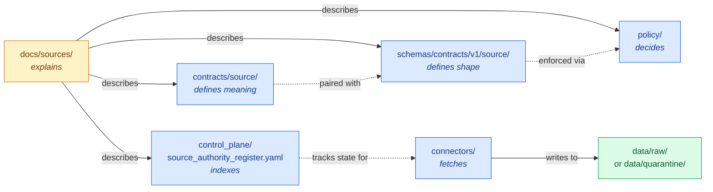
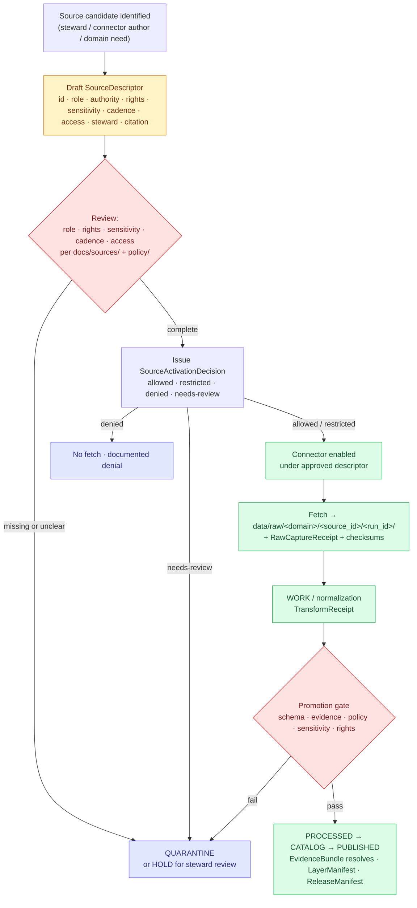

<!-- [KFM_META_BLOCK_V2]
doc_id: kfm://doc/docs-sources-readme
title: docs/sources — Source-Descriptor Standards and Source Families
type: standard
version: v1
status: draft
owners: TODO — Source Steward + Docs Steward (per Directory Rules §15 review burden)
created: 2026-05-13
updated: 2026-05-13
policy_label: public
related:
  - docs/doctrine/directory-rules.md
  - docs/adr/ADR-0001-schema-home.md
  - contracts/source/
  - schemas/contracts/v1/source/
  - control_plane/source_authority_register.yaml
  - connectors/
  - data/raw/
tags: [kfm, sources, source-descriptor, source-role, governance, docs]
notes:
  - PROPOSED location; repo not mounted in current session.
  - Source-role doctrine is CONFIRMED; SourceDescriptor field shape is PROPOSED.
  - Per Directory Rules §15 README contract.
[/KFM_META_BLOCK_V2] -->

# `docs/sources/`

> **Human-facing home for KFM source doctrine** — source-descriptor standards, source-role anti-collapse rules, source-family indexes, and the cross-domain admission flow that gates every byte before it shapes a public claim.

[](#status)
[](#authority-level)
[](#policy-posture)
[](#repo-fit)
[](#adrs)
[](#validation)
[](#last-reviewed)

| Field | Value |
|---|---|
| **Status** | `draft` · PROPOSED (no mounted-repo verification this session) |
| **Owners** | TODO — Source Steward + Docs Steward |
| **Updated** | 2026-05-13 |
| **Reviewed** | TODO (target cadence: every 6 months, per Directory Rules §15) |
| **Policy label** | `public` |

---

## Quick jump

- [Purpose](#purpose)
- [Authority level](#authority-level)
- [Status](#status)
- [What belongs here](#what-belongs-here)
- [What does NOT belong here](#what-does-not-belong-here)
- [Inputs](#inputs)
- [Outputs](#outputs)
- [Repo fit](#repo-fit)
- [Source-role anti-collapse register](#source-role-anti-collapse-register-confirmed-doctrine)
- [SourceDescriptor surface](#sourcedescriptor-surface-proposed-shape)
- [Source-family index](#source-family-index)
- [Source admission flow](#source-admission-flow)
- [Validation](#validation)
- [Review burden](#review-burden)
- [Related folders](#related-folders)
- [ADRs](#adrs)
- [FAQ](#faq)
- [Appendix](#appendix)
- [Last reviewed](#last-reviewed)

> [!IMPORTANT]
> `docs/sources/` **explains**. It does not own machine schemas, policy bundles, source registers, or connector code. The truth-bearing homes for those are `schemas/contracts/v1/source/`, `policy/`, `control_plane/source_authority_register.yaml`, and `connectors/` respectively. Treat doctrine here as input to those layers, not as a substitute for them.

---

## Purpose

`docs/sources/` is the **human-facing control plane** for source admission and source-role doctrine inside KFM. It explains, in prose, what a source is, what role it plays, how it enters the lifecycle, what rights and sensitivity posture it carries, what families KFM admits, and where its machine-bearing counterparts live. CONFIRMED placement per Directory Rules §6.1, which lists `docs/sources/` as the home for "source-descriptor standards, source families."

Per KFM's four-layer governance split, this folder sits on the `docs/` side of the split: **`docs/` explains; `control_plane/` indexes; `contracts/` defines meaning; `schemas/` defines shape.** CONFIRMED doctrine (Directory Rules §6.1). These four are different layers of the same governance function and must not collapse into one another.

[Back to top](#quick-jump)

---

## Authority level

**Canonical** within `docs/`.

`docs/sources/` is canonical for the **documented, human-readable** form of source doctrine. It is **not** authoritative for any of the following — pointers, not authority, are what lives here:

| Concern | Authoritative home | Authority class |
|---|---|---|
| Source object **meaning** (semantic contract) | `contracts/source/` | Canonical |
| Source object **machine shape** | `schemas/contracts/v1/source/` (per ADR-0001) | Canonical |
| Source **admission policy** (allow/deny/restrict/abstain) | `policy/` | Canonical |
| **Source-authority register** (machine-readable index) | `control_plane/source_authority_register.yaml` | Canonical |
| **Connector** implementations and source-specific fetch logic | `connectors/<vendor>/` | Canonical |
| **Source-registry** shared package | `packages/source-registry/` | Canonical |
| **RAW** capture and **quarantine** holding | `data/raw/`, `data/quarantine/` | Canonical |
| **Validators** for SourceDescriptor and admission | `tools/validators/source_descriptor/`, `tools/validators/connector_gate/` | Canonical |
| **Test fixtures** for source admission | `tests/fixtures/source/` (PROPOSED) | Canonical |

CONFIRMED rule (Directory Rules §13): documenting a change is **not** validating it. Anything that enforces, indexes, validates, or admits must live in one of the homes above.

[Back to top](#quick-jump)

---

## Status

**PROPOSED.**

- **CONFIRMED** — the location `docs/sources/` is named in Directory Rules §6.1 and in the proposed `docs/` tree of the Whole-UI + Governed AI Expansion Report (Appendix A).
- **CONFIRMED doctrine** — the seven-role source-role anti-collapse register and the source admission flow are CONFIRMED in the Domains Culmination Atlas v1.1 §24.1 and the Unified Implementation Architecture Build Manual §3.6.
- **PROPOSED** — concrete files inside this folder (e.g., `SOURCE_DESCRIPTOR_STANDARD.md`, per-family pages, source-role anti-collapse diagram) are PROPOSED until repo evidence confirms them.
- **NEEDS VERIFICATION** — current implementation maturity of `SourceDescriptor` schema, `SourceActivationDecision`, and the source-authority register is UNKNOWN. The repository is not mounted in this session.

[Back to top](#quick-jump)

---

## What belongs here

Files that **describe**, in human-readable form, the doctrine, vocabulary, and conventions of source admission. Examples (PROPOSED filenames; final names TBD):

- `SOURCE_DESCRIPTOR_STANDARD.md` — the prose standard for `SourceDescriptor`: identity, source role, authority, rights posture, sensitivity class, cadence, freshness, access method, attribution.
- `SOURCE_ROLE_ANTI_COLLAPSE.md` — the canonical seven-role register (observed, regulatory, modeled, aggregate, administrative, candidate, synthetic) with collapse-pattern guardrails.
- `SOURCE_FAMILIES.md` (or per-family pages: `families/usgs.md`, `families/fema.md`, `families/noaa.md`, `families/nrcs.md`, `families/kansas.md`, `families/gbif.md`, …) — the index of canonical source families and which domains each one feeds.
- `SOURCE_ACTIVATION_FLOW.md` — the documented admission flow (descriptor → review → activation decision → connector enablement).
- `RIGHTS_AND_SENSITIVITY.md` — the doctrine narrative for rights, license, attribution, redistribution, CARE handling, deny-by-default classes (as documentation; the **enforcement** lives in `policy/`).
- `SOURCE_DESCRIPTOR_FIELDS.md` — the **prose** field reference for SourceDescriptor (mirrors the schema in `schemas/contracts/v1/source/`; never the only place a field is defined).
- `README.md` — this file.

[Back to top](#quick-jump)

---

## What does NOT belong here

> [!WARNING]
> The "do not put X here" list is as important as the "do put Y here" list (Directory Rules §15). The following items are **common mistakes** that drift into a `docs/` folder when contributors confuse documentation with truth-bearing artifacts.

| Out of place | Where it actually belongs | Why |
|---|---|---|
| JSON Schema files (`*.schema.json`) for SourceDescriptor or related | `schemas/contracts/v1/source/` (per ADR-0001) | `docs/` is prose; `schemas/` is machine shape. Parallel schema homes require an ADR. |
| Markdown semantic contract for `SourceDescriptor` / `IngestReceipt` (the object **meaning**) | `contracts/source/` | `contracts/` owns meaning. `docs/sources/` may link to it and explain it for humans, but the canonical meaning lives in `contracts/`. |
| Rego/OPA policy bundles for source admission | `policy/bundles/` (or its equivalent) | `policy/` decides allow/deny/restrict/abstain. `docs/` describes; it never decides. |
| The **source-authority register** (machine-readable list of approved/retired/quarantined sources) | `control_plane/source_authority_register.yaml` | `control_plane/` indexes "what governs what." A YAML register is not docs. |
| Per-connector implementation code, retrieval scripts, or vendor-specific fetch logic | `connectors/<vendor>/` | Connectors are code with admission outputs. Their READMEs reference but do not replace the source standard. |
| `SourceActivationDecision` records (operational gate outputs) | `data/receipts/` or `release/` (per Directory Rules §13 trust-content placement) | Decisions are auditable trust content, not documentation. |
| Test fixtures (valid / invalid `SourceDescriptor` samples) | `tests/fixtures/source/` or `fixtures/source/` | Fixtures are proof material; docs may reference them, never house them. |
| Source-specific datasets, captured payloads, ingest receipts | `data/raw/<domain>/<source_id>/<run_id>/` or `data/quarantine/...` | RAW capture is data, not documentation. |
| **Domain-internal** source narratives that only matter to one domain | `docs/domains/<domain>/` | Per Directory Rules §4 Step 3, domains appear as **segments**, never as roots. `docs/sources/` is cross-cutting; per-domain detail goes under `docs/domains/`. |
| External standards documentation (STAC, DCAT, PROV, FAIR/CARE specs as KFM conforms to them) | `docs/standards/` | `docs/standards/` is the sibling for external-standard conformance; `docs/sources/` is about KFM source doctrine. |
| ADRs about source schema homes, role taxonomy, or registry architecture | `docs/adr/` | ADRs are governance decisions; they live in their own home. `docs/sources/` references them. |

[Back to top](#quick-jump)

---

## Inputs

The doctrine documented here is derived from, and must stay synchronized with:

1. **KFM doctrine** — Directory Rules; the Domain and Capability Encyclopedia; the Domains Culmination Atlas v1.1 (especially §24.1 source-role anti-collapse register and §24.2 receipt catalog); the Unified Implementation Architecture Build Manual §3.6 (source-registry architecture).
2. **ADRs** — `docs/adr/ADR-0001-schema-home.md` (CONFIRMED reference); any future ADR that relocates the SourceDescriptor schema home or revises the source-role taxonomy.
3. **Machine-bearing siblings** — `contracts/source/`, `schemas/contracts/v1/source/`, `policy/`, `control_plane/source_authority_register.yaml`. When those change materially, this folder updates or explicitly notes the divergence.
4. **External standards** — STAC core and extensions, DCAT, PROV-O, FAIR + CARE principles. These are referenced via `docs/standards/` and inline citations, never reproduced as authority here.

[Back to top](#quick-jump)

---

## Outputs

`docs/sources/` emits **only documentation**. Specifically:

- A consistent, citable **vocabulary** for source role, source family, rights posture, sensitivity class, and admission state — usable by every other root.
- A **navigation surface** that points contributors to the right truth-bearing home (`contracts/`, `schemas/`, `policy/`, `control_plane/`, `connectors/`, `data/`, `tools/`).
- A **review surface** for steward-facing changes to source doctrine, since prose changes here often precede or accompany schema or policy changes elsewhere.

`docs/sources/` does **not** emit receipts, decisions, validation reports, manifests, or any other trust-bearing object. CONFIRMED rule (Directory Rules §19, anti-pattern: "Documentation as truth"): if a `docs/` page is being cited as the source of a canonical decision, the decision must be promoted to an ADR or a `control_plane/` register.

[Back to top](#quick-jump)

---

## Repo fit

```
docs/
├── doctrine/          # authority ladder, truth posture, trust membrane, lifecycle law, directory rules
├── architecture/      # system context, deployment topology, governed API, map shell
├── adr/               # decisions — including ADR-0001 schema-home
├── domains/           # per-domain narrative (hydrology, soil, fauna, …)
├── sources/           ← THIS FOLDER — source-descriptor standards, source families
├── standards/         # external standards KFM conforms to (STAC, DCAT, PROV, …)
├── runbooks/          # ops procedures
├── governance/        # roles, review burden, separation of duties
├── registers/         # AUTHORITY_LADDER, CANONICAL_LINEAGE_EXPLORATORY, DRIFT_REGISTER, …
└── …
```

PROPOSED placement per Directory Rules §6.1. CONFIRMED that `docs/sources/` is at the doc root next to `docs/domains/` and `docs/standards/`, **not** nested inside a domain folder. Source doctrine is cross-cutting; placing it inside one domain would violate Directory Rules §4 Step 3 ("the domain appears as a segment inside the responsibility root, never as a root itself").



> [!NOTE]
> Diagram is illustrative of CONFIRMED authority relationships per Directory Rules §6. Exact arrow semantics (e.g., generation, validation, lookup) are PROPOSED until verified against mounted-repo conventions.

[Back to top](#quick-jump)

---

## Source-role anti-collapse register (CONFIRMED doctrine)

CONFIRMED (Domains Culmination Atlas v1.1 §24.1): KFM treats **source role** as a **first-class identity attribute**. An observed reading is not interchangeable with a modeled estimate; a regulatory determination is not interchangeable with an administrative compilation; an aggregate publication is not interchangeable with candidate evidence; synthetic content is never the same thing as observed reality. The lifecycle and the governed API both **fail closed** when these roles are conflated.

### The canonical seven

| Role | One-line definition | Typical example | Allowed citation pattern |
|---|---|---|---|
| **observed** | A direct reading, measurement, or first-hand evidentiary record tied to place and time. | Stream-gauge stage reading; soil pedon description; air-quality monitor sample; ground archaeological observation. | May feed modeled or aggregate products; **never** relabeled as "regulatory" or "administrative." |
| **regulatory** | An authoritative determination by a regulatory or governing body with legal or administrative force. | NFHL flood-zone designation; air-quality non-attainment ruling; designated critical-habitat unit; protected-species listing. | Cite as regulatory context; **never** labeled an "observed" event or "modeled" estimate. |
| **modeled** | A derived product from inputs, assumptions, or fitted parameters; uncertainty and provenance of inputs must be preserved. | Hydrograph reconstruction; smoke trajectory model; suitability raster; population estimation surface. | Cite with model identity, run receipt, and bounds; **never** labeled an observation. |
| **aggregate** | A published summary, total, or average over a unit (county, year, watershed); irreversible loss of individual-record fidelity. | USDA crop county totals; Census tract aggregates; decadal climate normal; resource-estimate summary. | Cite with `AggregationReceipt`; **never** treated as a per-place record. |
| **administrative** | A compiled record produced by an agency for administration, registration, or accounting purposes — not necessarily an observation or a regulation. | Land office tract book; deed index; county incorporation record; transport facility roster. | Cite as administrative context; **never** collapsed with observation or regulation. |
| **candidate** | A proposed record awaiting validation, evidence resolution, deduplication, or steward review; not yet authoritative. | Quarantined connector output; unresolved person assertion; duplicate site candidate; unmerged crop observation. | May be cited as candidate evidence in WORK / QUARANTINE; **must not** appear in PUBLISHED without promotion. |
| **synthetic** | Content generated by simulation, reconstruction, AI, or interpolation that has no underlying first-hand observation. | Synthetic terrain surface; reconstructed historical scene; AI-drafted summary of an `EvidenceBundle`. | Carries `RealityBoundaryNote` and `RepresentationReceipt`; **never** presented or queried as observed reality. |

CONFIRMED reading rule: the role of a source is **set at admission** in the `SourceDescriptor` and is **preserved through every promotion**. Promotion does not upgrade an observation to a regulation, a model to an aggregate, or a candidate to a verified record — those are separate governed transitions with their own evidence and review requirements.

### Anti-collapse failure modes (deny conditions)

| Collapse pattern | Denied outcome | Required guardrail |
|---|---|---|
| Modeled product labeled or queried as observed. | DENY at publication; ABSTAIN at AI surface. | `ModelRunReceipt` + uncertainty surface + role-preserving DTO field. |
| Regulatory zone labeled as an observed flood / event. | DENY publication of regulatory layer as event evidence. | Separate regulatory-layer and observed-event lanes; UI banner. |
| Aggregate cited as a per-place truth. | DENY join from aggregate cell to single record; ABSTAIN at AI. | `AggregationReceipt`; geometry-scope guard; matrix-cell semantics. |
| Administrative compilation cited as observation. | DENY publication of compilation as observed event timeline. | Source-role tag preserved; named `LifeEvent` / `AdminEvent` types. |
| Candidate record exposed on a public surface. | DENY at trust membrane; route to QUARANTINE. | Promotion gate; no PUBLISHED edge to WORK / QUARANTINE. |
| Synthetic content presented as observed reality. | DENY publication; HOLD for steward review; ABSTAIN at AI. | `RealityBoundaryNote`; `RepresentationReceipt`; UI badge. |
| AI text treated as evidence. | DENY publication; ABSTAIN at Focus Mode; `AIReceipt` mandatory. | Cite-or-abstain rule; `AIReceipt`; release state required. |

[Back to top](#quick-jump)

---

## SourceDescriptor surface (PROPOSED shape)

> [!NOTE]
> The fields below are **PROPOSED** per the Domains Culmination Atlas v1.1 §24.1.3. The canonical schema home defaults to `schemas/contracts/v1/source/source-descriptor.json` per Directory Rules §7.4 and ADR-0001, unless an accepted ADR relocates it. **NEEDS VERIFICATION**: actual file presence and field names are not asserted here. Field names below are an illustrative shape; an ADR or schema PR is the authoritative resolution.

| Field | Type / vocabulary | Required? | Notes |
|---|---|---|---|
| `source_id` | string (stable identifier) | MUST | Set at admission; never edited in-place. |
| `source_role` | enum: `observed` \| `regulatory` \| `modeled` \| `aggregate` \| `administrative` \| `candidate` \| `synthetic` | MUST | Set at admission. Corrections produce a **new** descriptor and a `CorrectionNotice`; the role never mutates in place. |
| `role_authority` | string (issuing body / model identity / steward) | MUST when `source_role ∈ {regulatory, modeled, aggregate}` | Disambiguates the authoring authority for downstream cite text. |
| `role_aggregation_unit` | geometry-scope token (county, HUC, tract, year, decade, …) | MUST when `source_role = aggregate` | Prevents geometry-scope drift on join. |
| `role_model_run_ref` | `EvidenceRef` → `ModelRunReceipt` | MUST when `source_role = modeled` | Pins the inputs, parameters, and version that produced the value. |
| `role_synthetic_basis` | structured: `{ method, inputs, reality_boundary_note_ref }` | MUST when `source_role = synthetic` | Records what is and is not real in the carrier. |
| `role_candidate_disposition` | enum: `pending` \| `merged` \| `rejected` \| `quarantined` | MUST when `source_role = candidate` | Tracks promotion state; PUBLISHED edge forbidden until `merged`. |
| `rights_status` | enum (license-class) + structured terms | MUST | Unknown rights **fail closed** per Encyclopedia §13. |
| `sensitivity_class` | enum (per `policy/sensitivity/`) | MUST | Drives the deny-by-default register (rare species, archaeology, living persons, DNA/genomics, sacred sites, critical infrastructure, …). |
| `access_method` | string (URL pattern, API, file drop, …) | MUST | How the connector reaches the source. |
| `cadence` | structured (frequency, retrieval window) | MUST | Drives freshness checks and stale-state badges. |
| `steward` | string or structured reference | MUST | Who owns the relationship with the provider. |
| `attribution` | string (required citation text) | MUST when terms require it | Carried through to public layers, exports, and Focus Mode citations. |
| `citation` | structured (URL / DOI / archival reference) | MUST | Resolves to `EvidenceBundle` context. |
| `ingest_hash` | content-hash | MUST | Set at RAW capture; pairs with `RawCaptureReceipt`. |
| `time` | `TemporalScope` (observed, valid, source, retrieval, release, correction times kept distinct) | MUST | Per Encyclopedia Appendix E: temporal modeling fail-closed on missing material scope. |

[Back to top](#quick-jump)

---

## Source-family index

CONFIRMED (Encyclopedia Appendix D): each KFM domain admits a bounded set of canonical **source families**. The table below lists the headline families currently named in doctrine. PROPOSED: full per-family pages with descriptors, rights posture, role mapping, and freshness expectations will land alongside this README.

| Family | Primary domains served | Typical role(s) | Rights / sensitivity (NEEDS VERIFICATION per family) |
|---|---|---|---|
| **USGS** (3DEP, Water, NHDPlus, NWIS, Earthquakes, geologic maps) | Hydrology · Geology · Spatial Foundation · Hazards | observed · modeled · regulatory | Public; verify current terms. |
| **FEMA** (NFHL, MSC, OpenFEMA, disaster declarations) | Hydrology · Hazards | regulatory · administrative | Public; verify current terms. |
| **NOAA / NWS** (Storm Events, NWS API, NCEI, HMS, climate normals) | Hazards · Atmosphere · Hydrology | observed · regulatory · context · model | Public; not-for-life-safety disclaimer. |
| **NRCS** (SSURGO, gSSURGO, SDA, SCAN, Web Soil Survey) | Soil · Agriculture · Hydrology | observed · authority · model | Public; verify current terms. |
| **NASA** (FIRMS, SMAP, HLS, MAIAC AOD) | Hazards · Habitat · Agriculture · Atmosphere | observed · modeled | Public; verify current terms. |
| **USDA NASS** (CDL, QuickStats, Crop Progress) | Agriculture | aggregate · observed | Public; aggregation rules. |
| **EPA** (AQS, AirData, AirNow) | Atmosphere | observed · regulatory · model | Public; verify current terms. |
| **USFWS / NatureServe** (ECOS, critical habitat, conservation status) | Fauna · Flora · Habitat | regulatory · authority | Public + restricted; geoprivacy fail-closed for rare-species locations. |
| **GBIF / iNaturalist / EDDMapS / eBird** | Fauna · Flora · Habitat | observed · candidate · aggregate | Public + license-bearing; community-science source ≠ legal-status authority. |
| **Census / TIGER / GNIS** | Settlements · Roads · People · Frontier Matrix | administrative · aggregate · authority | Public. |
| **Kansas state** (KDOT, KDWP, KGS, Kansas Mesonet, state GIS, KSHS) | All domains (state slice) | observed · regulatory · administrative · steward | Public + steward-restricted; cultural-corridor sensitivity. |
| **KDWP / state historic preservation / tribal steward** | Fauna · Flora · Archaeology · Roads | regulatory · steward | Restricted; deny-by-default on sensitive locations; cultural review required. |
| **Local upload / steward submission** | All domains | candidate | DENY until source role, rights, sensitivity, and review state are recorded. |

> [!CAUTION]
> Source-family membership does **not** confer a fixed role. The same provider can host observed, modeled, regulatory, and aggregate products. Role is set per `SourceDescriptor` at admission, never inferred from provider name. CONFIRMED cross-domain rule (Unified Implementation Architecture Build Manual §3.6): "source role cannot be inferred from convenience."

[Back to top](#quick-jump)

---

## Source admission flow

CONFIRMED admission posture (Unified Implementation Architecture Build Manual §3.6 + Encyclopedia §3): the source registry is **an admission and authority-control surface, not a bibliography.** Connectors and watchers stay inactive until a `SourceActivationDecision` is recorded and fixtures, validators, and policy gates exist.



CONFIRMED invariant (Directory Rules §0, §10): **public clients and normal UI surfaces use governed interfaces, not canonical/internal stores.** Browsers, AI surfaces, and Focus Mode never read from RAW, WORK, or QUARANTINE.

[Back to top](#quick-jump)

---

## Validation

Validation **of source admission** is enforced outside this folder. `docs/sources/` is itself subject to **documentation hygiene** validation.

### Validation that enforces source admission (outside this folder)

| Check | Where it lives | What it asserts |
|---|---|---|
| `SourceDescriptor` schema validation | `tools/validators/source_descriptor/` (PROPOSED) | The descriptor matches `schemas/contracts/v1/source/source-descriptor.json`. |
| Connector gate | `tools/validators/connector_gate/` (PROPOSED) | A connector cannot fetch without an active `SourceActivationDecision`. |
| Source-role policy parity | `policy/` + fixtures | Anti-collapse rules deny the seven collapse patterns above. |
| Rights / sensitivity unknown-blocks-release | `policy/rights/`, `policy/sensitivity/` | Unknown rights or sensitivity fail closed before any public release. |
| Stale-source / cadence | `tools/validators/...` (PROPOSED) | Stale `source_head` or missing freshness emits a visible stale state; Focus Mode abstains. |

### Validation that applies to *this* folder

| Check | Status | Note |
|---|---|---|
| Markdown lint / link check | TODO | Verify all internal links resolve once siblings are in place. |
| KFM terminology preservation (e.g., `EvidenceBundle`, `EvidenceRef`, lifecycle phases, source roles) | TODO | Drift register entry if a doc renames a KFM-specific term to a generic equivalent. |
| ADR cross-link integrity (ADR-0001) | TODO | Verify the schema-home ADR remains the cited authority. |
| `README.md` contract (Directory Rules §15) | TODO — this file is being drafted to satisfy it | Sections required: Purpose, Authority level, Status, What belongs / does not belong, Inputs, Outputs, Validation, Review burden, Related folders, ADRs, Last reviewed. |
| Last-reviewed cadence ≤ 6 months | TODO | Flag for review per Directory Rules §15. |

[Back to top](#quick-jump)

---

## Review burden

PROPOSED ownership (NEEDS VERIFICATION against repo `CODEOWNERS`):

- **Primary owners** — Source Steward (cross-domain source admission) + Docs Steward (documentation hygiene).
- **Required reviewers when changing source-role taxonomy or anti-collapse rules** — Source Steward + Architecture lead + at least one domain steward whose lane the change touches; ADR required per Directory Rules §2.4.
- **Required reviewers when changing rights / sensitivity narrative** — Source Steward + Policy admin + the relevant domain steward.
- **Required reviewers when adding or retiring a source family entry** — Source Steward + the affected domain steward(s).

CONFIRMED governance rule (Encyclopedia §10, Master Action Matrix): separation of duties — review authority is distinct from author; a single contributor cannot self-approve a release-relevant doctrine change.

[Back to top](#quick-jump)

---

## Related folders

PROPOSED relative links; verify paths once the repo is mounted.

- [`../doctrine/directory-rules.md`](../doctrine/directory-rules.md) — placement law that governs this folder.
- [`../adr/ADR-0001-schema-home.md`](../adr/ADR-0001-schema-home.md) — schema-home convention; the authority for where `source-descriptor.json` lives.
- [`../domains/README.md`](../domains/README.md) — per-domain narratives; each domain has its own source-family bindings under `../domains/<domain>/`.
- [`../standards/README.md`](../standards/README.md) — external standards (STAC, DCAT, PROV, FAIR + CARE) that KFM conforms to.
- [`../governance/README.md`](../governance/README.md) — roles, review burden, separation of duties.
- [`../registers/AUTHORITY_LADDER.md`](../registers/AUTHORITY_LADDER.md) (PROPOSED) — canonical authority order across doctrine, repo, source, and runtime evidence.
- [`../../contracts/source/`](../../contracts/source/) — semantic meaning of source objects.
- [`../../schemas/contracts/v1/source/`](../../schemas/contracts/v1/source/) — machine shape (per ADR-0001).
- [`../../policy/`](../../policy/) — admissibility, rights, sensitivity, release.
- [`../../control_plane/source_authority_register.yaml`](../../control_plane/source_authority_register.yaml) — machine-readable register.
- [`../../connectors/README.md`](../../connectors/README.md) — source-specific fetch and admission code.

[Back to top](#quick-jump)

---

## ADRs

| ADR | Topic | Relevance to this folder |
|---|---|---|
| **ADR-0001 — Schema home** (CONFIRMED in Directory Rules §6.4 / §7.4) | Default machine-schema home is `schemas/contracts/v1/...`. | Sets where `source-descriptor.schema.json` lives. Any divergence requires an ADR. |
| ADR — Source-role taxonomy (PROPOSED, not yet authored) | Records the canonical seven roles and the migration rule (role set at admission, never upgraded by promotion). | Would formalize Atlas v1.1 §24.1 doctrine in an ADR. |
| ADR — Source-authority register home (PROPOSED, not yet authored) | Confirms `control_plane/source_authority_register.yaml` as the canonical register. | Would formalize Directory Rules §6.2 placement. |

[Back to top](#quick-jump)

---

## FAQ

> [!TIP]
> **"Where does my new source go?"** — Start with the family table above. If your provider is named there, use that family's page (PROPOSED) and the matching `connectors/<vendor>/` subtree. If it is not, propose a new family entry here and a new connector subtree under `connectors/`, with a `SourceDescriptor` drafted before any fetch attempt.

**Q. Why isn't the `SourceDescriptor` JSON Schema in this folder?**
A. `docs/sources/` is part of the human-facing control plane (Directory Rules §6.1). Machine shape lives in `schemas/contracts/v1/source/` per ADR-0001. Two homes for the same definition would violate the parallel-authority rule (Directory Rules §13).

**Q. Can a source's role change over time?**
A. No. The role is set at admission and is **preserved through every promotion**. If a source begins emitting a different role of content (e.g., a provider starts publishing both observed and modeled products), admit a **new** `SourceDescriptor` for the new role; do not edit the old one. Corrections produce a new descriptor and a `CorrectionNotice`. CONFIRMED (Atlas v1.1 §24.1.1).

**Q. What happens to a source with unknown rights?**
A. It fails closed. Unknown rights / source-role unknown for public use → DENY at the trust membrane (Encyclopedia §13, Sensitive / Deny-by-Default Register). The descriptor may still exist with `source_role = candidate` and `role_candidate_disposition = pending` while rights are resolved.

**Q. Where do source-family pages live — here, or under `docs/domains/<domain>/`?**
A. Both, with different responsibilities. `docs/sources/families/<family>.md` (PROPOSED) owns the **cross-domain** view of that family — what it is, what roles it can play, what rights and cadence apply. `docs/domains/<domain>/sources.md` (PROPOSED) owns the **domain-specific** view — which family members the domain uses, with what role bindings, for which object families.

**Q. Is a community-science occurrence (e.g., GBIF) "observed" or "candidate"?**
A. Depends on the descriptor at admission. The raw record is `observed` from the contributor's perspective and may enter KFM as `observed` or `candidate` depending on review state, deduplication, and the domain's policy. CONFIRMED cross-domain rule: a community-science occurrence source is **not** a legal-status authority.

[Back to top](#quick-jump)

---

## Appendix

<details>
<summary><strong>A. Glossary (selected terms used in this folder)</strong></summary>

| Term | Definition |
|---|---|
| **SourceDescriptor** | Machine-readable record of source identity, role, authority, rights, sensitivity, cadence, access, steward, attribution, citation, and admission state. Anchors every downstream receipt. |
| **SourceActivationDecision** | Gate record declaring `allowed` · `restricted` · `denied` · `needs-review` use of a source. Connectors stay inactive until issued. |
| **IngestReceipt** / **RawCaptureReceipt** | Records that a source's RAW input was captured immutably, with checksum and time. No public RAW access. |
| **EvidenceRef → EvidenceBundle** | Stable reference that must resolve to a structured evidence package before any public claim. `EvidenceBundle` outranks generated text. |
| **CorrectionNotice** | Structured record of an admitted error; lists invalidated derivatives. Required when correcting a released claim, including any source-role correction. |
| **Source family** | A bounded set of sources sharing provider, format, or governance posture (e.g., USGS, FEMA, NOAA). Membership does not fix role. |
| **Source role** | The first-class identity attribute distinguishing observed, regulatory, modeled, aggregate, administrative, candidate, and synthetic content. Set at admission. |
| **RAW → WORK/QUARANTINE → PROCESSED → CATALOG/TRIPLET → PUBLISHED** | The KFM lifecycle invariant. Sources enter at RAW or QUARANTINE; public surfaces consume PUBLISHED through the governed API. |
| **Trust membrane** | The governed boundary between canonical/internal stores and public surfaces. Public clients never reach across it directly. |

</details>

<details>
<summary><strong>B. Deny-by-default classes that interact with source admission</strong></summary>

CONFIRMED (Encyclopedia §13, Sensitive / Deny-by-Default Register). Each class shapes the `sensitivity_class` and `rights_status` fields of a `SourceDescriptor`, and each one defaults to DENY for public exposure unless explicit controls are recorded.

| Class | Default outcome | Required controls |
|---|---|---|
| Living persons | DENY public exact/identifying output unless legal basis + consent/review + release state proven. | Privacy review; redaction; aggregate; staged access. |
| DNA / genomics | DENY by default; restricted steward/research only with policy approval. | Separate restricted store; no public AI inference. |
| Rare species (exact locations) | DENY public exact location; generalized products only. | Geoprivacy transform receipt; steward review. |
| Archaeology (exact coordinates) | DENY exact public location by default. | Cultural / steward review; suppression / generalization. |
| Sacred / culturally sensitive places | DENY until steward review and access class approve. | Consultation record; sensitivity transform. |
| Critical infrastructure | RESTRICT / DENY public precision. | Public-safe aggregation; role-based access. |
| Private landowner-sensitive data | DENY exact / public if private or rights unclear. | Aggregation; permissions; policy review. |
| Emergency / life-safety alerting | DENY life-safety replacement; contextual-only with official redirection. | Not-for-life-safety disclaimer; freshness controls. |
| Source-rights-limited records | DENY public release until terms resolved. | Rights register; attribution; no public derivative if barred. |

</details>

<details>
<summary><strong>C. Anti-patterns to flag when reviewing changes to source doctrine</strong></summary>

| Anti-pattern | What goes wrong | Counter-rule |
|---|---|---|
| Treating a `docs/sources/` page as the canonical decision on a source | Documentation drifts from `policy/` and `control_plane/`; review by-passes the actual gate. | Promote to ADR or `control_plane/` register if a decision is at stake. Docs explain; they do not decide. |
| Renaming a KFM-specific source-role term to a generic industry term | Anti-collapse register breaks; downstream validators stop catching the seven collapse patterns. | Preserve `observed`, `regulatory`, `modeled`, `aggregate`, `administrative`, `candidate`, `synthetic` exactly. |
| Adding a new source role without an ADR | New axis appears in the descriptor without policy or schema support. | Open an ADR per Directory Rules §2.4. |
| Inferring source role from provider name | A federal agency hosts observed + modeled + regulatory + aggregate products under one banner; the inference is unsafe. | Role is set per `SourceDescriptor` at admission, not by provider. |
| Documenting a source family but skipping the connector + descriptor scaffolding | Source becomes citable in prose but cannot enter the lifecycle. | Family pages must reference the matching `connectors/<vendor>/` and descriptor schema location. |
| Promotion "upgrading" a source role (e.g., modeled → observed) | Trust posture collapses silently. | Role is fixed at admission. Corrections produce a new descriptor + `CorrectionNotice`. |

</details>

<details>
<summary><strong>D. External standards relevant to source admission (referenced, not authoritative here)</strong></summary>

External standards are documented under `docs/standards/`, not here. The following are commonly referenced from `docs/sources/` content:

- **STAC** (SpatioTemporal Asset Catalog) — for spatiotemporal source catalog records and provenance extensions. STAC's core JSON model defines required fields (id, stac_version, type, geometry/bbox, properties.datetime, assets, links) that make any dataset indexable by space and time; extensions like the Processing Extension add structured provenance fields, and after using any extension the extension's identifier URL must appear in the stac_extensions array so validators apply the right schemas. EXTERNAL.
- **DCAT** — for non-spatial dataset catalog records.
- **PROV-O / W3C PROV** — for lineage and activity records.
- **FAIR + CARE** — paired principles (FAIR for the data-engineering substrate, CARE for community authority); CARE applies particularly to Indigenous-data and sensitive-cultural sources.
- **schema.org** — used selectively for cross-catalog discoverability.

When a `SourceDescriptor` field intentionally aligns with a field in one of these standards, the alignment is documented in the relevant `families/<family>.md` page or in `SOURCE_DESCRIPTOR_FIELDS.md`. Conflicts between external standards and KFM doctrine are flagged in `docs/registers/DRIFT_REGISTER.md`, not silently smoothed.

</details>

[Back to top](#quick-jump)

---

## Last reviewed

**2026-05-13** — initial draft. Next review target: **2026-11-13** (6 months, per Directory Rules §15). Flag for review if not updated by that date.

---

### Related docs · footer

- [Directory Rules](../doctrine/directory-rules.md) — placement law
- [ADR-0001 Schema home](../adr/ADR-0001-schema-home.md) — schema-home convention
- [`docs/standards/`](../standards/) — external standards (STAC, DCAT, PROV, FAIR + CARE)
- [`docs/domains/`](../domains/) — per-domain narrative
- [`contracts/source/`](../../contracts/source/) · [`schemas/contracts/v1/source/`](../../schemas/contracts/v1/source/) · [`policy/`](../../policy/) · [`control_plane/`](../../control_plane/) · [`connectors/`](../../connectors/)

**Status:** PROPOSED · **Owners:** TODO — Source Steward + Docs Steward · **Updated:** 2026-05-13 · [Back to top ↑](#quick-jump)
