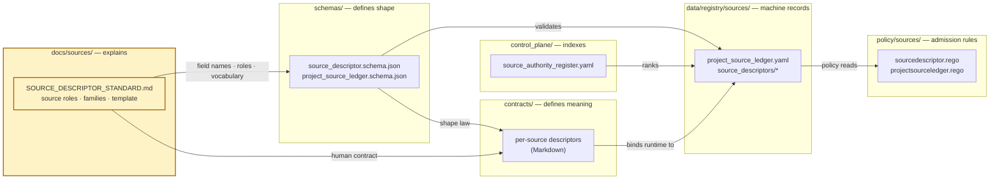
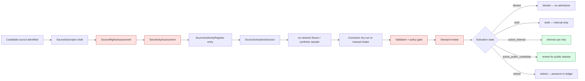

# `docs/sources/` — Source Descriptor Standards & Source-Role Doctrine

> The human-facing control plane for **how a source becomes admissible evidence** in the Kansas Frontier Matrix (KFM). This directory holds source-descriptor standards, source-role doctrine, and source-family taxonomy. It does **not** hold per-source machine records, per-domain registries, or release decisions.

<!-- [KFM_META_BLOCK_V2]
doc_id: kfm://doc/docs-sources-readme
title: docs/sources/ — Source Descriptor Standards & Source-Role Doctrine
type: standard
version: v1
status: draft
owners: Source steward; Docs steward
created: 2026-05-09
updated: 2026-05-09
policy_label: public
related:
  - docs/doctrine/directory-rules.md
  - docs/doctrine/authority-ladder.md
  - docs/registers/AUTHORITY_LADDER.md
  - docs/sources/SOURCE_DESCRIPTOR_STANDARD.md
  - schemas/contracts/v1/sources/
  - data/registry/sources/
  - policy/sources/
tags: [kfm, sources, governance, doctrine]
notes:
  - Canonical placement confirmed by directory-rules.md §6.1.
  - Repo presence of files referenced here is PROPOSED until verified against mounted-repo evidence.
[/KFM_META_BLOCK_V2] -->

---

## 0. Status & Authority

| Field | Value |
|---|---|
| **Document type** | Directory README — landing & navigation |
| **Authority of this README** | CONFIRMED for placement and role; PROPOSED for any specific neighbor file claimed to exist |
| **Authority of paths quoted here** | PROPOSED until verified against mounted-repo evidence |
| **Owner** | Source steward |
| **Co-owner** | Docs steward |
| **Reviewers required for change** | Source steward + Docs steward; ADR required to add or remove a canonical file under `docs/sources/` |
| **Supersedes** | None — first README at this path |
| **Parent README** | `docs/README.md` |
| **Parent doctrine** | `docs/doctrine/directory-rules.md` §6.1 |
| **Companion machine layer** | `data/registry/sources/`, `schemas/contracts/v1/sources/`, `policy/sources/`, `tests/sources/` |
| **Lifecycle invariant** | Sources enter the lifecycle through governed admission. Promotion is a state transition, not a file move. |

---

## Badges


> Badge targets are placeholders and need verification against the repo's actual badge conventions and CI status pages.

---

## Quick Navigation

- [1. Purpose](#1-purpose)
- [2. Repo Fit](#2-repo-fit)
- [3. Scope](#3-scope)
- [4. Directory Contents](#4-directory-contents)
- [5. The Source Ledger Object Family](#5-the-source-ledger-object-family)
- [6. Source Roles — Closed Vocabulary](#6-source-roles--closed-vocabulary)
- [7. Source Families](#7-source-families)
- [8. Source Descriptor Template](#8-source-descriptor-template)
- [9. Source Admission Lifecycle](#9-source-admission-lifecycle)
- [10. Authority & Conflict Resolution](#10-authority--conflict-resolution)
- [11. Validation & Policy Companions](#11-validation--policy-companions)
- [12. Update Triggers](#12-update-triggers)
- [13. Open Verification Items & Known Tensions](#13-open-verification-items--known-tensions)
- [14. Definition of Done — Reviewer Checklist](#14-definition-of-done--reviewer-checklist)
- [15. Cross-References](#15-cross-references)
- [16. FAQ](#16-faq)

---

## 1. Purpose

`docs/sources/` is the **human-facing control plane** for sources in KFM. It carries the doctrine, the standards, and the closed vocabularies that govern how a candidate source becomes admissible evidence — and what authority boundary it carries once admitted.

This directory exists because **a source's role is governance, not metadata**. Whether a record is "official," "community-observed," or "derived from a model" determines what claims it can support, when it may be published, and how it must be cited. Hiding those distinctions inside connector code or pipeline glue makes them invisible to reviewers and prone to silent drift. Documenting them here makes them readable, validatable, and auditable.

> [!IMPORTANT]
> `docs/sources/` **explains**. It does not store source data, machine records, validation logic, or release decisions. Each of those lives in a different responsibility root (see [§2](#2-repo-fit) and [§5](#5-the-source-ledger-object-family)). Collapsing them is a directory-rules violation.

---

## 2. Repo Fit

Per `docs/doctrine/directory-rules.md` §6.1, KFM separates the source-related concern into four governance layers that **MUST NOT collapse** into one another:

| Layer | Root | Job |
|---|---|---|
| **Explains** | `docs/sources/` *(this directory)* | Standards, doctrine, source-role vocabulary, family taxonomy, human-readable descriptor template |
| **Indexes** | `control_plane/source_authority_register.yaml` | Operational "what governs what" — machine-readable governance maps |
| **Defines meaning** | `contracts/sources/` *(or `contracts/source/`, see [§13](#13-open-verification-items--known-tensions))* | Object-family contracts; per-source semantic descriptors as Markdown contracts |
| **Defines shape** | `schemas/contracts/v1/sources/` | Machine-checkable JSON Schemas for `SourceDescriptor`, `ProjectSourceLedger`, etc. |

### Upstream (this directory depends on)

- `docs/doctrine/` — lifecycle law, truth posture, trust membrane, authority ladder
- `docs/doctrine/directory-rules.md` — placement authority
- `docs/adr/ADR-0001-schema-home.md` — schema-home decision (PROPOSED file)
- KFM core invariants (RAW → WORK / QUARANTINE → PROCESSED → CATALOG / TRIPLET → PUBLISHED)

### Downstream (depends on this directory)

- `docs/domains/<domain>/SOURCE_REGISTRY.md` — per-domain human source registries
- `data/registry/sources/` — machine-readable Project Source Ledger and friends
- `schemas/contracts/v1/sources/*.schema.json` — JSON Schemas that must conform to the standard defined here
- `policy/sources/*.rego` — Rego rules that read field names defined here
- `tools/validators/sources/` — validators that enforce the standard

### Mermaid — where this directory sits



> **Reading the diagram:** `docs/sources/` is the only place where the descriptor *standard* — the field names, the role vocabulary, the family taxonomy — is normatively explained. Every other layer references and conforms to it.

---

## 3. Scope

### Belongs here ✅

- The **source descriptor standard** — required and recommended fields, section structure, narrative requirements, conformance language.
- **Source-role doctrine** — closed vocabulary of source roles (`official`, `institutional`, `steward_reviewed`, `corroborative`, `community_observation`, `controlled_access`, `derived_model`, `generalized_public_surface`) and what each role may and may not support.
- **Source family taxonomy** — top-level groupings used in the `ProjectSourceLedger` and `SourceContributionMatrix` (e.g., GIS-reference, components-pass, documentation-architecture, domain-lane-report, ecosystem-dossier, new-ideas-packet, scaffold-report, subsystem-manual).
- **Rights, geoprivacy, and sensitivity posture rules** at the source-descriptor level — the doctrine, not per-source assessments.
- **Source admission flow** — the canonical path from candidate → intake → ledger → authority → descriptor → activation state.
- **Pointers** to per-source descriptors, per-domain source registries, machine registers, schemas, policies, validators, and tests.

### Does not belong here ❌

| Don't put here | Put it here instead |
|---|---|
| Per-source data files (CSV, GeoJSON, raw captures) | `data/raw/<domain>/<source_id>/` |
| Machine-readable Project Source Ledger / Authority Register / Alias Map | `data/registry/sources/` |
| `SourceDescriptor` JSON Schema | `schemas/contracts/v1/sources/source_descriptor.schema.json` |
| Per-domain source registries (human-readable) | `docs/domains/<domain>/SOURCE_REGISTRY.md` |
| Per-source descriptor contracts (Markdown) | `contracts/sources/` *(home pending [ADR](#13-open-verification-items--known-tensions))* |
| Rego rules / admission policy | `policy/sources/` |
| Connector code | `connectors/<provider>/` |
| Source-coverage validators | `tools/validators/sources/` |
| Test fixtures | `tests/fixtures/**/{valid,invalid}/source*.json` |
| ADRs about schema home, authority, etc. | `docs/adr/` |
| Cross-source verification backlog | `docs/registers/VERIFICATION_BACKLOG.md` |

> [!CAUTION]
> If a file would carry release-significant truth, machine-checkable shape, or denial logic, it does **not** belong in `docs/sources/`. The four-layer split is a security and trust property, not a stylistic preference.

---

## 4. Directory Contents

The structure below is **PROPOSED** (per directory-rules §0). Add files only when their job cannot be served by an existing companion in `contracts/`, `schemas/`, `policy/`, or `data/registry/`.

```
docs/sources/
├── README.md                          # this file
├── SOURCE_DESCRIPTOR_STANDARD.md      # the canonical descriptor standard (required fields, sections, conformance)
├── SOURCE_ROLES.md                    # closed vocabulary, role-by-role authority and publication defaults
├── SOURCE_FAMILIES.md                 # top-level family taxonomy used in the Project Source Ledger
├── RIGHTS_POSTURE.md                  # observation-level vs source-global rights; required normalized rights fields
├── GEOPRIVACY_AND_SENSITIVITY.md      # how source geoprivacy maps (or does not map) to KFM public-safe precision
├── SOURCE_ADMISSION_FLOW.md           # candidate → intake → ledger → authority → descriptor → activation state
├── CITATION_AND_AUTHORITY.md          # citation rules, attribution, authority boundary per role
└── README_NEIGHBORS.md                # pointers to companion machine layers (registry, schemas, policy, tests)
```

> Every file above is **PROPOSED** until the mounted repo confirms its presence. The only file referenced by name in attached project sources is `SOURCE_DESCRIPTOR_STANDARD.md`. Other names are inferences from the doctrine and may be merged, renamed, or omitted in the actual implementation.

> [!NOTE]
> **Single-file home rule.** If only `SOURCE_DESCRIPTOR_STANDARD.md` ever lands here, the directory still earns its place — the standard is itself a control-plane artifact. Avoid creating empty stubs to fill the tree.

---

## 5. The Source Ledger Object Family

The Source Ledger is a small family of governance objects. This README explains what each object **is**; the field shapes live in `schemas/`, the storage in `data/registry/sources/`, and the admission rules in `policy/sources/`.

| Object | Purpose | Schema | Machine record | Policy | Doctrinal home in this directory |
|---|---|---|---|---|---|
| **`SourceDescriptor`** | Identity, role, rights, sensitivity, cadence, access, citation for one source | `schemas/contracts/v1/sources/source_descriptor.schema.json` | `data/registry/sources/<domain>/source_descriptors/*.yaml` | `policy/sources/sourcedescriptor.rego` | `SOURCE_DESCRIPTOR_STANDARD.md` |
| **`ProjectSourceLedger`** | Visible ledger for all project sources and source continuity | `…/sources/project_source_ledger.schema.json` | `data/registry/sources/project_source_ledger.yaml` | `policy/sources/projectsourceledger.rego` | `SOURCE_FAMILIES.md` (taxonomy used by ledger) |
| **`SourceAuthorityRegister`** | Ranked authority surface for source families and specific sources | `…/sources/source_authority_register.schema.json` | `control_plane/source_authority_register.yaml` *(or `data/registry/sources/source_authority.yaml` — see [§13](#13-open-verification-items--known-tensions))* | `policy/sources/sourceauthorityregister.rego` | `CITATION_AND_AUTHORITY.md` |
| **`SourceContributionMatrix`** | Maps sources → concepts / object families / sections | `…/sources/source_contribution_matrix.schema.json` | `data/registry/sources/source_contribution_matrix.yaml` | `policy/sources/sourcecontributionmatrix.rego` | `SOURCE_FAMILIES.md` |
| **`SourceAliasMap`** | Aliases, old names, renamed references | `…/sources/source_alias_map.schema.json` | `data/registry/sources/source_aliases.yaml` | `policy/sources/sourcealiasmap.rego` | *(continuity notes inline)* |
| **`SourceIntakeRecord`** | Formal intake object for new sources, packets, and docs | `…/sources/source_intake_record.schema.json` | `data/registry/sources/source_intake.yaml` | `policy/sources/sourceintakerecord.rego` | `SOURCE_ADMISSION_FLOW.md` |
| **`UnresolvedSourceReference`** | Cited but unavailable sources awaiting verification | `…/sources/unresolved_source_reference.schema.json` | `data/registry/sources/unresolved_references.yaml` | `policy/sources/unresolvedsourcereference.rego` | (linked to `docs/registers/VERIFICATION_BACKLOG.md`) |

> **Relationship summary:** `SourceIntakeRecord` → `ProjectSourceLedger` → `SourceAuthorityRegister` → `SourceDescriptor` → `EvidenceRef` → `EvidenceBundle`. The ledger is the visible surface; descriptors are the per-source contracts; evidence refs are the public-safe pointers.

---

## 6. Source Roles — Closed Vocabulary

Source role is a **first-class governance field**. It defines authority boundary, review burden, and publication eligibility — it does **not** automatically determine truth. The vocabulary below is the project default; domain dossiers may extend it (e.g., the Habitat / Flora lanes use `observed_occurrence`, `modeled_range_context`, `regulatory_context`, `derived_density_surface`, `corroborative_context`).

| Role | Meaning | Default trust use | Publication default |
|---|---|---|---|
| `official` | Government or legally responsible source for status, regulation, or authoritative spatial layer | Anchor official status claims **within** authority boundary | Publish only after rights, sensitivity, and review are resolved |
| `institutional` | Museum, herbarium, university, research institute, or agency-managed collection | Strong evidence for specimen/collection facts; license/precision constraints possible | Publish public-safe metadata; exact geometry depends on rights and sensitivity |
| `steward_reviewed` | Curated by a responsible domain steward, heritage program, or qualified reviewer | May lift quarantine or allow controlled internal use | Public only with explicit release decision |
| `corroborative` | Useful support but not controlling authority for legal/status claims | Corroborate presence, name, or context; cannot override official source | Usually aggregate / generalize; cite limitations |
| `community_observation` | Public/community record (e.g., iNaturalist-style observation, project dataset) | Useful with quality labels, reviewer status, and license checks | Publish only if license and sensitivity allow; avoid false precision |
| `controlled_access` | Source requiring terms, license, steward approval, or access-controlled use | May inform internal review; cannot leak restricted attributes | Deny public exact publication unless authorization is explicit |
| `derived_model` | Model, index, interpolation, habitat suitability, range, or generalized summary | Contextual / interpretive evidence only; **not** observation truth | Publish with model card, uncertainty, and evidence lineage |
| `generalized_public_surface` | Public-safe geometry derived from internal details | Outward display layer **after** redaction / generalization | Publishable only when transform lineage, sensitivity, and rights are resolved |

> [!WARNING]
> A `derived_model` role may **never** be flattened into observation truth. A `community_observation` role may **never** override an `official` source on a legal/regulatory claim. Role distinctions must travel with the artifact through processed records, EvidenceBundles, API envelopes, Evidence Drawer payloads, and layer descriptors.

---

## 7. Source Families

The family axis is **coarser** than role and **broader** than provider. It is used by the `ProjectSourceLedger` and the `SourceContributionMatrix` to express continuity, lineage, and corpus relationships.

| Family | Use rule | Status default |
|---|---|---|
| `documentation-architecture` | Documentation control, authority, canon, source intake | CURRENT |
| `subsystem-manual` | AI / UI / runtime / renderer subsystem doctrine | CURRENT |
| `ecosystem-dossier` | Technology ecosystem boundaries; conditional context | CURRENT (version-sensitive) |
| `domain-lane-report` | Domain-lane design pressure and proof-object patterns | LINEAGE — not implementation proof |
| `components-pass` | Whole-corpus doctrine and continuity | LINEAGE |
| `scaffold-report` | Prior generated scaffold / report lineage | LINEAGE |
| `GIS-reference` | Background GIS / cartography / spatial concepts | DEFERRED — reference only unless tied to KFM doctrine |
| `new-ideas-packet` | Exploratory idea inventory; source-discovery backlog | EXPLORATORY — must pass intake before canon |
| `generated-this-run` | Current prompt / report-generation evidence | Use as directive evidence, not implementation proof |

> [!NOTE]
> The status axis (`CURRENT`, `LINEAGE`, `EXPLORATORY`, `SUPERSEDED`, `DEFERRED`, `UNRESOLVED`) is orthogonal to family. Family answers *what kind of source*; status answers *how it may be used right now*.

---

## 8. Source Descriptor Template

Every authoritative KFM source has a descriptor that conforms to this standard. The full normative definition lives in [`SOURCE_DESCRIPTOR_STANDARD.md`](./SOURCE_DESCRIPTOR_STANDARD.md) (PROPOSED file). The summary below is a navigation aid.

### Required field groups

| Group | Minimum fields | Why it gates |
|---|---|---|
| **Identity** | `source_id`, `title`, `publisher`, `source_family`, `source_role` | Prevents source-role confusion; enables joins, provenance, receipts |
| **Access** | `access_method`, `endpoint`/`path`, `auth_requirement`, `rate_or_terms_notes`, `retrieval_mode`, `contact_or_steward` | Allows safe connector design and re-checks |
| **Rights** | `license_terms`, `attribution`, `public_release_allowed`, `redistribution_limits`, `commercial_limits`, `noassertion_reason` | Unknown rights **block public promotion** |
| **Scope** | spatial scope, temporal scope, subject scope, domain lanes, excluded uses | Prevents overbroad claims |
| **Data character** | observation / model / regulatory / archive / interpretation / administrative / derived / supporting | Controls admissibility and claim language |
| **Sensitivity** | precise-location sensitivity, living-person data, cultural / tribal / steward restrictions, infrastructure risk, rare-species risk | **Fail-closed** public exposure |
| **Freshness** | update cadence, `stale_after`, retrieval schedule, `last_checked`, verification required | Drives time-aware trust display |
| **Validation** | required schemas, fixtures, validators, known caveats, null handling, CRS / units expectations | Prevents source-specific surprises |
| **Activation** | `status`, `reviewer`, `decision_date`, `allowed_roles`, `denied_roles`, `obligations`, `re_review_date` | Makes activation auditable |

### Canonical section order *(per the descriptor template doctrine)*

<details>
<summary><strong>Click to expand — full section list</strong></summary>

1. **Status** — activation state, review state, last verified
2. **Scope** — includes / excludes
3. **Identity table** — source_id, title, publisher, family, role, version
4. **KFM working interpretation** — what the source is allowed to mean here
5. **Accepted input shape** — formats, fields, CRS, units, identifier conventions
6. **Source admission rules** — minimum admission bar + fail-closed triggers
7. **Rights posture** — observation-level vs. source-global; the four required normalized rights fields
8. **Geoprivacy / sensitivity posture** — source geoprivacy → KFM public-safe precision mapping (explicit, not implicit)
9. **Mapping table** — source fields → canonical evidence object fields
10. **Normalization notes** — known transforms, units, CRS reprojection, identifier normalization
11. **Validator pressure** — likely reason-code families (`prov.*`, `rights.*`, `geom.*`, `sens.*`, `taxon.*`, `obs.*`)
12. **Runtime cautions** — what UI/AI must know to cite responsibly
13. **Exclusions** — what this source must **not** be flattened into
14. **Next related files** — schemas, fixtures, validators, policies, tests, per-domain registries

</details>

> [!TIP]
> Sections that don't apply to a given source (e.g., observation-level rights for a source with source-global rights) **SHOULD remain as empty headings** with a brief note — keep the section order stable so reviewers can scan. *(See [§13](#13-open-verification-items--known-tensions) — this is an open template question.)*

---

## 9. Source Admission Lifecycle

A candidate source enters KFM through a governed sequence. This README explains the doctrine; runbooks live in `docs/runbooks/source-ledger-maintenance.md`.



> [!IMPORTANT]
> **No source becomes "default-public" by skipping a stage.** Activation `active_public_candidate` is a *candidate* — public release still requires a separate promotion gate with a `ReleaseManifest`, `ProofPack`, and rollback reference.

---

## 10. Authority & Conflict Resolution

When sources, descriptors, or registers disagree, resolve in this order (mirrors `directory-rules.md` §2.1):

1. **KFM core invariants and doctrine** — lifecycle law, truth posture (cite-or-abstain), trust membrane, authority ladder, watcher-as-non-publisher.
2. **Accepted ADRs that explicitly amend source doctrine**, by ADR number.
3. **`docs/sources/SOURCE_DESCRIPTOR_STANDARD.md`** — the standard at this directory.
4. **Per-domain source registries** at `docs/domains/<domain>/SOURCE_REGISTRY.md` — these refine, never contradict.
5. **Domain dossiers and prior architecture reports** — lineage / proposed only.
6. **Convention from current mounted repo state** — if it conflicts, raise as a `docs/registers/DRIFT_REGISTER.md` entry, not as new authority.

> [!CAUTION]
> **Documentation is not an authority shortcut.** A descriptor sentence in this directory does not authorize a runtime answer. The runtime, the catalog, and the policy bundle still have to do their own work. Cite-or-abstain remains the default.

---

## 11. Validation & Policy Companions

Every concept defined in this directory has a machine companion. Path quoting follows `directory-rules.md` §6.1 + ADR-0001 (schema home: `schemas/contracts/v1/<…>`). Repo presence is **PROPOSED** until verified.

| Concept | Schema | Validator | Policy | Tests | Fixtures |
|---|---|---|---|---|---|
| `SourceDescriptor` | `schemas/contracts/v1/sources/source_descriptor.schema.json` | `tools/validators/sources/sourcedescriptor_validator.*` | `policy/sources/sourcedescriptor.rego` | `tests/sources/test_sourcedescriptor.*` | `tests/fixtures/**/{valid,invalid}/sourcedescriptor.json` |
| `ProjectSourceLedger` | `…/sources/project_source_ledger.schema.json` | `…/projectsourceledger_validator.*` | `…/projectsourceledger.rego` | `…/test_projectsourceledger.*` | `…/projectsourceledger.json` |
| `SourceAuthorityRegister` | `…/sources/source_authority_register.schema.json` | `…/sourceauthorityregister_validator.*` | `…/sourceauthorityregister.rego` | `…/test_sourceauthorityregister.*` | `…/sourceauthorityregister.json` |
| `SourceContributionMatrix` | `…/sources/source_contribution_matrix.schema.json` | `…/sourcecontributionmatrix_validator.*` | `…/sourcecontributionmatrix.rego` | `…/test_sourcecontributionmatrix.*` | `…/sourcecontributionmatrix.json` |
| `SourceAliasMap` | `…/sources/source_alias_map.schema.json` | `…/sourcealiasmap_validator.*` | `…/sourcealiasmap.rego` | `…/test_sourcealiasmap.*` | `…/sourcealiasmap.json` |
| `SourceIntakeRecord` | `…/sources/source_intake_record.schema.json` | `…/sourceintakerecord_validator.*` | `…/sourceintakerecord.rego` | `…/test_sourceintakerecord.*` | `…/sourceintakerecord.json` |
| `UnresolvedSourceReference` | `…/sources/unresolved_source_reference.schema.json` | `…/unresolvedsourcereference_validator.*` | `…/unresolvedsourcereference.rego` | `…/test_unresolvedsourcereference.*` | `…/unresolvedsourcereference.json` |

---

## 12. Update Triggers

This README and the standard files in this directory **MUST** be updated when any of the following change:

- A descriptor field is added, renamed, deprecated, or has its semantics changed.
- A source role is added, removed, or has its publication default changed.
- A source family is added or its membership rules change.
- The schema home rule (`schemas/` vs `contracts/`) changes per ADR.
- The descriptor section order changes.
- A fail-closed trigger is added or removed.
- The authority order in [§10](#10-authority--conflict-resolution) is amended.

When updates land, also update: the schema (`schemas/contracts/v1/sources/`), the policy (`policy/sources/`), test fixtures, and at least one entry in `docs/registers/DRIFT_REGISTER.md` if the change is non-additive.

---

## 13. Open Verification Items & Known Tensions

> [!IMPORTANT]
> The items below are unresolved at the time this README was drafted. They should be tracked in `docs/registers/VERIFICATION_BACKLOG.md` and resolved by ADR or repo evidence before this directory is treated as closed.

| ID | Status | Description | Resolution path |
|---|---|---|---|
| OQ-SRC-001 | **NEEDS VERIFICATION** | Repo presence of every file referenced in [§4](#4-directory-contents) and [§11](#11-validation--policy-companions) is unverified. Only `directory-rules.md` and attached PDFs are accessible. | Mounted-repo inspection; mark drift entries for any divergence |
| OQ-SRC-002 | **TENSION** | Per-source descriptor home: one source (KFM-IDX-SRC-001) names `contracts/source/<source>_source_descriptor.md` (singular `source/`); directory rules name `contracts/` for object-family meaning but do not list a `sources/` or `source/` sub-root. Some Source Ledger material implies machine descriptors at `data/registry/sources/<domain>/source_descriptors/`. | ADR resolving (a) Markdown contract home (`contracts/sources/` vs `contracts/source/`) and (b) Markdown↔YAML pairing convention |
| OQ-SRC-003 | **TENSION** | `SourceAuthorityRegister` has two candidate machine homes: `control_plane/source_authority_register.yaml` (per directory-rules §6.2) **and** `data/registry/sources/source_authority.yaml` (per Source Ledger architecture report). | ADR; one is canonical, the other is a generated mirror or removed |
| OQ-SRC-004 | **OPEN** | Should descriptor sections that don't apply (e.g., observation-level rights for a source with source-global rights) remain as empty headings, or be omitted? | Resolve in `SOURCE_DESCRIPTOR_STANDARD.md`; encode in template fixture |
| OQ-SRC-005 | **PROPOSED** | The closed source-role vocabulary in [§6](#6-source-roles--closed-vocabulary) is a default; some domain dossiers (Habitat, Flora) use additional names (`observed_occurrence`, `modeled_range_context`, etc.). Reconcile: are these aliases, or domain-specific extensions? | Doctrine note in `SOURCE_ROLES.md`; alias entries in `SourceAliasMap` |
| OQ-SRC-006 | **PROPOSED** | Family taxonomy in [§7](#7-source-families) reflects the Source Ledger architecture report; need cross-check with whole-corpus continuity once a `ProjectSourceLedger` exists in repo. | Source-coverage validator + manual review |

---

## 14. Definition of Done — Reviewer Checklist

For any PR adding or changing files under `docs/sources/`:

- [ ] Cited the placement rule (`directory-rules.md` §6.1) in the PR description.
- [ ] Did not duplicate content owned by `contracts/`, `schemas/`, `policy/`, `data/registry/sources/`, or per-domain `docs/domains/<domain>/SOURCE_REGISTRY.md`.
- [ ] If the change touches descriptor field names, the schema (`schemas/contracts/v1/sources/`) and at least one fixture were updated in the same PR or referenced via an ADR.
- [ ] If the change affects the closed source-role vocabulary, every domain `SOURCE_REGISTRY.md` was checked for impact and `SourceAliasMap` was updated for any rename.
- [ ] If the change is non-additive, a `DRIFT_REGISTER.md` entry was filed.
- [ ] Truth labels (`CONFIRMED`, `INFERRED`, `PROPOSED`, `UNKNOWN`, `NEEDS VERIFICATION`) are honest.
- [ ] No descriptor field, role, or admission rule is asserted as enforced unless an actual validator/test/policy backs it.
- [ ] `KFM_META_BLOCK_V2` `updated:` date and `status:` field reflect reality.
- [ ] Cross-references in [§15](#15-cross-references) still resolve.

---

## 15. Cross-References

**Doctrine**
- [`docs/doctrine/directory-rules.md`](../doctrine/directory-rules.md) — §6.1 placement authority
- [`docs/doctrine/authority-ladder.md`](../doctrine/authority-ladder.md) *(PROPOSED)*
- [`docs/doctrine/truth-posture.md`](../doctrine/truth-posture.md) *(PROPOSED)*
- [`docs/doctrine/lifecycle-law.md`](../doctrine/lifecycle-law.md) *(PROPOSED)*

**Registers**
- [`docs/registers/AUTHORITY_LADDER.md`](../registers/AUTHORITY_LADDER.md) *(PROPOSED)*
- [`docs/registers/CANONICAL_LINEAGE_EXPLORATORY.md`](../registers/CANONICAL_LINEAGE_EXPLORATORY.md) *(PROPOSED)*
- [`docs/registers/DRIFT_REGISTER.md`](../registers/DRIFT_REGISTER.md) *(PROPOSED)*
- [`docs/registers/VERIFICATION_BACKLOG.md`](../registers/VERIFICATION_BACKLOG.md) *(PROPOSED)*

**Intake**
- [`docs/intake/IDEA_INTAKE.md`](../intake/IDEA_INTAKE.md) *(PROPOSED)*
- [`docs/intake/NEW_IDEAS_INDEX.md`](../intake/NEW_IDEAS_INDEX.md) *(PROPOSED)*

**ADRs**
- [`docs/adr/ADR-0001-schema-home.md`](../adr/ADR-0001-schema-home.md) *(PROPOSED)*
- ADR for per-source descriptor home — see [OQ-SRC-002](#13-open-verification-items--known-tensions)
- ADR for Source Authority Register home — see [OQ-SRC-003](#13-open-verification-items--known-tensions)

**Domains** (each has a `SOURCE_REGISTRY.md` that references this directory's standard)
- `docs/domains/{hydrology,soil,fauna,flora,habitat,geology,atmosphere,roads-rail-trade,settlements-infrastructure,archaeology,hazards,agriculture,people-dna-land}/SOURCE_REGISTRY.md`

**Companion machine layers**
- `data/registry/sources/` — Project Source Ledger and friends
- `schemas/contracts/v1/sources/` — JSON Schemas
- `policy/sources/` — Rego policy
- `tests/sources/` and `tests/fixtures/**/{valid,invalid}/source*.json` — tests and fixtures
- `tools/validators/sources/` — validators
- `connectors/<provider>/` — source-specific fetch and admission code (must not write to processed/published)

**Runbooks**
- [`docs/runbooks/source-ledger-maintenance.md`](../runbooks/source-ledger-maintenance.md) *(PROPOSED)*

---

## 16. FAQ

<details>
<summary><strong>Why isn't the per-source descriptor stored here?</strong></summary>

Because `docs/sources/` is the **standard**, not the instances. A per-source descriptor is the contract for one specific source — it carries object-family meaning, which is `contracts/`'s job. The exact path under `contracts/` is unresolved (see [OQ-SRC-002](#13-open-verification-items--known-tensions)) and pending an ADR.

</details>

<details>
<summary><strong>Can I add a "convenience" doc here, like a list of "all current sources"?</strong></summary>

No. A list of all current sources is the **`ProjectSourceLedger`** — that's a machine register at `data/registry/sources/project_source_ledger.yaml`, with the human-readable rendering in `docs/registers/` or generated under `docs/reports/`. Adding it here would create parallel authority, which directory rules §2.4 forbids without an ADR.

</details>

<details>
<summary><strong>How does this directory relate to a domain's <code>SOURCE_REGISTRY.md</code>?</strong></summary>

This directory holds the **standard**. Each `docs/domains/<domain>/SOURCE_REGISTRY.md` is a per-domain *application* of that standard — the human-readable list of sources that domain admits, with verification posture. Domain registries refine but cannot contradict the standard here.

</details>

<details>
<summary><strong>What if a source's role doesn't fit the closed vocabulary?</strong></summary>

First, check whether the role is genuinely new or just a domain-specific name for an existing role (see [OQ-SRC-005](#13-open-verification-items--known-tensions)). If genuinely new, propose an addition via PR with: an ADR explaining the gap, an update to `SOURCE_ROLES.md`, an update to the schema's role enum, an update to the policy that reads the role, and at least one fixture. Don't smuggle a new role into a descriptor before the vocabulary is updated.

</details>

<details>
<summary><strong>Is this directory append-only?</strong></summary>

No, but **breaking changes** to the standard need an ADR and a version bump on the corresponding schema (`source_descriptor.schema.json` v1 → v2) with a rollback reference. Additive changes (new optional fields, new role values) follow the v1 additive rule.

</details>

<details>
<summary><strong>Where do I report a contradiction between this README and the repo?</strong></summary>

Open an entry in [`docs/registers/DRIFT_REGISTER.md`](../registers/DRIFT_REGISTER.md). Do **not** silently conform either side to the other — directory rules §2.5 requires the conflict to be visible until resolved by ADR or migration.

</details>

---

[⬆ Back to top](#docssources--source-descriptor-standards--source-role-doctrine)
