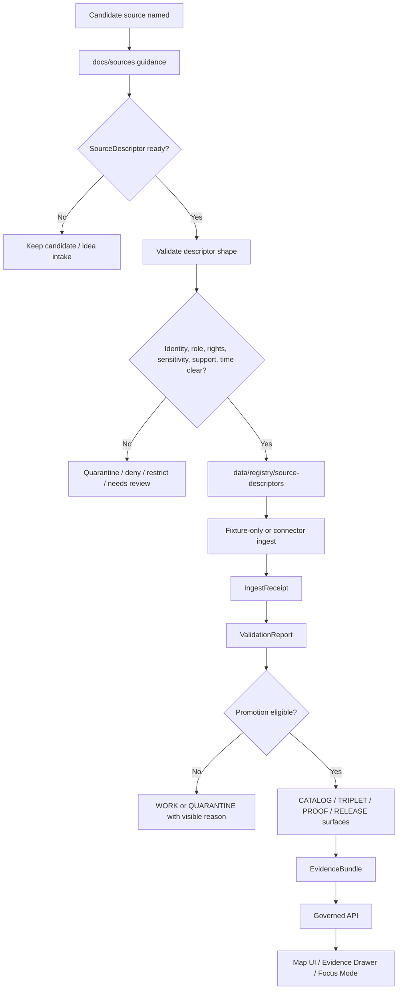

<!-- [KFM_META_BLOCK_V2]
doc_id: kfm://doc/NEEDS-VERIFICATION
title: Sources
type: standard
version: v1-draft-full-treatment
status: draft
owners: NEEDS-VERIFICATION
created: 2026-04-23
updated: 2026-04-28
policy_label: NEEDS-VERIFICATION
repo_path: docs/sources/README.md
evidence_mode: CORPUS_ONLY / NO_LOCAL_REPO_EVIDENCE
authority_posture: PROPOSED canonical/supporting until mounted repository verification
related:
  - docs/sources/SOURCE_DESCRIPTOR_STANDARD.md
  - docs/sources/SOURCE_REFRESH_RULES.md
  - docs/registers/AUTHORITY_LADDER.md
  - docs/registers/CANONICAL_LINEAGE_EXPLORATORY.md
  - docs/intake/IDEA_INTAKE.md
  - contracts/OBJECT_MAP.md
  - schemas/README.md
  - policy/README.md
  - data/registry/source-descriptors/
  - tests/fixtures/
tags:
  - kfm
  - sources
  - source-descriptor
  - source-refresh
  - source-role
  - evidence-bundle
  - documentation-control
notes:
  - Generated as a repo-ready draft from attached KFM doctrine and the submitted docs/sources README draft.
  - Owner, policy label, doc_id, path presence, adjacent file presence, schema home, workflow names, and current implementation behavior remain NEEDS VERIFICATION.
[/KFM_META_BLOCK_V2] -->

<a id="top"></a>

# Sources

Source-admission, source-role, and refresh guidance for KFM. This directory turns named datasets, APIs, archives, sensors, models, documentary collections, portals, and source systems into **reviewable evidence-bearing inputs** before ingestion.

> [!IMPORTANT]
> **Status:** `draft` / `experimental`  
> **Path:** `docs/sources/README.md`  
> **Evidence mode:** `CORPUS_ONLY / NO_LOCAL_REPO_EVIDENCE`  
> **Authority posture:** `PROPOSED canonical/supporting` until the mounted repository verifies adjacent files, owners, registries, schemas, policies, tests, and link targets.
>
> [](#status--impact)
> [](#truth-posture)
> [](#source-admission-gates)
> [](#verification-gates)
>
> **Quick jumps:** [Scope](#scope) · [Repo fit](#repo-fit) · [What belongs here](#what-belongs-here) · [What does not belong here](#what-does-not-belong-here) · [Truth posture](#truth-posture) · [Source roles](#source-roles) · [Admission gates](#source-admission-gates) · [Refresh](#source-refresh-rules) · [Flow](#flow) · [Review card](#review-card) · [Verification](#verification-gates)

---

## Scope

`docs/sources/` is the documentation home for **source onboarding rules**, **source-role discipline**, and **source refresh expectations**.

This directory exists to answer one question before any connector, watcher, scraper, import job, model, tile build, map layer, graph projection, EvidenceBundle, AI answer, or public story is trusted:

> Has this source been described well enough to become admissible evidence in KFM?

A source being technically reachable is not enough. KFM source admission requires explicit identity, role, rights, sensitivity, cadence, spatial support, temporal support, validation burden, publication intent, and rollback/correction expectations.

### This directory owns

- Source-admission guidance.
- Source role vocabulary and burden notes.
- Source descriptor documentation standards.
- Source refresh and staleness rules.
- Cross-links from source guidance to semantic contracts, executable schemas, policy gates, fixtures, runbooks, receipts, proofs, release manifests, catalog objects, EvidenceBundles, and review surfaces.

### This directory does not own

- Raw source payloads.
- Source descriptor instances.
- Connector implementation.
- Runtime API routes.
- Model prompts or model outputs.
- Promotion decisions.
- Public release manifests.
- Evidence bundles for specific claims.
- Canonical domain records.

[Back to top](#top)

---

## Status & impact

| Field | Value |
|---|---|
| README status | `draft` / `experimental` |
| Metadata status | `draft` |
| Owners | `NEEDS_VERIFICATION` |
| Current implementation evidence | `UNKNOWN` until mounted repo inspection |
| Intended authority class | `PROPOSED canonical/supporting` |
| First review burden | Verify adjacent files, owner, schema home, policy label, registry paths, test surfaces, and link targets |
| Safe merge mode | Additive documentation-control PR; no live connector activation |
| First implementation follow-on | Source descriptor standard + refresh rules + valid/invalid fixtures + fail-closed policy stubs |

> [!NOTE]
> This README can be accepted as a documentation-control surface only after repository verification. It is **not** proof that source descriptors, validators, registries, workflows, promotion gates, APIs, UI components, dashboards, runtime traces, or emitted proof objects already exist in the checked-out repository.

[Back to top](#top)

---

## Repo fit

| Direction | Surface | Expected relationship | Status |
|---|---|---|---|
| Current file | `docs/sources/README.md` | Directory landing page for source onboarding and refresh guidance | `PROPOSED` |
| Upstream docs landing | [`../README.md`](../README.md) | Should link into this source guidance once verified | `NEEDS VERIFICATION` |
| Authority register | [`../registers/AUTHORITY_LADDER.md`](../registers/AUTHORITY_LADDER.md) | Should define how sources, doctrine, repo evidence, and external standards rank | `NEEDS VERIFICATION` |
| Canon/status register | [`../registers/CANONICAL_LINEAGE_EXPLORATORY.md`](../registers/CANONICAL_LINEAGE_EXPLORATORY.md) | Should identify whether source docs are canon, lineage, exploratory, or reference | `NEEDS VERIFICATION` |
| Peer source standard | [`SOURCE_DESCRIPTOR_STANDARD.md`](SOURCE_DESCRIPTOR_STANDARD.md) | Should define `SourceDescriptor` documentation and field expectations | `NEEDS VERIFICATION` |
| Peer refresh rules | [`SOURCE_REFRESH_RULES.md`](SOURCE_REFRESH_RULES.md) | Should define cadence, freshness, no-change receipts, staleness, supersession, and refresh failure handling | `NEEDS VERIFICATION` |
| Semantic contracts | [`../../contracts/README.md`](../../contracts/README.md) / [`../../contracts/OBJECT_MAP.md`](../../contracts/OBJECT_MAP.md) | Should define object meaning and invariants | `NEEDS VERIFICATION` |
| Executable schemas | [`../../schemas/README.md`](../../schemas/README.md) | Should define machine-checkable shapes | `NEEDS VERIFICATION` |
| Policy | [`../../policy/README.md`](../../policy/README.md) | Should enforce rights, sensitivity, promotion, runtime, and denial logic | `NEEDS VERIFICATION` |
| Source instances | [`../../data/registry/source-descriptors/`](../../data/registry/source-descriptors/) | Should hold source descriptor instances, not prose standards | `NEEDS VERIFICATION` |
| Fixtures | [`../../tests/fixtures/README.md`](../../tests/fixtures/README.md) | Should hold valid/invalid descriptor examples and gate behavior fixtures | `NEEDS VERIFICATION` |
| Runbook | [`../runbooks/SOURCE_REFRESH.md`](../runbooks/SOURCE_REFRESH.md) | Should describe operational refresh procedure and emitted receipts | `NEEDS VERIFICATION` |

> [!WARNING]
> If the mounted repo later proves different canonical homes, preserve this document’s semantics but adapt paths through an ADR or migration note. Do not create parallel source, schema, or policy homes merely because this draft names provisional paths.

[Back to top](#top)

---

## What belongs here

Content belongs in `docs/sources/` when it defines **how a source may enter KFM**, not when it is the source itself.

| Accepted input | Belongs here when it… | Example |
|---|---|---|
| Source descriptor guidance | Defines minimum fields, review burden, admissibility, and descriptor-to-schema relationships | “Every source descriptor must declare owner, rights, sensitivity, cadence, role, validation checks, and publication intent.” |
| Source role taxonomy | Stabilizes meanings such as observation, regulatory record, modeled surface, operational context, discovery mirror, or documentary evidence | “Operational warning feed is not the same as regulatory flood layer.” |
| Source refresh rules | Defines update cadence, freshness, no-change receipts, staleness, supersession, and quarantine behavior | “A no-change refresh still emits a receipt.” |
| Source admission checklists | Helps reviewers decide whether a source can be normalized, quarantined, restricted, deferred, or denied | “Unresolved redistribution terms block public promotion.” |
| Crosswalk guidance | Links source documentation to contracts, schemas, policy, fixtures, registries, and emitted artifacts | “A `SourceDescriptor` prose card points to a schema and invalid fixture.” |
| Lane-specific burden notes | Explains burden differences for hydrology, hazards, biodiversity, archaeology, people/DNA/land, transport, settlements, geology, atmosphere, soils, and agriculture | “Rare species exact coordinates fail closed for public surfaces.” |

[Back to top](#top)

---

## What does not belong here

| Do not put this in `docs/sources/` | Use this instead | Why |
|---|---|---|
| Raw downloaded files, API dumps, rasters, CSVs, PDFs, scans | `data/raw/`, `data/work/`, or `data/quarantine/` | Raw materials belong to the lifecycle, not the documentation standard. |
| Source descriptor instances | `data/registry/source-descriptors/` | Instances are registry records; this directory defines how to write and review them. |
| Ingest receipts or refresh receipts | `data/receipts/` | Receipts are emitted process memory, not normative prose. |
| Proof packs or promotion evidence | `data/proofs/` | Proofs support release; they do not define source admission rules. |
| Release manifests or catalog closure outputs | `data/manifests/`, `data/catalog/`, or release-specific homes | Releases are outputs of promotion gates. |
| Connector code, watchers, scrapers, fetch scripts | `pipelines/`, `tools/`, `packages/`, or app-specific homes | Implementation must remain downstream of source admission. |
| Human semantic object definitions | `contracts/` | Contracts explain object meaning and invariants. |
| JSON Schema or executable validation shape | `schemas/` | Schemas are machine-checkable definitions. |
| Policy-as-code or gate rules | `policy/` | Policy decides allow, deny, restrict, quarantine, or require review. |
| Domain lane doctrine | `docs/domains/` | Domains define lane burden; sources define source admission. |
| Exploratory “New Ideas” packets | `docs/intake/` or `docs/archive/exploratory/` | Exploratory pressure must not become accidental authority. |
| AI-generated summaries | governed AI output stores / review surfaces, after policy and citation validation | Generated language is downstream interpretation, not source admission. |

[Back to top](#top)

---

## Directory tree

Expected source-documentation shape:

```text
docs/sources/
├── README.md                         # this file
├── SOURCE_DESCRIPTOR_STANDARD.md      # NEEDS VERIFICATION
└── SOURCE_REFRESH_RULES.md            # NEEDS VERIFICATION
```

Related but separate source-admission surfaces:

```text
contracts/
└── OBJECT_MAP.md                      # human semantic object map; NEEDS VERIFICATION

schemas/
└── ...                                # executable SourceDescriptor schema; NEEDS VERIFICATION

policy/
└── ...                                # rights/sensitivity/release policy; NEEDS VERIFICATION

data/
└── registry/
    └── source-descriptors/            # source descriptor instances; NEEDS VERIFICATION

tests/
└── fixtures/
    └── ...                            # valid/invalid descriptor examples; NEEDS VERIFICATION
```

[Back to top](#top)

---

## Quickstart

Use these commands from the repository root during review. They are read-only discovery checks.

```bash
# 1. Inspect source-documentation and registry surfaces.
find docs/sources data/registry/source-descriptors -maxdepth 4 -type f 2>/dev/null | sort

# 2. Inspect adjacent contract, schema, policy, and fixture surfaces.
find contracts schemas policy tests/fixtures -maxdepth 4 -type f 2>/dev/null | sort

# 3. Trace source-admission vocabulary across the repo.
grep -RInE \
  'SourceDescriptor|source_descriptor|source role|source_role|rights|sensitivity|cadence|freshness|crs|valid_time|issue_time|retrieved_time|as_of|EvidenceBundle|ReleaseManifest|DecisionEnvelope|PromotionDecision|run_receipt' \
  docs contracts schemas policy data tests tools pipelines apps packages 2>/dev/null || true

# 4. Confirm this README's links before promoting the doc from draft.
python - <<'PY'
from pathlib import Path

root = Path.cwd()
targets = [
    "docs/README.md",
    "docs/registers/AUTHORITY_LADDER.md",
    "docs/registers/CANONICAL_LINEAGE_EXPLORATORY.md",
    "docs/sources/SOURCE_DESCRIPTOR_STANDARD.md",
    "docs/sources/SOURCE_REFRESH_RULES.md",
    "contracts/README.md",
    "contracts/OBJECT_MAP.md",
    "schemas/README.md",
    "policy/README.md",
    "tests/fixtures/README.md",
    "data/registry/source-descriptors",
]
for target in targets:
    p = root / target
    print(("OK   " if p.exists() else "MISS ") + target)
PY
```

> [!WARNING]
> Discovery output is not proof of enforcement. A file existing is weaker evidence than a passing validator, emitted receipt, policy decision, release proof pack, or runtime trace.

[Back to top](#top)

---

## Truth posture

Use the narrowest truthful label when documenting source material.

| Label | Meaning in this directory |
|---|---|
| `CONFIRMED` | Verified from mounted repo evidence, accepted doctrine, source descriptor instance, validator output, receipt, proof, release artifact, runtime trace, or cited official source. |
| `INFERRED` | Strongly supported by doctrine or nearby repo structure, but not directly proven. |
| `PROPOSED` | Design or documentation plan not yet verified as implemented. |
| `UNKNOWN` | Not resolved by currently visible evidence. |
| `NEEDS VERIFICATION` | Checkable before promotion, release, owner assignment, connector activation, or public claim. |
| `CONFLICTED` | Evidence layers disagree or authority is unresolved. |
| `DENY` | Policy or safety boundary blocks the requested publication, exposure, source use, answer, or action. |
| `ABSTAIN` | Evidence is insufficient to make the requested claim. |
| `ERROR` | A technical or process failure prevents a reliable result. |

### Source-grounded vs. source-like

A source-looking URL, dataset name, API endpoint, shapefile, table, map service, PDF, scan, model output, or portal record is only a **candidate source** until KFM records the source’s role, rights, sensitivity, cadence, support, validation burden, intended use, and review state.

[Back to top](#top)

---

## Source statuses

| Status | Meaning | Public-use posture |
|---|---|---|
| `candidate` | Named but not admitted; descriptor missing or incomplete | No public use |
| `draft_descriptor` | Descriptor exists but lacks verified rights, sensitivity, owner, role, support, or fixtures | No public use |
| `admitted_internal` | Descriptor passes minimum identity/role checks but is not public-release eligible | Internal governed use only |
| `restricted` | Source requires steward, sensitivity, embargo, license, privacy, cultural, critical-infrastructure, or living-person controls | Restricted access; public derivative only if policy allows |
| `fixture_only` | Used for synthetic or static no-network validation | No live-source claims |
| `admitted_public_candidate` | Rights, sensitivity, role, support, and validation plan appear promotable | Public only after proof, catalog, policy, and release gates |
| `published_source_basis` | Source fed released artifacts and claim evidence through promotion | Public claims must still cite EvidenceBundle and release state |
| `deprecated` | Superseded by another source, version, or method | Use only through lineage/correction path |
| `denied` | Policy, rights, safety, or evidence failure blocks use | Do not ingest or publish |

[Back to top](#top)

---

## Source roles

Source roles are not interchangeable. A map can render multiple roles together, but KFM must not collapse their meanings.

| Source role | Typical material | Handling rule |
|---|---|---|
| Direct observation / measurement | Gauges, sensors, field samples, specimens, point clouds, station observations | Preserve units, support, calibration context, uncertainty, valid time, and collection method. Do not repackage as policy truth. |
| Statutory / regulatory record | Flood hazard layers, designations, lists, declarations, administrative boundaries | Preserve legal status, effective date, supersession path, jurisdiction, and exact source identity. |
| Operational context feed | Advisories, alerts, watches, live operations feeds, transit positions | Useful for context; not a replacement for archival, regulatory, or source-of-record evidence. Must show issue, expiry, retrieval, and freshness state. |
| Discovery mirror / index | Dataset catalogs, STAC collections, portals, search indexes | Treat as discovery scaffolding; verify against source of record where required. |
| Modeled / assimilated / derived surface | Habitat models, anomaly surfaces, smoke masks, flow accumulation, interpolated rasters | Keep visibly derived; store method, lineage, support, assumptions, uncertainty, and validation burden. |
| Documentary evidence object | Newspapers, oral histories, maps, plats, scans, reports, notebooks | Preserve original identity; extraction, OCR, summarization, georeferencing, and interpretation require review-aware lanes. |
| Authority / crosswalk system | GNIS, LCNAF, VIAF, taxonomic authorities, identifier crosswalks | Use for disambiguation and stitching, not as a replacement for source identity or proof. |
| Community-contributed source | Citizen observations, volunteered geography, crowd reports | Require explicit provenance, review burden, rights posture, precision handling, and public-safety controls. |
| Administrative / transactional record | Assessor rows, permits, inspection records, filings, ownership tables | Preserve transaction time, effective time, issuer, legal burden, and limitation. Do not equate with ground truth unless source role supports it. |
| Remote sensing / imagery product | Satellite imagery, aerial imagery, LiDAR, radar, classifications, indices | Preserve acquisition time, processing level, sensor/platform, georeferencing, cloud/quality masks, resolution, and interpretation limits. |

[Back to top](#top)

---

## Source admission gates

A source should not move from candidate to admitted source unless the minimum gates below can be answered.

| Gate | Required evidence | Fails closed when… |
|---|---|---|
| Identity | Stable source name, steward, source-of-record or provider status, source URL/acquisition path, version or collection identifier | Source identity is ambiguous, mirrored without source-of-record checks, or unauditable. |
| Role | Declared source role and lane fit | A source is treated as generic “data” without epistemic role. |
| Rights | License, terms, redistribution, attribution, automation posture, export/publication constraints | Rights are unknown, incompatible, or unreviewed for the intended output. |
| Sensitivity | Sensitive classes, exact-location rules, public precision, steward review burden, personal/cultural/species/infrastructure risks | Sensitive geometry, personal data, cultural knowledge, protected species, or critical infrastructure risk can leak. |
| Spatial basis | Native CRS, support, scale/resolution, extent, geometry precision, topology expectations, transform burden | CRS/support is missing, incompatible, unverified, or silently transformed. |
| Temporal basis | Valid time, issue time, retrieved time, update cadence, freshness, expiry, supersession, event time, publication time | Event time, issue time, update time, retrieval time, and publication time are flattened. |
| Validation | Expected checks, required valid/invalid fixtures, known failure modes, quarantine rules, remediation path | No invalid fixture, no validator, or no remediation path exists. |
| Publication intent | Intended KFM use, public-safe derivative plan, citation expectations, access tier | The source is useful internally but not safe or legal for public release. |
| Lifecycle hooks | Expected receipts, catalog records, proof objects, EvidenceBundles, release manifests, rollback/correction hooks | Admission cannot be reconstructed after ingest or release. |

[Back to top](#top)

---

## Flow



This flow is intentionally conservative: documentation and descriptors come before live automation.

[Back to top](#top)

---

## Source refresh rules

Source refresh belongs here as doctrine and in runbooks as operations. Keep these principles visible:

1. A refresh run must emit a receipt even when nothing changes.
2. Source freshness is not the same as claim validity.
3. Retrieval time, source valid time, event time, issue time, expiry time, supersession time, and publication time must not be silently collapsed.
4. Conditional requests, checksums, ETags, last-modified headers, response metadata, and source version identifiers should be recorded when supported.
5. Changed source bytes do not automatically imply a promotable dataset change.
6. No public output should update without validation, policy checks, catalog/proof closure, and release-state transition.
7. Staleness should surface as a state, not disappear behind cached map tiles, search indexes, summaries, or model answers.
8. Refresh failure should produce a visible disposition: `NO_CHANGE`, `UPDATED`, `STALE`, `QUARANTINED`, `DENIED`, `ERROR`, or `NEEDS_REVIEW`.
9. Refresh must preserve rollback target and correction lineage when source changes affect published claims.

[Back to top](#top)

---

## KFM lifecycle placement

Source admission is upstream of ingestion, but it does not bypass KFM lifecycle control.

```text
CANDIDATE SOURCE
  -> SOURCE DESCRIPTOR REVIEW
  -> RAW
  -> WORK / QUARANTINE
  -> PROCESSED
  -> CATALOG / TRIPLET
  -> PUBLISHED
  -> GOVERNED API / UI / FOCUS MODE
```

Public clients and ordinary UI surfaces should consume released artifacts, governed APIs, catalog records, tiles, EvidenceBundles, and policy-safe runtime envelopes. They should not read directly from RAW, WORK, QUARANTINE, unpublished candidate data, canonical/internal stores, or direct model outputs.

[Back to top](#top)

---

## Maintainer workflow

When adding or revising source documentation:

1. Start with the source role and admissibility question.
2. Check the authority ladder and canon/status register before adding a new document.
3. Put prose standards in `docs/sources/`.
4. Put source descriptor instances in `data/registry/source-descriptors/`.
5. Link each descriptor to its semantic contract, executable schema, validator, policy, fixtures, and expected receipts/proofs.
6. Include at least one valid and one invalid fixture before proposing automation.
7. Mark unresolved rights, sensitivity, owner, cadence, source-of-record status, endpoint behavior, or schema shape as `NEEDS VERIFICATION`.
8. Keep live connector activation separate from documentation acceptance.
9. Record rollback/correction expectations before publication.
10. Update this README when adjacent standards and registries become verified repo reality.

[Back to top](#top)

---

## Review card

Use this human review card when the executable schema is not yet mounted.

| Field | Required question |
|---|---|
| Source name | What is the source called by its steward or provider? |
| Steward / owner | Who maintains it externally, and who in KFM reviews it? |
| Source-of-record status | Is it authoritative, mirrored, derived, community-contributed, discovery-only, or unknown? |
| Source role | Observation, regulatory record, operational context, modeled surface, documentary object, authority crosswalk, administrative record, remote-sensing product, or other? |
| Access method | API, bulk download, archive request, manual acquisition, restricted steward path, fixture-only, or unknown? |
| Auth posture | Public, key-based, account-based, steward-restricted, embargoed, or unknown? |
| Rights posture | What license, terms, attribution, redistribution, and automation constraints apply? |
| Sensitivity posture | What exact-location, personal, cultural, species, infrastructure, legal, or operational risks apply? |
| Spatial basis | Native CRS, support, scale, precision, geometry type, extent, topology expectations, and transform burden. |
| Temporal basis | Valid time, event time, issue time, retrieved time, update cadence, expiry, supersession, and freshness window. |
| Normalization target | Which KFM object family may this source feed? |
| Validation checks | What must pass before work, processed, catalog, or published state? |
| Failure handling | What conditions require `DENY`, `ABSTAIN`, `QUARANTINE`, `RESTRICT`, or `NEEDS_REVIEW`? |
| Publication intent | Is this intended for public release, steward-only use, internal analysis, citation support, or fixture-only validation? |
| Downstream evidence | Which receipts, validation reports, catalog records, proof objects, release manifests, and EvidenceBundles should be emitted? |
| Rollback/correction | What published outputs or claims would need rollback, withdrawal, correction, or supersession when this source changes? |

[Back to top](#top)

---

## Verification gates

Before this README is promoted beyond draft:

- [ ] Owner is replaced with a verified team, role, or maintainer group.
- [ ] `policy_label` is replaced with the project-approved label.
- [ ] `doc_id` is replaced with a real KFM document identifier.
- [ ] All relative links resolve in the mounted repository.
- [ ] `SOURCE_DESCRIPTOR_STANDARD.md` exists or the README clearly states its absence.
- [ ] `SOURCE_REFRESH_RULES.md` exists or the README clearly states its absence.
- [ ] `data/registry/source-descriptors/` existence and purpose are verified.
- [ ] Contract/schema/policy/fixture homes are verified against real repo conventions.
- [ ] README badges still reflect the document’s actual status.
- [ ] Any examples are marked illustrative unless backed by checked-in fixtures.
- [ ] No source instance, raw data, receipt, proof, or release artifact is stored in `docs/sources/`.
- [ ] Source role vocabulary matches the authority register and domain-lane docs.
- [ ] At least one valid and one invalid source descriptor fixture exists before live connector activation.
- [ ] The repo’s pre-publish documentation checklist passes.

[Back to top](#top)

---

<details>
<summary><strong>Appendix: common anti-patterns</strong></summary>

- Treating a source as admissible because it has an API.
- Treating a discovery portal as the source of record.
- Treating modeled, observed, regulatory, operational, administrative, remote-sensing, and documentary sources as interchangeable.
- Publishing source-derived geometry before sensitivity and public precision are reviewed.
- Reusing a source without carrying rights, attribution, redistribution, and automation constraints.
- Running live refresh automation before valid/invalid fixtures exist.
- Letting map layers, search indexes, summaries, or AI outputs cite a source that has no descriptor.
- Moving source instances, receipts, proofs, or release manifests into `docs/sources/`.
- Upgrading `PROPOSED` source guidance to `CONFIRMED` because it is well written.
- Collapsing refresh time, event time, source valid time, retrieval time, issue time, expiry time, and public release time into one timestamp.
- Letting source freshness silently update public claims without review, proof, policy, and release state.

</details>

<details>
<summary><strong>Appendix: first PR acceptance checklist</strong></summary>

A safe first PR for this directory should be documentation- and fixture-first:

- [ ] Add or update `docs/sources/README.md`.
- [ ] Add `docs/sources/SOURCE_DESCRIPTOR_STANDARD.md` or explicitly defer it.
- [ ] Add `docs/sources/SOURCE_REFRESH_RULES.md` or explicitly defer it.
- [ ] Add an ADR or decision note for source descriptor schema home if repo convention is ambiguous.
- [ ] Add no-network valid/invalid source descriptor fixtures.
- [ ] Add validator command or documented pending validator.
- [ ] Add policy stub or documented pending policy.
- [ ] Add no live connector activation.
- [ ] Add rollback note: remove the docs PR or revert descriptor fixtures; no source data or public artifacts affected.

</details>

- AirNow Layer 1 intake foundation: `docs/sources/airnow/README.md`
