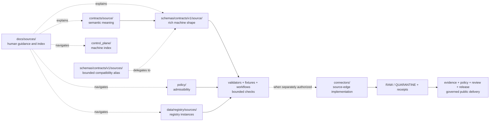
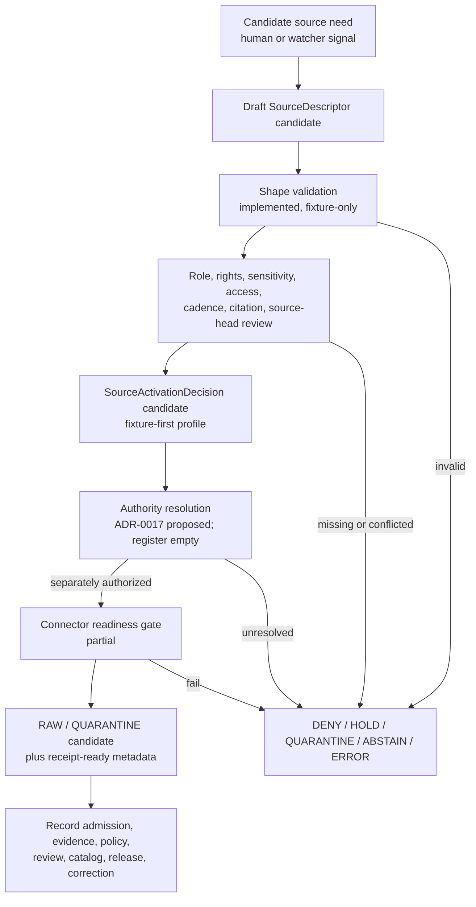

<!-- [KFM_META_BLOCK_V2]
doc_id: kfm://doc/docs-sources-readme
title: docs/sources/ — Human Source Governance and Catalog Documentation
type: readme; directory-readme; source-guidance-index; documentation-lane-boundary
version: v1.1
prior_version: v1
status: active; repository-grounded; documentation-only; mixed-maturity; source-admission-authority-held
owners:
  - "@bartytime4life — verified CODEOWNERS review route; source, rights, policy, and independent stewardship assignments NEEDS VERIFICATION"
created: 2026-05-08
updated: 2026-08-14
policy_label: repository-facing
current_path: docs/sources/README.md
owning_root: docs/
responsibility: >-
  Index and bound KFM's human-readable source guidance, source-admission
  documentation, citation and rights guidance, source-role discussion, and
  source-to-catalog documentation without taking over semantic contracts,
  machine schemas, policy, source registries, connectors, receipts, lifecycle
  data, release decisions, or public delivery.
truth_posture: >-
  CONFIRMED current path, direct-child inventory, adopted Directory Rules,
  current documentation companions, SourceDescriptor validation surfaces,
  empty source-authority register, registry-package placeholder state, and
  partial connector-gate evidence / PROPOSED unresolved source-admission and
  vocabulary decisions / UNKNOWN live-source activation, populated registry,
  operational policy evaluation, universal connector adoption, and public
  source effects / NEEDS VERIFICATION independent stewardship, source-role
  convergence, rights decisions, active-source inventory, and end-to-end
  admission, correction, rollback, and release behavior.
authority_class: documentation-lane-boundary
authority_rank: >-
  Subordinate to the adopted Directory Rules, accepted ADRs, docs/ root
  contract, semantic contracts, machine schemas, policy, evidence, review,
  lifecycle, and release authority.
canonical_relationship: >-
  Same-path README update under the canonical docs/ responsibility root; no
  new lane, source, registry entry, connector, schema, policy, receipt,
  lifecycle object, release object, or public interface is created.
evidence_snapshot:
  repository: bartytime4life/Kansas-Frontier-Matrix
  base_ref: main
  base_commit: cbee7add137b9738b3d123b17d41ac3d44d9745b
  target_prior_blob: 389ca581b4ad0bfd906b58d158c21add764e153e
  docs_root_readme_blob: 1f8bac189dac1d01c1185e8b4fb8e25efd11d09f
  directory_rules_blob: fd49a0b83e55cef52c1124281f093e263526898d
  codeowners_blob: dd2a84aa514d8ecd9208bc347f90f9a2ed37dd61
  admission_process_blob: ab27618a4b1b0e6775d18bedca37aa7d6c514e6e
  citation_guidance_blob: 073bc7348903b550c98f6fa5674bd1c7378dfc0e
  rights_guidance_blob: 215d49b112a3e08f12cce5f92ba25dd8c3751a10
  source_descriptor_standard_blob: 4327c603f76e5b5a76fa058fe24ac2af91e496d8
  source_roles_blob: c528d517503aca2952164b45701246c5abae751c
  source_catalog_tree: 7edacb30d8caa950ac73947f69e43dbb64fb2d04
  source_catalog_readme_blob: 5bb8a37bf487aaef6d5eed8cc1bb8e395777017f
  source_descriptor_schema_blob: 582e70b834278c3c6ca9a8b31efbe0989c96f0bc
  source_descriptor_alias_schema_blob: 42da54b28a527850cce88ad89f68921c101fc56b
  source_authority_register_blob: 82c23722520922f5ca0dad7f37ed794d1c2edf81
  source_registry_package_blob: 6df77a248c72a17ddaeb5d701baf6e4d9db38eab
  connectors_readme_blob: a28336f6c15e0234241a7844e5683a52c2fd5024
  source_descriptor_workflow_blob: 6d3f900efcddc17d24a528a92190544fc350b63b
related:
  - docs/README.md
  - docs/doctrine/directory-rules.md
  - docs/adr/ADR-0029-adopt-directory-governance-standard-v2.md
  - docs/adr/ADR-0017-source-descriptor-admission-process.md
  - docs/adr/ADR-0001-schema-home--schemas-contracts-v1-is-canonical.md
  - docs/sources/ADMISSION_PROCESS.md
  - docs/sources/CITATION_GUIDANCE.md
  - docs/sources/RIGHTS_GUIDANCE.md
  - docs/sources/SOURCE_DESCRIPTOR_STANDARD.md
  - docs/sources/source-roles.md
  - docs/sources/catalog/README.md
  - contracts/source/README.md
  - schemas/contracts/v1/source/README.md
  - control_plane/source_authority_register.yaml
  - data/registry/sources/README.md
  - packages/source-registry/README.md
  - connectors/README.md
  - tools/validators/connector_gate/README.md
  - .github/workflows/source-descriptor-validate.yml
tags:
  - kfm
  - docs
  - sources
  - source-guidance
  - source-descriptor
  - source-admission
  - source-role
  - rights
  - citation
  - catalog
  - trust-membrane
  - cite-or-abstain
notes:
  - "The lane contains six direct files and one direct child directory at the pinned snapshot."
  - "ADR-0029 is accepted; ADR-0017 and ADR-0001 remain proposed."
  - "SourceDescriptor shape validation is implemented and fixture-only; it does not admit or activate a source."
  - "The machine source-authority register exists but has zero entries at the pinned snapshot."
  - "This revision retires the prior README's unsupported no-mounted-repo and canonical-seven claims without deciding the unresolved source-role vocabulary."
supersedes:
  - "v1 at the same path"
superseded_by: []
[/KFM_META_BLOCK_V2] -->

<a id="top"></a>
<a id="docssources"></a>

# `docs/sources/` — Human Source Governance and Catalog Documentation

> **One-line purpose.** Index and bound the repository's human-readable source guidance so contributors can move from source discovery to reviewed KFM work without mistaking documentation, schema validity, connector presence, or catalog prose for source authority, admission, release, or public truth.

[](#status)
[](#authority-level)
[](#current-direct-child-map)
[](#status)
[](#adrs)
[](#outputs)

> [!IMPORTANT]
> **This lane explains source governance; it does not perform it.** A page under `docs/sources/`, a schema-valid `SourceDescriptor`, a connector directory, a passing workflow, a catalog profile, or a pull request cannot make a source authoritative, rights-cleared, active, evidence-sufficient, released, or public.

> [!CAUTION]
> **The source-role vocabulary is not fully converged.** Current repository surfaces use different vocabularies: the human [`source-roles.md`](./source-roles.md), the executable SourceDescriptor schema, older seven-role guidance, and proposed ADR-0017 do not constitute one accepted enum. This README preserves the anti-collapse rule and places vocabulary changes on `HOLD` until the owning contract, schema, policy, and decision records agree.

> [!WARNING]
> **Repository-facing is not confidential.** Do not put credentials, signed URLs, private endpoints, restricted source payloads, living-person records, genomic data, exact rare-species or archaeology locations, sensitive infrastructure detail, private land information, or protected denial reasons in this lane.

<a id="quick-jump"></a>

## Quick navigation

[Purpose](#purpose) · [Authority](#authority-level) · [Status](#status) · [Current tree](#current-direct-child-map) · [Belongs](#what-belongs-here) · [Exclusions](#what-does-not-belong-here) · [Reader routes](#reader-routes) · [Inputs](#inputs) · [Outputs](#outputs) · [Repo fit](#repo-fit) · [Source roles](#source-role-anti-collapse-register-confirmed-doctrine) · [SourceDescriptor](#sourcedescriptor-surface-proposed-shape) · [Catalog](#source-family-index) · [Admission](#source-admission-flow) · [Validation](#validation) · [Review](#review-burden) · [Related](#related-folders) · [ADRs](#adrs) · [Correction](#correction-supersession-and-rollback) · [FAQ](#faq) · [Verification](#open-verification-register) · [No-loss](#no-loss-ledger) · [Review date](#last-reviewed)

---

<a id="purpose"></a>

## Purpose

At `main@cbee7add137b9738b3d123b17d41ac3d44d9745b`, `docs/sources/` is a real, populated documentation lane. It contains six direct files and one direct child directory. Its job is to help humans understand and review:

- what KFM means by a source, source descriptor, source role, source family, source admission, citation obligation, rights posture, and source-to-catalog relationship;
- which repository authority owns meaning, shape, admissibility, registry instances, acquisition, receipts, evidence, lifecycle state, release, and public delivery;
- what is implemented, partial, proposed, conflicted, or unknown in the current source-governance stack;
- where to begin when adding, reviewing, correcting, restricting, superseding, or retiring source guidance.

The lane is **not** a bibliography and is not an activation console. Its durable contribution is a trustworthy human index over the source-governance system.

### Current outcome

- **CONFIRMED:** the documentation lane, its direct children, SourceDescriptor validation workflow, rich schema, compatibility alias, fixtures, validators, and partial connector-gate controls exist.
- **CONFIRMED:** the source-authority register exists with `entries: []`.
- **PROPOSED:** ADR-0017's full source-admission decision and ADR-0001's dedicated schema-routing package.
- **UNKNOWN:** any complete active-source inventory, operational source-admission service, universal connector enforcement, production policy evaluation, or live-source public effect.
- **HOLD:** claims that a provider, catalog page, connector, schema, or workflow is an admitted source or publication authority.

[Back to top](#top)

---

<a id="policy-posture"></a>
<a id="authority-level"></a>

## Authority level

`docs/sources/` is a **subordinate documentation lane under the canonical `docs/` responsibility root**. It owns human-readable explanation and navigation for source governance. It does not own any adjacent trust object.

| Question | Owning surface | Relationship of this README |
|---|---|---|
| Where does human source guidance belong? | [`docs/`](../README.md), under the adopted Directory Rules | Records the lane boundary and current index |
| What does a source object mean? | [`contracts/source/`](../../contracts/source/README.md) | Links and explains; does not redefine |
| What machine shape is validated? | [`schemas/contracts/v1/source/`](../../schemas/contracts/v1/source/README.md) and reviewed aliases | Reports current shape and drift; does not choose a new schema |
| Is a source admissible, restricted, or denied? | `policy/`, source-specific review, and accepted decision records | Describes the process; does not decide |
| Which source instances are registered? | [`data/registry/sources/`](../../data/registry/sources/README.md) and accepted machine indexes | Does not create or populate registry records |
| What does the machine governance index say? | [`control_plane/source_authority_register.yaml`](../../control_plane/source_authority_register.yaml) | Reports that the current register is proposed and empty |
| How are source bytes acquired? | [`connectors/`](../../connectors/README.md) | Points to implementation; does not fetch |
| Where may connector output land? | Governed RAW, QUARANTINE, and receipt lanes | Does not store source payloads |
| What supports a consequential claim? | `EvidenceRef` resolved to `EvidenceBundle`, with policy and release state | Source documentation alone is insufficient |
| Who releases, corrects, withdraws, or rolls back public state? | [`release/`](../../release/README.md) and the owning evidence/accountability families | No release authority |

### Directory Rules basis

ADR-0029 accepts the exact Directory Rules v2 bytes at [`docs/doctrine/directory-rules.md`](../doctrine/directory-rules.md). Those rules make a path an authority claim, keep `docs/` human-readable, prohibit parallel writable authorities, and require a README to narrow rather than expand its parent root.

This same-path update does not create a new authority boundary. It aligns an existing direct child of `docs/` with the current parent contract and current repository evidence.

[Back to top](#top)

---

<a id="status"></a>

## Status

### Current repository evidence

| Surface | Current evidence at the pinned snapshot | Safe conclusion |
|---|---|---|
| `docs/sources/` | Six files plus `catalog/` | Populated human-guidance lane |
| Parent `docs/` root | Active, repository-grounded README | Source guidance may live here, but docs are not sovereign truth |
| Directory Rules | Exact bytes adopted by accepted ADR-0029 | Placement authority is current |
| CODEOWNERS | Default route is `@bartytime4life`; no `docs/sources/` override | Review routing exists; source stewardship and approval remain separate |
| SourceDescriptor semantic guidance | Contract and standard files exist | Meaning is documented, with mixed maturity and naming drift |
| SourceDescriptor shape | Rich singular schema plus plural `$ref` alias | One executable shape is validated through two paths |
| Descriptor validation | Two CWD-independent entrypoints, fixtures, tests, read-only workflow, receipt check | Shape validation is implemented; admission is not |
| ADR-0017 | `proposed`, updated 2026-08-14 | Full admission authority remains held |
| Source authority register | Present, status `PROPOSED`, `entries: []` | No active source authority is established by the register |
| `packages/source-registry/` | Repository-grounded `0.0.0` placeholder with no supported exports | No operational registry client or resolver is established |
| `connectors/` | Canonical root, 104 direct connector directories at its pinned evidence snapshot, bounded internal core, partial gate enforcement | Broad implementation surface exists; active-source and end-to-end admission remain unproved |
| Connector gate | Bounded static and receipt prerequisites; full admission report/runtime unestablished | Partial readiness checking only |
| Source-role vocabulary | Human docs, schema enum, older seven-role prose, and proposed ADR do not fully agree | Vocabulary remains `CONFLICTED`; do not declare a canonical enum here |
| Public release | No source activation, release, or public effect was performed or proven by this review | Public status remains unchanged |

### Truth-label split

| Label | Applies to |
|---|---|
| `CONFIRMED` | Paths, direct children, current blobs, accepted Directory Rules, descriptor validation assets, empty register, package placeholder state, and partial connector evidence |
| `PROPOSED` | Full admission decision, source-role convergence, registry mechanics, operational policy, and future source-family additions |
| `UNKNOWN` | Active sources, deployed admission services, production policy decisions, external storage, live connector health, and public consumers |
| `NEEDS VERIFICATION` | Independent owners, source-by-source rights/currentness, catalog maintenance, complete consumer inventory, and correction/rollback drills |
| `CONFLICTED` | Source-role vocabulary, several singular/plural and case/path conventions, and residual source-governance naming |
| `HOLD` | Treating documentation, schema validity, catalog pages, connector presence, or workflow success as admission or release |

[Back to top](#top)

---

<a id="current-direct-child-map"></a>

## Current direct-child map

```text
docs/sources/
├── ADMISSION_PROCESS.md
├── CITATION_GUIDANCE.md
├── README.md
├── RIGHTS_GUIDANCE.md
├── SOURCE_DESCRIPTOR_STANDARD.md
├── catalog/
└── source-roles.md
```

| Direct child | Current role | Current posture |
|---|---|---|
| [`ADMISSION_PROCESS.md`](./ADMISSION_PROCESS.md) | Human description of the pre-RAW admission membrane and staged gate sequence | Draft standard; authority remains subordinate to ADRs, contracts, schemas, policy, and review |
| [`CITATION_GUIDANCE.md`](./CITATION_GUIDANCE.md) | Cite-or-abstain behavior and downstream citation obligations | Draft standard; some vocabulary and path claims require reconciliation |
| [`RIGHTS_GUIDANCE.md`](./RIGHTS_GUIDANCE.md) | Human rights, terms, attribution, redistribution, privacy, sovereignty, and sensitivity guidance | Draft and stale in places; not a source-specific rights decision |
| [`SOURCE_DESCRIPTOR_STANDARD.md`](./SOURCE_DESCRIPTOR_STANDARD.md) | Human SourceDescriptor field and intake guidance | Draft standard; current repository now has richer implementation evidence than its original no-repo boundary |
| [`source-roles.md`](./source-roles.md) | Human source-role reference | Proposed vocabulary; not synchronized with every other role surface |
| [`catalog/`](./catalog/README.md) | Human source-family and source-to-catalog documentation, profiles, crosswalks, templates, examples, and open questions | Populated draft companion lane; provider pages do not admit providers |
| `README.md` | Lane boundary and current navigation | This file |

The tree is an inventory, not a maturity claim. A child file may be extensive while its underlying contract, policy, registry, runtime, or source decision remains proposed or absent.

[Back to top](#top)

---

<a id="what-belongs-here"></a>

## What belongs here

Content belongs here when its primary responsibility is **human-readable cross-domain source guidance**:

- the lane README and navigation;
- source-admission, citation, rights, attribution, and source-role guidance;
- human SourceDescriptor documentation linked to the owning contract and schema;
- source-family and source-product catalog pages that clearly disclose their documentation-only role;
- human-readable catalog profiles, naming guidance, crosswalk explanations, coverage notes, glossary, templates, and illustrative examples;
- current-state reconciliation and open verification items for the documentation lane;
- public-safe correction, supersession, and maintenance guidance for source documentation.

### Admission criteria for a new child

Before adding a new file or directory here:

1. Confirm that its primary responsibility is human explanation, not machine authority or source data.
2. Search the current lane, `docs/domains/`, `docs/standards/`, ADRs, registers, and generated/mirror surfaces for an existing owner.
3. Identify the owning source family or cross-domain concern.
4. Bind consequential claims to current authoritative evidence or mark them `NEEDS VERIFICATION`.
5. State rights, sensitivity, currentness, writer, correction, and review posture.
6. Link the machine-bearing sibling only when it exists; do not invent an implementation path.
7. Avoid empty scaffolding and duplicate provider pages.
8. Add validation and rollback behavior appropriate to the change.

A source-family page is documentation. It does not create a `SourceDescriptor`, registry entry, connector, policy decision, evidence bundle, or release.

[Back to top](#top)

---

<a id="what-does-not-belong-here"></a>

## What does not belong here

| Do not place here as writable authority | Owning surface | Why |
|---|---|---|
| Source semantic contracts | [`contracts/source/`](../../contracts/source/README.md) | Contracts define meaning |
| Source JSON Schemas or compatibility aliases | [`schemas/contracts/v1/source/`](../../schemas/contracts/v1/source/README.md) and accepted schema aliases | Schemas define machine shape |
| Source-admission, rights, sensitivity, or release policy source | `policy/` | Policy decides admissibility |
| Source registry instances and vocabularies | [`data/registry/sources/`](../../data/registry/sources/README.md) or an accepted successor | Registry records are machine/lifecycle objects |
| Machine source-authority index | [`control_plane/source_authority_register.yaml`](../../control_plane/source_authority_register.yaml) | Machine projection is not prose |
| Connector or watcher implementation | [`connectors/`](../../connectors/README.md), `tools/`, `pipelines/`, or `packages/` selected by execution role | Documentation does not execute |
| Credentials, API keys, signed URLs, private endpoints, or secret-bearing examples | Never tracked documentation | Exposure risk |
| RAW, WORK, QUARANTINE, PROCESSED, CATALOG/TRIPLETS, or PUBLISHED data instances | `data/` lifecycle lanes | Data instances remain lifecycle-scoped |
| Receipts, proofs, evidence bundles, review records, or policy decisions | Their governed accountability and decision families | Trust objects must retain identity and owner |
| Release manifests, corrections, withdrawals, or rollback cards | [`release/`](../../release/README.md) and paired accountability lanes | A source page cannot release or correct public state |
| Domain-only source guidance | `docs/domains/<domain>/` when the concern is not cross-domain | Domain remains a segment inside `docs/` |
| External-standard conformance authority | `docs/standards/` and the owning contract/schema/policy | Source guidance may link, not replace |
| A second source-role enum or SourceDescriptor field list | Update the owning contract/schema/decision and then reconcile docs | Prevents parallel vocabulary authority |
| Current endpoint, terms, cadence, license, or availability claims without current evidence | Verify from the official source and record date/limitations | Volatile facts cannot be inferred from old prose |

[Back to top](#top)

---

<a id="reader-routes"></a>

## Reader routes

| Need | Start here | Then inspect |
|---|---|---|
| Understand the lane boundary | This README | Parent [`docs/README.md`](../README.md) and Directory Rules |
| Add or review a source candidate | [`ADMISSION_PROCESS.md`](./ADMISSION_PROCESS.md) | ADR-0017, contracts, schemas, policy, registry, connector gate |
| Understand SourceDescriptor fields | [`SOURCE_DESCRIPTOR_STANDARD.md`](./SOURCE_DESCRIPTOR_STANDARD.md) | Source contract, rich schema, alias schema, fixtures, validator workflow |
| Cite a source or evidence-backed claim | [`CITATION_GUIDANCE.md`](./CITATION_GUIDANCE.md) | `EvidenceRef`/`EvidenceBundle`, policy, release state, correction state |
| Review rights, terms, attribution, or sensitivity | [`RIGHTS_GUIDANCE.md`](./RIGHTS_GUIDANCE.md) | Current source terms, rights/sensitivity policy, qualified review record |
| Understand source-role language | [`source-roles.md`](./source-roles.md) | Current schema enum, contract, ADR-0017, and the conflict note below |
| Find source-family documentation | [`catalog/INDEX.md`](./catalog/INDEX.md) | Family/product page, current official source, descriptor/registry evidence |
| Understand catalog profiles and crosswalks | [`catalog/README.md`](./catalog/README.md) | `PROFILES.md`, `CROSSWALKS.md`, `IDENTITY.md`, standards profiles |
| Find unresolved catalog questions | [`catalog/OPEN-QUESTIONS.md`](./catalog/OPEN-QUESTIONS.md) | Drift and verification registers where cross-lane significance exists |
| Inspect current acquisition boundaries | [`connectors/README.md`](../../connectors/README.md) | Source-specific connector, descriptor, gate, fixtures, receipts |
| Inspect machine source authority | [`control_plane/source_authority_register.yaml`](../../control_plane/source_authority_register.yaml) | Current entries, owner, review, policy, and registry records |

[Back to top](#top)

---

<a id="inputs"></a>

## Inputs

This lane may explain only evidence appropriate to the claim:

- accepted doctrine and ADRs;
- current repository contracts, schemas, policy, registry records, connector code, validators, fixtures, tests, workflows, receipts, and release objects;
- current official source documentation for endpoints, products, identifiers, terms, licenses, cadence, and limitations;
- source-specific steward, legal, privacy, cultural, sovereignty, security, or domain review where consequence requires it;
- historical reports and atlases as lineage or proposal material, never as current implementation proof.

### Input binding rules

- Pin repository claims to a commit or blob when material.
- Date external currentness and terms checks.
- Distinguish provider identity from product identity and source role.
- Preserve valid, observed, source, retrieval, release, and correction time where material.
- Mark old or unverified source-family facts `NEEDS VERIFICATION`.
- Resolve `EvidenceRef` to `EvidenceBundle` before a consequential public claim.
- Do not copy restricted payloads into documentation to make a point.

[Back to top](#top)

---

<a id="outputs"></a>

## Outputs

`docs/sources/` emits human-readable guidance and navigation only:

- a source-governance landing page;
- source-admission, SourceDescriptor, citation, rights, and role guidance;
- source-family and source-to-catalog documentation;
- maintenance, correction, and open-verification records;
- links to owning machine and operational surfaces.

It does **not** emit or authorize:

- a source admission or activation decision;
- a source registry entry;
- a connector invocation;
- a RAW or QUARANTINE capture;
- a receipt, proof, or `EvidenceBundle`;
- a policy or review decision;
- a lifecycle promotion;
- a release, correction, withdrawal, rollback, deployment, or publication;
- a public API, map layer, export, or AI answer.

A green documentation check proves only the check's bounded behavior.

[Back to top](#top)

---

<a id="repo-fit"></a>

## Repo fit


```mermaid
flowchart LR
    DOCS["docs/sources/<br/>human guidance and index"]
    CONTRACT["contracts/source/<br/>semantic meaning"]
    SCHEMA["schemas/contracts/v1/source/<br/>rich machine shape"]
    ALIAS["schemas/contracts/v1/sources/<br/>bounded compatibility alias"]
    POLICY["policy/<br/>admissibility"]
    REGISTER["data/registry/sources/<br/>registry instances"]
    CP["control_plane/<br/>machine index"]
    CONNECTOR["connectors/<br/>source-edge implementation"]
    GATE["validators + fixtures + workflows<br/>bounded checks"]
    DATA["RAW / QUARANTINE + receipts"]
    DOWNSTREAM["evidence + policy + review + release<br/>governed public delivery"]

    DOCS -. "explains" .-> CONTRACT
    DOCS -. "explains" .-> SCHEMA
    DOCS -. "navigates" .-> POLICY
    DOCS -. "navigates" .-> REGISTER
    DOCS -. "navigates" .-> CP
    CONTRACT --> SCHEMA
    ALIAS -. "delegates to" .-> SCHEMA
    SCHEMA --> GATE
    POLICY --> GATE
    REGISTER --> GATE
    GATE -. "when separately authorized" .-> CONNECTOR
    CONNECTOR --> DATA
    DATA --> DOWNSTREAM
```

The dashed relationships are explanatory or conditional. They are not a write-capability grant.

### Current boundary summary

- `docs/sources/` is the human surface.
- `contracts/source/` and source schemas are current machine/semantic companions with naming and maturity debt.
- The rich singular schema is the implementation shape; the plural schema is a `$ref` compatibility alias.
- Descriptor validation is executable and no-network.
- ADR-0017 is still proposed, so validation does not create admission authority.
- The machine authority register is empty.
- The reusable source-registry package remains a placeholder.
- Connectors have substantial repository surface and partial enforcement, but public/source activation claims remain unproved.

[Back to top](#top)

---

<a id="source-role-anti-collapse-register-confirmed-doctrine"></a>

## Source-role anti-collapse posture

<a id="anti-collapse-failure-modes-deny-conditions"></a>

### Stable rule

Regardless of the final enum, KFM must preserve these invariants:

1. A source role is explicit and claim-scoped; it is not inferred from provider name.
2. Observation, model, regulatory/legal context, aggregate, administrative record, candidate signal, synthetic/fixture content, and corroborating/context use are not interchangeable.
3. Promotion cannot silently upgrade a source's role or authority.
4. A candidate, fixture, model, aggregate, or synthetic carrier cannot be represented as direct observed or legal truth.
5. Missing or incompatible role support yields `ABSTAIN`, `DENY`, `HOLD`, `QUARANTINE`, or `ERROR`, not a plausible claim.
6. AI text, catalog prose, map pixels, connector success, and schema validity are never evidence by themselves.

<a id="the-canonical-seven"></a>

### Current vocabulary conflict

| Surface | Current role model | Authority consequence |
|---|---|---|
| [`source-roles.md`](./source-roles.md) | Human categories such as primary evidence, corroborating evidence, context, regulatory context, legal authority, and administrative record | Useful explanatory reference; not accepted machine enum |
| [`CITATION_GUIDANCE.md`](./CITATION_GUIDANCE.md) and prior README material | Seven-role framing: observed, regulatory, modeled, aggregate, administrative, candidate, synthetic | Doctrine lineage; not synchronized with current schema |
| Rich SourceDescriptor schema | Sixteen machine values including `authoritative_for_claim`, `observation`, `aggregator`, `model_context`, `candidate_signal`, `citation_source`, and `fixture_only` | Current executable validation vocabulary; schema metadata still says `PROPOSED` |
| ADR-0017 | Proposed staged admission decision | Cannot settle the vocabulary until accepted and aligned |
| Source contracts and policies | Multiple related terms and compatibility surfaces | Require bounded reconciliation before a breaking vocabulary change |

**Current finite outcome:** `HOLD_VOCABULARY_CONVERGENCE`.

This README does not choose one vocabulary. A future change must identify consumers, stable IDs, aliases, fixtures, policy behavior, generated artifacts, migration, and rollback before changing role values.

### Contributor rule

Use the exact vocabulary required by the current owning contract/schema for the object being changed. In prose, define the term and avoid implying that another vocabulary is an alias unless a current crosswalk proves it.

[Back to top](#top)

---

<a id="sourcedescriptor-surface-proposed-shape"></a>

## SourceDescriptor surface

The prior README carried an illustrative field table. The current repository now has a stronger, inspectable packet:

| Surface | Current role | Effect |
|---|---|---|
| [`contracts/source/`](../../contracts/source/README.md) | Semantic source-object family | Defines meaning; draft/mixed maturity |
| [`schemas/contracts/v1/source/source_descriptor.schema.json`](../../schemas/contracts/v1/source/source_descriptor.schema.json) | Rich closed SourceDescriptor implementation schema | Current executable shape; metadata status `PROPOSED` |
| [`schemas/contracts/v1/sources/source_descriptor.schema.json`](../../schemas/contracts/v1/sources/source_descriptor.schema.json) | Plural-path `$ref` compatibility alias | Delegates to the rich singular schema; no second shape |
| [`fixtures/contracts/v1/source/source_descriptor/`](../../fixtures/contracts/v1/source/source_descriptor/README.md) | Positive and negative fixture family | Proves bounded schema polarity |
| [`tools/validators/validate_source_descriptor.py`](../../tools/validators/validate_source_descriptor.py) | Repository-anchored generic entrypoint | Local shape validation only |
| `tools/validators/sources/validate_source_descriptor.py` | Declared compatibility/consumer entrypoint | Runs the same bounded shape |
| [`source-descriptor-validate.yml`](../../.github/workflows/source-descriptor-validate.yml) | Read-only, fixture-only workflow | Checks path convergence, rights-presence conditions, entrypoints, tests, and receipt integrity |
| [`ADR-0017`](../adr/ADR-0017-source-descriptor-admission-process.md) | Proposed decision | Holds admission and activation authority separate from shape validation |
| [`control_plane/source_authority_register.yaml`](../../control_plane/source_authority_register.yaml) | Proposed machine index | Empty at the pinned snapshot |

### What validation currently proves

It proves that selected candidate objects conform to the current rich schema and that compatibility entrypoints converge over reviewed fixtures. The schema itself encodes fail-closed conditions for unknown or denied rights, sensitive defaults, fixture-only sources, and public-release review.

It does not prove:

- that the descriptor is accurate or current;
- that the source role is accepted for a claim;
- that rights, consent, sovereignty, sensitivity, or terms were reviewed by qualified authority;
- that a source is active;
- that a connector may run;
- that a captured record is evidence-sufficient;
- that a source is released or public.

### Correction rule

Do not edit a released or relied-on source identity in place to conceal changed rights, role, terms, endpoint, cadence, or authority. Use the owning contract's versioning and correction/supersession model, preserve prior identity, invalidate affected derivatives, and route public-state changes through release/correction controls.

[Back to top](#top)

---

<a id="source-family-index"></a>

## Source-family index

The current source-family documentation lives under [`docs/sources/catalog/`](./catalog/README.md), which includes:

- an [`INDEX.md`](./catalog/INDEX.md);
- identity, naming, profile, crosswalk, coverage, rights/sensitivity, CARE, glossary, and open-question guidance;
- templates and illustrative STAC/DCAT/PROV examples;
- provider and product documentation across federal, state, archival, scientific, community, commercial, and local source families.

### Catalog boundary

A source-family or source-product page may document:

- provider and product identity;
- possible KFM roles and prohibited claim uses;
- official identifiers and current verification date;
- access method, cadence, known limitations, rights, attribution, and sensitivity;
- candidate connector, registry, domain, catalog, and evidence relationships;
- correction and deprecation notes.

It may not:

- declare a source admitted or active;
- make current rights or availability claims without current official evidence;
- substitute for a `SourceDescriptor`, registry entry, activation decision, receipt, or policy review;
- copy source payloads or secrets into Git;
- infer a single role for every product from a provider;
- publish a source merely because a catalog page exists.

### Maintenance rule

Update a provider/product page from current authoritative source evidence, state the access date and limits, and preserve history. When external facts cannot be rechecked, mark them `NEEDS VERIFICATION` rather than copying old tables into this README.

[Back to top](#top)

---

<a id="source-admission-flow"></a>

## Source admission flow

### Current bounded flow


```mermaid
flowchart TD
    A["Candidate source need<br/>human or watcher signal"]
    B["Draft SourceDescriptor candidate"]
    C["Shape validation<br/>implemented, fixture-only"]
    D["Role, rights, sensitivity, access,<br/>cadence, citation, source-head review"]
    E["SourceActivationDecision candidate<br/>fixture-first profile"]
    F["Authority resolution<br/>ADR-0017 proposed; register empty"]
    G["Connector readiness gate<br/>partial"]
    H["RAW / QUARANTINE candidate<br/>plus receipt-ready metadata"]
    I["Record admission, evidence, policy,<br/>review, catalog, release, correction"]
    X["DENY / HOLD / QUARANTINE / ABSTAIN / ERROR"]

    A --> B --> C --> D
    C -->|invalid| X
    D -->|missing or conflicted| X
    D --> E --> F
    F -->|unresolved| X
    F -->|separately authorized| G
    G -->|fail| X
    G --> H --> I
```

### Current evidence by stage

| Stage | Current state |
|---|---|
| Human guidance | Present in this lane |
| Descriptor contract/schema | Present; rich singular shape plus bounded plural alias |
| Descriptor fixtures/validator/workflow | Implemented and no-network |
| Activation-decision profile | Fixture-first contract/schema/test evidence exists |
| Admission authority | Held because ADR-0017 remains proposed |
| Machine authority register | Empty |
| Registry mechanics | Placeholder package; no supported operational API |
| Connector readiness | Partial bounded checks and receipt prerequisites |
| Live source activation | `UNKNOWN`; not inferred from connector paths |
| RAW/QUARANTINE persistence | Source-edge boundary exists; end-to-end universal enforcement not established here |
| Promotion/publication | Separate and not performed |

### Fail-closed rule

Any missing, stale, conflicted, expired, unsupported, or unreviewed identity, role, rights, sensitivity, access, cadence, citation, source-head, review, activation, evidence, or release condition narrows the outcome. It never defaults to public use.

### Watcher rule

Watchers and briefings may produce candidate signals, source-intake observations, issues, or receipts. They do not admit, activate, promote, release, or publish sources.

[Back to top](#top)

---

<a id="validation"></a>

## Validation

<a id="validation-that-applies-to-this-folder"></a>

### Documentation checks for this lane

| Check | Current responsibility | Boundary |
|---|---|---|
| `docs-meta-block` | Parse bounded metadata and produce review-only registry comparison | Does not assign authority or mutate the registry |
| `link-check` | Validate supported local links and fragments | Does not validate external currentness or source terms |
| `docs-document-graph` | Build a review-only relationship projection | Does not decide canonicality or source admission |
| `docs-stale-scan` | Surface stale metadata and verification debt | Does not correct or approve content |
| `docs-build` | Hold until an accepted documentation generator and preview handoff exist | A green hold means no site was built or published |
| Secret/rights/sensitivity review | Prevent unsafe repository disclosure | Human and policy review remain necessary |

<a id="validation-that-enforces-source-admission-outside-this-folder"></a>

### Source-governance checks outside this lane

| Check | Current state | What it does not prove |
|---|---|---|
| SourceDescriptor schema/fixtures/entrypoints | Implemented | Source accuracy, admission, or activation |
| Rights-presence and fail-closed schema conditions | Workflow-covered | Qualified rights decision |
| SourceActivationDecision fixture-first profile | Implemented evidence, ADR still proposed | Decision-authority authentication or runtime enforcement |
| Connector output-path canary and IngestReceipt prerequisite | Partial | Full connector-run receipt or universal source admission |
| Source authority register | File present, zero entries | Active sources |
| Source-registry package | Placeholder | Operational resolver or persisted registry |
| Policy/source and policy/intake | Partial or documentation-only | Production policy execution |
| Release and correction | Separate roots | Public source use |

### Negative checks

A change to this README or lane should fail or be held when it:

- claims a source is active, approved, public, or authoritative from documentation alone;
- declares one source-role enum canonical while current authorities conflict;
- adds an endpoint, license, cadence, or terms claim without current official evidence;
- places machine schemas, policy, registry instances, source payloads, receipts, or release objects under `docs/`;
- exposes credentials, restricted content, or harmful precision;
- creates a second provider/product page without identity and inbound-link reconciliation;
- hand-edits generated examples or indexes when an owning generator exists;
- weakens cite-or-abstain, rights, sensitivity, quarantine, correction, or rollback behavior;
- treats a passing workflow as source admission or publication.

[Back to top](#top)

---

<a id="review-burden"></a>

## Review burden

`.github/CODEOWNERS` routes this path through the repository default owner, `@bartytime4life`. That is the only verified executable review identity. It is not a source-steward appointment, rights decision, policy approval, independent review, release approval, or proof that review occurred.

| Change | Minimum review posture |
|---|---|
| README wording, navigation, or current-state reconciliation | Documentation-root review and source-guidance review |
| SourceDescriptor meaning or required fields | Contract/schema owners, source review, compatibility analysis, fixtures, and tests |
| Source-role vocabulary | Architecture, source, policy, evidence, affected-domain, migration, and ADR review |
| Rights, terms, attribution, consent, sovereignty, or sensitivity guidance | Qualified rights/policy/domain or cultural review appropriate to consequence |
| New provider/product page | Current official source verification, identity review, rights/sensitivity review, and catalog maintenance review |
| Source admission or activation behavior | ADR-0017-class decision, policy, registry, connector, fixture, validator, receipt, and rollback evidence |
| Public source use | Evidence, policy, review, release, correction, withdrawal, and rollback closure |

No independent source steward, rights steward, policy steward, domain steward, or release approver was verified for this lane at the pinned snapshot.

[Back to top](#top)

---

<a id="related-docs-footer"></a>
<a id="related-folders"></a>

## Related folders

### Human guidance

- [`../README.md`](../README.md) — parent documentation responsibility.
- [`../doctrine/directory-rules.md`](../doctrine/directory-rules.md) — adopted placement authority.
- [`../adr/ADR-0029-adopt-directory-governance-standard-v2.md`](../adr/ADR-0029-adopt-directory-governance-standard-v2.md) — accepted adoption decision.
- [`../adr/ADR-0017-source-descriptor-admission-process.md`](../adr/ADR-0017-source-descriptor-admission-process.md) — proposed admission decision.
- [`../adr/ADR-0001-schema-home--schemas-contracts-v1-is-canonical.md`](../adr/ADR-0001-schema-home--schemas-contracts-v1-is-canonical.md) — proposed dedicated schema-routing ADR; adopted Directory Rules already set the default schema route.
- [`../registers/DRIFT_REGISTER.md`](../registers/DRIFT_REGISTER.md) — cross-document or implementation drift.
- [`../registers/VERIFICATION_BACKLOG.md`](../registers/VERIFICATION_BACKLOG.md) — checkable unresolved work.
- [`../standards/README.md`](../standards/README.md) — external-standard guidance.
- [`../domains/README.md`](../domains/README.md) — domain-specific source use.

### Meaning, shape, policy, registry, and implementation

- [`../../contracts/source/README.md`](../../contracts/source/README.md) — semantic source contracts.
- [`../../schemas/contracts/v1/source/README.md`](../../schemas/contracts/v1/source/README.md) — source schema family and drift.
- [`../../control_plane/source_authority_register.yaml`](../../control_plane/source_authority_register.yaml) — current proposed, empty machine index.
- [`../../data/registry/sources/README.md`](../../data/registry/sources/README.md) — registry-instance boundary.
- [`../../packages/source-registry/README.md`](../../packages/source-registry/README.md) — placeholder reusable mechanics.
- [`../../connectors/README.md`](../../connectors/README.md) — canonical source-edge implementation root.
- [`../../tools/validators/connector_gate/README.md`](../../tools/validators/connector_gate/README.md) — partial connector readiness boundary.
- [`../../release/README.md`](../../release/README.md) — release, correction, withdrawal, and rollback decision plane.

Do not select or create a new path from this list by convenience. Recheck the exact object responsibility and current authority first.

[Back to top](#top)

---

<a id="adrs"></a>

## ADRs

| Decision | Current status | Effect on this lane |
|---|---|---|
| [ADR-0029 — Adopt Directory Governance Standard v2](../adr/ADR-0029-adopt-directory-governance-standard-v2.md) | `accepted` | Adopts the exact Directory Rules bytes and constrains this lane to human explanation |
| [ADR-0017 — Source Descriptor Admission Process](../adr/ADR-0017-source-descriptor-admission-process.md) | `proposed` | Records a staged, fail-closed admission design; cannot activate a source while proposed |
| [ADR-0001 — Schema Home](../adr/ADR-0001-schema-home--schemas-contracts-v1-is-canonical.md) | `proposed` | Dedicated routing/migration record remains proposed; accepted Directory Rules already establish the default `schemas/contracts/v1/<family>/` route |
| ADR-0012 — Connector outputs to RAW or QUARANTINE only | Check the current ADR source before relying on status | Constrains source-edge writes; this README does not restate or amend it |
| ADR-0018 — Promotion gate sequence | Check the current ADR source before relying on status | Promotion remains downstream of admission |

A proposed ADR, schema, or documentation page cannot bootstrap its own acceptance. This README records current status but does not accept, reject, supersede, or amend any ADR.

[Back to top](#top)

---

<a id="correction-supersession-and-rollback"></a>

## Correction, supersession, and rollback

### Documentation correction

When a source page is wrong or stale:

1. identify the exact claim, source evidence, page identity, and affected consumers;
2. verify the current official source or owning repository authority;
3. correct the owning page and preserve a change note when the correction is material;
4. update indexes, crosswalks, citations, and inbound links;
5. flag related descriptors, registry records, policy, connectors, evidence, or releases for governed review rather than editing them from docs;
6. preserve prior Git history and any explicit supersession relationship.

### Source-state correction

A documentation correction does not correct a registered source or public artifact. Source-state correction may require:

- a new descriptor version or superseding identity;
- rights/sensitivity re-review;
- connector disablement or quarantine;
- evidence invalidation;
- catalog and graph recompile;
- release correction or withdrawal;
- cache, search, map, export, and AI-consumer invalidation;
- rollback to a still-valid released state.

### Rollback for this README

Revert the commit that introduces v1.1. No source, connector, schema, policy, registry entry, receipt, lifecycle object, release object, or public state is created by this documentation-only change, so rollback requires no data migration.

[Back to top](#top)

---

<a id="faq"></a>

## FAQ

### Does a page under `docs/sources/catalog/` mean that provider is admitted?

No. It means repository documentation exists. Admission requires the owning descriptor, review, policy, activation, registry, connector, receipt, and downstream evidence/release controls appropriate to the operation.

### Which source-role vocabulary should a contributor use?

Use the vocabulary required by the current owning contract/schema for the object being changed and define it in prose. Do not invent aliases. The cross-surface vocabulary remains conflicted and requires a governed convergence change.

### Does a valid SourceDescriptor activate a connector?

No. Shape validation and source activation are separate. ADR-0017 remains proposed, the authority register is empty, and connector readiness is only partially enforced.

### Can a provider have more than one role?

Yes, at the product or claim level. Provider identity does not fix role. Separate descriptors or explicit role bindings may be required; follow the owning contract/schema and review decision.

### Where do current rights and terms belong?

The factual source-specific decision belongs in the source descriptor/registry and policy/review evidence. Human explanation may live here. Recheck official terms before activation or release.

### Can a source page include an API key or example signed URL?

No. Use symbolic placeholders and secret-manager references. Never commit resolved credentials or bearer material.

### Can AI draft a source page or descriptor?

AI may draft a candidate from cited evidence. It cannot infer source authority, rights, sensitivity, activation, or release. A human or qualified governed process must review the candidate.

### What does a green `source-descriptor-validate` run prove?

It proves the bounded shape, fixture, path-convergence, rights-presence, test, and receipt checks declared by the workflow. It does not admit a source or prove current source facts.

### Where does a source-specific domain narrative go?

Use `docs/domains/<domain>/` when the material is domain-specific. Keep cross-domain provider/product guidance and source-governance documentation in this lane when its responsibility is genuinely shared.

### Should this README repeat every provider and SourceDescriptor field?

No. It should index the owning documents and report current boundaries. Repeating large volatile tables here creates drift and parallel prose authority.

[Back to top](#top)

---

<a id="open-verification-register"></a>

## Open verification register

| ID | Question | Status | Evidence needed |
|---|---|---:|---|
| `SRC-DOC-001` | Which source-role vocabulary and aliases are accepted across contract, schema, policy, citations, and runtime? | `HOLD` | Accepted ADR or contract decision, consumer inventory, fixtures, migration and rollback |
| `SRC-DOC-002` | Who is assigned source, rights, sensitivity, catalog, and independent review responsibility? | `NEEDS VERIFICATION` | Verified stewardship and CODEOWNERS-compatible identities |
| `SRC-DOC-003` | Which source descriptors are active or approved? | `UNKNOWN` | Populated reviewed registry and authority records; current register is empty |
| `SRC-DOC-004` | Is there an operational source-registry resolver or service? | `UNKNOWN` | Supported package API, consumers, tests, runtime evidence, persisted records |
| `SRC-DOC-005` | Is source admission enforced for every connector invocation? | `NEEDS VERIFICATION` | End-to-end negative tests, receipts, logs, and connector coverage |
| `SRC-DOC-006` | Which provider/product pages are current, duplicated, stale, or superseded? | `NEEDS VERIFICATION` | Recursive catalog inventory, official-source checks, inbound links, ownership |
| `SRC-DOC-007` | Are source-specific rights, terms, attribution, and redistribution decisions current? | `NEEDS VERIFICATION` | Dated official terms and qualified review per source |
| `SRC-DOC-008` | Are source-family pages safely separated from domain source registries and external standards profiles? | `NEEDS VERIFICATION` | Responsibility and inbound-reference audit |
| `SRC-DOC-009` | Do correction, withdrawal, cache invalidation, and rollback propagate from source changes to public consumers? | `UNKNOWN` | Drill evidence across evidence, catalog, release, API, map, export, and AI |
| `SRC-DOC-010` | Which child documents still carry stale no-mounted-repo, placeholder-owner, path, or review claims? | `NEEDS VERIFICATION` | Child-by-child metadata, link, graph, and current-repository reconciliation |
| `SRC-DOC-011` | Are all documentation examples clearly non-authoritative and non-secret? | `NEEDS VERIFICATION` | Example inventory, secret scan, rights/sensitivity review |
| `SRC-DOC-012` | Which hosted source and documentation workflows are required checks and what are their exact-head results? | `NEEDS VERIFICATION` | Current ruleset/branch settings and hosted run evidence |

Unknowns narrow claims and block higher-risk transitions. They do not authorize plausible defaults.

[Back to top](#top)

---

<a id="appendix"></a>
<a id="no-loss-ledger"></a>

## No-loss ledger

| Prior README material | v1.1 disposition |
|---|---|
| Human source-doctrine purpose | Preserved and grounded in the current populated lane |
| `docs/` / `control_plane/` / `contracts/` / `schemas/` split | Preserved and reconciled with current parent/root evidence |
| “What belongs / does not belong” tables | Preserved with current paths and fewer speculative claims |
| Large proposed child-file list | Replaced by the verified direct-child tree |
| Source-role anti-collapse principle | Preserved; unsupported “canonical seven” claim removed because current vocabularies conflict |
| Seven-role table | Retained in child lineage such as citation guidance; not duplicated as accepted enum here |
| Illustrative SourceDescriptor field table | Replaced by links to the current rich schema, contract, fixtures, validators, and workflow |
| Source-family provider table | Replaced by the populated catalog index and currentness rules |
| Admission-flow diagram | Preserved and updated with implemented, proposed, empty, partial, and held states |
| Validation TODOs | Replaced by current documentation and source-validation workflows plus explicit non-effects |
| Placeholder owners and six-month timer | Replaced by verified CODEOWNERS routing and event/risk-based review triggers |
| Old ADR-0001 filename | Corrected to the current path and proposed status |
| “Repo not mounted” and “concrete files proposed” claims | Corrected from current repository evidence |
| Rights/sensitivity deny-by-default posture | Preserved without duplicating the full child guidance |
| FAQ and glossary concepts | Consolidated into current FAQ, reader routes, and linked child docs |
| Public/release effect | Remains none |

[Back to top](#top)

---

<a id="last-reviewed"></a>

## Last reviewed

- **Date:** 2026-08-14
- **Base:** `main@cbee7add137b9738b3d123b17d41ac3d44d9745b`
- **Prior target blob:** `389ca581b4ad0bfd906b58d158c21add764e153e`
- **Review type:** same-path semantic and repository-evidence modernization
- **Direct-child inspection:** complete for the seven direct children at the pinned snapshot
- **Bounded adjacent inspection:** parent docs root, adopted Directory Rules/ADR, CODEOWNERS, source ADR/schema/alias/fixtures/validator/workflow, empty authority register, registry package, connector root, and connector gate
- **Not inspected:** every nested provider page, every domain source document, live source endpoints, source-specific terms, external storage, deployments, public consumers, and complete hosted required-check posture
- **Release or public state changed:** none

Re-review when:

- ADR-0017 or a source-role decision changes status;
- the source-role vocabulary, SourceDescriptor contract/schema, or compatibility aliases change;
- the machine authority register gains, changes, or removes entries;
- a live source or connector is activated, suspended, quarantined, retired, or corrected;
- catalog identity, templates, profiles, or provider/product ownership changes;
- source rights, terms, sensitivity, sovereignty, or attribution changes;
- a source correction reaches evidence, catalog, release, API, map, export, or AI consumers;
- a child lane is moved, generated, mirrored, deprecated, or retired;
- documentation validation or current source workflows change materially.

Review is event- and risk-based. This README does not create a calendar-only approval rule.

### Change history

#### v1.1 — 2026-08-14

- reconciled the lane against current `main`, the accepted Directory Rules decision, and the parent `docs/` contract;
- recorded the verified seven-child direct inventory;
- indexed current admission, citation, rights, descriptor, source-role, and catalog companions;
- separated implemented descriptor shape validation from proposed source admission and empty source authority;
- surfaced source-role vocabulary conflict instead of declaring a canonical enum;
- replaced speculative field/provider tables with current owning surfaces and maintenance rules;
- added current validation, correction, rollback, review, open-verification, and no-loss sections;
- preserved legacy anchors where practical;
- changed documentation only.

#### v1 — 2026-05-08 through 2026-05-14

Initial source-guidance landing page and expanded doctrine draft. Retained through Git history and the no-loss ledger above.

[Back to top](#top)

---

<sub>This README is a human navigation and boundary document. It does not admit a source, activate a connector, create evidence, decide policy, promote lifecycle state, release data, or publish KFM material.</sub>
