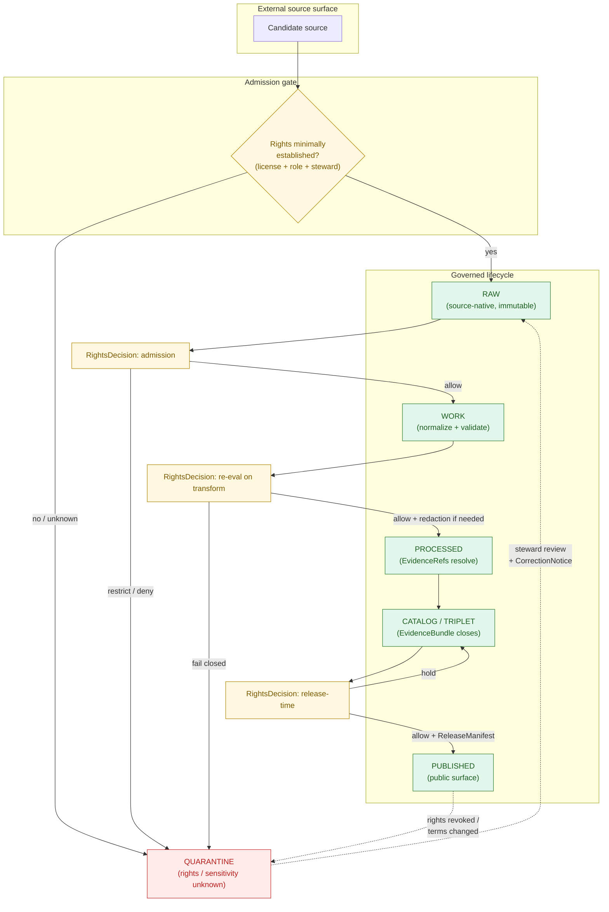
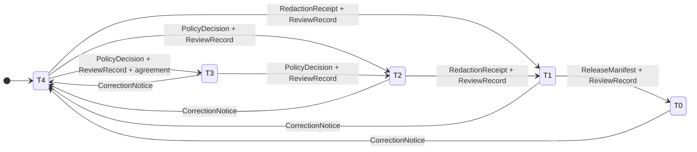
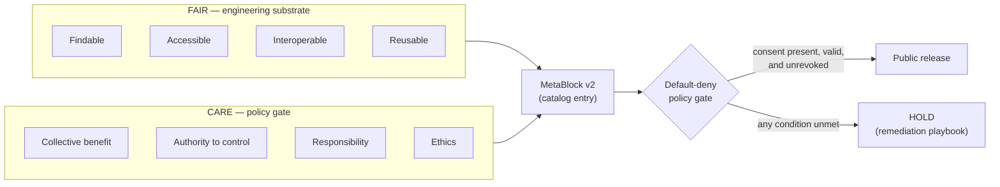

<!-- [KFM_META_BLOCK_V2]
doc_id: kfm://doc/sources-rights-guidance              # PROPOSED — assign a stable UUID at review time
title: Rights Guidance for KFM Sources
type: standard
version: v0.1
status: draft
owners: Docs steward + Source-rights steward            # PROPOSED — confirm CODEOWNERS at review time
created: 2026-05-13
updated: 2026-05-13
policy_label: public
related:
  - docs/sources/README.md                              # PROPOSED — sibling, not yet verified in repo
  - docs/sources/SOURCE_DESCRIPTOR_STANDARD.md          # PROPOSED — planned per KFM Whole-UI Governed-AI Expansion Report
  - docs/doctrine/truth-posture.md                      # PROPOSED — per directory-rules.md §6.1
  - docs/doctrine/trust-membrane.md                     # PROPOSED — per directory-rules.md §6.1
  - docs/doctrine/lifecycle-law.md                      # PROPOSED — per directory-rules.md §6.1
  - docs/doctrine/directory-rules.md                    # CONFIRMED — present in workspace
  - docs/standards/                                     # PROPOSED — FAIR / CARE / DCAT / PROV / STAC references live here
  - policy/sensitivity/                                 # PROPOSED — sensitivity policy lane per directory-rules.md §2.3
  - control_plane/source_authority_register.yaml       # PROPOSED — per directory-rules.md §6.2
tags: [kfm, sources, rights, governance, doctrine, fair-care, sensitivity]
notes:
  - Status remains draft until the open ADR for the T0–T4 sensitivity-tier scheme (ADR-S-05) is accepted.
  - Specific field names below are PROPOSED unless a mounted-repo SourceDescriptor schema confirms them.
[/KFM_META_BLOCK_V2] -->

# Rights Guidance for KFM Sources

> **Rules for handling source rights — licensing, attribution, redistribution, privacy, sovereignty, and cultural sensitivity — as they travel with a source through the KFM lifecycle from admission to public release.**

<!-- Badges: placeholders; final shield endpoints to be set by the docs steward. -->


| Field | Value |
|---|---|
| **Status** | `draft` |
| **Authority of this doc** | PROPOSED doctrine for `docs/sources/`; CONFIRMED reflection of KFM core invariants and Directory Rules §2.3 |
| **Authority of any path quoted here** | PROPOSED until verified against mounted-repo evidence |
| **Owners** | Docs steward + Source-rights steward (placeholders; confirm in CODEOWNERS) |
| **Last reviewed** | TODO |
| **Schema-home convention** | `schemas/contracts/v1/<…>` per ADR-0001 (Directory Rules §7.4) — PROPOSED until ADR file inspected |
| **Lifecycle invariant** | RAW → WORK / QUARANTINE → PROCESSED → CATALOG / TRIPLET → PUBLISHED (CONFIRMED doctrine) |

> [!IMPORTANT]
> This document is **doctrine** for how rights metadata is captured, evaluated, and enforced. It does **not** decide individual cases — that is the job of `RightsDecision`, `PolicyDecision`, and steward review. The current session has no mounted repo, so every claim about a specific path, schema field, validator name, or workflow file is **PROPOSED** until verified against the repo.

---

## Contents

- [1. Purpose & scope](#1-purpose--scope)
- [2. Doctrine: the three load-bearing rules](#2-doctrine-the-three-load-bearing-rules)
- [3. Rights flow through the lifecycle membrane](#3-rights-flow-through-the-lifecycle-membrane)
- [4. The rights metadata model](#4-the-rights-metadata-model)
- [5. Lifecycle gates and their rights obligations](#5-lifecycle-gates-and-their-rights-obligations)
- [6. Sensitivity and rights tier matrix (T0–T4)](#6-sensitivity-and-rights-tier-matrix-t0t4)
- [7. FAIR + CARE pairing](#7-fair--care-pairing)
- [8. License posture and SPDX handling](#8-license-posture-and-spdx-handling)
- [9. Public-release rights checklist](#9-public-release-rights-checklist)
- [10. Anti-patterns and how they fail](#10-anti-patterns-and-how-they-fail)
- [11. Open questions and verification backlog](#11-open-questions-and-verification-backlog)
- [12. Related docs](#12-related-docs)
- [Appendix A. Worked examples](#appendix-a-worked-examples)
- [Appendix B. Glossary of rights-relevant terms](#appendix-b-glossary-of-rights-relevant-terms)

---

## 1. Purpose & scope

KFM treats rights as a **first-class admission condition**, not a publication-time afterthought. The system must know — at the moment a source is admitted — who holds the rights, what those rights permit, what they require, and what they forbid. The same rights record must travel with every derivative the source produces, all the way to the public surface.

**CONFIRMED doctrine.** Directory Rules §2.3 places **source identity, rights, and sensitivity** outside Directory Rules' scope and inside `data/registry/` and `policy/sensitivity/`. This document is the human-readable doctrine that the registry and policy lanes implement.

**In scope:**

- The rights-relevant fields a `SourceDescriptor` should carry.
- The rights-relevant decisions made at each lifecycle gate.
- The interaction between licensing, attribution, sensitivity tiers, and the FAIR + CARE pairing.
- The default postures when rights are unclear, ambiguous, missing, or contested.

**Out of scope:**

- Individual source-by-source rights determinations — those are `RightsDecision` artifacts.
- Schema shape — owned by `schemas/contracts/v1/<…>` (PROPOSED per ADR-0001).
- Policy enforcement code — owned by `policy/` (and its OPA bundle, if used).
- Object-family meaning beyond what is needed here — owned by `contracts/`.

> [!NOTE]
> This document is **interpretive doctrine**. Where it appears to conflict with `docs/doctrine/`, the doctrine layer governs and the conflict should be filed against `docs/registers/DRIFT_REGISTER.md` (PROPOSED path).

[Back to top](#contents)

---

## 2. Doctrine: the three load-bearing rules

Three CONFIRMED doctrines from `kfm_encyclopedia.pdf` and the Domains Culmination Atlas govern every rights decision in KFM.

### 2.1 Unknown rights fail closed

> [!CAUTION]
> **A source whose rights cannot be established at admission is not admitted to RAW.** It is logged as a candidate awaiting steward review. A source whose rights become unclear after admission is moved to `QUARANTINE`, not allowed to remain in WORK.

This is the **default-deny posture** for source rights. It is the rights-side mirror of the cite-or-abstain rule that governs claims: when the supporting rights record cannot be resolved, the system declines to act rather than guessing.

### 2.2 Cite-or-abstain is the truth posture; rights is the admission posture

Every public claim must resolve an `EvidenceBundle`. Every source that contributes to that bundle must resolve a `RightsDecision`. Two parallel chains — evidence and rights — close before the trust membrane releases anything to a public surface.

### 2.3 FAIR by design, CARE in practice

CONFIRMED doctrine from Pass 10 Category C15: **FAIR** (Findable, Accessible, Interoperable, Reusable) shapes the engineering substrate; **CARE** (Collective Benefit, Authority to Control, Responsibility, Ethics) shapes the policy gate. FAIR alone produces technically open data that may violate the rights of the communities it describes. CARE alone lacks the operational specificity to be enforced in software. KFM treats them as paired — see §7.

[Back to top](#contents)

---

## 3. Rights flow through the lifecycle membrane

The lifecycle invariant `RAW → WORK / QUARANTINE → PROCESSED → CATALOG / TRIPLET → PUBLISHED` is CONFIRMED doctrine. The diagram below shows where rights are evaluated, what artifact records each decision, and where the default-deny posture sends rejected material.



**Reading note.** Rights are not evaluated once. They are evaluated at admission, re-evaluated on every transform that could change their applicability (aggregation, redaction, derivation), and evaluated again at release. A rights change in the upstream source — for example, a license downgrade or a sovereignty reassertion — always permits a downgrade back to `QUARANTINE`, accompanied by a `CorrectionNotice`.

[Back to top](#contents)

---

## 4. The rights metadata model

The fields below are **PROPOSED** and illustrative. The canonical schema home is `schemas/contracts/v1/source/source-descriptor.json` per Directory Rules §7.4 and ADR-0001, unless an accepted ADR relocates it. Field presence, types, and required/optional flags must be verified against the mounted schema before being treated as canonical.

### 4.1 Rights fields on `SourceDescriptor`

| Field | Type / vocabulary | Required? | Notes | Label |
|---|---|---|---|---|
| `rights_spdx` | SPDX license identifier, or `NOASSERTION` | MUST | The SPDX expression that best represents the source's terms. `NOASSERTION` is **not** equivalent to "no rights" — it is a flag that triggers steward review. | PROPOSED |
| `rights_statement` | string (free-text rights summary, literal where the provider supplies one) | SHOULD | For tribal, cadastral, and other overlays the provider's exact rights text MUST be embedded literally, not paraphrased. | PROPOSED (CONFIRMED for tribal/cadastral per ML-064-079) |
| `rights_url` | URL to terms-of-use or license text | SHOULD | Stable URL; archived snapshot recommended. | PROPOSED |
| `attribution_required` | boolean | MUST | If `true`, every public derivative carrying this source must surface attribution per `attribution_text`. | PROPOSED |
| `attribution_text` | string | MUST when `attribution_required = true` | The exact text the provider asks to be displayed. | PROPOSED |
| `redistribution_allowed` | enum: `yes` \| `with-conditions` \| `no` \| `unknown` | MUST | Drives whether derivatives may leave the governed surface. `unknown` fails closed at release. | PROPOSED |
| `derivative_works_allowed` | enum: `yes` \| `with-conditions` \| `no` \| `unknown` | MUST | Drives whether the source may be normalized, aggregated, redacted, or joined. | PROPOSED |
| `commercial_use_allowed` | enum: `yes` \| `no` \| `unknown` | SHOULD | Distinct from redistribution; some sources permit redistribution but bar commercial use. | PROPOSED |
| `source_access_profile` | structured: `{metadata_only, registration_required, fee_required, redistribution_allowed, public_safety_exception_notes}` | SHOULD | Captures institutional or financial constraints distinct from license. | PROPOSED (per KFM Pass 18 idea card on SDI access terms) |
| `sensitivity_tier` | enum: `T0` \| `T1` \| `T2` \| `T3` \| `T4` | MUST | See §6. PROPOSED per the Atlas v1.1 tier scheme; canonicalization tracked by ADR-S-05. | PROPOSED |
| `sovereignty_label` | enum / vocabulary | MUST when applicable | Tribal, cultural, or jurisdictional sovereignty constraint that overrides license-only reasoning. Labels must stay synchronized across STAC/DCAT/PROV per ML-064-019. | PROPOSED |
| `care_applies` | boolean | MUST | When `true`, requires the MetaBlock v2 CARE fields (§7). | PROPOSED |
| `rights_review_record_ref` | `EvidenceRef` to a `ReviewRecord` | MUST when a tier upgrade or sovereignty exception applies | Pins the steward review that authorized non-default treatment. | PROPOSED |
| `rights_expiry` | ISO-8601 timestamp | SHOULD | When a license, embargo, or agreement terminates. Drives stale-state markers on derivatives. | PROPOSED |

> [!NOTE]
> The `rights_spdx` field is required even when the value is `NOASSERTION`. The doctrine is that the **absence** of a rights record is itself a record — it triggers steward review rather than silent admission. CONFIRMED via the KFM Pass 18 idea card "rights\_spdx or NOASSERTION" and the run-receipt validator that quarantines unknown SPDX values.

### 4.2 Related object families

The rights record on `SourceDescriptor` is paired with several governance objects. The table below cites the encyclopedia's Feature Index (CONFIRMED doctrine) and the proposed object families from the New-Ideas dossier.

| Object family | Role in rights enforcement | Status |
|---|---|---|
| `RightsDecision` | Encodes the rights determination for a source or a derivative; cited at every gate. | CONFIRMED doctrine (Appendix E, kfm\_encyclopedia) |
| `PolicyDecision` | Encodes the gate verdict: `ALLOW` / `RESTRICT` / `DENY` / `ABSTAIN` / `ERROR`. | CONFIRMED doctrine |
| `SourceAuthorityRegister` | Maintains approved / retired / quarantined sources and source-authority roles. | CONFIRMED doctrine |
| `ConsentReceipt`, `ConsentVC`, `RevocationStatusList` | Consent artifacts, holder-controlled presentations, and privacy-safe revocation lists for living-person and other consent-bearing data. | PROPOSED (per New-Ideas object-family expansion) |
| `RedactionReceipt`, `AggregationReceipt` | Record the transform that produced a public-safe derivative from sensitive material. | CONFIRMED doctrine |
| `ReleaseManifest` | The release decision; cites the rights decision in force at release time. | CONFIRMED doctrine |
| `CorrectionNotice`, `RollbackCard` | Carry rights-driven retraction back through the membrane. | CONFIRMED doctrine |
| `AIReceipt` | Required on every Focus-Mode AI answer; rights state travels with it. | CONFIRMED doctrine |

[Back to top](#contents)

---

## 5. Lifecycle gates and their rights obligations

The lifecycle gates below restate the universal pipeline gates from the Domains Culmination Atlas, with each gate's **rights-side obligations** made explicit. All gate names and the pre-conditions are CONFIRMED doctrine; the artifact lists are PROPOSED minimums.

| Gate | Rights pre-condition | Required artifacts (PROPOSED minimum) | Failure-closed outcome |
|---|---|---|---|
| **Admission** (→ RAW) | `SourceDescriptor.rights_spdx` set (a real SPDX value or `NOASSERTION`); `source_role` set; steward identified. | `SourceDescriptor`; `RightsDecision (admission)`; hash of payload or reference. | Source not admitted; logged as candidate awaiting steward. |
| **Normalization** (RAW → WORK / QUARANTINE) | Rights permit the planned transform (`derivative_works_allowed != no`); sensitivity tier identified; any required `ConsentReceipt` resolved. | `TransformReceipt`; `ValidationReport` (rights subset); `PolicyDecision`. | `QUARANTINE` with reason; never silently promotes. |
| **Validation** (WORK → PROCESSED) | Rights validators pass; sensitivity transforms applied where the tier requires them; `RedactionReceipt` / `AggregationReceipt` emitted when applicable. | `ValidationReport` pass; `RedactionReceipt` if sensitivity applies; `AggregationReceipt` if applies. | Stay in WORK; structured FAIL outcome with rights-specific reason code. |
| **Catalog closure** (PROCESSED → CATALOG / TRIPLET) | Every `EvidenceRef` resolves; rights metadata travels into the catalog entry; sovereignty labels match across STAC / DCAT / PROV. | `CatalogMatrix` entry; `EvidenceBundle`; graph / triplet projections if applicable. | `HOLD` at PROCESSED; no public edge created. |
| **Release** (CATALOG / TRIPLET → PUBLISHED) | `rights_spdx` is on the policy allowlist for public surfaces; `attribution_required` honored in the carrier; `sensitivity_tier` permits the intended public audience; review state present where required; release authority distinct from author when materiality applies. | `ReleaseManifest` citing the `RightsDecision`; rollback target; correction path; `ReviewRecord` if required. | `HOLD` at CATALOG; no public surface change. |
| **Correction** (PUBLISHED → PUBLISHED′) | Rights change detected, new evidence, or steward revocation; downstream derivatives identified. | `CorrectionNotice`; `RollbackCard` where rollback is necessary; updated `EvidenceBundle`. | Tier downgrade always permitted; affected derivatives invalidated. |

> [!IMPORTANT]
> **Promotion is a governed state transition, not a file move.** A rights check that passes at admission does **not** carry forward past a transform that changes the rights-relevant character of the data (e.g., a join that adds identifying context to a previously aggregate record). Each gate re-evaluates rights against the **resulting** artifact, not just the inbound source.

[Back to top](#contents)

---

## 6. Sensitivity and rights tier matrix (T0–T4)

The tier scheme below is **PROPOSED** per the Atlas v1.1 supplement §24.5 and is tracked for canonicalization by **ADR-S-05** (sensitivity tier scheme). It is included here because rights guidance is incoherent without a tier vocabulary, and because the underlying Deny-by-Default Register in `kfm_encyclopedia.pdf` §13 is CONFIRMED doctrine.

### 6.1 Tier scheme

| Tier | Name | Definition | Default audience |
|---|---|---|---|
| **T0** | Open | Public-safe with no transformations required. | Any public client via governed API. |
| **T1** | Generalized | Public-safe only after generalization, fuzzing, aggregation, or redaction; transform reviewed and recorded. | Any public client via governed API. |
| **T2** | Reviewer | Released only to authenticated reviewers or domain stewards; policy-bounded; correction path active. | Stewards, reviewers, named research collaborators. |
| **T3** | Restricted | Released only under a named agreement (rights, sovereignty, or consent) and recorded. | Named authorized parties only. |
| **T4** | Denied | Not released to any audience; the existence of a record may be released only as steward review permits. | — |

### 6.2 Allowed tier transitions



**Reading note (CONFIRMED doctrine, Atlas v1.1).** A tier **upgrade** (toward more public) always needs both a transform receipt and a review record. A tier **downgrade** (toward less public) never needs both — a `CorrectionNotice` alone is sufficient to remove or restrict.

### 6.3 Per-class default tiers (Deny-by-Default Register)

CONFIRMED doctrine from `kfm_encyclopedia.pdf` §13. The table is illustrative, not exhaustive; consult the source for the full register.

<details>
<summary><strong>Show the Deny-by-Default Register summary</strong></summary>

| Class | Examples | Default outcome | Required controls |
|---|---|---|---|
| Living persons | Personal data, residences, identity assertions | DENY public exact/identifying output unless legal basis, consent/review, and release state are proven | Privacy review; redaction; aggregation; staged access |
| DNA / genomics | DNA matches, genomic inference, living-person relatives | DENY by default; restricted steward/research only with policy approval | Separate restricted store; no public AI inference |
| Rare species | Exact taxa occurrence / nest / den / roost / spawning sites | DENY public exact location; generalized public products only | Geoprivacy transform receipt; steward review |
| Archaeology | Site coordinates, burial / sacred / culturally sensitive materials | DENY exact public location by default | Cultural / steward review; suppression / generalization |
| Sacred / culturally sensitive places | Oral history, cultural routes, sacred sites | DENY until steward review and access class approve | Consultation record; sensitivity transform |
| Critical infrastructure | Exact facilities, dependencies, condition observations | RESTRICT / DENY public precision | Public-safe aggregation; role-based access |
| Private landowner-sensitive data | Field boundaries, owner identity, operations | DENY exact / public if private or rights unclear | Aggregation; permissions; policy review |
| Exact sensitive locations | Any exact point that increases harm risk | DENY by default | Redaction / generalization; audit |
| Emergency warning misuse | Operational warnings, forecasts, hazard instructions | DENY life-safety replacement; contextual-only with official redirection | "Not-for-life-safety" disclaimer; issue/expiry freshness |
| **Source-rights-limited records** | Licensed, restricted, no-redistribution, uncertain terms | DENY public release until terms resolved | Rights register; attribution; no public derivative if barred |

</details>

[Back to top](#contents)

---

## 7. FAIR + CARE pairing

CONFIRMED doctrine from Pass 10 Category C15. KFM treats FAIR and CARE as paired rather than competing.



### 7.1 MetaBlock v2 CARE fields

CONFIRMED doctrine: when an asset is CARE-applicable (Indigenous, marginalized-community, sensitive-cultural, or sovereignty-implicating data), MetaBlock v2 MUST carry:

- `steward_org` — the institutional steward of the asset.
- `authority_to_control` — the community or body whose authority governs the asset.
- `consent` — the consent grant under which the asset is held.
- `obligations` — the obligations attached to use of the asset.
- `benefit_commitments` — what benefit flows back to the relevant community from publication and reuse.

> [!TIP]
> Omitting CARE fields for a non-applicable asset is acceptable. Omitting them for an applicable asset is a violation that the policy gate refuses. The "CARE-applicable" determination is itself a curatorial decision — it cannot be fully automated, and reviewers should treat the boundary explicitly.

### 7.2 Default-deny on CARE-tagged assets

CONFIRMED doctrine from Pass 10 C15-03. Any asset whose MetaBlock v2 declares a non-empty `authority_to_control` field is gated by a policy rule that **defaults to deny** on publication, with an explicit allow path that requires the named authority's consent grant to be **present, valid, and unrevoked**. The rule runs at both the promotion gate (build-time) and the admission webhook (runtime).

[Back to top](#contents)

---

## 8. License posture and SPDX handling

CONFIRMED doctrine from the New-Ideas dossier (governance and run-receipt validators).

### 8.1 SPDX is the canonical license identifier

Every `SourceDescriptor` MUST carry a `rights_spdx` value. The value MUST be one of:

1. A valid SPDX license identifier (e.g., `CC-BY-4.0`, `CC0-1.0`, `Apache-2.0`, `ODbL-1.0`).
2. A valid SPDX expression for compound licenses.
3. The literal string `NOASSERTION`, which marks the rights status as **explicitly unknown and pending steward review**.

### 8.2 Quarantine on unknown SPDX

The run-receipt validator quarantines any artifact whose license posture is "unknown SPDX" — i.e., an SPDX value that cannot be resolved against the official SPDX license list. This is **distinct** from `NOASSERTION`: `NOASSERTION` is a known marker; "unknown SPDX" is a garbled or invented value.

| Condition | Result |
|---|---|
| Valid SPDX on the policy allowlist | `ALLOW` |
| Valid SPDX not on the allowlist | `RESTRICT` — release decision required |
| `NOASSERTION` | `QUARANTINE` — steward review required |
| Unrecognized / garbled value | `QUARANTINE` — validator failure |
| Missing field | `QUARANTINE` — schema validation failure |

### 8.3 Allowlists differ by surface

> [!WARNING]
> **The repo's CI workflow shows an allowlist of `Apache-2.0`, `MIT`, `BSD-3-Clause` for a license/provenance gate.** This is PROPOSED to apply to **code** dependencies and is not a content-data allowlist. Content sources commonly carry `CC-BY-4.0`, `CC0-1.0`, `ODbL-1.0`, and U.S. federal public-domain markers (`PDDL-1.0` or per-agency public-domain assertions). The content-data allowlist for KFM has not been resolved in this session and remains a **NEEDS VERIFICATION** item.

### 8.4 Compound and inherited licenses

When a derivative combines multiple sources, the derivative's effective rights posture is the **strictest** of the contributing sources, not the most permissive. The `EvidenceBundle` lists every contributing source; the derivative's `rights_spdx` MUST be a compound SPDX expression or marked `NOASSERTION` pending steward determination.

[Back to top](#contents)

---

## 9. Public-release rights checklist

A `ReleaseManifest` MUST cite a `RightsDecision` that is satisfied on every item below.

- [ ] `rights_spdx` is set, is a valid SPDX value (or `NOASSERTION` with an active review), and is on the policy allowlist for the target surface.
- [ ] `attribution_required` is honored: if `true`, the carrier (layer manifest, popup, export, story node) surfaces `attribution_text` literally and visibly.
- [ ] `redistribution_allowed` is `yes` or `with-conditions` and the conditions are met by the publishing surface.
- [ ] `derivative_works_allowed` permits every transform recorded in the lineage (aggregation, redaction, join, generalization).
- [ ] `sensitivity_tier` is compatible with the target audience: `T0` for public surfaces, `T1` only after a `RedactionReceipt` or `AggregationReceipt`, `T2`+ never on public surfaces.
- [ ] `sovereignty_label` (where present) is synchronized across STAC, DCAT, and PROV records for this asset.
- [ ] `care_applies = true` implies the MetaBlock v2 CARE fields are populated and a valid, unrevoked consent grant is on file.
- [ ] `rights_expiry` is in the future, or is unset.
- [ ] A `ReviewRecord` is attached for any tier upgrade beyond default.
- [ ] The release authority is distinct from the original author where materiality applies.
- [ ] A rollback target exists; a `CorrectionNotice` template is wired to the surface.

> [!NOTE]
> The checklist is **enforcement-bearing doctrine**, not a courtesy. A `ReleaseManifest` that cannot cite a `RightsDecision` satisfying every applicable item must be held at CATALOG, not published with a caveat.

[Back to top](#contents)

---

## 10. Anti-patterns and how they fail

| Anti-pattern | Why it fails | Mitigation |
|---|---|---|
| Publishing on the basis of "open data" framing without an SPDX value | "Open" is a marketing claim, not a license. The SPDX identifier is what the policy gate reads. | Require `rights_spdx` at admission; `QUARANTINE` on missing or garbled values. |
| Treating `NOASSERTION` as equivalent to public domain | `NOASSERTION` is an explicit unknown that requires steward review. Public domain has its own SPDX expressions. | Reserve `NOASSERTION` for the unknown case; use the correct SPDX identifier when public-domain status is established. |
| Carrying the source's rights forward unchanged through an aggregating join | Aggregation can produce a derivative with stricter rights obligations than any single contributor (e.g., joining two CC-BY sources whose attribution texts must both appear). | Re-evaluate `RightsDecision` at every transform; emit a new `rights_spdx` (possibly compound). |
| Paraphrasing a provider's rights statement to match a chosen tone | For tribal, cadastral, and certain regulatory sources, the provider's rights text must be embedded **literally** (ML-064-079). | Store `rights_statement` verbatim; never substitute generated language. |
| Relying on a style filter to hide exact sensitive geometry | The geometry still ships to the client. The filter is a renderer hint, not a policy gate. | Apply redaction / generalization **before** the tile is generated; verify with a no-raw-anomaly test. |
| Treating a layer toggle as a release approval | Visibility in a UI is not a release decision. Release is a `ReleaseManifest`. | Require a release manifest and a `PolicyDecision` for any layer that can appear on a public surface. |
| Hiding rights uncertainty behind a "draft" label on a public surface | A "draft" tag on a public surface still leaks the asset. Draft state belongs at CATALOG, not PUBLISHED. | Keep drafts inside the membrane; expose only published, rights-cleared assets to public clients. |
| Letting AI text describe an asset whose rights are unclear | AI fluency can substitute for evidence. The `AIReceipt` rule requires `ABSTAIN` when rights state is unclear. | Wire the rights state into the Focus-Mode `ABSTAIN` conditions; never let a generated description outrun the rights record. |

[Back to top](#contents)

---

## 11. Open questions and verification backlog

Items below are **NEEDS VERIFICATION** until a mounted repo, an accepted ADR, or a steward decision resolves them. They are intentionally surfaced rather than smoothed over.

- **NEEDS VERIFICATION.** Mounted-repo presence of `SourceDescriptor` schema and the exact field names compared to §4.1.
- **NEEDS VERIFICATION.** Acceptance status of ADR-S-05 (sensitivity tier scheme T0–T4). Until the ADR is accepted, the tier scheme is PROPOSED.
- **NEEDS VERIFICATION.** Acceptance status of ADR-S-04 (source-role vocabulary v1) which interacts with rights determination at admission.
- **OPEN.** The canonical content-data SPDX allowlist for public KFM surfaces. The CI workflow's code-license allowlist (`Apache-2.0`, `MIT`, `BSD-3-Clause`) is not the content allowlist.
- **OPEN.** How rights changes detected on third-party sources propagate stale-state markers downstream — the Atlas Risk Register flags rights-change detection across third-party sources as not yet automated.
- **OPEN.** Whether `rights_review_record_ref` lives on the descriptor itself or on a separate `RightsDecision` artifact pinned to a descriptor version.
- **OPEN.** The exact remediation playbook for CARE-default-deny — how denied assets are surfaced to the steward and the authority through a feedback channel that does not itself violate CARE (Pass 10 C15-03 open question).
- **OPEN.** Treatment of educational or textbook-derived examples that are conceptual rather than operational sources (KFM Pass 18 idea card open question).

[Back to top](#contents)

---

## 12. Related docs

The links below are **PROPOSED** until the target files are verified in the mounted repo. Where a target does not yet exist, it is listed as `TODO`.

- [`docs/sources/README.md`](./README.md) — `TODO` — source-descriptor standards directory overview.
- [`docs/sources/SOURCE_DESCRIPTOR_STANDARD.md`](./SOURCE_DESCRIPTOR_STANDARD.md) — `TODO` (planned per Whole-UI Governed-AI Expansion Report) — standard source-descriptor fields including rights and sensitivity.
- [`docs/doctrine/truth-posture.md`](../doctrine/truth-posture.md) — `TODO` — cite-or-abstain rule; rights guidance mirrors it for admission.
- [`docs/doctrine/trust-membrane.md`](../doctrine/trust-membrane.md) — `TODO` — the public/internal boundary that this doc's rules defend.
- [`docs/doctrine/lifecycle-law.md`](../doctrine/lifecycle-law.md) — `TODO` — RAW → PUBLISHED invariant referenced throughout.
- [`docs/doctrine/directory-rules.md`](../doctrine/directory-rules.md) — present in this workspace; placement authority for `docs/sources/`.
- [`docs/standards/`](../standards/) — `TODO` — STAC, DCAT, PROV, FAIR, CARE external standards KFM conforms to.
- [`policy/sensitivity/`](../../policy/sensitivity/) — `TODO` — sensitivity policy lane referenced by Directory Rules §2.3.
- [`control_plane/source_authority_register.yaml`](../../control_plane/source_authority_register.yaml) — `TODO` — machine-readable register of approved / retired / quarantined sources.

[Back to top](#contents)

---

## Appendix A. Worked examples

The examples below are **illustrative**. They are not drawn from a specific live source and should not be cited as case decisions.

<details>
<summary><strong>A.1 A CC-BY-4.0 hydrology layer from a state agency</strong></summary>

**Inputs (PROPOSED descriptor sketch):**

```yaml
source_id: src.example.state-hydro-flow.v1
rights_spdx: CC-BY-4.0
rights_statement: "Data provided by Example State Hydrology Office. Cite as: ..."
attribution_required: true
attribution_text: "Example State Hydrology Office, 2026"
redistribution_allowed: with-conditions
derivative_works_allowed: yes
commercial_use_allowed: yes
sensitivity_tier: T0
sovereignty_label: none
care_applies: false
```

**Path:** Admission → RAW → WORK (schema + geometry normalize) → PROCESSED → CATALOG → PUBLISHED. Every public carrier (layer manifest, popup, export, story node) surfaces `attribution_text` literally.

**Failure modes worth catching in fixtures:**

- A renderer that omits attribution from a tile preview.
- A join with a non-commercial source that should downgrade `commercial_use_allowed` on the derivative.
- A rights-URL move (404) that the freshness check should flag as stale rather than silent.

</details>

<details>
<summary><strong>A.2 A rare-species occurrence record from a citizen-science portal</strong></summary>

**Inputs (PROPOSED descriptor sketch):**

```yaml
source_id: src.example.citsci-occurrence.v3
rights_spdx: CC-BY-NC-4.0
rights_statement: "Occurrence records contributed by community observers. Non-commercial use only. Coordinates may be obscured by the provider for sensitive taxa."
attribution_required: true
attribution_text: "Example Citizen Science Network and contributors, 2026"
redistribution_allowed: with-conditions
derivative_works_allowed: with-conditions
commercial_use_allowed: no
sensitivity_tier: T4   # default for exact occurrence of rare taxa
sovereignty_label: none
care_applies: false
rights_review_record_ref: kfm://review/rare-species-occurrence-v3
```

**Path:** Admission → RAW (T4) → WORK → `RedactionReceipt` generalizes exact coordinates to a 10 km hex cell → derivative emerges at T1 → PROCESSED → CATALOG → PUBLISHED as a **generalized** layer only. The exact-coordinate variant remains at T4 and is **never** published.

**Failure modes worth catching in fixtures:**

- A join that re-derives the exact coordinate from generalized public data plus a context layer.
- A popup that surfaces the contributor's exact display name when the provider's terms forbid it.
- A "raw download" link on the public surface that bypasses the redaction.

</details>

[Back to top](#contents)

---

## Appendix B. Glossary of rights-relevant terms

| Term | Short definition (for rights guidance) |
|---|---|
| **`SourceDescriptor`** | The admission record for a source. Carries identity, role, rights, sensitivity, cadence, steward, freshness, and public-release class. |
| **`RightsDecision`** | The rights determination for a source or derivative. Cited at every lifecycle gate. |
| **`PolicyDecision`** | The gate verdict: `ALLOW` / `RESTRICT` / `DENY` / `ABSTAIN` / `ERROR`. |
| **`RedactionReceipt` / `AggregationReceipt`** | Receipts that record the transform from a sensitive / restricted form to a public-safe form. |
| **`ReleaseManifest`** | The release decision artifact. Cites the `RightsDecision` and the rollback target. |
| **`CorrectionNotice`** | Public notice of a corrected, redacted, or withdrawn claim. Always permitted as a tier downgrade. |
| **`RollbackCard`** | Decision artifact for rolling back a release; lives under `release/rollback_cards/` per Directory Rules glossary. |
| **`AIReceipt`** | Required on every Focus-Mode AI answer. Carries the rights state of the cited sources. |
| **SPDX** | The Software Package Data Exchange license-identifier standard. KFM uses SPDX values (or `NOASSERTION`) in `rights_spdx`. |
| **`NOASSERTION`** | A literal SPDX marker meaning "the rights status is explicitly unknown." Triggers steward review; not equivalent to public domain. |
| **FAIR** | Findable, Accessible, Interoperable, Reusable. Engineering-substrate principles. |
| **CARE** | Collective benefit, Authority to control, Responsibility, Ethics. Policy-gate principles from the Global Indigenous Data Alliance. |
| **Sovereignty label** | A constraint that overrides license-only reasoning — typically tribal, cultural, or jurisdictional. Must stay synchronized across catalog standards. |
| **Trust membrane** | The boundary that prevents raw / unreviewed / model-generated / internal state from becoming public truth. Operational form: `apps/governed-api/`. |

[Back to top](#contents)

---

**Related docs:** [§12](#12-related-docs) · [Directory Rules](../doctrine/directory-rules.md) · [`docs/sources/SOURCE_DESCRIPTOR_STANDARD.md`](./SOURCE_DESCRIPTOR_STANDARD.md) (TODO)

**Last updated:** 2026-05-13 · **Status:** draft · [Back to top](#contents)
