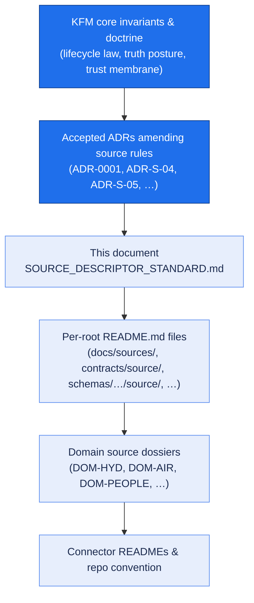
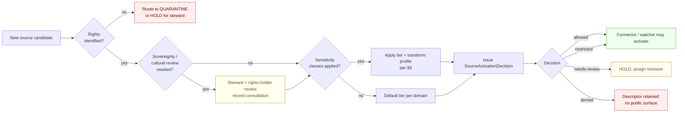
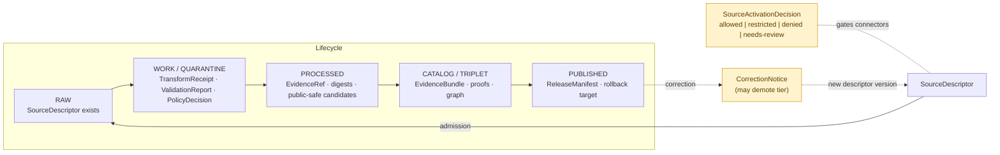

<!-- [KFM_META_BLOCK_V2]
doc_id: kfm://doc/source-descriptor-standard
title: Source Descriptor Standard
type: standard
version: v1
status: draft
owners: TBD — Docs steward + Source/Catalog subsystem owner
created: 2026-05-13
updated: 2026-05-13
policy_label: public
related:
  - docs/doctrine/directory-rules.md
  - docs/doctrine/authority-ladder.md
  - docs/doctrine/truth-posture.md
  - docs/doctrine/lifecycle-law.md
  - docs/doctrine/trust-membrane.md
  - docs/adr/ADR-0001-schema-home.md
  - docs/sources/README.md
  - contracts/source/source_descriptor.md
  - schemas/contracts/v1/source/source_descriptor.schema.json
  - control_plane/source_authority_register.yaml
  - policy/rights/
  - policy/sensitivity/
tags: [kfm, sources, doctrine, schema, governance, intake]
notes:
  - PROPOSED schema home and field surface per Directory Rules §7.4, ADR-0001, and Atlas v1.1 §24.1.3.
  - Mounted-repo evidence not available in this session; all path and implementation claims labeled PROPOSED / NEEDS VERIFICATION.
[/KFM_META_BLOCK_V2] -->

<a id="top"></a>

# Source Descriptor Standard

> The shape, vocabulary, and intake posture for every source admitted to the Kansas Frontier Matrix — so that role, rights, sensitivity, cadence, and citation are visible **before** a single byte shapes a public claim.

<p align="center">
  
  
  
  
  
  
  
</p>

| Status  | Owners | Last reviewed |
|---|---|---|
| `draft` | TBD — Docs steward + Source/Catalog subsystem owner | 2026-05-13 |

> [!IMPORTANT]
> **A source's role, rights, and sensitivity are fixed at admission, not at publication.** Promotion never upgrades a `modeled` reading into an `observed` one, an `aggregate` into a per-place truth, or a `candidate` into a verified record. Each of those is a separate governed transition with its own evidence and review requirements.

---

## Quick links

- [1. Scope and purpose](#1-scope-and-purpose)
- [2. Authority and conformance](#2-authority-and-conformance)
- [3. What a SourceDescriptor is](#3-what-a-sourcedescriptor-is)
- [4. Schema home and naming](#4-schema-home-and-naming)
- [5. Field standard](#5-field-standard)
- [6. Source-role vocabulary](#6-sourcerole-vocabulary)
- [7. Rights and terms intake](#7-rights-and-terms-intake)
- [8. Sensitivity tier mapping](#8-sensitivity-tier-mapping)
- [9. Temporal model](#9-temporal-model)
- [10. Citation guidance](#10-citation-guidance)
- [11. Source admission flow](#11-source-admission-flow)
- [12. Anti-collapse rule](#12-anticollapse-rule)
- [13. Validation and tests](#13-validation-and-tests)
- [14. Common pitfalls](#14-common-pitfalls)
- [15. Related ADRs and open questions](#15-related-adrs-and-open-questions)
- [16. Related docs](#16-related-docs)
- [Appendix A — Illustrative descriptor payload](#appendix-a--illustrative-descriptor-payload)
- [Appendix B — Verification backlog](#appendix-b--verification-backlog)

---

## 1. Scope and purpose

The **Source Descriptor Standard** governs the machine-readable identity record attached to every source admitted to KFM. It defines:

- the **fields** a SourceDescriptor must carry,
- the **vocabulary** for source role, rights, and sensitivity,
- the **intake posture** that decides whether a source is allowed, restricted, quarantined, denied, or held for review,
- the **citation guidance** downstream surfaces must follow.

It is **doctrine for placement and meaning**, not implementation. Specific schema paths, validator names, and policy bundles below are labeled PROPOSED or NEEDS VERIFICATION until mounted-repo evidence confirms them.

> [!NOTE]
> **CONFIRMED doctrine:** the KFM source registry is an *admission and authority-control surface*, not a bibliography. It exists to admit, restrict, quarantine, or deny source material **before** that material shapes a public claim.

---

## 2. Authority and conformance

### 2.1 Authority order

This standard sits **below** the operating invariants and **above** per-domain source dossiers and connector READMEs. When sources disagree, resolve in this order (mirrors Directory Rules §2.1):



### 2.2 Conformance language

This document uses RFC 2119–style keywords as Directory Rules does:

| Keyword | Meaning |
|---|---|
| **MUST / MUST NOT** | Non-negotiable. Validators and policy gates fail closed on violation. |
| **SHOULD / SHOULD NOT** | Strong default. Deviation requires a recorded justification (PR body, per-root README, or ADR). |
| **MAY** | Permitted; pick once and stay consistent within the lane. |

### 2.3 Out of scope

- Object meaning beyond `SourceDescriptor` itself (lives in `contracts/source/`).
- Machine-shape JSON Schema text (lives in `schemas/contracts/v1/source/`).
- Allow/deny/restrict/abstain decisions (lives in `policy/`).
- Lifecycle phase placement (governed by Directory Rules §4).

---

## 3. What a SourceDescriptor is

**CONFIRMED doctrine.** A `SourceDescriptor` is the structured, persisted record that fixes the identity, role, rights, sensitivity, cadence, access posture, and citation guidance of a single source **at the moment of admission**. It anchors every downstream receipt — `RawCaptureReceipt`, `TransformReceipt`, `RedactionReceipt`, `AggregationReceipt`, `ValidationReport`, `RunReceipt`, `ReleaseManifest`, `CorrectionNotice` — and it is the first object the source-registry check resolves before a connector or watcher activates.

> [!TIP]
> A SourceDescriptor is **not** a citation, a manifest, or a license file. Those are downstream artifacts. The descriptor is the *governance handle* the system holds against the source for as long as the source is admitted.

### 3.1 Invariants the descriptor preserves

| Invariant | Why it matters | Citation |
|---|---|---|
| **Role is fixed at admission.** Promotion never upgrades a role; corrections produce a new descriptor + `CorrectionNotice`. | Prevents collapsing modeled → observed, aggregate → per-place, candidate → verified. | Atlas v1.1 §24.1 (Source-Role Anti-Collapse Register) |
| **Unknown rights fail closed.** No public derivative may be released against a descriptor whose rights, terms, or sensitivity are unresolved. | Source-rights-limited records default to DENY. | Encyclopedia §13 (Deny-by-Default Register); Appendix E (Feature Index) |
| **No PUBLISHED edge from candidate.** A candidate descriptor MUST NOT have a public surface; it lives in WORK/QUARANTINE until promotion. | Trust membrane forbids exposing unvalidated records. | Directory Rules §3; Encyclopedia §13 |
| **Source-role cannot be inferred by AI.** Role is set by an admission decision under steward review, never by generation. | Governed-AI rule; AIReceipt cannot mint authority. | Unified Manual §3.6 (Source registry architecture) |
| **The descriptor is a first-class auditable object.** Its identity, content, and successive versions are inspectable. | Source-rights changes, supersessions, and corrections must be traceable. | Atlas v1.1 §24.10 (Risk Register, Source integrity rows) |

[Back to top ↑](#top)

---

## 4. Schema home and naming

> [!IMPORTANT]
> All paths in this section are **PROPOSED** under Directory Rules §7.4 and ADR-0001 until verified against mounted-repo evidence (see [Appendix B](#appendix-b--verification-backlog), item VB-SD-01).

### 4.1 Canonical homes (PROPOSED)

| Concern | Proposed home | Authority |
|---|---|---|
| Object **meaning** (Markdown contract) | `contracts/source/source_descriptor.md` | Directory Rules §6.3 |
| Machine **shape** (JSON Schema) | `schemas/contracts/v1/source/source_descriptor.schema.json` | Directory Rules §7.4; ADR-0001; Atlas v1.1 §24.1.3 |
| **Admissibility** policy (Rego/OPA bundles) | `policy/rights/`, `policy/sensitivity/`, `policy/release/` | Directory Rules §6.5 |
| **Validator** (long-lived, trust-bearing) | `tools/validators/source_descriptor/` | Directory Rules §7.5 |
| **Fixtures** (valid / invalid samples) | `tests/fixtures/source/` or `fixtures/source/` (pick one per local convention) | Directory Rules §13 (fixture-sprawl rule) |
| **Activation register** (admission decisions) | `control_plane/source_authority_register.yaml` | Directory Rules §6.2 |
| **Standard text** (this document) | `docs/sources/SOURCE_DESCRIPTOR_STANDARD.md` | Directory Rules §6.1; Whole-UI + Governed AI Expansion Report App. A/B |

### 4.2 Naming and versioning

- The schema file SHOULD use `source_descriptor.schema.json` (snake-case, matching neighboring contracts at `schemas/contracts/v1/<area>/<object>.schema.json`).
- A breaking change to descriptor identity or required fields is a **rename of object identity** under Directory Rules §14.3 and MUST go through an ADR, schema version bump, fixture compatibility map, and `CorrectionNotice` for any released artifacts that referenced the prior identity.
- **MUST NOT** maintain divergent definitions in both `schemas/` and `contracts/`. Per Directory Rules §6.4, `contracts/` is meaning (Markdown); `schemas/` is shape (JSON Schema). If a mounted repo shows both with drift, file a drift register entry, not a fork.

[Back to top ↑](#top)

---

## 5. Field standard

The field surface below is the **PROPOSED minimum**. Domain dossiers may add fields under a `domain_extensions` block; they MUST NOT redefine the meaning of fields named here.

> [!NOTE]
> Field-by-field shape (types, regex, enum membership) lives in the JSON Schema, not here. This standard governs **which fields exist, what they mean, and when they are required**.

### 5.1 Core identity (required at admission)

| Field | Vocabulary / type | Required | Notes |
|---|---|---|---|
| `source_id` | stable string, deterministic where possible | **MUST** | Identity is fixed for the descriptor's life. Rename = ADR + §14.3 discipline. |
| `source_role` | enum (see §6) | **MUST** | Fixed at admission. Never edited in-place. |
| `display_name` | short human-readable name | **MUST** | Used in citation text. |
| `authority` | string — issuing body, model identity, or steward | **MUST** when `source_role ∈ {regulatory, modeled, aggregate}` | Disambiguates downstream cite text. |
| `domain_lane` | enum — KFM domain segment | **MUST** | Mirrors `docs/domains/<lane>/`. |
| `owner_steward` | role / team identifier | **MUST** | Whoever is accountable for terms, sensitivity, and cadence reviews. |

### 5.2 Role-conditional fields (PROPOSED per Atlas v1.1 §24.1.3)

| Field | Required when | Purpose |
|---|---|---|
| `role_authority` | `role ∈ {regulatory, modeled, aggregate}` | Names the authority of record so citation cannot drift. |
| `role_aggregation_unit` | `role = aggregate` | Pins geometry/time scope (e.g., `county`, `HUC`, `tract`, `year`, `decade`). Prevents matrix-cell drift on join. |
| `role_model_run_ref` | `role = modeled` | `EvidenceRef` → `ModelRunReceipt`; pins inputs, parameters, version. |
| `role_synthetic_basis` | `role = synthetic` | Structured `{ method, inputs, reality_boundary_note_ref }`. Records what is and is not real in the carrier. |
| `role_candidate_disposition` | `role = candidate` | enum `pending | merged | rejected | quarantined`. PUBLISHED edge forbidden until `merged`. |

> [!WARNING]
> `role_synthetic_basis` and `role_candidate_disposition` are not optional decoration. If they are absent for a synthetic or candidate source, the descriptor MUST fail closed at validation. A `synthetic` source without a `reality_boundary_note_ref` cannot be cited.

### 5.3 Rights and terms

| Field | Required | Notes |
|---|---|---|
| `rights.license_id` | **MUST** if any public derivative is contemplated | SPDX or named license; `unknown` is permitted but routes to RESTRICT/DENY by default. |
| `rights.license_text_ref` | **SHOULD** | URI or repo path to the verbatim terms. |
| `rights.attribution_required` | **MUST** | Boolean + attribution string template. |
| `rights.redistribution_class` | **MUST** | enum `open | attribution | share-alike | non-commercial | restricted | unknown`. |
| `rights.sovereignty_notice` | **MUST** when source originates from Tribal, Indigenous, or culturally governed material | Captures CARE-principles obligations and steward contact. |
| `rights.terms_review_state` | **MUST** | enum `unreviewed | reviewed | needs-recheck | stale`. |

### 5.4 Sensitivity

| Field | Required | Notes |
|---|---|---|
| `sensitivity.tier` | **MUST** | `T0 | T1 | T2 | T3 | T4` per [§8](#8-sensitivity-tier-mapping). Domain default applies if unspecified, but the descriptor MUST record the resolved tier. |
| `sensitivity.classes` | **MUST** when any deny-by-default class applies | Multi-select against the Deny-by-Default Register (living persons, DNA/genomics, rare species, archaeology, sacred sites, infrastructure, landowner-sensitive, exact sensitive locations). |
| `sensitivity.transform_profile_ref` | **MUST** when tier upgrade requires a transform | Names the redaction or generalization profile (e.g. `point_3km_jitter_v1`). |
| `sensitivity.steward_review_required` | **MUST** | Boolean. |

### 5.5 Cadence and freshness

| Field | Required | Notes |
|---|---|---|
| `cadence.expected_update_interval` | **MUST** | ISO 8601 duration or named cadence (e.g., `P1D`, `annual`, `event-driven`). |
| `cadence.staleness_threshold` | **MUST** | After this, derivatives carry a stale badge per Atlas v1.1 §24.10. |
| `cadence.last_seen_at` | **MUST** | Maintained by connector/watcher; drives stale-state markers. |
| `cadence.retrieval_method` | **MUST** | enum `api | feed | bulk_download | manual_upload | watcher | none`. |

### 5.6 Access / API posture

| Field | Required | Notes |
|---|---|---|
| `access.endpoint_class` | **MUST** | enum `public_open | public_keyed | partner | restricted | offline`. |
| `access.auth_model` | **MUST** when not `public_open` | enum `none | api_key | oauth | signed_request | named_party`. |
| `access.quota_or_rate_limit` | **SHOULD** | Recorded as a hint to the connector, not a contractual claim. |
| `access.deny_by_default` | **MUST** | Boolean; defaults to `true` whenever rights, sensitivity, or sovereignty are unresolved. |

### 5.7 Temporal model

See [§9](#9-temporal-model) for the full distinction. Required fields:

| Field | Required | Notes |
|---|---|---|
| `temporal.observed_scope` | **MUST** when material | What real-world period the source covers. |
| `temporal.source_time` | **MUST** | When the source itself was produced/published. |
| `temporal.retrieval_time` | **MUST** | When KFM fetched it. |
| `temporal.valid_time` | **SHOULD** | Real-world validity, when distinct from observed. |

### 5.8 Citation guidance

| Field | Required | Notes |
|---|---|---|
| `citation.template` | **MUST** | Templated citation string emitted by downstream surfaces. |
| `citation.role_qualifier` | **MUST** when `role ∈ {regulatory, modeled, aggregate, administrative, synthetic, candidate}` | Tagged words the UI must include — e.g., "regulatory determination," "modeled estimate," "county-year aggregate," "candidate record." |
| `citation.disclaimer_ref` | **MUST** when domain doctrine requires one (hazards "not-for-life-safety," synthetic "reality-boundary note," AI "AIReceipt") | URI or repo path to the verbatim disclaimer. |

### 5.9 Provenance and identity

| Field | Required | Notes |
|---|---|---|
| `ingest_hash` | **MUST** | Content hash of the admission payload. Separate from `spec_hash` and `run_hash`. |
| `prior_descriptor_ref` | **MUST** when superseding | Forward-linked from the prior `source_id` version. |
| `correction_lineage_ref` | **MUST** when this descriptor exists because of a correction | EvidenceRef → `CorrectionNotice`. |

[Back to top ↑](#top)

---

## 6. Source-role vocabulary

**CONFIRMED doctrine** (Atlas v1.1 §24.1.1). KFM treats `source_role` as a first-class identity attribute. The seven canonical classes are:

| Role | Definition | Typical example | Allowed downstream framing |
|---|---|---|---|
| `observed` | Direct reading, measurement, or first-hand evidentiary record tied to a place and time. | Stream-gauge stage reading; soil pedon description; air-quality monitor sample; ground archaeological observation. | May feed modeled or aggregate products; **never** relabeled `regulatory` or `administrative`. |
| `regulatory` | Authoritative determination by a regulatory or governing body with legal/administrative force. | NFHL flood-zone designation; non-attainment ruling; designated critical-habitat unit. | Cite as regulatory context; **never** labeled `observed` or `modeled`. |
| `modeled` | Derived product from inputs, assumptions, or fitted parameters. Uncertainty + input provenance preserved. | Hydrograph reconstruction; smoke-trajectory model; suitability raster; population-estimation surface. | Cite **with model identity, run receipt, and bounds**; never labeled an observation. |
| `aggregate` | Published summary, total, or average over a unit. Irreversible loss of individual-record fidelity. | USDA crop county totals; Census tract aggregates; decadal climate normal. | Cite **with aggregation receipt**; never treated as a per-place record. |
| `administrative` | Compiled record produced for administration, registration, or accounting purposes. Not an observation or regulation. | Land-office tract book; deed-index compilation; county incorporation record; transport-facility roster. | Cite as administrative context; never collapsed with observation or regulation. |
| `candidate` | Proposed record awaiting validation, evidence resolution, dedup, or steward review. Not yet authoritative. | Quarantined connector output; unresolved person assertion; duplicate-site candidate. | Cite **only** as candidate evidence in WORK/QUARANTINE; **never** in PUBLISHED without promotion. |
| `synthetic` | Content generated by simulation, reconstruction, AI, or interpolation with no underlying first-hand observation. | Synthetic terrain surface; reconstructed historical scene; AI-drafted summary of an EvidenceBundle. | Carries `Reality Boundary Note` and `RepresentationReceipt`; **never** queried as observed reality. |

> [!CAUTION]
> **The role of a source is set at admission and is preserved through every promotion.** Promotion does not upgrade an observation to a regulation, a model to an aggregate, or a candidate to a verified record. Those are separate governed transitions with their own evidence and review requirements (Atlas v1.1 §24.1.1).

[Back to top ↑](#top)

---

## 7. Rights and terms intake

**CONFIRMED doctrine.** Unknown rights fail closed. A source whose license, attribution, redistribution class, or sovereignty status is unresolved cannot back a public derivative.

### 7.1 Intake decisions



### 7.2 Deny-by-default register (CONFIRMED)

The classes below default to DENY for public release until rights, consent, sovereignty, and review state are explicitly resolved (Encyclopedia §13):

- Living-person personal data, residences, identity assertions.
- DNA matches and genomic inference.
- Rare-species exact occurrence / nest / den / roost / spawning sites.
- Archaeological site coordinates and burial / sacred / culturally sensitive materials.
- Sacred / culturally sensitive places (oral history, cultural routes).
- Critical-infrastructure exact facilities, dependencies, or condition observations.
- Private landowner-sensitive data (field boundaries, owner identity, operations).
- Any exact location that increases harm risk.
- Emergency / life-safety warning content (KFM is **never** an alert authority).
- Source-rights-limited records (licensed, restricted, no-redistribution, uncertain terms).

> [!CAUTION]
> **Source-role cannot be inferred from convenience** (Unified Manual §3.6). If rights or role cannot be established, the descriptor remains in `needs-review` or routes to `denied`. Quarantine is not a publishable staging area.

[Back to top ↑](#top)

---

## 8. Sensitivity tier mapping

**PROPOSED** per Atlas v1.1 §24.5; adoption is governed by **ADR-S-05** (see [§15](#15-related-adrs-and-open-questions)). Verification item VB-11-05 / VB-SD-04.

| Tier | Name | Definition | Default audience |
|---|---|---|---|
| **T0** | Open | Public-safe with no transformations required. | Any public client via governed API. |
| **T1** | Generalized | Public-safe only after generalization, fuzzing, aggregation, or redaction (transform reviewed and recorded). | Any public client via governed API. |
| **T2** | Reviewer | Released only to authenticated reviewers or domain stewards. | Stewards, reviewers, named research collaborators. |
| **T3** | Restricted | Released only under named agreement (rights, sovereignty, or consent). | Named authorized parties only. |
| **T4** | Denied | Not released; existence of a record may be revealed only as steward review permits. | — |

**Tier upgrades** (toward more public) MUST carry both a transform receipt (`RedactionReceipt` or `AggregationReceipt`) **and** a `ReviewRecord`. **Tier downgrades** (toward less public) need only a `CorrectionNotice` and `ReviewRecord`.

> [!NOTE]
> A descriptor MAY declare its **default tier**, but the resolved tier for any given release derives from the descriptor + the per-domain matrix + steward review. The descriptor SHOULD NOT be the only place tier is decided; policy bundles in `policy/sensitivity/` close the gate.

[Back to top ↑](#top)

---

## 9. Temporal model

**CONFIRMED doctrine.** A descriptor preserves **source time, observed time, valid time, retrieval time, release time, and correction time as distinct** where the distinction is material (Atlas v1.1 per-domain tables; Encyclopedia Appendix E).

| Time | What it answers |
|---|---|
| **source_time** | When the source itself was produced or published. |
| **observed_scope** | What real-world period the source covers. |
| **valid_time** | The real-world period during which the source's claim was true (may differ from observed). |
| **retrieval_time** | When KFM fetched the source. |
| **release_time** | When a derivative was promoted to PUBLISHED. |
| **correction_time** | When a `CorrectionNotice` was issued, if any. |

> [!TIP]
> If a domain only uses one or two of these, the descriptor still SHOULD carry the fields it omits as `null` rather than dropping them; absence of a key is informationally distinct from `null`.

[Back to top ↑](#top)

---

## 10. Citation guidance

A descriptor governs how the public surfaces **cite** the source. Citation text MUST carry the role qualifier (§5.8) so a reader cannot mistake a modeled estimate for an observation or an aggregate for a per-place truth.

| Role | Required citation qualifier |
|---|---|
| `observed` | none (default: source name + date + place) |
| `regulatory` | "regulatory determination," "designated zone," or domain-specific equivalent |
| `modeled` | "modeled estimate" + model identity + run identifier |
| `aggregate` | "aggregate over `<unit>`" + aggregation receipt reference |
| `administrative` | "administrative record" + agency |
| `candidate` | "candidate record — pending review" (only ever inside WORK/QUARANTINE surfaces) |
| `synthetic` | "synthetic / reconstructed" + Reality Boundary Note reference |

> [!IMPORTANT]
> Synthetic content presented as observed reality is a **DENY at publication** condition under Atlas v1.1 §24.1.2. The descriptor's citation guidance is the first line of defense; the AI surface (Focus Mode) `ABSTAIN`s when an AIReceipt cannot attest a citation qualifier exists.

[Back to top ↑](#top)

---

## 11. Source admission flow

**PROPOSED activation flow** per Unified Manual §3.6 and the Encyclopedia Feature Index. The descriptor binds at each lifecycle transition.



### 11.1 Promotion gates that consult the descriptor (CONFIRMED)

| Gate | Required descriptor fields | Failure-closed outcome |
|---|---|---|
| Admission ( — → RAW ) | `source_id`, `source_role`, `authority`, `rights.*`, `sensitivity.*`, `cadence.*`, `ingest_hash` | Source not admitted; logged as candidate awaiting steward. |
| Normalization ( RAW → WORK/QUARANTINE ) | role-conditional fields per §5.2 | Quarantine with reason; never silently promoted. |
| Validation ( WORK → PROCESSED ) | sensitivity transform requirements; rights review state | Stay in WORK; structured FAIL outcome. |
| Catalog closure ( PROCESSED → CATALOG/TRIPLET ) | `citation.*` resolves; provenance lineage closes | HOLD; no public edge. |
| Release ( CATALOG → PUBLISHED ) | `rights.terms_review_state ∈ {reviewed}`; tier resolved; rollback target set | HOLD; no public surface change. |
| Correction ( PUBLISHED → PUBLISHED′ ) | `prior_descriptor_ref`; `correction_lineage_ref` | Cannot publish a corrected claim without invalidating derivatives. |

[Back to top ↑](#top)

---

## 12. Anti-collapse rule

**CONFIRMED doctrine** (Atlas v1.1 §24.1.2). The following collapses are DENY conditions. Each is reproduced here so this standard is self-contained for reviewers.

| Collapse pattern | Denied outcome | Required guardrail |
|---|---|---|
| Modeled product labeled or queried as observed. | DENY at publication; ABSTAIN at AI surface. | Run receipt + uncertainty surface + role-preserving field. |
| Regulatory zone labeled as an observed flood / event. | DENY publication of regulatory layer as event evidence. | Separate regulatory-layer and observed-event lanes; UI banner. |
| Aggregate cited as a per-place truth. | DENY join from aggregate cell to single record; ABSTAIN at AI. | `AggregationReceipt`; geometry-scope guard. |
| Administrative compilation cited as observation. | DENY publication of compilation as observed event timeline. | Source-role tag preserved; named `LifeEvent` / `AdminEvent` types. |
| Candidate record exposed on a public surface. | DENY at trust membrane; route to QUARANTINE. | Promotion gate; no PUBLISHED edge to WORK/QUARANTINE. |
| Synthetic content presented as observed reality. | DENY publication; HOLD for steward review; ABSTAIN at AI. | `Reality Boundary Note`; `RepresentationReceipt`; UI badge. |
| AI text treated as evidence. | DENY publication; ABSTAIN at Focus Mode; `AIReceipt` mandatory. | Cite-or-abstain; release state required. |

[Back to top ↑](#top)

---

## 13. Validation and tests

**PROPOSED.** Implementation maturity is UNKNOWN in this session. The matrix below is the standard's *contract* with validators; verification of presence and coverage is captured in [Appendix B](#appendix-b--verification-backlog).

| Validator (PROPOSED) | What it checks | Lives in |
|---|---|---|
| `source_descriptor_schema` | JSON Schema conformance to `source_descriptor.schema.json`. | `tools/validators/source_descriptor/` |
| `source_role_consistency` | Required role-conditional fields are present; no role upgrade across descriptor versions. | `tools/validators/source_descriptor/` |
| `rights_gate` | Rights, attribution, redistribution class resolved before any PUBLISHED edge. | `policy/rights/` + `tools/validators/source_descriptor/` |
| `sensitivity_gate` | Tier resolved; transform profile referenced when tier upgrade applies. | `policy/sensitivity/` |
| `cadence_freshness` | `last_seen_at` within `staleness_threshold`; emits stale state otherwise. | `tools/validators/source_descriptor/` |
| `citation_qualifier` | Required role qualifier appears in every emitted citation. | `tools/validators/citation/` (cross-cutting) |
| `source_role_anti_collapse` | Negative-path fixtures for each of the seven anti-collapse patterns. | `tests/fixtures/source/invalid/` |

### 13.1 Negative-path fixtures (PROPOSED)

The fixtures below are the **minimum** negative set. Each MUST fail closed with a structured reason code (e.g., `MODELED_AS_OBSERVED`, `UNKNOWN_RIGHTS`, `CANDIDATE_PUBLISHED`, `SYNTHETIC_NO_REALITY_BOUNDARY`).

- `invalid/modeled_relabeled_as_observed.json`
- `invalid/aggregate_joined_to_record.json`
- `invalid/candidate_with_published_edge.json`
- `invalid/synthetic_missing_reality_boundary.json`
- `invalid/rights_unknown_with_public_release.json`
- `invalid/sensitivity_t4_without_review.json`
- `invalid/cadence_stale_without_badge.json`

[Back to top ↑](#top)

---

## 14. Common pitfalls

> [!WARNING]
> These are the most frequent ways a SourceDescriptor drifts toward unsafe behavior. Reviewers SHOULD scan PRs for these patterns before merge.

- **Treating role as a tone, not a contract.** "It's basically observed" is not an admission decision; it's a drift.
- **Editing role in place.** A role change is a *new descriptor* + `CorrectionNotice`, not an `UPDATE`.
- **Letting rights be `unknown` and hoping.** Unknown rights fail closed. The descriptor stays in `needs-review`; the connector does not activate.
- **Confusing source time with retrieval time.** A 2018 dataset retrieved yesterday is not a 2026 observation.
- **Using AI to mint a role qualifier.** AI output is not a citation; `AIReceipt` cannot upgrade a descriptor's role.
- **Dropping `role_synthetic_basis` because the synthetic content "looks fine."** Synthetic content without a Reality Boundary Note is a DENY at publication.
- **Two homes for source descriptors.** No parallel home in `contracts/`, `jsonschema/`, or per-domain folders without an ADR (Directory Rules §2.4(5)).

[Back to top ↑](#top)

---

## 15. Related ADRs and open questions

| ADR (PROPOSED) | Question | Why it's ADR-class |
|---|---|---|
| **ADR-0001** | Confirm or amend schema-home rule (`schemas/contracts/v1/…`). | Directory Rules §2.4(3) explicitly ADR-required. |
| **ADR-S-04** | Source-role enum vocabulary v1; evolution rule. | Source-role anti-collapse is doctrine-significant; vocabulary stability matters. |
| **ADR-S-05** | Sensitivity tier scheme (T0–T4) — adopt as canonical or revise. | Tier scheme directly governs public release. |
| **ADR-S-10** | Stale-state propagation across descriptors and derivatives. | Cross-lane staleness is a correction-path question. |
| **ADR-S-12** | Connector cadence and quarantine recovery policy. | Connector behavior governs RAW admission. |

(Source: Atlas v1.1 §24.12 Master Open-ADR Backlog.)

[Back to top ↑](#top)

---

## 16. Related docs

- `docs/doctrine/directory-rules.md` — placement law for `SourceDescriptor` and friends.
- `docs/doctrine/authority-ladder.md` — how doctrine, repo, source, and runtime evidence rank.
- `docs/doctrine/truth-posture.md` — cite-or-abstain default.
- `docs/doctrine/lifecycle-law.md` — RAW → WORK/QUARANTINE → PROCESSED → CATALOG/TRIPLET → PUBLISHED.
- `docs/doctrine/trust-membrane.md` — public-surface discipline.
- `docs/sources/README.md` — scope of `docs/sources/` (folder README, separate from this standard). *(TODO: confirm presence)*
- `contracts/source/source_descriptor.md` — object meaning (Markdown contract). *(TODO: confirm presence)*
- `schemas/contracts/v1/source/source_descriptor.schema.json` — machine shape. *(TODO: confirm presence)*
- `control_plane/source_authority_register.yaml` — admission decisions and active source register.
- `policy/rights/` and `policy/sensitivity/` — admissibility policies that gate descriptor use.
- `docs/domains/<lane>/` — per-domain source dossiers (DOM-HYD, DOM-AIR, DOM-PEOPLE, DOM-ARCH, …).
- `docs/standards/` — external standards KFM conforms to (STAC, DCAT, PROV) when descriptor fields cross-walk to them.

[Back to top ↑](#top)

---

## Appendix A — Illustrative descriptor payload

> [!NOTE]
> The payload below is **illustrative**, not authoritative. Field names mirror the PROPOSED standard. The canonical shape lives in `source_descriptor.schema.json` once verified.

<details>
<summary><b>Example: hydrology gauge observation (CONFIRMED role · T0)</b></summary>

```json
{
  "source_id": "src.usgs.nwis.gauge.06892350",
  "source_role": "observed",
  "display_name": "USGS NWIS — Kansas River near DeSoto, KS",
  "authority": "U.S. Geological Survey",
  "domain_lane": "hydrology",
  "owner_steward": "kfm-hydrology-steward",

  "rights": {
    "license_id": "Public-Domain-US-Gov",
    "license_text_ref": "docs/sources/licenses/usgs-public-domain.md",
    "attribution_required": true,
    "redistribution_class": "open",
    "terms_review_state": "reviewed"
  },

  "sensitivity": {
    "tier": "T0",
    "classes": [],
    "steward_review_required": false
  },

  "cadence": {
    "expected_update_interval": "PT15M",
    "staleness_threshold": "PT2H",
    "last_seen_at": "2026-05-13T11:45:00Z",
    "retrieval_method": "api"
  },

  "access": {
    "endpoint_class": "public_open",
    "auth_model": "none",
    "deny_by_default": false
  },

  "temporal": {
    "observed_scope": "1965-10-01/..",
    "source_time": "2026-05-13T11:30:00Z",
    "retrieval_time": "2026-05-13T11:45:00Z"
  },

  "citation": {
    "template": "USGS NWIS gauge {gauge_id} — {site_name}, accessed {retrieval_date}",
    "role_qualifier": null
  },

  "ingest_hash": "sha256:…"
}
```
</details>

<details>
<summary><b>Example: modeled habitat suitability raster (CONFIRMED role · T0 · requires <code>role_model_run_ref</code>)</b></summary>

```json
{
  "source_id": "src.kfm.habitat.suitability.bird-x.v2",
  "source_role": "modeled",
  "display_name": "KFM Habitat Suitability — Species X v2",
  "authority": "KFM Habitat Steward",
  "domain_lane": "habitat",
  "owner_steward": "kfm-habitat-steward",

  "role_authority": "kfm-habitat-model-v2",
  "role_model_run_ref": "evidenceref://run-receipt/2026-05-10/habitat-bird-x-v2",

  "rights": {
    "license_id": "CC-BY-4.0",
    "attribution_required": true,
    "redistribution_class": "attribution",
    "terms_review_state": "reviewed"
  },

  "sensitivity": { "tier": "T0", "classes": [], "steward_review_required": false },

  "citation": {
    "template": "KFM habitat suitability — Species X (modeled v2, run {run_id})",
    "role_qualifier": "modeled estimate",
    "disclaimer_ref": "docs/sources/disclaimers/modeled-not-observation.md"
  },

  "ingest_hash": "sha256:…"
}
```
</details>

<details>
<summary><b>Example: synthetic 3D scene (CONFIRMED role · T1 · requires Reality Boundary Note)</b></summary>

```json
{
  "source_id": "src.kfm.scene.fort-larned-1867.synth.v1",
  "source_role": "synthetic",
  "display_name": "Fort Larned ca. 1867 — synthetic reconstruction",
  "authority": "KFM Planetary/3D Steward",
  "domain_lane": "planetary-3d",
  "owner_steward": "kfm-3d-steward",

  "role_synthetic_basis": {
    "method": "AI-assisted historical reconstruction from administrative records",
    "inputs": ["evidenceref://admin/1867-fort-inventory", "evidenceref://obs/1868-survey-notes"],
    "reality_boundary_note_ref": "docs/sources/reality-boundary/fort-larned-1867.md"
  },

  "rights": {
    "license_id": "CC-BY-NC-4.0",
    "attribution_required": true,
    "redistribution_class": "non-commercial",
    "terms_review_state": "reviewed"
  },

  "sensitivity": {
    "tier": "T1",
    "classes": ["archaeology"],
    "transform_profile_ref": "policy/redaction/profiles/site-generalize-1km",
    "steward_review_required": true
  },

  "citation": {
    "template": "KFM synthetic scene — Fort Larned ca. 1867 (reconstructed)",
    "role_qualifier": "synthetic / reconstructed",
    "disclaimer_ref": "docs/sources/disclaimers/reality-boundary-note.md"
  },

  "ingest_hash": "sha256:…"
}
```
</details>

[Back to top ↑](#top)

---

## Appendix B — Verification backlog

| # | Item | Evidence that would settle it | Status |
|---|---|---|---|
| **VB-SD-01** | `schemas/contracts/v1/source/source_descriptor.schema.json` exists with this field surface. | Mounted repo + schema file. | NEEDS VERIFICATION |
| **VB-SD-02** | `contracts/source/source_descriptor.md` exists and aligns with this standard. | Mounted repo + contract file. | NEEDS VERIFICATION |
| **VB-SD-03** | ADR-0001 accepted; schema home pinned to `schemas/contracts/v1/…`. | ADR file in `docs/adr/`. | NEEDS VERIFICATION |
| **VB-SD-04** | T0–T4 tier scheme adopted (ADR-S-05). | ADR file + policy text. | NEEDS VERIFICATION / PROPOSED |
| **VB-SD-05** | Source-role vocabulary v1 ratified (ADR-S-04). | ADR file + validator coverage. | NEEDS VERIFICATION / PROPOSED |
| **VB-SD-06** | `source_role_consistency` validator present and wired into CI. | `tools/validators/source_descriptor/` + workflow file. | NEEDS VERIFICATION |
| **VB-SD-07** | Negative-path fixtures (§13.1) present and exercised. | `tests/fixtures/source/invalid/` + test run. | NEEDS VERIFICATION |
| **VB-SD-08** | `control_plane/source_authority_register.yaml` populated with at least one `SourceActivationDecision`. | Mounted repo register. | NEEDS VERIFICATION |
| **VB-SD-09** | Per-domain `docs/sources/README.md` or `docs/domains/<lane>/sources.md` documents reference this standard. | Mounted repo cross-references. | NEEDS VERIFICATION |
| **VB-SD-10** | Rights-change detection for third-party sources (Atlas v1.1 §24.10 residual risk) has a steward owner. | Steward note or dashboard. | NEEDS VERIFICATION / PROPOSED |

[Back to top ↑](#top)

---

<sub>
<b>Last updated:</b> 2026-05-13 ·
<b>Status:</b> draft ·
<b>Authority:</b> standard (interprets Directory Rules §6.1, §7.4; Atlas v1.1 §§24.1, 24.5; Encyclopedia §13, App. E; Unified Manual §3.6) ·
<b>Schema home (PROPOSED):</b> <code>schemas/contracts/v1/source/source_descriptor.schema.json</code> ·
<a href="#top">Back to top ↑</a>
</sub>
