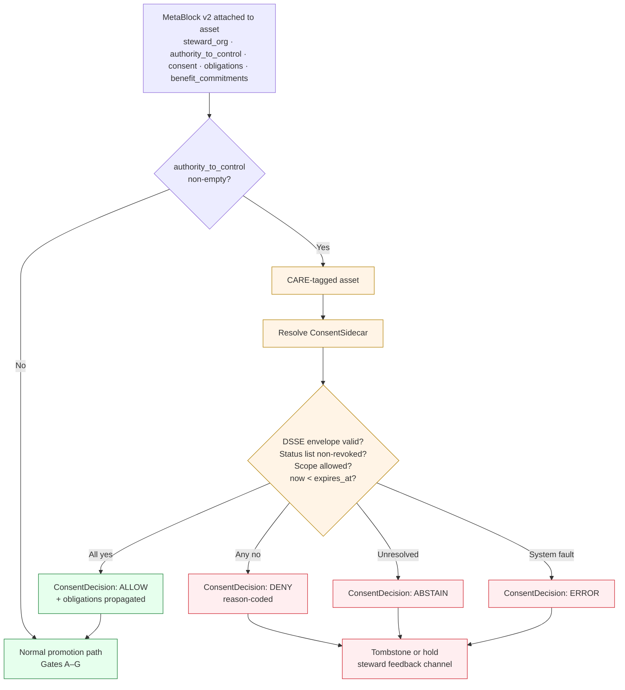

<!-- [KFM_META_BLOCK_V2]
doc_id: kfm://doc/docs-sources-catalog-care-compliance
title: Source catalog CARE compliance
type: register
version: v0.2
status: draft
owners: <PLACEHOLDER — Docs steward · Source steward · Cultural / sovereignty reviewer liaison>
created: 2026-05-20
updated: 2026-05-23
policy_label: public
related:
  - docs/sources/catalog/README.md
  - docs/sources/catalog/RIGHTS-AND-SENSITIVITY-MAP.md
  - docs/sources/catalog/GLOSSARY.md
  - docs/doctrine/directory-rules.md
  - policy/sensitivity/
  - policy/consent/
tags: [kfm, docs, sources, catalog, care, fair, governance, sensitivity, consent]
notes:
  - "v0.2 — full presentation-standard pass; doctrine alignment to Pass-10 C15.a–c and SRC-062 (Master MapLibre Components) CARE evidence."
  - "PROPOSED scaffold; sibling-link presence verified in a prior Claude Code session, not in this session."
  - "Atlas references: KFM-P1-PROG-0023 (MetaBlock v2 CARE fields), KFM-P5-PROG-0005 (ConsentSidecar), KFM-P5-PROG-0007 (ConsentDecision render gate), KFM-P7-PROG-0004 (Obligations object); Pass-10 C15-01 / C15-02 / C15-03 / C15-04, C6-07, C6-08."
  - "Original draft referenced ADR-0010 for deny-by-default; not located in the doctrine corpus this session — relabeled NEEDS VERIFICATION and pointed at ADR-S-05 (sensitivity tier scheme) in the doctrine synthesis ADR backlog."
[/KFM_META_BLOCK_V2] -->

# Source catalog CARE compliance

> How CARE governance fields attach to KFM catalog entries — what surfaces where, what fails closed, and why this page does **not** decide policy.


**Status:** scaffold (PROPOSED) · **Type:** explanatory register *(docs lane; not authority)* · **Last reviewed:** 2026-05-23

---

## Quick jump

- [Why this page exists](#why-this-page-exists)
- [Authority pointer](#authority-pointer)
- [The pairing: FAIR + CARE](#the-pairing-fair--care)
- [CARE fields (canonical)](#care-fields-canonical)
- [Where the fields surface](#where-the-fields-surface)
- [Default-deny rule](#default-deny-rule)
- [How a CARE check flows](#how-a-care-check-flows)
- [Where this page is *not* authority](#where-this-page-is-not-authority)
- [Open questions](#open-questions)
- [Related docs](#related-docs)

---

## Why this page exists

The **CARE Principles** — **C**ollective Benefit, **A**uthority to Control, **R**esponsibility, **E**thics — were developed by the Global Indigenous Data Alliance to govern Indigenous and other rights-holder-sensitive data. *(CONFIRMED — Pass-10 §6.15.0.)*

KFM's posture is that **FAIR is insufficient on its own** — it produces technically open data that may nevertheless violate the rights of the communities the data describes — and **CARE is insufficient on its own** — it lacks the operational specificity to be enforced in software. *(CONFIRMED corpus framing — Pass-10 §6.15.0 / C15-04: "FAIR by design, CARE in practice.")*

This page explains **where CARE fields surface inside the catalog** and **which gate enforces them**. It is **explanatory only**.

> [!IMPORTANT]
> This page **does not decide** CARE policy. Policy authority lives in [`policy/sensitivity/`](../../../policy/sensitivity/) and [`policy/consent/`](../../../policy/consent/). Per `directory-rules.md` §8.3, compatibility roots (`docs/`) **MUST NOT** become parallel authority for policy, schema, or contract content. *(CONFIRMED doctrine.)*

[Back to top](#quick-jump)

---

## Authority pointer

The CARE machinery spans four authority roots. This register only **points at** them.

| Concern | Where it lives | Status |
|---|---|---|
| Policy bundles (sensitivity, consent render-gate rules) | [`policy/sensitivity/`](../../../policy/sensitivity/), [`policy/consent/`](../../../policy/consent/) | **CONFIRMED root** *(directory-rules.md §9.1; doctrine synthesis §49)* |
| Per-source rights summary | [`docs/sources/catalog/RIGHTS-AND-SENSITIVITY-MAP.md`](./RIGHTS-AND-SENSITIVITY-MAP.md) | **PROPOSED** scaffold (sibling pointer) |
| `kfm:care` JSON-LD context (extension namespace) | *(home TBD — likely `schemas/contracts/v1/care/` or alongside catalog profile files)* | **PROPOSED** — Pass-10 C15-02 |
| MetaBlock v2 CARE field schema | *(home TBD — `schemas/contracts/v1/metablock/`)* | **PROPOSED** — Pass-10 C15-01 / KFM-P1-PROG-0023 |
| ConsentSidecar schema | `schemas/contracts/v1/consent/consent_sidecar.schema.json` *(PROPOSED path)* | **PROPOSED** — KFM-P5-PROG-0005 |
| OPA render-gate package | `policy/consent/render.rego` *(PROPOSED path)* | **PROPOSED** — KFM-P5-PROG-0007 |
| Sensitivity tier scheme ADR | `docs/adr/` | **PROPOSED — ADR-S-05** *(NEEDS VERIFICATION)* |

> [!CAUTION]
> **The terms text of any CARE rule belongs in `policy/sensitivity/`, not here.** If a future reviewer is tempted to inline rule text or a redaction profile into this page, that is the drift pattern called out in `directory-rules.md` §8.3 and must be raised against `docs/registers/DRIFT_REGISTER.md`.

[Back to top](#quick-jump)

---

## The pairing: FAIR + CARE

> **"FAIR by design, CARE in practice."** *(CONFIRMED slogan — Pass-10 C15-04.)*

| Principle | Frame | What it shapes in KFM |
|---|---|---|
| **FAIR** — Findable, Accessible, Interoperable, Reusable | Data-engineering | Architecture — identifiers, formats, protocols, provenance. Every asset gets identifiers, structured metadata, and interoperable shapes by default. |
| **CARE** — Collective benefit, Authority to control, Responsibility, Ethics | Data-ethics | Policy — whether an asset is *actually* published, to whom, on what terms. Gated by community authority. |

> [!NOTE]
> FAIR and CARE are **paired, not competing**. A FAIR architecture is exactly what CARE needs to function (identifiers, formats, provenance make community authority machine-checkable). FAIR without CARE produces data that is technically open but ethically fraught. *(CONFIRMED — Pass-10 C15-04.)*

[Back to top](#quick-jump)

---

## CARE fields (canonical)

CARE fields ride on **MetaBlock v2**. The canonical set per Pass-10 C15-01 / KFM-P1-PROG-0023:

| Field | Meaning | Status |
|---|---|---|
| `steward_org` | The institutional steward of the asset. | **CONFIRMED — Pass-10 C15-01** |
| `authority_to_control` | The community or body whose authority governs the asset. **Trigger field** for default-deny. | **CONFIRMED — Pass-10 C15-01 / C15-03** |
| `consent` | The consent grant under which the asset is held. Structured (consent token / ConsentSidecar), not free text. | **CONFIRMED — Pass-10 C15-01; KFM-P5-PROG-0005** |
| `obligations` | Downstream duties placed on consumers (attribution, share-alike, retention limits, aggregation-only). Structured so policy can reason about it. | **CONFIRMED — KFM-P7-PROG-0004; Pass-10 C15-01** |
| `benefit_commitments` | What benefit flows back to the relevant community from publication and reuse. | **CONFIRMED — Pass-10 C15-01** |

Extension fields per Pass-23 KFM-P1-PROG-0023 and SRC-062 (Master MapLibre Components ML-062-033):

| Field | Meaning | Status |
|---|---|---|
| `embargo` | Date or condition until which publication is held. Render gate denies until passed *(C6-08 enforcement)*. | **CONFIRMED — KFM-P1-PROG-0023; C6-08** |
| `redaction` / `redaction_profile` | Pointer to the named redaction transform required before render. | **CONFIRMED — Pass-10 C6-02; ML-062-033** |
| `locality_restrictions` | Geographic generalization or suppression required (e.g., grid generalization, jitter, full denial). | **CONFIRMED — ML-062-033 / ML-062-035** |
| `review_expiry` | Date after which the CARE assessment must be re-reviewed before further publication. | **CONFIRMED — ML-062-033 / ML-059-029** |
| `use_conditions` | Per-audience use constraints attached to the consent grant. | **CONFIRMED — ML-062-033** |
| `steward_contact` | Reachable steward identifier for revocation, remediation, dispute. | **CONFIRMED — ML-062-033 / ML-059-029** |

> [!NOTE]
> **Field optionality is itself a CARE decision.** Omitting CARE fields for an asset where CARE does not apply is acceptable; omitting them for an applicable asset is a violation that the default-deny gate refuses. The determination of applicability is **curatorial, not automated**. *(CONFIRMED — Pass-10 C15-01.)*

[Back to top](#quick-jump)

---

## Where the fields surface

CARE fields appear in the **`kfm:care` namespace extension** on STAC `properties` and on DCAT distributions. *(CONFIRMED — Pass-10 C15-02.)*

| Surface | Carrier | Why |
|---|---|---|
| **STAC Item `properties.kfm:care`** | STAC Item / Collection | Surfaces CARE in the de facto geospatial catalog so STAC-aware consumers can see and act on it without fetching the full MetaBlock. |
| **DCAT Distribution `kfm:care`** | DCAT Dataset / Distribution | Surfaces CARE in open-data catalogs (e.g., data.gov-style consumers) that expect DCAT. |
| **EvidenceBundle** | JSON-LD bundle (content-addressed) | Full MetaBlock v2 (including all CARE fields) is reachable by content address; the catalog block is a projection. |
| **ConsentSidecar** | DSSE-signed JSON, content-addressed | Pairs holder Verifiable Credential, consent receipt, Bitstring Status List entry; constrains what the render gate may materialize. *(KFM-P5-PROG-0005.)* |
| **MapLibre layer attributes** | Layer / Style manifest | Public-safe layer carries enough CARE evidence for the render gate to allow/abstain/deny at request time. *(SRC-062 ML-062-033 ↔ ML-062-035.)* |

> [!NOTE]
> Consumers that **don't understand** `kfm:care` ignore the fields safely (extension semantics). Consumers that **do** understand it can act on them. *(CONFIRMED — Pass-10 C15-02.)*

[Back to top](#quick-jump)

---

## Default-deny rule

Per **Pass-10 C15-03**, publication is **default-deny** whenever `authority_to_control` is non-empty, until the named authority's consent grant is on file, valid, and unrevoked. *(CONFIRMED.)*

| Aspect | Behavior |
|---|---|
| Posture | Default deny *(CONFIRMED — C15-03; KFM-P1-IDEA-0031)* |
| Trigger | `authority_to_control` non-empty |
| Allow path | Named authority's consent grant present + valid + unrevoked |
| Where enforced | C5-01 promotion gate **and** C5-05 admission webhook *(CONFIRMED — C15-03)* |
| Decision shape | `ConsentDecision` envelope: `ALLOW` / `DENY` / `ABSTAIN` / `ERROR` *(CONFIRMED — KFM-P5-PROG-0007)* |
| Revocation | `revocation_endpoint` introspected per render; tombstone + cache invalidation on revoke *(CONFIRMED — Pass-10 C6-08)* |
| Embargo | `now < embargo_until` → DENY regardless of other approvals *(CONFIRMED — C6-08)* |

This aligns with the **deny-by-default sensitivity posture** the KFM corpus applies to DNA, rare-species, archaeology, infrastructure, and living-person data. *(CONFIRMED doctrine — AI Build Operating Contract §23.1–23.2; KFM-P1-IDEA-0031; Domains Atlas §20.5 Deny-by-Default Register.)*

> [!IMPORTANT]
> The original scaffold referenced **`ADR-0010`** as the deny-by-default ADR. That ADR number was **not located** in the doctrine corpus this session. The Doctrine Synthesis ADR backlog lists this concern as **ADR-S-05 — Sensitivity tier scheme**. The reference to `ADR-0010` is therefore **NEEDS VERIFICATION**; if the number exists in a mounted-repo ADR index it should be confirmed, otherwise renumbered per the active ADR ledger.

[Back to top](#quick-jump)

---

## How a CARE check flows



> [!NOTE]
> The check fires at **both** publication-time (C5-01 promotion gate) **and** at runtime (C5-05 admission webhook / render gate). A revocation between publish and render must be honored at render time. *(CONFIRMED — Pass-10 C15-03; KFM-P5-PROG-0007.)*

[Back to top](#quick-jump)

---

## Where this page is *not* authority

This is an **explanatory register**. To stay on the right side of `directory-rules.md` §8.3, this page never:

- States CARE rule text *(authority: `policy/sensitivity/`, `policy/consent/`)*.
- Defines the MetaBlock v2 schema shape *(authority: `schemas/contracts/v1/metablock/`)*.
- Defines the `kfm:care` JSON-LD context *(authority: profile contract files; namespace decision per Pass-10 C15-02)*.
- Lists per-source rights *(authority: [`RIGHTS-AND-SENSITIVITY-MAP.md`](./RIGHTS-AND-SENSITIVITY-MAP.md), which is itself a pointer to `policy/sensitivity/`)*.
- Specifies redaction profiles *(authority: `policy/sensitivity/redaction_profiles/` per Pass-10 C6-02)*.
- Records consent grants *(authority: ConsentSidecar store; KFM-P5-PROG-0005)*.

If a topic the reader needs is on the **not-authority** list above, follow the **Related docs** pointers — they are the source of truth.

[Back to top](#quick-jump)

---

## Worked patterns

<details>
<summary><b>Illustrative: <code>kfm:care</code> block on a STAC Item</b> (illustrative — not authoritative)</summary>

```json
{
  "type": "Feature",
  "stac_version": "1.1.0",
  "properties": {
    "datetime": "2026-05-23T00:00:00Z",
    "kfm:care": {
      "steward_org": "<authoritative-steward-identifier>",
      "authority_to_control": "<community-or-body-identifier>",
      "consent": {
        "sidecar_ref": "kfm://consent/<sidecar-digest>",
        "scope": "generalize_render",
        "expires_at": "<ISO-8601>"
      },
      "obligations": [
        { "type": "attribution", "text": "<rendered at display>" },
        { "type": "retention_limit", "expires_at": "<ISO-8601>" }
      ],
      "benefit_commitments": ["<commitment-1>", "<commitment-2>"],
      "embargo_until": "<ISO-8601-or-null>",
      "redaction_profile": "kfm://redaction-profile/<name>@<version>",
      "locality_restrictions": "grid_generalization_5km",
      "review_expiry": "<ISO-8601>",
      "steward_contact": "<steward-contact-identifier>"
    }
  }
}
```

> Illustrative only. Authoritative shape lives in the `kfm:care` JSON-LD context and the MetaBlock v2 schema. **NEEDS VERIFICATION** against current contract files.

</details>

<details>
<summary><b>Illustrative: <code>ConsentDecision</code> envelope</b> (illustrative — not authoritative)</summary>

```json
{
  "decision_id": "<uuid>",
  "outcome": "DENY",
  "reasons": ["status_list_revoked"],
  "obligations": [],
  "evaluated_at": "<ISO-8601>"
}
```

> Source shape: KFM-P5-PROG-0007. Reproduced as an illustrative sketch for orientation; the authoritative envelope is defined alongside the OPA render-gate package.

</details>

[Back to top](#quick-jump)

---

## Open questions

| ID | Question | Status |
|---|---|---|
| **OPEN-CARE-01** | Namespace pin — `kfm:` (global) vs `ks-kfm:` (Kansas-scoped) — for the `kfm:care` extension. Cross-cutting with `kfm:provenance`. *(Pass-10 C4-01.)* | **OPEN — corpus-wide** |
| **OPEN-CARE-02** | Which KFM domains require CARE fields as **mandatory** rather than optional? *(KFM-P1-PROG-0023 NEEDS VERIFICATION.)* | **OPEN** |
| **OPEN-CARE-03** | MetaBlock v2 versioning policy — how do CARE fields evolve as community authorities evolve their consent positions? *(Pass-10 C15-01.)* | **OPEN** |
| **OPEN-CARE-04** | Namespace versioning — is `kfm:care` v1 → v2 backwards compatible? *(Pass-10 C15-02.)* | **OPEN** |
| **OPEN-CARE-05** | CARE-remediation playbook — how are denied assets surfaced to steward and authority without itself violating CARE? *(Pass-10 C15-03.)* | **OPEN** |
| **OPEN-CARE-06** | "Not-findable-by-policy" convention — how does the catalog record the **absence** of an asset for CARE reasons without leaking that it exists? *(Pass-10 C15-04.)* | **OPEN** |
| **OPEN-CARE-07** | ADR number for the deny-by-default rule (originally cited as `ADR-0010` — **not located** in the corpus this session; ADR-S-05 candidate per doctrine synthesis). | **NEEDS VERIFICATION** |
| **OPEN-CARE-08** | Upstream submission of `kfm:care` — propose to DCAT-AP / STAC-extensions registry, or keep KFM-local? *(Pass-10 C15-02.)* | **OPEN** |
| **OPEN-CARE-09** | Revocation introspection cache TTL — balance latency and freshness. *(Pass-10 C6-07.)* | **OPEN** |

[Back to top](#quick-jump)

---

## Related docs

- [`docs/sources/catalog/README.md`](./README.md) — catalog lane landing *(PROPOSED)*
- [`docs/sources/catalog/RIGHTS-AND-SENSITIVITY-MAP.md`](./RIGHTS-AND-SENSITIVITY-MAP.md) — per-family rights summary *(PROPOSED)*
- [`docs/sources/catalog/GLOSSARY.md`](./GLOSSARY.md) — `kfm:care`, MetaBlock v2, ConsentSidecar terms *(PROPOSED)*
- [`docs/sources/catalog/IDENTITY.md`](./IDENTITY.md) — Collection-id rules (related to namespace pin OPEN-CARE-01) *(PROPOSED)*
- [`policy/sensitivity/`](../../../policy/sensitivity/) — **authoritative CARE and sensitivity rules**
- [`policy/consent/`](../../../policy/consent/) — **authoritative consent gate (OPA render package)**
- [`docs/doctrine/directory-rules.md`](../../../doctrine/directory-rules.md) — placement authority
- [`docs/standards/STAC.md`](../../../standards/STAC.md) — STAC profile (where `kfm:care` lives on Items / Collections) *(PROPOSED)*
- [`docs/standards/PROV.md`](../../../standards/PROV.md) — PROV-O / PAV profile *(see OPEN-DR-01 re. `PROV.md` vs `PROVENANCE.md`)*
- [`docs/registers/DRIFT_REGISTER.md`](../../../registers/DRIFT_REGISTER.md) — where structural drift is logged

---

*Doc status: **draft · register (v0.2)** · Last reviewed: **2026-05-23** · Provenance: revised against KFM doctrine corpus; no mounted-repo evidence in this session.*

[↑ Back to top](#source-catalog-care-compliance)
