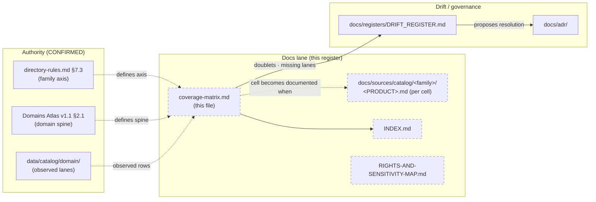

<!-- [KFM_META_BLOCK_V2]
doc_id: kfm://doc/docs-sources-catalog-coverage-matrix
title: Source catalog coverage matrix
type: register
version: v0.2
status: draft
owners: <PLACEHOLDER — Docs steward · Source steward · Domain owners (per row)>
created: 2026-05-20
updated: 2026-05-23
policy_label: public
related:
  - docs/sources/catalog/README.md
  - docs/sources/catalog/INDEX.md
  - docs/sources/catalog/RIGHTS-AND-SENSITIVITY-MAP.md
  - docs/doctrine/directory-rules.md
  - data/catalog/domain/
  - connectors/
tags: [kfm, docs, sources, catalog, register, coverage]
notes:
  - "v0.2 — full presentation-standard pass; family axis verified against directory-rules.md §7.3; domain axis preserved from prior-session enumeration of data/catalog/domain/ at 2026-05-20 (not re-verified this session)."
  - "PROPOSED scaffold; sibling-link presence verified in a prior Claude Code session."
  - "Drift signals: settlement vs settlements-infrastructure; people vs people-dna-land. Surfaced for reconciliation, not silently chosen."
  - "Canonical KFM domain spine has 15 domains (Atlas v1.1 §2.1); the observed data/catalog/domain/ enumeration is missing Spatial Foundation, Frontier Matrix, and Planetary/3D — surfaced as OPEN-CM-04 rather than back-filled."
[/KFM_META_BLOCK_V2] -->

# Source catalog coverage matrix

> Family × domain documentation coverage for the source-catalog lane — a register, not a product page.

**Status:** scaffold (PROPOSED) · **Type:** register *(docs lane; not authority)* · **Last reviewed:** 2026-05-23

---

## Quick jump

- [Purpose](#purpose)
- [Authority pointer](#authority-pointer)
- [Axes](#axes)
- [Cell value vocabulary](#cell-value-vocabulary)
- [Drift signals](#drift-signals)
- [Matrix](#matrix)
- [Coverage summary](#coverage-summary)
- [Where this register sits](#where-this-register-sits)
- [Maintenance rules](#maintenance-rules)
- [Open questions](#open-questions)
- [Related docs](#related-docs)

---

## Purpose

This register answers one question:

> **For each (source family × domain) pair, has the source-catalog lane documented the family's contribution to the domain?**

The cell value is **documentation-state**, not implementation-state. A `documented` cell means a product page (or equivalent docs-lane artifact) exists describing the family's contribution to that domain. It says **nothing** about whether the connector is built, whether a SourceDescriptor is registered, whether data has flowed, or whether the catalog has closed.

> [!IMPORTANT]
> This page is a **register** in the documentation lane. It does **not** decide axes, fold drift, or promote naming. The authoritative family list lives in `directory-rules.md` §7.3. The authoritative domain list lives in the KFM Domains Atlas v1.1 §2.1. Where the observed `data/catalog/domain/` enumeration diverges from doctrine, this register **flags** the divergence in [Drift signals](#drift-signals) rather than silently picking a side.

[Back to top](#quick-jump)

---

## Authority pointer

| Concern | Where authority lives | Status |
|---|---|---|
| Family list (connector lane) | [`directory-rules.md` §7.3](../../doctrine/directory-rules.md#73-connectors--source-specific-fetch-and-admission) | **CONFIRMED — 9 families** |
| Domain spine (doctrine) | KFM Domains Atlas v1.1 §2.1 (15-domain spine) | **CONFIRMED doctrine** |
| Domain projection lanes | [`data/catalog/domain/`](../../../../data/catalog/domain/) (subdirectories) | **CONFIRMED prior-session enumeration 2026-05-20**; NEEDS VERIFICATION this session |
| Per-product page placement convention | `docs/sources/catalog/<family>/<PRODUCT>.md` | **PROPOSED** *(sibling-link presence verified in prior Claude Code session)* |
| Drift register | [`docs/registers/DRIFT_REGISTER.md`](../../registers/DRIFT_REGISTER.md) | **CONFIRMED root** *(directory-rules.md §2.5)* |

[Back to top](#quick-jump)

---

## Axes

### Family axis (9, CONFIRMED)

Source families per `directory-rules.md` §7.3:

| # | Family | Connector lane | Notes |
|---|---|---|---|
| 1 | `usgs` | `connectors/usgs/` | Hydrology, hazards, terrain, water data |
| 2 | `fema` | `connectors/fema/` | Hazards (NFHL, OpenFEMA, disaster declarations) |
| 3 | `noaa` | `connectors/noaa/` | Atmosphere, hazards (storm events, NWS, FIRMS-adjacent) |
| 4 | `nrcs` | `connectors/nrcs/` | Soil (SSURGO/gSSURGO/gNATSGO, SCAN) |
| 5 | `kansas` | `connectors/kansas/` | Kansas-authority sources (KGS, KDWP, KSU, KHRI, etc.) |
| 6 | `gbif` | `connectors/gbif/` | Biodiversity (fauna/flora occurrence aggregator) |
| 7 | `inaturalist` | `connectors/inaturalist/` | Community biodiversity observations |
| 8 | `census` | `connectors/census/` | People/settlements (admin geography, ACS) |
| 9 | `local_upload` | `connectors/local_upload/` | Operator-curated local uploads under admission policy |

> [!NOTE]
> If a tenth family is later admitted under an ADR, this matrix gains a column and the badge in the header is bumped to reflect the new cell count. The family axis is **change-controlled via ADR** *(directory-rules.md §2.4)*.

### Domain axis (15 observed, drift-flagged)

Domain rows are the subdirectories enumerated under [`data/catalog/domain/`](../../../../data/catalog/domain/) as of 2026-05-20 (prior-session enumeration). The KFM Domains Atlas v1.1 §2.1 spine names **15 canonical domains**:

| # | Atlas canonical | Atlas dossier short-name | Observed `data/catalog/domain/` row | Status |
|---|---|---|---|---|
| 1 | Spatial Foundation | — | *(none — see OPEN-CM-04)* | **DRIFT — expected per Atlas; not observed** |
| 2 | Hydrology | `[DOM-HYD]` | `hydrology` | **CONFIRMED alignment** |
| 3 | Soil | `[DOM-SOIL]` | `soil` | **CONFIRMED alignment** |
| 4 | Habitat | `[DOM-HAB]` | `habitat` | **CONFIRMED alignment** |
| 5 | Fauna | `[DOM-FAUNA]` | `fauna` | **CONFIRMED alignment** |
| 6 | Flora | `[DOM-FLORA]` | `flora` | **CONFIRMED alignment** |
| 7 | Agriculture | `[DOM-AG]` | `agriculture` | **CONFIRMED alignment** |
| 8 | Geology | `[DOM-GEOL]` | `geology` | **CONFIRMED alignment** |
| 9 | Atmosphere / Air | `[DOM-AIR]` | `atmosphere` | **CONFIRMED alignment** *(naming variant)* |
| 10 | Hazards | `[DOM-HAZ]` | `hazards` | **CONFIRMED alignment** |
| 11 | Roads / Rail / Trade | `[DOM-ROADS]` | `roads-rail-trade` | **CONFIRMED alignment** |
| 12 | Settlements / Infrastructure | `[DOM-SETTLE]` | `settlement` **and** `settlements-infrastructure` | **DRIFT — see [Drift signals](#drift-signals)** |
| 13 | Archaeology | `[DOM-ARCH]` | `archaeology` | **CONFIRMED alignment** |
| 14 | People / DNA / Land | `[DOM-PEOPLE]` | `people` **and** `people-dna-land` | **DRIFT — see [Drift signals](#drift-signals)** |
| 15 | Frontier Matrix | `[ENCY] [UNIFIED]` | *(none — see OPEN-CM-04)* | **DRIFT — expected per Atlas; not observed** |
| 16 | Planetary / 3D | `[MAP-MASTER] [UIAI]` | *(none — see OPEN-CM-04)* | **DRIFT — expected per Atlas; not observed** |

> [!CAUTION]
> The Atlas spine names 15 (plus Planetary/3D as a 16th cross-cutting lane). The observed `data/catalog/domain/` set is **15 rows but with 2 doublets and 3 missing canonical lanes**. This matrix preserves the observed enumeration honestly; reconciliation belongs in the Drift Register, not here.

[Back to top](#quick-jump)

---

## Cell value vocabulary

| Value | Meaning | When to use |
|---|---|---|
| `documented` | A product page exists at `docs/sources/catalog/<family>/<PRODUCT>.md` covering this family's contribution to this domain, and the page is at `status: review` or `published` per its KFM Meta Block v2. | All cited products for the (family × domain) pair are documented |
| `partial` | At least one product page exists for the pair, but known products remain undocumented; **or** the existing page is `status: draft`. | Some products documented, others outstanding |
| `not-yet` | No product page exists for this (family × domain) pair. | Default for the scaffold PR |
| `n/a` | The pair is doctrinally inapplicable (e.g., a family cannot contribute to a domain by definition). Requires a one-line justification in the cell footnote. | Rare; use sparingly |
| `stale` | A product page exists but its `review_expiry` is past, or its referenced SourceDescriptor has been superseded. | Surfaces maintenance debt |

> [!NOTE]
> Cell values are documentation-state, not implementation maturity. A `documented` cell with no live connector is still `documented`; an actively-running connector with no product page is still `not-yet`.

[Back to top](#quick-jump)

---

## Drift signals

The following divergences between the **observed `data/catalog/domain/` enumeration** and the **KFM Domains Atlas v1.1 §2.1 spine** are surfaced for reconciliation, not silently chosen.

| Drift ID | Observed | Atlas canonical | Recommended treatment |
|---|---|---|---|
| **DRIFT-CM-01** | `settlement` *and* `settlements-infrastructure` both present | `[DOM-SETTLE]` — one canonical lane | Pick one slug; alias the other for ≤30 days; raise as DRIFT_REGISTER entry; resolve via ADR. **NEEDS VERIFICATION** — confirm which slug `data/catalog/domain/README.md` (if any) names as canonical. |
| **DRIFT-CM-02** | `people` *and* `people-dna-land` both present | `[DOM-PEOPLE]` — one canonical lane | Pick one slug *(probable: `people-dna-land`, since it preserves the doctrinal scope name)*; alias the other; raise as DRIFT_REGISTER entry; resolve via ADR. **NEEDS VERIFICATION**. |
| **DRIFT-CM-03** | `atmosphere` (observed) vs `air` (Atlas schema-root `schemas/contracts/v1/air/`) | `[DOM-AIR]` — naming variant only | Naming variant; choose one consistently across `data/catalog/domain/` and `schemas/contracts/v1/`. ADR-S-XX (TBD). |
| **DRIFT-CM-04** | Missing rows: Spatial Foundation, Frontier Matrix, Planetary/3D | Atlas §2.1 spine includes them | Either admit the rows under `data/catalog/domain/`, or document why these doctrinal domains have no catalog-projection lane. May intersect with the catalog projection scope question. |

> [!IMPORTANT]
> Per `directory-rules.md` §2.5: when the mounted repo conflicts with doctrine, **do not silently conform**. Open a DRIFT_REGISTER entry and propose a resolution (ADR amending the Rules **or** a migration bringing the repo into conformance). This matrix points at the conflict; the Drift Register holds the conflict.

[Back to top](#quick-jump)

---

## Matrix

> Cells initialized to `not-yet` in this scaffold PR. **No per-family product pages have been authored in the nested layout yet.**

| Domain ↓ \ Family → | `usgs` | `fema` | `noaa` | `nrcs` | `kansas` | `gbif` | `inaturalist` | `census` | `local_upload` |
|---|---|---|---|---|---|---|---|---|---|
| `agriculture` | `not-yet` | `not-yet` | `not-yet` | `not-yet` | `not-yet` | `not-yet` | `not-yet` | `not-yet` | `not-yet` |
| `archaeology` | `not-yet` | `not-yet` | `not-yet` | `not-yet` | `not-yet` | `not-yet` | `not-yet` | `not-yet` | `not-yet` |
| `atmosphere` ⚠ | `not-yet` | `not-yet` | `not-yet` | `not-yet` | `not-yet` | `not-yet` | `not-yet` | `not-yet` | `not-yet` |
| `fauna` | `not-yet` | `not-yet` | `not-yet` | `not-yet` | `not-yet` | `not-yet` | `not-yet` | `not-yet` | `not-yet` |
| `flora` | `not-yet` | `not-yet` | `not-yet` | `not-yet` | `not-yet` | `not-yet` | `not-yet` | `not-yet` | `not-yet` |
| `geology` | `not-yet` | `not-yet` | `not-yet` | `not-yet` | `not-yet` | `not-yet` | `not-yet` | `not-yet` | `not-yet` |
| `habitat` | `not-yet` | `not-yet` | `not-yet` | `not-yet` | `not-yet` | `not-yet` | `not-yet` | `not-yet` | `not-yet` |
| `hazards` | `not-yet` | `not-yet` | `not-yet` | `not-yet` | `not-yet` | `not-yet` | `not-yet` | `not-yet` | `not-yet` |
| `hydrology` | `not-yet` | `not-yet` | `not-yet` | `not-yet` | `not-yet` | `not-yet` | `not-yet` | `not-yet` | `not-yet` |
| `people` ⚠ | `not-yet` | `not-yet` | `not-yet` | `not-yet` | `not-yet` | `not-yet` | `not-yet` | `not-yet` | `not-yet` |
| `people-dna-land` ⚠ | `not-yet` | `not-yet` | `not-yet` | `not-yet` | `not-yet` | `not-yet` | `not-yet` | `not-yet` | `not-yet` |
| `roads-rail-trade` | `not-yet` | `not-yet` | `not-yet` | `not-yet` | `not-yet` | `not-yet` | `not-yet` | `not-yet` | `not-yet` |
| `settlement` ⚠ | `not-yet` | `not-yet` | `not-yet` | `not-yet` | `not-yet` | `not-yet` | `not-yet` | `not-yet` | `not-yet` |
| `settlements-infrastructure` ⚠ | `not-yet` | `not-yet` | `not-yet` | `not-yet` | `not-yet` | `not-yet` | `not-yet` | `not-yet` | `not-yet` |
| `soil` | `not-yet` | `not-yet` | `not-yet` | `not-yet` | `not-yet` | `not-yet` | `not-yet` | `not-yet` | `not-yet` |

⚠ = drift-flagged row; see [Drift signals](#drift-signals).

[Back to top](#quick-jump)

---

## Coverage summary

| Metric | Value |
|---|---|
| Total cells | **135** *(15 domains × 9 families)* |
| `documented` | **0** *(0.0%)* |
| `partial` | **0** *(0.0%)* |
| `not-yet` | **135** *(100.0%)* |
| `n/a` | **0** *(0.0%)* |
| `stale` | **0** *(0.0%)* |
| Drift-flagged rows | **4** *(atmosphere, people, people-dna-land, settlement, settlements-infrastructure — 4 rows containing 2 doublets and 1 naming variant)* |

> [!NOTE]
> Update this summary together with the matrix on any row/cell change. The badge in the header (`cells documented`) MUST stay synchronized with the `documented` count.

[Back to top](#quick-jump)

---

## Where this register sits

> [!NOTE]
> Dashed nodes are PROPOSED docs lanes. Solid nodes are CONFIRMED authority or governance roots. The register **observes** the authority axes; it does not redefine them.

[Back to top](#quick-jump)

---

## Maintenance rules

> [!IMPORTANT]
> Docs are part of the working system. This register must update when product pages land, when the axes change, or when drift is resolved.

| Trigger | Action |
|---|---|
| A new product page lands at `docs/sources/catalog/<family>/<PRODUCT>.md` with `status: review` or `published` | Flip the matching cell to `documented` (or `partial` if other products for the pair remain undocumented). Update the summary and the header badge. |
| A product page moves to `status: draft` after being `review`/`published` | Demote the cell from `documented` → `partial`. Update the summary. |
| A product page's `review_expiry` lapses | Mark the cell `stale`. Add a row to the Open Questions table linking the lapsed page. |
| A new family is admitted (ADR-S-XX) | Add a column to the matrix; bump the family-axis badge; cite the ADR in the meta block notes. |
| A drift signal is resolved (e.g., `settlement` / `settlements-infrastructure` merger) | Remove the redundant row; bump the version; reference the resolving ADR in the meta block notes. |
| A new doctrinal domain lane appears under `data/catalog/domain/` | Add the row; mark drift status against the Atlas if applicable. |

**Versioning.** This register follows KFM Meta Block v2 semver-lite: `v0.x` for scaffold / pre-axis-stable; `v1.x` once family **and** domain axes are stable (no drift signals open); minor bump for cell changes, major bump for axis changes.

[Back to top](#quick-jump)

---

## Open questions

| ID | Question | Status |
|---|---|---|
| **OPEN-CM-01** | Resolve `settlement` vs `settlements-infrastructure` — which slug is canonical? | **OPEN — DRIFT-CM-01** |
| **OPEN-CM-02** | Resolve `people` vs `people-dna-land` — which slug is canonical? | **OPEN — DRIFT-CM-02** |
| **OPEN-CM-03** | Resolve `atmosphere` vs `air` — match `data/catalog/domain/` to schema-root naming or vice versa? | **OPEN — DRIFT-CM-03** |
| **OPEN-CM-04** | Why do Spatial Foundation, Frontier Matrix, and Planetary/3D not appear under `data/catalog/domain/`? Is `data/catalog/domain/` intentionally restricted to data-producing domains, excluding cross-cutting / spine lanes? Document or admit. | **OPEN — DRIFT-CM-04** |
| **OPEN-CM-05** | Confirm `docs/sources/catalog/<family>/<PRODUCT>.md` as the canonical product-page layout vs flat `docs/sources/catalog/<family>-<product>.md`. *(See WBD product-page scaffold notes — OPEN-DR-02 in directory-rules.md §18.b for the parallel runbook convention question.)* | **OPEN** |
| **OPEN-CM-06** | Define `n/a` justification process — when is a (family × domain) pair doctrinally inapplicable, and who signs off? | **OPEN** |
| **OPEN-CM-07** | Automation — should the cell count and `documented` percentage be computed from per-product meta blocks rather than hand-maintained? | **OPEN** |
| **OPEN-CM-08** | Confirm prior-session `data/catalog/domain/` enumeration against the current mounted repo (next session with repo access). | **NEEDS VERIFICATION** |

[Back to top](#quick-jump)

---

## Related docs

- [`docs/sources/catalog/README.md`](./README.md) — catalog lane landing *(PROPOSED)*
- [`docs/sources/catalog/INDEX.md`](./INDEX.md) — family index *(PROPOSED)*
- [`docs/sources/catalog/RIGHTS-AND-SENSITIVITY-MAP.md`](./RIGHTS-AND-SENSITIVITY-MAP.md) — per-family rights summary *(PROPOSED)*
- [`docs/sources/catalog/CARE-COMPLIANCE.md`](./CARE-COMPLIANCE.md) — CARE field surfacing rules *(PROPOSED)*
- [`data/catalog/domain/`](../../../../data/catalog/domain/) — domain-projection subdirectories (domain-axis source)
- [`docs/doctrine/directory-rules.md`](../../doctrine/directory-rules.md) — placement authority (family-axis source: §7.3)
- [`docs/registers/DRIFT_REGISTER.md`](../../registers/DRIFT_REGISTER.md) — drift entries (DRIFT-CM-01..04)
- [`docs/adr/`](../../adr/) — ADRs resolving drift entries

---

*Doc status: **draft · register (v0.2)** · Last reviewed: **2026-05-23** · Provenance: revised against `directory-rules.md` §7.3, KFM Domains Atlas v1.1 §2.1, and prior-session `data/catalog/domain/` enumeration; no mounted-repo evidence in this session.*

[↑ Back to top](#source-catalog-coverage-matrix)
