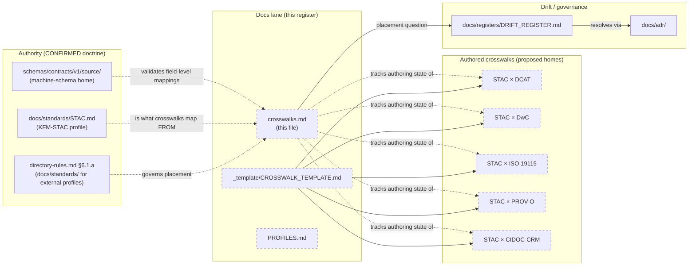

<!-- [KFM_META_BLOCK_V2]
doc_id: kfm://doc/docs-sources-catalog-crosswalks
title: Source catalog crosswalks
type: register
version: v0.2
status: draft
owners: <PLACEHOLDER — Docs steward · Source steward · Catalog profile owner>
created: 2026-05-20
updated: 2026-05-23
policy_label: public
related:
  - docs/sources/catalog/README.md
  - docs/sources/catalog/PROFILES.md
  - docs/sources/catalog/_template/CROSSWALK_TEMPLATE.md
  - docs/standards/STAC.md
  - docs/standards/DCAT.md
  - docs/standards/PROV.md
  - docs/standards/ISO-19115.md
  - docs/doctrine/directory-rules.md
tags: [kfm, docs, sources, catalog, register, crosswalks, profiles, metadata]
notes:
  - "v0.2 — full presentation-standard pass; crosswalk inventory expanded with KFM-corpus-grounded candidates (Schema.org, OpenLineage); OPEN-DSC-06 strengthened with directory-rules §6.1.a evidence (docs/standards/ is canonical for external profiles)."
  - "PROPOSED scaffold; sibling-link presence verified in a prior Claude Code session, not in this session."
  - "Atlas references: KFM-P1-PROG-0021 (STAC/DCAT/PROV profile mapping), KFM-P14-IDEA-0002, KFM-P14-PROG-0008, KFM-P13-PROG-0026 (DwC → STAC + DCAT mapper), KFM-P31-PROG-0004 (KFM-STAC profile contract files), KFM-P32-IDEA-0005 (STAC DCAT PROV distribution mapping); Pass-10 C4-01, C4-03, C4-05, C8-01..05, C15-02."
[/KFM_META_BLOCK_V2] -->

# Source catalog crosswalks

> Register of cross-format mappings between the KFM-STAC profile and adjacent metadata standards — a register, not the crosswalks themselves.

**Status:** scaffold (PROPOSED) · **Type:** register *(docs lane; not authority)* · **Last reviewed:** 2026-05-23

---

## Quick jump

- [Purpose](#purpose)
- [Authority pointer](#authority-pointer)
- [Crosswalk register](#crosswalk-register)
- [Where this register sits](#where-this-register-sits)
- [Authoring lifecycle](#authoring-lifecycle)
- [Candidate future crosswalks](#candidate-future-crosswalks)
- [Crosswalk authoring guardrails](#crosswalk-authoring-guardrails)
- [Open questions](#open-questions)
- [Related docs](#related-docs)

---

## Purpose

This register answers two questions:

> **What cross-format mappings between the KFM-STAC profile and adjacent metadata standards has the project committed to documenting?** And **what is each crosswalk's authoring state?**

Per the **MDP — Metadata, Profiles, Crosswalks (ISO 19115, DCAT, STAC, PROV)** category in the KFM Pass-23/32 Atlas (75 active cards), crosswalks are first-class governance artifacts: they make KFM artifacts discoverable across the wider geospatial / cultural-heritage tooling ecosystem while preserving the `kfm:provenance` and `kfm:care` evidence-and-governance fields.

> [!IMPORTANT]
> This page is a **register** in the documentation lane. It does **not** *be* the crosswalks — the actual mapping documents live elsewhere (see [Authority pointer](#authority-pointer)). The register records that the work is planned, the template that authoring follows, and where each crosswalk's status sits in the lifecycle. *(Doctrine: `directory-rules.md` §8.3 — compatibility roots are not parallel authority.)*

[Back to top](#quick-jump)

---

## Authority pointer

| Concern | Where authority lives | Status |
|---|---|---|
| External standards profiles (STAC, DCAT, PROV, ISO 19115, …) | [`docs/standards/<STANDARD>.md`](../../../standards/) | **CONFIRMED root** *(directory-rules.md §6.1.a: "`docs/standards/` is the canonical home for external standards profiles that KFM conforms to or crosswalks against")* |
| KFM-STAC profile (project-specific governed profile) | `docs/standards/STAC.md` (informally `STAC_KFM_PROFILE.md` per Pass-10 C4-01 expansion direction) | **PROPOSED** — Pass-10 C4-01 / KFM-P31-PROG-0004 (KFM-STAC profile contract files) |
| Catalog profile contract files (machine-readable) | *(home TBD — likely `schemas/contracts/v1/catalog/` or alongside the STAC profile)* | **PROPOSED** — KFM-P31-PROG-0004 |
| Source descriptor schema | [`schemas/contracts/v1/source/`](../../../../schemas/contracts/v1/source/) | **PROPOSED** *(per ADR-0001; NEEDS VERIFICATION against mounted repo)* |
| Crosswalk authoring template | [`_template/CROSSWALK_TEMPLATE.md`](./_template/CROSSWALK_TEMPLATE.md) | **PROPOSED** scaffold (sibling pointer) |
| Drift register (placement conflicts) | [`docs/registers/DRIFT_REGISTER.md`](../../registers/DRIFT_REGISTER.md) | **CONFIRMED root** *(directory-rules.md §2.5)* |

> [!CAUTION]
> The **content** of an authored crosswalk should live in `docs/standards/` per `directory-rules.md` §6.1.a — not under `docs/sources/catalog/`. The original scaffold left this unresolved as `OPEN-DSC-06`; this revision strengthens the analysis but does not silently pick a side. See [Open questions](#open-questions).

[Back to top](#quick-jump)

---

## Crosswalk register

> Field-level mappings must be confirmed against [`schemas/contracts/v1/source/`](../../../../schemas/contracts/v1/source/) and against the KFM-STAC profile contract files (Pass-10 C4-01 / KFM-P31-PROG-0004) before any crosswalk leaves scaffold status.

| # | Crosswalk | Purpose | Atlas anchor | Authoring state | Document |
|---|---|---|---|---|---|
| 1 | **STAC × DCAT** | Map KFM-STAC Items and Collections to DCAT Datasets and Distributions (checksums, byteSize, mediaType, table schema conformity, versions, PROV links). | KFM-P14-IDEA-0002 (harvest surface); KFM-P14-PROG-0008 (STAC → DCAT JSON-LD emitter); Pass-10 C4-05 | **PROPOSED — not yet authored** | [`_template/CROSSWALK_TEMPLATE.md`](./_template/CROSSWALK_TEMPLATE.md) |
| 2 | **STAC × DwC (Darwin Core)** | Map STAC Items with `properties.taxon` to Darwin Core occurrence terms (`scientific_name`, `common_name`, `kbs_id`, `kdwp_status`, `sensitivity_rank`); also DwC `Event` and `MeasurementOrFact` rows. | KFM-P13-PROG-0026 (DwC → STAC table + DCAT mapper); Pass-10 C4-03 (CONFIRMED hybrid pattern: DwC terms nested under `properties.taxon`) | **PROPOSED — not yet authored** | [`_template/CROSSWALK_TEMPLATE.md`](./_template/CROSSWALK_TEMPLATE.md) |
| 3 | **STAC × ISO 19115** | Map KFM-STAC to ISO 19115 geographic metadata (responsible party, lineage, data quality, spatial representation). | Atlas MDP category (ISO 19115, DCAT, STAC, PROV); [`docs/standards/ISO-19115.md`](../../../standards/ISO-19115.md) (PROPOSED standards profile already authored as a sibling) | **PROPOSED — not yet authored** | [`_template/CROSSWALK_TEMPLATE.md`](./_template/CROSSWALK_TEMPLATE.md) |
| 4 | **STAC × PROV-O** | Map `kfm:provenance` fields (`spec_hash`, `evidence_bundle_ref`, `run_record_ref`, `audit_ref`, `policy_digest`) to W3C PROV-O entities (`Activity`, `Entity`, `Agent`) and PAV. | Pass-10 C4-01, C8-03; KFM-P10-PROG-0003 (PROV-O → Neo4j lineage); KFM-P27-PROG-0016 (STAC PROV time-series writer) | **PROPOSED — not yet authored** | [`_template/CROSSWALK_TEMPLATE.md`](./_template/CROSSWALK_TEMPLATE.md) |
| 5 | **STAC × CIDOC-CRM** | Map cultural-heritage STAC entries (archaeology, historical photography, oral history) to CIDOC-CRM classes (`E5 Event`, `E7 Activity`, `E21 Person`, `E53 Place`, `E55 Type`, `E74 Group`). | Pass-10 C8-01; intersects PROV-O via the PROV-O ↔ E13 demarcation question | **PROPOSED — not yet authored** | [`_template/CROSSWALK_TEMPLATE.md`](./_template/CROSSWALK_TEMPLATE.md) |

> [!NOTE]
> All five crosswalks point at the same template. The template's purpose is to keep the authored crosswalks structurally consistent (mapping table shape, citation discipline, KFM-namespaced field handling). Adoption of a new template version requires bumping every PROPOSED crosswalk that has not yet left scaffold status.

[Back to top](#quick-jump)

---

## Where this register sits

> [!NOTE]
> Dashed nodes are PROPOSED. Solid nodes are CONFIRMED authority. The diagram shows the **register tracking** authored crosswalks; whether the authored crosswalks themselves live under `docs/standards/` or `docs/sources/catalog/` is OPEN-DSC-06.

[Back to top](#quick-jump)

---

## Authoring lifecycle

A crosswalk advances through these states. The register column **Authoring state** uses this vocabulary.

| State | Meaning | Trigger to advance |
|---|---|---|
| `PROPOSED — not yet authored` | Crosswalk has a row in this register pointing at the template; no document content yet. | Author begins drafting in a per-crosswalk file with KFM Meta Block v2. |
| `draft` | Document exists; field-level mappings are being drafted; not yet reviewed. | Field-level mappings reach completion against `schemas/contracts/v1/source/` and the KFM-STAC profile. |
| `review` | Document complete; reviewer assignment open. Schema and source-descriptor cross-checks performed. | Reviewers sign off; CARE/sensitivity considerations confirmed (for crosswalks touching sensitive lanes — DwC, CIDOC-CRM). |
| `published` | Reviewer-approved; linked from `docs/sources/catalog/README.md`, `docs/sources/catalog/PROFILES.md`, and any consumer-facing surface. | Annual or version-driven review under `review_expiry`. |
| `superseded` | Replaced by a versioned successor or merged into a parent standards profile. | Pointer in this register flips to the successor; original kept for lineage. |

> [!IMPORTANT]
> Crosswalks that touch sensitive lanes — **STAC × DwC** (rare species, sensitivity rank) and **STAC × CIDOC-CRM** (archaeology, cultural heritage) — MUST include a CARE-applicability check during `review` per Pass-10 C15-02 (`kfm:care` extension). *(See [`CARE-COMPLIANCE.md`](./CARE-COMPLIANCE.md).)*

[Back to top](#quick-jump)

---

## Candidate future crosswalks

The doctrine corpus identifies several additional crosswalk targets not yet promoted into the active register. These are surfaced for review, not silently admitted.

| Candidate | Why it matters | Atlas anchor | Recommended action |
|---|---|---|---|
| **STAC × Schema.org** | Schema.org is the web-discoverable surface (`Person`, `Place`, `Event`) that consumer search engines understand; pairs with CIDOC-CRM. | Pass-10 C8-02 (CONFIRMED — Schema.org as web surface; `sameAs` links to Wikidata QIDs, LCNAF) | **Promote** if any KFM artifact targets web-discoverability beyond geospatial tooling. |
| **STAC × OpenLineage** | Job-level OpenLineage events ↔ PROV-O Activity; useful for orchestration tooling integration (Dagster, Marquez). | Pass-10 C1-05 (OpenLineage); C5-08 (Lineage Required); KFM-P10-PROG-0003 | **Promote** if pipeline-level lineage tooling is in scope (currently DEFERRED per doctrine synthesis ADR backlog). |
| **STAC × GeoParquet metadata** | KFM publishes GeoParquet distributions; the GeoParquet metadata block needs explicit mapping to STAC asset metadata and `kfm:provenance`. | KFM-P10-PROG-0002 (GeoParquet metadata contract for Arrow pipelines) | **Promote** when GeoParquet is admitted as a first-class distribution format. |
| **DCAT × DCAT-AP** | DCAT-AP is the European DCAT application profile required by some federations; KFM may want to publish a DCAT-AP mirror for cross-catalog discovery. | Pass-10 C15-02 ("Should kfm:care be proposed for upstream adoption — DCAT-AP, STAC-extensions registry?") | **Defer** until federation targets are concrete (OPEN-DSC-07). |
| **ISO 19115 × ISO 19139 (XML)** | ISO 19139 is the XML serialization of ISO 19115; needed for legacy state/federal clearinghouses that consume XML metadata. | Atlas MDP category | **Defer** until a specific clearinghouse target is named. |
| **STAC × OGC API — Tiles** | Tile-publication crosswalk; aligns with `docs/standards/OGC-API-TILES.md` (sibling standards profile). | KFM-P31-IDEA-0007 (OGC Publishing STAC alignment posture) | **Promote** alongside any PMTiles publication crosswalk work. |

> [!NOTE]
> A candidate is admitted to the active register only after a sponsor (Docs steward + Source steward) confirms scope and assigns a review owner. No silent admissions — the active register column count is itself a governance signal.

[Back to top](#quick-jump)

---

## Crosswalk authoring guardrails

When an author flips a row from `PROPOSED — not yet authored` to `draft`, the following guardrails apply.

| Guardrail | Rationale | Reference |
|---|---|---|
| Field-level mappings cite the **KFM-STAC profile contract files** as the canonical source of truth for KFM-side names | Prevents drift; profile is single source of truth | KFM-P31-PROG-0004 |
| Cross-vocabulary equivalence claims (e.g., "PROV-O `Activity` ≡ CIDOC-CRM `E7`") are flagged as **PROPOSED** unless a doctrine card asserts the equivalence | The PROV-O ↔ CRM E13 boundary is explicitly "not fully settled" in the corpus | Pass-10 C8-03 |
| KFM-namespaced fields (`kfm:provenance`, `kfm:care`) are **preserved** in the crosswalk output, not flattened | Doctrine: `kfm:` extensions are how KFM stays self-describing across federations | Pass-10 C4-01, C15-02 |
| Canonicalization choice (JCS vs URDNA2015) is **declared** for any crosswalk that produces RDF or JSON-LD output | JCS and URDNA2015 can disagree for the same logical bundle | Pass-10 C8-05 |
| Crosswalks that produce a public-safe artifact go through **Gate F (Catalog/Provenance)** before promotion | Catalog closure is a promotion gate, not a discovery feature | KFM Unified Implementation Architecture Build Manual §6.2 Gate F |
| Sensitive-lane crosswalks (DwC, CIDOC-CRM) include a **CARE-applicability section** | CARE fields surface in DCAT/STAC via the `kfm:care` namespace | Pass-10 C15-02; [`CARE-COMPLIANCE.md`](./CARE-COMPLIANCE.md) |

[Back to top](#quick-jump)

---

## Open questions

| ID | Question | Status |
|---|---|---|
| **OPEN-DSC-06** | Canonical home for authored crosswalks — `docs/sources/catalog/` vs `docs/standards/`? `directory-rules.md` §6.1.a points at `docs/standards/` for "external standards profiles that KFM conforms to or crosswalks against," which the STAC × * crosswalks arguably are. Candidate resolution: authored crosswalks live as subsidiary files under same-named standards folders (e.g., `docs/standards/STAC/crosswalk-dcat.md`); this register stays here and points at them. **NEEDS ADR.** | **OPEN — see Drift register** |
| **OPEN-DSC-07** | DCAT-AP and similar regional profiles — pursue when, and via what federation target? | **OPEN** |
| **OPEN-DSC-08** | Namespace pin — `kfm:` (global) vs `ks-kfm:` (Kansas-scoped) — for `kfm:provenance` and `kfm:care` in crosswalks. Cross-cutting question. | **OPEN — corpus-wide** *(Pass-10 C4-01)* |
| **OPEN-DSC-09** | PROV-O ↔ CIDOC-CRM E13 demarcation — author a written guide before the STAC × PROV-O and STAC × CIDOC-CRM crosswalks both promote, to avoid contradictory mappings. | **OPEN** *(Pass-10 C8-03 expansion direction)* |
| **OPEN-DSC-10** | DwC-A round-trip — should the STAC × DwC crosswalk be bidirectional (ingest from DwC-A and export back to DwC-A), or is STAC × DwC the canonical form going forward? | **OPEN** *(Pass-10 C4-03)* |
| **OPEN-DSC-11** | Crosswalk versioning — when STAC 1.1 → 1.2 (or DCAT 3 → 4), how does this register record the version sweep without breaking links from per-product pages? | **OPEN** |
| **OPEN-DSC-12** | Template versioning — what bumps `_template/CROSSWALK_TEMPLATE.md`, and how do PROPOSED crosswalks adopt new template versions? | **OPEN** |

[Back to top](#quick-jump)

---

## Related docs

- [`docs/sources/catalog/README.md`](./README.md) — catalog lane landing *(PROPOSED)*
- [`docs/sources/catalog/PROFILES.md`](./PROFILES.md) — KFM-STAC / DCAT / PROV profile pointers *(PROPOSED)*
- [`docs/sources/catalog/INDEX.md`](./INDEX.md) — family index *(PROPOSED)*
- [`docs/sources/catalog/CARE-COMPLIANCE.md`](./CARE-COMPLIANCE.md) — CARE field surfacing rules *(PROPOSED)*
- [`docs/sources/catalog/_template/CROSSWALK_TEMPLATE.md`](./_template/CROSSWALK_TEMPLATE.md) — authoring template *(PROPOSED)*
- [`docs/standards/STAC.md`](../../../standards/STAC.md) — KFM-STAC profile *(PROPOSED — informally `STAC_KFM_PROFILE.md` per Pass-10 C4-01)*
- [`docs/standards/DCAT.md`](../../../standards/DCAT.md) — DCAT profile *(PROPOSED)*
- [`docs/standards/PROV.md`](../../../standards/PROV.md) — PROV-O / PAV profile *(see OPEN-DR-01 re. `PROV.md` vs `PROVENANCE.md`)*
- [`docs/standards/ISO-19115.md`](../../../standards/ISO-19115.md) — ISO 19115 geographic metadata crosswalk profile
- [`docs/standards/OGC-API-TILES.md`](../../../standards/OGC-API-TILES.md) — OGC API Tiles profile
- [`docs/standards/PMTILES.md`](../../../standards/PMTILES.md) — PMTiles governance profile
- [`docs/doctrine/directory-rules.md`](../../doctrine/directory-rules.md) — placement authority *(§6.1.a `docs/standards/` placement contract)*
- [`docs/registers/DRIFT_REGISTER.md`](../../registers/DRIFT_REGISTER.md) — drift entries (OPEN-DSC-06)
- [`docs/adr/`](../../adr/) — ADRs resolving drift / open questions

---

*Doc status: **draft · register (v0.2)** · Last reviewed: **2026-05-23** · Provenance: revised against KFM Pass-10 §C4 / §C8 / §C15 doctrine, MDP category cards in the Pass-23/32 Atlas, and `directory-rules.md` §6.1.a; no mounted-repo evidence in this session.*

[↑ Back to top](#source-catalog-crosswalks)
