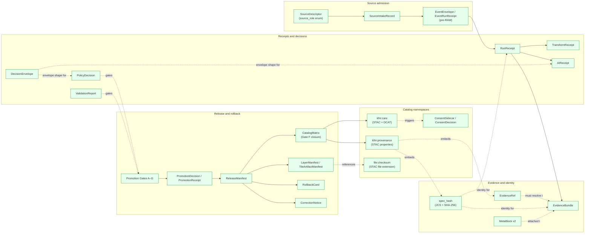

<!-- [KFM_META_BLOCK_V2]
doc_id: kfm://doc/docs-sources-catalog-glossary
title: Source catalog glossary
type: register
version: v0.2
status: draft
owners: <PLACEHOLDER — Docs steward · Source steward · Evidence steward>
created: 2026-05-20
updated: 2026-05-23
policy_label: public
related:
  - docs/sources/catalog/README.md
  - docs/sources/catalog/CARE-COMPLIANCE.md
  - docs/sources/catalog/CROSSWALKS.md
  - docs/sources/catalog/PROFILES.md
  - docs/doctrine/directory-rules.md
  - docs/standards/
  - contracts/
  - schemas/contracts/v1/
  - policy/
tags: [kfm, docs, sources, catalog, register, glossary, terminology]
notes:
  - "v0.2 — full presentation-standard pass; term meanings re-grounded against KFM doctrine corpus (Atlas Appendix A; Pass-10 C-cards; doctrine synthesis taxonomy); inaccurate `source_role` example values corrected against Atlas §24.1.3 CONFIRMED enum."
  - "PROPOSED scaffold; sibling-link presence verified in a prior Claude Code session, not in this session."
  - "ADR numbers from v0.1 (ADR-0011, ADR-0013, ADR-0015, ADR-0017, ADR-0018) were NOT located in the doctrine corpus this session — all relabeled NEEDS VERIFICATION. Doctrine synthesis ADR backlog uses ADR-S-NN identifiers (ADR-S-01..ADR-S-15)."
  - "Atlas anchors used: Atlas v1.1 Appendix A (Glossary), §24.1.3 (source-role descriptor), §24.2.1 (Master Receipt Catalog); Pass-10 C1-02 (spec_hash via JCS+SHA-256), C4-01 (kfm:provenance), C4-04 (Evidence-Bundle JSON-LD), C5-01 (Gate Matrix A–G), C15-01..03 (CARE)."
[/KFM_META_BLOCK_V2] -->

# Source catalog glossary

> One-line definitions of catalog and provenance terms used across the `docs/sources/catalog/` lane — a convenience register, not authoritative meaning.

**Status:** scaffold (PROPOSED) · **Type:** register *(docs lane; not authority)* · **Last reviewed:** 2026-05-23

---

## Quick jump

- [Purpose](#purpose)
- [Authority pointer](#authority-pointer)
- [How to read this glossary](#how-to-read-this-glossary)
- [Terms — evidence and identity](#terms--evidence-and-identity)
- [Terms — sources and ingestion](#terms--sources-and-ingestion)
- [Terms — receipts and decisions](#terms--receipts-and-decisions)
- [Terms — release and rollback](#terms--release-and-rollback)
- [Terms — catalog namespaces and properties](#terms--catalog-namespaces-and-properties)
- [Terms — doctrine and trust posture](#terms--doctrine-and-trust-posture)
- [How the terms relate](#how-the-terms-relate)
- [Open questions](#open-questions)
- [Related docs](#related-docs)

---

## Purpose

This glossary is a **navigation aid** for the source-catalog documentation lane. It exists so a reader scanning a product page, the coverage matrix, the CARE-compliance register, the crosswalks register, or any other `docs/sources/catalog/*` doc can resolve an unfamiliar term in one place without leaving the lane.

> [!IMPORTANT]
> Definitions here are **convenience summaries**. The authoritative definition of each term lives in the KFM **encyclopedia** ([ENCY] short-name; Atlas v1.1 Appendix A *Glossary*) and the relevant `contracts/` / `schemas/` records. If a downstream consumer is making a load-bearing decision, **follow the authority pointer in each row**, do not rely on the one-liner here. *(Doctrine: `directory-rules.md` §8.3 — compatibility roots are not parallel authority.)*

[Back to top](#quick-jump)

---

## Authority pointer

| Concern | Where authority lives | Status |
|---|---|---|
| Term **meaning** (object family semantics) | Encyclopedia ([ENCY]); Atlas v1.1 Appendix A *Glossary*; per-domain dossiers | **CONFIRMED root** *(directory-rules.md §6 — `contracts/` owns meaning)* |
| Field **shape** (machine schema) | `schemas/contracts/v1/<family>/` | **PROPOSED** *(per ADR-0001; NEEDS VERIFICATION against mounted repo)* |
| **Admissibility / policy** | `policy/` | **CONFIRMED root** *(directory-rules.md §9.1)* |
| **External standards** profiles (STAC, DCAT, PROV-O, ISO 19115, …) | `docs/standards/<STANDARD>.md` | **CONFIRMED root** *(directory-rules.md §6.1.a)* |
| Source-role vocabulary | `data/registry/sources/` + ADR-S-04 *(PROPOSED ADR identifier)* | **CONFIRMED enum** *(Atlas v1.1 §24.1.3)* |
| Receipt class catalog | Atlas §24.2.1 Master Receipt Catalog | **CONFIRMED reference** |

> [!CAUTION]
> The v0.1 draft cited specific ADR numbers (`ADR-0011`, `ADR-0013`, `ADR-0015`, `ADR-0017`, `ADR-0018`) as term authorities. **None of those specific numbers were located in the doctrine corpus this session.** The doctrine synthesis uses **ADR-S-NN** identifiers for its backlog (ADR-S-01..ADR-S-15); only `ADR-0001` is confirmed. All v0.1 ADR references have been relabeled **NEEDS VERIFICATION**; if the numbers exist in a mounted-repo ADR index they should be confirmed, otherwise renumbered per the active ADR ledger.

[Back to top](#quick-jump)

---

## How to read this glossary

| Column | Convention |
|---|---|
| **Term** | Repo-canonical name with KFM-specific capitalization and casing preserved exactly *(e.g., `EvidenceBundle`, `spec_hash`, `kfm:provenance`)*. |
| **One-line meaning** | PROPOSED convenience summary. Never the full doctrine definition. |
| **Authority anchor** | Where to read the authoritative definition. Citations use Atlas short-names *(`[ENCY]`, `[DIRRULES]`, `[GAI]`, `[MAP-MASTER]`)* and Pass-10 C-card identifiers. |
| **Truth label** | The strongest label that applies to the **authority anchor itself**, not to the one-line meaning. `CONFIRMED` = the doctrine corpus carries the definition; `NEEDS VERIFICATION` = anchor exists but its specific identifier (e.g., an ADR number) is not pinned this session. |

> [!NOTE]
> Where a term has KFM-specific compound form (`watcher-as-non-publisher`, `cite-or-abstain`, `kfm:provenance`) the form is preserved exactly. KFM terminology **does not** flatten into generic industry vocabulary — see `directory-rules.md` non-negotiable rules.

[Back to top](#quick-jump)

---

## Terms — evidence and identity

| Term | One-line meaning (PROPOSED) | Authority anchor | Truth label |
|---|---|---|---|
| **`EvidenceBundle`** | Content-addressed, sealed JSON-LD object carrying identity, inputs, parameters, artifacts, checks, integrity, and signatures — the canonical evidence artifact for consequential claims. | [ENCY] Appendix A; Pass-10 C4-04 (Evidence-Bundle JSON-LD with content addressing); KFM-P26-IDEA-0003; `evidence_bundle.schema.json` *(PROPOSED — KFM-P26-PROG-0004)* | **CONFIRMED doctrine** |
| **`EvidenceRef`** | Stable pointer of the form `kfm://evidence/<digest>` that MUST resolve to an `EvidenceBundle` before a public claim has authority. | [ENCY] Appendix A; Pass-10 C4-04; KFM-P26-IDEA-0002 (EvidenceRef resolution triad); `evidence_ref.schema.json` *(PROPOSED — KFM-P26-PROG-0005)* | **CONFIRMED doctrine** |
| **`spec_hash`** | Deterministic content identity — SHA-256 over the **RFC 8785 JCS (JSON Canonicalization Scheme)**–canonicalized bytes of a record. Recorded as `jcs:sha256:<hex>`. URDNA2015 is reserved for cases where RDF semantic equivalence is the relevant invariant. | Pass-10 C1-02 (Deterministic spec_hash via RFC 8785 JCS + SHA-256); C8-05 (JCS vs URDNA2015 choice) | **CONFIRMED doctrine** |
| **`MetaBlock v2`** | The metadata block shape on KFM artifacts that extends MetaBlock v1 with CARE-aligned fields (`steward_org`, `authority_to_control`, `consent`, `obligations`, `benefit_commitments`) plus `embargo`, `redaction`. | Pass-10 C15-01 (MetaBlock v2 with CARE fields); KFM-P1-PROG-0023 | **CONFIRMED doctrine** |
| **`JCS` / `URDNA2015`** | Canonicalization choices. JCS = RFC 8785 JSON Canonicalization Scheme (KFM default for receipts and bundle hashes). URDNA2015 = W3C RDF dataset normalization (reserved for RDF semantic equivalence cases). | Pass-10 C1-02; C8-05 | **CONFIRMED — EXTERNAL standards** |

[Back to top](#quick-jump)

---

## Terms — sources and ingestion

| Term | One-line meaning (PROPOSED) | Authority anchor | Truth label |
|---|---|---|---|
| **`SourceDescriptor`** | Authoritative record describing an ingestible source — identity, source role, rights, access, update cadence, authority, sensitivity. Lives in `data/registry/sources/`. Anchors every downstream receipt. | Atlas §24.2.1 Master Receipt Catalog; KFM-P28-PROG-0012 (`source_descriptor.schema.json`); ADR-S-04 source-role vocabulary *(PROPOSED ADR identifier; NEEDS VERIFICATION)* | **CONFIRMED doctrine** *(ADR number NEEDS VERIFICATION)* |
| **`source_role`** | Declared role a source plays for a claim. **CONFIRMED enum**: `observed` \| `regulatory` \| `modeled` \| `aggregate` \| `administrative` \| `candidate` \| `synthetic`. Set at admission; never edited in-place — corrections produce a new descriptor + `CorrectionNotice`. | Atlas §24.1.3 (Roles to source-descriptor fields); ADR-S-04 *(PROPOSED ADR identifier; NEEDS VERIFICATION)* | **CONFIRMED enum** |
| **`SourceIntakeRecord`** | Admission decision for a new source or source-update event. Records the admission outcome. | Atlas §24.2 receipt taxonomy; KFM Unified Doctrine Synthesis §12 | **CONFIRMED doctrine** |
| **`EventEnvelope` / `EventRunReceipt`** | Pre-RAW watcher event payload (`EventEnvelope`) and signed admission receipt (`EventRunReceipt`). Watchers emit these; they MUST NOT publish. | KFM Unified Implementation Architecture Build Manual §7.1; KFM-P*-Pre-RAW Watcher Signal Stage Pattern *(seed card)* | **CONFIRMED doctrine** *(implementation NEEDS VERIFICATION)* |

[Back to top](#quick-jump)

---

## Terms — receipts and decisions

| Term | One-line meaning (PROPOSED) | Authority anchor | Truth label |
|---|---|---|---|
| **`RunReceipt`** | Pins a pipeline/tool action to its inputs, outputs, `spec_hash`/config hash, tool versions, timestamp, operator, and result. Process memory; durable and replay-checkable. | KFM Unified Doctrine Synthesis §12 (Receipt taxonomy); Atlas §24.2.1; Pass-10 C1-01 | **CONFIRMED doctrine** |
| **`TransformReceipt`** | Records a spatial/attribute transform (reprojection, generalization, simplification) with input/output geometry hashes and parameters. | Atlas §24.2.1 Master Receipt Catalog | **CONFIRMED doctrine** |
| **`AIReceipt`** | Records a governed AI answer: prompt scope, evidence refs, policy decision, outcome class (`ANSWER` / `ABSTAIN` / `DENY` / `ERROR`), reason code, model id, time. | Atlas §24.2.1; [GAI] | **CONFIRMED doctrine** |
| **`RedactionReceipt`** | Records a public-safe transformation that removed, masked, fuzzed, or withheld content for sensitivity, rights, or policy reasons. | Atlas §24.2.1; [ENCY] | **CONFIRMED doctrine** |
| **`PolicyDecision`** | Result of evaluating a policy gate — finite outcome `allow` / `deny` / `restrict` / `hold` / `abstain` with reasons and obligations. Records: policy id, target object, decision, reason code, time, evidence refs. | Atlas §24.2.1; [ENCY]; [DIRRULES] | **CONFIRMED doctrine** |
| **`ValidationReport`** | Outcome of a validator run — passes, failures, deterministic inputs. Finite outcomes: `PASS` / `FAIL` / `ERROR`. | Atlas §24.2.1; KFM Unified Doctrine Synthesis §11 | **CONFIRMED doctrine** |
| **`DecisionEnvelope` / `RuntimeResponseEnvelope`** | Finite public/runtime output envelope: `ANSWER` / `ABSTAIN` / `DENY` / `ERROR` / `HOLD` with reason, citations, and policy/evidence IDs. No raw fluent answer reaches UI without envelope validation. | [GAI]; KFM Unified Doctrine Synthesis §11 | **CONFIRMED doctrine** |

[Back to top](#quick-jump)

---

## Terms — release and rollback

| Term | One-line meaning (PROPOSED) | Authority anchor | Truth label |
|---|---|---|---|
| **`Promotion Gates A–G`** | The seven named promotion gates: A. Source identity · B. Rights/terms · C. Sensitivity · D. Schema/contract · E. Evidence closure · F. Catalog/provenance · G. Review/release/rollback. Each gate emits a decision with required proof. | KFM Unified Implementation Architecture Build Manual §6.2; Pass-10 C5-01 (Gate Matrix A–G) | **CONFIRMED doctrine** |
| **`PromotionDecision` / `PromotionReceipt`** | Auditable state-transition records proving Gates A–G passed (or explaining held/denied release). No `PUBLISHED` state without promotion gate closure. | Atlas §24.2.1; [ENCY]; ADR-S-08 *(promotion-gate sequence; PROPOSED ADR identifier; NEEDS VERIFICATION)* | **CONFIRMED doctrine** *(ADR number NEEDS VERIFICATION)* |
| **`ReleaseManifest`** | Records the contents, version, digests, signatures, policy posture, evidence refs, and **rollback target** for a release. Required at the `PUBLISHED` transition. | Atlas §24.2.1; [ENCY]; [DIRRULES] | **CONFIRMED doctrine** |
| **`LayerManifest` / `StyleManifest` / `MapReleaseManifest`** | Map-surface release artifacts. `LayerManifest` defines what a layer may show / cite / hide / generalize; `StyleManifest` governs style version; `MapReleaseManifest` ties layers + styles + tile artifacts + proof pack + rollback target. | [MAP-MASTER]; KFM Unified Doctrine Synthesis §6 | **CONFIRMED doctrine** |
| **`TileArtifactManifest`** | Captures artifact digest, source digests, bounds, zooms, format, cache policy, release state for PMTiles / MVT / COG carriers. Tile is **carrier, not proof**. | KFM Unified Implementation Architecture Build Manual §12.3 (PMTiles attestation sidecar) | **CONFIRMED doctrine** |
| **`CatalogMatrix`** | KFM closure report binding STAC / DCAT / PROV records to artifact digests, EvidenceBundle IDs, release IDs, and proof pack. The Gate F closure receipt. | KFM Unified Implementation Architecture Build Manual §12.2 | **CONFIRMED doctrine** |
| **`RollbackCard`** | Rollback target and drill object. Preserves history while repointing current release state. Rollback does not silently delete history. | [ENCY] Appendix E; Atlas Appendix A | **CONFIRMED doctrine** |
| **`CorrectionNotice`** | Records that a published claim was corrected: what changed, why, what derivatives were invalidated. | Atlas §24.2.1; [ENCY] | **CONFIRMED doctrine** |

[Back to top](#quick-jump)

---

## Terms — catalog namespaces and properties

| Term | One-line meaning (PROPOSED) | Authority anchor | Truth label |
|---|---|---|---|
| **`kfm:provenance`** | STAC `properties` extension block carrying KFM provenance fields: `spec_hash`, `evidence_bundle_ref`, `run_record_ref`, `audit_ref`, `policy_digest`. Per-asset integrity uses `file:checksum`. | Pass-10 C4-01 (STAC Item with `kfm:provenance` namespace); [`docs/standards/STAC.md`](../../../standards/STAC.md) *(PROPOSED standards profile)* | **CONFIRMED doctrine** |
| **`kfm:care`** | STAC / DCAT extension block surfacing MetaBlock v2 CARE fields in catalog vocabularies. Trigger field for default-deny: non-empty `authority_to_control` → DENY on publication until consent grant present + valid + unrevoked. | Pass-10 C15-02 (DCAT and STAC `kfm:care` extension namespace); C15-03 (OPA default-deny on CARE-tagged); [`CARE-COMPLIANCE.md`](./CARE-COMPLIANCE.md) | **CONFIRMED doctrine** |
| **`file:checksum`** | Per-asset integrity digest from the STAC `file` extension. Used for catalog closure and tamper detection. | STAC `file` extension; Pass-10 C4-01 references | **CONFIRMED — EXTERNAL standard** |
| **`ConsentSidecar` / `ConsentDecision`** | `ConsentSidecar` = immutable content-addressed JSON pairing a holder VC + DSSE-signed consent receipt + Bitstring Status List entry; `ConsentDecision` = the OPA render-gate envelope (`ALLOW` / `DENY` / `ABSTAIN` / `ERROR`). | KFM-P5-PROG-0005; KFM-P5-PROG-0007; [`CARE-COMPLIANCE.md`](./CARE-COMPLIANCE.md) | **CONFIRMED doctrine** *(implementation NEEDS VERIFICATION)* |

[Back to top](#quick-jump)

---

## Terms — doctrine and trust posture

| Term | One-line meaning (PROPOSED) | Authority anchor | Truth label |
|---|---|---|---|
| **`cite-or-abstain`** | The default truth posture: every consequential claim resolves at least one `EvidenceRef` to an `EvidenceBundle` before being answered, rendered, or promoted — **or abstains**. | [ENCY]; KFM-P1-IDEA-0012 (EvidenceBundle outranks generated language); KFM-P1-PROG-0013 | **CONFIRMED doctrine** |
| **`Trust membrane`** | Doctrine boundary preventing raw, unreviewed, restricted, or generated state from becoming public truth. Public clients reach **only governed APIs**, never canonical/internal stores. | [DIRRULES]; [GAI]; Atlas Appendix A | **CONFIRMED doctrine** |
| **`Promotion`** | Governed release transition, **not** a file move. A path-level move bypassing validators, policy gates, evidence-bundle creation, catalog closure, and release-decision recording is a violation regardless of where the bytes ended up. | [DIRRULES]; `directory-rules.md` §9.1 (lifecycle invariant) | **CONFIRMED doctrine** |
| **`watcher-as-non-publisher`** | Doctrine that a watcher may **detect** source change but never itself **publishes** catalog entries. Watchers emit pre-RAW events and receipts; they MUST NOT write under `data/processed/`, `data/catalog/`, or `data/published/`. | `directory-rules.md` §7.3 (connector lane), §7.4 (pipelines); Connected Dots Architecture Brief; KFM-P*-FEAT (Watcher-as-Non-Publisher Capability seed cards) | **CONFIRMED doctrine** |
| **`Governed API`** | Interface enforcing evidence resolution, policy gates, release state, finite outcomes, and audit. Public clients land here — never on canonical stores. | [GAI]; [ENCY]; KFM Unified Implementation Architecture Build Manual §13 | **CONFIRMED doctrine** |

[Back to top](#quick-jump)

---

## How the terms relate

> [!NOTE]
> All nodes are CONFIRMED doctrine. The diagram shows the term relationships at a glance — solid arrows are "produces / contains", dashed arrows are "references / gates / triggers". This is an orientation aid, not a runtime data-flow diagram.

[Back to top](#quick-jump)

---

## Open questions

| ID | Question | Status |
|---|---|---|
| **OPEN-GLOSS-01** | Encyclopedia deep-link targets — what anchor IDs in the `[ENCY]` glossary are reachable from this register? *(v0.1: "no canonical anchor was confirmed in this session"; still true v0.2.)* | **NEEDS VERIFICATION** |
| **OPEN-GLOSS-02** | ADR identifiers — the v0.1 draft cited `ADR-0011`, `ADR-0013`, `ADR-0015`, `ADR-0017`, `ADR-0018`. None located in the doctrine corpus this session. Doctrine synthesis uses `ADR-S-NN`. Reconcile against the active ADR ledger. | **NEEDS VERIFICATION** |
| **OPEN-GLOSS-03** | Term-set scope — should this glossary cover only catalog-lane terms (current scope), or expand to the cross-cutting set (e.g., `LayerManifest`, `StyleManifest`, `MapReleaseManifest` belong as much to the map lane as the catalog lane)? | **OPEN** |
| **OPEN-GLOSS-04** | Namespace pin — `kfm:` (global) vs `ks-kfm:` (Kansas-scoped) — cross-cutting question that affects how `kfm:provenance` and `kfm:care` are spelled here. | **OPEN — corpus-wide** *(Pass-10 C4-01)* |
| **OPEN-GLOSS-05** | Update process — how is this glossary kept in sync with the encyclopedia when terms change? Cite the encyclopedia version once it has one, or auto-derive a subset? | **OPEN** |
| **OPEN-GLOSS-06** | Cross-reference to [`docs/sources/catalog/CARE-COMPLIANCE.md`](./CARE-COMPLIANCE.md) and [`docs/sources/catalog/CROSSWALKS.md`](./CROSSWALKS.md) — should every CARE/crosswalk-specific term in this glossary be a backlink to those sibling docs? | **OPEN** |

[Back to top](#quick-jump)

---

## Related docs

- [`docs/sources/catalog/README.md`](./README.md) — catalog lane landing *(PROPOSED)*
- [`docs/sources/catalog/PROFILES.md`](./PROFILES.md) — KFM-STAC / DCAT / PROV profile pointers *(PROPOSED)*
- [`docs/sources/catalog/CARE-COMPLIANCE.md`](./CARE-COMPLIANCE.md) — CARE field surfacing rules *(PROPOSED)*
- [`docs/sources/catalog/CROSSWALKS.md`](./CROSSWALKS.md) — cross-format mappings register *(PROPOSED)*
- [`docs/sources/catalog/RIGHTS-AND-SENSITIVITY-MAP.md`](./RIGHTS-AND-SENSITIVITY-MAP.md) — per-family rights summary *(PROPOSED)*
- [`docs/doctrine/directory-rules.md`](../../doctrine/directory-rules.md) — placement authority *(§6 governance layer separation; §6.1.a standards lane; §8.3 compatibility roots)*
- [`docs/standards/STAC.md`](../../../standards/STAC.md) — STAC profile *(authority for `kfm:provenance`)*
- [`docs/standards/DCAT.md`](../../../standards/DCAT.md) — DCAT profile
- [`docs/standards/PROV.md`](../../../standards/PROV.md) — PROV-O / PAV profile *(see OPEN-DR-01 re. `PROV.md` vs `PROVENANCE.md`)*
- [`docs/standards/ISO-19115.md`](../../../standards/ISO-19115.md) — ISO 19115 geographic metadata crosswalk profile
- [`docs/registers/DRIFT_REGISTER.md`](../../registers/DRIFT_REGISTER.md) — drift entries
- [`docs/adr/`](../../adr/) — ADRs *(active ledger needed to resolve OPEN-GLOSS-02)*

---

*Doc status: **draft · register (v0.2)** · Last reviewed: **2026-05-23** · Provenance: revised against KFM Atlas v1.1 Appendix A, §24.1.3, §24.2.1, Pass-10 C-cards, KFM Unified Doctrine Synthesis taxonomy, `directory-rules.md`; no mounted-repo evidence in this session.*

[↑ Back to top](#source-catalog-glossary)
