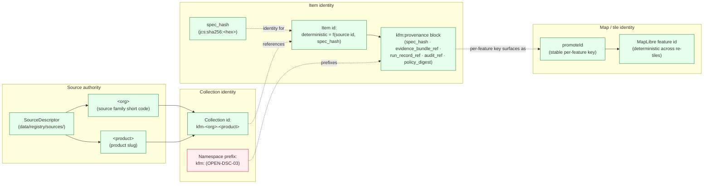

<!-- [KFM_META_BLOCK_V2]
doc_id: kfm://doc/docs-sources-catalog-identity
title: Source catalog identity and namespace conventions
type: register
version: v0.2
status: draft
owners: <PLACEHOLDER — Docs steward · Source steward · Catalog profile owner>
created: 2026-05-20
updated: 2026-05-23
policy_label: public
related:
  - docs/sources/catalog/README.md
  - docs/sources/catalog/GLOSSARY.md
  - docs/sources/catalog/CROSSWALKS.md
  - docs/sources/catalog/PROFILES.md
  - docs/sources/catalog/NAMING.md
  - docs/sources/catalog/OPEN-QUESTIONS.md
  - docs/doctrine/directory-rules.md
  - docs/standards/STAC.md
  - data/registry/sources/
tags: [kfm, docs, sources, catalog, register, identity, namespace, stac]
notes:
  - "v0.2 — full presentation-standard pass; identity grammar grounded against Pass-10 C1-02 (spec_hash via JCS+SHA-256), C4-02 (Collection id convention), C4-01 (namespace `kfm:` vs `ks-kfm:` Open Question), and Master MapLibre v2.1 ML-057-015 (promoteId / feature identity)."
  - "PROPOSED scaffold; sibling-link presence verified in a prior Claude Code session, not in this session."
  - "v0.1 cited ADR-0013 for spec_hash grammar; ADR-0013 specifically was NOT located in the doctrine corpus this session. The canonical reference for spec_hash is Pass-10 C1-02 (RFC 8785 JCS + SHA-256, recorded as `jcs:sha256:<hex>`). Reference relabeled NEEDS VERIFICATION."
  - "Atlas references: KFM-P31-PROG-0004 (KFM-STAC profile contract files); Pass-10 C4-01 (kfm:provenance namespace + Open Questions), C4-02 (Collection id convention), C1-02 (spec_hash), C1-01 (run receipt fields including run_id); ML-057-015 (MapLibre promoteId/featureIdProp)."
[/KFM_META_BLOCK_V2] -->

# Source catalog identity and namespace conventions

> Collection-id, item-id, namespace, and `promoteId` conventions for KFM source-catalog entries — a register, not authority.


**Status:** scaffold (PROPOSED) · **Type:** register *(docs lane; not authority)* · **Last reviewed:** 2026-05-23

---

## Quick jump

- [Purpose](#purpose)
- [Authority pointer](#authority-pointer)
- [Identity grammar overview](#identity-grammar-overview)
- [Collection-id pattern](#collection-id-pattern)
- [Item-id determinism](#item-id-determinism)
- [Namespace pin](#namespace-pin)
- [Per-family `promoteId` convention](#per-family-promoteid-convention)
- [Worked example](#worked-example)
- [Maintenance rules](#maintenance-rules)
- [Open questions](#open-questions)
- [Related docs](#related-docs)

---

## Purpose

This register answers four questions about identity in the source-catalog lane:

1. **How is a STAC Collection named?** *(Collection-id pattern.)*
2. **How are STAC Items addressed deterministically?** *(Item-id determinism via `spec_hash`.)*
3. **What namespace prefix do KFM extension blocks use?** *(`kfm:` vs `ks-kfm:`.)*
4. **What stable per-feature key carries identity into map tiles?** *(`promoteId` convention.)*

Identity matters because **renaming a Collection breaks links throughout the catalog** *(CONFIRMED — Pass-10 C4-02)*, and because the DDD Entities pattern that anchors KFM doctrine requires a unique attached symbol corresponding to identity distinctions in the model *(see `DomainDriven_Design_Reference.pdf` — Entities pattern)*.

> [!IMPORTANT]
> This is a **register**. It records the conventions and the unresolved questions; it does not *be* the canonical identity contract. The canonical contracts live in the KFM-STAC profile contract files *(Pass-10 C4-01; KFM-P31-PROG-0004)* and `data/registry/sources/`. *(Doctrine: `directory-rules.md` §8.3 — compatibility roots are not parallel authority.)*

[Back to top](#quick-jump)

---

## Authority pointer

| Concern | Where authority lives | Status |
|---|---|---|
| Collection-id convention (`kfm-<org>-<product>`) | KFM-STAC profile contract files; Pass-10 C4-02 expansion direction | **CONFIRMED pattern** *(specific Collection slugs PROPOSED per product page)* |
| `kfm:provenance` namespace fields (`spec_hash`, `evidence_bundle_ref`, `run_record_ref`, `audit_ref`, `policy_digest`) | Pass-10 C4-01; `docs/standards/STAC.md` | **CONFIRMED doctrine** |
| `kfm:` vs `ks-kfm:` namespace pin | Pass-10 C4-01 Open Questions — **explicitly unresolved** | **OPEN-DSC-03** |
| `spec_hash` computation (RFC 8785 JCS + SHA-256; recorded as `jcs:sha256:<hex>`) | Pass-10 C1-02 | **CONFIRMED doctrine** |
| Source identity, source role, rights, cadence | [`data/registry/sources/`](../../../../data/registry/sources/) + `SourceDescriptor` | **CONFIRMED root** *(directory-rules.md §9.1)* |
| MapLibre `promoteId` / `featureIdProp` discipline | Master MapLibre Components v2.1 — ML-057-015 *("Keep feature identity deterministic; use promoteId/feature IDs where practical")* | **CONFIRMED doctrine** *(per-family value NEEDS VERIFICATION)* |

> [!CAUTION]
> The v0.1 draft cited **`ADR-0013`** for the spec_hash / run_id grammar. That specific ADR number was **not located** in the doctrine corpus this session. The canonical reference is Pass-10 C1-02 (spec_hash via RFC 8785 JCS + SHA-256). The v0.1 ADR reference has been relabeled **NEEDS VERIFICATION**; if the number exists in a mounted-repo ADR index it should be confirmed, otherwise renumbered per the active ADR ledger.

[Back to top](#quick-jump)

---

## Identity grammar overview



> [!NOTE]
> Solid green nodes are CONFIRMED doctrine patterns. Red is **OPEN-DSC-03** (the unresolved namespace pin). The diagram shows the data flow: source authority → Collection → Item → map feature, with `spec_hash` carrying identity through the chain.

[Back to top](#quick-jump)

---

## Collection-id pattern

> **CONFIRMED pattern** *(Pass-10 C4-02 expansion direction)*: `kfm-<org>-<product>` — e.g., `kfm-noaa-storm-events`, `kfm-usgs-wbd-huc12`, `kfm-nrcs-ssurgo`.

| Token | Meaning | Convention |
|---|---|---|
| `kfm-` | KFM-issued Collection prefix | Fixed *(subject to namespace pin — see OPEN-DSC-03)* |
| `<org>` | Source family short code | `lowercase`. Drawn from the nine-family list in `directory-rules.md` §7.3 *(`usgs`, `fema`, `noaa`, `nrcs`, `kansas`, `gbif`, `inaturalist`, `census`, `local_upload`)*. |
| `<product>` | Product slug | `lowercase-with-hyphens`. SHOULD match the canonical product short name used in `data/registry/sources/<family>/`. |

> [!IMPORTANT]
> **Renaming a Collection breaks links throughout the catalog.** *(CONFIRMED — Pass-10 C4-02.)* Collection ids MUST be pinned in the product page's KFM Meta Block v2 before any STAC Item is promoted. Collection-id versioning policy is **not specified** in the doctrine corpus — flagged as `OPEN-DSC-13` (new in v0.2).

**One product per Collection vs sibling products sharing a Collection** — UNRESOLVED. Pass-10 C4-02 leaves this open ("Per-domain Collection conventions"). Tracked as [`OPEN-DSC-05`](./OPEN-QUESTIONS.md). Current scaffold posture: each product gets its own Collection unless an ADR explicitly merges related products under a shared Collection.

[Back to top](#quick-jump)

---

## Item-id determinism

> **PROPOSED contract**: Item ids MUST be deterministic functions of source identity + `spec_hash`, so that re-ingest of unchanged input yields the same Item id.

| Component | Value | Authority |
|---|---|---|
| Hash algorithm | SHA-256 over **RFC 8785 JCS**-canonicalized bytes | **CONFIRMED — Pass-10 C1-02** |
| Recorded form | `jcs:sha256:<hex>` | **CONFIRMED — Pass-10 C1-02** |
| Item-id formula | PROPOSED: `<collection_id>:<source_object_id>:<spec_hash[:short]>` or a content-addressed form like `<collection_id>:item:<spec_hash[:short]>` | **PROPOSED — NEEDS ADR** *(OPEN-DSC-14)* |
| RDF / JSON-LD canonicalization | URDNA2015 reserved for cases where RDF semantic equivalence matters; JCS is the default | **CONFIRMED — Pass-10 C8-05** |
| `run_id` (referenced by Item-id formulas via `kfm:provenance.run_record_ref`) | OpenLineage-compatible run identifier in `RunReceipt` | **CONFIRMED — Pass-10 C1-01** *(canonical receipt schema unification: OPEN-DSC-15)* |

> [!NOTE]
> Item-id determinism is what makes **idempotent re-ingest** possible *(Pass-10 C5-04 Spec-Hash-Match Gate)*. If the same input bytes produce different Item ids on two runs, the spec-hash-match gate cannot detect "this artifact has already been promoted" — and the entire promotion pipeline loses its replay property.

[Back to top](#quick-jump)

---

## Namespace pin

> **UNRESOLVED — OPEN-DSC-03.** Provisional default in this lane: `kfm:`.

The KFM provenance / care / extension namespace prefix has **not been pinned**. The doctrine corpus explicitly flags this as a gap:

| Candidate | Rationale | Status |
|---|---|---|
| `kfm:` | Short; KFM-global; matches the C4-01 example shapes in the corpus | **Provisional default in scaffolds** |
| `ks-kfm:` | Kansas-scoped; signals that the namespace is regional, not global | **Alternative under consideration** |

**Affected blocks** (every block listed below will need a sweep when the pin lands):

- `kfm:provenance` — STAC `properties` (Pass-10 C4-01)
- `kfm:care` — STAC + DCAT (Pass-10 C15-02)
- `kfm:id`, `kfm:spec_hash`, `kfm:evidence_ref` — Evidence-Bundle JSON-LD (Pass-10 C4-04)
- `kfm:entities`, `kfm:sources`, `kfm:run_receipt_ref` — Evidence-Bundle interior (Pass-10 C4-04)
- `kfm:promotion_state` *(proposed in C4-02 Open Questions)* — Collection summary
- `kfm:provenance.policy_digest`, etc. — all dotted sub-fields

> [!CAUTION]
> Adoption of either namespace MUST update Collection summaries, the `kfm:provenance` / `kfm:care` JSON-LD contexts, the STAC linter rules, and every product page. *(CONFIRMED — Pass-10 C4-01 expansion direction: "pin the namespace choice in Collection summaries; ship a STAC linter and validator into CI as a fail-closed gate.")*

[Back to top](#quick-jump)

---

## Per-family `promoteId` convention

> **NEEDS VERIFICATION** at the per-family level. The general discipline is CONFIRMED; specific values per family are not.

**General discipline (CONFIRMED — ML-057-015)**: Keep feature identity deterministic. Use `promoteId` / `featureIdProp` to bind the stable per-feature key from the source data to the MapLibre feature id. "Badge joins cannot drift from layer feature IDs."

**Why it matters**: MapLibre's feature state APIs (selection, hover, highlight, layer attributes) rely on a stable feature id. Without `promoteId`, MapLibre auto-assigns ids that change across tile rebuilds, breaking trust-badge joins, evidence-drawer lookups, and time-slider state.

| Family | Likely stable per-feature key (PROPOSED) | Status |
|---|---|---|
| `usgs` | NHDPlus `permanent_identifier`, WBD `huc12`, NWIS site code, …  | **NEEDS VERIFICATION per product** |
| `fema` | NFHL `OBJECTID` (stable per release); disaster declaration number | **NEEDS VERIFICATION per product** |
| `noaa` | Storm-event `event_id`; NWS alert `id`; station `station_id` | **NEEDS VERIFICATION per product** |
| `nrcs` | SSURGO `mukey` (mapunit key); component `cokey`; horizon `chkey` | **NEEDS VERIFICATION per product** |
| `kansas` | Per-authority — `khri_id`, `kdwp_site_id`, `kshs_id`, … | **NEEDS VERIFICATION per product** |
| `gbif` | `gbifID` | **NEEDS VERIFICATION** |
| `inaturalist` | `observation.id` (iNat) | **NEEDS VERIFICATION** |
| `census` | GEOID (variable length by geography level) | **NEEDS VERIFICATION** |
| `local_upload` | Operator-curated; MUST be declared in the SourceDescriptor | **NEEDS VERIFICATION** |

> [!NOTE]
> Per-family `promoteId` values land in two places: (1) the **product page** for that source product (under "Geometry and projection" or a dedicated "Tile identity" section), and (2) the corresponding `LayerManifest`. Both MUST agree.

[Back to top](#quick-jump)

---

## Worked example

Illustrative end-to-end for a hypothetical `kfm-usgs-wbd-huc12` Collection, single Item, single asset.

<details>
<summary><b>Illustrative: identity composition (illustrative — not authoritative)</b></summary>

```text
SourceDescriptor             data/registry/sources/usgs/wbd-huc12.json (PROPOSED path)
                              ↓
Collection id                 kfm-usgs-wbd-huc12
                              ↓
Item id                       kfm-usgs-wbd-huc12:item:jcs:sha256:abc123…       (deterministic — OPEN-DSC-14)
                              ↓
properties.kfm:provenance     {
                                "spec_hash":          "jcs:sha256:abc123…",
                                "evidence_bundle_ref":"kfm://evidence/sha256:def456…",
                                "run_record_ref":     "kfm://run/2026-05-23T12:00Z-…",
                                "audit_ref":          "kfm://audit/dsse:…",
                                "policy_digest":      "sha256:789xyz…"
                              }
                              ↓
LayerManifest                 promoteId: { "<source-layer>": "huc12" }         (stable per-feature key)
                              ↓
MapLibre runtime              map.getFeatureState({ source, sourceLayer, id: <huc12-value> })
```

> Illustrative only. Authoritative shape lives in the STAC profile contract files *(KFM-P31-PROG-0004)* and the LayerManifest schema. All values are placeholders. NEEDS VERIFICATION against current contract files.

</details>

[Back to top](#quick-jump)

---

## Maintenance rules

> [!IMPORTANT]
> Docs are part of the working system. This register MUST update when conventions advance or open questions close.

| Trigger | Action |
|---|---|
| **OPEN-DSC-03 resolved** (namespace pin lands) | Sweep all `kfm:` references in this register and every product page; bump version; reference resolving ADR in meta block notes. |
| **OPEN-DSC-05 resolved** (Collection-merger policy) | Update "One product per Collection" guidance; bump version. |
| **OPEN-DSC-13 resolved** (Collection-id versioning) | Add Collection-id-versioning subsection; bump version. |
| **OPEN-DSC-14 resolved** (Item-id formula ADR) | Pin the exact Item-id grammar; remove the PROPOSED label; update worked example. |
| **OPEN-DSC-15 resolved** (canonical run-receipt schema) | Pin `run_id` shape; update Item-id determinism table. |
| **Per-family `promoteId` lands for a family** | Flip the row in the Per-family `promoteId` table from NEEDS VERIFICATION to the confirmed value with citation. |
| **Family added to `directory-rules.md` §7.3** | Add the new row to the `<org>` token table and the `promoteId` table; bump family-axis count. |

**Versioning.** KFM Meta Block v2 semver-lite: `v0.x` while OPEN-DSC-03 is open; `v1.x` once the namespace pin and Item-id formula ADRs both land.

[Back to top](#quick-jump)

---

## Open questions

| ID | Question | Status |
|---|---|---|
| **OPEN-DSC-03** | Namespace prefix — `kfm:` (KFM-global) vs `ks-kfm:` (Kansas-scoped). Cross-cutting; affects `kfm:provenance`, `kfm:care`, Evidence-Bundle JSON-LD, every product page. *(Pass-10 C4-01 Open Questions.)* | **OPEN — corpus-wide** |
| **OPEN-DSC-05** | Per-product Collection vs shared sibling-product Collection. *(Pass-10 C4-02 expansion direction: "Per-domain Collection conventions.")* | **OPEN** |
| **OPEN-DSC-13** *(new in v0.2)* | Collection-id versioning policy — when a product changes shape materially, does the Collection id change, or does a `version` Collection-summary field track it? *(Pass-10 C4-02 Tensions: "Collection ids drift over time; the corpus does not specify a versioning policy.")* | **OPEN** |
| **OPEN-DSC-14** *(new in v0.2)* | Item-id formula ADR — `<collection_id>:<source_object_id>:<spec_hash[:short]>` vs `<collection_id>:item:<spec_hash[:short]>` vs other. Affects idempotent re-ingest (Pass-10 C5-04 Spec-Hash-Match Gate). | **OPEN — NEEDS ADR** |
| **OPEN-DSC-15** *(new in v0.2)* | Canonical run-receipt schema — Pass-10 C1-01 Tensions explicitly notes "There is no single canonical KFM run-receipt JSON Schema referenced consistently; multiple sections show schemas that diverge in detail." Pin one. | **OPEN — NEEDS ADR** |
| **OPEN-DSC-16** *(new in v0.2)* | Per-family `promoteId` resolution — every active family needs its stable per-feature key confirmed. Block on namespace pin? Or proceed independently? | **OPEN** |
| **OPEN-DSC-17** *(new in v0.2)* | ADR identifier ledger — v0.1 cited `ADR-0013` which was not located. Reconcile against the active ADR ledger (doctrine synthesis uses `ADR-S-NN`). | **NEEDS VERIFICATION** |
| **OPEN-DSC-18** *(new in v0.2)* | Should Collections carry a `kfm:promotion_state` field summarizing the highest zone any Item in the Collection has reached? *(Pass-10 C4-02 Open Questions.)* | **OPEN** |

[Back to top](#quick-jump)

---

## Related docs

- [`docs/sources/catalog/README.md`](./README.md) — catalog lane landing *(PROPOSED)*
- [`docs/sources/catalog/GLOSSARY.md`](./GLOSSARY.md) — term meanings (cite-or-abstain anchors)
- [`docs/sources/catalog/CROSSWALKS.md`](./CROSSWALKS.md) — cross-format mappings register
- [`docs/sources/catalog/CARE-COMPLIANCE.md`](./CARE-COMPLIANCE.md) — CARE field surfacing rules
- [`docs/sources/catalog/PROFILES.md`](./PROFILES.md) — KFM-STAC / DCAT / PROV profile pointers *(PROPOSED)*
- [`docs/sources/catalog/NAMING.md`](./NAMING.md) — path and filename casing *(PROPOSED)*
- [`docs/sources/catalog/OPEN-QUESTIONS.md`](./OPEN-QUESTIONS.md) — cross-cutting open questions *(PROPOSED)*
- [`data/registry/sources/`](../../../../data/registry/sources/) — **authoritative source descriptors**
- [`docs/standards/STAC.md`](../../../standards/STAC.md) — KFM-STAC profile *(PROPOSED — informally `STAC_KFM_PROFILE.md` per Pass-10 C4-01)*
- [`docs/doctrine/directory-rules.md`](../../doctrine/directory-rules.md) — placement authority *(§7.3 family list; §6.1.a `docs/standards/` placement)*
- [`docs/registers/DRIFT_REGISTER.md`](../../registers/DRIFT_REGISTER.md) — drift entries
- [`docs/adr/`](../../adr/) — ADRs *(active ledger needed to resolve OPEN-DSC-17)*

---

*Doc status: **draft · register (v0.2)** · Last reviewed: **2026-05-23** · Provenance: revised against KFM Pass-10 C1-01 / C1-02 / C4-01 / C4-02 / C5-04 / C8-05, Master MapLibre v2.1 ML-057-015, KFM Repository Structure Guiding Document §7.3, and `directory-rules.md`; no mounted-repo evidence in this session.*

[↑ Back to top](#source-catalog-identity-and-namespace-conventions)
