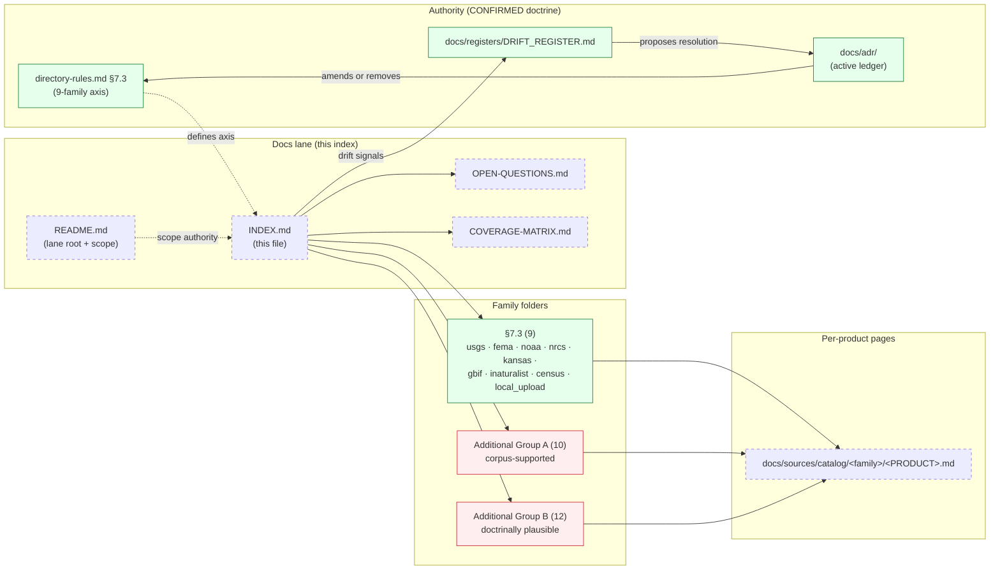

<!-- [KFM_META_BLOCK_V2]
doc_id: kfm://doc/docs-sources-catalog-index
title: Source catalog lane index
type: register
version: v0.2
status: draft
owners: <PLACEHOLDER — Docs steward · Source steward · Per-family stewards>
created: 2026-05-20
updated: 2026-05-23
policy_label: public
related:
  - docs/sources/catalog/README.md
  - docs/sources/catalog/OPEN-QUESTIONS.md
  - docs/sources/catalog/COVERAGE-MATRIX.md
  - docs/sources/catalog/RIGHTS-AND-SENSITIVITY-MAP.md
  - docs/doctrine/directory-rules.md
  - docs/registers/DRIFT_REGISTER.md
tags: [kfm, docs, sources, catalog, register, index, navigation]
notes:
  - "v0.2 — full presentation-standard pass; 22 additional families annotated with corpus-support evidence (where present) and overlap/clarification flags; drift surfaced into Drift Register entries DRIFT-IDX-01..03 rather than smoothed."
  - "PROPOSED scaffold; sibling-link presence verified in a prior Claude Code session, not in this session."
  - "Family axis: 9 CONFIRMED per directory-rules.md §7.3; 22 PROPOSED additions pending ADR (OPEN-DSC-09..14)."
  - "Counts (92 product pages 2026-05-20; +31 on 2026-05-21 → 123 across 31 family folders) preserved from prior-session enumeration. NEEDS VERIFICATION this session."
  - "Two within-axis overlap signals: usda ↔ nrcs (NRCS is part of USDA); manual_curation ↔ local_upload (admission posture overlap)."
[/KFM_META_BLOCK_V2] -->

# Source catalog lane index

> Navigation index for source families documented in the `docs/sources/catalog/` lane — a register, not a doctrinal family list.

**Status:** scaffold (PROPOSED) · **Type:** register *(docs lane; not authority)* · **Last reviewed:** 2026-05-23

---

## Quick jump

- [Purpose](#purpose)
- [Authority pointer](#authority-pointer)
- [§7.3 family index (CONFIRMED 9)](#73-family-index-confirmed-9)
- [Additional families beyond §7.3 (PROPOSED 22 — pending ADR)](#additional-families-beyond-73-proposed-22--pending-adr)
- [Family count summary](#family-count-summary)
- [Within-axis overlap signals](#within-axis-overlap-signals)
- [Where this index sits](#where-this-index-sits)
- [Cross-cutting docs in this lane](#cross-cutting-docs-in-this-lane)
- [Maintenance rules](#maintenance-rules)
- [Open questions](#open-questions)
- [Related docs](#related-docs)

---

## Purpose

This index answers two questions:

1. **What family folders exist under `docs/sources/catalog/`?**
2. **For each, where is the family page and how many product pages does it contain?**

> [!IMPORTANT]
> This index is a **navigation aid**. It does **not** decide the authoritative family axis. The authoritative source-family list lives in [`docs/doctrine/directory-rules.md`](../../doctrine/directory-rules.md) **§7.3** *(nine families: `usgs`, `fema`, `noaa`, `nrcs`, `kansas`, `gbif`, `inaturalist`, `census`, `local_upload`)*. Where the lane has grown additional folders beyond §7.3, the divergence is **flagged here and surfaced into the Drift Register** — not smoothed over. *(Doctrine: `directory-rules.md` §2.4 ADR-required changes; §2.5 do not silently conform.)*

> [!NOTE]
> As of **2026-05-20** the lane uses a **per-family folder layout** — each source family has its own folder with a `README.md` plus one Markdown page per product *(see [`README.md`](./README.md) §8)*. The earlier flat `<family>.md` pages were reorganized into these folders.

[Back to top](#quick-jump)

---

## Authority pointer

| Concern | Where authority lives | Status |
|---|---|---|
| Authoritative source-family axis | [`docs/doctrine/directory-rules.md`](../../doctrine/directory-rules.md) §7.3 | **CONFIRMED — 9 families** |
| Lane scope statement | [`docs/sources/catalog/README.md`](./README.md) | **PROPOSED — sibling pointer** |
| Per-family narrative | `docs/sources/catalog/<family>/README.md` | **PROPOSED — per-folder pointer** |
| Per-product page | `docs/sources/catalog/<family>/<PRODUCT>.md` | **PROPOSED — convention** *(OPEN-CM-05)* |
| Cross-cutting open questions | [`docs/sources/catalog/OPEN-QUESTIONS.md`](./OPEN-QUESTIONS.md) | **PROPOSED** |
| Drift entries (out-of-§7.3 families) | [`docs/registers/DRIFT_REGISTER.md`](../../registers/DRIFT_REGISTER.md) | **CONFIRMED root** *(directory-rules.md §2.5)* |
| Connector lane (where actual ingest code lives) | [`connectors/`](../../../../connectors/) | **CONFIRMED root** *(directory-rules.md §7.3)* |

> [!CAUTION]
> Adding a family folder under `docs/sources/catalog/` does **not** admit that family to the doctrinal axis. The 22 additional folders below are documentation drafts; an ADR amending `directory-rules.md` §7.3 (or a migration removing the additional folders) is the **only** way to reconcile.

[Back to top](#quick-jump)

---

## §7.3 family index (CONFIRMED 9)

The nine families enumerated in [`directory-rules.md`](../../doctrine/directory-rules.md) §7.3 — the authoritative source-family axis.

| # | Family | Status | Family page | Product pages | Connector lane |
|---|---|---|---|---|---|
| 1 | `usgs` | draft | [`usgs/README.md`](./usgs/README.md) | 10 | [`connectors/usgs/`](../../../../connectors/usgs/) |
| 2 | `fema` | draft | [`fema/README.md`](./fema/README.md) | 5 | [`connectors/fema/`](../../../../connectors/fema/) |
| 3 | `noaa` | draft | [`noaa/README.md`](./noaa/README.md) | 8 | [`connectors/noaa/`](../../../../connectors/noaa/) |
| 4 | `nrcs` | draft | [`nrcs/README.md`](./nrcs/README.md) | 6 | [`connectors/nrcs/`](../../../../connectors/nrcs/) |
| 5 | `kansas` | draft | [`kansas/README.md`](./kansas/README.md) | 13 | [`connectors/kansas/`](../../../../connectors/kansas/) |
| 6 | `gbif` | draft | [`gbif/README.md`](./gbif/README.md) | 4 | [`connectors/gbif/`](../../../../connectors/gbif/) |
| 7 | `inaturalist` | draft | [`inaturalist/README.md`](./inaturalist/README.md) | 1 | [`connectors/inaturalist/`](../../../../connectors/inaturalist/) |
| 8 | `census` | draft | [`census/README.md`](./census/README.md) | 5 | [`connectors/census/`](../../../../connectors/census/) |
| 9 | `local_upload` | draft | [`local_upload/README.md`](./local_upload/README.md) | 1 | [`connectors/local_upload/`](../../../../connectors/local_upload/) |

**§7.3 subtotal: 53 product pages across 9 families** *(prior-session count; NEEDS VERIFICATION this session)*.

[Back to top](#quick-jump)

---

## Additional families beyond §7.3 (PROPOSED 22 — pending ADR)

These folders are **not** part of `directory-rules.md` §7.3 — fourteen from the 2026-05-20 reorganization and eight scaffolded 2026-05-21 from the `connectors/` inventory. **None of these are admitted to the family axis until an ADR amends §7.3.** Reference: `OPEN-DSC-09`–`OPEN-DSC-14` in [`OPEN-QUESTIONS.md`](./OPEN-QUESTIONS.md).

Per-family rows annotated with **corpus-support evidence** (where the doctrine corpus already references that source family) — this is decision-support for the reconciliation ADR, not admission.

### Group A — corpus-supported (PROPOSED; doctrine corpus already references)

These families appear in the KFM doctrine corpus by name or close paraphrase. The reconciliation ADR has explicit doctrinal motivation to admit them.

| Family | Family page | Product pages | Corpus support (CONFIRMED corpus reference) |
|---|---|---|---|
| `familysearch` | [`familysearch/README.md`](./familysearch/README.md) | 3 | Pass-10 C9-02 *(FamilySearch API — OAuth2-gated genealogy upstream)* |
| `ftdna` | [`ftdna/README.md`](./ftdna/README.md) | 4 | Pass-10 C9-03 *(DTC raw-genomic exports — 23andMe / Ancestry / MyHeritage / FamilyTreeDNA)* |
| `nasa` | [`nasa/README.md`](./nasa/README.md) | 4 | Hazards dossier `[DOM-HAZ]` *(NASA FIRMS active fire)*; Soil dossier `[DOM-SOIL]` *(NASA SMAP)* |
| `epa` | [`epa/README.md`](./epa/README.md) | 4 | Atmosphere dossier `[DOM-AIR]` *(EPA AQS-like archive)* |
| `openaq` | [`openaq/README.md`](./openaq/README.md) | 1 | Atmosphere dossier `[DOM-AIR]` *(OpenAQ-like aggregators)* |
| `idigbio` | [`idigbio/README.md`](./idigbio/README.md) | 4 | Pass-10 C4-03 *(named biodiversity consumer alongside GBIF, Symbiota)* |
| `loc` | [`loc/README.md`](./loc/README.md) | 5 | Pass-10 C7 authority cluster *(LCNAF — Library of Congress Name Authority File)* |
| `landfire` | [`landfire/README.md`](./landfire/README.md) | 1 | Habitat dossier `[DOM-HAB]` *(LandFire vegetation / fuel models — NEEDS VERIFICATION of exact card)* |
| `drought_monitor` | [`drought_monitor/README.md`](./drought_monitor/README.md) | 1 | Hazards / Agriculture cross-lane *(US Drought Monitor — NEEDS VERIFICATION of exact card)* |
| `usfws_ecos` | [`usfws_ecos/README.md`](./usfws_ecos/README.md) | 4 | Fauna dossier `[DOM-FAUNA]` sensitive-occurrence lane *(USFWS T&E listings — NEEDS VERIFICATION of exact card)* |

### Group B — doctrinally plausible (PROPOSED; not explicitly named in corpus this session)

These families have clear topical motivation but the doctrine corpus does not name them specifically in this session's searches. The reconciliation ADR should confirm or deny scope.

| Family | Family page | Product pages | Topical motivation (PROPOSED) |
|---|---|---|---|
| `blm` | [`blm/README.md`](./blm/README.md) | 5 | Federal land authority — Settlements / Roads / Geology cross-lane |
| `usda` | [`usda/README.md`](./usda/README.md) | 3 | USDA — broader than NRCS; **see overlap signal DRIFT-IDX-02** |
| `usdot` | [`usdot/README.md`](./usdot/README.md) | 7 | US DOT — Roads / Rail / Trade authority |
| `hifld` | [`hifld/README.md`](./hifld/README.md) | 1 | Homeland Infrastructure Foundation-Level Data — Settlements / Infrastructure |
| `isric` | [`isric/README.md`](./isric/README.md) | 1 | ISRIC SoilGrids — Soil (global) |
| `openstreetmap` | [`openstreetmap/README.md`](./openstreetmap/README.md) | 4 | OSM — Roads / Settlements / Hydrology |
| `natureserve` | [`natureserve/README.md`](./natureserve/README.md) | 2 | NatureServe — Conservation / Habitat |
| `ebird` | [`ebird/README.md`](./ebird/README.md) | 3 | Cornell eBird — Fauna |
| `eddmaps` | [`eddmaps/README.md`](./eddmaps/README.md) | 3 | EDDMapS — Flora (invasive species) |
| `newspapers` | [`newspapers/README.md`](./newspapers/README.md) | 4 | Newspaper sources — People / Archaeology *(Chronicling America likely)* |
| `ahgp` | [`ahgp/README.md`](./ahgp/README.md) | 5 | Genealogy — People / DNA / Land *(family name acronym NEEDS VERIFICATION)* |
| `manual_curation` | [`manual_curation/README.md`](./manual_curation/README.md) | 1 | Operator-curated — **see overlap signal DRIFT-IDX-03** |

**Additional-families subtotal: 70 product pages across 22 families** *(prior-session count; NEEDS VERIFICATION this session)*.

[Back to top](#quick-jump)

---

## Family count summary

| Metric | Value |
|---|---|
| §7.3 CONFIRMED families | **9** |
| Additional PROPOSED families (Group A — corpus-supported) | **10** |
| Additional PROPOSED families (Group B — doctrinally plausible) | **12** |
| **Total family folders** | **31** |
| §7.3 product pages | **53** *(prior-session count; NEEDS VERIFICATION)* |
| Additional-family product pages | **70** *(prior-session count; NEEDS VERIFICATION)* |
| **Total product pages** | **123** *(prior-session count; NEEDS VERIFICATION)* |
| Within-axis overlap signals | **2** *(see [Within-axis overlap signals](#within-axis-overlap-signals))* |

> [!NOTE]
> Counts preserve the prior-session enumeration *(2026-05-20 baseline of 92 + 2026-05-21 increment of 31)*. The 2026-05-21 increment was **19 product pages in eight new families + 12 product pages in `kansas` / `usgs` / `noaa`**. Synchronize the header badges (`families`, `product pages`, `drift`) whenever counts change.

[Back to top](#quick-jump)

---

## Within-axis overlap signals

Two within-axis overlap signals are surfaced for reconciliation, not silently smoothed.

| Drift ID | Overlap | Recommended treatment |
|---|---|---|
| **DRIFT-IDX-02** | `usda` *(additional)* vs `nrcs` *(§7.3)* — NRCS is an agency *within* USDA. Both folders existing as peers creates ambiguity: should NRCS products move under `usda/nrcs/`, or should `usda/` cover only non-NRCS USDA programs (Census of Agriculture, NASS, ERS, FSA, etc.)? | ADR clarifying USDA scope vs NRCS sub-scope; otherwise the placement question recurs on every USDA-adjacent product page. |
| **DRIFT-IDX-03** | `manual_curation` *(additional)* vs `local_upload` *(§7.3)* — both lanes appear to cover operator-curated content. Distinction unclear: is `manual_curation` for steward-authored / scholarly content while `local_upload` is for routine operator uploads? Or are they duplicates? | ADR clarifying the admission posture distinction; one may need to fold into the other. |

> [!IMPORTANT]
> Per `directory-rules.md` §2.5: when the lane state conflicts with itself or with doctrine, **do not silently conform**. Open a DRIFT_REGISTER entry and propose a resolution. This index points at the conflict; the Drift Register holds the conflict.

[Back to top](#quick-jump)

---

## Where this index sits

> [!NOTE]
> Green = CONFIRMED doctrine. Red = drift (additional families beyond §7.3). Dashed = PROPOSED docs-lane elements. The diagram shows that all 31 family folders point at per-product pages, but only the 9 §7.3 families are doctrinally admitted.

[Back to top](#quick-jump)

---

## Cross-cutting docs in this lane

| Doc | Status | Purpose |
|---|---|---|
| [`README.md`](./README.md) | **PROPOSED** | Lane root and authoritative scope statement |
| [`GLOSSARY.md`](./GLOSSARY.md) | **draft (v0.2)** | Term definitions across the catalog lane |
| [`CROSSWALKS.md`](./CROSSWALKS.md) | **draft (v0.2)** | Cross-format mappings register (STAC × DCAT / DwC / ISO 19115 / PROV-O / CIDOC-CRM) |
| [`PROFILES.md`](./PROFILES.md) | **PROPOSED** | KFM-STAC / DCAT / PROV profile pointers |
| [`IDENTITY.md`](./IDENTITY.md) | **draft (v0.2)** | Collection-id / item-id / namespace / `promoteId` conventions |
| [`NAMING.md`](./NAMING.md) | **PROPOSED** | Path and filename casing |
| [`RIGHTS-AND-SENSITIVITY-MAP.md`](./RIGHTS-AND-SENSITIVITY-MAP.md) | **PROPOSED** | Per-family rights summary |
| [`CARE-COMPLIANCE.md`](./CARE-COMPLIANCE.md) | **draft (v0.2)** | CARE governance fields and default-deny posture |
| [`COVERAGE-MATRIX.md`](./COVERAGE-MATRIX.md) | **draft (v0.2)** | Family × domain documentation coverage register |
| [`OPEN-QUESTIONS.md`](./OPEN-QUESTIONS.md) | **PROPOSED** | `OPEN-DSC-*` register (cross-cutting open questions) |
| [`CHANGELOG.md`](./CHANGELOG.md) | **PROPOSED** | Lane change history |

[Back to top](#quick-jump)

---

## Maintenance rules

> [!IMPORTANT]
> Docs are part of the working system. This index MUST update when the family axis advances, when a family folder is added, or when product pages land.

| Trigger | Action |
|---|---|
| **New family folder appears under `docs/sources/catalog/<family>/`** | Add the row to **Additional families Group A or B** depending on corpus support. Update family-count badge. Open a DRIFT_REGISTER entry referencing OPEN-DSC-09..14. |
| **ADR amends `directory-rules.md` §7.3 to admit a family** | Move the row from Additional → §7.3 family index. Bump §7.3 family count badge. Reference the resolving ADR in the meta block notes. |
| **ADR removes a family folder** | Delete the row; update counts; reference the resolving ADR. |
| **A product page lands under a family** | Increment the family's product-page count; update the total. |
| **A product page is removed** | Decrement counts. |
| **Within-axis overlap resolved** (DRIFT-IDX-02 or DRIFT-IDX-03) | Remove the overlap row from [Within-axis overlap signals](#within-axis-overlap-signals); reference the resolving ADR. |
| **Counts re-verified against mounted repo** | Update the "prior-session" qualifier in the count summary to the new verification date. |

**Versioning.** KFM Meta Block v2 semver-lite: `v0.x` while §7.3 / additional-families reconciliation is open; `v1.x` once the family axis is stable.

[Back to top](#quick-jump)

---

## Open questions

| ID | Question | Status |
|---|---|---|
| **OPEN-DSC-09** | The 14 additional families introduced in the 2026-05-20 reorganization — which advance to §7.3 admission, which fold into existing families, which are removed? | **OPEN — pending ADR** |
| **OPEN-DSC-10** | The 8 additional families scaffolded 2026-05-21 from the `connectors/` inventory — same question. *(NEEDS VERIFICATION: does `connectors/` itself contain these subfolders, or were they docs-lane authoring without connector-lane evidence?)* | **OPEN — pending ADR** |
| **OPEN-DSC-11** | Reconciliation precedence — when `connectors/` and `docs/sources/catalog/` disagree on family list, which leads? *(Doctrine signal: `connectors/` is the canonical connector root per `directory-rules.md` §7.3; docs lane is compatibility per §8.3.)* | **OPEN** |
| **OPEN-DSC-12** | Group A vs Group B distinction in v0.2 — should this register continue to annotate corpus-support, or is a flat "additional families" list sufficient once reconciliation is in flight? | **OPEN** |
| **OPEN-DSC-13** | `usda` vs `nrcs` scope overlap (DRIFT-IDX-02). | **OPEN — pending ADR** |
| **OPEN-DSC-14** | `manual_curation` vs `local_upload` posture overlap (DRIFT-IDX-03). | **OPEN — pending ADR** |
| **OPEN-DSC-19** *(new in v0.2)* | Product-page count automation — should the counts come from a `ls`-style sweep over the lane rather than hand-maintained? Mirrors OPEN-CM-07 in COVERAGE-MATRIX.md. | **OPEN** |
| **OPEN-DSC-20** *(new in v0.2)* | Per-family page layout — `docs/sources/catalog/<family>/<PRODUCT>.md` (CONFIRMED in this index's structure) vs flat `<family>-<product>.md` (the original 2026-05-20 layout). Need explicit ADR to lock this in. *(Intersects OPEN-CM-05.)* | **OPEN — pending ADR** |
| **OPEN-DSC-21** *(new in v0.2)* | Connector-lane mirror — should every family in this index have a corresponding `connectors/<family>/` folder, or is docs-lane authoring allowed to precede connector-lane scaffolding? | **OPEN** |

[Back to top](#quick-jump)

---

## Related docs

- [`docs/sources/catalog/README.md`](./README.md) — **lane root and authoritative scope** *(PROPOSED)*
- [`docs/sources/catalog/OPEN-QUESTIONS.md`](./OPEN-QUESTIONS.md) — full `OPEN-DSC-*` register
- [`docs/sources/catalog/COVERAGE-MATRIX.md`](./COVERAGE-MATRIX.md) — family × domain coverage
- [`docs/sources/catalog/RIGHTS-AND-SENSITIVITY-MAP.md`](./RIGHTS-AND-SENSITIVITY-MAP.md) — per-family rights summary
- [`docs/sources/catalog/CARE-COMPLIANCE.md`](./CARE-COMPLIANCE.md) — CARE field surfacing rules
- [`docs/sources/catalog/IDENTITY.md`](./IDENTITY.md) — identity and namespace conventions
- [`docs/sources/catalog/GLOSSARY.md`](./GLOSSARY.md) — term meanings
- [`docs/sources/catalog/CROSSWALKS.md`](./CROSSWALKS.md) — cross-format mappings register
- [`docs/doctrine/directory-rules.md`](../../doctrine/directory-rules.md) — placement authority *(§7.3 family list; §2.4 ADR-required changes; §2.5 do not silently conform; §8.3 compatibility roots)*
- [`connectors/`](../../../../connectors/) — canonical connector root
- [`docs/registers/DRIFT_REGISTER.md`](../../registers/DRIFT_REGISTER.md) — drift entries (DRIFT-IDX-01..03)
- [`docs/adr/`](../../adr/) — ADRs resolving drift entries

---

*Doc status: **draft · register (v0.2)** · Last reviewed: **2026-05-23** · Provenance: revised against `directory-rules.md` §7.3, Pass-10 corpus references for each Group-A family, KFM Repository Structure Guiding Document `connectors/` enumeration; no mounted-repo evidence in this session.*

[↑ Back to top](#source-catalog-lane-index)
